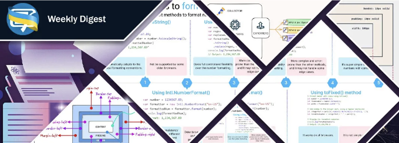

# 웹 개발

- 웹 구성 요소에서 HTML 변경에 대한 응답
- 주요 스니펫을 위한 웹사이트 콘텐츠 최적화 방법
- 응용 프로그램 현대화: 점진적 전환을 위한 계획
- 우리는 인터넷이 죽고 있는 것을 지켜보고 있는가?
- 현대 웹 개발에서 디자인 토큰의 가치
- AI 시대와 SEO 하락 시대의 웹사이트 미래
- React Three Fiber로 상호작용하는 3D 프포효 텍스트 효과 만들기

- 접근성
   - 브라우저에서 수행하는 팝오버 접근성: 브라우저가 어떤 일을 하지 않는지
   - 가상 클래스를 사용한 접근성 있는 양식

<!-- ui-log 수평형 -->
<ins class="adsbygoogle"
  style="display:block"
  data-ad-client="ca-pub-4877378276818686"
  data-ad-slot="9743150776"
  data-ad-format="auto"
  data-full-width-responsive="true"></ins>
<component is="script">
(adsbygoogle = window.adsbygoogle || []).push({});
</component>

# CSS

- CSS에서 픽셀과 (r)ems를 넘어서 — 절대 길이 단위
- 박스 모델과 박스 크기 조정
- Chill 스크롤 스냅: 기사 헤더
- 수직 폼 컨트롤 구현하기
- 안녕하세요 SASS 👋, 네이티브 CSS 다시 환영합니다

# JavaScript

- 왕에게찬양을: 왜 JavaScript가 최고인가
- Node.js와 htmx를 사용하여 전체 스택 앱 만들기
- 웹소켓 vs 서버-전송-이벤트 vs 롱-폴링 vs WebRTC vs WebTransport
- 큰 숫자, 걱정 없이: 쉼표로 숫자 형식 지정하기
- OpenTelemetry 실전가이드: 추적용 JavaScript 앱 계측
- 재미와 이윤을 위한 JavaScript 최적화
- Kuto, 역 JS 번들러

<!-- ui-log 수평형 -->
<ins class="adsbygoogle"
  style="display:block"
  data-ad-client="ca-pub-4877378276818686"
  data-ad-slot="9743150776"
  data-ad-format="auto"
  data-full-width-responsive="true"></ins>
<component is="script">
(adsbygoogle = window.adsbygoogle || []).push({});
</component>

- 리액트
  - MistCSS — CSS만을 이용하여 아토믹한 React 컴포넌트를 작성하세요! (JS-from-CSS™)
  - 리액트 컴파일러의 유형 시스템
  - Vitest를 사용하여 리액트 사용자 정의 후크 및 컴포넌트를 테스트하는 방법
  - react-to-print를 사용하여 인쇄 가능한 문서 생성하기
  - Catalyst, Tailwind의 리액트용 UI 킷 탐구하기
  - Next.js가 리액트 기초를 어떻게 파괴하는지 (예시들)
  
- 뷰
  - PDF.js, vue3-pdf-app 등을 사용하여 Vue.js용 PDF 뷰어 만들기
  - Vue.js에서 프롭 드릴링 피하기와 수정하는 방법
  
- 앵귤러
  - NativeScript로 앵귤러 사용: 블랙아웃 조명 콘솔 만들기
  - RouteReuseStrategy를 활용하여 앵귤러 앱 성능 향상하기
  - 앵귤러 신호: 모범 사례
  - 신화적인 앵귤러 — 신호 입력 제한 사항에 관해 우리가 아는 것들