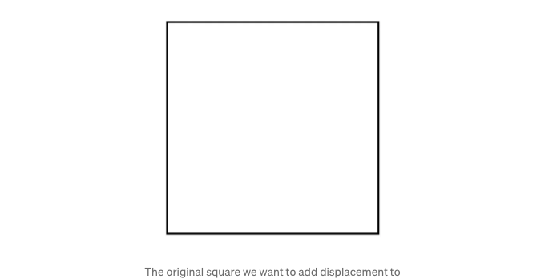

최근에 FlutterCon Berlin 2023에서 저는 Flutter에서 저수준 API를 사용하여 애니메이션을 만드는 방법에 대해 강의를 했어요. 강의를 준비하면서 컨텐츠는 예술, 특히 생성적 예술과 그 기술적 역사에 관한 것으로 발전했어요.


저는 Vera Molnar에 큰 영감을 받았어요. 그녀는 프랑스를 기반으로 하는 훌륭한 헝가리 예술가로, 90대에 이르러서도 작품을 만들고 있어요. 그녀는 컴퓨터 생성 생성적 예술의 선구자 중 한 명으로 여겨져요.

어린 시절부터 Molnar는 무작위성에 매료되었으며, 알고리즘을 사용하여 예술 작품을 렌더링하는 초기의 채택자 중 한 명이었어요. 컴퓨터 생성 예술이 비인간화되었다고 주장되고 그 신뢰성이 매우 의심스러워지는 시기에, 그녀는 기계의 무작위성과 효율적으로 많은 출력물을 생산하는 능력과 함께 작업한다는 것은 이러한 주장의 반대 증거임을 주장했어요.

<!-- ui-log 수평형 -->
<ins class="adsbygoogle"
  style="display:block"
  data-ad-client="ca-pub-4877378276818686"
  data-ad-slot="9743150776"
  data-ad-format="auto"
  data-full-width-responsive="true"></ins>
<component is="script">
(adsbygoogle = window.adsbygoogle || []).push({});
</component>


컴퓨터와 함께 작업할 때는 자신의 상상력과 더 가까운 연결을 이루기 위한 도구로 사용한다는 것이죠. 당신은 창의력과 호기심을 발휘하여 자신을 표현할 수 있으며, 수동 노동이 제공할 수 있는 것보다 탐구할 공간이 훨씬 많은 매체를 활용하고 있습니다.

몰나의 생성 예술 작품을 제작하기 위한 방법과 장비는 시간이 흘러도 계속 발전해 왔습니다. 실제로, 컴퓨터에 액세스할 수 있는 것보다 10년 이상 전에, 그녀는 이미 "생성적" 예술을 창조하고 있었습니다.

생성적 예술이란 아티스트가 천연 언어 규칙 세트, 컴퓨터 프로그램 또는 기계와 같은 시스템을 활용한 다음, 일정한 자율성으로 작동하도록 하는 모든 예술적 실천을 말합니다.

<!-- ui-log 수평형 -->
<ins class="adsbygoogle"
  style="display:block"
  data-ad-client="ca-pub-4877378276818686"
  data-ad-slot="9743150776"
  data-ad-format="auto"
  data-full-width-responsive="true"></ins>
<component is="script">
(adsbygoogle = window.adsbygoogle || []).push({});
</component>

50년대에 그녀는 우리에게 "Machine Imaginere" 또는 상상 속 기계라는 용어를 소개했습니다. 그녀는 수학의 기본 원리와 주사위를 굴리는 등의 아날로그 '랜덤 생성기'를 사용했습니다. 이렇게 하여 그녀는 그림의 순서를 '생성'하고, 한 번에 한 개의 매개변수를 수정했습니다. 그녀는 그 다양한 변형을 세심하게 수작업으로 제작했습니다.


컴퓨터에 접근한 후, 그녀는 처음에는 스크린조차 없는 IBM 메인프레임과 작업했습니다. 더 발전된 시스템으로 전환하면서, 그녀는 BASIC 및 Fortran과 같은 프로그래밍 언어를 사용하여 기계에 특정 명령을 전달했습니다. 이 명령은 연결된 펜 플로터를 제어하는 데 사용되었습니다. 펜 플로터는 이 코드를 그림으로 번역하기 위해 잉크 펜과 로봇 팔을 이용했습니다.


<!-- ui-log 수평형 -->
<ins class="adsbygoogle"
  style="display:block"
  data-ad-client="ca-pub-4877378276818686"
  data-ad-slot="9743150776"
  data-ad-format="auto"
  data-full-width-responsive="true"></ins>
<component is="script">
(adsbygoogle = window.adsbygoogle || []).push({});
</component>

저는 코드로 그리기가 얼마나 오래된 것인지, 그리고 Molnar와 많은 다른 뛰어난 예술가들이 제한된 기술로는 상상할 수 없는 예술 작품을 구성하고 있다는 사실을 알게 되었을 때 정말 매혹을 느꼈습니다.


오늘날에는 최신 기술을 활용하여 탁월한 예술 작품들이 생산되고 있으며, Flutter는 크로스 플랫폼 기능과 쉽게 다룰 수 있는 API를 통해 이러한 작품에 적합한 훌륭한 도구가 될 수 있습니다.

<!-- ui-log 수평형 -->
<ins class="adsbygoogle"
  style="display:block"
  data-ad-client="ca-pub-4877378276818686"
  data-ad-slot="9743150776"
  data-ad-format="auto"
  data-full-width-responsive="true"></ins>
<component is="script">
(adsbygoogle = window.adsbygoogle || []).push({});
</component>

Vera Molnar의 예술 스타일과 아이디어에 영감을 받아, Flutter의 CustomPainter 및 Canvas API를 탐험하여 창의적인 예술의 기본 원칙을 알아보고, 애니메이션을 도입하여 우리의 작품을 생동감 있게 만들어 보겠습니다.

코딩을 시작해봅시다! 👩🏻‍💻

# Flutter의 CustomPainter & Canvas API

CustomPainter 및 Canvas API를 탐험하여 화면에 자유롭게 그림을 그리기 시작할 수 있습니다. Widget의 build 메서드에 CustomPaint 위젯을 추가하고, CustomPainter 구현체를 제공해 주면 됩니다.

<!-- ui-log 수평형 -->
<ins class="adsbygoogle"
  style="display:block"
  data-ad-client="ca-pub-4877378276818686"
  data-ad-slot="9743150776"
  data-ad-format="auto"
  data-full-width-responsive="true"></ins>
<component is="script">
(adsbygoogle = window.adsbygoogle || []).push({});
</component>

```dart
@override
Widget build(BuildContext context) {
  return CustomPaint(
    painter: SquareCustomPainter(),
  );
}

class SquareCustomPainter extends CustomPainter {
  //...
}
```

`CustomPainter` 구현체는 두 가지 메소드를 오버라이드합니다. `paint` 메소드는 Canvas를 사용하여 그림을 그리는 곳이며, `shouldRepaint` 메소드는 Canvas를 업데이트해야 할 때를 지정합니다. 우리는 일단 false를 반환할 수 있습니다.

```dart
class SquareCustomPainter extends CustomPainter {
  @override
  void paint(Canvas canvas, Size size) {
    //...
  }

  @override
  bool shouldRepaint(covariant SquareCustomPainter oldDelegate) {
    return false;  
  }
}
```

간단히 시작해서 `paint` 메소드 안에서 canvas의 `drawRect` API를 사용하여 직사각형을 그려보겠습니다.

<!-- ui-log 수평형 -->
<ins class="adsbygoogle"
  style="display:block"
  data-ad-client="ca-pub-4877378276818686"
  data-ad-slot="9743150776"
  data-ad-format="auto"
  data-full-width-responsive="true"></ins>
<component is="script">
(adsbygoogle = window.adsbygoogle || []).push({});
</component>

```js
@override
void paint(Canvas canvas, Size size) {
  canvas.drawRect();
}
```

사각형을 그릴 수 있는 여러 가지 방법이 있습니다. 예를 들어 Rect.fromCenter를 사용하면 사각형의 중심 오프셋과 너비 및 높이를 제공하여 사각형을 그릴 수 있습니다. 여기서는 캔버스의 중심을 사용하여 사각형을 가운데 정렬하고 있습니다.

```js
@override
void paint(Canvas canvas, Size size) {
  final center = Offset(
    size.width / 2, 
    size.height / 2
  );

  canvas.drawRect(
    Rect.fromCenter(
      center: center,
      width: size.shortestSide * 0.8,
      height: size.shortestSide * 0.8,
    ),
    /* ... */,
  );
}
```

그런 다음 Paint 객체를 추가할 수 있습니다. 이 Paint 객체를 통해 다음과 같은 속성을 지정할 수 있습니다:```

<!-- ui-log 수평형 -->
<ins class="adsbygoogle"
  style="display:block"
  data-ad-client="ca-pub-4877378276818686"
  data-ad-slot="9743150776"
  data-ad-format="auto"
  data-full-width-responsive="true"></ins>
<component is="script">
(adsbygoogle = window.adsbygoogle || []).push({});
</component>

- 테이블 태그를 마크다운 형식으로 변경합니다.

- PaintingStyle.stroke 또는 PaintingStyle.fill 열거형 값을 취하는 스타일입니다. 이 값으로 페인트 스타일을 지정할 수 있습니다.
- 색상은 제공한 스타일에 따라 채우기(fill) 또는 스트로크(stroke)에 적용됩니다.
- stroke 스타일의 경우에는 strokeWidth도 지정할 수 있습니다.

```js
@override
void paint(Canvas canvas, Size size) {
  final paint = Paint()
    ..color = Colors.black
    ..style = PaintingStyle.stroke
    ..strokeWidth = 3;

  final center = Offset(
    size.width / 2, 
    size.height / 2
  );

  canvas.drawRect(
    Rect.fromCenter(
      center: center,
      width: size.shortestSide * 0.8,
      height: size.shortestSide * 0.8,
    ),
    paint,
  );
}
```

결과:


<!-- ui-log 수평형 -->
<ins class="adsbygoogle"
  style="display:block"
  data-ad-client="ca-pub-4877378276818686"
  data-ad-slot="9743150776"
  data-ad-format="auto"
  data-full-width-responsive="true"></ins>
<component is="script">
(adsbygoogle = window.adsbygoogle || []).push({});
</component>

플러터 문서에서는 여러분에게 직사각형을 만드는 다양한 API의 작동 방식을 보여주는 유용한 이미지를 제공합니다:


`fromPoints` API를 또 다른 예로 사용해 봅시다:

```js
@override
void paint(Canvas canvas, Size size) {
  final paint = Paint()
    ..color = Colors.black
    ..style = PaintingStyle.stroke
    ..strokeWidth = 3;

  final side = size.shortestSide * 0.8;

  canvas.drawRect(
    Rect.fromPoints(
      Offset.zero,
      Offset(side, side),
    ),
    paint,
  );
}
```

<!-- ui-log 수평형 -->
<ins class="adsbygoogle"
  style="display:block"
  data-ad-client="ca-pub-4877378276818686"
  data-ad-slot="9743150776"
  data-ad-format="auto"
  data-full-width-responsive="true"></ins>
<component is="script">
(adsbygoogle = window.adsbygoogle || []).push({});
</component>

알아보았을 때, 사각형이 가운데가 아닌 왼쪽 상단에 배치된 결과를 보게 될 것입니다. 이것은 캔버스 작업 시 중요한 개념으로 이어집니다.

## 캔버스 API를 사용하여 중앙에 정렬하기

캔버스를 CustomPainter를 사용하거나 다른 방법(사용자 지정 RenderObjects와 같은 방법)으로 렌더링할 때, 해당 캔버스는 그것을 포함하는 위젯의 왼쪽 상단에 위치하게 되며, 어떤 오프셋이나 변환을 수행하더라도 이는 왼쪽 상단의 0에서 0인 지점을 기준으로 이루어집니다.


<!-- ui-log 수평형 -->
<ins class="adsbygoogle"
  style="display:block"
  data-ad-client="ca-pub-4877378276818686"
  data-ad-slot="9743150776"
  data-ad-format="auto"
  data-full-width-responsive="true"></ins>
<component is="script">
(adsbygoogle = window.adsbygoogle || []).push({});
</component>

그래서 가운데에 그림을 그리고 싶다면 다음과 같이 해야 해요:

- 우선 canvas.save()를 사용해 현재 캔버스 상태를 저장합니다.
- 캔버스를 중심 오프셋으로 이동시킵니다.
- 그림을 그립니다.
- canvas.restore()를 사용해 캔버스를 재설정합니다.

```js
canvas.save(); // 1
canvas.translate(center.dx, center.dy); // 2
canvas.drawRect( // 3
  Rect.fromPoints(
    Offset(-side / 2, -side / 2),
    Offset(side / 2, side / 2),
  ),
  paint,
);
canvas.restore(); // 4
```


<!-- ui-log 수평형 -->
<ins class="adsbygoogle"
  style="display:block"
  data-ad-client="ca-pub-4877378276818686"
  data-ad-slot="9743150776"
  data-ad-format="auto"
  data-full-width-responsive="true"></ins>
<component is="script">
(adsbygoogle = window.adsbygoogle || []).push({});
</component>

# 창조적인 아트 도구

창조적인 작품을 만드는 데는 몇 가지 도구가 관련되어 있는데, 저희는 캔버스 API를 사용하여 이러한 도구들을 구현할 때 간략히 언급하고 싶습니다.

# 타일링 — 창조적인 아트 도구 #1

벽에 타일을 깔듯이, 여러분은 작품의 조각들을 가로와 세로로 반복하여 타일을 만들어나갈 수 있습니다. 이전에 만든 사각형에 타일링을 소개해봅시다. 캔버스 위에 그리드 형태로 사각형을 만들어봄으로써 가로 및 세로로 배치된 사각형의 수를 계산하여 단순한 for 루프를 이용해 사각형을 그립니다. 이를 위해 CustomPainter를 포함하는 위젯 내에 사각형이 들어갈 수 있는 수를 계산하고, CustomPainter의 paint 메서드를 통해 그 위젯의 크기에 접근할 수 있습니다.

<!-- ui-log 수평형 -->
<ins class="adsbygoogle"
  style="display:block"
  data-ad-client="ca-pub-4877378276818686"
  data-ad-slot="9743150776"
  data-ad-format="auto"
  data-full-width-responsive="true"></ins>
<component is="script">
(adsbygoogle = window.adsbygoogle || []).push({});
</component>

그림을 중앙에 맞추기 위해 오프셋을 얼마나 설정해야 하는지도 계산할 거예요.

```js
@override
void paint(Canvas canvas, Size size) {
  final xCount = ((size.width + gap) / (side + gap)).floor();
  final yCount = ((size.height + gap) / (side + gap)).floor();
    
  final contentSize = Size(
    (xCount * side) + ((xCount - 1) * gap),
    (yCount * side) + ((yCount - 1) * gap),
  );
  
  final offset = Offset(
    (size.width - contentSize.width) / 2,
    (size.height - contentSize.height) / 2,
  );
  
  canvas.save();
  canvas.translate(offset.dx, offset.dy);
  
  for (int index = 0; index < totalCount; index++) {
    int i = index ~/ yCount;
    int j = index % yCount;
  
    canvas.drawRect(
      Rect.fromLTWH(
        (i * (side + gap)),
        (j * (side + gap)),
        side,
        side,
      ),
      paint,
    );
  }
  canvas.restore();
}
```

결과:


<!-- ui-log 수평형 -->
<ins class="adsbygoogle"
  style="display:block"
  data-ad-client="ca-pub-4877378276818686"
  data-ad-slot="9743150776"
  data-ad-format="auto"
  data-full-width-responsive="true"></ins>
<component is="script">
(adsbygoogle = window.adsbygoogle || []).push({});
</component>

# 재귀 — 창조적인 아트 도구 #2

재귀의 프로그래밍 능력을 활용하여 중첩으로 계속해서 나타나는 예술 요소를 만들면, 캔버스에서 선과 모양을 다루는 끝없는 가능성이 생깁니다. 정사각형 그리드에 대해서, Vera Molnar의 작품 중 하나에서 영감받은 방식으로 재귀를 구현할 것입니다.

canvas.drawRect() 메소드를 사용하여 사각형을 그리는 재귀 함수를 구현하고, 각 재귀 호출마다 변화된 변의 길이로 사각형을 계속 그립니다. 지정된 최소 길이에 도달할 때까지 계속합니다.

```js
// Paint method
for (int index = 0; index < totalCount; index++) {
  int i = index ~/ yCount;
  int j = index % yCount;

  drawNestedSquares( // 재귀적으로 사각형을 그림
    canvas,
    Offset(
      (i * (sideLength + gap)),
      (j * (sideLength + gap)),
    ),
    sideLength,
    paint,
  );
}
```

<!-- ui-log 수평형 -->
<ins class="adsbygoogle"
  style="display:block"
  data-ad-client="ca-pub-4877378276818686"
  data-ad-slot="9743150776"
  data-ad-format="auto"
  data-full-width-responsive="true"></ins>
<component is="script">
(adsbygoogle = window.adsbygoogle || []).push({});
</component>

재귀 함수:

```js
void drawNestedSquares(
  Canvas canvas,
  Offset start,
  double side,
  Paint paint,
) {
  if (sideLength < minSideLength) return;
  canvas.drawRect(
    Rect.fromLTWH(
      start.dx,
      start.dy,
      side,
      side,
    ),
    paint,
  );
  final nextSideLength = side * 0.8;
  final nextStart = Offset(
    start.dx + side / 2 - nextSideLength / 2,
    start.dy + side / 2 - nextSideLength / 2,
  );
  drawNestedSquares(canvas, nextStart, nextSideLength, paint);
}
```

지금까지의 결과:


<!-- ui-log 수평형 -->
<ins class="adsbygoogle"
  style="display:block"
  data-ad-client="ca-pub-4877378276818686"
  data-ad-slot="9743150776"
  data-ad-format="auto"
  data-full-width-responsive="true"></ins>
<component is="script">
(adsbygoogle = window.adsbygoogle || []).push({});
</component>

# 랜덤성 - 창조적인 예술 도구 #3

베라 몰나르에 영감을 받은 작업이라면 가장 매료되었던 랜덤성을 제외한 것은 없을 것입니다. 실제로 랜덤성은 매혹적인 결과물을 만들어낼 수 있는 강력한 도구입니다.

여기에서 랜덤성을 도입하는 몇 가지 방법이 있습니다:

- 재귀 함수 내 다음 정사각형의 변의 길이를 랜덤화합니다.
- 결국 가장 작은 정사각형의 크기를 랜덤화할 랜덤한 깊이 값을 도입합니다.

<!-- ui-log 수평형 -->
<ins class="adsbygoogle"
  style="display:block"
  data-ad-client="ca-pub-4877378276818686"
  data-ad-slot="9743150776"
  data-ad-format="auto"
  data-full-width-responsive="true"></ins>
<component is="script">
(adsbygoogle = window.adsbygoogle || []).push({});
</component>

```js
void drawNestedSquares(
  Canvas canvas,
  Offset start,
  double side,
  Paint paint,
  int depth, // ⬅️
) {
  if (side < minSideLength || depth <= 0) return;
  canvas.drawRect(
    Rect.fromLTWH(
      start.dx,
      start.dy,
      side,
      side,
    ),
    paint,
  );
  final nextSideLength = side * (random.nextDouble() * 0.5 + 0.5); // ⬅️

  final nextStart = Offset(
    start.dx + side / 2 - nextSideLength / 2,
    start.dy + side / 2 - nextSideLength / 2,
  );
  drawNestedSquares(canvas, nextStart, nextSideLength, paint, depth - 1);
}
```

결과:


## Widgetbook 및 입력 매개변수 실험하기
```

<!-- ui-log 수평형 -->
<ins class="adsbygoogle"
  style="display:block"
  data-ad-client="ca-pub-4877378276818686"
  data-ad-slot="9743150776"
  data-ad-format="auto"
  data-full-width-responsive="true"></ins>
<component is="script">
(adsbygoogle = window.adsbygoogle || []).push({});
</component>

처음부터 생성 예술가들이 하는 것과 비슷하게, 여러 매개변수를 시스템 입력값으로 설정하고 무작위 값이 아닌 값으로 실험해보면서 상상한 대로 조합하는 것이 가능합니다. 혹은 더 나아가, 우연히 상상 이상의 효과를 발견할 수도 있습니다!

Flutter에서 이를 빠르고 쉽게 수행하려면 Widgetbook 패키지를 사용하고 별도의 main.widgetbook.dart 파일을 설정하여 별도의 Flutter 앱을 실행할 수 있게 했습니다. 이 Widgetbook 앱에서 제작한 작품의 다양한 입력 매개변수를 테스트할 수 있는 기능 외에도, 모든 작품 위젯의 목록을 생성하고 작품을 제작하는 동안 쉽게 액세스할 수 있습니다.

프로젝트에서 Widgetbook을 설정하는 것은 문서를 따라하기만 하면 쉬울 것입니다. 이 글에서 중요한 것은 노브(Knobs) 기능입니다. 이를 통해 몇 가지 개념을 설명하고 시스템 입력값을 실험하는 데 사용할 것입니다.

예를 들어, 무작위 재귀적인 사각형을 고려해보면, 격자 간격이 0이라면 어떻게 보일까요? 사각형이 더 두껍거나, 더 작거나, 더 크다면 어떻게 변할까요? 이 모든 것을 실험해보고 위젯의 노브(knobs)를 사용하여 즉시 결과를 확인할 수 있습니다:

<!-- ui-log 수평형 -->
<ins class="adsbygoogle"
  style="display:block"
  data-ad-client="ca-pub-4877378276818686"
  data-ad-slot="9743150776"
  data-ad-format="auto"
  data-full-width-responsive="true"></ins>
<component is="script">
(adsbygoogle = window.adsbygoogle || []).push({});
</component>

```js
WidgetbookUseCase(
  name: 'Randomized',
  builder: (context) {
    return RandomizedRecursiveSquaresGrid(
        gap: context.knobs.double.slider( // ⬅️
          label: '간격',
          initialValue: 5,
          min: 0,
          max: 50,
        ),
        // ...
      );
  },
)
```

다음은 이것이 어떻게 보일지에 대한 미리보기입니다:


좋아요, 흑백은 조금 지루하죠. 조금 색상을 넣어 봅시다!```

<!-- ui-log 수평형 -->
<ins class="adsbygoogle"
  style="display:block"
  data-ad-client="ca-pub-4877378276818686"
  data-ad-slot="9743150776"
  data-ad-format="auto"
  data-full-width-responsive="true"></ins>
<component is="script">
(adsbygoogle = window.adsbygoogle || []).push({});
</component>

# 색상

베라 몰나가 컴퓨터로 만든 예술을 처음 시작할 때에는, 색이 없는 펜 플로터 기계를 사용했습니다 (아래 이미지에 있는 장치의 오래된 버전). 그래서 그녀는 그림을 그리고 나서 손으로 색칠했습니다. 그녀는 색을 추가하기 위해 여러 재료로 실험을 하였고, 어느 순간에는 심지까지 사용했다고 합니다!


다행히도, 우리는 플러터의 Color 클래스가 있어서 그럴 필요가 없습니다.

<!-- ui-log 수평형 -->
<ins class="adsbygoogle"
  style="display:block"
  data-ad-client="ca-pub-4877378276818686"
  data-ad-slot="9743150776"
  data-ad-format="auto"
  data-full-width-responsive="true"></ins>
<component is="script">
(adsbygoogle = window.adsbygoogle || []).push({});
</component>

## 색상을 무작위로 설정하는 것이 조금 까다롭다!

하지만 실제로 색상을 무작위로 설정하려면 조금 까다로워질 수 있습니다. 간단하고 직관적인 해결책은 무작위로 선택할 색상 목록을 갖는 것입니다. 하지만 이것만으로는 흥미로운 결과를 얻기 힘들고 더 좋은 방법이 있습니다!

한 가지 생각해 볼 수 있는 초기 대안은 색상의 RGB 형식에서 R, G 및/또는 B 값을 무작위로 설정하는 것일 수 있습니다. 그러나 다음 GIF에서 보는 바와 같이 이렇게 하면 그리 멋진 색상이나 풍부한 색상이 생성되지 않습니다.

```js
Color.fromARGB(a, r, g, b)
```

<!-- ui-log 수평형 -->
<ins class="adsbygoogle"
  style="display:block"
  data-ad-client="ca-pub-4877378276818686"
  data-ad-slot="9743150776"
  data-ad-format="auto"
  data-full-width-responsive="true"></ins>
<component is="script">
(adsbygoogle = window.adsbygoogle || []).push({});
</component>


가장 좋은 대안은 HSL 값(색조, 채도 및 밝기)을 사용하는 것입니다. 단순히 채도와 밝기를 원하는 고정 값으로 설정한 다음 색조 값을 무작위로 지정하여 색상 스펙트럼을 통해 고정 값 사용하여 수정할 수 있는 색조 값을 통해 다양한 색상 팔레트를 무작위로 선택할 수 있습니다.

```js
HSLColor.fromAHSL(a, h /* 무작위 값 */, s, l).toColor()
```


<!-- ui-log 수평형 -->
<ins class="adsbygoogle"
  style="display:block"
  data-ad-client="ca-pub-4877378276818686"
  data-ad-slot="9743150776"
  data-ad-format="auto"
  data-full-width-responsive="true"></ins>
<component is="script">
(adsbygoogle = window.adsbygoogle || []).push({});
</component>

이제 이전 작품에 무작위 색상을 도입한다면 다음 결과를 얻을 수 있습니다:


색조 값을 무작위로 조정하면 조절 다이얼을 사용하여 채도 및 밝기 값을 원하는대로 조정할 수 있으며 작품의 색상의 풍부함과 밝기를 수정할 수 있습니다:


<!-- ui-log 수평형 -->
<ins class="adsbygoogle"
  style="display:block"
  data-ad-client="ca-pub-4877378276818686"
  data-ad-slot="9743150776"
  data-ad-format="auto"
  data-full-width-responsive="true"></ins>
<component is="script">
(adsbygoogle = window.adsbygoogle || []).push({});
</component>

🔗 이 결과의 전체 코드는 다음과 같습니다

# Displacement — 창의적인 예술 도구 #4

창의적인 예술에 있어서 혼돈은 좋은 것입니다! 그리고 우리는 또다른 유용한 도구, 변위를 활용하여 예술작품에 혼돈을 던질 수 있습니다.

예를 들어, 원래의 정사각형으로 돌아가보면, 각 모서리를 원래 위치에서 무작위 거리만큼 이동하여 무작위 다각형을 만들고 싶다고 말할 수 있습니다. 이렇게 하면 변위와 무작위성을 결합하여 더 깊은 수준의 혼돈을 만들어낼 수 있습니다.

<!-- ui-log 수평형 -->
<ins class="adsbygoogle"
  style="display:block"
  data-ad-client="ca-pub-4877378276818686"
  data-ad-slot="9743150776"
  data-ad-format="auto"
  data-full-width-responsive="true"></ins>
<component is="script">
(adsbygoogle = window.adsbygoogle || []).push({});
</component>

<pre>


시작하기 위해, drawPoints를 사용하여 원래 사각형 점을 그릴 수 있습니다. (drawRect은 균일한 사각형만을 그릴 수 있습니다)

```js
// 페인트 메소드
canvas.drawPoints(
  PointMode.polygon,
  [
    topLeft, // 오프셋
    topRight, // 오프셋
    bottomRight, // 오프셋
    bottomLeft, // 오프셋
    topLeft, // 오프셋
  ],
  paint,
);
```

여기서 topLeft, topRight 등은 정사각형 변의 길이와 캔버스 중심 오프셋에 기반한 사전 계산된 오프셋입니다. 이제 이러한 점들을 미리 정의된 maxCornersOffset 변수의 음수와 양수 값 사이의 랜덤 범위 내에서 오프셋합니다.
</pre>

<!-- ui-log 수평형 -->
<ins class="adsbygoogle"
  style="display:block"
  data-ad-client="ca-pub-4877378276818686"
  data-ad-slot="9743150776"
  data-ad-format="auto"
  data-full-width-responsive="true"></ins>
<component is="script">
(adsbygoogle = window.adsbygoogle || []).push({});
</component>

```js
// 페인트 메서드
topLeft += Offset(
  maxCornersOffset * 2 * (random.nextDouble() - 0.5),
  maxCornersOffset * 2 * (random.nextDouble() - 0.5),
);
topRight += Offset(
  maxCornersOffset * 2 * (random.nextDouble() - 0.5),
  maxCornersOffset * 2 * (random.nextDouble() - 0.5),
);
/* ... */
canvas.drawPoints(
  PointMode.polygon,
  [
    topLeft, // 오프셋
    topRight, // 오프셋
    bottomRight, // 오프셋
    bottomLeft, // 오프셋
    topLeft, // 오프셋
  ],
  paint,
);
```

이제 위젯 북으로 돌아가서 maxCornerOffset 입력을 실험하고 이 값이 증가함에 따라 다각형이 더 왜곡되는 방식을 확인할 수 있습니다.


# 반복 — 창조적인 예술 도구 #5
```

<!-- ui-log 수평형 -->
<ins class="adsbygoogle"
  style="display:block"
  data-ad-client="ca-pub-4877378276818686"
  data-ad-slot="9743150776"
  data-ad-format="auto"
  data-full-width-responsive="true"></ins>
<component is="script">
(adsbygoogle = window.adsbygoogle || []).push({});
</component>

우리 창의적인 미술 도구상자의 마지막 도구로는 for 루프를 사용하여 단순히 반복을 구현할 수 있습니다. 이때 min과 max 값을 시스템에 입력 매개변수로 제공할 수 있습니다.

```js
// 그리기 메소드
final repetition = random.nextInt(10) + minRepetition;

for (int i = 0; i < repetition; i++) {
  topLeft += Offset(
    maxCornersOffset * 2 * (random.nextDouble() - 0.5),
    maxCornersOffset * 2 * (random.nextDouble() - 0.5),
  );
  topRight += Offset(
    maxCornersOffset * 2 * (random.nextDouble() - 0.5),
    maxCornersOffset * 2 * (random.nextDouble() - 0.5),
  );
  /* ... */
  canvas.drawPoints(
    PointMode.polygon,
    [
      topLeft, // Offset
      topRight, // Offset
      bottomRight, // Offset
      bottomLeft, // Offset
      topLeft, // Offset
    ],
    paint,
  );
}
```

위젯북을 사용하여 랜덤한 다각형의 외형을 확인할 때 minRepetition 값이 어떤 영향을 미치는지 살펴볼 수 있습니다.


<!-- ui-log 수평형 -->
<ins class="adsbygoogle"
  style="display:block"
  data-ad-client="ca-pub-4877378276818686"
  data-ad-slot="9743150776"
  data-ad-format="auto"
  data-full-width-responsive="true"></ins>
<component is="script">
(adsbygoogle = window.adsbygoogle || []).push({});
</component>

작품을 완성하기 위해 몇 가지 마지막 손질을 해봐요:

- 왜냐하면 어차피, 다크 모드로 전환해봐요!


2. 타일링을 추가해봅시다 (저희의 첫 번째 생성적 예술 도구):

<!-- ui-log 수평형 -->
<ins class="adsbygoogle"
  style="display:block"
  data-ad-client="ca-pub-4877378276818686"
  data-ad-slot="9743150776"
  data-ad-format="auto"
  data-full-width-responsive="true"></ins>
<component is="script">
(adsbygoogle = window.adsbygoogle || []).push({});
</component>


3. 그리고 마지막으로, 색상을 추가하세요:


그리고 와라! 몇 가지 창조적인 예술 기본 사항을 사용하고, Flutter의 캔버스 API의 기본 기능을 구현하는 몇 줄의 코드로 단순한 지루한 정사각형에서 모양, 색상 및 혼돈으로 가득 찬 캔버스까지 이동했습니다!

<!-- ui-log 수평형 -->
<ins class="adsbygoogle"
  style="display:block"
  data-ad-client="ca-pub-4877378276818686"
  data-ad-slot="9743150776"
  data-ad-format="auto"
  data-full-width-responsive="true"></ins>
<component is="script">
(adsbygoogle = window.adsbygoogle || []).push({});
</component>

하지만 여기서 왜 멈춰 있나요? 이 혼돈을 생동감 있게 만들기 위해 애니메이션도 추가해 봅시다!

# 애니메이션

애니메이션에 들어가기 전에 리팩토링에 시간을 투자하는 것이 가장 좋습니다. 제 주요 목표는 재사용성과 유틸리티 게터 및 메소드입니다. 그래서 포린(Polygon) 클래스를 생성하여 각 다각형의 데이터를 저장할 것입니다. 코너 오프셋, 색상, 겹쳐진 다각형 집합에서의 수준 및 다각형 그리드에서의 정규화된 위치와 같은 데이터입니다.

```js
class Polygon {
  final Offset topLeft;
  final Offset topRight;
  final Offset bottomRight;
  final Offset bottomLeft;
  final Color color;
  // 겹쳐진 다각형 집합에서의 수준
  final double level;
  // x 및 y 축의 정규화된 위치
  final Location location;

  List<Offset> get points => [
      topLeft,
      topRight,
      bottomRight,
      bottomLeft,
      topLeft,
    ];
}
```

<!-- ui-log 수평형 -->
<ins class="adsbygoogle"
  style="display:block"
  data-ad-client="ca-pub-4877378276818686"
  data-ad-slot="9743150776"
  data-ad-format="auto"
  data-full-width-responsive="true"></ins>
<component is="script">
(adsbygoogle = window.adsbygoogle || []).push({});
</component>

이렇게 하면 유틸리티 메서드(예: generatePolygonSets)를 구현할 수 있어요! 이 메서드는 데이터를 채우고 CustomPainter의 paint 메서드에서 Polygon getter를 직접 사용할 수 있게 해 줄 거에요.

Markdown 형식으로 표 태그를 변경했어요.

```js
class PolygonsCustomPainter extends CustomPainter {
  PolygonsCustomPainter({
    required this.random,
    this.strokeWidth = 2,
    this.maxSideLength = 200,
    this.maxCornersOffset = 20,
  }) {
    polygons = generateDistortedPolygonsSet( // 다각형을 생성합니다.
      random,
      maxSideLength: maxSideLength,
      maxCornersOffset: maxCornersOffset,
    );
  }

  late final List<Polygon> polygons;
  /* ... */

  @override
  void paint(Canvas canvas, Size size) {
    for (int i = 0; i < polygons.length; i++) {
      paint.color = polygons[i]
          .color
          .withOpacity(polygons[i].level);
    
      canvas.drawPoints(
        PointMode.polygon,
        polygons[i].points, // Polygon getter
        paint,
      );
    }
  }
}
```

이 코드는 미리 생성된 다각형들을 순회하며 Canvas의 drawPoints API를 사용하여 다각형의 포인트 getter 및 다각형의 레벨에 따라 투명도가 달라지는 색상으로 그려요. 이전과 동일한 결과를 얻을 수 있어요.

추가로, 다각형의 원래 코너 오프셋 값(변위 전의 사각형 포인트)을 저장할 수 있어요. 이를 활용해 Flutter의 Offset.lerp() 기능을 사용하는 getLerpedPoints 메서드를 구현할 수 있어요. 이를 통해 0부터 1 사이의 정규화된 값을 사용하여 두 오프셋 사이의 값을 얻을 수 있습니다.

<!-- ui-log 수평형 -->
<ins class="adsbygoogle"
  style="display:block"
  data-ad-client="ca-pub-4877378276818686"
  data-ad-slot="9743150776"
  data-ad-format="auto"
  data-full-width-responsive="true"></ins>
<component is="script">
(adsbygoogle = window.adsbygoogle || []).push({});
</component>

```js
Class Polygon{
  // Displaced offsets
  final Offset topLeft;
  final Offset topRight;
  final Offset bottomRight;
  final Offset bottomLeft;
  
  // Original offsets
  final Offset topLeftOrigin;
  final Offset topRightOrigin;
  final Offset bottomRightOrigin;
  final Offset bottomLeftOrigin;

  /* ... */
  
  List<Offset> getLerpedPoints(double value) {
    return [
      Offset.lerp(topLeft, topLeftOrigin, value)!,
      Offset.lerp(topRight, topRightOrigin, value)!,
      Offset.lerp(bottomRight, bottomRightOrigin, value)!,
      Offset.lerp(bottomLeft, bottomLeftOrigin, value)!,
      Offset.lerp(topLeft, topLeftOrigin, value)!,
    ];
  }
}
```

이제 이 getLerpedPoints getter를 사용하여 paint 메서드에서 drawPoints 호출을 통해 Polygon 클래스에 저장된 위치 데이터를 활용할 수 있으며, 사인 함수로 약간의 변화를 줄 수 있습니다. 왜냐하면, 수학!

```js
// Paint Method
for (int i = 0; i < polygons.length; i++) {
  paint.color = polygons[i]
      .color
      .withOpacity(polygons[i].level);

  canvas.drawPoints(
    PointMode.polygon,
    polygons[i].getLerpedPoints(
      // Some cool math ⬇️
      0.5 * sin(polygons[i].location.x * 2 * pi) + 0.5
    ),
    paint,
  );
}
```

이렇게 하면 다음 결과가 생성됩니다:
```

<!-- ui-log 수평형 -->
<ins class="adsbygoogle"
  style="display:block"
  data-ad-client="ca-pub-4877378276818686"
  data-ad-slot="9743150776"
  data-ad-format="auto"
  data-full-width-responsive="true"></ins>
<component is="script">
(adsbygoogle = window.adsbygoogle || []).push({});
</component>


자, 이제 정말로 애니메이션을 구현해 봅시다.

## 생각의 과정 🤔

무엇을 애니메이션화할지 결정하기 위해, 하나의 다각형 집합부터 시작해서 각 다각형의 투명도를 애니메이트할 수 있음을 보았습니다. 이를 통해 각 다각형을 서로 다음에 서서히 사라지도록 만들 수 있고, 또한 각 다각형을 균일한 정사각형에서 현재의 모양으로 애니메이트할 수도 있습니다. 이제 리팩터링 후에 이 작업이 쉽게 가능해 졌습니다!

<!-- ui-log 수평형 -->
<ins class="adsbygoogle"
  style="display:block"
  data-ad-client="ca-pub-4877378276818686"
  data-ad-slot="9743150776"
  data-ad-format="auto"
  data-full-width-responsive="true"></ins>
<component is="script">
(adsbygoogle = window.adsbygoogle || []).push({});
</component>


## CustomPainter를 활용한 애니메이션

애니메이션 설정을 위해 CustomPainter에 animationController를 제공하고, 이를 super 생성자의 repaint 매개변수로 전달할 수 있습니다.

```js
class PolygonsCustomPainter extends CustomPainter {
  PolygonsCustomPainter({
    required AnimationController animationController, // ⬅️
    /* ... */
  }) : super(repaint: animationController) { // ⬅️
    polygons = generateDistortedPolygonsSet(/* ... */);
  }

  late final List<Polygon> polygons;
  /* ... */
}
```

<!-- ui-log 수평형 -->
<ins class="adsbygoogle"
  style="display:block"
  data-ad-client="ca-pub-4877378276818686"
  data-ad-slot="9743150776"
  data-ad-format="auto"
  data-full-width-responsive="true"></ins>
<component is="script">
(adsbygoogle = window.adsbygoogle || []).push({});
</component>

이것은 기본적으로 애니메이션 컨트롤러가 실행 중일 때 다시 그리기를 유발합니다. 그리고 다음과 같이 CustomPainter의 shouldRepaint 메서드를 구현하는 것과 동일합니다:

```js
class PolygonsCustomPainter extends CustomPainter {
  PolygonsCustomPainter({
    required AnimationController animationController,
    /* ... */
  }) : super(repaint: animationController) {
    polygons = generateDistortedPolygonsSet(/* ... */);
  }

  /* ... */

  @override
  bool shouldRepaint(covariant PolygonsCustomPainter oldDelegate) {
    return animationController.value != oldDelegate.animationController.value;
  }
}
```

이제 우리가 원하는 것은 단순히 상태 A에서 상태 B로 모든 것을 애니메이션화하는 것이 아니라, 연속적인 애니메이션을 실행하려면 일종의 지연을 구현해야 합니다. 그것을 위해 우리는 여러 Animation 타입의 객체를 생성할 수 있습니다.

```js
class PolygonsCustomPainter extends CustomPainter {
  PolygonsCustomPainter({
    required AnimationController animationController,
  /* ... */
  }) : super(repaint: animationController) {
    polygons = generateDistortedPolygonsSet(/* ... */);
    polygonAnimations = generatePolygonAnimations(polygons, animationController);
  }

  late final List<Animation<double>> polygonAnimations;
  late final List<Polygon> polygons;
  /* ... */
}
```

<!-- ui-log 수평형 -->
<ins class="adsbygoogle"
  style="display:block"
  data-ad-client="ca-pub-4877378276818686"
  data-ad-slot="9743150776"
  data-ad-format="auto"
  data-full-width-responsive="true"></ins>
<component is="script">
(adsbygoogle = window.adsbygoogle || []).push({});
</component>

각각이 부모 애니메이션 컨트롤러에 연결된 Tween이며 사용자 지정 곡선 및 시작 및 끝 값이 지정된 간격을 가진 Tween입니다. 우리의 Polygon 클래스를 활용하여 각 폴리곤 애니메이션이 시작할 때의 정규화된 값에 대한 게터를 생성할 수 있습니다. 이 값은 폴리곤의 레벨을 사용할 수 있으며, 이것은 폴리곤의 반복 중 위치입니다.

```js
List<Animation<double>> generatePolygonAnimations(
  List<Polygon> polygons,
  AnimationController animationController,
) {
  return List.generate(
    polygons.length,
    (i) {
      return Tween<double>(begin: 0.2, end: 1).animate(
        CurvedAnimation(
          parent: animationController,
          curve: Interval(
            polygons[i].animationStart,
            polygons[i].animationEnd,
            curve: Curves.easeInOut,
          ),
        ),
      );
    },
  );
}


class Polygon {
  /* ... */
  final double level;
  final Location location;
  double get animationStart => level; // ⬅️
  double get animationEnd =>
    (animationStart + 0.2) >= 1.0 ? 1.0 : (animationStart + 0.2); // ⬅️
}
```

그런 다음 paint 메서드에서 루프 내에서 애니메이션 객체를 쉽게 사용하여 불투명도 및 레프된 오프셋 포인트를 애니메이션화할 수 있습니다.

```js
// Paint method
for (int i = 0; i < polygons.length; i++) {
  final opacity = polygons[i].level * polygonAnimations[i].value * 0.7; // ⬅️
  paint.color = polygons[i].color.withOpacity(opacity);

  canvas.drawPoints(
    PointMode.polygon,
    polygons[i].getLerpedPoints(1 - polygonAnimations[i].value), // ⬅️
    paint,
  );
}
```

<!-- ui-log 수평형 -->
<ins class="adsbygoogle"
  style="display:block"
  data-ad-client="ca-pub-4877378276818686"
  data-ad-slot="9743150776"
  data-ad-format="auto"
  data-full-width-responsive="true"></ins>
<component is="script">
(adsbygoogle = window.adsbygoogle || []).push({});
</component>

아래 결과를 생성합니다:


그리고 더 나아가서, 각 다각형의 위치 데이터에 액세스하여 애니메이션 시작 값을 조정하여 다각형 집합의 x(또는 y) 위치에 따라 달라지도록 할 수 있습니다.

```js
class Polygon {
  /* ... */
  final double level;
  final Location location;
  double get animationStart => location.x * level; // ⬅️
  double get animationEnd =>
    (animationStart + 0.2) >= 1.0 ? 1.0 : (animationStart + 0.2);
}
```

<!-- ui-log 수평형 -->
<ins class="adsbygoogle"
  style="display:block"
  data-ad-client="ca-pub-4877378276818686"
  data-ad-slot="9743150776"
  data-ad-format="auto"
  data-full-width-responsive="true"></ins>
<component is="script">
(adsbygoogle = window.adsbygoogle || []).push({});
</component>

아래와 같이 변경하면 됩니다:


🔗 전체 코드 링크


<!-- ui-log 수평형 -->
<ins class="adsbygoogle"
  style="display:block"
  data-ad-client="ca-pub-4877378276818686"
  data-ad-slot="9743150776"
  data-ad-format="auto"
  data-full-width-responsive="true"></ins>
<component is="script">
(adsbygoogle = window.adsbygoogle || []).push({});
</component>

# 결론

이 문서에서는 플러터 도구를 활용하여 기본적인 생성적 예술 개념을 결합하여 아름다운 작품을 만드는 법에 대해 간단히 소개했어요.

베라 몰나르 시대의 생성 예술가들이 코딩 기술을 활용하여 디지털에서 물리 세계로 예술을 전환할 때, 개인적으로는 이 예술을 매력적이고 기억에 남는 사용자 인터페이스를 통해 보편적인 모바일 앱 사용자들에게 전달하는 것이 훌륭할 것이라고 생각해요. 또한, 우리 삶에 더 많은 아름다움을 누릴 자격이 있다는 것에 대해 모두 동의할 수 있지 않을까요!


<!-- ui-log 수평형 -->
<ins class="adsbygoogle"
  style="display:block"
  data-ad-client="ca-pub-4877378276818686"
  data-ad-slot="9743150776"
  data-ad-format="auto"
  data-full-width-responsive="true"></ins>
<component is="script">
(adsbygoogle = window.adsbygoogle || []).push({});
</component>

# 링크

- 🔗 전체 소스 코드 저장소
- 🔗 작품의 라이브 위젯북 데모
- 🔗 🎥 플러터콘 토크 비디오