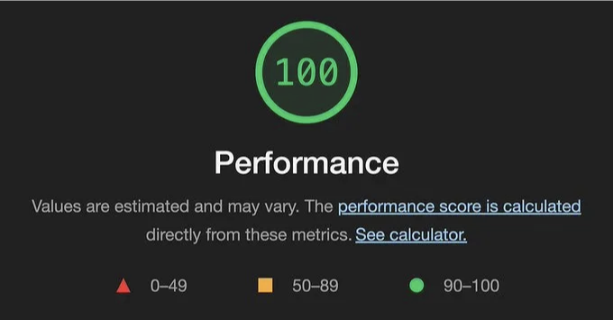
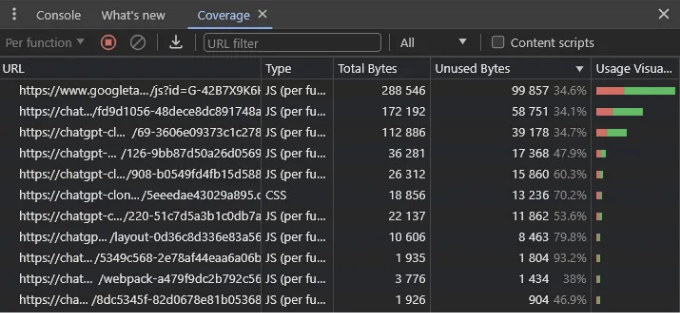
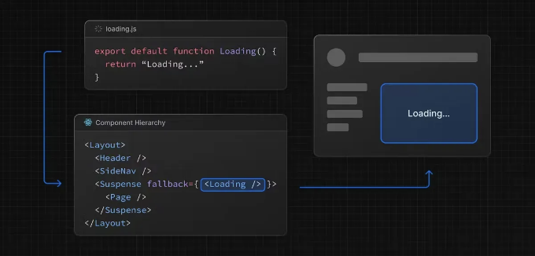
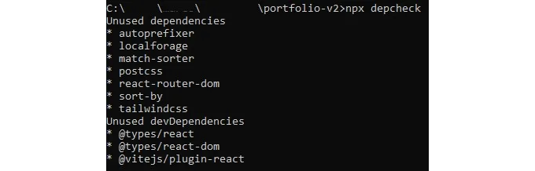
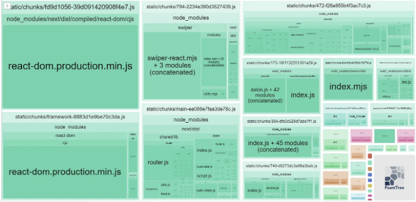

Next.js를 사용하여 웹 사이트의 성능을 100% 활용하고 싶나요?
다음은 그것을 얻기 위한 꿀팁 모음입니다.

저는 취업을 찾고 있어요! 제 포트폴리오를 확인하고 연락주세요.

## 1. 필요한 JavaScript 및 CSS만 로드하세요.

<!-- ui-log 수평형 -->
<ins class="adsbygoogle"
  style="display:block"
  data-ad-client="ca-pub-4877378276818686"
  data-ad-slot="9743150776"
  data-ad-format="auto"
  data-full-width-responsive="true"></ins>
<component is="script">
(adsbygoogle = window.adsbygoogle || []).push({});
</component>

이 문제가 있는지 알아보려면 DevTools의 커버리지 탭을 사용할 수 있어요.

이 탭은 조금 숨겨져 있지만, 파일의 사용량(%)을 보여줘요.

파일을 클릭하면 사용된 줄을 보여줘요:



<!-- ui-log 수평형 -->
<ins class="adsbygoogle"
  style="display:block"
  data-ad-client="ca-pub-4877378276818686"
  data-ad-slot="9743150776"
  data-ad-format="auto"
  data-full-width-responsive="true"></ins>
<component is="script">
(adsbygoogle = window.adsbygoogle || []).push({});
</component>

# 2. 의존성의 지연 로딩

동적 가져오기를 사용하여 컴포넌트 및 라이브러리를 즉시 필요하지 않을 때만 로드합니다.

next/dynamic을 사용하면 헤더 컴포넌트가 페이지의 초기 JavaScript 번들에 포함되지 않습니다. 페이지는 먼저 Suspense 폴백을 렌더링하고, Suspense 경계가 해결되면 헤더 컴포넌트가 렌더링됩니다.

JavaScript 코드로 동적 컴포넌트 가져오기의 예시:

<!-- ui-log 수평형 -->
<ins class="adsbygoogle"
  style="display:block"
  data-ad-client="ca-pub-4877378276818686"
  data-ad-slot="9743150776"
  data-ad-format="auto"
  data-full-width-responsive="true"></ins>
<component is="script">
(adsbygoogle = window.adsbygoogle || []).push({});
</component>

```js
import dynamic from 'next/dynamic'

const DynamicHeader = dynamic(() => import('../components/header'), {
  loading: () => <p>Loading...</p>,
})

export default function Home() {
  return <DynamicHeader />
}
```

외부 라이브러리 예시:

```js
import { useState } from 'react'

const names = ['Tim', 'Joe', 'Bel', 'Lee']

export default function Page() {
  const [results, setResults] = useState()

  return (
    <div>
      <input
        type="text"
        placeholder="Search"
        onChange={async (e) => {
          const { value } = e.currentTarget
          // fuse.js를 동적으로 로드합니다
          const Fuse = (await import('fuse.js')).default
          const fuse = new Fuse(names)

          setResults(fuse.search(value))
        }}
      />
      <pre>Results: {JSON.stringify(results, null, 2)}</pre>
    </div>
  )
}
```

# 3. Next.js의 <Image /> 컴포넌트 사용하기```

<!-- ui-log 수평형 -->
<ins class="adsbygoogle"
  style="display:block"
  data-ad-client="ca-pub-4877378276818686"
  data-ad-slot="9743150776"
  data-ad-format="auto"
  data-full-width-responsive="true"></ins>
<component is="script">
(adsbygoogle = window.adsbygoogle || []).push({});
</component>

Next.js Image 구성 요소는 자동 이미지 최적화 기능을 제공하는 HTML `img` 요소를 확장합니다:

- 크기 최적화: 각 장치에 맞게 올바른 크기의 이미지를 자동으로 제공하며, WebP 및 AVIF와 같은 최신 이미지 형식을 사용합니다.
- 시각적 안정성: 이미지가 로드될 때 레이아웃 이동을 자동으로 방지합니다.
- 빠른 페이지 로딩: 네이티브 브라우저의 지연 로딩을 사용하여 뷰포트에 이미지가 들어올 때에만 이미지를 로드하며, 선택적으로 희미한 플레이스홀더를 제공합니다.
- 자산 유연성: 원하는 경우 원격 서버에 저장된 이미지도 필요한 크기로 조정할 수 있습니다.

`Image` 구성 요소 사용 예시:

```js
import Image from 'next/image'
import profilePic from '../public/me.png'

export default function Page() {
  return (
    <Image
      src={profilePic}
      alt="작가의 사진"
      width={500} 
      height={500} 
    />
  )
}
```

<!-- ui-log 수평형 -->
<ins class="adsbygoogle"
  style="display:block"
  data-ad-client="ca-pub-4877378276818686"
  data-ad-slot="9743150776"
  data-ad-format="auto"
  data-full-width-responsive="true"></ins>
<component is="script">
(adsbygoogle = window.adsbygoogle || []).push({});
</component>

# 4. JavaScript 대신 CSS를 선호하세요

CSS는 많이 발전하고 점점 강력해지고 있어요. 요즘에는 JavaScript 없이도 특정 슬라이더나 UI를 만들 수 있어요.

왜냐하면 CSS를 사용하면:

- 보통 JS보다 적은 공간을 차지하고
- 평가 속도가 훨씬 빠르며
- 주 스레드를 차단하지 않고
- 더 나은 사용자 경험을 제공할 수 있어요

<!-- ui-log 수평형 -->
<ins class="adsbygoogle"
  style="display:block"
  data-ad-client="ca-pub-4877378276818686"
  data-ad-slot="9743150776"
  data-ad-format="auto"
  data-full-width-responsive="true"></ins>
<component is="script">
(adsbygoogle = window.adsbygoogle || []).push({});
</component>

# 5. 처음에 로더를 표시하지 않습니다

가끔은 사용자가 로딩 화면을 보게 만들어두기도 하는데, 이는 사용자의 로딩에 대한 인식에 치명적입니다! 웹 사이트를 최적화하여 서버에서 렌더링되고 시작부터 유용한 정보를 표시할 수 있도록 만드세요.

로더 대신 React의 Suspense 구성 요소를 사용하여 일부 작은 섹션에 사용할 수도 있습니다. 이 규칙을 준수하면 라우트 세그먼트의 내용이 로드되는 동안 서버에서 즉시 로딩 상태를 표시할 수 있습니다. 렌더링이 완료되면 새 콘텐츠가 자동으로 교체됩니다.



<!-- ui-log 수평형 -->
<ins class="adsbygoogle"
  style="display:block"
  data-ad-client="ca-pub-4877378276818686"
  data-ad-slot="9743150776"
  data-ad-format="auto"
  data-full-width-responsive="true"></ins>
<component is="script">
(adsbygoogle = window.adsbygoogle || []).push({});
</component>

# 6. Next.js 폰트 최적화 사용하기

Next.js에서는 폰트를 자동으로 최적화하고(사용자 지정 폰트 포함) 개인 정보 보호와 성능 향상을 위해 외부 네트워크 요청을 제거해줍니다.

next/font에는 모든 폰트 파일에 대한 내장 자체 호스팅이 포함되어 있습니다. 이는 기본 CSS size-adjust 속성을 사용하여 웹 폰트를 최적으로 로드할 수 있어 레이아웃 이동이 없습니다.

이 새로운 폰트 시스템을 통해 Google Fonts를 성능과 개인 정보 보호를 고려하여 편리하게 사용할 수 있습니다. CSS와 폰트 파일이 빌드 시 다운로드되고 정적 자산과 함께 자체 호스팅됩니다. 브라우저에서 Google로 요청이 전송되지 않습니다.

<!-- ui-log 수평형 -->
<ins class="adsbygoogle"
  style="display:block"
  data-ad-client="ca-pub-4877378276818686"
  data-ad-slot="9743150776"
  data-ad-format="auto"
  data-full-width-responsive="true"></ins>
<component is="script">
(adsbygoogle = window.adsbygoogle || []).push({});
</component>

Google 폰트를 사용하는 예시입니다. next/font를 사용하여 Google 폰트를 적용하는 방법은 다음과 같습니다:

```js
import { Inter } from 'next/font/google'
 
// 변수 글꼴을 로드하는 경우, 글꼴 두께를 명시할 필요가 없습니다.
const inter = Inter({ subsets: ['latin'] })
 
export default function MyApp({ Component, pageProps }) {
  return (
    <main className={inter.className}>
      <Component {...pageProps} />
    </main>
  )
}
```

## 7. 스크립트 최적화

모든 경로에 대한 서드파티 스크립트를 로드하려면, next/script를 import하고 스크립트를 직접 사용자 정의 컴포넌트에 포함시키면 됩니다.

<!-- ui-log 수평형 -->
<ins class="adsbygoogle"
  style="display:block"
  data-ad-client="ca-pub-4877378276818686"
  data-ad-slot="9743150776"
  data-ad-format="auto"
  data-full-width-responsive="true"></ins>
<component is="script">
(adsbygoogle = window.adsbygoogle || []).push({});
</component>

```js
import Script from 'next/script'

export default function MyApp({ Component, pageProps }) {
  return (
    <>
      <Component {...pageProps} />
      <Script src="https://example.com/script.js" />
    </>
  )
}
```

이 스크립트는 응용프로그램의 모든 경로에 액세스할 때 로드되고 실행됩니다. Next.js는 사용자가 여러 페이지 사이를 이동해도 한 번만 스크립트가 로드되도록 보장합니다.

# 8. 사용하지 않는 패키지 제거

가끔 package.json에 정의되어 있지만 더 이상 필요하지 않은 패키지를 제거하는 것을 잊어버립니다. npx depcheck를 실행하여 해당 항목을 확인할 수 있습니다.

<!-- ui-log 수평형 -->
<ins class="adsbygoogle"
  style="display:block"
  data-ad-client="ca-pub-4877378276818686"
  data-ad-slot="9743150776"
  data-ad-format="auto"
  data-full-width-responsive="true"></ins>
<component is="script">
(adsbygoogle = window.adsbygoogle || []).push({});
</component>



# 9. 현재 번들 크기 확인하기

@next/bundle-analyzer를 사용하면 번들 크기를 시각적으로 분석할 수 있습니다. 더 큰 셀일수록 모듈 크기가 더 큽니다. 설치 안내는 문서에서 확인할 수 있습니다.



<!-- ui-log 수평형 -->
<ins class="adsbygoogle"
  style="display:block"
  data-ad-client="ca-pub-4877378276818686"
  data-ad-slot="9743150776"
  data-ad-format="auto"
  data-full-width-responsive="true"></ins>
<component is="script">
(adsbygoogle = window.adsbygoogle || []).push({});
</component>

# 10. 서버 컴포넌트 사용하기

React Server 컴포넌트를 사용하면 UI를 서버에서 렌더링하고 선택적으로 캐싱할 수 있습니다.

서버에서 렌더링 작업을 수행하는 것에는 몇 가지 이점이 있습니다:

- 데이터 가져오기: 서버 컴포넌트를 사용하면 데이터 가져오기를 서버로 이동하여 데이터 소스에 더 가깝게 할 수 있습니다. 이렇게 하면 렌더링에 필요한 데이터를 가져오는 데 걸리는 시간과 클라이언트가 필요로 하는 요청 수를 줄여 성능을 향상시킬 수 있습니다.
- 보안: 서버 컴포넌트를 사용하면 토큰 및 API 키와 같은 민감한 데이터와 로직을 클라이언트에 노출하지 않고 서버에 유지할 수 있습니다.
- 초기 페이지 로드 및 첫 번째 내용 렌더링(FCP): 서버에서는 HTML을 생성하여 사용자가 페이지를 즉시 볼 수 있도록 합니다. 이렇게 하면 클라이언트가 페이지를 렌더링하는 데 필요한 JavaScript를 다운로드, 구문 분석 및 실행할 필요 없이 사용자가 페이지를 즉시 볼 수 있습니다.
- 검색 엔진 최적화 및 소셜 네트워크 공유 가능성: 생성된 HTML은 검색 엔진 봇이 페이지를 색인화하고 소셜 네트워크 봇이 페이지에 대한 소셜 카드 미리보기를 생성하는 데 사용될 수 있습니다.
- 스트리밍: 서버 컴포넌트를 사용하면 렌더링 작업을 청크로 분할하고 준비되는 대로 클라이언트로 스트리밍할 수 있습니다. 이렇게 하면 사용자가 페이지 전체를 서버에서 렌더링할 때까지 기다릴 필요 없이 페이지 일부를 일찍 볼 수 있습니다.

<!-- ui-log 수평형 -->
<ins class="adsbygoogle"
  style="display:block"
  data-ad-client="ca-pub-4877378276818686"
  data-ad-slot="9743150776"
  data-ad-format="auto"
  data-full-width-responsive="true"></ins>
<component is="script">
(adsbygoogle = window.adsbygoogle || []).push({});
</component>
