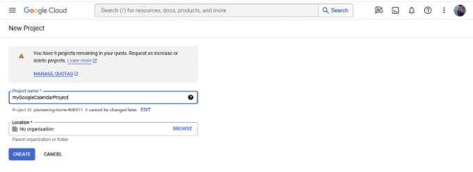
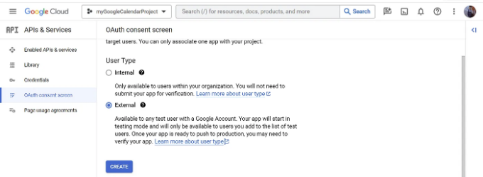
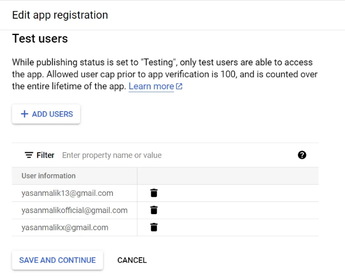
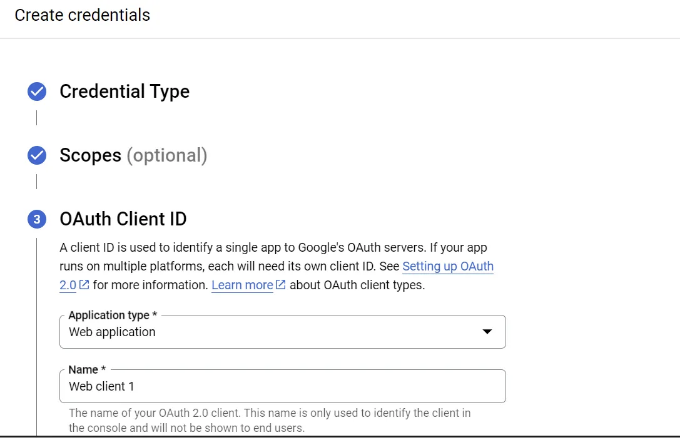
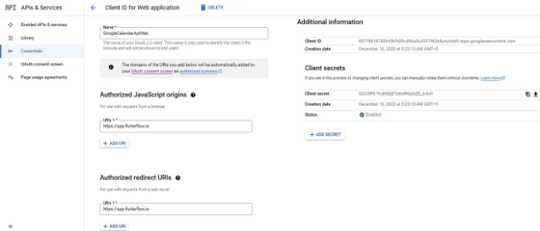
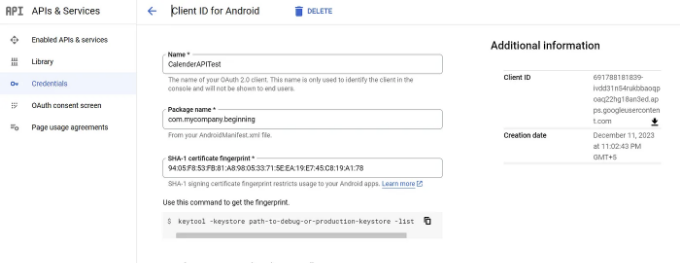
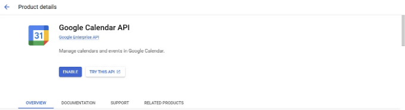
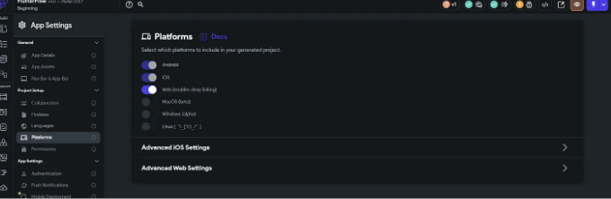

Google Calendar API를 사용하기 위한 Google Cloud 계정 설정에는 OAuth 2.0 클라이언트 ID, 서비스 계정 및 OAuth 동의 화면 구성을 포함한 여러 단계가 필요합니다.

아래는 Web, Android 및 iOS 플랫폼용으로 이러한 구성 요소를 설정하는 상세 가이드입니다:

1. Google Cloud 프로젝트 생성:

<!-- ui-log 수평형 -->
<ins class="adsbygoogle"
  style="display:block"
  data-ad-client="ca-pub-4877378276818686"
  data-ad-slot="9743150776"
  data-ad-format="auto"
  data-full-width-responsive="true"></ins>
<component is="script">
(adsbygoogle = window.adsbygoogle || []).push({});
</component>

• Google Cloud Console로 이동하세요.

새 프로젝트를 생성하거나 기존 프로젝트를 선택하세요.



2. OAuth 동의 화면 설정:

<!-- ui-log 수평형 -->
<ins class="adsbygoogle"
  style="display:block"
  data-ad-client="ca-pub-4877378276818686"
  data-ad-slot="9743150776"
  data-ad-format="auto"
  data-full-width-responsive="true"></ins>
<component is="script">
(adsbygoogle = window.adsbygoogle || []).push({});
</component>

Web용 (OAuth 2.0 클라이언트 ID):

OAuth 동의 화면:

Google Cloud 콘솔의 "OAuth 동의 화면" 섹션으로 이동하고 "외부"를 선택해주세요.



<!-- ui-log 수평형 -->
<ins class="adsbygoogle"
  style="display:block"
  data-ad-client="ca-pub-4877378276818686"
  data-ad-slot="9743150776"
  data-ad-format="auto"
  data-full-width-responsive="true"></ins>
<component is="script">
(adsbygoogle = window.adsbygoogle || []).push({});
</component>

• 앱 이름, 사용자 지원 이메일, 개발자 연락처 정보 등과 같은 필수 세부 정보를 구성해 주세요.

- 그런 다음 동의 화면에 테스트 사용자를 추가해 주세요.



참고: 테스트 중인 사용자는 테스트 중에 추가한 테스트 사용자 목록에 나열된 이메일만 사용할 수 있습니다.

<!-- ui-log 수평형 -->
<ins class="adsbygoogle"
  style="display:block"
  data-ad-client="ca-pub-4877378276818686"
  data-ad-slot="9743150776"
  data-ad-format="auto"
  data-full-width-responsive="true"></ins>
<component is="script">
(adsbygoogle = window.adsbygoogle || []).push({});
</component>

OAuth 2.0 클라이언트 ID를 생성하세요:

• "자격 증명(Credentials)" 섹션으로 이동하세요.

• "자격 증명 생성(Create credentials)"을 클릭하고 "OAuth 클라이언트 ID(OAuth client ID)"를 선택하세요.

"웹 응용 프로그램(Web application)"을 선택하세요.

<!-- ui-log 수평형 -->
<ins class="adsbygoogle"
  style="display:block"
  data-ad-client="ca-pub-4877378276818686"
  data-ad-slot="9743150776"
  data-ad-format="auto"
  data-full-width-responsive="true"></ins>
<component is="script">
(adsbygoogle = window.adsbygoogle || []).push({});
</component>



- 권한이 부여된 JavaScript 원본 및 리디렉션 URI(앱이 실행될 위치)를 추가하세요.



참고: 웹 브라우저에서 플러터 기반 웹 앱 통합을 테스트하려면 URL을 다음과 같이 설정하세요: "http://localhost"

<!-- ui-log 수평형 -->
<ins class="adsbygoogle"
  style="display:block"
  data-ad-client="ca-pub-4877378276818686"
  data-ad-slot="9743150776"
  data-ad-format="auto"
  data-full-width-responsive="true"></ins>
<component is="script">
(adsbygoogle = window.adsbygoogle || []).push({});
</component>

- 웹 애플리케이션 통합을 위해 생성된 클라이언트 ID 및 클라이언트 시크릿을 가져옵니다.


Android/iOS용 (OAuth 2.0 클라이언트 ID):

OAuth 동의 화면:

<!-- ui-log 수평형 -->
<ins class="adsbygoogle"
  style="display:block"
  data-ad-client="ca-pub-4877378276818686"
  data-ad-slot="9743150776"
  data-ad-format="auto"
  data-full-width-responsive="true"></ins>
<component is="script">
(adsbygoogle = window.adsbygoogle || []).push({});
</component>

• "Web Setup"에서 "OAuth 동의 화면" 섹션으로 이동해주세요.

• 동의 화면 세부 정보를 설정하세요(아래 단계에서 설명한 대로). 이미 Web-애플리케이션을 위해 동의 화면을 구성한 경우는 이 부분을 무시해도 됩니다.

OAuth 2.0 클라이언트 ID 생성:

• "자격 증명" 섹션에서 "자격 증명 만들기"를 클릭하고 "OAuth 클라이언트 ID"를 선택하세요.

<!-- ui-log 수평형 -->
<ins class="adsbygoogle"
  style="display:block"
  data-ad-client="ca-pub-4877378276818686"
  data-ad-slot="9743150776"
  data-ad-format="auto"
  data-full-width-responsive="true"></ins>
<component is="script">
(adsbygoogle = window.adsbygoogle || []).push({});
</component>

• "Android" 또는 "iOS"를 선택하세요.

앱의 패키지 이름(Android용) 또는 번들 ID(iOS용)를 추가하세요.



참고: 다음 명령을 사용하여 키스토어 구성에 따라 SHA-1 인증서를 얻으세요:

<!-- ui-log 수평형 -->
<ins class="adsbygoogle"
  style="display:block"
  data-ad-client="ca-pub-4877378276818686"
  data-ad-slot="9743150776"
  data-ad-format="auto"
  data-full-width-responsive="true"></ins>
<component is="script">
(adsbygoogle = window.adsbygoogle || []).push({});
</component>

keytool -list -v \

-alias androiddebugkey -keystore %USERPROFILE%\.android\debug.keystore

• 모바일 애플리케이션 통합을 위해 생성된 클라이언트 ID 및 클라이언트 시크릿을 얻으세요.

3. 서비스 계정 (백엔드 서버):

<!-- ui-log 수평형 -->
<ins class="adsbygoogle"
  style="display:block"
  data-ad-client="ca-pub-4877378276818686"
  data-ad-slot="9743150776"
  data-ad-format="auto"
  data-full-width-responsive="true"></ins>
<component is="script">
(adsbygoogle = window.adsbygoogle || []).push({});
</component>

참고: 백엔드 서버 설정이 없는 경우 이 구성을 무시하십시오.

- 서버 측 액세스(백엔드 작업과 같은):

- 서비스 계정 만들기:

- 구글 클라우드 콘솔의 "IAM 및 관리자" > "서비스 계정" 섹션으로 이동하십시오.

<!-- ui-log 수평형 -->
<ins class="adsbygoogle"
  style="display:block"
  data-ad-client="ca-pub-4877378276818686"
  data-ad-slot="9743150776"
  data-ad-format="auto"
  data-full-width-responsive="true"></ins>
<component is="script">
(adsbygoogle = window.adsbygoogle || []).push({});
</component>

• "서비스 계정 만들기"를 클릭하고 안내에 따라 진행해주세요.

• 서비스 계정에 필요한 권한을 부여해주세요(예: 캘린더 읽기/쓰기 권한).

• JSON 형식으로 서비스 계정을 위한 개인 키를 생성해주세요. 이 키는 서버 측 코드에서 인증에 사용됩니다.

4. 캘린더 API 활성화:

<!-- ui-log 수평형 -->
<ins class="adsbygoogle"
  style="display:block"
  data-ad-client="ca-pub-4877378276818686"
  data-ad-slot="9743150776"
  data-ad-format="auto"
  data-full-width-responsive="true"></ins>
<component is="script">
(adsbygoogle = window.adsbygoogle || []).push({});
</component>

• 클라우드 콘솔의 "라이브러리" 섹션으로 이동해주세요.

- "Google Calendar API"를 검색하고 프로젝트에 활성화해주세요.



중요 사항:

<!-- ui-log 수평형 -->
<ins class="adsbygoogle"
  style="display:block"
  data-ad-client="ca-pub-4877378276818686"
  data-ad-slot="9743150776"
  data-ad-format="auto"
  data-full-width-responsive="true"></ins>
<component is="script">
(adsbygoogle = window.adsbygoogle || []).push({});
</component>

- 플러터 코드의 GoogleCalendarServiceFactory 내부의 클라이언트 ID를 업데이트했는지 확인하세요:

```js
class GoogleCalendarServiceFactory {
  static GoogleCalendarService create() {
    if (kIsWeb) {
      // 여기에 웹 OAuth 클라이언트 ID를 입력하세요
      return GoogleCalendarService(
        googleSignInCredentials: GoogleSignIn(
          clientId:
              '당신의 안드로이드 ID',
          scopes: <String>[CalendarApi.calendarScope],
        ),
      );
    } else {
      if (Platform.isAndroid) {
        // 안드로이드는 OAuth 클라이언트 ID가 필요하지 않습니다. 참고: 안드로이드용으로 SHA-1 키 생성 후 콘솔에 제출하는 것을 잊지 마세요.
        return GoogleCalendarService(
          googleSignInCredentials: GoogleSignIn(
            scopes: <String>[
              CalendarApi.calendarScope
            ], // 모든 메서드에 액세스하려면 scope가 캘린더여야 합니다
          ),
        );
      } else if (Platform.isIOS) {
        // 여기에 IOS 클라이언트 ID를 입력하세요
        return GoogleCalendarService(
          googleSignInCredentials: GoogleSignIn(
            clientId: '당신의 IOS 클라이언트 ID',
            scopes: <String>[CalendarApi.calendarScope],
          ),
        );
      } else {
        throw Exception('지원되지 않는 플랫폼입니다');
      }
    }
  }
}
```

OAuth 2.0 클라이언트 ID와 서비스 계정 키를 안전하게 보관하는 것을 확인하세요.

Flutterflow 사용자를 위한:

<!-- ui-log 수평형 -->
<ins class="adsbygoogle"
  style="display:block"
  data-ad-client="ca-pub-4877378276818686"
  data-ad-slot="9743150776"
  data-ad-format="auto"
  data-full-width-responsive="true"></ins>
<component is="script">
(adsbygoogle = window.adsbygoogle || []).push({});
</component>

- FlutterFlow 프로젝트에서 웹 플랫폼을 활성화하는 것을 잊지 마세요.

