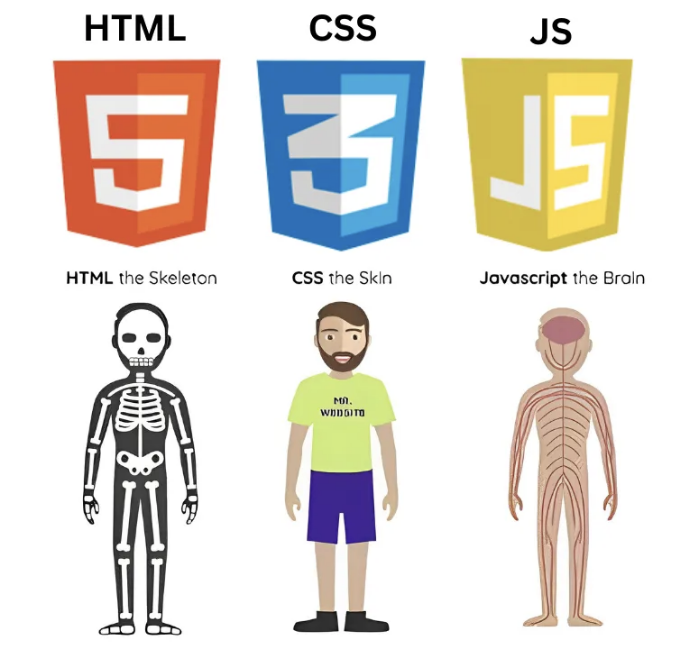
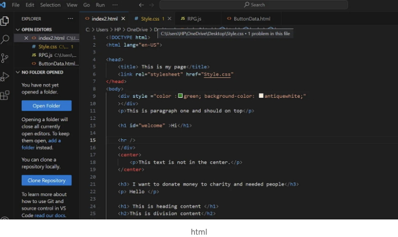
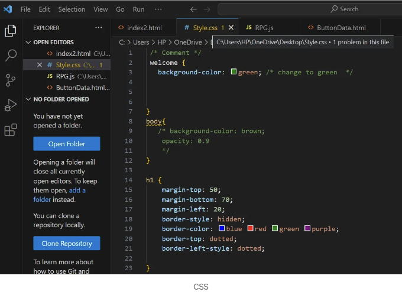

지난 4년간 Unity 및 Unreal을 사용하면서 C++ 및 C# 개발자였는데 이제 JavaScript를 배우기 시작했습니다. 이 언어에 대한 경험이나 지식이 전혀 없는 초보입니다.

처음부터 JavaScript를 배우기 시작해봅시다:

JS로 줄여지는 JavaScript는 유명한 가벼운 인터프리터 프로그래밍 언어이며 HTML 및 CSS와 연결된 웹 기술의 핵심입니다.

웹 페이지에 복잡한 기능을 구현할 수 있게 해주며, 기본적으로 웹 기술에는 3개의 계층이 있습니다(HTML, CSS, JavaScript).

<!-- ui-log 수평형 -->
<ins class="adsbygoogle"
  style="display:block"
  data-ad-client="ca-pub-4877378276818686"
  data-ad-slot="9743150776"
  data-ad-format="auto"
  data-full-width-responsive="true"></ins>
<component is="script">
(adsbygoogle = window.adsbygoogle || []).push({});
</component>



HTML: 웹 콘텐츠를 구조화하고 의미를 부여하기 위해 사용되는 마크업 언어입니다. 예를 들어 문단을 정의하거나 헤딩을 지정하며 페이지에 이미지나 비디오를 추가하는 등의 작업을 수행합니다.



CSS: HTML 페이지에 스타일을 적용하기 위해 사용되는 스타일 규칙 언어입니다.

<!-- ui-log 수평형 -->
<ins class="adsbygoogle"
  style="display:block"
  data-ad-client="ca-pub-4877378276818686"
  data-ad-slot="9743150776"
  data-ad-format="auto"
  data-full-width-responsive="true"></ins>
<component is="script">
(adsbygoogle = window.adsbygoogle || []).push({});
</component>



자바스크립트: 이전에 논의한 대로 JS는 동적 웹 콘텐츠를 만들 수 있게 해주는 스크립팅 언어입니다.

이제 자바스크립트에서 변수를 선언하는 방법을 살펴봅니다.

JS에서 변수를 선언하는 방법은 세 가지가 있습니다:

<!-- ui-log 수평형 -->
<ins class="adsbygoogle"
  style="display:block"
  data-ad-client="ca-pub-4877378276818686"
  data-ad-slot="9743150776"
  data-ad-format="auto"
  data-full-width-responsive="true"></ins>
<component is="script">
(adsbygoogle = window.adsbygoogle || []).push({});
</component>

키워드인 let, const, var을 이용하여 코드를 작성했습니다.

```javascript
let x = 50;

const x = 70;

var gold = 60;
```

<!-- ui-log 수평형 -->
<ins class="adsbygoogle"
  style="display:block"
  data-ad-client="ca-pub-4877378276818686"
  data-ad-slot="9743150776"
  data-ad-format="auto"
  data-full-width-responsive="true"></ins>
<component is="script">
(adsbygoogle = window.adsbygoogle || []).push({});
</component>

하지만 이러한 선언 방식 간에는 차이가 있습니다.

이 튜토리얼에서 논의할 예정입니다...