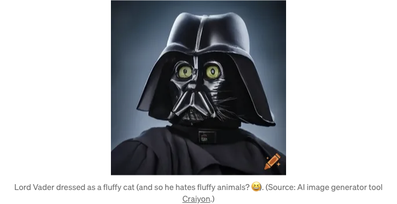
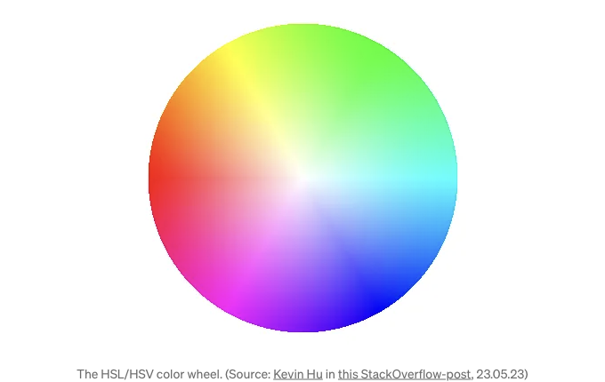

얼마 전에 CSS 약어들을 소규모로 모았어요. CSS 문서를 찾아보지 않고 정확한 CSS를 작성하기 위해 사용하거나 단순히 CSS를 효과적으로 작성하는 데 도움이 되는 약어들입니다. CSS 자체가 "Cascading Style Sheets"의 약어인데, 제가 만든/수집한 CSS 약어 목록을 살펴보세요! 아마 일상적인 CSS 작업에 도움이 될 거예요.

# TRouBLe

이것은 이미 유명한 약어인데, 특히 주니어 CSS 개발자들에게 유용할 수 있어요. 예를 들어 margin의 축약 속성에서 CSS 속성의 순서를 잊어버린 적이 있나요? 순서는 TRouBLE입니다!:

margin: `위쪽 여백` `오른쪽 여백` `아래쪽 여백` `왼쪽 여백`;

<!-- ui-log 수평형 -->
<ins class="adsbygoogle"
  style="display:block"
  data-ad-client="ca-pub-4877378276818686"
  data-ad-slot="9743150776"
  data-ad-format="auto"
  data-full-width-responsive="true"></ins>
<component is="script">
(adsbygoogle = window.adsbygoogle || []).push({});
</component>

CSS 트릭스가 이미 2007년에 이 약어에 대해 게시물을 작성했습니다.

# 로드 베이더는 귀여운 동물들을 싫어합니다

이 약어는 프로덕션 중에 발생한 버그로 인해 발견되었으며, 아마도 제가 가장 좋아하는 약어일 것입니다. 로드 베이더는 귀여운 동물들을 싫어합니다는 링크와 `a` 태그의 스타일 순서를 올바르게 설정하는 데 도움이 됩니다. 순서는 다음과 같아야 합니다:

```js
a {...}
a:visited {...}
a:focus {...}
a:hover {...}
a:active {...}
``` 

<!-- ui-log 수평형 -->
<ins class="adsbygoogle"
  style="display:block"
  data-ad-client="ca-pub-4877378276818686"
  data-ad-slot="9743150776"
  data-ad-format="auto"
  data-full-width-responsive="true"></ins>
<component is="script">
(adsbygoogle = window.adsbygoogle || []).push({});
</component>

활성 링크가 호버된 링크의 스타일을 덮어씁니다. 다시 말해, 링크가 활성 상태이면 해당 스타일을 덮어씁니다.

그 순서는 토론의 여지가 있습니다. 포커스 상태가 호버 상태를 덮어쓰는 것이 논의될 수 있습니다. 제 생각에는 프로덕션 버그가 "Lord Vader Fluffy Hates Animals"로 수정되었습니다. 그게 무슨 뜻인지 😉 이에 대한 훌륭한 통찰이 있다면 댓글을 남겨주세요 👍

어쨌든, 이 약어는 저에게 개인적으로 CSS 스타일을 제대로 얻게 도왔습니다. 절대로 추천할만 하다고 생각합니다. 이 유용한 약어를 기억하는 데 도움이 될 것으로 생각되는 AI 생성 이미지로 마치겠습니다 ⬇️



<!-- ui-log 수평형 -->
<ins class="adsbygoogle"
  style="display:block"
  data-ad-client="ca-pub-4877378276818686"
  data-ad-slot="9743150776"
  data-ad-format="auto"
  data-full-width-responsive="true"></ins>
<component is="script">
(adsbygoogle = window.adsbygoogle || []).push({});
</component>

이 속어의 크레딧은 2018년 제1판인 키스 그랜트의 CSS in Depth 도서에 있습니다. 이 속어를 배운 곳이기도 한데요. 이 책을 정말 추천하고, 여기서 내 블로그 글에서 더 읽을 수 있어.

마지막으로, 이 올바른 순서를 기억하는 데 도움이 되는 다른 약어들이 있습니다. LoVe HAte (l은 link, v는 visited, h는 hover, a는 active)는 오랜 시간 동안 있었지만, CSS Tricks의 2007년 게시물에서도 확인할 수 있습니다.

# 젊은 녀석들은 지저분한 라디컬일지도 몰라요

정말 똑똑한 웹 개발자가 HSL 360도 색상 원을 마시처럼 탐색하는 튜토리얼을 본 적이 있나요? 그런 다음 당신이 그 멋진 원을 그 개발자만큼 잘 모르는 것을 깨달을 때 불안한 기분이 든 적이 있나요? 젊은 녀석들은 지저분한 라디컬이 구원했습니다! 색상 원을 도는 중이라면 (아래 이미지를 확인할 수 있어요), 순서는 노란색(y는 young), 초록색(g는 guys), 청록색(c는 cyan), 파란색(b는 be), 자홍색(m은 magenta), 빨간색(r은 red)입니다.

<!-- ui-log 수평형 -->
<ins class="adsbygoogle"
  style="display:block"
  data-ad-client="ca-pub-4877378276818686"
  data-ad-slot="9743150776"
  data-ad-format="auto"
  data-full-width-responsive="true"></ins>
<component is="script">
(adsbygoogle = window.adsbygoogle || []).push({});
</component>




