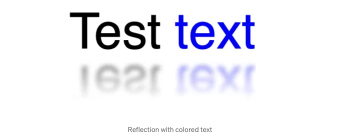
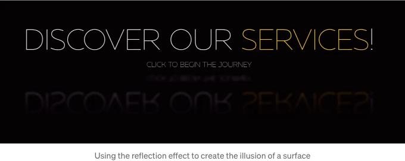

# 반사 효과

반사 효과가 정확히 무엇인지 자세히 살펴볼까요? 기본 텍스트 반사 효과는 다음과 같이 CSS를 사용하여 만들 수 있습니다:

```css
.reflection {
  font-size: 50px;
  position: relative;
}

.reflection::after {
  content: attr(data-text);
  position: absolute;
  top: 100%;
  left: 0;
  transform: rotate(180deg) scaleX(-1);
  mask-image: linear-gradient(0deg, black 0%, transparent 100%);
  filter: blur(2px);
  line-height: 1;
  opacity: 0.6;
}
```

<!-- ui-log 수평형 -->

<ins class="adsbygoogle"
  style="display:block"
  data-ad-client="ca-pub-4877378276818686"
  data-ad-slot="9743150776"
  data-ad-format="auto"
  data-full-width-responsive="true"></ins>
<component is="script">
(adsbygoogle = window.adsbygoogle || []).push({});
</component>

이 모습 좋아요! 하지만 텍스트에 꾸밈효과가 없고 단어마다 동일한 색상일 때만 작동합니다. 왜냐하면 reflection 내용에 data-text 속성을 사용하고 있기 때문이에요. 하지만 만약 아래와 같이 반사 효과를 만들고 싶다면 어떻게 할까요?



가장 유연한 방법은 React 컴포넌트를 생성하여 모든 자식 노드를 사용하고 적절한 스타일을 추가하여 "원본" 요소와 "반사된" 요소를 만드는 것이겠죠.

```js
.reflection-container {
  font-size: 50px;
  position: relative;
}

.reflection {
  position: absolute;
  top: 100%;
  left: 0;
  transform: rotate(180deg) scaleX(-1);
  mask-image: linear-gradient(0deg, black 0%, transparent 100%);
  filter: blur(2px);
  line-height: 1;
  opacity: 0.6;
}
```

<!-- ui-log 수평형 -->

<ins class="adsbygoogle"
  style="display:block"
  data-ad-client="ca-pub-4877378276818686"
  data-ad-slot="9743150776"
  data-ad-format="auto"
  data-full-width-responsive="true"></ins>
<component is="script">
(adsbygoogle = window.adsbygoogle || []).push({});
</component>

표를 마크다운 형식으로 바꾸면 멀티라인 텍스트나 이미지도 반영될 수 있어요!

정말 멋지죠, 그렇죠? 그럼 함정은 뭘까요? 웹사이트 구글 검색 순위와 어떤 관련이 있는 걸까요?

# 구글 검색 순위

우선 무슨 일이 일어나고 있는지 분석해봅시다.

<!-- ui-log 수평형 -->

<ins class="adsbygoogle"
  style="display:block"
  data-ad-client="ca-pub-4877378276818686"
  data-ad-slot="9743150776"
  data-ad-format="auto"
  data-full-width-responsive="true"></ins>
<component is="script">
(adsbygoogle = window.adsbygoogle || []).push({});
</component>

::after 가상 요소를 사용하여 반사를 만들 때 content 내부의 텍스트는 구글 봇에게 "보이지" 않고 텍스트로 취급되지 않기 때문에 색인에 포함되지 않습니다.

그러나 React 반사 컴포넌트에 제공하는 내용을 복제하고 스타일만 적용하여 반사처럼 보이도록 만든다면 구글 봇이 그것을 다음과 같이 중복된 텍스트로 인식할 것입니다 (위의 예시 사용):

```js
테스트 텍스트
두 번째 라인 텍스트
테스트 텍스트
두 번째 라인 텍스트
```

그리고 이것이 문제인데, 구글은 중복 콘텐츠를 정말 싫어합니다.

<!-- ui-log 수평형 -->

<ins class="adsbygoogle"
  style="display:block"
  data-ad-client="ca-pub-4877378276818686"
  data-ad-slot="9743150776"
  data-ad-format="auto"
  data-full-width-responsive="true"></ins>
<component is="script">
(adsbygoogle = window.adsbygoogle || []).push({});
</component>

동일한 웹사이트 콘텐츠와 동일한 검색어를 사용하여 중복 콘텐츠가 있을 때, 생성한 웹사이트는 50-60위에 나열되었지만 중복 콘텐츠 없이는 6-7위에 있었습니다.

그러니까, 문제를 알았으니 이제 해결책이 뭘까요?

# 해결책

음... 해결책은 굉장히 명백하지만 동시에 아닙니다. 기본적으로 이 중복 텍스트를 Google 봇에게 숨겨야 합니다. 하지만 “어떻게”하는 문제는 여전히 남아 있습니다.

<!-- ui-log 수평형 -->

<ins class="adsbygoogle"
  style="display:block"
  data-ad-client="ca-pub-4877378276818686"
  data-ad-slot="9743150776"
  data-ad-format="auto"
  data-full-width-responsive="true"></ins>
<component is="script">
(adsbygoogle = window.adsbygoogle || []).push({});
</component>

우선, 우아하게 처리하려고 aria-hidden="true"을 사용하고 CSS를 사용하여 이 반사 텍스트가 실제로 상호 작용하는 요소가 아님을 나타내려고 했지만 아무런 효과가 없었어요.

```js
.reflection {
  /* ... */
  pointer-events: none;
  user-select: none;
}
```

이것을 "적절히" 처리하는 방법을 찾으려고 너무 많은 시간을 허비해 왔어요 (잘 아는 방법이 있다면 알려주세요). 어느 순간에는 모든 것을 간단한 텍스트 반사로 되돌리기로 결심했죠.

다행히도, 모든 멋진 효과를 제거할 수 있을 수도 있는 이러한 솔루션으로 되돌아가려고 시작하는 순간, 브라우저가 본 웹사이트를 탐색 중인 것을 나타내는 navigator.userAgent가 있을 때 반사가 있는 div를 감추기만 하면 된다는 가장 간단하면서도 가장 효과적인 방법이 떠올랐어요.

<!-- ui-log 수평형 -->

<ins class="adsbygoogle"
  style="display:block"
  data-ad-client="ca-pub-4877378276818686"
  data-ad-slot="9743150776"
  data-ad-format="auto"
  data-full-width-responsive="true"></ins>
<component is="script">
(adsbygoogle = window.adsbygoogle || []).push({});
</component>

황금같은 해결책을 찾는 동안, 가장 명백한 것을 자동으로 배제했는데, 결국 그것이 가장 좋은 선택지였습니다. 그것은 가장 우아한 옵션이 아니었지만요.

React 컴포넌트에서 몇 가지 간단한 조정을 했더니, 웹 사이트의 구글 검색 점수가 다시 정상으로 돌아왔고, 사용자들에게 완전한 시각적 경험을 유지한 채였습니다.

# 결론 및 예시

이로써 반사 효과와 구글 검색 점수에 미치는 영향에 대한 나의 여정이 마무리되었습니다. 개인적으로, 이 효과를 사용하는 것을 정말 좋아하는데, 이는 콘텐츠가 표면 위에 떠다니고 어딘가 공간에 편입된 것처럼 느껴지게 하기 때문입니다. 따라서, 웹사이트의 검색 점수를 망가뜨리지 않고 기능을 희생하지 않으면서 작동할 수 있는 방법을 찾아낸 것에 기쁘게 생각합니다.

<!-- ui-log 수평형 -->

<ins class="adsbygoogle"
  style="display:block"
  data-ad-client="ca-pub-4877378276818686"
  data-ad-slot="9743150776"
  data-ad-format="auto"
  data-full-width-responsive="true"></ins>
<component is="script">
(adsbygoogle = window.adsbygoogle || []).push({});
</component>

여기서는 제가 어떻게 사용하고 있는지 몇 가지 예제를 볼 수 있어요:




리플렉션 효과와 관련하여 여러분의 경험을 알려주세요. 여러분이 만드는 웹사이트에서 사용하고 계신가요, 아니면 사용하지 않으시나요?
