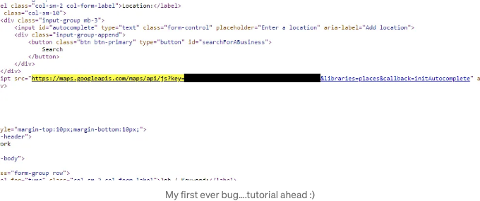
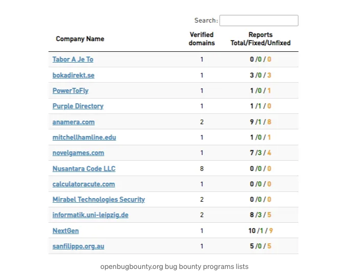
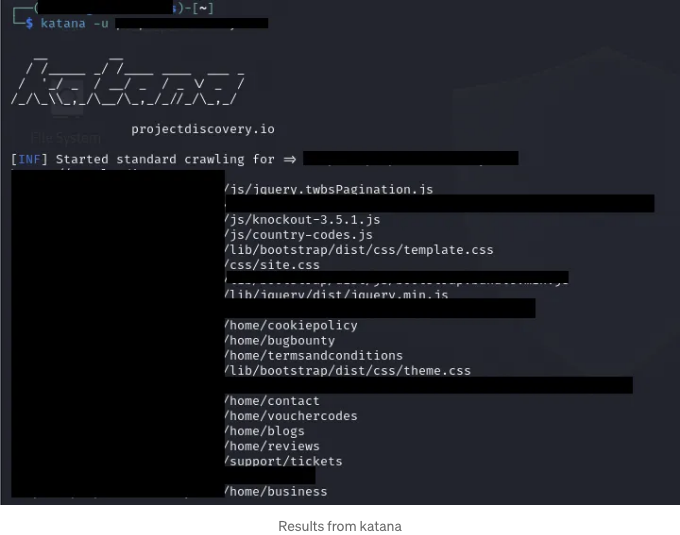
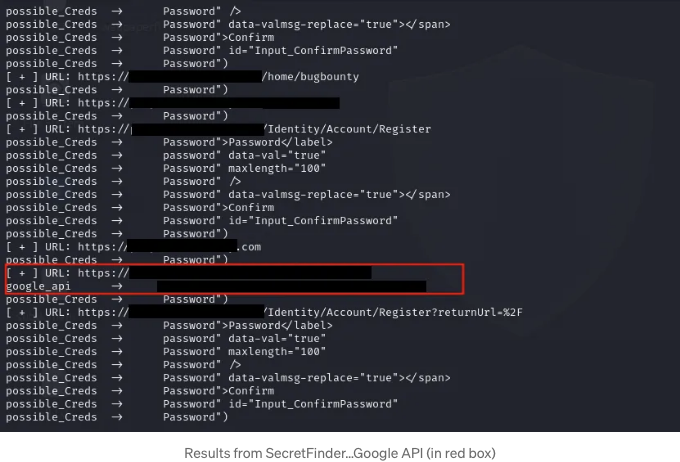
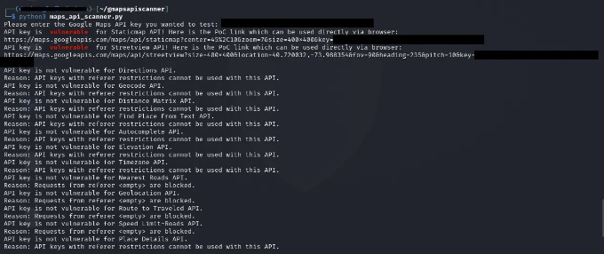
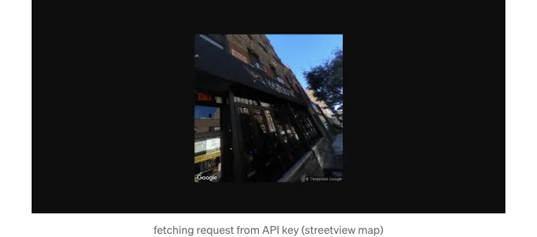
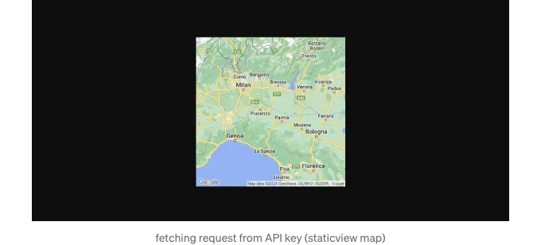
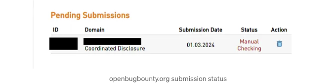

## 소개:

만약 여기 처음 오신 분이라면, 저는 초보 버그 헌터이자 사이버 보안 애호가입니다. 현재 버그 헌팅을 배우고 있어요.


<!-- ui-log 수평형 -->
<ins class="adsbygoogle"
  style="display:block"
  data-ad-client="ca-pub-4877378276818686"
  data-ad-slot="9743150776"
  data-ad-format="auto"
  data-full-width-responsive="true"></ins>
<component is="script">
(adsbygoogle = window.adsbygoogle || []).push({});
</component>

아마 제목을 클릭했을 때 있죠? 더 많은 버그를 찾고 싶으시거나 첫 번째 버그를 찾고 싶으신 거죠. 시작해 봅시다!

웹사이트의 신원은 숨겨둘 거에요.

## 소개:

최근에 새로운 버그 바운티 프로그램을 찾던 중 openbugbounty.org에 갔어요. 새로운 목표를 찾기 위해 프로그램을 발견했는데, 꽤 괜찮았어요. 웹사이트가 WordPress를 기반으로 하고 있지 않았다는 점이 좋았죠. 그래서 이 사이트를 새로운 목표로 삼았어요.

<!-- ui-log 수평형 -->
<ins class="adsbygoogle"
  style="display:block"
  data-ad-client="ca-pub-4877378276818686"
  data-ad-slot="9743150776"
  data-ad-format="auto"
  data-full-width-responsive="true"></ins>
<component is="script">
(adsbygoogle = window.adsbygoogle || []).push({});
</component>



그 다음으로 정보 누출을 찾기 위해서 기대했어요.

그래서 제 카타나를 불태워서 목표 사이트의 모든 JS 파일을 가져오기 위해 목표 사이트의 URL을 입력했어요.

```js
katana -u website.com    
```

<!-- ui-log 수평형 -->
<ins class="adsbygoogle"
  style="display:block"
  data-ad-client="ca-pub-4877378276818686"
  data-ad-slot="9743150776"
  data-ad-format="auto"
  data-full-width-responsive="true"></ins>
<component is="script">
(adsbygoogle = window.adsbygoogle || []).push({});
</component>



와, 카타나에서 JS 파일을 받아 .txt 파일로 저장한 후 SecretFinder를 사용하여 카타나에서 가져온 JS 파일에서 모든 취약한 정보를 추출했어요.

다음 명령어를 사용했어요.

```js
cat {jsfilesgottenfromkatana.txt} | while read url; do python3 SecretFinder/SecretFinder.py  -i $url -o cli; done
```

<!-- ui-log 수평형 -->
<ins class="adsbygoogle"
  style="display:block"
  data-ad-client="ca-pub-4877378276818686"
  data-ad-slot="9743150776"
  data-ad-format="auto"
  data-full-width-responsive="true"></ins>
<component is="script">
(adsbygoogle = window.adsbygoogle || []).push({});
</component>

그 후에 SecretFinder에서 흥미로운 정보를 발견했어.



정말 행복했지만.... 정말 취약한가요?

Google Maps API 키가 취약한지 여부를 확인하려면 GitHub의 gmapsapiscanner라는 도구를 추천해.

<!-- ui-log 수평형 -->
<ins class="adsbygoogle"
  style="display:block"
  data-ad-client="ca-pub-4877378276818686"
  data-ad-slot="9743150776"
  data-ad-format="auto"
  data-full-width-responsive="true"></ins>
<component is="script">
(adsbygoogle = window.adsbygoogle || []).push({});
</component>

설치를 완료한 후 다음을 실행해주세요.

```js
cd gmapsapiscanner
python3 maps_api_scanner.py  
```

그리고 테스트하고 싶은 API를 입력해주세요.



<!-- ui-log 수평형 -->
<ins class="adsbygoogle"
  style="display:block"
  data-ad-client="ca-pub-4877378276818686"
  data-ad-slot="9743150776"
  data-ad-format="auto"
  data-full-width-responsive="true"></ins>
<component is="script">
(adsbygoogle = window.adsbygoogle || []).push({});
</component>

Google Maps API 키는 유료이며 잘못 구성되었을 경우 API 키를 소유한 조직에 잠재적인 금전적 손실을 초래할 수 있음을 기억해 주세요.

API 키가 Staticmaps 및 Streetview에 취약함을 확인할 수 있습니다. 이는 누구나 API로부터 요청을 가져올 수 있다는 것을 의미합니다. 두 개의 링크가 제공되었고 수동 테스트 후 API 키가 취약하고 올바르게 구성되지 않았음이 확인되었습니다.





<!-- ui-log 수평형 -->
<ins class="adsbygoogle"
  style="display:block"
  data-ad-client="ca-pub-4877378276818686"
  data-ad-slot="9743150776"
  data-ad-format="auto"
  data-full-width-responsive="true"></ins>
<component is="script">
(adsbygoogle = window.adsbygoogle || []).push({});
</component>

그래서 수동으로 테스트한 후 openbugbounty.org에 보고서를 제출하고 이메일을 직접 보냈습니다.

그러나 아직 수동 테스트 상태입니다.



그들로부터의 응답을 기대하고 있습니다.

<!-- ui-log 수평형 -->
<ins class="adsbygoogle"
  style="display:block"
  data-ad-client="ca-pub-4877378276818686"
  data-ad-slot="9743150776"
  data-ad-format="auto"
  data-full-width-responsive="true"></ins>
<component is="script">
(adsbygoogle = window.adsbygoogle || []).push({});
</component>

이 블로그가 여러분이 첫 번째 버그 또는 새로운 버그를 찾는 데 도움이 되었으면 좋겠어요!

