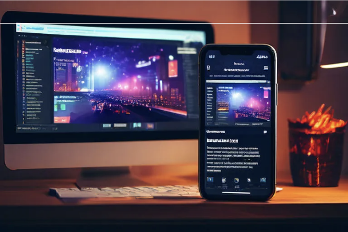

요즘 디지털 환경에서는 웹사이트가 스마트폰에서도 데스크톱과 같이 효과적인지 확인하는 것이 중요합니다. 반응형 웹 디자인 (RWD)은 현대 웹 개발의 기반을 이루며, 웹사이트가 모든 화면 크기에 매끄럽게 적응할 수 있게 합니다. 이 안내서는 다양한 기기에서 최적의 뷰잉 경험을 제공하는 웹사이트를 만들기 위한 핵심 원칙과 기술에 대해 자세히 다룹니다.

# 반응형 웹 디자인 이해하기

반응형 웹 디자인은 웹사이트의 외관을 동적으로 변경하여, 웹사이트를 보는 기기의 화면 크기와 방향에 따라 변화를 줍니다. 목표는 방문자의 화면 크기와 방향을 감지하고 레이아웃을 그에 맞게 변경하는 웹 페이지를 만드는 것입니다.

<!-- ui-log 수평형 -->
<ins class="adsbygoogle"
  style="display:block"
  data-ad-client="ca-pub-4877378276818686"
  data-ad-slot="9743150776"
  data-ad-format="auto"
  data-full-width-responsive="true"></ins>
<component is="script">
(adsbygoogle = window.adsbygoogle || []).push({});
</component>

# RWD의 주요 구성 요소

# 기법 1: 미디어 쿼리 사용

사용 사례: 화면 너비가 600픽셀 미만일 때 콘텐츠 영역의 배경색이 변경되어, 모바일 기기에서 더 나은 독서 경험을 제공하는 웹페이지를 디자인합니다.

기법 설명: 미디어 쿼리를 통해 다양한 화면 크기에 대해 다른 CSS 스타일을 적용할 수 있습니다. 이는 반응형 디자인에서 가장 기본적이고 강력한 도구 중 하나입니다.

<!-- ui-log 수평형 -->
<ins class="adsbygoogle"
  style="display:block"
  data-ad-client="ca-pub-4877378276818686"
  data-ad-slot="9743150776"
  data-ad-format="auto"
  data-full-width-responsive="true"></ins>
<component is="script">
(adsbygoogle = window.adsbygoogle || []).push({});
</component>

예시 코드:

```js
/* 기본 스타일 */
.content-area {
 background-color: #fff; /* 기본적으로 흰색 배경 */
}

/* 화면 너비가 600px 미만일 때 적용되는 스타일 */
@media (max-width: 600px) {
.content-area {
 background-color: #f0f0f0; /* 모바일에서 가독성을 높이기 위한 밝은 회색 배경 */
}
}
```

# 기술 2: 유연한 레이아웃

사례: 측면 표시줄과 본문 콘텐츠 영역이 포함된 웹페이지 레이아웃을 만드는 경우 화면 너비가 충분히 넓을 때에는 측면 표시줄과 콘텐츠 영역이 나란히 표시되며, 더 좁은 화면에서는 측면 표시줄이 콘텐츠 영역 위로 이동합니다.

<!-- ui-log 수평형 -->
<ins class="adsbygoogle"
  style="display:block"
  data-ad-client="ca-pub-4877378276818686"
  data-ad-slot="9743150776"
  data-ad-format="auto"
  data-full-width-responsive="true"></ins>
<component is="script">
(adsbygoogle = window.adsbygoogle || []).push({});
</component>

기법 설명: Flexbox(유연한 박스 레이아웃 모듈)을 사용하면 화면 크기 변경에 자동으로 적응할 수 있는 유연한 레이아웃을 생성할 수 있습니다.

예시 코드:

```js
.container {
  display: flex; /* Flexbox 레이아웃 활성화 */
  flex-wrap: wrap; /* 필요에 따라 항목이 다음 줄로 랩핑되도록 함 */
}
.sidebar {
  flex: 1; /* 사이드바는 사용 가능한 공간의 1부분을 차지 */
}
.main-content {
  flex: 2; /* 주 콘텐츠는 사용 가능한 공간의 2부분을 차지 */
}
/* 좁은 화면에 대한 조정 */
@media (max-width: 600px) {
  .sidebar,
  .main-content {
    flex-basis: 100%; /* 좁은 화면에서 각각 컨테이너의 전체 너비 차지 */
  }
}
```

사용 사례: 데스크톱 화면에서 수평으로 표시되는 내비게이션 메뉴를 디자인하고, 모바일 장치에서는 수직 레이아웃으로 전환하여 공간을 최적화하고 사용성을 향상시킵니다.

<!-- ui-log 수평형 -->
<ins class="adsbygoogle"
  style="display:block"
  data-ad-client="ca-pub-4877378276818686"
  data-ad-slot="9743150776"
  data-ad-format="auto"
  data-full-width-responsive="true"></ins>
<component is="script">
(adsbygoogle = window.adsbygoogle || []).push({});
</component>

기술 설명: Flexbox를 사용하면 미디어 쿼리를 이용해 쉽게 행과 열 레이아웃을 전환할 수 있습니다. flex-direction 속성을 변경하여 화면 크기에 따라 플렉스 아이템을 가로 행에서 세로 열로 재배치할 수 있습니다.

예시 코드:

```js
<div class="nav-container">
 <div class="nav-item">홈</div>
 <div class="nav-item">소개</div>
 <div class="nav-item">서비스</div>
 <div class="nav-item">연락처</div>
</div>
```

```js
.nav-container {
 display: flex;
 flex-direction: row; /* 기본 레이아웃: 가로 */
 justify-content: space-around; /* 아이템 주위에 공간 배분 */
 padding: 10px;
 list-style: none;
}
.nav-item {
 padding: 10px;
 background-color: lightgrey;
 margin: 5px;
}
/* 600px보다 작은 화면을 위한 미디어 쿼리 */
@media (max-width: 600px) {
 .nav-container {
 flex-direction: column; /* 세로 레이아웃으로 전환 */
 align-items: center; /* 아이템을 수직으로 가운데 정렬 */
 }
}
```

<!-- ui-log 수평형 -->
<ins class="adsbygoogle"
  style="display:block"
  data-ad-client="ca-pub-4877378276818686"
  data-ad-slot="9743150776"
  data-ad-format="auto"
  data-full-width-responsive="true"></ins>
<component is="script">
(adsbygoogle = window.adsbygoogle || []).push({});
</component>

이 예시에서는 .nav-container가 행 방향으로 시작하여 자식 요소(nav-item)를 수평으로 배치합니다. justify-content: space-around; 속성을 사용하면 항목들이 균등하게 분배되고 주위에 공간이 만들어집니다.

화면 너비가 600px 이하로 줄어들면 미디어 쿼리가 작동하여 flex-direction이 column으로 변경됩니다. 이렇게 되면 .nav-item 요소가 수직으로 쌓이고 align-items: center; 속성을 사용하여 컨테이너 내에서 가운데 정렬됩니다. 이 레이아웃 변경은 화면 너비가 제한되어 있는 모바일 기기에 적합하며 수직 내비게이션 메뉴가 사용자 친화적입니다.

Flexbox와 미디어 쿼리를 이렇게 활용함으로써 사용자의 기기에 대응하는 반응형 디자인을 만들어 전반적인 사용자 경험을 향상시킬 수 있습니다.

# 기술 3: 뷰포트 단위 사용

<!-- ui-log 수평형 -->
<ins class="adsbygoogle"
  style="display:block"
  data-ad-client="ca-pub-4877378276818686"
  data-ad-slot="9743150776"
  data-ad-format="auto"
  data-full-width-responsive="true"></ins>
<component is="script">
(adsbygoogle = window.adsbygoogle || []).push({});
</component>

사용 사례: 환영 페이지를 디자인하여 제목이 화면의 50%를 채우는 높이를 유지하도록 만듭니다. 어떤 기기에서든 이를 볼 수 있습니다.

기술 설명: 뷰포트 단위(vh 및 vw와 같은)를 사용하면 요소의 크기를 뷰포트 크기에 상대적으로 정의할 수 있어 반응형 디자인을 만드는 데 이상적입니다.

예제 코드:

```js
.hero-title {
 height: 50vh; /* 뷰포트 높이의 50%로 높이 설정 */
 width: 100vw; /* 선택 사항: 뷰포트 너비의 100%로 너비 설정 */
 display: flex;
 justify-content: center;
 align-items: center;
 text-align: center;
 /* 제목에 대한 추가 스타일링 */
}
```

<!-- ui-log 수평형 -->
<ins class="adsbygoogle"
  style="display:block"
  data-ad-client="ca-pub-4877378276818686"
  data-ad-slot="9743150776"
  data-ad-format="auto"
  data-full-width-responsive="true"></ins>
<component is="script">
(adsbygoogle = window.adsbygoogle || []).push({});
</component>

# 기술 방법 4: 반응형 이미지

사용 사례: 웹 사이트의 이미지가 잘리거나 늘어지지 않고 어떤 기기에서든 올바르게 표시되도록합니다. 원래의 비율을 유지합니다.

기술 설명: 이미지의 최대 너비를 100%로 설정하고 높이를 자동으로 설정하여 이미지를 반응형으로 만들 수 있습니다. 이렇게 하면 이미지가 작은 화면에서 축소되지만 컨테이너의 너비를 초과하지 않도록합니다.

예제 코드:

<!-- ui-log 수평형 -->
<ins class="adsbygoogle"
  style="display:block"
  data-ad-client="ca-pub-4877378276818686"
  data-ad-slot="9743150776"
  data-ad-format="auto"
  data-full-width-responsive="true"></ins>
<component is="script">
(adsbygoogle = window.adsbygoogle || []).push({});
</component>

```css
img.responsive {
 max-width: 100%;
 height: auto;
}
```

# 기술 5: 백분율 기반 레이아웃 사용

사용 사례: 화면 크기에 따라 한 행당 이미지 수가 조정되고 이미지 사이 간격이 일정한 유동 레이아웃 갤러리를 디자인합니다.

기술 설명: 너비에 대한 픽셀 값 대신 백분율을 사용하면 화면 너비에 따라 조정되는 레이아웃이 가능해져 더 민첩한 디자인을 만들 수 있습니다.```

<!-- ui-log 수평형 -->
<ins class="adsbygoogle"
  style="display:block"
  data-ad-client="ca-pub-4877378276818686"
  data-ad-slot="9743150776"
  data-ad-format="auto"
  data-full-width-responsive="true"></ins>
<component is="script">
(adsbygoogle = window.adsbygoogle || []).push({});
</component>

예시 코드:

```js
.gallery-item {
    float: left;
    width: 33.33%; /* 한 행에 3개의 이미지를 기본으로 표시 */
    padding: 5px; /* 이미지 주변 간격 */
}
@media (max-width: 600px) {
    .gallery-item {
        width: 50%; /* 작은 화면에서 한 행에 2개의 이미지로 조정 */
    }
}
@media (max-width: 400px) {
    .gallery-item {
        width: 100%; /* 매우 작은 화면에서 한 행에 1개의 이미지로 표시 */
    }
}
```

# 기술 6: 반응형 폰트 크기

활용 사례: 사용자가 확대를 필요로하지 않고도 다양한 화면 크기의 디바이스에서 텍스트가 가독성 있고 접근성이 확보되도록 함.

<!-- ui-log 수평형 -->
<ins class="adsbygoogle"
  style="display:block"
  data-ad-client="ca-pub-4877378276818686"
  data-ad-slot="9743150776"
  data-ad-format="auto"
  data-full-width-responsive="true"></ins>
<component is="script">
(adsbygoogle = window.adsbygoogle || []).push({});
</component>

기법 설명: 폰트 크기에 상대 단위(예: em 또는 rem)를 사용하는 것은 화면 크기에 비례하여 텍스트 크기가 조정되도록 합니다. 이를 미디어 쿼리와 결합하여 다양한 기기에서 텍스트 크기를 보다 정교하게 조절할 수 있습니다.

예시 코드:

```css
body {
  font-size: 16px; /* 기본 폰트 크기 */
}
h1 {
  font-size: 2rem; /* 제목에 대한 큰 텍스트 */
}
@media (max-width: 600px) {
  body {
    font-size: 14px; /* 작은 기기용으로 조금 더 작은 폰트 크기 */
  }
  h1 {
    font-size: 1.5rem; /* 제목 크기를 맞게 조정 */
  }
}
```

# 기법 7: 요소 숨기기와 표시하기

<!-- ui-log 수평형 -->
<ins class="adsbygoogle"
  style="display:block"
  data-ad-client="ca-pub-4877378276818686"
  data-ad-slot="9743150776"
  data-ad-format="auto"
  data-full-width-responsive="true"></ins>
<component is="script">
(adsbygoogle = window.adsbygoogle || []).push({});
</component>

사용 사례: 작은 기기에서 불필요한 정보나 이미지를 숨겨서 혼잡을 줄이고 핵심 콘텐츠에 집중하세요.

기술 설명: display 속성을 미디어 쿼리와 함께 사용하여 화면 크기에 따라 어떤 요소가 보이거나 숨겨지는지 제어할 수 있습니다.

예시 코드:

```js
.sidebar {
 display: block; /* 기본적으로 표시됨 */
}
@media (max-width: 600px) {
 .sidebar {
 display: none; /* 작은 화면에서 숨겨짐 */
 }
}
```

<!-- ui-log 수평형 -->
<ins class="adsbygoogle"
  style="display:block"
  data-ad-client="ca-pub-4877378276818686"
  data-ad-slot="9743150776"
  data-ad-format="auto"
  data-full-width-responsive="true"></ins>
<component is="script">
(adsbygoogle = window.adsbygoogle || []).push({});
</component>

# 기술 8: 반응형 그리드 레이아웃

사용 사례: 더 큰 화면에서는 기사 열이 옆에 표시되고, 더 작은 화면에서는 쌓여 표시되는 반응형 뉴스 웹사이트 레이아웃을 만듭니다.

기술 설명: CSS 그리드 레이아웃은 복잡한 레이아웃을 만드는 고급적이고 유연한 방법을 제공합니다. 그리드 컨테이너와 아이템을 정의하고 미디어 쿼리로 그리드 레이아웃을 조정함으로써, 복잡한 반응형 디자인을 달성할 수 있습니다.

예시 코드:

<!-- ui-log 수평형 -->
<ins class="adsbygoogle"
  style="display:block"
  data-ad-client="ca-pub-4877378276818686"
  data-ad-slot="9743150776"
  data-ad-format="auto"
  data-full-width-responsive="true"></ins>
<component is="script">
(adsbygoogle = window.adsbygoogle || []).push({});
</component>

```js
.container {
  display: grid;
  grid-template-columns: 1fr 2fr; /* 사이드 바 및 본문 콘텐츠 영역 */
}
@media (max-width: 600px) {
  .container {
    grid-template-columns: 1fr; /* 작은 화면에 항목을 쌓습니다 */
  }
}
```

활용 사례: 서로 다른 화면 크기에 맞추어 자연스럽게 조정되는 복잡하고 다양한 열 레이아웃을 생성하여 콘텐츠 계층을 유지합니다.

기술 설명: CSS 그리드 레이아웃은 행 및 열이 있는 2차원 그리드 기반 레이아웃 시스템을 제공하여 복잡한 반응형 레이아웃을 디자인하는 데 도움이 됩니다. 복수의 중첩된 div 또는 복잡한 프레임워크를 사용하지 않고도 간편하게 복잡한 반응형 레이아웃을 구성할 수 있습니다.

예시 코드:```

<!-- ui-log 수평형 -->
<ins class="adsbygoogle"
  style="display:block"
  data-ad-client="ca-pub-4877378276818686"
  data-ad-slot="9743150776"
  data-ad-format="auto"
  data-full-width-responsive="true"></ins>
<component is="script">
(adsbygoogle = window.adsbygoogle || []).push({});
</component>

```css
.grid-container {
  display: grid;
  grid-template-columns: repeat(auto-fill, minmax(250px, 1fr));
  gap: 20px;
}
```

# 기술 9: 적응형 비디오

사용 사례: 비디오를 임베드하여 다양한 기기에서 볼 때 올바른 종횡비를 유지하고 잘림이나 늘어남이 없게 하는 방법.

기술 설명: 비디오 컨테이너의 너비를 100%로 설정하고 패딩 탑 속성을 사용하여 너비의 백분율로 높이를 만들면, 장치 화면 크기에 관계없이 종횡비를 유지하는 반응형 비디오 임베딩이 만들어집니다.

<!-- ui-log 수평형 -->
<ins class="adsbygoogle"
  style="display:block"
  data-ad-client="ca-pub-4877378276818686"
  data-ad-slot="9743150776"
  data-ad-format="auto"
  data-full-width-responsive="true"></ins>
<component is="script">
(adsbygoogle = window.adsbygoogle || []).push({});
</component>

예시 코드:

```css
.responsive-video {
 position: relative;
 width: 100%;
 padding-top: 56.25%; /* 16:9의 비율 */
}
.responsive-video iframe {
 position: absolute;
 top: 0;
 left: 0;
 width: 100%;
 height: 100%;
}
```

# 기술 10: 테마 전환을 위한 CSS 변수 사용

<!-- ui-log 수평형 -->
<ins class="adsbygoogle"
  style="display:block"
  data-ad-client="ca-pub-4877378276818686"
  data-ad-slot="9743150776"
  data-ad-format="auto"
  data-full-width-responsive="true"></ins>
<component is="script">
(adsbygoogle = window.adsbygoogle || []).push({});
</component>

사용 사례: 사용자가 선호에 따라 빛과 어두운 테마를 전환할 수 있도록 하여 사용성과 개인화를 향상시킵니다.

기술 설명: CSS 사용자 지정 속성(변수)을 활용하여 색 및 기타 스타일 값을 정의합니다. 사용자 선택에 따라 JavaScript를 사용하여 이러한 변수 값을 전환하여 테마를 동적으로 변경합니다.

예시 코드:

```css
:root {
 - primary-color: #007bff;
 - background-color: #ffffff;
 - text-color: #000000;
}
[data-theme="dark"] {
 - primary-color: #6c757d;
 - background-color: #343a40;
 - text-color: #ffffff;
}
body {
 background-color: var(--background-color);
 color: var(--text-color);
}
```

<!-- ui-log 수평형 -->
<ins class="adsbygoogle"
  style="display:block"
  data-ad-client="ca-pub-4877378276818686"
  data-ad-slot="9743150776"
  data-ad-format="auto"
  data-full-width-responsive="true"></ins>
<component is="script">
(adsbygoogle = window.adsbygoogle || []).push({});
</component>

# 기술 11: object-fit 및 object-position을 사용하여 이미지 종횡비 조정

사용 사례: 반응형 디자인에서 이미지가 적절하게 표시되고 왜곡이나 원하지 않는 자르기 없이 나타나도록 제어합니다.

기술 설명: object-fit 속성을 사용하면 이미지나 비디오를 해당 컨테이너에 맞게 조정할 수 있습니다. 이는 배경 이미지용 background-size 속성과 유사합니다. object-position을 사용하면 이미지의 위치를 조정할 수 있습니다.

예시 코드:

<!-- ui-log 수평형 -->
<ins class="adsbygoogle"
  style="display:block"
  data-ad-client="ca-pub-4877378276818686"
  data-ad-slot="9743150776"
  data-ad-format="auto"
  data-full-width-responsive="true"></ins>
<component is="script">
(adsbygoogle = window.adsbygoogle || []).push({});
</component>

```css
.responsive-img {
 width: 100%;
 height: 200px; /* 높이 지정 */
 object-fit: cover; /* 컨테이너를 덮음, 이미지를 자를 수 있음 */
 object-position: center; /* 컨테이너 내에서 이미지를 중앙 정렬 */
}
```

# 기법 12: clip-path로 동적 모양 만들기

사용 사례: 사용자의 관심을 끌기 위해 비직사각형 모양의 배경을 사용하여 눈길을 사로잡는 인트로 섹션 디자인

기법 설명: clip-path 속성을 사용하면 복잡한 모양을 만들어 요소에 독특한 시각 효과를 제공할 수 있습니다. 반응형 디자인과 결합하면 화면 크기에 따라 모양이 조정되어 디자인의 동적성과 매력을 유지할 수 있습니다.

<!-- ui-log 수평형 -->
<ins class="adsbygoogle"
  style="display:block"
  data-ad-client="ca-pub-4877378276818686"
  data-ad-slot="9743150776"
  data-ad-format="auto"
  data-full-width-responsive="true"></ins>
<component is="script">
(adsbygoogle = window.adsbygoogle || []).push({});
</component>

예제 코드:

```js
.dynamic-shape {
 clip-path: polygon(50% 0%, 100% 50%, 50% 100%, 0% 50%);
 background-color: var(--primary-color);
 /* 추가적인 스타일 */
}
```

# 기술 13: CSS에서 min() 및 max() 함수 활용하기

사용 사례: 범위 내에서 동적으로 크기를 조정하는 텍스트 디자인하기. 화면 크기에 따라 가독성을 보장하며 넓은 화면에서 너무 커지지 않고 좁은 화면에서 너무 작아지지 않도록 조정합니다.

<!-- ui-log 수평형 -->
<ins class="adsbygoogle"
  style="display:block"
  data-ad-client="ca-pub-4877378276818686"
  data-ad-slot="9743150776"
  data-ad-format="auto"
  data-full-width-responsive="true"></ins>
<component is="script">
(adsbygoogle = window.adsbygoogle || []).push({});
</component>

기술 설명: CSS의 min() 및 max() 함수를 사용하면 지정된 한계 내에서 조절되는 크기를 설정할 수 있습니다. 이는 디자인을 더 유연하게 만들고 모든 화면 크기에서 요소가 잘 보이도록 하는 데 유용합니다.

예시 코드:

```js
body {
 font-size: min(max(1rem, 2vw), 1.5rem);
}
```

# 기법 14: 조건부 로딩

<!-- ui-log 수평형 -->
<ins class="adsbygoogle"
  style="display:block"
  data-ad-client="ca-pub-4877378276818686"
  data-ad-slot="9743150776"
  data-ad-format="auto"
  data-full-width-responsive="true"></ins>
<component is="script">
(adsbygoogle = window.adsbygoogle || []).push({});
</component>

사용 사례: 장치의 기능과 화면 크기에 따라 이미지 및 비디오와 같은 무거운 자원을 필요한 경우에만로드하여 웹 사이트 성능을 최적화합니다.

기술 설명: JavaScript를 사용하여 장치의 화면 크기 또는 연결 유형을 감지하고 조건부로 리소스를로드합니다. 이렇게하면 스몰 스크린이거나 느린 연결을 가진 장치에서 로드 시간을 줄이고 사용자 경험을 향상시킬 수 있습니다.

예제 코드:

```js
if (window.innerWidth > 600) {
 // 고해상도 이미지 로드
} else {
 // 최적화된 작은 이미지 로드
}
```

<!-- ui-log 수평형 -->
<ins class="adsbygoogle"
  style="display:block"
  data-ad-client="ca-pub-4877378276818686"
  data-ad-slot="9743150776"
  data-ad-format="auto"
  data-full-width-responsive="true"></ins>
<component is="script">
(adsbygoogle = window.adsbygoogle || []).push({});
</component>

# 프레임워크

반응형 사이트를 수동으로 코딩하는 것은 귀중한 기술이지만, 몇 가지 도구와 프레임워크를 사용하면 프로세스를 더 효율적으로 만들 수 있어요:

- Bootstrap: 반응형 그리드와 구성 요소를 포함한 인기 있는 프레임워크입니다.
- Foundation: 다른 튼튼한 프레임워크로, 반응형 및 접근성 있는 웹사이트를 디자인하는 데 사용됩니다.

# 반응형 디자인 테스트하기

<!-- ui-log 수평형 -->
<ins class="adsbygoogle"
  style="display:block"
  data-ad-client="ca-pub-4877378276818686"
  data-ad-slot="9743150776"
  data-ad-format="auto"
  data-full-width-responsive="true"></ins>
<component is="script">
(adsbygoogle = window.adsbygoogle || []).push({});
</component>

테스트는 반응형 웹 디자인의 중요한 부분입니다. Chrome 개발자 도구와 같은 도구를 사용하여 다양한 기기와 화면 크기를 시뮬레이션할 수 있습니다. 또한, 실제 기기에서의 테스트는 실제 사용자 경험을 이해하는 데 매우 중요합니다.

# pxCode로 반응형 웹 디자인 향상하기

개요: pxCode는 현대적인 웹 개발자와 디자이너를 위한 도구로, 직관적이고 시각적인 방식으로 반응형 웹사이트를 만들 수 있게 해주어 두드러집니다. 전통적인 코딩이나 디자인 도구와 달리 pxCode는 "보이는 대로 얻는다" (WYSIWYG) 방법론을 강조하여 사용자가 바로 레이아웃을 조작하고 다양한 화면 크기에 즉시 결과를 볼 수 있게 합니다. 이 기능은 디자인 프로세스를 크게 가속화시키고 생성된 코드가 효율적이고 반응형임을 보장합니다.

pxCode의 주요 기능:

<!-- ui-log 수평형 -->
<ins class="adsbygoogle"
  style="display:block"
  data-ad-client="ca-pub-4877378276818686"
  data-ad-slot="9743150776"
  data-ad-format="auto"
  data-full-width-responsive="true"></ins>
<component is="script">
(adsbygoogle = window.adsbygoogle || []).push({});
</component>

- **반응형 시각 수정**: pxCode는 디자이너와 개발자들이 실시간으로 반응형 레이아웃을 조정하고 테스트할 수 있도록 합니다. 사용자들은 요소를 드래그하고 크기를 조절하며, 플랫폼은 해당 반응형 CSS 코드를 자동으로 생성합니다.
- **깔끔하고 효율적인 코드 생성**: 시각 디자인 도구의 한 가지 어려움은 코드가 비대하거나 비효율적일 수 있다는 것입니다. pxCode는 반응형 웹 디자인의 모범 사례를 준수하는 깔끔하고 최적화된, 가독성 있는 코드를 생성하여 이 문제를 해결합니다.
- **다중 뷰포트 편집**: 사용자들은 pxCode 편집기 내에서 여러 기기 크기에서 디자인을 동시에 미리보기하고 편집할 수 있습니다. 이 기능은 웹사이트가 모바일 폰부터 대형 데스크탑 디스플레이까지 어떤 기기에서도 훌륭하게 보이고 잘 작동함을 보장합니다.
- **디자인 도구와 통합**: pxCode는 Figma와 같은 인기 있는 디자인 도구와 통합 기능을 제공합니다. 디자이너들은 기존 레이아웃을 pxCode로 가져와 반응형으로 세밀하게 조정할 수 있으며, 이를 통해 디자인부터 개발까지의 워크플로우를 간소화할 수 있습니다.
- **구성 요소 기반 디자인 시스템**: 이 플랫폼은 구성 요소 기반 접근 방식을 지원하여 사용자가 재사용 가능한 디자인 요소를 만들 수 있도록 합니다. 이 시스템은 디자인 프로세스를 가속화할 뿐만 아니라 웹사이트 전체에서 일관성과 유지보수성에 기여합니다.

예시 작업흐름:

- **디자인 가져오기**: Sketch, Adobe XD 또는 Figma에서 pxCode로 디자인을 가져오기 시작합니다.
- **반응형 조정**: pxCode의 시각 편집기를 사용하여 여러 화면 크기에 대해 여백, 안간격 및 기타 레이아웃 속성을 조정합니다. 변경 사항은 모든 기기 미리보기에서 실시간으로 반영됩니다.
- **코드 최적화 및 내보내기**: 모든 원하는 화면 크기에서 디자인이 완벽해 보일 때, pxCode를 사용하여 깔끔하고 최적화된 HTML 및 CSS 코드를 생성합니다. 이 플랫폼은 코드가 개발 프로젝트로 통합할 준비가 되었음을 보장합니다.

# 결론

<!-- ui-log 수평형 -->
<ins class="adsbygoogle"
  style="display:block"
  data-ad-client="ca-pub-4877378276818686"
  data-ad-slot="9743150776"
  data-ad-format="auto"
  data-full-width-responsive="true"></ins>
<component is="script">
(adsbygoogle = window.adsbygoogle || []).push({});
</component>

반응형 웹 디자인은 단순한 트렌드가 아니라, 모바일 인터넷 시대의 웹 개발에서 근본적인 접근 방식입니다. 이러한 단계와 원칙을 따라가면 웹사이트가 모든 기기에서 접근 가능하고 사용하기 쉽며 즐길 수 있도록 할 수 있습니다.

반응형 웹사이트를 만들기 위해서는 레이아웃, 콘텐츠 및 디자인에 신중한 접근이 필요합니다. 웹의 유연성과 반응성을 고려한 설계로 시작해야 합니다.