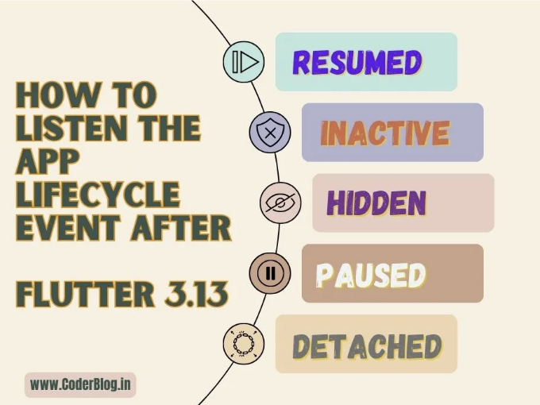
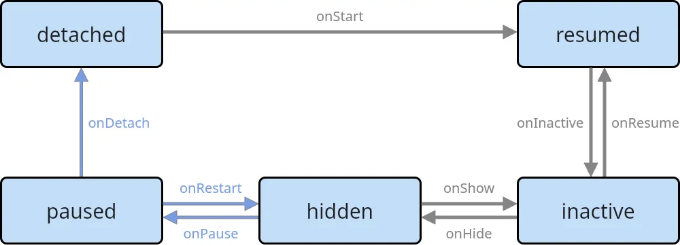

# 1. 플러터에서 앱 라이프사이클 상태란 무엇인가요?

플러터에서는 앱의 다양한 라이프사이클 이벤트를 듣고 앱의 다양한 상태를 처리할 수 있지만, 오늘은 didChangeAppLifecycleState 이벤트에 대해 알아보겠습니다. 이 이벤트는 앱의 라이프사이클 상태가 변경될 때마다 트리거됩니다. 가능한 상태는 resumed, inactive, paused, detached, hidden이 있습니다. WidgetsBindingObserver mixin을 사용하여 이 이벤트를 수신할 수 있습니다.

- resumed: 모든 플랫폼에서 이 상태는 입력 포커스가 있고 보이는 실행 중인 애플리케이션의 기본 실행 모드임을 나타냅니다.
- inactive: 애플리케이션의 하나 이상의 뷰가 보이지만 입력 포커스가 없습니다. 그 외에는 애플리케이션이 정상적으로 실행됩니다.
- paused: 애플리케이션이 현재 사용자에게 표시되지 않고 사용자 입력에 응답하지 않습니다.
- detached: 애플리케이션은 여전히 플러터 엔진에 의해 호스팅되지만 호스트 뷰에서 분리되었습니다.
- hidden: 애플리케이션의 모든 뷰가 숨겨져 있는 상태로, 애플리케이션이 일시 중지되어야 할 때(애플 iOS 및 안드로이드), 최소화되거나 더 이상 보이지 않는 데스크톱에 놓여 있거나(비웹 데스크톱) 보이지 않는 창이나 탭에서 실행 중인 경우(웹) 있는 상태입니다.

<!-- ui-log 수평형 -->
<ins class="adsbygoogle"
  style="display:block"
  data-ad-client="ca-pub-4877378276818686"
  data-ad-slot="9743150776"
  data-ad-format="auto"
  data-full-width-responsive="true"></ins>
<component is="script">
(adsbygoogle = window.adsbygoogle || []).push({});
</component>

이러한 라이프사이클 상태를 상태 관리 위젯에 구현함으로써 다양한 이벤트에 대응하고 앱의 상태를 관리할 수 있습니다. 예를 들어, 앱이 백그라운드로 전환될 때 특정 작업을 일시 중지하거나 다른 위젯 의존성이 변경될 때 데이터 가져오기를 처리할 수 있습니다.

# 2. 플러터 3.13 이전의 앱 라이프사이클 이벤트 수신하기

플러터 버전 3.13 이전에는 WidgetsBindingObserver mixin을 활용하여 앱 라이프사이클 이벤트를 처리할 수 있었습니다. 이를 위해서는 State 클래스에 WidgetsBindingObserver mixin을 포함하고 didChangeAppLifecycleState 메서드를 오버라이드해야 했습니다. 이 메서드 내에서 앱의 현재 상태(AppLifecycleState)에 접근하여 다양한 앱 라이프사이클 이벤트에 대응할 수 있었습니다.

```js
class AppLifecyclePageOld extends StatefulWidget {
  const AppLifecyclePageOld({Key? key}) : super(key: key);
  
  @override
  State<AppLifecyclePageOld> createState() => _AppLifecyclePageOldState();
}

class _AppLifecyclePageOldState extends State<AppLifecyclePageOld> with WidgetsBindingObserver {

  @override
  void initState() {
    super.initState();
    
    WidgetsBinding.instance.addObserver(this);
  }

  @override
  void dispose() {
    WidgetsBinding.instance.removeObserver(this);
    super.dispose();
  }

  @override
  void didChangeAppLifecycleState(AppLifecycleState state) {
    super.didChangeAppLifecycleState(state);

    switch (state) {
      case AppLifecycleState.detached:
        _onDetached();
        break;
      case AppLifecycleState.resumed:
        _onResumed();
        break;
      case AppLifecycleState.inactive:
        _onInactive();
        break;
      case AppLifecycleState.hidden:
        _onHidden();
        break;
      case AppLifecycleState.paused:
        _onPaused();
        break;
    }
  }

  void _onDetached() => print('detached');
  void _onResumed() => print('resumed');
  void _onInactive() => print('inactive');
  void _onHidden() => print('hidden');
  void _onPaused() => print('paused');

  @override
  Widget build(BuildContext context) {
    return const Scaffold(
      body: Placeholder(),
    );
  }
}
```

<!-- ui-log 수평형 -->
<ins class="adsbygoogle"
  style="display:block"
  data-ad-client="ca-pub-4877378276818686"
  data-ad-slot="9743150776"
  data-ad-format="auto"
  data-full-width-responsive="true"></ins>
<component is="script">
(adsbygoogle = window.adsbygoogle || []).push({});
</component>

# 3. 플러터 3.13 이후 앱 라이프사이클 이벤트를 듣는 새로운 방법

플러터 3.13 이후에는 새로운 AppLifecycleListener 클래스를 사용하여 앱 라이프사이클 이벤트를 감시할 수 있습니다.

AppLifecycleListener 클래스는 플러터에서 앱 라이프사이클 이벤트를 감시하는 편리하고 대체적인 접근 방식을 제공합니다. WidgetsBindingObserver mixin을 직접 사용하는 대신 AppLifecycleListener 클래스를 활용하여 프로세스를 간소화할 수 있습니다.

AppLifecycleListener를 사용하려면 클래스의 인스턴스를 만들고 청취하려는 원하는 이벤트 콜백을 전달하면 됩니다. 이를 통해 WidgetsBindingObserver mixin 전체를 구현할 필요 없이 특정 앱 라이프사이클 이벤트를 쉽게 처리할 수 있습니다.

<!-- ui-log 수평형 -->
<ins class="adsbygoogle"
  style="display:block"
  data-ad-client="ca-pub-4877378276818686"
  data-ad-slot="9743150776"
  data-ad-format="auto"
  data-full-width-responsive="true"></ins>
<component is="script">
(adsbygoogle = window.adsbygoogle || []).push({});
</component>

AppLifecycleListener을 사용하면 코드를 최적화하고 더 가독성이 높고 유지보수가 쉬워집니다. 관심 있는 특정 이벤트에만 집중하면 됩니다.

```js
class AppLifecyclePage extends StatefulWidget {
  const AppLifecyclePage({super.key});

  @override
  State<AppLifecyclePage> createState() => _AppLifecyclePageState();
}

class _AppLifecyclePageState extends State<AppLifecyclePage> {
  late final AppLifecycleListener _listener;

  @override
  void initState() {
    super.initState();

    // AppLifecycleListener 클래스를 초기화하고 콜백을 전달합니다.
    _listener = AppLifecycleListener(
      onStateChange: _onStateChanged,
    );
  }

  @override
  void dispose() {
    // 리스너를 dispose 하는 것을 잊지 마세요.
    _listener.dispose();
    super.dispose();
  }

  // 앱 라이프사이클 상태 변경을 감시합니다.
  void _onStateChanged(AppLifecycleState state) {
    switch (state) {
      case AppLifecycleState.detached:
        _onDetached();
      case AppLifecycleState.resumed:
        _onResumed();
      case AppLifecycleState.inactive:
        _onInactive();
      case AppLifecycleState.hidden:
        _onHidden();
      case AppLifecycleState.paused:
        _onPaused();
    }
  }

  void _onDetached() => print('detached');
  void _onResumed() => print('resumed');
  void _onInactive() => print('inactive');
  void _onHidden() => print('hidden');
  void _onPaused() => print('paused');
  @override
  Widget build(BuildContext context) {
    return const Scaffold(
      body: Placeholder(),
    );
  }
}
```

# 4. 무슨 차이가 있을까요?

과거 방식과 새로운 방식은 매우 유사합니다. AppLifecycleListener 클래스의 주요 장점을 이해하려면 플러터 앱 라이프사이클의 상태 머신 다이어그램을 살펴보겠습니다:

<!-- ui-log 수평형 -->
<ins class="adsbygoogle"
  style="display:block"
  data-ad-client="ca-pub-4877378276818686"
  data-ad-slot="9743150776"
  data-ad-format="auto"
  data-full-width-responsive="true"></ins>
<component is="script">
(adsbygoogle = window.adsbygoogle || []).push({});
</component>



다이어그램은 Flutter 앱의 다양한 상태와 그들 사이의 가능한 전환을 설명하고 있어요. "예전" 방식에서 didChangeAppLifecycleState 메서드를 재정의할 때, 앱이 다시 활성 상태로 전환되는 등 특정 상태 변경 사항에 대해 듣을 수는 있지만, 상태 간 전환에 대한 정보를 얻을 수 없었어요. 예를 들어, 앱이 비활성 상태나 분리 상태에서 다시 활성 상태로 전환되었는지 확인할 수 없었죠.

AppLifecycleListener 클래스가 도입됨으로써, 이제 이러한 상태 전환을 듣을 수 있어요. 이는 앱이 거치는 상태의 순서를 추적하고 응답하여 앱의 라이프사이클에 대해 더 포괄적으로 이해할 수 있게 해줘요.

AppLifecycleListener 클래스를 활용하면 상태 간 전환을 효과적으로 포착하고 처리할 수 있어요. 이를 통해 앱의 행동을 더 정확하게 제어하고 사용자 정의할 수 있게 해줘요.

<!-- ui-log 수평형 -->
<ins class="adsbygoogle"
  style="display:block"
  data-ad-client="ca-pub-4877378276818686"
  data-ad-slot="9743150776"
  data-ad-format="auto"
  data-full-width-responsive="true"></ins>
<component is="script">
(adsbygoogle = window.adsbygoogle || []).push({});
</component>

```dart
class AppLifecyclePage extends StatefulWidget {
  const AppLifecyclePage({super.key});

  @override
  State<AppLifecyclePage> createState() => _AppLifecyclePageState();
}

class _AppLifecyclePageState extends State<AppLifecyclePage> {
  late final AppLifecycleListener _listener;
  String _currentState = '';

  @override
  void initState() {
    super.initState();

    // Pass all the callbacks for the transitions you want to listen to
    _listener = AppLifecycleListener(
      onDetach: _onDetach,
      onHide: _onHide,
      onInactive: _onInactive,
      onPause: _onPause,
      onRestart: _onRestart,
      onResume: _onResume,
      onShow: _onShow,
      onStateChange: _onStateChanged,
    );
  }

  @override
  void dispose() {
    _listener.dispose();
    super.dispose();
  }

  void _onDetach() {
    print('onDetach');
    _currentState = 'onDetach';
  }

  void _onHide() {
    print('onHide');
    _currentState = 'onHide';
  }

  void _onInactive() {
    print('onInactive');
    _currentState = 'onInactive';
  }

  void _onPause() {
    print('onPause');
    _currentState = 'onPause';
  }

  void _onRestart() {
    print('onRestart');
    _currentState = 'onRestart';
  }

  void _onResume() {
    print('onResume');
    _currentState = 'onResume';
  }

  void _onStateChanged(AppLifecycleState state) {
    // Track state changes
    if (_currentState == 'onInactive' && state == AppLifecycleState.resumed) {
      //to do something...
    }
  }

  @override
  Widget build(BuildContext context) {
    return const Scaffold(
      body: Placeholder(),
    );
  }
}
```

또 다른 장점은 WidgetsBindingObserver mixin을 구현할 필요가 없다는 것입니다. 이는 복잡한 부모 클래스를 가진 경우에 매우 편리합니다. 이 경우에는 부모 클래스에서 WidgetsBindingObserver mixin을 구현하고 그들 사이에서 데이터를 전달하여 라이프사이클 이벤트를 처리해야 할 수 있지만, 이제는 원하는 곳에서 그렇게 할 수 있습니다!

# 5. 앱 종료 작업 취소

AppLifecycleListener 클래스를 사용하여 앱 종료 작업을 취소할 수 있습니다. AppLifecycleListener에 onExitRequested라는 콜백이 있으며, 이 콜백은 종료가 취소 가능한 경우 애플리케이션이 종료를 허용할지 묻는 데 사용됩니다. 예를 들어, 사용자가 저장되지 않은 변경 사항이 있는 경우 MacOS 응용 프로그램에서 앱을 닫으려고 할 때 사용할 수 있습니다.

<!-- ui-log 수평형 -->
<ins class="adsbygoogle"
  style="display:block"
  data-ad-client="ca-pub-4877378276818686"
  data-ad-slot="9743150776"
  data-ad-format="auto"
  data-full-width-responsive="true"></ins>
<component is="script">
(adsbygoogle = window.adsbygoogle || []).push({});
</component>

앱을 종료하는 요청을 취소하려면 onExitRequested 콜백에서 AppExitResponse.cancel을 반환해야 합니다. 그렇지 않으면 애플리케이션이 종료되도록 하려면 AppExitResponse.exit를 반환하십시오:

```js
class AppLifecyclePage extends StatefulWidget {
  const AppLifecyclePage({super.key});

  @override
  State<AppLifecyclePage> createState() => _AppLifecyclePageState();
}

class _AppLifecyclePageState extends State<AppLifecyclePage> {
  late final AppLifecycleListener _listener;

  @override
  void initState() {
    super.initState();

    _listener = AppLifecycleListener(
      // onExitRequested 콜백 처리
      onExitRequested: _onExitRequested,
    );
  }

  @override
  void dispose() {
    _listener.dispose();
    super.dispose();
  }

  // 사용자에게 앱을 종료하려는지 묻습니다. 사용자가 종료를 취소하면 AppExitResponse.cancel을 반환하고, 그렇지 않으면 AppExitResponse.exit를 반환합니다.
  Future<AppExitResponse> _onExitRequested() async {
    final response = await showDialog<AppExitResponse>(
      context: context,
      barrierDismissible: false,
      builder: (context) => AlertDialog.adaptive(
        title: const Text('이 앱을 종료하시겠습니까?'),
        content: const Text('저장되지 않은 작업이 모두 손실될 수 있습니다.'),
        actions: [
          TextButton(
            child: const Text('취소'),
            onPressed: () {
              Navigator.of(context).pop(AppExitResponse.cancel);
            },
          ),
          TextButton(
            child: const Text('확인'),
            onPressed: () {
              Navigator.of(context).pop(AppExitResponse.exit);
            },
          ),
        ],
      ),
    );

    return response ?? AppExitResponse.exit;
  }

  @override
  Widget build(BuildContext context) {
    return Scaffold(
      appBar: AppBar(
        title: const Text('앱 라이프사이클 데모'),
      ),
      body: Center(
        child: Text(
          '앱 종료하기',
          style: Theme.of(context).textTheme.displayLarge,
        ),
      ),
    );
  }
}
```

앱에서 닫기 버튼을 클릭할 때 경고 대화 상자가 표시됩니다.

# 6. 결론

<!-- ui-log 수평형 -->
<ins class="adsbygoogle"
  style="display:block"
  data-ad-client="ca-pub-4877378276818686"
  data-ad-slot="9743150776"
  data-ad-format="auto"
  data-full-width-responsive="true"></ins>
<component is="script">
(adsbygoogle = window.adsbygoogle || []).push({});
</component>

네, AppLifecycleListener 클래스는 앱 라이프사이클 상태를 청취하는 새로운 방법을 소개합니다. 특히 이 상태 간의 전이를 포착하는 데 특히 중점을 둡니다. AppLifecycleListener 클래스의 주목할 만한 기능 중 하나는 onExitRequested 콜백을 포함하고 있다는 것입니다. 이 콜백은 종료 요청을 처리를 간소화해줍니다, 특히 종료를 취소할 수 있는 시나리오에서 특히 유용합니다.

AppLifecycleListener 클래스를 활용함으로써 개별 앱 라이프사이클 상태 및 이들 간의 전이를 효과적으로 모니터링하고 대응할 수 있습니다. 게다가 onExitRequested 콜백을 이용하면 종료 요청을 간단히 처리할 수 있어 종료 프로세스를 앱의 특정 요구에 따라 더 원활하게 취소하거나 실행할 수 있습니다.

이렇게 종료 요청을 처리하는 간단한 방법은 이러한 시나리오를 관리하는 부담을 줄여주며 앱의 라이프사이클 관리의 전반적인 통제와 유연성을 향상시킵니다.

이 기사가 마음에 드셨다면, 더 많은 .Net Core, Angular, Flutter 및 다른 기술 관련 이야기를 보려면 저를 Medium에서 팔로우해주세요!

<!-- ui-log 수평형 -->
<ins class="adsbygoogle"
  style="display:block"
  data-ad-client="ca-pub-4877378276818686"
  data-ad-slot="9743150776"
  data-ad-format="auto"
  data-full-width-responsive="true"></ins>
<component is="script">
(adsbygoogle = window.adsbygoogle || []).push({});
</component>


