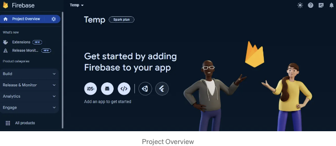
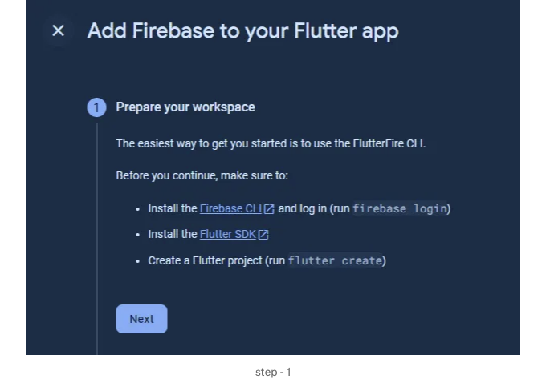
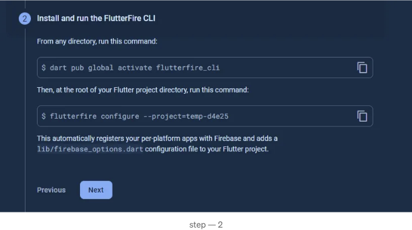
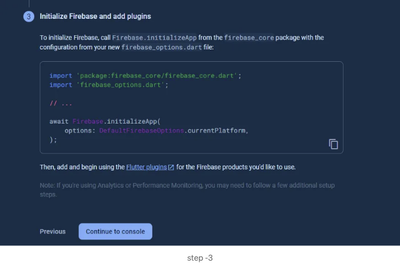
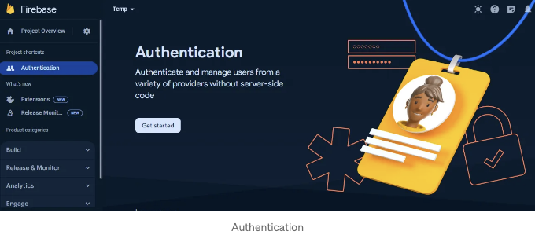
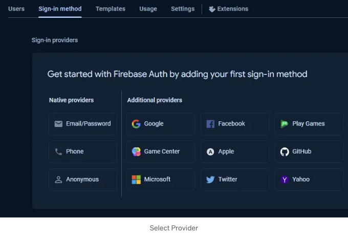
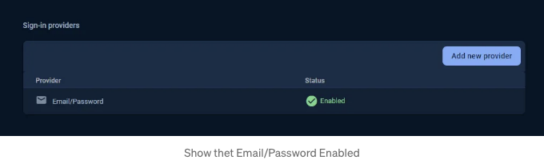

인증은 사용자 또는 시스템의 신원을 확인하여 그들이 주장하는 대로 실제로 그들인지 확인하는 과정을 말합니다. 컴퓨터 시스템, 네트워크 및 온라인 서비스에서 보안의 기본적인 측면입니다. 인증 메커니즘은 일반적으로 비밀번호와 같은 자격 증명을 제시하는 것을 포함합니다.

인증은 사용자가 앱의 기능 및 데이터에 안전하게 액세스하고 상호 작용할 수 있도록 하는 애플리케이션의 중요한 측면입니다. 인기 있는 백엔드 서비스 플랫폼인 Firebase는 인증을 위한 포괄적인 도구 세트를 제공합니다. 이 글에서는 강력한 크로스 플랫폼 프레임워크인 Flutter를 사용하여 Firebase의 다양한 인증 시나리오를 살펴보겠습니다. 이 포스트에서는 이메일/비밀번호 인증, 소셜 미디어 로그인, 그리고 Flutter에서 다양한 인증 상태를 처리하는 기본 사항에 대해 다룰 예정입니다.

필수 사항:

<!-- ui-log 수평형 -->
<ins class="adsbygoogle"
  style="display:block"
  data-ad-client="ca-pub-4877378276818686"
  data-ad-slot="9743150776"
  data-ad-format="auto"
  data-full-width-responsive="true"></ins>
<component is="script">
(adsbygoogle = window.adsbygoogle || []).push({});
</component>

다음 코드를 살펴보기 전에 다음 사항이 설정되어 있는지 확인하세요:

- 당신의 컴퓨터에 Flutter SDK가 설치되어 있습니다.
- Firebase 콘솔(https://console.firebase.google.com)에서 생성된 Firebase 프로젝트가 있습니다.

- "콘솔로 이동" 또는 "프로젝트 추가" 버튼을 클릭하여 프로젝트 이름을 입력하세요.
- Google Analytics를 사용하려면(선택 사항) 활성화하세요.
- 국가/지역을 선택하세요.
- "프로젝트 생성"을 클릭하세요.



<!-- ui-log 수평형 -->
<ins class="adsbygoogle"
  style="display:block"
  data-ad-client="ca-pub-4877378276818686"
  data-ad-slot="9743150776"
  data-ad-format="auto"
  data-full-width-responsive="true"></ins>
<component is="script">
(adsbygoogle = window.adsbygoogle || []).push({});
</component>

파이어베이스 프로젝트를 생성한 후 플러터를 클릭하고 다음 단계를 따르세요



파이어베이스 CLI를 설치하고 단계를 따르세요



<!-- ui-log 수평형 -->
<ins class="adsbygoogle"
  style="display:block"
  data-ad-client="ca-pub-4877378276818686"
  data-ad-slot="9743150776"
  data-ad-format="auto"
  data-full-width-responsive="true"></ins>
<component is="script">
(adsbygoogle = window.adsbygoogle || []).push({});
</component>

다음,



파이어베이스 프로젝트 콘솔로 이동하십시오.

Build -` Select Authentication을 클릭하십시오.

<!-- ui-log 수평형 -->
<ins class="adsbygoogle"
  style="display:block"
  data-ad-client="ca-pub-4877378276818686"
  data-ad-slot="9743150776"
  data-ad-format="auto"
  data-full-width-responsive="true"></ins>
<component is="script">
(adsbygoogle = window.adsbygoogle || []).push({});
</component>



다음으로 시작하세요.



이메일/비밀번호를 선택하고, 이메일/비밀번호 옵션을 활성화하고 저장하세요.

<!-- ui-log 수평형 -->
<ins class="adsbygoogle"
  style="display:block"
  data-ad-client="ca-pub-4877378276818686"
  data-ad-slot="9743150776"
  data-ad-format="auto"
  data-full-width-responsive="true"></ins>
<component is="script">
(adsbygoogle = window.adsbygoogle || []).push({});
</component>



이제 Firebase 프로젝트를 성공적으로 생성했고 프로젝트에서 이메일/비밀번호 인증을 활성화했습니다.

다음으로,

Flutter 앱에서

<!-- ui-log 수평형 -->
<ins class="adsbygoogle"
  style="display:block"
  data-ad-client="ca-pub-4877378276818686"
  data-ad-slot="9743150776"
  data-ad-format="auto"
  data-full-width-responsive="true"></ins>
<component is="script">
(adsbygoogle = window.adsbygoogle || []).push({});
</component>

pubspec.yaml 파일에 필요한 종속성을 추가해주세요:

```yaml
dependencies:
  firebase_core: ^latest
  firebase_auth: ^latest
```

Firebase를 Flutter 앱에서 초기화하려면 앱의 진입점(main.dart)에 다음 코드를 추가해주세요:

```dart
import 'package:firebase_core/firebase_core.dart';
void main() async {
  WidgetsFlutterBinding.ensureInitialized();
  await Firebase.initializeApp();
  runApp(MyApp());
}
```

<!-- ui-log 수평형 -->
<ins class="adsbygoogle"
  style="display:block"
  data-ad-client="ca-pub-4877378276818686"
  data-ad-slot="9743150776"
  data-ad-format="auto"
  data-full-width-responsive="true"></ins>
<component is="script">
(adsbygoogle = window.adsbygoogle || []).push({});
</component>

어플리케이션을 실행해보세요. 아무것도 눈에 띄지 않을 텐데, 이것은 파이어베이스 연결을 성공적으로 설정했다는 명확한 메시지입니다.

이제 이메일과 비밀번호로 로그인할 때 우리 앱에 Signin 메서드를 만들어 보세요.

```js
 TextEditingController mailController = TextEditingController();
 TextEditingController passController = TextEditingController();

singIn() async {
    Utils(Get.context!).startLoading();///로더 표시
    if(mailController.text.isNotEmpty && passController.text.isNotEmpty){

      try {
        await FirebaseAuth.instance.signInWithEmailAndPassword(
            email: mailController.text.trim(),
            password: passController.text.trim());

        navigates();/// 홈 화면이나 대시보드 화면으로 이동

      } on FirebaseAuthException catch (e) {
        flutterToast(e.code);/// 토스트 메시지 표시
      } catch (e) {
        print(e);
      }
    }
    else{
      if(mailController.text.isEmpty && passController.text.isEmpty){
        flutterToast("자격 증명을 입력하세요");/// 토스트 메시지 표시
      }
      else if(mailController.value.text.isEmpty){
        flutterToast("이메일을 입력하세요");/// 토스트 메시지 표시
      }
      else{
        flutterToast("비밀번호를 입력하세요");/// 토스트 메시지 표시
      }
    }
    Utils(Get.context!).stopLoading();///로더 숨김
  }
```

이 signIn() 메서드는 사용자가 로그인 버튼을 클릭했을 때 호출되며 이메일과 비밀번호 필드를 채우도록 유도하고, 값을 가져와서 signInWithEmailAndPassword 메서드에 사용합니다.

<!-- ui-log 수평형 -->
<ins class="adsbygoogle"
  style="display:block"
  data-ad-client="ca-pub-4877378276818686"
  data-ad-slot="9743150776"
  data-ad-format="auto"
  data-full-width-responsive="true"></ins>
<component is="script">
(adsbygoogle = window.adsbygoogle || []).push({});
</component>

여기서, 먼저 loader를 표시하고 있습니다. 사용자는 현재 프로세스가 실행 중임을 알 수 있습니다. 이메일 및 비밀번호 필드가 비어 있지 않은 지 확인한 다음, 인증을 위해 signInWithEmailAndPassword 메서드를 호출합니다. 인증이 성공하면 대시보드 또는 홈 화면으로 이동합니다. 이메일과 패스워드 값이 모두 비어 있다면, flutter toast 메시지 "자격 증명을 입력하세요"를 표시합니다. 이메일 값이 비어 있다면, flutter toast 메시지 "이메일을 입력하세요"를 표시하고, 비밀번호 값이 비어 있다면 flutter toast 메시지 "비밀번호를 입력하세요"를 표시합니다. 마지막으로 loader를 숨깁니다.

인증 Flutter 앱을 즐기세요! 🚀🔒