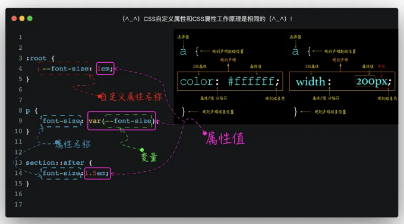

모두가 잘 아시다시피, 대규모 웹 사이트나 애플리케이션을 구축할 때 CSS를 유지하는 것은 항상 어려운 일이었습니다. 여러 사람이 협업한다면 어려움은 더 커질 것입니다. 게다가 CSS 언어는 변수, 조건, 논리와 같은 기능이 없는 선언형 언어이기 때문에 다른 프로그래밍 언어보다 항상 하위 수준에서 작업해야 했습니다.

정확히 이러한 이유로 Sass, LESS, Stylus와 같은 다양한 CSS 프로세서 언어가 등장했습니다. 이러한 프로세서 언어는 변수, 연산자, 논리 연산 등 다른 프로그래밍 언어와 유사한 기능을 도입합니다.

CSS 프로세서가 CSS 작성 및 유지에 편의성을 제공했지만 여전히 추가 컴파일 단계가 필요합니다. 그러나 프로세서의 변수는 큰 이점을 제공합니다. 이 때문에 커뮤니티는 CSS 프로세서에서 변수를 네이티브 CSS로 도입하기 시작했습니다. 홍보와 발전을 거듭한 끝에, 오늘날의 CSS 사용자 지정 속성이 등장했습니다.

다음으로, 이 장에서는 CSS 사용자 지정 속성과 그 응용 및 장점을 탐험해 보겠습니다.

<!-- ui-log 수평형 -->
<ins class="adsbygoogle"
  style="display:block"
  data-ad-client="ca-pub-4877378276818686"
  data-ad-slot="9743150776"
  data-ad-format="auto"
  data-full-width-responsive="true"></ins>
<component is="script">
(adsbygoogle = window.adsbygoogle || []).push({});
</component>

# CSS 사용자 정의 속성 소개

CSS 사용자 정의 속성은 W3C 명세의 TR 단계에 돌입했으며 별도 모듈 'CSS Custom Properties for Cascading Variables Module Level 1'에 포함되어 있습니다. 이 모듈은 작성자가 임의로 이름을 선택하고 임의의 값을 이름 속성에 할당할 수 있는 일련의 작성자 정의 속성인 사용자 정의 속성을 소개합니다. 이러한 속성은 var() 함수에 제공될 수 있으며 var() 함수에 의해 참조된 사용자 정의 속성을 종종 변수라고 합니다.

이와 같이, CSSer에 의해 선언된 이러한 자유 속성은 두 가지 이름을 가집니다: 사용자 정의 속성과 변수:

- 사용자 정의 속성: --* ( *는 선언된 임의의 이름을 나타냄)를 사용하여 특정 형식을 선언하여 이름으로 지정하며, 이를 사용자 정의 속성이라고 부르며 임의의 값이 사용자 정의 속성에 할당될 수 있습니다. 예: --color: #fff.
- 변수: CSS에서 var() 함수에 의해 참조된 사용자 정의 속성을 변수라고 합니다. var()는 사용자 정의 속성에 해당하는 값을 반환하고 해당 CSS 속성에 적용할 수 있습니다. 해당 값은 CSS 규칙의 속성 값입니다.

<!-- ui-log 수평형 -->
<ins class="adsbygoogle"
  style="display:block"
  data-ad-client="ca-pub-4877378276818686"
  data-ad-slot="9743150776"
  data-ad-format="auto"
  data-full-width-responsive="true"></ins>
<component is="script">
(adsbygoogle = window.adsbygoogle || []).push({});
</component>

사진을 통해 그들의 관계를 설명해보세요:


# CSS 사용자 지정 속성의 역할

프로그래밍 언어를 사용해본 적이 있다면 변수(개념)이 익숙할 것입니다. 몇몇 명령형 프로그래밍 언어(예: 프런트 엔드에서 익숙한 JavaScript)에서 변수는 특정 상태를 더 잘 추적하는 데 도움이 됩니다. 변수는 특정 값과 연결된 기호이며 변수의 값은 시간이 지남에 따라 변경될 수 있습니다. 변수의 장점은 값을 한 곳에 저장한 다음 필요한 곳에서 호출하거나 수정할 수 있다는 것입니다. 이렇게 하면 프로그램의 다른 부분에 서로 다른 값에 대해 서로 다른 변수를 추가할 필요가 없습니다.

<!-- ui-log 수평형 -->
<ins class="adsbygoogle"
  style="display:block"
  data-ad-client="ca-pub-4877378276818686"
  data-ad-slot="9743150776"
  data-ad-format="auto"
  data-full-width-responsive="true"></ins>
<component is="script">
(adsbygoogle = window.adsbygoogle || []).push({});
</component>


CSS와 같은 선언형 언어에서는 동적성이 부족하다. 시간이 지남에 따라 변하는 값이 존재하지 않기 때문에 변수라는 개념도 없습니다. 하지만 실제로는 다른 프로그래밍 언어와 같이 CSS가 주변 환경 및 개발자의 요구에 따라 지속적인 변경을 가능하게 할 수 있는 것을 매우 기대하고 있습니다.

CSS 사용자 지정 속성이 등장하기 전에 CSS는 계층 변수의 개념(나중에 언급될 것)를 도입하여 유지 관리 도전에 쉽게 대응할 수 있게 되었습니다. 이를 통해 변수가 CSS 트리 전체에서 상징적으로 참조될 수 있게 되었습니다. 하지만 이런 상징적 변수는 종종 CSS를 유지 및 확장하는 문제를 해결하지 못하며, 이해력이 부족한 동료들에게 머리 아픔을 안겨주기도 합니다. 지금은 다른 이야기로 하겠습니다. 이제 우리 실제 상황으로 돌아가봅시다.

많은 동료들은 대규모 웹 사이트나 웹 애플리케이션을 구축한 경험이 있을 것으로 생각합니다. 사용된 CSS 양은 매우 많고, 많은 경우에 재사용이 이루어집니다. 웹 사이트의 색상 구성을 예로 들어보겠습니다. 일부 색상은 CSS 파일에서 여러 차례 나타나고 재사용됩니다. 색상 구성을 수정할 때, 특정 색상을 조정하든 전체 색상 구성을 완전히 수정하든 복잡한 문제가 될 것입니다. 단순히 글로벌 검색 및 교체에만 의존하는 것은 충분하지 않으며, 이러한 작업은 필연적으로 오류를 발생시킬 수 있습니다.

<!-- ui-log 수평형 -->
<ins class="adsbygoogle"
  style="display:block"
  data-ad-client="ca-pub-4877378276818686"
  data-ad-slot="9743150776"
  data-ad-format="auto"
  data-full-width-responsive="true"></ins>
<component is="script">
(adsbygoogle = window.adsbygoogle || []).push({});
</component>

만약 CSS 프레임워크를 사용하였다면, 이 상황은 특히 좋지 않아질 것입니다. 이 경우, 만약 색을 수정하고 싶다면 프레임워크 자체를 수정해야 할 것입니다. 이러한 프레임워크들은 에러 발생 가능성을 줄이고 유지보수성을 향상시켜주는 Sass와 같은 CSS 프로세서를 도입했을지라도, 추가적인 단계(컴파일 처리가 필요함)를 추가함으로써 시스템의 복잡성을 증가시킬 수 있습니다.

CSS 사용자 지정 속성(CSS 변수)의 등장은 CSS 프로세서의 일부 편의성을 가져다주고 추가적인 컴파일이 필요하지 않습니다. CSS 사용자 지정 속성을 CSS에서 사용하는 이점은 프로그래밍 언어에서 변수를 사용하는 것과 크게 다르지 않습니다. W3C 명세에는 다음과 같이 설명되어 있습니다:

간단히 말하자면, CSS 사용자 지정 속성은 보다 유연한 설정, 참조 및 수정을 제공할 뿐만 아니라 강력한 의미론적 성격을 가지고 있습니다(빨강과 같은 이름보다 primary와 같은 이름이 항상 의미 있는 것임을 인식해야 합니다). 이러한 의미론적 정보는 CSS 파일을 읽고 이해하기 쉽게 만듭니다.

# CSS 사용자 지정 속성 구문 및 기본 적용법

<!-- ui-log 수평형 -->
<ins class="adsbygoogle"
  style="display:block"
  data-ad-client="ca-pub-4877378276818686"
  data-ad-slot="9743150776"
  data-ad-format="auto"
  data-full-width-responsive="true"></ins>
<component is="script">
(adsbygoogle = window.adsbygoogle || []).push({});
</component>

CSS custom properties를 소개할 때, 백엔드에서 온 동료들이 이해하기 쉽도록 익숙한 개념부터 시작할 수 있어요. 자바스크립트에서 변수를 예로 들어보겠습니다.

자바스크립트에서는 변수를 선언하는 여러 방법이 있어요. 예를 들면:

```js
var customProperty
// 또는
let customProperty = true
// 또 다른 방법으로
const customProperty = IS_ACTIVE
```

만약 나와 같이 자바스크립트에 익숙하지 않다면, 또는 CSS 프로세서와 접해본 경험이 있다면, CSS 프로세서를 예로 들어볼 수도 있어요. LESS, Sass, Stylus와 같이 익숙한 여러 CSS 프로세서들은 각자 변수를 선언하는 방식이 있어요. 보통 변수 접두사로 상징적인 엔티티 문자를 사용하는 편이에요. Sass에서는 $ 기호, LESS에서는 @ 기호, 그리고 Stylus에서는 특별한 접두사 없이 직접 표현을 사용한다는 거죠. primary-color = red와 같이요.

<!-- ui-log 수평형 -->
<ins class="adsbygoogle"
  style="display:block"
  data-ad-client="ca-pub-4877378276818686"
  data-ad-slot="9743150776"
  data-ad-format="auto"
  data-full-width-responsive="true"></ins>
<component is="script">
(adsbygoogle = window.adsbygoogle || []).push({});
</component>

CSS 사용자 정의 속성은 유사한 접근 방식을 사용하여 선언될 때 사용됩니다. 사용자 정의 속성을 선언할 때 -- 기호를 접두어로 사용합니다:

```js
:root {
    --primary: #f36;
}
```

예제에서 --primary는 CSS 사용자 정의 속성이라고 부릅니다. CSS 사용자 정의 속성은 일반 CSS 속성과 동일한 방식으로 사용됩니다. 이들을 변수보다는 동적 속성으로 취급하는 것이 좋습니다. 이는 선언 블록에서만 사용할 수 있다는 것을 의미합니다. 따라서 사용자 정의 속성과 셀렉터 간에는 강한 결합이 있습니다. 유효한 셀렉터가 될 수 있습니다.

선언된 CSS 사용자 정의 속성이 어떤 속성에서도 호출되지 않는 경우에는 영향을 주지 않습니다. 단지 문자열만이 스타일 파일에 남게 될 것입니다.

<!-- ui-log 수평형 -->
<ins class="adsbygoogle"
  style="display:block"
  data-ad-client="ca-pub-4877378276818686"
  data-ad-slot="9743150776"
  data-ad-format="auto"
  data-full-width-responsive="true"></ins>
<component is="script">
(adsbygoogle = window.adsbygoogle || []).push({});
</component>

선언된 CSS 사용자 지정 속성을 호출하는 방법은 다른 CSS 핸들러의 변수를 호출하는 것과 약간 다릅니다. CSS 사용자 지정 속성을 호출하려면 var() 함수를 통해 참조해야 합니다. var() 함수의 첫 번째 매개변수로 CSS 사용자 정의 속성을 전달하고 전체 함수를 CSS 속성에 할당해야 합니다(이것은 CSS 속성 또는 CSS 사용자 정의 속성이 될 수 있음). 예를 들어:

```js
body {
    color: var(--primary);
}

.button {
    --primaryButton: var(--primary);
}
```

예시의 var() 함수는 요소의 어떤 속성의 값의 일부를 대체할 수 있습니다. 그러나 var() 함수는 속성 값 이외의 속성 이름, 선택기 또는 다른 값으로 사용할 수 없습니다.

var() 함수는 동시에 두 개의 값을 받아들일 수 있습니다:

<!-- ui-log 수평형 -->
<ins class="adsbygoogle"
  style="display:block"
  data-ad-client="ca-pub-4877378276818686"
  data-ad-slot="9743150776"
  data-ad-format="auto"
  data-full-width-responsive="true"></ins>
<component is="script">
(adsbygoogle = window.adsbygoogle || []).push({});
</component>

```js
var(<custom-property-name>, <declaration-value>)
```

그 중 `custom-property-name`은 CSS 사용자 정의 속성이며, `declaration-value`는 대체 값으로, 사용자 정의 속성 값이 잘못된 경우를 대비해 var() 함수가 값을 가지도록하여 CSS 속성 규칙이 적용되도록 합니다. 예를 들어:

```js
:root {
    --primary: #f36;
}

.button {
    background-color: var(--primary, #fff);
    color: var(--color, #333);
}
```

# CSS 사용자 정의 속성 사용법

<!-- ui-log 수평형 -->
<ins class="adsbygoogle"
  style="display:block"
  data-ad-client="ca-pub-4877378276818686"
  data-ad-slot="9743150776"
  data-ad-format="auto"
  data-full-width-responsive="true"></ins>
<component is="script">
(adsbygoogle = window.adsbygoogle || []).push({});
</component>

이제 CSS 사용자 지정 속성에 대한 기본적인 이해가 생겼으므로 몇 가지 작은 예제 코드를 사용하여 CSS 사용자 지정 속성의 기능을 강조하는 것이 제 이해를 높이는 데 도움이 될 것 같아요.

# CSS 사용자 지정 속성과 CSS 속성은 정확히 같은 방식으로 작동해요

CSS 사용자 지정 속성은 일반 속성처럼 어떤 요소, 선택기 또는 가상 요소에도 선언될 수 있어요. 사용법은 CSS 속성과 동일하며 원리도 똑같아요.

```js
:root {
    --font-size: 1em;
}
p {
    font-size: var(--font-size);
}
section::after {
    font-size:1.5em;
}
```

<!-- ui-log 수평형 -->
<ins class="adsbygoogle"
  style="display:block"
  data-ad-client="ca-pub-4877378276818686"
  data-ad-slot="9743150776"
  data-ad-format="auto"
  data-full-width-responsive="true"></ins>
<component is="script">
(adsbygoogle = window.adsbygoogle || []).push({});
</component>



# CSS 커스텀 속성은 CSS 속성과 마찬가지로 상속과 계층 적인 특성이 있습니다.

CSS를 배울 때 꼭 알아야 할 세 가지 개념인 cascading(계단식), inheritance(상속), weight(가중치)이 있습니다. CSS 커스텀 속성도 상속 및 계단식 특성을 갖고 있습니다. 예를 들어:

```html
<!-- HTML -->
<div class="parent">
    <div class="child1"></div>
    <div class="child2"></div>
</div>
```

<!-- ui-log 수평형 -->
<ins class="adsbygoogle"
  style="display:block"
  data-ad-client="ca-pub-4877378276818686"
  data-ad-slot="9743150776"
  data-ad-format="auto"
  data-full-width-responsive="true"></ins>
<component is="script">
(adsbygoogle = window.adsbygoogle || []).push({});
</component>

```js
.parent {
    --primary: #f36;
}
.child1 {
    background-color: var(--primary);
}
.child2 {
    color: var(--primary);
}
```

위 예제에서 .child1과 .child2는 모두 부모 요소인 .parent로부터 --primary 사용자 지정 속성을 상속합니다. 그러나 많은 경우 이 동작이 필요하지 않을 수 있습니다. 이러한 경우에는 :root {}에서 사용자 지정 속성을 명시적으로 선언할 수 있습니다:

```js
:root {
    --primary: #f36;
}

.child1 {
    background-color: var(--primary);
}
.child2 {
    color: var(--primary);
}
```

이것이 이해하기 쉽지 않을 수 있으므로 더 현실적인 예시를 살펴보겠습니다. 예를 들어, 모든 웹 애플리케이션에는 고유한 색 구성표가 있습니다. CSS 프레임워크인 Bootstrap의 색 구성표를 예로 들어보겠습니다. 그 중요한 색 구성은 --primary: #007bff 이며, 다음과 같이 여러 곳에서 사용됩니다

<!-- ui-log 수평형 -->
<ins class="adsbygoogle"
  style="display:block"
  data-ad-client="ca-pub-4877378276818686"
  data-ad-slot="9743150776"
  data-ad-format="auto"
  data-full-width-responsive="true"></ins>
<component is="script">
(adsbygoogle = window.adsbygoogle || []).push({});
</component>


CSS의 상속 기능을 사용하면 일들이 쉬워집니다.

```css
:root{
    --primary: #007bff;
}

/* Button 컴포넌트 */ 
.btn-primary {
    background-color: var(--primary);
    border-color: var(--primary);
}
/* Badge 컴포넌트 */ 
.badge-primary {
    background-color: var(--primary);
    border-color: var(--primary);
}
/* Dropdowns 컴포넌트 */ 
.dropdown-primary {
    background-color: var(--primary);
    border-color: var(--primary);
}
/* Pagination 컴포넌트 */ 
.page-link {
    color: var(--primary);
}
/* Progress 컴포넌트 */ 
.progress-bar {
    background-color: var(--primary);
}
```

언젠가 상사가 "이 색상을 더 이상 보기 싫다"고 하고 색상 시스템을 변경하고 싶다고 말한다면, :root 내의 --primary 값을 조정하기만 하면 됩니다.

<!-- ui-log 수평형 -->
<ins class="adsbygoogle"
  style="display:block"
  data-ad-client="ca-pub-4877378276818686"
  data-ad-slot="9743150776"
  data-ad-format="auto"
  data-full-width-responsive="true"></ins>
<component is="script">
(adsbygoogle = window.adsbygoogle || []).push({});
</component>

또한, 동일한 모듈 구성 요소는 아래 그림에 나타난 효과와 같이 약간의 차이만 있습니다.


이러한 효과에 대해서는 CSS의 카스케이딩 기능을 이용하여 작업을 더 쉽게 할 수 있습니다.

```css
:root {
    --color: #333;
}

.card {
    color: var(--card);
    &:nth-child(2) {
        --color: #2196F3;
    }
    &:nth-child(3) {
        --color: #f321ab;
    }
}
```

<!-- ui-log 수평형 -->
<ins class="adsbygoogle"
  style="display:block"
  data-ad-client="ca-pub-4877378276818686"
  data-ad-slot="9743150776"
  data-ad-format="auto"
  data-full-width-responsive="true"></ins>
<component is="script">
(adsbygoogle = window.adsbygoogle || []).push({});
</component>

CSS 캐스케이딩과 상속의 복잡성으로 인해, CSS 사용자 정의 속성의 특성을 더 잘 보여주기 위해 (더 적은 코드, 더 쉬운 유지 보수, 더 쉬운 확장을 통해), 더 계층적인 예제를 보여드리겠습니다.

```html
<!-- HTML -->
<p>나는 어떤 색일까요?</p> 
<div>나는 다시 어떤 색일까요?</div>
<div id="alert">
    나는 어떤 색일까요?
    <p>나는 다시 어떤 색일까요?</p>
</div>
```

```css
:root {
    --color: #333;
}
div {
    --color: #2196F3;
}
#alert {
    --color: #f321ab;
}
```

결과는 아래 그림으로 보여집니다:

<!-- ui-log 수평형 -->
<ins class="adsbygoogle"
  style="display:block"
  data-ad-client="ca-pub-4877378276818686"
  data-ad-slot="9743150776"
  data-ad-format="auto"
  data-full-width-responsive="true"></ins>
<component is="script">
(adsbygoogle = window.adsbygoogle || []).push({});
</component>


# CSS 사용자 지정 속성을 인라인 스타일 속성에서 사용할 수 있습니다

CSS 사용자 지정 속성은 CSS 속성과 마찬가지로 요소의 스타일 속성에서 사용할 수 있습니다.

```html
<!-- HTML -->
<button style="--color: blue">Click Me</button>
```

<!-- ui-log 수평형 -->
<ins class="adsbygoogle"
  style="display:block"
  data-ad-client="ca-pub-4877378276818686"
  data-ad-slot="9743150776"
  data-ad-format="auto"
  data-full-width-responsive="true"></ins>
<component is="script">
(adsbygoogle = window.adsbygoogle || []).push({});
</component>

```css
button {
    border: 1px solid var(--color);
}

button:hover {
    background-color: var(--color);
}
```

내부 연결 스타일에서 CSS 사용자 지정 속성을 사용하는 것은 매우 의미가 있습니다, 특히 JavaScript를 통해 CSS 사용자 지정 속성을 조작할 때.

# CSS 사용자 지정 속성은 대소문자를 구분합니다

CSS 사용자 지정 속성은 CSS 속성과 약간 다릅니다. CSS 속성은 대소문자를 구분하지 않지만 CSS 사용자 지정 속성은 대소문자를 구분합니다.

<!-- ui-log 수평형 -->
<ins class="adsbygoogle"
  style="display:block"
  data-ad-client="ca-pub-4877378276818686"
  data-ad-slot="9743150776"
  data-ad-format="auto"
  data-full-width-responsive="true"></ins>
<component is="script">
(adsbygoogle = window.adsbygoogle || []).push({});
</component>

```js
:root {
    --COLOR: #fff;
    --color: #f36;
}

.box {
    color: var(--COLOR);
    background-color: var(--color);
}
```


# CSS 커스텀 속성 네이밍

CSS 커스텀 속성 네이밍 규칙은 비교적 느슨합니다. 중국어, 대문자, 카멜 케이스 네이밍, 하이픈, 이모지, HTML 엔티티 등과 같은 유효한 문자열을 사용할 수 있습니다. :```

<!-- ui-log 수평형 -->
<ins class="adsbygoogle"
  style="display:block"
  data-ad-client="ca-pub-4877378276818686"
  data-ad-slot="9743150776"
  data-ad-format="auto"
  data-full-width-responsive="true"></ins>
<component is="script">
(adsbygoogle = window.adsbygoogle || []).push({});
</component>


# CSS 사용자 정의 속성은 대체 매개변수를 지원합니다

CSS 사용자 정의 속성을 소개할 때 var() 함수의 매개변수로 CSS 사용자 정의 속성이 전달되면 두 번째 매개변수인 대체 매개변수도 지원됩니다. CSS 속성은 이 기능을 지원하지 않습니다.

- 브라우저가 CSS 사용자 정의 속성을 지원하지 않는 경우 브라우저가 인식할 수 있도록 저하된 매개변수를 제공할 수 있습니다.
- 브라우저가 CSS 사용자 정의 속성을 지원하지만 CSS 사용자 정의 속성의 값을 명시적으로 선언하지 않은 경우, 저하된 매개변수가 선택됩니다.
- 브라우저가 CSS 사용자 정의 속성을 지원하고 CSS 사용자 정의 속성의 값을 명시적으로 선언한 경우 CSS 사용자 정의 속성의 값이 선택되고 저하된 매개변수는 선택되지 않습니다.

<!-- ui-log 수평형 -->
<ins class="adsbygoogle"
  style="display:block"
  data-ad-client="ca-pub-4877378276818686"
  data-ad-slot="9743150776"
  data-ad-format="auto"
  data-full-width-responsive="true"></ins>
<component is="script">
(adsbygoogle = window.adsbygoogle || []).push({});
</component>

예를 들어, 다음과 같은 예시입니다:

```js
:root {
    --color: #f36;
}

.box {
    width: var(--w, 100px);
    color: var(--color, #fff);
    border-width: var(--color, 2px);
}
```


# 잘못된 CSS 사용자 지정 속성은 어떻게 처리되나요?

<!-- ui-log 수평형 -->
<ins class="adsbygoogle"
  style="display:block"
  data-ad-client="ca-pub-4877378276818686"
  data-ad-slot="9743150776"
  data-ad-format="auto"
  data-full-width-responsive="true"></ins>
<component is="script">
(adsbygoogle = window.adsbygoogle || []).push({});
</component>

CSS 사용자 지정 속성에 잘못된 값을 적용하면 어떻게 될까요? 무엇이 일어나는지 알려주기 전에 CSS 속성에 잘못된 값을 사용할 때 어떤 일이 발생하는지 살펴봅시다.

우리 모두가 실수를 경험해 본 적이 있습니다. 예를 들어, 코드 리뷰를 하다보면 다음과 같은 현상을 발견할 수 있습니다:

```js
.card {
    padding: -10px;
}
```

패딩(padding)은 음수 값을 지원하지 않습니다. 즉, -10px는 패딩 속성에 대한 잘못된 값입니다. 이때, 브라우저는 렌더링할 때 패딩의 초기 값(initial)을 사용하게 되는데, 초기 값은 0입니다.

<!-- ui-log 수평형 -->
<ins class="adsbygoogle"
  style="display:block"
  data-ad-client="ca-pub-4877378276818686"
  data-ad-slot="9743150776"
  data-ad-format="auto"
  data-full-width-responsive="true"></ins>
<component is="script">
(adsbygoogle = window.adsbygoogle || []).push({});
</component>


CSS 사용자 지정 속성을 사용할 때, CSS 사용자 지정 속성이 호출될 때 CSS 속성에 대한 잘못된 값이면, 예를 들어, 초기값도 하나의 저하 처리 프로세스로 사용될 것입니다. 

```js
:root {
    --color: 20px;
}

.p {
    color: var(--color);
}
```

위의 예에서 선언된 --color: 20px는 유효한 값입니다만, 색상 속성에 사용할 때, 20px는 색상 속성에 대한 잘못된 값이기 때문에 --color는 잘못된 값입니다. 이 경우, 색상 속성은 초기값 initial (사용자 에이전트에 따라 다름) 을 사용할 것입니다. 

부모 요소가 명시적으로 색상 값을 설정하지 않은 경우, `html` 요소의 색상 값을 상속받을 겁니다. Chrome 브라우저에서는 #000 색상 값을 상속받을 것입니다.

<!-- ui-log 수평형 -->
<ins class="adsbygoogle"
  style="display:block"
  data-ad-client="ca-pub-4877378276818686"
  data-ad-slot="9743150776"
  data-ad-format="auto"
  data-full-width-responsive="true"></ins>
<component is="script">
(adsbygoogle = window.adsbygoogle || []).push({});
</component>

또 다른 시나리오는 선언된 CSS 사용자 지정 속성을 호출하는 것이 잘못된 값이지만, 축소된 값이 제공되고 그 축소된 값이 유효한 값인 경우에는 초기 값이 사용되지 않고 축소된 값이 사용됩니다. 예를 들어:

```js
:root {
    --color: 20px;
}

p {
    color: var(--color, blue);
}
```


# 연결된 CSS 사용자 지정 속성

<!-- ui-log 수평형 -->
<ins class="adsbygoogle"
  style="display:block"
  data-ad-client="ca-pub-4877378276818686"
  data-ad-slot="9743150776"
  data-ad-format="auto"
  data-full-width-responsive="true"></ins>
<component is="script">
(adsbygoogle = window.adsbygoogle || []).push({});
</component>

var() 함수를 사용하여 선언된 CSS 사용자 지정 속성을 호출할 때, var() 함수에 저하된 매개변수를 제공할 때, 연쇄적으로 저하된 매개변수를 제공할 수 있습니다. 예를 들어:

```js
p {
    --color1: red;
    --color2: blueviolet;
    --color3: orange;
    color: var(--color1, var(--color2, var(--color3, blue)));
}
```


# 순환 의존성을 갖는 CSS 사용자 지정 속성은 잘못된 것입니다.

<!-- ui-log 수평형 -->
<ins class="adsbygoogle"
  style="display:block"
  data-ad-client="ca-pub-4877378276818686"
  data-ad-slot="9743150776"
  data-ad-format="auto"
  data-full-width-responsive="true"></ins>
<component is="script">
(adsbygoogle = window.adsbygoogle || []).push({});
</component>

CSS는 선언형 언어이며, 요소의 스타일 규칙은 순서 개념이 없습니다(동일한 프로퍼티가 동일한 선택자 블록 내에 있을 때, 나중에 나오는 것이 앞설 것을 덮어쓴다). 값은 하나만 가질 수 있으며, 이전 값과 그 값에 1을 더한 값이 동시에 될 수 없으므로 이것은 루프를 형성합니다.

예를 들어 JavaScript로 시작해 봅시다:

```js
var a = 1;
var a = a;
console.log(a); // » 1
```

CSS 사용자 정의 프로퍼티의 순환적 사용을 다시 살펴봅시다.

<!-- ui-log 수평형 -->
<ins class="adsbygoogle"
  style="display:block"
  data-ad-client="ca-pub-4877378276818686"
  data-ad-slot="9743150776"
  data-ad-format="auto"
  data-full-width-responsive="true"></ins>
<component is="script">
(adsbygoogle = window.adsbygoogle || []).push({});
</component>

```css
:root {
    --size: 10px;
    --size: var(--size);
}

body {
    font-size: var(--size, 2rem);
}
```

CSS에서는 동일한 CSS 속성이 같은 선택기 블록에 있으면, 후자가 우선합니다. 예를 들어, 위 예제에서는 --size: var(--size)가 --size를 덮어쓸 것입니다. 하지만 CSS 사용자 지정 속성이 자체에 의존하는 경우, 즉 자신을 참조하는 var()을 사용하는 경우 값은 유효하지 않습니다. 위 예제에서 --size 사용자 지정 속성은 유효하지 않습니다. 이는 body에서 --size를 호출할 때 유효하지 않으며, var()의 하락 값은 2rem입니다.


자신을 참조하는 사용자 지정 속성 외에도, 두 개 이상의 사용자 지정 속성이 서로를 참조하는 경우에도 다른 시나리오가 있습니다.

<!-- ui-log 수평형 -->
<ins class="adsbygoogle"
  style="display:block"
  data-ad-client="ca-pub-4877378276818686"
  data-ad-slot="9743150776"
  data-ad-format="auto"
  data-full-width-responsive="true"></ins>
<component is="script">
(adsbygoogle = window.adsbygoogle || []).push({});
</component>

```css
:root {
    --one: calc(var(--two) + 10px);
    --two: calc(var(--one) - 10px);
}
```

이러한 교참 참조 CSS 사용자 지정 속성은 올바르지 않습니다. 이를 깨는 유일한 방법은 코드 내에서 원형 종속성을 가진 CSS 사용자 지정 속성을 만들지 않는 것입니다.

# 기본 연산자를 사용한 CSS 사용자 지정 속성

CSS 프로세서에 익숙한 동료들은 CSS 프로세서에서 연산자 관련 작업을 수행할 수 있다는 것을 알고 있을 것입니다. 실제로 이 기능은 calc() 함수를 사용하여 CSS에서 일부 기본 연산자 관련 작업을 수행할 수 있습니다. CSS 사용자 지정 속성에서도 동일한 기능을 찾을 수 있습니다.```

<!-- ui-log 수평형 -->
<ins class="adsbygoogle"
  style="display:block"
  data-ad-client="ca-pub-4877378276818686"
  data-ad-slot="9743150776"
  data-ad-format="auto"
  data-full-width-responsive="true"></ins>
<component is="script">
(adsbygoogle = window.adsbygoogle || []).push({});
</component>

```css
:root {
    --indent-size: 10px;
    --indent-xl: calc(var(--indent-size) * 2);
    --indent-l: calc(var(--indent-size) + 2px);
    --indent-s: calc(var(--indent-size) - 2px);
    --indent-xs: calc(var(--indent-size) / 2);
}
p {
    text-indent: var(--indent-xl);
}
```

CSS 사용자 지정 속성에서 기본 연산을 수행할 때 주의할 점은 단위가없는 값은 계산할 수 없다는 것입니다 :

```css
:root {
    --gap: 10;
}

.card {
    padding: var(--gap)px 0; /* 무효, 정상적으로 작동하지 않음 */
    padding: calc(var(--gap) * 1px) 0; /* 유효, 정상적으로 작동 */
}
```

# CSS 사용자 정의 속성의 값은 데이터입니다. 속성 값이 아닙니다.

<!-- ui-log 수평형 -->
<ins class="adsbygoogle"
  style="display:block"
  data-ad-client="ca-pub-4877378276818686"
  data-ad-slot="9743150776"
  data-ad-format="auto"
  data-full-width-responsive="true"></ins>
<component is="script">
(adsbygoogle = window.adsbygoogle || []).push({});
</component>

위 예제에서는 CSS 사용자 정의 속성에 순수한 숫자 값을 할당할 수 있다는 것을 보았습니다. CSS 속성 값 대신에 숫자 값을 할당할 수 있다는 장점이 있습니다. 이렇게 하면 우리가 원하는 값으로 쉽게 변환할 수 있습니다. 예를 들어:

```js
.block {
    --size: 40;
    width: var(--size)vw;
}
```

앞서 언급했듯이 이 동작은 잘못된 값입니다. (var(--size) vw). CSS 사용자 정의 속성이 잘못된 경우, CSS 속성의 값은 속성의 초기 값(위 예제의 width의 경우 auto)을 취합니다. 브라우저는 모든 것을 토큰으로 간주하기 때문에 --size 값을 숫자로 설정하고 vw를 식별자로 설정하여 위 예제에서 var(--size) vw를 40vw(중간에 공백이 있는)로 구문 분석하지만, auto로 설정된 width의 초기 값 대신에 기대했던 40vw(최종적으로 너비의 초기 값으로 auto를 사용함)로 설정되지 않습니다.


<!-- ui-log 수평형 -->
<ins class="adsbygoogle"
  style="display:block"
  data-ad-client="ca-pub-4877378276818686"
  data-ad-slot="9743150776"
  data-ad-format="auto"
  data-full-width-responsive="true"></ins>
<component is="script">
(adsbygoogle = window.adsbygoogle || []).push({});
</component>

이 문제를 해결하기 위해 calc() 함수를 사용할 수 있습니다:

```js
.block {
    --size: 40;
    width: calc(var(--size) * 1vw);  // => width: 40vw
    height: calc(var(--size) * 1vh); // => height: 40vh
}
```

많은 동료들이 코딩할 때 Aim for the Highest를 좋아하며, 예를 들어 --size: 40vw 를 사용하여 적어도 하나의 calc() 함수 계산을 저장하고자 할 수 있습니다:

```js
.block {
    --size: 40vw;
    width: var(--size);
    height: calc(var(--size) / 1vw * 1vh);
}
```

<!-- ui-log 수평형 -->
<ins class="adsbygoogle"
  style="display:block"
  data-ad-client="ca-pub-4877378276818686"
  data-ad-slot="9743150776"
  data-ad-format="auto"
  data-full-width-responsive="true"></ins>
<component is="script">
(adsbygoogle = window.adsbygoogle || []).push({});
</component>

우리는 vw 단위를 vw/vw 로 나누고, --size를 순수한 숫자로 변경한 다음 1vh를 곱하여 height: 40vh로 만들기를 희망합니다. 하지만 예상한 대로 결과가 나오지 않았습니다. 왜냐하면 calc() 함수는 길이 단위(예: px, vw, vh 등)로 나누는 것을 지원하지 않고, 순수한 숫자로만 나눌 수 있기 때문입니다. 그래서 height 속성은 잘못된 값에 대한 참조를 하고 초기값인 auto를 사용합니다.

calc()와 CSS 사용자 지정 속성 간의 기본 작업은 주로 calc() 함수의 규칙에 따라 진행됩니다:
- 사용자 지정 속성이 순수한 숫자인 경우, calc()는 어떤 단위 값으로 변환할 수 있습니다. CSS 사용자 지정 속성의 값에 1을 곱하고 해당 단위를 곱하면, 예를 들어 calc(var(--size) * 1px)는 40px를 생성합니다.
- 사용자 지정 속성에 단위가 있는 경우, calc()는 그것을 순수한 숫자로 변환할 수 있는 방법이 없습니다(아마도 JavaScript를 사용할 수도 있음).
- 사용자 지정 속성에 단위가 있는 경우, calc()는 단위가 없는 순수한 숫자로 곱하거나 나눌 수 있습니다.
- 사용자 지정 속성에 단위가 있는 경우, calc()는 단위가 있는 어떤 값과 더하거나 빼줄 수 있습니다.

# @ 규칙에서 CSS 사용자 지정 속성 사용하기

<!-- ui-log 수평형 -->
<ins class="adsbygoogle"
  style="display:block"
  data-ad-client="ca-pub-4877378276818686"
  data-ad-slot="9743150776"
  data-ad-format="auto"
  data-full-width-responsive="true"></ins>
<component is="script">
(adsbygoogle = window.adsbygoogle || []).push({});
</component>

CSS에는 @ 규칙 중 일부가 있습니다. @charset, @import, @namespace, @document, @font-face, @keyframes, @media, @page, @supports, @viewport 및 @color-profile 등이 있습니다. 그 중에서 @media, @supports 및 @keyframes는 흔한 @ 규칙입니다.

@media 및 @supports는 CSS에서 사용할 수 있는 조건문이고, @keyframes는 CSS 애니메이션에 사용됩니다. 이어서, 주로 @media, @supports 및 @keyframes에서 CSS 사용자 지정 속성을 사용하는 방법을 살펴보겠습니다.

## @media에서 CSS 사용자 지정 속성 사용하기

미디어 쿼리 @media에 대한 CSS 사용자 정의를 사용하여 CSS 사용자 정의 속성의 값을 동적으로 변경할 수 있습니다.

<!-- ui-log 수평형 -->
<ins class="adsbygoogle"
  style="display:block"
  data-ad-client="ca-pub-4877378276818686"
  data-ad-slot="9743150776"
  data-ad-format="auto"
  data-full-width-responsive="true"></ins>
<component is="script">
(adsbygoogle = window.adsbygoogle || []).push({});
</component>

```css
body {
    --color: #f36;
    background-color: var(--color);
}

@media screen and (max-width: 375px) {
    body {
        --color: #9f3;
    }
}
```

다음은 효과입니다:


위에 소개된 예제는 가장 간단한 예 중 하나입니다. 사실, CSS 사용자 지정 속성과 @media의 조합은 반응형 웹 디자인을 훨씬 간단하게 만듭니다.```

<!-- ui-log 수평형 -->
<ins class="adsbygoogle"
  style="display:block"
  data-ad-client="ca-pub-4877378276818686"
  data-ad-slot="9743150776"
  data-ad-format="auto"
  data-full-width-responsive="true"></ins>
<component is="script">
(adsbygoogle = window.adsbygoogle || []).push({});
</component>

## @keyframes에서 CSS 사용자 정의 속성 사용하기

CSS 사용자 정의 속성과 CSS 애니메이션은 잘 동작합니다. 그러나 반드시 애니메이션 요소에서 CSS 사용자 정의 속성을 명시적으로 선언하고, @keyframes에서 선언된 CSS 사용자 정의 속성을 참조할 때 var()을 사용해야 합니다. 이렇게 함으로써 목표 선택기(selector) 내에서 CSS 사용자 정의 속성을 수정할 수 있어 @keyframes에서 각 속성을 찾지 않아도 됩니다.

```js
.animate {
    --from-color: red;
    --to-color: lime;
    width: 100px;
    height: 100px;
    animation: blink 1s infinite;
}

@keyframes blink {
    from {
        background-color: var(--from-color);
    }
    to {
        background-color: var(--to-color);
    }
}
```

효과는 다음과 같습니다:

<!-- ui-log 수평형 -->
<ins class="adsbygoogle"
  style="display:block"
  data-ad-client="ca-pub-4877378276818686"
  data-ad-slot="9743150776"
  data-ad-format="auto"
  data-full-width-responsive="true"></ins>
<component is="script">
(adsbygoogle = window.adsbygoogle || []).push({});
</component>


## @supports를 사용한 CSS 사용자 지정 속성

현재 브라우저는 CSS 사용자 지정 속성의 지원이 상당히 좋습니다. 거의 90%까지 지원됩니다:


<!-- ui-log 수평형 -->
<ins class="adsbygoogle"
  style="display:block"
  data-ad-client="ca-pub-4877378276818686"
  data-ad-slot="9743150776"
  data-ad-format="auto"
  data-full-width-responsive="true"></ins>
<component is="script">
(adsbygoogle = window.adsbygoogle || []).push({});
</component>

조금이나마 조건부 판단을 할 수 있게 @supports를 사용할 수 있어요:

```js
body {
    background-color: #f4f4f4;
}

@supports(--css:variables) {
    body {
        --bg-color: linear-gradient(to bottom, #f36, #f4f4f4);
        background: var(--bg-color);
    }
}
```

# 웹 컴포넌트에서 CSS 사용자 지정 속성의 응용

웹 컴포넌트는 이제 웹 사이트나 웹 애플리케이션 개발에 널리 사용되며, 많은 팀 또는 개인이 관련 준비를 했다. 사실, 웹 컴포넌트를 개발하거나 디자인할 때 CSS 사용자 지정 속성을 결합하면 전체 디자인이 더 유연해집니다.

<!-- ui-log 수평형 -->
<ins class="adsbygoogle"
  style="display:block"
  data-ad-client="ca-pub-4877378276818686"
  data-ad-slot="9743150776"
  data-ad-format="auto"
  data-full-width-responsive="true"></ins>
<component is="script">
(adsbygoogle = window.adsbygoogle || []).push({});
</component>

가장 영향력 있는 CSS Framework(Bootstrap)에서 Button UI 구성 요소를 살펴보며 웹 컴포넌트에서 CSS 사용자 지정 속성의 적용을 설명하는 예로 삼겠습니다.


먼저 HTML 구조를 살펴보겠습니다.

```js
<!-- HTML -->
<button type="button" class="btn btn-primary">Primary</button>
<button type="button" class="btn btn-secondary">Secondary</button>
<button type="button" class="btn btn-success">Success</button>
<button type="button" class="btn btn-danger">Danger</button>
<button type="button" class="btn btn-warning">Warning</button>
<button type="button" class="btn btn-info">Info</button>
<button type="button" class="btn btn-light">Light</button>
<button type="button" class="btn btn-dark">Dark</button>
<button type="button" class="btn btn-link">Link</button>
```

<!-- ui-log 수평형 -->
<ins class="adsbygoogle"
  style="display:block"
  data-ad-client="ca-pub-4877378276818686"
  data-ad-slot="9743150776"
  data-ad-format="auto"
  data-full-width-responsive="true"></ins>
<component is="script">
(adsbygoogle = window.adsbygoogle || []).push({});
</component>

버튼 하나당 두 개의 클래스 이름이 있는 것을 확인할 수 있어요. 하나는 기본 클래스 이름인 .btn 이고, 다른 하나는 확장 클래스 이름인 .btn-primary 같은 것이에요. 스타일은 다음과 같아요:

```js
.btn {
    display: inline-block;
    font-weight: 400;
    color: #212529;
    text-align: center;
    vertical-align: middle;
    user-select: none;
    background-color: transparent;
    border: 1px solid transparent;
    padding: .375rem .75rem;
    font-size: 1rem;
    line-height: 1.5;
    border-radius: .25rem;
    transition: color .15s ease-in-out,background-color .15s ease-in-out,border-color .15s ease-in-out,box-shadow .15s ease-in-out;
}

.btn:hover {
    color: #212529;
    text-decoration: none;
}
.btn:focus {
    outline: 0;
    box-shadow: 0 0 0 0.2rem rgba(0,123,255,.25);
}
.btn-primary {
    color: #fff;
    background-color: #007bff;
    border-color: #007bff;
}
.btn-primary:hover {
    color: #fff;
    background-color: #0069d9;
    border-color: #0062cc;
}
.btn-primary:focus {
    box-shadow: 0 0 0 0.2rem rgba(38,143,255,.5);
}
.btn-primary:not(:disabled):not(.disabled):active {
    color: #fff;
    background-color: #0062cc;
    border-color: #005cbf;
}
.btn-primary:not(:disabled):not(.disabled):active:focus {
    box-shadow: 0 0 0 0.2rem rgba(38,143,255,.5);
}
```

다른 UI 스타일 버튼을 위해서는, .btn-danger 같은 클래스 이름을 확장해서 조정해주세요:

```js
.btn-danger {
    color: #fff;
    background-color: #dc3545;
    border-color: #dc3545;
}

.btn-danger:hover {
    color: #fff;
    background-color: #c82333;
    border-color: #bd2130;
}
.btn-danger:focus {
    box-shadow: 0 0 0 0.2rem rgba(225,83,97,.5);
}
.btn-danger:not(:disabled):not(.disabled):active {
    color: #fff;
    background-color: #bd2130;
    border-color: #b21f2d;
}
.btn-danger:not(:disabled):not(.disabled):active:focus{
    box-shadow: 0 0 0 0.2rem rgba(225,83,97,.5);
}
```

<!-- ui-log 수평형 -->
<ins class="adsbygoogle"
  style="display:block"
  data-ad-client="ca-pub-4877378276818686"
  data-ad-slot="9743150776"
  data-ad-format="auto"
  data-full-width-responsive="true"></ins>
<component is="script">
(adsbygoogle = window.adsbygoogle || []).push({});
</component>

위의 코드를 두 부분으로 나눠 보겠습니다.

### HTML 구조:

```html

```

### 기본 버튼 스타일:

```html

```

<!-- ui-log 수평형 -->
<ins class="adsbygoogle"
  style="display:block"
  data-ad-client="ca-pub-4877378276818686"
  data-ad-slot="9743150776"
  data-ad-format="auto"
  data-full-width-responsive="true"></ins>
<component is="script">
(adsbygoogle = window.adsbygoogle || []).push({});
</component>

위의 예시 코드에서 보면, 다른 스타일의 버튼들이 동일한 CSS 속성을 갖고 있지만 값만 다른 것을 볼 수 있어요. 색상(color), 배경색(background-color), 테두리 색상(border-color), 그림자 색상(box-shadow)과 같은 속성들이죠. 이렇게 하면 이러한 동일한 CSS 속성을 CSS 사용자 정의 속성으로 추출할 수 있어요. 예를 들어:

```js
.btn {
    --color: #212529;
    --background-color: transparent;
    --border-color: transparent;
    --box-shadow-color: rgba(0, 123, 255, .25);
    display: inline-block;
    font-weight: 400;
    text-align: center;
    vertical-align: middle;
    user-select: none;
    padding: .375rem .75rem;
    font-size: 1rem;
    line-height: 1.5;
    border-radius: .25rem;
    transition: color .15s ease-in-out, background-color .15s ease-in-out, border-color .15s ease-in-out, box-shadow .15s ease-in-out;
    color: var(--color);
    background-color: var(--background-color);
    border: 1px solid var(--border-color);
}
.btn:hover {
    --color: #212529;
    text-decoration: none;
}
.btn:focus {
    outline: 0;
    box-shadow: 0 0 0 .2rem var(--box-shadow-color);
}
```

이렇게 하면 버튼 스타일을 변경할 때 간단하게 표현할 수 있어요.

```js
.btn-primary {
    --color: #fff;
    --background-color: #007bff;
    --border-color: #007bff;
}

.btn-primary:hover {
    --background-color: #0069d9;
    --border-color: #0062cc;
}
.btn-primary:focus {
    --box-shadow-color: rgba(38, 143, 255, .5);
}
.btn-primary:not(:disabled):not(.disabled):active {
    --background-color: #0062cc;
    --border-color: #00fcbf;
}
.btn-primary:not(:disabled):not(.disabled):active:focus {
    --box-shadow-color: rgba(38, 143, 255, .5);
}
```

<!-- ui-log 수평형 -->
<ins class="adsbygoogle"
  style="display:block"
  data-ad-client="ca-pub-4877378276818686"
  data-ad-slot="9743150776"
  data-ad-format="auto"
  data-full-width-responsive="true"></ins>
<component is="script">
(adsbygoogle = window.adsbygoogle || []).push({});
</component>


# SVG에서 CSS 사용자 지정 속성의 적용

CSS 사용자 지정 속성과 SVG는 잘 호환이 됩니다.

예를 들어, 서로 다른 색상으로 동일한 아이콘을 여러 곳에 사용할 때, 아이콘의 컨테이너 요소에 CSS 사용자 지정 속성을 설정하고 다른 속성 값을 할당할 수 있습니다. 예를 들어:

<!-- ui-log 수평형 -->
<ins class="adsbygoogle"
  style="display:block"
  data-ad-client="ca-pub-4877378276818686"
  data-ad-slot="9743150776"
  data-ad-format="auto"
  data-full-width-responsive="true"></ins>
<component is="script">
(adsbygoogle = window.adsbygoogle || []).push({});
</component>

```md
<table>
    <tr>
        <th>English</th>
        <th>Korean</th>
    </tr>
    <tr>
        <td>Change the table tag to Markdown format.</td>
        <td>테이블 태그를 Markdown 형식으로 변경하세요.</td>
    </tr>
</table>
```

<!-- ui-log 수평형 -->
<ins class="adsbygoogle"
  style="display:block"
  data-ad-client="ca-pub-4877378276818686"
  data-ad-slot="9743150776"
  data-ad-format="auto"
  data-full-width-responsive="true"></ins>
<component is="script">
(adsbygoogle = window.adsbygoogle || []).push({});
</component>


전체 효과는 다음과 같습니다:

# CSS 사용자 지정 속성을 사용하여 존재하지 않는 CSS 규칙 모방하기

CSS 사용자 지정 속성을 사용하면 box-shadow-color, text-shadow-color, background-sprites 등과 같은 존재하지 않는 CSS 규칙을 더 잘 모방할 수 있습니다. CSS box-shadow를 예로 들어보겠습니다. CSS box-shadow에는 그림자 색이 포함되어 있지만, 그림자 색을 설정하는 독립적인 속성이 CSS에는 없습니다. 이때 CSS 사용자 지정 속성이 유용하게 사용될 수 있습니다:

<!-- ui-log 수평형 -->
<ins class="adsbygoogle"
  style="display:block"
  data-ad-client="ca-pub-4877378276818686"
  data-ad-slot="9743150776"
  data-ad-format="auto"
  data-full-width-responsive="true"></ins>
<component is="script">
(adsbygoogle = window.adsbygoogle || []).push({});
</component>

```css
.box {
    --box-shadow-color: rgba(0, 0, 0, .25);
    width: 100px;
    height: 100px;
    background-color: #fff;
    box-shadow: .25em .25em .5em var(--box-shadow-color);

    &:hover {
        --box-shadow-color: rgba(120, 220, 250, .25);
    }
}
```

마우스를 호버하면 --box-shadow-color를 변경하여 그림자 색상을 변경하며, 이는 그림자 색상의 속성을 흉내냄에 해당합니다:


보다 복잡한 경우를 살펴보겠습니다. 배경 스프라이트를 시뮬레이션하는 것:```

<!-- ui-log 수평형 -->
<ins class="adsbygoogle"
  style="display:block"
  data-ad-client="ca-pub-4877378276818686"
  data-ad-slot="9743150776"
  data-ad-format="auto"
  data-full-width-responsive="true"></ins>
<component is="script">
(adsbygoogle = window.adsbygoogle || []).push({});
</component>

```js
.sprites{
    --sprites-color: rgba(243, 17, 17, 0.4);
    --background-sprites: linear-gradient(-45deg, var(--sprites-color) 25%, transparent 25%, transparent 50%, var(--sprites-color) 50%, var(--sprites-color) 75%, transparent 75%, transparent);
    background-image: var(--background-sprites);
    background-size: 35px 35px;
    width: 50vw;
    height: 35px;
    border: 1px solid #ccc;
    border-radius: 5px;
    margin: 10px;
    &:hover {
        --sprites-color: #57aed1;
    }
}
```


# JavaScript를 사용하여 CSS 사용자 지정 속성 조작하기

CSS 사용자 지정 속성은 CSS 속성과 마찬가지로 CSSOM에서 일부 API를 통해 조작할 수 있습니다.

<!-- ui-log 수평형 -->
<ins class="adsbygoogle"
  style="display:block"
  data-ad-client="ca-pub-4877378276818686"
  data-ad-slot="9743150776"
  data-ad-format="auto"
  data-full-width-responsive="true"></ins>
<component is="script">
(adsbygoogle = window.adsbygoogle || []).push({});
</component>

- 내부 연결 스타일에서 CSS 사용자 지정 속성을 가져오려면 .style.getPropertyValue(--foo)를 사용하세요.
- 어디서든 CSS 사용자 지정 속성을 가져오려면 getComputedStyle(element).getPropertyValue(--)를 사용하세요.
- 내부 연결 스타일에 CSS 사용자 지정 속성을 설정하려면 .style.setProperty(`--foo`, `red`)을 사용하세요.

첫 번째와 두 번째 방법은 CSS 사용자 지정 속성을 얻는 데 사용되며, 세 번째 방법은 CSS 사용자 지정 속성을 설정하는 데 사용됩니다.

실제로 CSS 사용자 지정 속성을 몇 가지 간단한 CSSOM API와 결합하면 일부 동적 그래픽을 쉽게 구현할 수 있습니다. CodePen의 @Val Head의 예시를 살펴보겠습니다:

HTML 구조는 매우 간단합니다.

<!-- ui-log 수평형 -->
<ins class="adsbygoogle"
  style="display:block"
  data-ad-client="ca-pub-4877378276818686"
  data-ad-slot="9743150776"
  data-ad-format="auto"
  data-full-width-responsive="true"></ins>
<component is="script">
(adsbygoogle = window.adsbygoogle || []).push({});
</component>

```js
<!-- HTML -->
<div class="ball">
    <div class="halo"></div>
    <div class="halo"></div>
    <div class="halo"></div>
</div>
```

: root 에는 여러 CSS 사용자 지정 속성이 명시적으로 선언되어 있습니다.

```js
:root {
    --mouse-x;      // » 마우스 x 축 좌표값
    --mouse-y;      // » 마우스 y 축 좌표값
    --scale;        // » 축척 값
    --radius: 40px; // » 반지름
    --factor: 1;    // » 배율 인수
}
```

기본 스타일:

<!-- ui-log 수평형 -->
<ins class="adsbygoogle"
  style="display:block"
  data-ad-client="ca-pub-4877378276818686"
  data-ad-slot="9743150776"
  data-ad-format="auto"
  data-full-width-responsive="true"></ins>
<component is="script">
(adsbygoogle = window.adsbygoogle || []).push({});
</component>

```js
.ball {
    background: #D92659;
    border-radius: 50%;
    position:absolute;
    width: var(--radius);
    height: var(--radius);
    transform: translate(calc(var(--mouse-x) * 1px - var(--radius)/2),calc(var(--mouse-y) * 1px - var(--radius)/2));
}
.halo {
    background: rgb(114, 61, 83);
    border-radius: 50%;
    position:absolute;
    opacity: .15;
    width: var(--radius);
    height: var(--radius);
    filter: blur(var(--factor));
    transform: scale(calc(var(--scale) * var(--factor)));
}
.halo:nth-of-type(1) {
    --factor: .3;
}
.halo:nth-of-type(2) {
    --factor: 0.5;
}
.halo:nth-of-type(3) {
    --factor: .9;
}
```

선언된 CSS 사용자 지정 속성을 제어하기 위해 간단한 JavaScript 코드 몇 줄을 추가해보세요.

```js
var [xpos,targetX,ypos,targetY, velX, velY] = [0,0,0,0,0,0];
const docStyle = document.documentElement.style;
const drag = 0.8;
const strength = 0.12;
function springItOn() {
    var diffX = targetX - xpos;
    diffX *= strength;
    velX *=drag;
    velX += diffX;
        xpos += velX;
    var diffY = targetY - ypos;
        diffY *= strength;
        velY *=drag;
        velY += diffY;
        ypos += velY;
    docStyle.setProperty('--mouse-x', xpos);
    docStyle.setProperty('--mouse-y', ypos);
    docStyle.setProperty('--scale', (velY + velX)*strength);
    requestAnimationFrame(springItOn);
}
springItOn();
// Move the target element with the mouse coordinate values
document.addEventListener('mousemove', (e) => {
    targetX = e.clientX;
    targetY = e.clientY;
});
```

이렇게 하면 화면에서 마우스를 움직이면 구체가 확대 등 여러 효과와 함께 움직일 것입니다.

<!-- ui-log 수평형 -->
<ins class="adsbygoogle"
  style="display:block"
  data-ad-client="ca-pub-4877378276818686"
  data-ad-slot="9743150776"
  data-ad-format="auto"
  data-full-width-responsive="true"></ins>
<component is="script">
(adsbygoogle = window.adsbygoogle || []).push({});
</component>


요 번역은 @Hubert Souchaud 님이 작성한 또 다른 예제입니다:

# CSS 사용자 정의 속성을 사용하여 CSS 작성 방식 변경하기

CSS 사용자 정의 속성의 등장은 더 깔끔하고 더 간결하며 더 유연한 CSS를 작성할 수 있게 해주며, 심지어 CSS를 작성하고 CSS에 대해 생각하는 방식을 바꿀 수도 있습니다. 다음으로, CSS 사용자 정의 속성이 CSS 작성 방식을 어떻게 변경하는지 몇 가지 작은 포인트를 통해 함께 살펴보겠습니다.

<!-- ui-log 수평형 -->
<ins class="adsbygoogle"
  style="display:block"
  data-ad-client="ca-pub-4877378276818686"
  data-ad-slot="9743150776"
  data-ad-format="auto"
  data-full-width-responsive="true"></ins>
<component is="script">
(adsbygoogle = window.adsbygoogle || []).push({});
</component>

# 로직과 디자인 분리

가장 큰 장점은 이제 로직과 디자인을 완전히 분리할 수 있다는 점입니다. 이는 실제로 CSS 사용자 정의 속성 선언을 속성 선언으로부터 분리하는 것을 의미합니다.

```js
/* CSS custom property 선언 */
:root {
    --my-var: red;
}

/* CSS property 선언 */
body {
    background-color: var(--my-var);
}
```

우리는 항상 CSS 프로세서에서 변수 선언과 CSS 속성 선언은 분리되어야 한다고 주장해왔습니다. CSS 사용자 정의 속성의 실제 활용에서도 이것은 바뀌지 않아야 합니다. 우리는 CSS 사용자 정의 속성을 선언할 때도 CSS 속성과 분리해야 합니다.

<!-- ui-log 수평형 -->
<ins class="adsbygoogle"
  style="display:block"
  data-ad-client="ca-pub-4877378276818686"
  data-ad-slot="9743150776"
  data-ad-format="auto"
  data-full-width-responsive="true"></ins>
<component is="script">
(adsbygoogle = window.adsbygoogle || []).push({});
</component>

# 접기 로직

문서나 함수 상단에 사용자 정의 속성을 선언하는 아이디어는 오랫동안 존재해왔습니다. 대부분의 언어에서 권장되는 관행이기도 한데요. 이제 CSS에서도 할 수 있게 되었습니다. CSS를 이렇게 작성하면 상단 부분과 이어지는 코드를 시각적으로 쉽게 구별할 수 있습니다. 필요할 때 속성을 쉽게 찾을 수 있어요. 이를 "접기 로직"이라고 부릅니다.

모든 CSS 사용자 정의 속성은 이 접힌 부분 위에 포함됩니다. 이렇게 하면 사용자 정의 속성에서 어떤 변경이 일어났는지 쉽게 파악할 수 있고, CSS 코드를 보다 가독성있게 만들어줍니다. 작은 예제를 살펴보겠습니다:

```js
.row  {
    --row-display: block;
}

@media screen and (min-width: 30em) {
    .row {
        --row-display: flex;
    }
}
```

<!-- ui-log 수평형 -->
<ins class="adsbygoogle"
  style="display:block"
  data-ad-client="ca-pub-4877378276818686"
  data-ad-slot="9743150776"
  data-ad-format="auto"
  data-full-width-responsive="true"></ins>
<component is="script">
(adsbygoogle = window.adsbygoogle || []).push({});
</component>

접힌 영역 아래의 코드는 다음과 같이 나타낼 수 있습니다:

```js
.row {
    display: var(--row-display);
    flex-direction: row;
    flex-wrap: nowrap;
}
```

# CSS 사용자 정의 속성 값 변경하기

대부분의 경우, 미디어 쿼리나 CSS 셀렉터가 하나의 CSS 사용자 정의 속성을 다른 값으로 대체하는 것은 좋지 않은 방법입니다. 대신 CSS 사용자 정의 속성을 교환하는 대신, 초기값을 설정하고 해당 값을 변경하기 위해 셀렉터나 미디어 쿼리를 사용하는 것이 더 나은 방법이라고 생각합니다.

<!-- ui-log 수평형 -->
<ins class="adsbygoogle"
  style="display:block"
  data-ad-client="ca-pub-4877378276818686"
  data-ad-slot="9743150776"
  data-ad-format="auto"
  data-full-width-responsive="true"></ins>
<component is="script">
(adsbygoogle = window.adsbygoogle || []).push({});
</component>

## 변경되면 CSS 사용자 지정 속성입니다

대부분의 경우 반응형 디자인 로직은 CSS 사용자 지정 속성에 포함되어야 한다고 생각합니다. 미디어 쿼리나 요소 범위 내에서 값이 변경될 때는 어떤 경우든지 사용자 지정 속성에 속한다는 강력한 주장도 있습니다. 변경되면 정의상 CSS 사용자 지정 속성이며, 이 로직은 디자인과 분리되어야 한다고 생각합니다.

## 미디어 쿼리를 줄이세요

모든 CSS 사용자 지정 속성과 관련된 로직을 문서 상단(즉, :root)에 두는 것이 합리적입니다. 한 곳에서 변경할 수 있기 때문에 유지 관리하기가 더 쉽고, 읽기도 더 쉬워집니다. 전체 스타일시트를 읽지 않고도 변경 사항을 확인할 수 있으므로 어떤 부분이 변경되는지 쉽게 파악할 수 있습니다.

<!-- ui-log 수평형 -->
<ins class="adsbygoogle"
  style="display:block"
  data-ad-client="ca-pub-4877378276818686"
  data-ad-slot="9743150776"
  data-ad-format="auto"
  data-full-width-responsive="true"></ins>
<component is="script">
(adsbygoogle = window.adsbygoogle || []).push({});
</component>

미디어 쿼리에 대한 테이블 태그는 선택자의 서로 다른 부분의 요소 스타일 규칙을 분리하기 때문에 사용할 수 없습니다. 이는 실용적이지 않고 유지 보수가 어려우므로 변경된 선택자와 관련된 선언과 미디어 쿼리를 그룹화하는 것이 합리적입니다.

CSS 사용자 정의 속성은 논리와 디자인 구현 사이의 링크를 제공합니다. 이는 대부분의 경우에 미디어 쿼리가 필요하지 않을 것을 의미하며, CSS 사용자 정의 속성을 변경할 때에만 필요하며, 이는 CSS 사용자 정의 속성 선언을 가진 문서의 상단에 위치해야 합니다. "논리적 단락" 위에 위치해야 합니다.

## 간소화된 선택자

논리적인 것과 디자인을 효과적으로 분리함으로써 주요 속성 선언의 복잡성을 피할 수도 있으며, 선택자를 결합할 수도 있습니다.

<!-- ui-log 수평형 -->
<ins class="adsbygoogle"
  style="display:block"
  data-ad-client="ca-pub-4877378276818686"
  data-ad-slot="9743150776"
  data-ad-format="auto"
  data-full-width-responsive="true"></ins>
<component is="script">
(adsbygoogle = window.adsbygoogle || []).push({});
</component>

다음 예제에서 다른 글꼴 크기로 `aside`와 `main` 요소가 있습니다. 동시에 `aside`에는 검은 배경색이, `main`에는 밝은 배경색이 있습니다. 이를 다음과 같이 작성할 수 있습니다:

```js
/* 기본값 */
:root {
    --font-size: 1rem;
    --background-color: #fff;
    --color: #333;
}

/* aside 요소 내 값 */
aside {
    --font-size: 1.2rem;
    --background-color: #333;
    --color: #fafafa;
}
/* 속성 선언 */
main,
aside {
    font-size: var(--font-size);
    color: var(--color);
    background-color: var(--background-color);
}
```

완전히 다른 것처럼 보이지만, 이 두 요소는 정확히 같은 속성 선언을 가지고 있습니다.

## 더 일반적인 CSS 사용자 정의 속성

<!-- ui-log 수평형 -->
<ins class="adsbygoogle"
  style="display:block"
  data-ad-client="ca-pub-4877378276818686"
  data-ad-slot="9743150776"
  data-ad-format="auto"
  data-full-width-responsive="true"></ins>
<component is="script">
(adsbygoogle = window.adsbygoogle || []).push({});
</component>

CSS 처리 로직과 관련된 모든 CSS 사용자 정의 속성을 일반 선택기 *에 선언하는 아이디어가 있을 수 있습니다. 사실, 이 접근 방식은 좋지 않아요:

```js
/* 절대 이렇게 하지 마세요 */
*{
  display: var(--display);
  width: var(--width);
  height: var(--height);
  border: var(--border);
  background: var(--background);
  ...
}
```

재미있을 수도 있지만, CSS 사용자 정의 속성과 조합 선택기를 재사용하는 데 더 신경을 써야 합니다. CSS 사용자 정의 속성은 캐스케이딩에 영향을 받습니다. .container에서 border를 다음과 같이 설정할 수 있어요:

```js
.container {
    --border: 2px solid #ccc;
}
```

<!-- ui-log 수평형 -->
<ins class="adsbygoogle"
  style="display:block"
  data-ad-client="ca-pub-4877378276818686"
  data-ad-slot="9743150776"
  data-ad-format="auto"
  data-full-width-responsive="true"></ins>
<component is="script">
(adsbygoogle = window.adsbygoogle || []).push({});
</component>

컨테이너 안의 모든 것은 --border 속성을 상속받을 것입니다. 곧, 모든 CSS 사용자 지정 속성을 재정의하고 일반적인 * 선택자를 사용하지 않고도 스스로를 골 pit에 빠트릴 필요가 없게 될 것입니다.

# CSS 사용자 지정 속성과 CSS 핸들러 변수의 차이점

표면적으로 많은 동료들은 CSS 사용자 지정 속성이 CSS 프로세서의 변수와 어느 정도 유사하다고 생각하지만, 실제로는 그들 사이에는 여전히 중요한 차이가 있습니다.

# 문법적 차이점

<!-- ui-log 수평형 -->
<ins class="adsbygoogle"
  style="display:block"
  data-ad-client="ca-pub-4877378276818686"
  data-ad-slot="9743150776"
  data-ad-format="auto"
  data-full-width-responsive="true"></ins>
<component is="script">
(adsbygoogle = window.adsbygoogle || []).push({});
</component>

CSS 사용자 지정 속성은 CSS 핸들러 내의 변수와 조금 비슷하지만 여전히 큰 차이가 있어요. 가장 중요하고 명백한 차이점은 구문입니다. 예를 들어 SCSS에서는 변수를 선언할 때 $를 사용하며 코드 블록 {}에서 선언할 필요가 없어요.

```js
$color: red;
```

CSS 사용자 지정 속성은 -- 접두사를 사용하여 선언되며 선택기 블록 내에서 선언해야 해요. 예를 들면:

```js
:root {
    --color: red;
}
```

<!-- ui-log 수평형 -->
<ins class="adsbygoogle"
  style="display:block"
  data-ad-client="ca-pub-4877378276818686"
  data-ad-slot="9743150776"
  data-ad-format="auto"
  data-full-width-responsive="true"></ins>
<component is="script">
(adsbygoogle = window.adsbygoogle || []).push({});
</component>

또 다른 뚜렷한 차이점은 이름입니다. 이들은 순수한 CSS 속성이기 때문에 사용자 정의 속성이라고 불립니다. CSS 프로세서에서 변수를 어디서든 선언할 수 있으며, 외부 선언 블록, 미디어 쿼리, 심지어 셀렉터 안에서도 선언할 수 있습니다.

<!-- ui-log 수평형 -->
<ins class="adsbygoogle"
  style="display:block"
  data-ad-client="ca-pub-4877378276818686"
  data-ad-slot="9743150776"
  data-ad-format="auto"
  data-full-width-responsive="true"></ins>
<component is="script">
(adsbygoogle = window.adsbygoogle || []).push({});
</component>

```js
// SCSS
$breakpoint: 800px;
$color: #d33a2c;
$list: ".text, .cats";

@media screen and (min-width: $breakpoint) {
    #{$list} {
        color: $color;
    }
}
```

사용자 정의 속성 및 일반 CSS 속성은 같은 방식으로 사용됩니다. 변수보다는 동적 프로퍼티로 취급하는 것이 좋습니다. 이는 선언 블록에서만 사용할 수 있음을 의미합니다. 다시 말해, 사용자 정의 속성과 선택기는 강하게 바인딩됩니다. 앞서 언급한대로, : root 선택기나 유효한 CSS 선택기가 될 수 있습니다.

```js
:root {
    --color: red;
}

@media screen and (min-width: 800px) {
    .text,
    .cats {
        color: var(--color);
    }
}
```

CSS 사용자 정의로 선언된 값을 속성 선언의 어디서든 가져올 수 있습니다. 이는 단일 값으로 사용하거나, 명령문의 일부로 사용하거나, 심지어 calc () 함수에서도 사용할 수 있습니다.```

<!-- ui-log 수평형 -->
<ins class="adsbygoogle"
  style="display:block"
  data-ad-client="ca-pub-4877378276818686"
  data-ad-slot="9743150776"
  data-ad-format="auto"
  data-full-width-responsive="true"></ins>
<component is="script">
(adsbygoogle = window.adsbygoogle || []).push({});
</component>

```css
.cats {
    color: var(--color);
    margin: 0 var(--margin-horizontal);
    padding: calc(var(--margin-horizontal) / 2);
}
```

하지만 CSS 사용자 정의 속성은 미디어 쿼리나 구조적 셀렉터인 :nth-child()와 같은 선택자에 사용할 수 없습니다.

```css
/* 아래와 같은 사용법은 무효입니다 */
:root {
    --num: 2;
    --breakpoint: 30em;
}

div:nth-child(var(--num)) {
    color: var(--color);
}
@media screen and (min-width: var(--breakpoint)) {
    :root {
        --color: green;
    }
}
```

# 동적 대 정적

<!-- ui-log 수평형 -->
<ins class="adsbygoogle"
  style="display:block"
  data-ad-client="ca-pub-4877378276818686"
  data-ad-slot="9743150776"
  data-ad-format="auto"
  data-full-width-responsive="true"></ins>
<component is="script">
(adsbygoogle = window.adsbygoogle || []).push({});
</component>

CSS 프로세스 메커니즘을 실행하는 과정은 대략 다음과 같을 수 있습니다:


CSS 프로세서의 코드는 여전히 CSS 코드로 페이지에 모두 표시되어야 합니다. 즉, CSS 프로세서의 변수나 다른 함수는 컴파일할 때에만 영향을 미칩니다. 즉, 정적입니다. 그러나 CSS 사용자 정의 속성은 다릅니다. 그들은 동적이며, 클라이언트가 실행될 때 해당 변경 사항을 적용할 수 있습니다. 예를 들어, 서로 다른 브레이크포인트에서 실행될 때 .card의 간격이 다를 수 있습니다.

CSS 프로세서에서는 SCSS를 예로 들어 다음과 같이 할 수 있습니다:

<!-- ui-log 수평형 -->
<ins class="adsbygoogle"
  style="display:block"
  data-ad-client="ca-pub-4877378276818686"
  data-ad-slot="9743150776"
  data-ad-format="auto"
  data-full-width-responsive="true"></ins>
<component is="script">
(adsbygoogle = window.adsbygoogle || []).push({});
</component>

```js
// SCSS
$gutter: 1em;

@media screen and (min-width: 30em) {
    $gutter: 2em;
}
.card {
    margin: $gutter;
}
```

CSS 프로세서를 사용해본 동료들은 알겠지만, @media 안의 $gutter는 영향을 미치지 않습니다. 컴파일된 CSS 코드에서는 항상 이렇게만 나옵니다:

```js
.card {
    margin: 1em;
}
```

브라우저 너비가 어떻게 변경되던 $gutter의 값은 항상 1em으로 유지됩니다. 이를 정적(static)이라고 합니다(프로세서는 클라이언트에서 동적으로 컴파일할 수 없음). 이는 CSS 프로세서가 클라이언트에서 실행되기 전에 컴파일되어야 하기 때문에 발생합니다. 한편, CSS 사용자 정의 속성은 컴파일 프로세스를 거치지 않고 직접 클라이언트에서 사용할 수 있습니다. 예를 들면:```

<!-- ui-log 수평형 -->
<ins class="adsbygoogle"
  style="display:block"
  data-ad-client="ca-pub-4877378276818686"
  data-ad-slot="9743150776"
  data-ad-format="auto"
  data-full-width-responsive="true"></ins>
<component is="script">
(adsbygoogle = window.adsbygoogle || []).push({});
</component>

```css
:root {
    --gutter: 1em;
}

@media screen and (min-width: 30em) {
    :root {
        --gutter: 2em;
    }
}

.card {
    margin: var(--gutter);
}
```

위의 예시 코드에서는 브라우저 창 크기를 변경하면 .card의 여백이 그에 따라 변경됨을 확인할 수 있습니다. 즉, CSS 사용자 지정 속성은 동적입니다(클라이언트에서 동적으로 응답할 수 있음).


또한, 우리는 JavaScript를 사용하여 SCSS 변수를 동적으로 수정할 수 없습니다(다른 CSS 프로세서의 변수에도 동일). 그러나 CSS 사용자 지정 속성은 다릅니다. CSS 사용자 지정 속성의 값을 동적으로 얻거나 수정할 수 있습니다. 또한, 이전에 CSS 사용자 지정 속성의 기본 사용법을 논의했습니다. 예를 들어, 요소를 마우스 이동에 따라 위치를 변경할 수 있습니다.```

<!-- ui-log 수평형 -->
<ins class="adsbygoogle"
  style="display:block"
  data-ad-client="ca-pub-4877378276818686"
  data-ad-slot="9743150776"
  data-ad-format="auto"
  data-full-width-responsive="true"></ins>
<component is="script">
(adsbygoogle = window.adsbygoogle || []).push({});
</component>

```js
:root {
    --mouse-x;
    --mouse-y;
}

.move {
    left: var(--mouse-x);
    top: var(--mouse-y)
}
```

```js
let moveEle = document.querySelector('.move');
let root = document.documentElement;

moveEle.addEventListener('mousemove', e => {
    root.style.setProperty('--mouse-x', ${e.clientX}px);
    root.style.setProperty('--mouse-y', ${e.clientY}px);
})
```

# 계층 구조와 상속

CSS 프로세서와 CSS 사용자 지정 속성에는 계층 구조 및 상속과 관련된 중요한 차이점이 있습니다. 이전 논의를 통해 CSS 사용자 지정 속성이 CSS 속성과 관련된 계층 구조 및 상속 특성을 가지고 있다는 점을 알 수 있습니다. 그러나 이러한 특성은 CSS 프로세서에서 사용할 수 없습니다. 먼저 계단식 특성을 살펴보겠습니다:```

<!-- ui-log 수평형 -->
<ins class="adsbygoogle"
  style="display:block"
  data-ad-client="ca-pub-4877378276818686"
  data-ad-slot="9743150776"
  data-ad-format="auto"
  data-full-width-responsive="true"></ins>
<component is="script">
(adsbygoogle = window.adsbygoogle || []).push({});
</component>

```js
// SCSS
$font-size: 1em;

.user-setting-larger-text {
    $font-size: 1.5em;
}
body {
    font-size: $font-size;
}
```

```js
/* CSS Custom Properties */
:root {
    --font-size: 1em;
}

.user-setting-large-text {
    --font-size: 1.5em;
}
body {
    font-size: var(--font-size);
}
```


위 예시에서 SCSS로 컴파일 된 CSS 코드는 body의 font-size를 항상 1em으로 유지합니다. 사용자가 .user-setting-large-text를 명시적으로 설정해도 body의 font-size 값은 바뀌지 않습니다. 하지만 CSS 사용자 지정 속성에서는 다릅니다. body의 기본 font-size 값은 1em입니다. user-setting-large-text가 적용되면(body에 이 클래스명을 명시적으로 추가했을 때 또는 JavaScript가 body에 이 클래스명을 추가했을 때), body의 font-size 값은 1.5em이 됩니다.

<!-- ui-log 수평형 -->
<ins class="adsbygoogle"
  style="display:block"
  data-ad-client="ca-pub-4877378276818686"
  data-ad-slot="9743150776"
  data-ad-format="auto"
  data-full-width-responsive="true"></ins>
<component is="script">
(adsbygoogle = window.adsbygoogle || []).push({});
</component>

또 다른 상속 예제를 살펴보겠습니다. 경고 상자의 UI를 예로 들어 보겠습니다. 종종 특정 요소들의 UI가 부모 요소의 값을 상속하거나 해당 값에 대한 계산을 수행하도록 원할 때가 많습니다. 아래 예제를 참고해주세요:

```js
// SCSS
$alert-color: red;
$alert-info-color: green;

.alert {
    background-color: $alert-color;
    &.info {
        background-color: $alert-info-color;
    }
    button {
        border-color: darken(background-color, 25%);
    }
}
```

```js
/* CSS Custom Properties */ 
.alert {
    --background-color: red;
    background-color: var(--background-color);
}

.alert.info {
    --background-color: green;
}
.alert button {
    border-color: color-mod(var(--background-color), darken(25%));
}
```


<!-- ui-log 수평형 -->
<ins class="adsbygoogle"
  style="display:block"
  data-ad-client="ca-pub-4877378276818686"
  data-ad-slot="9743150776"
  data-ad-format="auto"
  data-full-width-responsive="true"></ins>
<component is="script">
(adsbygoogle = window.adsbygoogle || []).push({});
</component>

# Scope: Global vs. Local

CSS 프로세서인 SCSS와 같은 경우, 변수는 두 가지 유형을 갖습니다: 지역 변수( local )와 전역 변수( global )입니다. 선택자나 구문으로 선언된 변수는 전역 변수여야 하며, 그렇지 않으면 지역 변수가 됩니다.

숨겨진 코드 블록은 인클로저 안에 있는 변수에 접근할 수 있습니다.

```js
$globalVar : 10px; // 전역 변수
.enclosing {
    $enclosingVar: 20px; // 지역 변수
    .closure {
        $closureVar: 30px; // 지역 변수
        font-size: $closureVar + $enclosingVar + $globalVar; // 60px
    }
}
```

<!-- ui-log 수평형 -->
<ins class="adsbygoogle"
  style="display:block"
  data-ad-client="ca-pub-4877378276818686"
  data-ad-slot="9743150776"
  data-ad-format="auto"
  data-full-width-responsive="true"></ins>
<component is="script">
(adsbygoogle = window.adsbygoogle || []).push({});
</component>

SCSS에서는 변수의 범위가 코드 구조에 완전히 의존한다는 것을 의미합니다. 그러나 CSS 사용자 지정 속성은 다른 CSS 속성과 마찬가지로 상속 속성을 가지고 있습니다.

사용자 지정 속성은 선택기 밖에서 전역 변수를 선언할 수 없습니다. 이는 유효한 CSS가 아닙니다. CSS 사용자 지정 속성의 전역 범위는 사실상 : root 범위이므로 : root에 의해 선언된 사용자 지정 속성은 전역 변수입니다.

익숙한 SCSS 구문 지식을 HTML 및 CSS에 적용해보겠습니다. CSS 사용자 지정 속성을 보여주는 예제를 만들어 보겠습니다. 먼저 HTML 섹션을 살펴보겠습니다.

```js
<!-- 전역 -->
<div class="enclosing">
    Enclosing
    <div class="closure">
        closure
    </div>
</div>
```

<!-- ui-log 수평형 -->
<ins class="adsbygoogle"
  style="display:block"
  data-ad-client="ca-pub-4877378276818686"
  data-ad-slot="9743150776"
  data-ad-format="auto"
  data-full-width-responsive="true"></ins>
<component is="script">
(adsbygoogle = window.adsbygoogle || []).push({});
</component>

CSS 스타일은 다음과 같습니다:

```js
:root {
    --globalVar: 10px;
}
.enclosing {
    --enclosingVar: 20px;
}

.enclosing .closure {
    --closureVar: 30px;
    font-size: calc(var(--closureVar) + var(--enclosingVar) + var(--globalVar)); 
}
```

지금까지는 이와 SCSS 변수 간에 차이를 보지 못했습니다. 변수 사용을 재배치해 봅시다. 먼저 SCSS 상황을 살펴보겠습니다만, 작동하지 않습니다:

```js
.closure {
    $closureVar: 10px; // 지역 변수
    font-size: $closureVar + $enclosingVar + $globalVar;
    $closureVar: 50px; // 지역 변수
}
```

<!-- ui-log 수평형 -->
<ins class="adsbygoogle"
  style="display:block"
  data-ad-client="ca-pub-4877378276818686"
  data-ad-slot="9743150776"
  data-ad-format="auto"
  data-full-width-responsive="true"></ins>
<component is="script">
(adsbygoogle = window.adsbygoogle || []).push({});
</component>

하지만 CSS에서는 --closureVar의 값이 변경됨에 따라 font-size의 값이 다시 계산됩니다:

```js
.enclosing .closure {
    --closureVar: 30px;
    font-size: calc(var(--closureVar) + var(--enclosingVar) + var(--globalVar));
    --closureVar: 50px;
}
```

이것은 큰 차이점입니다: 사용자 정의 속성의 값을 다시 할당하면 브라우저가 calc() 표현식에서 사용하는 변수를 다시 계산할 것입니다.

# CSS 프로세서는 DOM 구조를 인식하지 못합니다.

<!-- ui-log 수평형 -->
<ins class="adsbygoogle"
  style="display:block"
  data-ad-client="ca-pub-4877378276818686"
  data-ad-slot="9743150776"
  data-ad-format="auto"
  data-full-width-responsive="true"></ins>
<component is="script">
(adsbygoogle = window.adsbygoogle || []).push({});
</component>

테이블 태그를 Markdown 형식으로 변경하세요.

| Syntax | Description |
| ----------- | ----------- |
| Header | Title |
| Paragraph | Text |

```js
<!-- HTML -->
<div class="default">
    default 
</div> 

<div class="default highlighted"> default highlighted </div>
```

CSS 사용자 정의 속성을 사용합니다.

```js
.highlighted {
    --highlighted-size: 30px;
}
.default {
    --default-size: 10px;
    font-size: var(--highlighted-size, var(--default-size))
}
```

<!-- ui-log 수평형 -->
<ins class="adsbygoogle"
  style="display:block"
  data-ad-client="ca-pub-4877378276818686"
  data-ad-slot="9743150776"
  data-ad-format="auto"
  data-full-width-responsive="true"></ins>
<component is="script">
(adsbygoogle = window.adsbygoogle || []).push({});
</component>

두 번째 HTML 플레인은 기본 클래스 이름에 추가로 하이라이트된 클래스 이름을 사용하므로, 하이라이트된 속성이 이 요소에 적용됩니다. 이 예에서는 --highlightened-size: 30px가 적용되며, font-size에 --highlightened-size가 사용됩니다.

이제 CSS 프로세서(SCSS와 같은)에서 동일한 작업을 구현해 봅시다.

```js
// SCSS
.highlighted {
    $highlightened-size: 30px;
}

.default {
    $default-size: 10px;
    @if variable-exists(highlightened-size) {
        font-size: $highlightened-size;
    }
    @else {
        font-size: $default-size;
    }
}
```

실제로, $default-size는 두 요소 모두에 사용되고, $highlightened-size은 영향을주지 않습니다. 이는 SCSS의 계산 및 처리가 컴파일 시간에 발생하므로, DOM 구조에 대해 아무것도 알 수 없고 코드 구조에 완전히 의존하기 때문입니다. CSS 사용자 정의 속성은 다르며, DOM 구조와 관련된 포함 범위와 캐스케이딩 CSS 속성을 갖습니다.

<!-- ui-log 수평형 -->
<ins class="adsbygoogle"
  style="display:block"
  data-ad-client="ca-pub-4877378276818686"
  data-ad-slot="9743150776"
  data-ad-format="auto"
  data-full-width-responsive="true"></ins>
<component is="script">
(adsbygoogle = window.adsbygoogle || []).push({});
</component>

# 기본 및 논리 연산

CSS 프로세서에는 기본 연산과 논리 연산이 있으며, 이는 다른 프로그래밍 언어와 유사할 수 있습니다. 예를 들어, SCSS에서는 네 가지 산술 연산 ( + , - , * , / 및 % ), 비교 연산 ( < , > , <= , >= ), 동등 연산 ( == 및 != ), 논리 연산 ( and , or 및 not ), 그리고 조건 판단 @if , @else 및 순회 @each , @for 및 기타 연산을 직접 수행할 수 있습니다. 그러나 CSS 사용자 정의 속성에서는 이 측면이 더 약하며 calc() 함수의 도움을 받아 수행할 수 있습니다.

```js
.card {
    --gap: 10;
    padding: calc(var(--gap) * 1px) 0;
}
```

CSS 프로세서의 @if 및 @else 기능은 코드에서 조건 판단 연산을 수행하는 데 도움이 될 수 있습니다. 그러나 CSS 사용자 정의 속성에는 @if 및 @else와 같은 기능이 없습니다. 그러나 calc() 함수를 이용하여 CSS 사용자 정의 속성의 관련 기능을 사용하여 if... else 와 유사한 조건 판단 기능을 구현할 수 있습니다. 가정해보자면, 사용자 정의 속성 --i가 있을 때:

<!-- ui-log 수평형 -->
<ins class="adsbygoogle"
  style="display:block"
  data-ad-client="ca-pub-4877378276818686"
  data-ad-slot="9743150776"
  data-ad-format="auto"
  data-full-width-responsive="true"></ins>
<component is="script">
(adsbygoogle = window.adsbygoogle || []).push({});
</component>

- --i의 값이 1인 경우 참(즉, 열림)
- --i의 값이 0인 경우 거짓(즉, 닫힘)

작은 예제를 살펴봅시다. .box라는 컨테이너가 있고 사용자 지정 속성 --i의 값에 따라 조건부 판단을 하고 싶습니다:

- --i의 값이 1인 경우 참을 의미하며, 컨테이너 .box가 30도 회전합니다.
- --i의 값이 0인 경우 거짓을 의미하며, 컨테이너 .box는 회전하지 않습니다.

다음과 같이 코드를 작성할 수 있습니다:

<!-- ui-log 수평형 -->
<ins class="adsbygoogle"
  style="display:block"
  data-ad-client="ca-pub-4877378276818686"
  data-ad-slot="9743150776"
  data-ad-format="auto"
  data-full-width-responsive="true"></ins>
<component is="script">
(adsbygoogle = window.adsbygoogle || []).push({});
</component>

```js
:root {
    --i: 0;
}

.box {
    // When --i = 0 » calc(var(--i) * 30deg) = calc(0 * 30deg) = 0deg
    // When --i = 1 » calc(var(--i) * 30deg) = calc(1 * 30deg) = 30deg
    transform: rotate(calc(1 - var(--i)) * 30deg))
}
.box.rotate {
    --i: 1;
}
```

Or:

```js
:root {
    --i: 1;
}

.box {
    // When --i = 0 » calc((1 - var(--i)) * 30deg) = calc((1 - 0) * 30deg) = calc(1 * 30deg) = 30deg
    // When --i = 0 » calc((1 - var(--i)) * 30deg) = calc((1 - 1) * 30deg) = calc(0 * 30deg) = 0deg transform: rotate(calc((1 - var(--i)) * 30deg))
}
.box.rotate {
    --i: 0;
}
```

The whole effect is as follows:```

<!-- ui-log 수평형 -->
<ins class="adsbygoogle"
  style="display:block"
  data-ad-client="ca-pub-4877378276818686"
  data-ad-slot="9743150776"
  data-ad-format="auto"
  data-full-width-responsive="true"></ins>
<component is="script">
(adsbygoogle = window.adsbygoogle || []).push({});
</component>


위에 있는 시연은 0과 1 사이를 전환하는 것입니다. 사실 0이 아닌 값 사이를 전환할 수도 있습니다. 0이 아닌 값 사이를 전환하는 것은 상대적으로 더 복잡합니다. 여기서는 자세하게 설명하지 않겠습니다. 관심이 있다면 @Ana의 두 개의 블로그 게시물을 읽어보세요:

- CSS 변수로 DRY 전환: 하나의 선언의 차이
- CSS 변수로 DRY 상태 전환: Fallbacks 및 부적합한 값

위에서 언급한 기능 외에도 일부 프로세서(SCSS와 같은)는 코드 처리를 더 잘하고 더 강력한 기능을 제공할 수 있도록 도와주는 일부 함수 기능을 갖고 있습니다. CSS 사용자 지정 속성의 경우 CSS 함수 기능을 사용하여 더 강력한 작업을 수행할 수도 있습니다. 예를 들어, 이전 예시에서 color-mod() 함수 모습을 보았습니다:

<!-- ui-log 수평형 -->
<ins class="adsbygoogle"
  style="display:block"
  data-ad-client="ca-pub-4877378276818686"
  data-ad-slot="9743150776"
  data-ad-format="auto"
  data-full-width-responsive="true"></ins>
<component is="script">
(adsbygoogle = window.adsbygoogle || []).push({});
</component>

```js
.alert button {
    border-color: color-mod(var(--background-color), darken(25%));
}
```

# CSS 사용자 지정 속성의 범위

사용자 정의 속성이 var() 함수에 의해 참조될 때, 이를 변수라고 합니다. 우리가 익숙한 프로그래밍 언어인 JavaScript와 같이 변수는 범위(scope) 개념을 갖습니다. 따라서 CSS 사용자 정의 속성도 범위 개념을 갖습니다. 이어서 CSS 사용자 정의 속성 범위와 관련된 내용에 대해 이야기해보겠습니다.

# CSS에서 첫 번째 변수 currentColor

<!-- ui-log 수평형 -->
<ins class="adsbygoogle"
  style="display:block"
  data-ad-client="ca-pub-4877378276818686"
  data-ad-slot="9743150776"
  data-ad-format="auto"
  data-full-width-responsive="true"></ins>
<component is="script">
(adsbygoogle = window.adsbygoogle || []).push({});
</component>

CSS 사용자 지정 속성 범위에 대해 이야기하기 전에 CSS의 또 다른 변수 currentColor 에 대해 이야기해 봅시다.

CSS에서 가장 오래된 변수는 currentColor 인데, 이는 속성이 아닌 CSS 속성 값입니다. 또한 currentColor 라고 불리는 변수는 사용에 제한이 있습니다:

border-color , background-color , box-shadow , text-shadow , outline 및 CSS 그라디언트 변경 속성과 같이 다양한 속성이 `color` 값을 허용하는 CSS가 있습니다. 요소의 테두리, 그림자, 배경 등의 색상을 color 값과 동기화하려면 currentColor 를 사용할 수 있습니다.

currentColor 의 도움을 받아 색상 계층을 더 잘 확장할 수 있습니다. 다시 말해, color 값이 변경되면 currentColor 를 사용하는 색 속성도 변경됩니다. 예를 들면:

<!-- ui-log 수평형 -->
<ins class="adsbygoogle"
  style="display:block"
  data-ad-client="ca-pub-4877378276818686"
  data-ad-slot="9743150776"
  data-ad-format="auto"
  data-full-width-responsive="true"></ins>
<component is="script">
(adsbygoogle = window.adsbygoogle || []).push({});
</component>


현재 색상(currentColor)과 CSS 사용자 지정 속성(custom properties)은 둘 다 변수로 불리지만, 둘 사이에는 여전히 몇 가지 차이가 있습니다. 이 둘 사이의 차이를 간단한 예시를 통해 설명하겠습니다. 다음 사진에서와 같이 제목의 테두리와 본문 텍스트의 색상이 동일하게 적용되길 원합니다.


실제로 위 그림의 효과를 달성하는 것은 어렵지 않습니다. 더 어려운 것은 코드양을 최소화하고 가장 간단한 방법으로 그 효과를 달성하는 것이며, 동시에 스킨을 벗겨야 한다는 요구사항이 있습니다. 위 그림의 효과를 얻기 위해 사용하는 DOM 구조를 가정하면 다음과 같습니다:

<!-- ui-log 수평형 -->
<ins class="adsbygoogle"
  style="display:block"
  data-ad-client="ca-pub-4877378276818686"
  data-ad-slot="9743150776"
  data-ad-format="auto"
  data-full-width-responsive="true"></ins>
<component is="script">
(adsbygoogle = window.adsbygoogle || []).push({});
</component>

```js
<!-- HTML -->
<body>
    <h3>나는 제목이에요</h3>
    <p>내용입니다. 텍스트의 색상과 제목 테두리 색상이 같아요...</p>
</body>
```

위의 효과를 달성하기 전에 조금 더 노력해봐요 (그리고 일부 구현 제약 있어요):

목적은 제목의 테두리 색상을 본문 텍스트의 색상과 동일하게 하고 싶다는 거예요. 이 때, CSS 캐스케이드에서 상속 키워드 'inherit'을 생각해볼 수 있어요.

```js
body {
    color: red;
}

h3 {
    color: #000;
    border: 3px double;
    border-color: inherit;
}
```

<!-- ui-log 수평형 -->
<ins class="adsbygoogle"
  style="display:block"
  data-ad-client="ca-pub-4877378276818686"
  data-ad-slot="9743150776"
  data-ad-format="auto"
  data-full-width-responsive="true"></ins>
<component is="script">
(adsbygoogle = window.adsbygoogle || []).push({});
</component>

하지만 최종 결과가 예상한 대로 나오지 않았나요?


왜 이런 일이 발생하는 걸까요? 함께 간단히 분석해보겠습니다.

body에 color 속성의 값은 명시적으로 red로 설정되어 있지만, border-color 속성의 값은 명시적으로 설정되지 않았습니다. CSS의 규칙은 CSS 속성 값이 명시적으로 설정되지 않은 경우 초기 값(기본 값)이 사용된다는 것입니다. border-color의 기본 값은 currentColor입니다. 이 예제의 맥락을 기반으로 currentColor 값이 red임으로 상속되는 예상 값 또한 red입니다.

<!-- ui-log 수평형 -->
<ins class="adsbygoogle"
  style="display:block"
  data-ad-client="ca-pub-4877378276818686"
  data-ad-slot="9743150776"
  data-ad-format="auto"
  data-full-width-responsive="true"></ins>
<component is="script">
(adsbygoogle = window.adsbygoogle || []).push({});
</component>

그럼 상속되는 값이 빨간색이 아닌 건가요? 그 이유는 h3에 대한 color 값을 CSS에서 #000으로 명시적으로 설정했기 때문입니다. 그리고 border-color의 상속된 값은 currentColor 입니다. currentColor 값은 color 값과 밀접한 관련이 있어서 최종적으로 렌더링된 테두리 색상은 #000이 됩니다. 이 문제를 해결하는 방법은 매우 간단합니다. body의 border-color 값을 명시적으로 빨간색으로 설정해주면 됩니다:

```js
body {
    color: red;
    border-color: red;
}

h3 {
    color: #000;
    border: 3px double;
    border-color: inherit;
}
```

이제 h3로부터 상속되는 값은 더 이상 currentColor 변수가 아니라 body의 border-color인 빨간색을 상속받습니다. 그래서 우리가 원하는 효과를 얻을 수 있습니다:


<!-- ui-log 수평형 -->
<ins class="adsbygoogle"
  style="display:block"
  data-ad-client="ca-pub-4877378276818686"
  data-ad-slot="9743150776"
  data-ad-format="auto"
  data-full-width-responsive="true"></ins>
<component is="script">
(adsbygoogle = window.adsbygoogle || []).push({});
</component>

우리가 원하는 효과를 얻기 위해 currentColor를 사용하고 있지만, CSS 사용자 정의 속성을 표시하는 방법은 CSS 사용자 정의 속성을 사용하여이 효과를 처리하는 것이 더 쉽고 유지 관리하기 쉬울 것입니다:

```js
body {
    --color: red;
    color: var(--color);
    border-color: var(--color);
}

h3 {
    --color: #000;
    border: 3px double;
    border-color: inherit;
}
```

이 경우, h3의 border-color는 부모 요소 body의 사용자 정의 속성 --color를 상속받습니다. 그러나 h3의 색상 값이 로컬 사용자 정의 속성 --color(로컬 변수)인 경우에도, 그 border-color는 currentColor와 같이 로컬로 선언된 사용자 정의 속성 값을 사용하지 않을 것입니다.

currentColor와 CSS 사용자 정의 속성 간의 주요 차이점은:

<!-- ui-log 수평형 -->
<ins class="adsbygoogle"
  style="display:block"
  data-ad-client="ca-pub-4877378276818686"
  data-ad-slot="9743150776"
  data-ad-format="auto"
  data-full-width-responsive="true"></ins>
<component is="script">
(adsbygoogle = window.adsbygoogle || []).push({});
</component>

# CSS에서 Scope

CSS 변수 currentColor에 대해 언급할 때, 우리는 지역 변수라는 용어를 언급했습니다. 그러나 CSS에서의 Scope 개념은 매우 모호합니다. CSS 사용자 지정 속성의 Scope를 더 잘 이해하고자 한다면 CSS Scope에 대한 이해에 시간을 보내는 것이 필요합니다. 다시 말해, CSS Scope를 어떻게 더 잘 이해할 수 있을까요? (이것은 많은 사람들에게 머리아픈 문제입니다).

@PPK는 자신의 블로그에서 CSS Scope에 대해 논의했습니다. CSS의 모든 선택자는 전역적이며(문서 전체에서 유효합니다), 예를 들어:

```js
p {
    color: red;
}
```

<!-- ui-log 수평형 -->
<ins class="adsbygoogle"
  style="display:block"
  data-ad-client="ca-pub-4877378276818686"
  data-ad-slot="9743150776"
  data-ad-format="auto"
  data-full-width-responsive="true"></ins>
<component is="script">
(adsbygoogle = window.adsbygoogle || []).push({});
</component>

위의 코드는 문서 전체의 모든 p 요소의 색상 값을 빨간색으로 만듭니다. 그러나 종종 서로 다른 위치의 서로 다른 p 요소에 대해 서로 다른 색상 값을 설정하는 것이 좋을 때가 많습니다. 이때 다음과 같이 p 요소 앞에 다른 요소, 클래스 이름 또는 ID를 추가할 수 있습니다:

```js
/* 문서의 모든 p 요소 */
p {
    color: red;
}

/* 모든 div 내의 p 요소 */
div p {
    color: blue;
}
/* .blog 내의 모든 p 요소 */
.blog p {
    color: green;
}
/* id가 blog인 p 요소 */
#blog p {
    color: orange;
}
```

이는 문서 소스 코드의 구조와 밀접한 관련이 있습니다. 문서 구조가 변경되면 셀렉터 범위도 그에 따라 변경됩니다.

또한, p 요소 앞에 모듈(범위)을 추가하더라도 문서 구조의 제약사항뿐만 아니라 CSS 셀렉터 가중치의 제약사항도 있습니다. 아래 예시를 살펴봅니다:

<!-- ui-log 수평형 -->
<ins class="adsbygoogle"
  style="display:block"
  data-ad-client="ca-pub-4877378276818686"
  data-ad-slot="9743150776"
  data-ad-format="auto"
  data-full-width-responsive="true"></ins>
<component is="script">
(adsbygoogle = window.adsbygoogle || []).push({});
</component>

```js
<!-- HTML -->
<div id="outer">
    <p>나는 어떤 색이야?</p>
    <div id="inner">
        <p>나는 어떤 색이야?</p>
    </div>
</div>
```

```js
p {
    color: red;
}

#inner p {
    color: green;
}
#outer p {
    color: orange;
}
```

# p 요소 앞에 범위 제한이 추가되었지만 CSS의 선택자 가중치와 캐스케이딩 특성에 따라 #inner p와 #outer p의 선택자 가중치가 동일하다는 것을 알 수 있습니다. 이 때, 나중에 오는 선택자가 더 높은 가능성으로 사용됩니다 (같은 가중치이면, 나중에 오는 것이 이전 것을 덮어씁니다). 그래서 최종 예시의 p 요소의 텍스트 색상은 주황색이 될 것입니다. 만약 두 개의 순서를 바꾼다면:

```js
#outer p {
    color: orange;
}

#inner p {
    color: green;
}
```

<!-- ui-log 수평형 -->
<ins class="adsbygoogle"
  style="display:block"
  data-ad-client="ca-pub-4877378276818686"
  data-ad-slot="9743150776"
  data-ad-format="auto"
  data-full-width-responsive="true"></ins>
<component is="script">
(adsbygoogle = window.adsbygoogle || []).push({});
</component>

이 시점에서 위 예제의 p 요소의 텍스트 색상은 녹색이 될 것입니다. 이것은 헤드 CSS 선택자 문제로, 범위 문제라고도 합니다.

다행히도, 여러 JavaScript 프레임워크의 등장으로 커뮤니티에는 많은 CSS-in-JS 솔루션이 있습니다. 주요 목적 중 하나는 합리적이고 가독성 있는 구문을 사용하여 CSS 선택자의 범위를 제한하는 것입니다.

그러나 CSS 도메인 문제는 곧 해결될 것으로 보입니다. 다시 말해:

# CSS 사용자 지정 속성의 범위

<!-- ui-log 수평형 -->
<ins class="adsbygoogle"
  style="display:block"
  data-ad-client="ca-pub-4877378276818686"
  data-ad-slot="9743150776"
  data-ad-format="auto"
  data-full-width-responsive="true"></ins>
<component is="script">
(adsbygoogle = window.adsbygoogle || []).push({});
</component>

CSS 사용자 정의 속성(또는 CSS 변수로도 알려짐)은 이미 범위가 지정되어 있습니다. 사용자 정의 속성 값은 특정 요소 및 해당 하위 항목에 재정의할 수 있습니다.

CSS 사용자 정의 속성 범위에 대해 자세히 알아보기 전에 JavaScript 및 CSS 프로세서(SCSS와 같은)에서의 범위를 상기해 봅시다. 우리 모두가 알다시피 JavaScript에서 변수 var의 범위는 함수와 관련이 있습니다. 반면에 let 및 const로 선언된 변수의 범위는 블록 범위와 관련이 있습니다.

JavaScript 클로저 예제를 살펴보겠습니다:

```js
// JavaScript
window.globalVal = 10;

function enclosing() {
    var enclosingVar = 20
    function closure() {
        var closureVar = 30
        return globalVal + enclosingVal + closureVar
    }
    return closure()
}
```

<!-- ui-log 수평형 -->
<ins class="adsbygoogle"
  style="display:block"
  data-ad-client="ca-pub-4877378276818686"
  data-ad-slot="9743150776"
  data-ad-format="auto"
  data-full-width-responsive="true"></ins>
<component is="script">
(adsbygoogle = window.adsbygoogle || []).push({});
</component>

폐쇄 ()는 외부 (폐쇄) 함수 범위의 변수에 액세스합니다. 폐쇄는 세 가지 범위가 있으며 그 액세스는 다음과 같습니다:

- 고유 범위 ({} 내의 변수)
- 외부 함수 변수
- 전역 변수


SCSS와 JavaScript는 약간 유사합니다. 어떤 선택자나 생성자(예: mixin macro @mixin )에서 선언된 변수는 전역 변수이고, 그렇지 않으면 지역 변수입니다. 그리고 중첩된 코드 블록은 폐쇄된 내부의 변수에 액세스할 수 있습니다:

<!-- ui-log 수평형 -->
<ins class="adsbygoogle"
  style="display:block"
  data-ad-client="ca-pub-4877378276818686"
  data-ad-slot="9743150776"
  data-ad-format="auto"
  data-full-width-responsive="true"></ins>
<component is="script">
(adsbygoogle = window.adsbygoogle || []).push({});
</component>

```css
$globalVar: 10px; // 전역 변수

.enclosing {
    $enclosingVar: 20px; // 로컬 변수
    .closure {
        $closureVar: 30px; // 로컬 변수
        font-size: $closureVar + $enclosingVar + $globalVar;
    }
}
```


이전 예제에서는 CSS 사용자 지정 속성을 사용하는 두 가지 방법을 보여주었습니다.

```css
:root {
    --color: red;
}

p {
    color: var(--color);
}

#inner p {
    --color: green;
    color: var(--color);
}
```

<!-- ui-log 수평형 -->
<ins class="adsbygoogle"
  style="display:block"
  data-ad-client="ca-pub-4877378276818686"
  data-ad-slot="9743150776"
  data-ad-format="auto"
  data-full-width-responsive="true"></ins>
<component is="script">
(adsbygoogle = window.adsbygoogle || []).push({});
</component>


CSS 사용자 지정 속성을 명시적으로 선언할 때, 일반적인 방법은 위 그림에서 보여진 것과 같습니다. 하나는 :root {} 선택기 블록 안에 있고, 다른 하나는 :root {} 선택기가 아닌 선택기 안에 있습니다 (위 그림의 #inner p {} 선택기와 같이). :root 선택기에서 선언된 CSS 사용자 지정 속성은 전역 범위에 영향을 미칩니다 (그 범위는 전역이라고 불림), :root 선택기가 아닌 선택기 블록과 해당 하위 요소에 선언된 CSS 사용자 지정 속성은 해당 범위가 로컬 또는 지역이라고 불립니다.

많은 경우 모두 :root를 html과 동일하다고 여기지만 실제로 그렇지 않습니다. html의 가중치가 :root보다 크기 때문입니다. 마치 클래스 이름을 갖는 div의 가중치가 요소 태그 div의 가중치보다 큰 것과 같은 이치입니다. 예를 들어:

```js
:root {
    --color: red;
}

html {
    --color: green;
}
.class {
    --color: orange;
}
```  

<!-- ui-log 수평형 -->
<ins class="adsbygoogle"
  style="display:block"
  data-ad-client="ca-pub-4877378276818686"
  data-ad-slot="9743150776"
  data-ad-format="auto"
  data-full-width-responsive="true"></ins>
<component is="script">
(adsbygoogle = window.adsbygoogle || []).push({});
</component>


이렇게 하면 이 스코프는 다음과 같습니다:

- .class 내 --색상은 .class 요소 및 모든 하위 요소에 적용됩니다.
- html 내 --색상은 `html` 요소 및 모든 하위 요소에 적용됩니다.
- :root 내 --색상은 HTML의 `html` 및 그 하위 요소, XML의 `svg` 및 그 하위 요소에 적용됩니다.

따라서 전역 CSS 사용자 지정 속성을 선언하려면 가장 좋은 방법은 :root 선택기에 선언하는 것입니다. 이것이 또한 사람들이 HTML 요소에 전역 CSS 사용자 정의 속성을 선언하는 대신 :root에 사용자 정의 속성을 선언하는 이유입니다. 또한 :root에서 CSS 사용자 정의 속성을 선언하면 문서에 사용되는 스타일된 선택기와 나중에 사용할 CSS 사용자 정의 속성을 분리하는 데도 도움이 됩니다.

<!-- ui-log 수평형 -->
<ins class="adsbygoogle"
  style="display:block"
  data-ad-client="ca-pub-4877378276818686"
  data-ad-slot="9743150776"
  data-ad-format="auto"
  data-full-width-responsive="true"></ins>
<component is="script">
(adsbygoogle = window.adsbygoogle || []).push({});
</component>

이 경우에 모든 사용자 지정 속성은 :root 에 선언되어야 할까요? 이 질문에 대답하기 전에 SCSS에서 변수가 선언되는 방법으로 돌아가 봅시다. SCSS에서 모든 블록 외부(어떤 선택기 외부에서 선언된 변수)에 선언된 변수는 어디에서든 사용할 수 있는 전역 변수입니다. 이것은 당신이 무엇을 하려는지 명확하게 해주기 때문에 유용합니다.

같은 방식으로 생각한다면, 모든 변수는 :root 에 선언되어야 합니다. 예를 들면:

```js
:root {
    --clr-light: #ededed;
    --clr-dark: #333;
    --clr-accent: #EFF;
    --ff-heading: 'Roboto', sans-serif;
    --ff-body: 'Merriweather', serif;
    --fw-heading: 700;
    --fw-body: 300;
    --fs-h1: 5rem;
    --fs-h2: 3.25rem;
    --fs-h3: 2.75rem;
    --fs-h4: 1.75rem;
    --fs-body: 1.125rem;
    --line-height: 1.55;
    --font-color: var(--clr-light);
    /* 네비게이션 바에만 사용될 수 있음 */
    --navbar-bg-color: var(--clr-dark);
    --navbar-logo-color: var(--clr-accent);
    --navbar-border: thin var(--clr-accent) solid;
    --navbar-font-size: .8rem;
    /* 헤더에만 사용될 수 있음 */
    --header-color: var(--clr-accent);
    --header-shadow: 2px 3px 4px rgba(200,200,0,.25);
    --pullquote-border: 5px solid var(--clr-light);
    --link-fg: var(--clr-dark);
    --link-bg: var(--clr-light);
    --link-fg-hover: var(--clr-dark);
    --link-bg-hover: var(--clr-accent);
    --transition: 250ms ease-out;
    --shadow: 2px 5px 20px rgba(0, 0, 0, .2);
    --gradient: linear-gradient(60deg, red, green, blue, yellow);
    /* 버튼에만 사용될 수 있음 */
    --button-small: .75rem;
    --button-default: 1rem;
    --button-large: 1.5rem;
}
```

:root 에 모든 CSS 사용자 지정 속성을 선언함으로써 CSS 사용자 지정 속성을 쉽게 관리하고 어디에서 사용되는지 파악할 수 있습니다. 그렇다면, 왜 네비게이션 바, 헤더 및 버튼과 관련된 CSS 사용자 지정 속성을 :root 에 선언해야 할까요? 내가 이해한 바로는, 이들은 로컬적이어야 하고 전역적으로 사용되지 않아야 합니다. 전역 속성이 아니기 때문에 왜 명시적으로 :root 에 선언해야 할까요? 이것은 CSS 사용자 지정 속성의 지역 범위가 작용해야 하는 곳입니다.

<!-- ui-log 수평형 -->
<ins class="adsbygoogle"
  style="display:block"
  data-ad-client="ca-pub-4877378276818686"
  data-ad-slot="9743150776"
  data-ad-format="auto"
  data-full-width-responsive="true"></ins>
<component is="script">
(adsbygoogle = window.adsbygoogle || []).push({});
</component>


예제를 보고 싶다면, "웹 컴포넌트에서 CSS 사용자 지정 속성 적용" 섹션으로 돌아가보세요. Button 컴포넌트를 디자인할 때, CSS 사용자 지정 속성의 개념과 디자인 개념을 잘 활용했습니다.

CSS 사용자 지정 속성을 사용할 때, 대문자와 소문자를 구분하여 글로벌 및 로컬 CSS 사용자 지정 속성을 구분할 수 있습니다. CSS 사용자 지정 속성은 대소문자를 구분하므로, 글로벌 CSS 사용자 지정 속성에는 대문자를 사용하고, 로컬 도메인 CSS 사용자 지정 속성에는 소문자를 권장합니다. 예를 들면:

```js
:root {
    --PRIMARY: #f36;
}

.button {
    --button-primary: var(--PRIMARY);
}
```

<!-- ui-log 수평형 -->
<ins class="adsbygoogle"
  style="display:block"
  data-ad-client="ca-pub-4877378276818686"
  data-ad-slot="9743150776"
  data-ad-format="auto"
  data-full-width-responsive="true"></ins>
<component is="script">
(adsbygoogle = window.adsbygoogle || []).push({});
</component>

CSS 사용자 정의 속성을 사용하면 var() 함수로 변수를 사용할 때 감쇠 값 제공이 가능합니다. 따라서 실제 사용 시 전역 범위의 CSS 사용자 정의 속성을 직접 덮어쓰는 것을 피해야 합니다. 이렇게 함으로써 전역 범위의 CSS 사용자 정의 속성과 해당 값 사이를 최대한 분리하는 것이 목적입니다. 이 요구 사항을 충족하기 위해 감쇠 값은 이를 달성하는 데 사용될 수 있습니다. 예를 들어:

```js
:root {
    --THEME-COLOR: var(--user-theme-color, #f36);
}

body {
    --user-theme-color: green;
    background-color: var(--THEME-COLOR);
}
```

이와 같이 전역 동적 속성을 간접적으로 설정하면 로컬에서 덮어쓰기를 방지하고 사용자 설정이 항상 루트 요소로부터 상속되도록 보장할 수 있습니다. 이 규칙을 준수하면 테마 매개변수가 우연히 상속되는 것을 방지할 수 있습니다.

# CSS 사용자 정의 속성 적용 시나리오

<!-- ui-log 수평형 -->
<ins class="adsbygoogle"
  style="display:block"
  data-ad-client="ca-pub-4877378276818686"
  data-ad-slot="9743150776"
  data-ad-format="auto"
  data-full-width-responsive="true"></ins>
<component is="script">
(adsbygoogle = window.adsbygoogle || []).push({});
</component>

오늘날 CSS는 대표적인 브라우저에서 지원을 받고 있습니다. 게다가 CSS 커스텀 프로퍼티를 통해 우리는 CSS를 작성하고 생각하는 방식을 변경할 수 있습니다. CSS 커스텀 프로퍼티는 다양한 시나리오에서 사용할 수 있습니다. CSS 커스텀 프로퍼티를 사용하면 유연성을 제공할 뿐만 아니라 CSS 코드를 더 잘 유지할 수 있게 해줍니다.

CSS 커스텀 프로퍼티를 사용하는 몇 가지 예시를 들어보겠습니다.

# 색상 변경을 위해 CSS 커스텀 프로퍼티 사용

CSS에는 rgb, rgba, hsl, hsla 등 다양한 색상 모드가 있습니다. 때로는 JavaScript를 사용하여 CSS 색상을 조작합니다. CSS 커스텀 프로퍼티가 등장한 이후에는 CSS 커스텀 프로퍼티를 사용하여 색상을 수정할 수도 있습니다.

<!-- ui-log 수평형 -->
<ins class="adsbygoogle"
  style="display:block"
  data-ad-client="ca-pub-4877378276818686"
  data-ad-slot="9743150776"
  data-ad-format="auto"
  data-full-width-responsive="true"></ins>
<component is="script">
(adsbygoogle = window.adsbygoogle || []).push({});
</component>

```js
:root {
    --COLOR-R;
    --COLOR-G;
    --COLOR-B;
    --COLOR-A;
    --THEME-COLOR: rgba(var(--COLOR-R), var(--COLOR-G), var(--COLOR-B), var(--COLOR-A));
}
```

# CSS 사용자 정의 속성 스킨

웹 개발에서 종종 스킨 변경이 필요할 수 있습니다. CSS 사용자 정의 속성을 사용하면 스킨 변경이 더 쉬워집니다. 예를 들어, 강조 모드와 다크 모드 간에 전환하려는 경우:

CSS 사용자 정의 속성을 사용하면 더 복잡한 테마 전환 효과도 달성할 수 있습니다.

<!-- ui-log 수평형 -->
<ins class="adsbygoogle"
  style="display:block"
  data-ad-client="ca-pub-4877378276818686"
  data-ad-slot="9743150776"
  data-ad-format="auto"
  data-full-width-responsive="true"></ins>
<component is="script">
(adsbygoogle = window.adsbygoogle || []).push({});
</component>

# CSS 사용자 정의 속성으로 스트리밍 레이아웃 제어하기

이전에 우리는 다중 기사에서 정확한 유동 레이아웃 방법을 소개했습니다.

- 창 기반 조판
- 반응형 타이포그래피 정확히 제어하는 방법
- 정확한 유동 조판 원리 달성

보통은 vw 창 단위와 calc() 함수를 사용하여 폰트 크기나 패딩을 계산합니다:

<!-- ui-log 수평형 -->
<ins class="adsbygoogle"
  style="display:block"
  data-ad-client="ca-pub-4877378276818686"
  data-ad-slot="9743150776"
  data-ad-format="auto"
  data-full-width-responsive="true"></ins>
<component is="script">
(adsbygoogle = window.adsbygoogle || []).push({});
</component>


만약 CSS 커스텀 속성을 사용하면 위 공식의 값들을 CSS 커스텀 속성으로 대체하여 스트리밍 레이아웃의 효과를 얻을 수 있습니다.

## 웹 컴포넌트에서 CSS 커스텀 속성의 적용

간단히 말해, CSS 커스텀 속성을 사용하여 웹 디자인에 API와 같은 인터페이스를 제공하는 방법은 사용자들이 웹 컴포넌트를 더 잘 활용하고 구성 요소의 UI 스타일을 더 유연하게 확장하고 재정의할 수 있도록합니다.

<!-- ui-log 수평형 -->
<ins class="adsbygoogle"
  style="display:block"
  data-ad-client="ca-pub-4877378276818686"
  data-ad-slot="9743150776"
  data-ad-format="auto"
  data-full-width-responsive="true"></ins>
<component is="script">
(adsbygoogle = window.adsbygoogle || []).push({});
</component>

# 웹 애니메이션에서 CSS 사용자 지정 속성의 적용

CSS 사용자 지정 속성은 웹 애니메이션과 잘 결합될 수 있습니다.

SVG 동적 그래픽과도 유연하게 결합하여 일부 마이크로 동적 그래픽 효과를 얻을 수도 있습니다.

마우스나 제스처를 함께 결합하여 반응형 동적 그래픽도 구현할 수 있습니다.

<!-- ui-log 수평형 -->
<ins class="adsbygoogle"
  style="display:block"
  data-ad-client="ca-pub-4877378276818686"
  data-ad-slot="9743150776"
  data-ad-format="auto"
  data-full-width-responsive="true"></ins>
<component is="script">
(adsbygoogle = window.adsbygoogle || []).push({});
</component>

# 다른 데모

Codepen에는 많은 CSS 사용자 정의 속성에 관한 데모가 있어요. 관심이 있다면 위에서 확인해보세요.


# 요약

<!-- ui-log 수평형 -->
<ins class="adsbygoogle"
  style="display:block"
  data-ad-client="ca-pub-4877378276818686"
  data-ad-slot="9743150776"
  data-ad-format="auto"
  data-full-width-responsive="true"></ins>
<component is="script">
(adsbygoogle = window.adsbygoogle || []).push({});
</component>

이 기사에서는 CSS 사용자 지정 속성과 관련된 지식에 대해 오랜 시간을 함께 논의해 왔어요. 지금까지 대부분의 브라우저가 CSS 사용자 지정 속성을 잘 지원하고 있어, 우리는 담대하게 그것을 사용할 수 있어요. 호환성 문제에 대해 걱정된다면, PostCSS 관련 플러그인(postcss-custom-properties)을 사용하여 CSS 사용자 지정 속성을 하위 버전으로 변환하는 방법도 고려해 볼 수 있어요.

이 기사는 CSS 사용자 지정 속성에 대한 소개를 제공하며, 가장 포괄적인 것은 아니지만 가장 많은 내용을 다루고 있어요. 여러분에게 도움이 될 것 같아요. 이 분야에 대한 좋은 제안이나 관련 경험이 있다면, 아래 댓글에서 자유롭게 공유해 주세요.

# 추가 읽을거리:

- CSS 사용자 지정 속성에 대해 얼마나 알고 계신가요?
- CSS 사용자 지정 속성은 어디에 활용될까요?
- CSS 사용자 지정 속성 @property