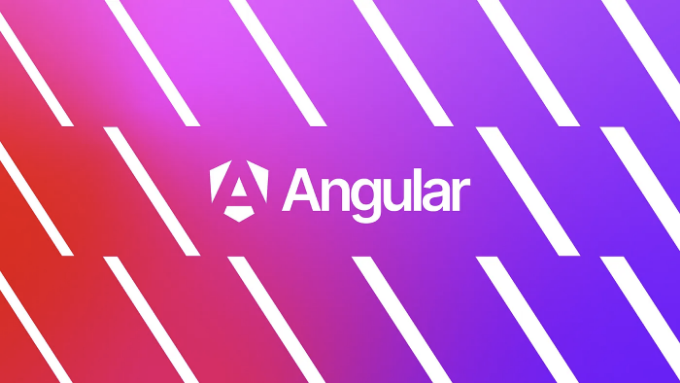
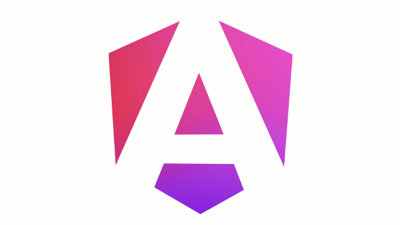
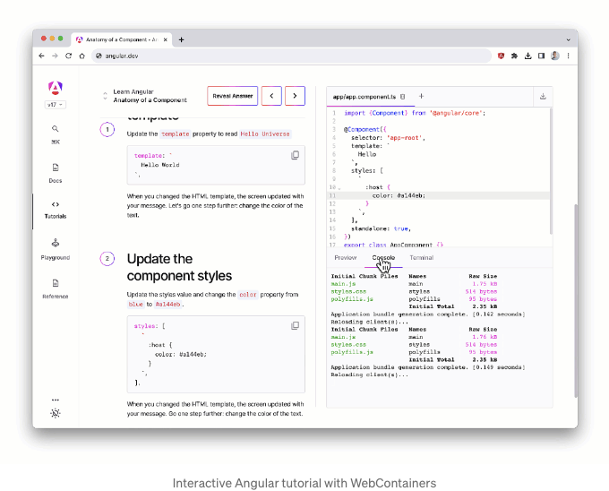
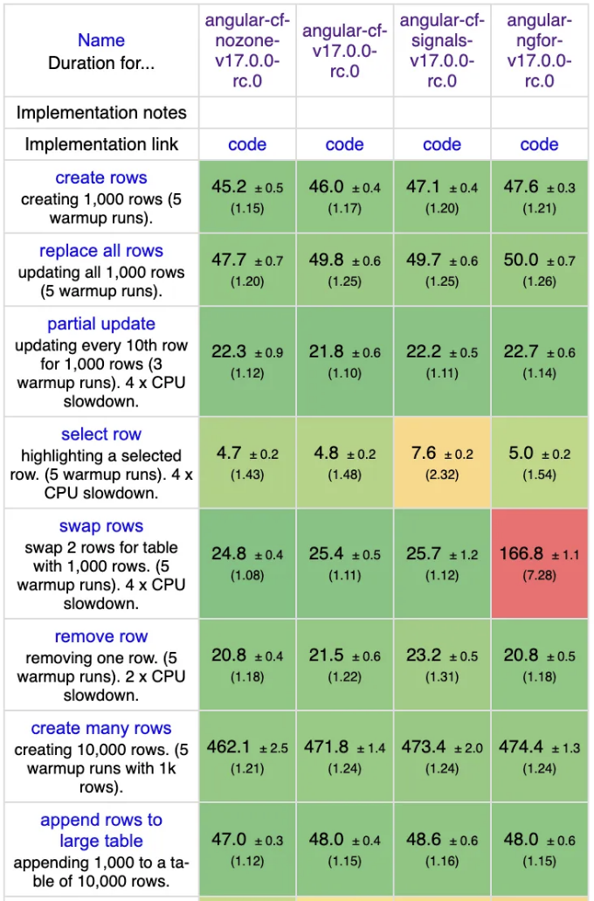
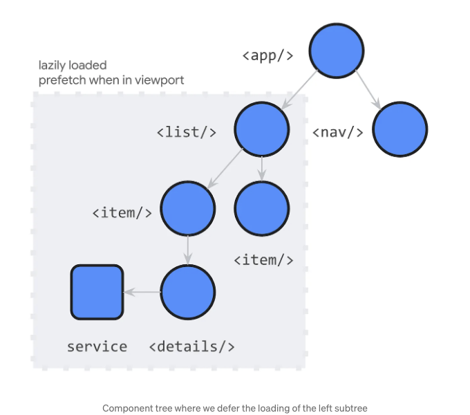
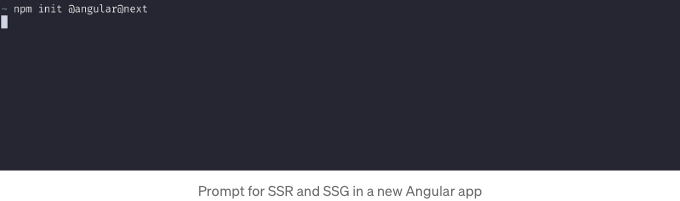
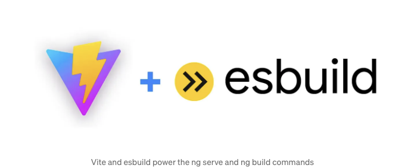
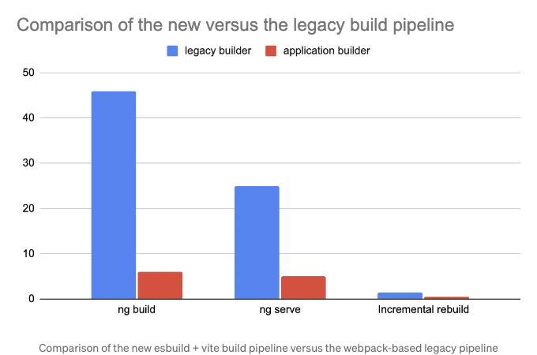
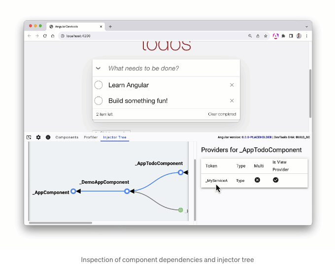
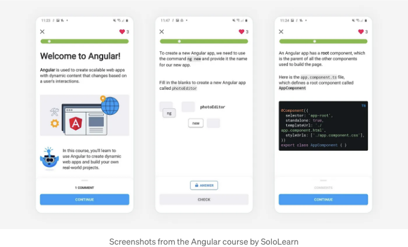

지난 달에는 Angular의 붉은 방패가 13주년을 맞이했습니다. AngularJS는 JavaScript 프레임워크의 새로운 파도를 시작시켰고, 이는 풍부한 웹 경험에 대한 점점 커지는 요구를 지원하기 위해 등장했습니다. 오늘은 새로운 모습과 미래를 향한 기능 세트로 모두가 함께 미래로 나아가도록 17번 버전으로 새로운 성능과 개발자 경험을 제시하며 새로운 표준을 제시합니다.



v17에서 우리는 기쁨 가지고 소개합니다:

- 성능과 개발자 경험을 한 단계 높여주는 미뤄질 수 있는 뷰
- 공용 벤치마크에서 내장된 제어흐름 루프로 런타임이 최대 90% 빨라집니다
- 하이브리드 렌더링의 경우 최대 87% 더 빠른 빌드 및 클라이언트 측 렌더링의 경우 67% 더 빨라집니다
- Angular의 미래 지향적인 기능을 반영한 새로운 외관
- 새로운 대화형 학습 여정
- …그리고 수십 가지 기능 및 개선 사항들도 있습니다!

<!-- ui-log 수평형 -->
<ins class="adsbygoogle"
  style="display:block"
  data-ad-client="ca-pub-4877378276818686"
  data-ad-slot="9743150776"
  data-ad-format="auto"
  data-full-width-responsive="true"></ins>
<component is="script">
(adsbygoogle = window.adsbygoogle || []).push({});
</component>

# 미래를 내다 보는 정체성

Angular의 부흥은 최근 몇 버전 동안 증가 추세를 이어왔습니다. 시그널 기반 반응성, 하이드레이션, 독립 구성 요소, 지시자 조합 등의 개선으로 우리는 기세를 올리고 있습니다. Angular의 신속한 발전에도 불구하고, 브랜딩은 예초부터 거의 변하지 않아 왔습니다.

오늘, 수백만 개발자들에 의해 실전 테스트된 당신이 사랑하는 프레임워크가 미래 지향적인 개발자 경험과 성능을 반영한 새로운 모습을 얻었습니다!



<!-- ui-log 수평형 -->
<ins class="adsbygoogle"
  style="display:block"
  data-ad-client="ca-pub-4877378276818686"
  data-ad-slot="9743150776"
  data-ad-format="auto"
  data-full-width-responsive="true"></ins>
<component is="script">
(adsbygoogle = window.adsbygoogle || []).push({});
</component>

# 미래를 내다보는 문서

새로운 브랜드와 함께 Angular 문서의 새로운 홈인 angular.dev를 개발했습니다. 새로운 문서 웹사이트에는 새로운 구조, 새로운 안내서, 개선된 콘텐츠가 함께하며, 브라우저에서 직접 Angular 및 Angular CLI를 사용하여 각자의 속도로 학습할 수 있는 대화형 학습 여정을 위한 플랫폼을 구축했습니다.

새로운 대화형 학습 경험은 WebContainers를 통해 구동되며, 모든 현대 웹 브라우저에서 Angular CLI의 기능을 활용할 수 있습니다!



<!-- ui-log 수평형 -->
<ins class="adsbygoogle"
  style="display:block"
  data-ad-client="ca-pub-4877378276818686"
  data-ad-slot="9743150776"
  data-ad-format="auto"
  data-full-width-responsive="true"></ins>
<component is="script">
(adsbygoogle = window.adsbygoogle || []).push({});
</component>

오늘은 angular.dev의 베타 미리보기를 출시하고, v18에서는 Angular의 기본 웹사이트로 만들 계획입니다. "Announcing angular.dev"에서 Angular의 새로운 모습과 angular.dev에 대해 자세히 알아볼 수 있습니다.

이제 v17에서 기대되는 기능들을 자세히 살펴보겠습니다!

## 내장 제어 흐름

개발자 경험을 개선하기 위해 간단하고 선언적인 API로 강력한 기능을 제공하는 새로운 블록 템플릿 구문을 출시했습니다. Angular 컴파일러는 해당 구문을 효율적인 JavaScript 명령으로 변환하여 제어 흐름, 지연 로딩 등을 수행할 수 있습니다.

<!-- ui-log 수평형 -->
<ins class="adsbygoogle"
  style="display:block"
  data-ad-client="ca-pub-4877378276818686"
  data-ad-slot="9743150776"
  data-ad-format="auto"
  data-full-width-responsive="true"></ins>
<component is="script">
(adsbygoogle = window.adsbygoogle || []).push({});
</component>

우리는 최적화된 내장 제어 흐름을 위해 새로운 블록 구문을 사용했어. 사용자 연구를 실시한 결과로, 많은 개발자들이 *ngIf, *ngSwitch, *ngFor에 어려움을 겪는다는 것을 발견했어. 2016년부터 Angular을 사용해오면서 지난 5년간 Angular 팀에 속해온 나로써도 *ngFor와 trackBy의 구문을 확인해야 하는 경우가 많았지. 커뮤니티, 파트너의 피드백을 수집하고 UX 연구를 실시한 결과, 우리는 Angular을 위한 새로운 내장 제어 흐름을 개발했어!

내장 제어 흐름은 다음을 가능하게 해줘:

- 자바스크립트에 더 가까운 보다 직관적인 더 직관적인 구문으로 더 적은 문서 조회를 필요로 해
- 더 최적화된 타입 축소에 감사함을 표함을 통한 더 나은 타입 체크
- 주로 빌드 시간에 존재하는 개념으로 런타임 플루트포인트를 줄여줌(“사라져” 버리는) 것으로 번들 크기를 최대 30킬로바이트까지 줄이고 코어 웹 핵심 점수를 더욱 더 향상시킬 수 있어
- 추가적인 import 없이 자동으로 템플릿에서 사용 가능
- 조금 더 자세히 다룰 성능 향상들

# 조건문

<!-- ui-log 수평형 -->
<ins class="adsbygoogle"
  style="display:block"
  data-ad-client="ca-pub-4877378276818686"
  data-ad-slot="9743150776"
  data-ad-format="auto"
  data-full-width-responsive="true"></ins>
<component is="script">
(adsbygoogle = window.adsbygoogle || []).push({});
</component>

이제 *ngIf와 나란히 비교해 보겠습니다:

```js
<div *ngIf="loggedIn; else anonymousUser">
  사용자가 로그인되었습니다
</div>
<ng-template #anonymousUser>
  사용자가 로그인되지 않았습니다
</ng-template>
```

내장 if 문을 사용하면 다음과 같이 표현됩니다:

```js
@if (loggedIn) {
  사용자가 로그인되었습니다
} @else {
  사용자가 로그인되지 않았습니다
}
```

<!-- ui-log 수평형 -->
<ins class="adsbygoogle"
  style="display:block"
  data-ad-client="ca-pub-4877378276818686"
  data-ad-slot="9743150776"
  data-ad-format="auto"
  data-full-width-responsive="true"></ins>
<component is="script">
(adsbygoogle = window.adsbygoogle || []).push({});
</component>

@else에 콘텐츠를 직접 제공할 수 있는 것은 이전 *ngIf 옵션의 else 절과 비교했을 때 주요 단순화입니다. 현재의 제어 흐름은 과거에는 불가능했던 @else if를 간단히 구현할 수 있도록 만듭니다.

개선된 유연성은 *ngSwitch에서 더욱 두드러집니다:

```js
<div [ngSwitch]="accessLevel">
  <admin-dashboard *ngSwitchCase="admin"/>
  <moderator-dashboard *ngSwitchCase="moderator"/>
  <user-dashboard *ngSwitchDefault/>
</div>
```

내장된 제어 흐름과 결합하면 다음과 같이 변환됩니다:

<!-- ui-log 수평형 -->
<ins class="adsbygoogle"
  style="display:block"
  data-ad-client="ca-pub-4877378276818686"
  data-ad-slot="9743150776"
  data-ad-format="auto"
  data-full-width-responsive="true"></ins>
<component is="script">
(adsbygoogle = window.adsbygoogle || []).push({});
</component>

```js
@switch (accessLevel) {
  @case ('admin') { <admin-dashboard/> }
  @case ('moderator') { <moderator-dashboard/> }
  @default { <user-dashboard/> }
}
```

새로운 제어 흐름은 @switch의 각 분기에서 가능했던 것처럼 매우 좋은 타입 좁히기를 가능하게 합니다. 이는 *ngSwitch에서 불가능했던 것입니다.

# 내장 for 루프

가장 좋아하는 업데이트 중 하나는 우리가 도입한 내장 for 루프입니다. 개발자 경험 개선에 더해 Angular의 렌더링 속도를 더 높은 수준으로 끌어올렸습니다!

<!-- ui-log 수평형 -->
<ins class="adsbygoogle"
  style="display:block"
  data-ad-client="ca-pub-4877378276818686"
  data-ad-slot="9743150776"
  data-ad-format="auto"
  data-full-width-responsive="true"></ins>
<component is="script">
(adsbygoogle = window.adsbygoogle || []).push({});
</component>

기본 구문은 다음과 같습니다:

```js
@for (user of users; track user.id) {
  { user.name }
} @empty {
  사용자 목록이 비어 있습니다
}
```

*ngFor에 trackBy 함수가 없어서 앱에서 성능 문제가 발생하는 경우가 많습니다. @for의 몇 가지 차이점은 diffing 성능을 보장하기 위해 track이 필수적이라는 것입니다. 또한 표현식이므로 컴포넌트 클래스의 메소드가 아닌 쉽게 사용할 수 있습니다. 내장된 @for 루프에는 옵셔널한 @empty 블록을 통해 항목이 없는 컬렉션에 대한 바로가기가 있습니다.

@for 문은 새로운 diffing 알고리즘을 사용하며 *ngFor보다 더 최적화된 구현을 갖고 있어 커뮤니티 프레임워크 벤치마크에 대해 최대 90% 빠른 런타임 속도를 제공합니다!

<!-- ui-log 수평형 -->
<ins class="adsbygoogle"
  style="display:block"
  data-ad-client="ca-pub-4877378276818686"
  data-ad-slot="9743150776"
  data-ad-format="auto"
  data-full-width-responsive="true"></ins>
<component is="script">
(adsbygoogle = window.adsbygoogle || []).push({});
</component>



# 한 번 시도해보세요!

내장 제어 플로우는 오늘 개발자 미리보기를 통해 v17에서 사용할 수 있습니다!

내장 제어 플로우의 디자인 목표 중 하나는 완전히 자동화된 이관을 가능하게 하는 것이었습니다. 기존 프로젝트에서 시도해 보려면 다음 이관을 사용하세요:

<!-- ui-log 수평형 -->
<ins class="adsbygoogle"
  style="display:block"
  data-ad-client="ca-pub-4877378276818686"
  data-ad-slot="9743150776"
  data-ad-format="auto"
  data-full-width-responsive="true"></ins>
<component is="script">
(adsbygoogle = window.adsbygoogle || []).push({});
</component>

```js
ng generate @angular/core:control-flow
```

# 다음은 무엇인가요?

이미 내장된 제어 흐름을 최신 언어 서비스와 함께 사용할 수 있으며, JetBrains와도 밀접히 협력하여 제품의 지원을 향상시키도록 노력했습니다. 또한 Angular 템플릿의 적절한 서식 지원을 보장하기 위해 Prettier의 Sosuke Suzuki와 연락을 취하고 있습니다.

내장된 제어 흐름이 *ngIf, *ngFor 및 *ngSwitch와 같은 콘텐츠 프로젝션을 처리하는 방식에는 아직 몇 가지 차이가 있습니다. 이 차이에 대해 다음 몇 달 동안 작업할 계획이며, 구현과 안정성에 대해 확신하므로 오늘 바로 사용해 볼 수 있습니다! 다음 주요 릴리스까지 개발자 미리보기로 유지하고, 우리가 개발자 경험을 더 향상시킬 기회를 발견하면 잠재적으로 하위 호환성이 없는 수정 사항에 대한 문을 열기 위해 이 작업을 진행할 예정입니다.```

<!-- ui-log 수평형 -->
<ins class="adsbygoogle"
  style="display:block"
  data-ad-client="ca-pub-4877378276818686"
  data-ad-slot="9743150776"
  data-ad-format="auto"
  data-full-width-responsive="true"></ins>
<component is="script">
(adsbygoogle = window.adsbygoogle || []).push({});
</component>

# 지연로드 가능한 뷰

이제 게으름을 이야기해 보겠습니다! 새로 개발한 블록 구문을 활용하여 앱을 더 빠르게 만들 수 있는 강력한 메커니즘을 만들었습니다. 이 블로그 글의 시작에서 말했듯이, 지연로드 가능한 뷰는 선언적이면서도 강력한 지연로딩을 가능하게 함으로써 전례 없는 사용 편의성을 제공하여 성능과 개발자 경험을 더욱 향상시킵니다.



예를 들어 블로그가 있다고 가정해 보겠습니다. 사용자의 댓글 목록을 게으르게 로드하고 싶다고 가정해 봅시다. 현재는 ViewContainerRef를 사용해야 하며 클린업, 로딩 오류 관리, 플레이스홀더 표시 등을 모두 처리해야 합니다. 다양한 코너 케이스를 다루는 것이 복잡함으로 인해 상당히 복잡한 코드가 될 수 있으며, 테스트와 디버깅이 어렵게 될 수 있습니다.

<!-- ui-log 수평형 -->
<ins class="adsbygoogle"
  style="display:block"
  data-ad-client="ca-pub-4877378276818686"
  data-ad-slot="9743150776"
  data-ad-format="auto"
  data-full-width-responsive="true"></ins>
<component is="script">
(adsbygoogle = window.adsbygoogle || []).push({});
</component>

새로운 지연 로딩 뷰를 통해 한 줄의 선언적 코드로 댓글 목록과 모든 종속 항목을 게으르게 로드할 수 있습니다.

가장 놀라운 점은 이 모든 것이 컴파일 시간 변환을 통해 발생한다는 것입니다. Angular는 @defer 블록 안에서 사용된 컴포넌트, 디렉티브 및 파이프를 찾아 동적 import를 생성하고 로딩 및 상태 전환을 관리함으로써 모든 복잡성을 추상화합니다.

특정 DOM 요소가 뷰포트에 진입할 때 컴포넌트를 게으르게 로드하려면 더 많은 비즈니스 로직과 IntersectionObserver API가 필요합니다. Angular는 IntersectionObserver를 사용하기를 더 간단하게 만들어줍니다. 게으르게 로딩할 수 있는 뷰 트리거를 추가하기만 하면 됩니다!

<!-- ui-log 수평형 -->
<ins class="adsbygoogle"
  style="display:block"
  data-ad-client="ca-pub-4877378276818686"
  data-ad-slot="9743150776"
  data-ad-format="auto"
  data-full-width-responsive="true"></ins>
<component is="script">
(adsbygoogle = window.adsbygoogle || []).push({});
</component>

```js
@defer (on viewport) {
  <comment-list />
} @placeholder {
  <!-- 댓글이 로드될 때까지 보여줄 자리 표시 내용 -->
  
}
```

위 예시에서 Angular은 먼저 플레이스홀더 블록의 내용을 렌더링합니다. 뷰포트에서 보이게 되면 `comment-list/` 컴포넌트의 로딩이 시작됩니다. 로딩이 완료되면 Angular은 플레이스홀더를 제거하고 컴포넌트를 렌더링합니다.

로딩 및 에러 상태용 블록도 있습니다:

```js
@defer (on viewport) {
  <comment-list/>
} @loading {
  로딩 중...
} @error {
  로딩 실패 :(
} @placeholder {
  
}
```

<!-- ui-log 수평형 -->
<ins class="adsbygoogle"
  style="display:block"
  data-ad-client="ca-pub-4877378276818686"
  data-ad-slot="9743150776"
  data-ad-format="auto"
  data-full-width-responsive="true"></ins>
<component is="script">
(adsbygoogle = window.adsbygoogle || []).push({});
</component>

그래요! Angular가 대신 처리해주는 복잡성이 많이 있어요.

지연 로딩 뷰는 몇 가지 추가적인 트리거를 제공해요:

- on idle — 브라우저가 무거운 작업을 하지 않을 때 블록을 지연 로딩해요
- on immediate — 브라우저를 차단하지 않고 자동으로 늦게 로딩을 시작해요
- on timer(`시간`) — 타이머로 로딩을 지연시켜요
- on viewport 및 on viewport(`참조`) — viewport는 기본적으로 앵커 엘리먼트에 대한 참조를 지정할 수 있어요. 앵커 엘리먼트가 보일 때 Angular가 구성 요소를 나중에로 로딩하고 렌더링할 거에요
- on interaction 및 on interaction(`참조`) — 사용자가 특정 엘리먼트와 상호 작용할 때 지연 로딩을 시작할 수 있어요
- on hover 및 on hover(`참조`) — 사용자가 엘리먼트 위에 마우스를 올릴 때 늦게 로딩하는 트리거에요
- when `조건` — 불리언 표현식으로 직접 조건을 지정할 수 있어요

지연 로딩 뷰는 또한 렌더링 전에 종속성을 미리 가져와 로딩할 수 있는 기능을 제공해요. Prefetching은 지연 블록에 prefetch 문을 추가하는 것만으로 간단히 추가할 수 있으며 모든 동일한 트리거를 지원해요.

<!-- ui-log 수평형 -->
<ins class="adsbygoogle"
  style="display:block"
  data-ad-client="ca-pub-4877378276818686"
  data-ad-slot="9743150776"
  data-ad-format="auto"
  data-full-width-responsive="true"></ins>
<component is="script">
(adsbygoogle = window.adsbygoogle || []).push({});
</component>

```js
@defer (화면에 보이면 지연; 유휴 상태에서는 미리 가져오기) {
  <comment-list />
}
```

이제 v17에서 개발자 미리보기로 사용할 수 있는 지연 뷰가 있습니다! 이 기능에 대해 자세히 알아보세요.

# 다음은 무엇인가요?

지연 뷰를 사용할 준비가 되어 있고, 꼭 한 번 시도해 보기를 권장합니다! 우리는 이들을 개발자 미리보기 상태로 유지하는 이유는 더 많은 피드백을 수집하고 API 표면에서 변경 사항을 도입하여 다른 프레임워크와 같이 의미론적 버전 관리를 하기 전까지 고정할 수 있도록하기 위해서입니다.

<!-- ui-log 수평형 -->
<ins class="adsbygoogle"
  style="display:block"
  data-ad-client="ca-pub-4877378276818686"
  data-ad-slot="9743150776"
  data-ad-format="auto"
  data-full-width-responsive="true"></ins>
<component is="script">
(adsbygoogle = window.adsbygoogle || []).push({});
</component>

서버 측 렌더링은 현재 지정된 자리 표시자를 렌더링합니다. 프레임워크가 애플리케이션을 로드하여 활성화하면, 지연 로딩 가능한 뷰는 위에서 설명한 대로 작동합니다.

다음 단계로 넘어가면 서버에서 defer 블록 내부의 콘텐츠를 렌더링하고 클라이언트에서 부분적인 활성화를 가능하게 할 것입니다. 이 경우, 클라이언트는 트리거가 요청될 때까지 지연된 뷰에 대한 코드를 다운로드하지 않습니다. 이 시점에서 Angular는 연관된 JavaScript를 다운로드하고 뷰의 이 부분만 활성화할 것입니다.

또한 시그널과의 흥미로운 상호 운용성이 많이 나올 예정이니 계속 주시해주세요!

# 혁신적인 하이브리드 렌더링 경험

<!-- ui-log 수평형 -->
<ins class="adsbygoogle"
  style="display:block"
  data-ad-client="ca-pub-4877378276818686"
  data-ad-slot="9743150776"
  data-ad-format="auto"
  data-full-width-responsive="true"></ins>
<component is="script">
(adsbygoogle = window.adsbygoogle || []).push({});
</component>

오늘은 ng new에서 개발자에게 서버 사이드 렌더링 (SSR) 및 정적 사이트 생성 (SSG 또는 사전 렌더링)을 더 가깝게 제공합니다:



우리는 오랜 시간 동안 이 변경을 원해 왔지만, 먼저 Angular의 SSR 개발자 경험에 대해 확신하고 싶었습니다.

또는 새 프로젝트에서 SSR을 활성화할 수도 있습니다.

<!-- ui-log 수평형 -->
<ins class="adsbygoogle"
  style="display:block"
  data-ad-client="ca-pub-4877378276818686"
  data-ad-slot="9743150776"
  data-ad-format="auto"
  data-full-width-responsive="true"></ins>
<component is="script">
(adsbygoogle = window.adsbygoogle || []).push({});
</component>

```js
ng new my-app --ssr
```

# 개발자 미리보기에서 탈출하는 Hydration

지난 6개월 동안 다양한 애플리케이션이 수천 개가 Hydration을 채택했습니다. 오늘, 우리는 개발자 미리보기를 벗어나 hydration이 서버 사이드 렌더링을 사용하는 모든 새로운 앱에서 기본적으로 활성화되었다는 것을 기쁘게 알려드립니다!

# 새로운 @angular/ssr 패키지

<!-- ui-log 수평형 -->
<ins class="adsbygoogle"
  style="display:block"
  data-ad-client="ca-pub-4877378276818686"
  data-ad-slot="9743150776"
  data-ad-format="auto"
  data-full-width-responsive="true"></ins>
<component is="script">
(adsbygoogle = window.adsbygoogle || []).push({});
</component>

저희가 Angular Universal 저장소를 Angular CLI 저장소로 이전하여 서버 측 렌더링을 더욱 중요한 도구로 포함시켰습니다!

오늘부터 기존 애플리케이션에 하이브리드 렌더링 지원을 추가하려면 다음을 실행하세요:

```js
ng add @angular/ssr
```

이 명령은 서버 진입점을 생성하고 SSR 및 SSG 빌드 기능을 추가하며 기본적으로 수분화(hydration)를 활성화합니다. @angular/ssr은 현재 유지 관리 모드인 @nguniversal/express-engine과 동등한 기능을 제공합니다. express-engine을 사용 중이라면 Angular CLI가 자동으로 코드를 @angular/ssr로 업데이트합니다.

<!-- ui-log 수평형 -->
<ins class="adsbygoogle"
  style="display:block"
  data-ad-client="ca-pub-4877378276818686"
  data-ad-slot="9743150776"
  data-ad-format="auto"
  data-full-width-responsive="true"></ins>
<component is="script">
(adsbygoogle = window.adsbygoogle || []).push({});
</component>

Virgin Media O2은 레거시 플랫폼에서 최신 Angular Hybrid 렌더링 솔루션으로 이전한 후 매출이 112% 증가했습니다. NgOptimizedImage를 사용하여 DOM Hydration과 함께 Angular SSR를 이용함으로써 누적 레이아웃 변화를 평균 99.4% 감소시켰습니다.

# SSR을 이용한 앱 배포

개발자 경험을 더 향상시키기 위해, 클라우드 제공업체와 밀접히 협력하여 플랫폼에 원활하게 배포할 수 있도록 지원하였습니다.

Firebase는 이제 새로운 프레임워크 인식 CLI의 초기 미리보기와 함께, Angular 애플리케이션을 거의 구성 없이 자동으로 인식하고 배포할 수 있게 될 것입니다.

<!-- ui-log 수평형 -->
<ins class="adsbygoogle"
  style="display:block"
  data-ad-client="ca-pub-4877378276818686"
  data-ad-slot="9743150776"
  data-ad-format="auto"
  data-full-width-responsive="true"></ins>
<component is="script">
(adsbygoogle = window.adsbygoogle || []).push({});
</component>

```js
파이어베이스 실험: 활성화 웹프레임워크
파이어베이스 초기화 호스팅
파이어베이스 배포
```

프레임워크 인식 CLI는 SSR, i18n, 이미지 최적화 등을 인식하여 효율적인 웹 앱을 비용 효율적인 서버리스 인프라에서 제공할 수 있게 해줍니다.

복잡한 Angular 모노레포지토리를 갖거나 단순히 네이티브 도구를 선호하는 사람들을 위해 AngularFire는 Firebase로의 배포를 ng deploy로 허용합니다:

```js
ng add @angular/fire
ng deploy
```

<!-- ui-log 수평형 -->
<ins class="adsbygoogle"
  style="display:block"
  data-ad-client="ca-pub-4877378276818686"
  data-ad-slot="9743150776"
  data-ad-format="auto"
  data-full-width-responsive="true"></ins>
<component is="script">
(adsbygoogle = window.adsbygoogle || []).push({});
</component>

에지 워커로의 배포를 활성화하기 위해 Angular의 서버 측 렌더링에서 ECMAScript 모듈 지원을 활성화했고, HttpClient를 위한 fetch 백엔드를 도입하고 CloudFlare와 협력하여 프로세스를 간소화했습니다.

# 새 라이프사이클 후크

Angular의 SSR 및 SSG의 성능을 향상시키기 위해, 장기적으로 DOM 에뮬레이션과 직접적인 DOM 조작에서 이탈하고자 합니다. 동시에 대부분의 애플리케이션 수명 주기 동안 요소와 상호 작용하여 써드파티 라이브러리를 초기화하고 요소 크기를 측정해야 합니다.

이를 가능하게 하기 위해, 새로운 라이프사이클 후크 세트를 개발했습니다:

<!-- ui-log 수평형 -->
<ins class="adsbygoogle"
  style="display:block"
  data-ad-client="ca-pub-4877378276818686"
  data-ad-slot="9743150776"
  data-ad-format="auto"
  data-full-width-responsive="true"></ins>
<component is="script">
(adsbygoogle = window.adsbygoogle || []).push({});
</component>

- afterRender — 응용 프로그램 렌더링이 완료될 때마다 호출할 콜백을 등록합니다.
- afterNextRender — 응용 프로그램 렌더링이 다음 번에 완료될 때 호출할 콜백을 등록합니다.

브라우저만 이러한 후크를 호출하므로 구성 요소 내부에 사용자 지정 DOM 로직을 안전하게 직접 연결할 수 있습니다. 예를 들어 차트 라이브러리를 인스턴스화하려면 afterNextRender을 사용할 수 있습니다:

```js
@Component({
  selector: 'my-chart-cmp',
  template: `<div #chart>{ ... }</div>`,
})
export class MyChartCmp {
  @ViewChild('chart') chartRef: ElementRef;
  chart: MyChart|null;

  constructor() {
    afterNextRender(() => {
      this.chart = new MyChart(this.chartRef.nativeElement);
    }, {phase: AfterRenderPhase.Write});
  }
}
```

각 후크는 Angular이 레이아웃 지연을 줄이고 성능을 향상시키기 위해 콜백을 예약할 때 사용하는 phase 값을 지원합니다 (예: read, write).

<!-- ui-log 수평형 -->
<ins class="adsbygoogle"
  style="display:block"
  data-ad-client="ca-pub-4877378276818686"
  data-ad-slot="9743150776"
  data-ad-format="auto"
  data-full-width-responsive="true"></ins>
<component is="script">
(adsbygoogle = window.adsbygoogle || []).push({});
</component>

# 새 프로젝트의 기본은 Vite와 esbuild입니다



Angular에서 SSR을 시작할 수 있었던 것은 Angular CLI의 빌드 파이프라인에서 만든 근본적인 변경 없이는 불가능했습니다!

v16에서는 esbuild 및 Vite를 이용한 빌드 경험의 개발자 미리보기를 소개했습니다. 그 이후로 많은 개발자들이 이를 실험하고, 일부 기업 파트너들은 앱 중 일부에서 빌드 시간이 67% 단축되었다고 보고했습니다! 오늘, 새 어플리케이션 빌더가 개발자 미리보기를 떠나 새로운 어플리케이션에 대해 기본값으로 설정된 것을 기쁘게 알려드립니다!

<!-- ui-log 수평형 -->
<ins class="adsbygoogle"
  style="display:block"
  data-ad-client="ca-pub-4877378276818686"
  data-ad-slot="9743150776"
  data-ad-format="auto"
  data-full-width-responsive="true"></ins>
<component is="script">
(adsbygoogle = window.adsbygoogle || []).push({});
</component>

게다가, 혼합 렌더링을 사용할 때 빌드 파이프라인을 업데이트했습니다. SSR 및 SSG를 사용하면 ng build에서 최대 87%의 속도 향상과 ng serve에서 최대 80% 빠른 편집-새로고침 루프를 관찰할 수 있습니다.



향후 소규모 버전에서는 기존 프로젝트를 자동으로 마이그레이션하는 스키매틱을 제공할 예정입니다. 이것은 SSG 또는 SSR로 클라이언트 측 렌더링을 사용하고 있는 기존 프로젝트를 자동으로 마이그레이션합니다. 만약 새로운 어플리케이션 빌더를 테스트하고 싶다면, 문서에서 이 가이드를 확인해보세요.

# DevTools에서 의존성 주입 디버깅

<!-- ui-log 수평형 -->
<ins class="adsbygoogle"
  style="display:block"
  data-ad-client="ca-pub-4877378276818686"
  data-ad-slot="9743150776"
  data-ad-format="auto"
  data-full-width-responsive="true"></ins>
<component is="script">
(adsbygoogle = window.adsbygoogle || []).push({});
</component>

작년에 우리는 Angular DevTools에서 의존성 주입 디버깅 기능의 미리보기를 보여드렸어요. 지난 몇 달 동안, 우리는 프레임워크의 런타임에 플러그인할 수 있는 새로운 디버깅 API를 구현했어요. 

이러한 API를 기반으로, 우리는 인젝터 트리를 검사할 수 있는 검사용 인터페이스를 만들었어요. 이를 통해 다음을 미리볼 수 있어요:

- 컴포넌트 인스펙터에서 컴포넌트의 의존성
- 인젝터 트리 및 의존성 해결 경로
- 개별 인젝터 내에서 선언된 프로바이더

아래 애니메이션에서 기능의 빠른 미리보기를 찾을 수 있어요. Angular DevTools에 대해 더 알고 싶다면 angular.io를 방문해주세요.

<!-- ui-log 수평형 -->
<ins class="adsbygoogle"
  style="display:block"
  data-ad-client="ca-pub-4877378276818686"
  data-ad-slot="9743150776"
  data-ad-format="auto"
  data-full-width-responsive="true"></ins>
<component is="script">
(adsbygoogle = window.adsbygoogle || []).push({});
</component>



그 다음 단계로 UI를 개선하고 인젝터 계층, 프로바이더 및 그들의 해결에 대한 더 나은 시각화 작업을 할 것입니다.

# 처음부터 독립형 API

작년 반 이상 동안 독립형 컴포넌트, 디렉티브 및 파이프에 대한 피드백을 모은 후, 그들의 DevEx를 향상시키고, 새로운 모든 응용프로그램에서 처음부터 사용할 수 있는 자신감을 가지고 있습니다. 이제 모든 `ng generate` 명령은 독립형 컴포넌트, 디렉티브 및 파이프를 생성할 것입니다.

<!-- ui-log 수평형 -->
<ins class="adsbygoogle"
  style="display:block"
  data-ad-client="ca-pub-4877378276818686"
  data-ad-slot="9743150776"
  data-ad-format="auto"
  data-full-width-responsive="true"></ins>
<component is="script">
(adsbygoogle = window.adsbygoogle || []).push({});
</component>

이에 더불어, 일관된 학습 경험, 개발 관행 및 권장 사항을 보장하기 위해 angular.io 및 angular.dev의 전체 문서도 다시 검토했습니다.

앞으로 NgModules를 계속 사용할 예정이지만, 새로운 독립형 API의 이점을 고려할 때 프로젝트를 점진적으로 이동하는 것을 강력히 권장합니다. 또한 다음 명령어를 사용하여 대부분의 작업을 자동화해주는 스키매틱도 제공됩니다:

```js
ng generate @angular/core:standalone
```

자세한 정보는 이주 가이드를 확인해주세요.

<!-- ui-log 수평형 -->
<ins class="adsbygoogle"
  style="display:block"
  data-ad-client="ca-pub-4877378276818686"
  data-ad-slot="9743150776"
  data-ad-format="auto"
  data-full-width-responsive="true"></ins>
<component is="script">
(adsbygoogle = window.adsbygoogle || []).push({});
</component>

# 반응성의 다음 단계

Angular의 새로운 신호 기반 반응형 시스템은 이 프레임워크에서 가장 큰 변화 중 하나였습니다. 역호환성을 보장하고 Zone.js 기반 변경 감지와의 상호 운용성을 확보하기 위해 우리는 워크샵과 설계를 통해 앞으로의 방향을 열고 있습니다.

오늘, Angular 신호 구현은 개발자 미리보기 단계를 종료했다는 기쁜 소식을 전합니다. 현재까지 효과 함수는 개발자 미리보기 단계에 유지함으로써 의미론을 더욱 발전시킬 수 있도록 노력할 것입니다.

다음 몇 달 동안 우리는 신호 기반 입력, 뷰 쿼리 등의 기능을 추가할 예정입니다. Angular v18에서는 내년 5월까지 개발자 경험을 더욱 향상시키는 기능이 많이 포함될 것입니다.

<!-- ui-log 수평형 -->
<ins class="adsbygoogle"
  style="display:block"
  data-ad-client="ca-pub-4877378276818686"
  data-ad-slot="9743150776"
  data-ad-format="auto"
  data-full-width-responsive="true"></ins>
<component is="script">
(adsbygoogle = window.adsbygoogle || []).push({});
</component>

# 테스트에 대한 다음 단계

저희는 Jest를 계속 실험하면서 성능이 우수하고 유연하며 개발자의 요구를 충족시킬 수 있는 솔루션을 구축하기 위해 최선을 다하고 있습니다. 또한 Web Test Runner를 실험하기 시작했으며 초기 구현에 대한 오픈 PR이 있습니다. 가까운 미래에는 아마도 먼저 Web Test Runner에 초점을 맞춰 프로젝트들이 Karma를 빠르게 떠오를 수 있도록 블록되는 것을 해결할 것으로 예상됩니다.

# Material 3에 대한 다음 단계

저희는 구글의 Material Design 팀과 긴밀히 협력하여 Angular Material 내부를 리팩토링하여 디자인 토큰을 통합하고, 구성 요소에 대한 큰 변형 옵션을 제공하고 Material 3을 지원할 수 있는 시스템을 구축하기 위해 노력해 왔습니다. 우리는 아직 v17용 디자인 토큰과 M3 지원을 제공할 준비가 되지 않았지만, v17 마이너 릴리스에서 이러한 기능을 곧 출시할 것으로 예상합니다.

<!-- ui-log 수평형 -->
<ins class="adsbygoogle"
  style="display:block"
  data-ad-client="ca-pub-4877378276818686"
  data-ad-slot="9743150776"
  data-ad-format="auto"
  data-full-width-responsive="true"></ins>
<component is="script">
(adsbygoogle = window.adsbygoogle || []).push({});
</component>

20222년 4분기에 MDC 기반의 새로운 Angular Material 컴포넌트를 발표했고, 동등한 기능을 갖추고 있지만 다른 DOM 구조와 스타일을 가진 레거시 컴포넌트의 사용이 폐기될 예정입니다. 레거시 컴포넌트는 v15에서 폐기되고 v17에서 완전히 제거될 예정입니다. Angular Material v17 패키지에 레거시 컴포넌트가 포함되지 않겠지만, 여전히 앱을 Angular v17로 업데이트하고 v16 Angular Material 패키지를 사용할 수 있습니다. 이 옵션은 v18까지 제공될 예정이며, 그 이후에는 Angular Material v16이 더 이상 새로운 Angular 버전과 호환되지 않을 것입니다. 또한, 아직 마이그레이션을 수행할 수 없는 경우에 대비하여 HeroDevs와의 파트너쉽을 통해 유료 무기한 지원을 제공할 예정입니다.

# 삶의 질 향상

이 모든 미래 지향적인 기능들과 함께, 백로그에서 작업해온 여러 작은 개발자 경험 향상 사항들을 함께 배포했습니다!

# 실험적인 뷰 전환 지원

<!-- ui-log 수평형 -->
<ins class="adsbygoogle"
  style="display:block"
  data-ad-client="ca-pub-4877378276818686"
  data-ad-slot="9743150776"
  data-ad-format="auto"
  data-full-width-responsive="true"></ins>
<component is="script">
(adsbygoogle = window.adsbygoogle || []).push({});
</component>

뷰 전환 API를 사용하면 DOM을 변경할 때 부드러운 전환을 제공할 수 있습니다. Angular 라우터에서는 이제 withViewTransitions 기능을 통해 이 API에 직접 지원을 제공합니다. 이를 사용하면 브라우저의 원래 기능을 사용하여 라우트간에 애니메이션 전환을 만들 수 있습니다.

오늘 당장 이 기능을 앱에 추가하려면 부트스트랩 중에 라우터의 제공자 선언에서 구성하면 됩니다:

```js
bootstrapApplication(App, {
  providers: [
    provideRouter(routes, withViewTransitions()),
  ]
});
```

withViewTransitions 함수는 onViewTransitionCreated 속성이 있는 선택적 구성 객체를 허용합니다. 이 콜백은 추가적인 제어를 제공합니다.

<!-- ui-log 수평형 -->
<ins class="adsbygoogle"
  style="display:block"
  data-ad-client="ca-pub-4877378276818686"
  data-ad-slot="9743150776"
  data-ad-format="auto"
  data-full-width-responsive="true"></ins>
<component is="script">
(adsbygoogle = window.adsbygoogle || []).push({});
</component>

- 특정 애니메이션을 건너 띌지 여부를 결정하세요
- 문서에 클래스를 추가하여 애니메이션을 사용자 정의하고 애니메이션이 완료되면 이러한 클래스를 제거하세요
- 등등

### 이미지 지시문에서의 자동 사전 연결

Angular 이미지 지시문은 이제 이미지 로더에 전달한 도메인에 대해 자동으로 사전 연결 링크를 생성합니다. 이미지 지시문이 원산지를 자동으로 식별할 수 없는 경우 또는 LCP 이미지에 대한 사전 연결 링크를 감지하지 못하는 경우 개발 중에 경고가 표시됩니다.

이미지 지시문 가이드에서 이 기능에 대해 자세히 알아보세요.

<!-- ui-log 수평형 -->
<ins class="adsbygoogle"
  style="display:block"
  data-ad-client="ca-pub-4877378276818686"
  data-ad-slot="9743150776"
  data-ad-format="auto"
  data-full-width-responsive="true"></ins>
<component is="script">
(adsbygoogle = window.adsbygoogle || []).push({});
</component>

## 애니메이션 모듈의 로딩을 지연시키기

이 기능을 사용하면 초기 번들 크기를 60KB 줄일 수 있습니다 (압축 후 16KB). 커뮤니티 기여자 Matthieu Riegler은 애니메이션 모듈을 비동기 프로바이더 함수를 통해 지연로드할 수 있는 기능을 제안하고 구현했습니다:

```js
import { provideAnimationsAsync } from '@angular/platform-browser/animations-async';

bootstrapApplication(RootCmp, {
  providers: [provideAnimationsAsync()]
});
```

## 입력 값 변환

<!-- ui-log 수평형 -->
<ins class="adsbygoogle"
  style="display:block"
  data-ad-client="ca-pub-4877378276818686"
  data-ad-slot="9743150776"
  data-ad-format="auto"
  data-full-width-responsive="true"></ins>
<component is="script">
(adsbygoogle = window.adsbygoogle || []).push({});
</component>

일반적인 패턴 중 하나는 부울 입력을 받는 구성 요소를 가지고 있는 것입니다. 하지만, 이는 해당 구성 요소에 값을 전달하는 방법에 제약을 설정합니다. 예를 들어, 다음과 같은 Expander 구성 요소의 정의가 있다고 가정해 봅시다:

```js
@Component({
  standalone: true,
  selector: 'my-expander',
  template: `…`
})
export class Expander {
  @Input() expanded: boolean = false;
}
```

그리고 우리가 이를 다음과 같이 사용하려고 한다면:

```js
<my-expander expanded/>
```

<!-- ui-log 수평형 -->
<ins class="adsbygoogle"
  style="display:block"
  data-ad-client="ca-pub-4877378276818686"
  data-ad-slot="9743150776"
  data-ad-format="auto"
  data-full-width-responsive="true"></ins>
<component is="script">
(adsbygoogle = window.adsbygoogle || []).push({});
</component>

"string is not assignable to boolean"라는 오류가 발생할 수 있습니다. Input 값 변환(transforms)을 사용하여 input 데코레이터를 구성함으로써 이를 수정할 수 있습니다:

```js
@Component({
  standalone: true,
  selector: 'my-expander',
  template: `…`
})
export class Expander {
  @Input({ transform: booleanAttribute }) expanded: boolean = false;
}
```

GitHub에서 원본 피처 요청을 찾을 수 있습니다 — Boolean properties as HTML binary attributes and Boolean properties as HTML binary attributes.

# Style and styleUrls as strings

<!-- ui-log 수평형 -->
<ins class="adsbygoogle"
  style="display:block"
  data-ad-client="ca-pub-4877378276818686"
  data-ad-slot="9743150776"
  data-ad-format="auto"
  data-full-width-responsive="true"></ins>
<component is="script">
(adsbygoogle = window.adsbygoogle || []).push({});
</component>

Angular 컴포넌트는 여러 스타일시트를 지원합니다. 그러나 컴포넌트에 스타일을 적용할 때 대부분의 경우 한 요소를 가진 배열을 생성하여 인라인 스타일을 가리키거나 외부 스타일시트를 참조합니다. 새로운 기능을 이용하여 다음과 같은 코드로 바꿀 수 있습니다:

```js
@Component({
  styleUrls: ['styles.css']
})
```

...보다 단순하고 더 논리적으로:

<!-- ui-log 수평형 -->
<ins class="adsbygoogle"
  style="display:block"
  data-ad-client="ca-pub-4877378276818686"
  data-ad-slot="9743150776"
  data-ad-format="auto"
  data-full-width-responsive="true"></ins>
<component is="script">
(adsbygoogle = window.adsbygoogle || []).push({});
</component>

```js
@Component({
  styles: `
    ...
  `
})
```

```js
...
@Component({
  styleUrl: 'styles.css'
})
...
```

여러개의 스타일시트를 사용할 때 여전히 지원하고 있습니다. 이것은 더 효과적이고 직관적이며, 자동 포맷팅 도구와 더 잘 작동합니다.

# 커뮤니티 스키매틱

<!-- ui-log 수평형 -->
<ins class="adsbygoogle"
  style="display:block"
  data-ad-client="ca-pub-4877378276818686"
  data-ad-slot="9743150776"
  data-ad-format="auto"
  data-full-width-responsive="true"></ins>
<component is="script">
(adsbygoogle = window.adsbygoogle || []).push({});
</component>

커뮤니티 도식 작성을 지원하기 위해 @schematics/angular/utility의 일부로 몇 가지 유틸리티 메서드를 제공했습니다. 이제 Angular 앱의 루트로 표현식을 직접 가져올 수 있고 Angular 앱의 루트에 제공자를 추가할 수 있습니다. 또한 이미 존재하는 package.json에 의존성을 추가하는 기능도 있습니다.

자세한 내용은 문서의 도식 안내서에서 확인할 수 있습니다.

# Angular 개발자 교육

우리는 인터랙티브 EdTech 플랫폼인 SoloLearn과 협력하여 최근 개발한 "Angular 소개" 코스를 기반으로 한 새로운 Angular 교육을 개발했습니다. 그들은 2개월 동안 7만 명 이상의 사용자에게 도달하는 인터랙티브 학습 여정을 만들었습니다!

<!-- ui-log 수평형 -->
<ins class="adsbygoogle"
  style="display:block"
  data-ad-client="ca-pub-4877378276818686"
  data-ad-slot="9743150776"
  data-ad-format="auto"
  data-full-width-responsive="true"></ins>
<component is="script">
(adsbygoogle = window.adsbygoogle || []).push({});
</component>



최근 발표 내용에서 더 알아보세요.

# 커뮤니티 하이라이트

Angular v17를 특별하게 만들어 준 346명의 기여자 여러분께 감사드립니다! 우리가 소개하고 싶은 몇 가지 하이라이트는 다음과 같습니다:

<!-- ui-log 수평형 -->
<ins class="adsbygoogle"
  style="display:block"
  data-ad-client="ca-pub-4877378276818686"
  data-ad-slot="9743150776"
  data-ad-format="auto"
  data-full-width-responsive="true"></ins>
<component is="script">
(adsbygoogle = window.adsbygoogle || []).push({});
</component>

- HttpClient은 이제 백엔드로 fetch를 사용할 수 있어 Angular이 엣지 워커에서 실행되도록 하는 기능 중 하나입니다. Matthieu Riegler에게 도움을 주셔서 감사드립니다.
- Matthieu는 또한 HttpTransferCache의 사용자 정의를 활성화하여 헤더, 필터 및 포스트 요청에 대한 캐싱을 지정할 수 있게 했습니다.

# Angular로 미래를 만드는 중

지난 6개월 동안 우리는 Angular 부활을 이어가며 개발자 경험과 성능을 더욱 향상시키기 위한 기능들을 출시해 왔습니다. 오늘 우리는 Angular의 새로운 브랜드와 학습 경험을 angular.dev에서 반영하여 기쁨을 나누고 있습니다.

다음 릴리스 사이클에서 Angular의 시그널 기반 반응성, 하이브리드 렌더링 및 학습 여정에서 많은 진화를 기대해 주세요.

<!-- ui-log 수평형 -->
<ins class="adsbygoogle"
  style="display:block"
  data-ad-client="ca-pub-4877378276818686"
  data-ad-slot="9743150776"
  data-ad-format="auto"
  data-full-width-responsive="true"></ins>
<component is="script">
(adsbygoogle = window.adsbygoogle || []).push({});
</component>

저희는 Angular를 통해 미래를 함께 만들어가는 여정에서 함께할 수 있어 자랑스럽습니다! 감사합니다!