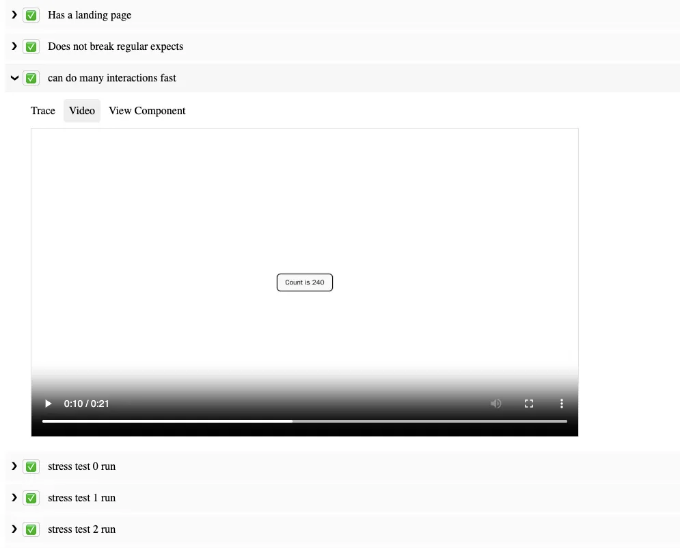

안녕하세요, 이 게시물에서는 웹 기반 사용자 인터페이스 (UI) 애플리케이션을 위한 종단 간 (End-To-End, E2E) 테스트에 대한 새로운 시각을 제공하는 혁신적인 라이브러리인 SafeTest를 소개하게 되어 기쁩니다.

# 전통적인 UI 테스트의 어려움

기존에 UI 테스트는 단위 테스트 또는 통합 테스트(종단 간, E2E 테스트로도 불림) 중 하나를 통해 수행되어 왔습니다. 그러나 각각의 방법은 고유한 Trade-off를 제시합니다: 테스트 픽스처와 설정을 제어하거나 테스트 드라이버를 제어하는 사이에서 선택해야 합니다.

<!-- ui-log 수평형 -->
<ins class="adsbygoogle"
  style="display:block"
  data-ad-client="ca-pub-4877378276818686"
  data-ad-slot="9743150776"
  data-ad-format="auto"
  data-full-width-responsive="true"></ins>
<component is="script">
(adsbygoogle = window.adsbygoogle || []).push({});
</component>

예를 들어, react-testing-library를 사용하는 경우, 단위 테스트 솔루션으로 완전한 컨트롤을 유지하여 렌더링할 대상 및 기본 서비스 및 가져온 항목들이 어떻게 동작해야 하는지 제어할 수 있습니다. 그러나 실제 페이지와 상호 작용하는 능력을 잃을 수 있어 다양한 어려움을 겪을 수 있습니다:

- "Dropdown/" 컴포넌트와 같이 복잡한 UI 요소와 상호 작용하기 어려움.
- CORS 설정이나 GraphQL 호출을 테스트할 수 없음.
- 버튼의 클릭 가능성에 영향을 미치는 z-index 문제에 대한 시각적 표시 부족.
- 테스트의 복잡하고 직관적이지 않은 작성 및 디버깅.

반면에 Cypress나 Playwright와 같은 통합 테스트 도구를 사용하면 페이지에 대한 제어는 가능하지만 앱의 부트스트래핑 코드를 조작할 수 있는 능력을 희생해야 합니다. 이러한 도구들은 브라우저를 원격으로 제어하여 URL을 방문하고 페이지와 상호 작용하는 방식으로 작동합니다. 이 방법에는 다음과 같은 도전 과제가 있습니다:

- 사용자 정의 네트워크 레이어 API 재작성 규칙을 구현하지 않고 대체 API 엔드포인트에 호출할 때 어려움.
- 감시자/가짜에 단언을 만들거나 앱 내 코드를 실행할 수 없음.
- 다크 모드와 같은 것을 테스트하는 것이 클릭 스위처를 클릭하거나 localStorage 메커니즘을 재정의하는 방법을 알지 않으면 어려움.
- 예를 들어 특정 버튼을 클릭하고 60초 타이머를 카운트다운하기를 기다려야만 표시되는 컴포넌트와 같은 앱 세그먼트를 테스트할 수 없음.

<!-- ui-log 수평형 -->
<ins class="adsbygoogle"
  style="display:block"
  data-ad-client="ca-pub-4877378276818686"
  data-ad-slot="9743150776"
  data-ad-format="auto"
  data-full-width-responsive="true"></ins>
<component is="script">
(adsbygoogle = window.adsbygoogle || []).push({});
</component>

위기를 인식하면서 Cypress와 Playwright에서 제공하는 E2E 컴포넌트 테스팅과 같은 해결책들이 등장했습니다. 이 도구들은 기존의 통합 테스트 방법의 단점을 해결하려고 노력하지만, 그들만의 아키텍처로 인해 다른 제약 사항이 있습니다. 컴포넌트를 로드하거나 설정 코드를 불러오기 위해 부트스트래핑 코드로 개발 서버를 시작하는데, 이로 인해 OAuth나 복잡한 빌드 파이프라인을 가진 기업 애플리케이션을 처리하는 능력이 제한될 수 있습니다. 게다가 TypeScript 사용법을 업데이트하면 Cypress/Playwright 팀이 러너를 업데이트할 때까지 테스트가 망가질 수도 있습니다.

# SafeTest에 오신 것을 환영합니다

SafeTest는 UI 테스트에 혁신적인 접근 방식을 통해 이러한 문제를 해결하고자 합니다. 주요 아이디어는 우리 애플리케이션 부트스트래핑 단계에 코드 스니펫을 넣어 테스트를 실행할 후크를 주입하는 것입니다 (이 동작이 어떤 역할을 하는지에 대한 자세한 내용은 Safetest 작동 방법 섹션을 참조하세요). 이 접근 방식이 어떻게 작동하는지에 대한 부분은 SafeTest가 테스트를 실행할 때에만 테스트를 동적으로 불러오기 위해 레이지 로딩을 활용하므로 앱을 일반적으로 사용하는 데 어떠한 측정 가능한 영향도 없다는 점을 유의하십시오 (README 예제에서 테스트는 제품 번들에 전혀 포함되어 있지 않습니다). 이것이 준비되면 Playwright를 사용하여 정기적인 테스트를 실행하여 테스트에 대해 원하는 이상적인 브라우저 컨트롤을 얻을 수 있습니다.

이 접근 방식은 몇 가지 흥미로운 기능도 잠재적으로 제공합니다:

<!-- ui-log 수평형 -->
<ins class="adsbygoogle"
  style="display:block"
  data-ad-client="ca-pub-4877378276818686"
  data-ad-slot="9743150776"
  data-ad-format="auto"
  data-full-width-responsive="true"></ins>
<component is="script">
(adsbygoogle = window.adsbygoogle || []).push({});
</component>

- 노드 테스트 서버를 실행할 필요 없이 특정 테스트로의 딥 링킹 가능합니다.
- 브라우저와 테스트(node) 컨텍스트 간 양방향 통신이 가능합니다.
- Playwright에서 제공하는 모든 DX 기능에 액세스할 수 있습니다 ( @playwright/test에 딸려오는 기능 제외).
- 테스트 비디오 녹화, 트레이스 보기, 다양한 페이지 선택기/액션을 시도하기 위한 일시 중지 기능이 제공됩니다.
- 브라우저 내의 스파이에 대한 어설션을 생성하고, 노드에서 브라우저 내부 호출의 스냅샷을 매치할 수 있습니다.

# SafeTest으로 테스트를 작성하는 예제

SafeTest는 UI 테스트를 진행해 본 경험이 있는 모두에게 친숙하게 느껴지도록 설계되었으며, 기존 솔루션의 최상의 부분을 최대한 활용합니다. 다음은 전체 애플리케이션을 테스트하는 방법의 예시입니다:

```js
import { describe, it, expect } from 'safetest/jest';
import { render } from 'safetest/react';

describe('my app', () => {
  it('메인 페이지를 로드합니다', async () => {
    const { page } = await render();

    await expect(page.getByText('앱에 오신 것을 환영합니다')).toBeVisible();
    expect(await page.screenshot()).toMatchImageSnapshot();
  });
});
```

<!-- ui-log 수평형 -->
<ins class="adsbygoogle"
  style="display:block"
  data-ad-client="ca-pub-4877378276818686"
  data-ad-slot="9743150776"
  data-ad-format="auto"
  data-full-width-responsive="true"></ins>
<component is="script">
(adsbygoogle = window.adsbygoogle || []).push({});
</component>

우리는 특정 컴포넌트를 쉽게 테스트할 수 있습니다.

```js
import { describe, it, expect, browserMock } from 'safetest/jest';
import { render } from 'safetest/react';

describe('Header component', () => {
  it('일반 모드가 있습니다', async () => {
    const { page } = await render(<Header />);

    await expect(page.getByText('Admin')).not.toBeVisible();
   });

  it('관리자 모드가 있습니다', async () => {
    const { page } = await render(<Header admin={true} />);

    await expect(page.getByText('Admin')).toBeVisible();
  });

  it('로그아웃을 할 때 로그아웃 핸들러를 호출합니다', async () => {
    const spy = browserMock.fn();
    const { page } = await render(<Header handleLogout={spy} />);

    await page.getByText('logout').click();
    expect(await spy).toHaveBeenCalledWith();
  });
});
```

## Override 활용

SafeTest는 테스트 중에 값 오버라이드를 허용하기 위해 React Context를 활용합니다. 이 작업이 어떻게 이루어지는지 알아보기 위해, 컴포넌트에서 사용되는 fetchPeople 함수가 있다고 가정해 봅시다.

<!-- ui-log 수평형 -->
<ins class="adsbygoogle"
  style="display:block"
  data-ad-client="ca-pub-4877378276818686"
  data-ad-slot="9743150776"
  data-ad-format="auto"
  data-full-width-responsive="true"></ins>
<component is="script">
(adsbygoogle = window.adsbygoogle || []).push({});
</component>

```js
 import { fetchPerson } from './api/person';
+import { createOverride } from 'safetest/react';

+const FetchPerson = createOverride(fetchPerson);

 export const People: React.FC = () => {
+  const fetchPeople = FetchPerson.useValue();
   const { data: people, loading, error } = useAsync(fetchPeople);
  
   if (loading) return <Loader />;
   if (error) return <ErrorPage error={error} />;
   return <Table data={data} rows=[...] />;
 }
```

우리는 지금 이 호출에 대한 응답을 덮어쓸 수 있는 테스트를 할 수 있습니다:```

<!-- ui-log 수평형 -->
<ins class="adsbygoogle"
  style="display:block"
  data-ad-client="ca-pub-4877378276818686"
  data-ad-slot="9743150776"
  data-ad-format="auto"
  data-full-width-responsive="true"></ins>
<component is="script">
(adsbygoogle = window.adsbygoogle || []).push({});
</component>

```js
const pending = new Promise(r => { /* 아무것도 안 함 */ });
const resolved = [{name: 'Foo', age: 23], {name: 'Bar', age: 32]}];
const error = new Error('이런');

describe('People', () => {
  it('로딩 상태를 가지고 있습니다', async () => {
    const { page } = await render(
      <FetchPerson.Override with={() => () => pending}>
        <People />
      </FetchPerson.Override>
    );

    await expect(page.getByText('로딩')).toBeVisible();
  });

  it('로드된 상태를 가지고 있습니다', async () => {
    const { page } = await render(
      <FetchPerson.Override with={() => async () => resolved}>
        <People />
      </FetchPerson.Override>
    );

    await expect(page.getByText('User: Foo, name: 23')).toBeVisible();
  });

  it('오류 상태를 가지고 있습니다', async () => {
    const { page } = await render(
      <FetchPerson.Override with={() => async () => { throw error }>
        <People />
      </FetchPerson.Override>
    );

    await expect(page.getByText('사용자 가져오기 오류: "이런"')).toBeVisible();
  });
});
```

render 함수는 초기 앱 컴포넌트가 전달되는 함수도 허용하여 앱 어디에서든 필요한 요소를 삽입할 수 있습니다:

```js
it('사용자가 로드된 상태를 가지고 있습니다', async () => {
  const { page } = await render(app =>
    <FetchPerson.Override with={() => async () => resolved}>
      {app}
    </FetchPerson.Override>
  );
   await expect(page.getByText('User: Foo, name: 23')).toBeVisible();
});
```

오버라이드로 /foo, /bar 및 /baz에서 API 요청을 결합하는 서비스 메서드가 올바른 재시도 메커니즘을 가지고 있고 실패한 API 요청에 대해서만 올바르게 반환 값을 매핑하는 등 복잡한 테스트 케이스를 작성할 수 있습니다. 따라서 /bar이 3번 시도해서 해결될 경우 이 방법은 총 5개의 API 호출을 수행할 것입니다.

<!-- ui-log 수평형 -->
<ins class="adsbygoogle"
  style="display:block"
  data-ad-client="ca-pub-4877378276818686"
  data-ad-slot="9743150776"
  data-ad-format="auto"
  data-full-width-responsive="true"></ins>
<component is="script">
(adsbygoogle = window.adsbygoogle || []).push({});
</component>

Overrides는 API 호출에만 국한되지 않습니다 (페이지.route도 사용할 수 있기 때문에), 기능 플래그나 일부 정적 값 변경과 같은 특정 앱 레벨 값도 재정의할 수 있습니다:

```js
+const UseFlags = createOverride(useFlags);
 export const Admin = () => {
+  const useFlags = UseFlags.useValue();
   const { isAdmin } = useFlags();
   if (!isAdmin) return <div>권한 오류</div>;
   // ...
 }

+const Language = createOverride(navigator.language);
 export const LanguageChanger = () => {
-  const language = navigator.language;
+  const language = Language.useValue();
   return <div>현재 언어는 { language } 입니다</div>;
 }

 describe('Admin', () => {
   it('관리자 플래그로 작동', async () => {
     const { page } = await render(
       <UseIsAdmin.Override with={oldHook => {
         const oldFlags = oldHook();
         return { ...oldFlags, isAdmin: true };
       }>
         <MyComponent />
       </UseIsAdmin.Override>
     );

     await expect(page.getByText('권한 오류')).not.toBeVisible();
   });
 });

 describe('Language', () => {
   it('표시됨', async () => {
     const { page } = await render(
       <Language.Override with={old => 'abc'}>
         <MyComponent />
       </Language.Override>
     );

     await expect(page.getByText('현재 언어는 abc 입니다')).toBeVisible();
   });
 });
```

Overrides는 SafeTest의 강력한 기능이며, 여기서 소개된 예시들은 겉핥기에 불과합니다. 자세한 정보와 예시는 README의 Overrides 섹션을 참조해주세요.

# 보고서

<!-- ui-log 수평형 -->
<ins class="adsbygoogle"
  style="display:block"
  data-ad-client="ca-pub-4877378276818686"
  data-ad-slot="9743150776"
  data-ad-format="auto"
  data-full-width-responsive="true"></ins>
<component is="script">
(adsbygoogle = window.adsbygoogle || []).push({});
</component>

SafeTest은 강력한 보고 기능을 기본으로 제공하여, 자동으로 비디오 다시 보기 링킹, Playwright 추적 뷰어, 그리고 테스트된 구성 요소로 직접 딥 링크까지 가능합니다. SafeTest 리포 README에는 모든 예제 앱과 보고서가 링크되어 있습니다.



# 기업 환경에서의 SafeTest

많은 대기업은 앱을 사용하기 위한 인증 형태가 필요합니다. 일반적으로 localhost:3000으로 이동하면 영원히로딩 페이지만 표시됩니다. localhost:8000과 같은 다른 포트로 이동하여 프록시 서버가 있는 곳으로 이동해야 하며, 이곳에서는 기본 서비스 호출에 인증 자격 증명을 확인하거나 삽입합니다. 이 제한은 Netflix에서 Cypress/Playwright 구성 요소 테스트를 사용할 수 없는 주요 이유 중 하나입니다.

<!-- ui-log 수평형 -->
<ins class="adsbygoogle"
  style="display:block"
  data-ad-client="ca-pub-4877378276818686"
  data-ad-slot="9743150776"
  data-ad-format="auto"
  data-full-width-responsive="true"></ins>
<component is="script">
(adsbygoogle = window.adsbygoogle || []).push({});
</component>

그러나 일반적으로 응용 프로그램과 상호 작용하기 위해 사용할 수있는 테스트 사용자를 생성하는 서비스가 있습니다. 이는 SafeTest 주변에 가벼운 래퍼를 생성하여 테스트 사용자를 자동으로 생성하고 가정하는 데 도움이 됩니다. 예를 들어, Netflix에서는 기본적으로 다음과 같이 수행합니다:

```js
import { setup } from 'safetest/setup';
import { createTestUser, addCookies } from 'netflix-test-helper';

type Setup = Parameters<typeof setup>[0] & {
  extraUserOptions?: UserOptions;
};

export const setupNetflix = (options: Setup) => {
  setup({
    ...options,
    hooks: { beforeNavigate: [async page => addCookies(page)] },
  });

  beforeAll(async () => {
    createTestUser(options.extraUserOptions)
  });
};
```

이 설정을 완료한 후, 우리는 safetest/setup 대신에 위의 패키지를 가져와 사용합니다.

# React 이상

<!-- ui-log 수평형 -->
<ins class="adsbygoogle"
  style="display:block"
  data-ad-client="ca-pub-4877378276818686"
  data-ad-slot="9743150776"
  data-ad-format="auto"
  data-full-width-responsive="true"></ins>
<component is="script">
(adsbygoogle = window.adsbygoogle || []).push({});
</component>

이 게시물은 SafeTest가 React와 어떻게 작동하는지에 중점을 두었지만, 오직 React에만 제한되지는 않습니다. SafeTest는 Vue, Svelte, Angular과 함께 작동하며 때로는 NextJS나 Gatsby에서도 실행할 수 있습니다. 또한 사용 중인 테스트 러너에 따라 Jest 또는 Vitest를 사용하여 실행할 수 있습니다. 예제 폴더는 다양한 도구 조합으로 SafeTest를 사용하는 방법을 보여주며, 더 많은 사례를 추가하는 기여를 권장합니다.

SafeTest는 테스트 러너, UI 라이브러리 및 브라우저 러너를 위한 지능적인 접착제입니다. Netflix에서 가장 일반적으로 사용되는 방식은 Jest/React/Playwright를 사용하는 것이지만, 다른 옵션에 대한 어댑터를 더 추가하는 것도 쉽습니다.

# 결론

SafeTest는 Netflix 내에서 채택되고 있는 강력한 테스트 프레임워크입니다. 테스트 작성을 쉽게하고 어떤 실패가 언제 발생했는지에 대한 포괄적인 보고서를 제공하며, 재생 비디오를 보거나 테스트 단계를 수동으로 실행하여 무엇이 실패했는지 확인할 수 있는 링크가 포함되어 있습니다. UI 테스트를 혁신시킬 방법을 기대하며 귀하의 피드백과 기여를 기다리고 있습니다.