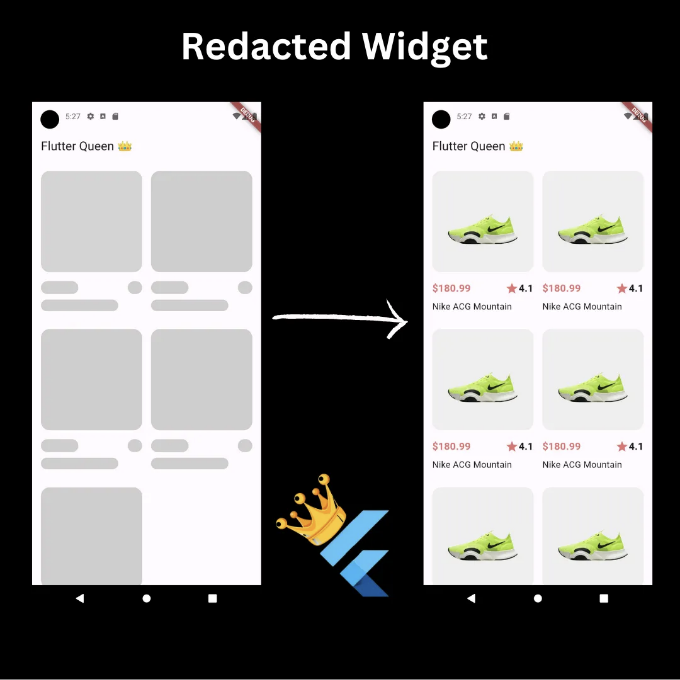
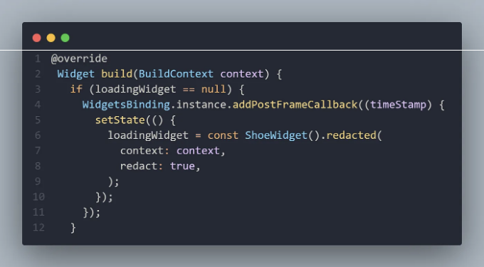
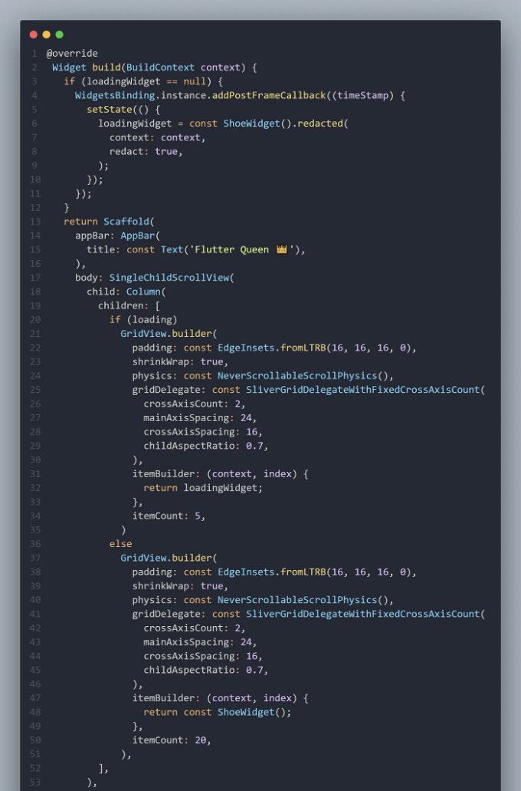

당신의 위젯으로 부터 자동으로 로딩 위젯을 생성하는 위젯.

플러터 앱에서 콘텐츠가 로딩될 때 지루한 로딩 화면을 바라보는 것에 지쳤나요? Redacted 위젯을 만나보세요 - 로딩 화면을 화사하게 바꿔주고 사용자를 계속해서 이끌어주는 새로운 친구! API에서 데이터를 가져오거나 이미지를 로드하는 경우, Redacted 위젯은 반짝이는 효과로 대기 게임에 우아함과 흥미를 더해줍니다.

  

# Redacted Widget

<!-- ui-log 수평형 -->
<ins class="adsbygoogle"
  style="display:block"
  data-ad-client="ca-pub-4877378276818686"
  data-ad-slot="9743150776"
  data-ad-format="auto"
  data-full-width-responsive="true"></ins>
<component is="script">
(adsbygoogle = window.adsbygoogle || []).push({});
</component>

플러터 앱에 Redacted 위젯을 통합하는 것은 매우 간단해요! 프로젝트에 패키지를 가져와서 사용하면 됩니다. Redacted 위젯으로 로딩 콘텐츠를 감싸면 나머지는 그 위젯이 알아서 처리해 줍니다. 이 위젯은 레이아웃과 디자인을 유지하면서 보다 정교한 플레이스홀더를 제공해줍니다.

```dart
import 'package:redacted_example/src/redacted_widget.dart';

// 로딩 콘텐츠를 Redacted 위젯으로 감싸보세요
const loadingWidget = ShoeWidget().redacted(
  context: context,
  redact: true,
);
```




<!-- ui-log 수평형 -->
<ins class="adsbygoogle"
  style="display:block"
  data-ad-client="ca-pub-4877378276818686"
  data-ad-slot="9743150776"
  data-ad-format="auto"
  data-full-width-responsive="true"></ins>
<component is="script">
(adsbygoogle = window.adsbygoogle || []).push({});
</component>

# 레드액트 위젯 사용의 장점

# 1. 매력적인 사용자 경험

- 사용자들을 재미있게 끌어들이고, 시각적으로 매력적인 자리표시자로 로딩 기간 동안 사용자들의 관심을 유지합니다.
- 로딩 및 로드된 콘텐츠 간의 원활한 전환을 제공하여 사용자 관심을 유지하고 이탈율을 줄입니다.

# 2. 사용자 정의 가능한 디자인

<!-- ui-log 수평형 -->
<ins class="adsbygoogle"
  style="display:block"
  data-ad-client="ca-pub-4877378276818686"
  data-ad-slot="9743150776"
  data-ad-format="auto"
  data-full-width-responsive="true"></ins>
<component is="script">
(adsbygoogle = window.adsbygoogle || []).push({});
</component>

- 앱의 브랜딩과 스타일에 맞춰 플레이스홀더의 모양을 맞춤 설정하세요.
- 어플리케이션의 분위기에 맞게 플레이스홀더 지속 시간, 애니메이션, 모양을 쉽게 조정하세요.

### 3. 빠른 속도 인식

- 최종 콘텐츠와 유사한 플레이스홀더를 제공하여 더 빨라 보이는 로딩 시간을 만드세요.
- 앱의 성능과 반응성에 대한 사용자 인식을 향상시키세요.

### 4. 쉬운 통합

<!-- ui-log 수평형 -->
<ins class="adsbygoogle"
  style="display:block"
  data-ad-client="ca-pub-4877378276818686"
  data-ad-slot="9743150776"
  data-ad-format="auto"
  data-full-width-responsive="true"></ins>
<component is="script">
(adsbygoogle = window.adsbygoogle || []).push({});
</component>

- 기존의 Flutter 프로젝트에 Redacted 위젯을 방대한 수정 없이 통합하세요.
- 텍스트부터 이미지, 콘텐츠의 전체 섹션까지 앱의 다양한 구성요소에 이 위젯을 활용하세요.

```dart
class ShoeWidget extends StatelessWidget {
  const ShoeWidget({Key key}) : super(key: key);

  @override
  Widget build(BuildContext context) {
    return Column(
      crossAxisAlignment: CrossAxisAlignment.start,
      children: [
        AspectRatio(
          aspectRatio: 1,
          child: Container(
            width: double.infinity,
            decoration: BoxDecoration(
              borderRadius: BorderRadius.circular(16),
              color: Colors.grey.shade200,
            ),
            child: Image.asset("assets/shoe.png"),
          ),
        ),
        const SizedBox(
          height: 16,
        ),
        Row(
          children: [
            Text(
              "\$180.99",
              style: TextStyle(
                fontWeight: FontWeight.w600,
                fontSize: 18,
                color: Colors.red.shade300,
              ),
            ),
            const Spacer(),
            Icon(
              Icons.star,
              color: Colors.red.shade300,
            ),
            const Text(
              "4.1",
              style: TextStyle(
                fontWeight: FontWeight.w700,
                fontSize: 18,
              ),
            )
          ],
        ),
        const SizedBox(
          height: 8,
        ),
        const Text(
          "Nike ACG Mountain",
          style: TextStyle(
            fontSize: 16,
          ),
        ),
      ],
    );
  }
}
```



이 정보가 유용했기를 바랍니다. 읽어주셔서 감사합니다. 피드백과 제안을 언제든 환영합니다.

<!-- ui-log 수평형 -->
<ins class="adsbygoogle"
  style="display:block"
  data-ad-client="ca-pub-4877378276818686"
  data-ad-slot="9743150776"
  data-ad-format="auto"
  data-full-width-responsive="true"></ins>
<component is="script">
(adsbygoogle = window.adsbygoogle || []).push({});
</component>
