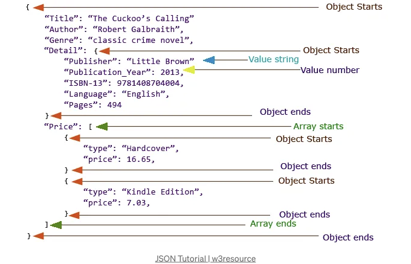

네, 맞습니다! 웹 개발에서 데이터 교환을 위한 보편적인 형식인 JSON이 여러분의 애플리케이션을 느리게 만들 수도 있습니다. 속도와 응답성이 중요한 세상에서는 JSON의 성능 문제를 면밀히 조사하는 것이 중요합니다. 우리가 당연시 여기는 기술인 JSON이 여러분의 애플리케이션에서 병목 현상을 일으킬 수 있다는 이유를 자세히 살펴보고, 애플리케이션의 최적화 기술과 빠른 대안을 탐색하여 여러분의 앱을 최상의 상태로 유지하는 방법을 알아보겠습니다.

# JSON이 무엇이며 왜 신경 써야 할까요?



<!-- ui-log 수평형 -->
<ins class="adsbygoogle"
  style="display:block"
  data-ad-client="ca-pub-4877378276818686"
  data-ad-slot="9743150776"
  data-ad-format="auto"
  data-full-width-responsive="true"></ins>
<component is="script">
(adsbygoogle = window.adsbygoogle || []).push({});
</component>

JSON은 JavaScript Object Notation의 줄임말로, 웹 응용 프로그램에서 데이터를 전송하고 저장하는 데 사용되는 가벼운 데이터 교환 형식입니다. 그 간단함과 인간이 읽을 수 있는 형식 덕분에 사람들과 기계 모두가 쉽게 작업할 수 있습니다. 하지만 웹 개발 프로젝트에서 JSON에 대해 왜 관심을 가져야 할까요?

JSON은 애플리케이션의 데이터를 함께 유지하는 접착제 역할을 합니다. 서버와 클라이언트 간에 데이터가 통신하는 언어이자, 데이터가 데이터베이스와 설정 파일에 저장되는 형식이기도 합니다. 핵심적으로 JSON은 현대 웹 개발에서 중요한 역할을 합니다.

JSON과 그 세부사항을 이해하는 것은 모든 웹 개발자에게 필수적인 기술일 뿐만 아니라 애플리케이션을 최적화하는 데 중요합니다. 이 블로그를 통해 JSON이 성능과 관련하여 양날의 검에 될 수 있는 이유와 이 지식이 개발 여정에서 어떤 중요한 차이를 만들어낼 수 있는지 깊이 탐구해보겠습니다.

# JSON의 인기와 사람들이 그것을 사용하는 이유...

<!-- ui-log 수평형 -->
<ins class="adsbygoogle"
  style="display:block"
  data-ad-client="ca-pub-4877378276818686"
  data-ad-slot="9743150776"
  data-ad-format="auto"
  data-full-width-responsive="true"></ins>
<component is="script">
(adsbygoogle = window.adsbygoogle || []).push({});
</component>

JSON의 인기는 웹 개발 세계에서 지나치게 강조할 수 없습니다. JSON은 몇 가지 실질적인 이유로 데이터 교환의 표준으로 나타났습니다:

- 사람이 읽기 쉬운 형식: JSON은 개발자와 비개발자 모두가 읽고 이해하기 쉬운 직관적인 텍스트 기반 구조를 사용합니다. 이 사람이 읽을 수 있는 형식은 협업을 개선하고 디버깅을 단순화합니다.
- 언어에 중립적: JSON은 특정 프로그래밍 언어에 종속되지 않습니다. 모든 최신 프로그래밍 언어에서 파싱 및 생성할 수 있는 범용 데이터 형식으로, 매우 호환성이 높습니다.
- 데이터 구조 일관성: JSON은 키-값 쌍, 배열 및 중첩된 객체를 사용하여 데이터에 일관된 구조를 부여합니다. 이 일관성은 다양한 프로그래밍 시나리오에서 예측 가능하고 작업이 쉽게 만듭니다.
- 브라우저 지원: JSON은 웹 브라우저에서 네이티브로 지원되므로, 웹 애플리케이션이 서버와 원활하게 통신할 수 있습니다. 이러한 네이티브 지원은 JSON이 웹 개발에서 채택되는 데 상당한 역할을 하였습니다.
- JSON API: 많은 웹 서비스와 API에서 JSON 형식으로 데이터를 기본으로 제공합니다. 이는 JSON이 웹 개발에서 데이터 교환의 선택지로 확립되어 왔음을 더욱 강조합니다.
- JSON 스키마: 개발자는 JSON 스키마를 사용하여 JSON 데이터의 구조를 정의하고 유효성을 검증할 수 있으며, 응용 프로그램에 추가적인 명확성과 신뢰성을 더할 수 있습니다.

이러한 장점들로 인해 전 세계의 개발자들이 JSON을 데이터 교환에 필수적으로 사용하는 것은 더 이상 의아하지 않습니다. 그러나 이 블로그에서 더 깊이 탐구함에 따라 JSON과 관련된 잠재적인 성능 도전 과제 및 효과적인 대응 방법을 알아볼 것입니다.

# 속도의 필요성

<!-- ui-log 수평형 -->
<ins class="adsbygoogle"
  style="display:block"
  data-ad-client="ca-pub-4877378276818686"
  data-ad-slot="9743150776"
  data-ad-format="auto"
  data-full-width-responsive="true"></ins>
<component is="script">
(adsbygoogle = window.adsbygoogle || []).push({});
</component>

## 애플리케이션 속도와 반응성의 중요성

현재 빠르게 변화하는 디지털 환경에서는 애플리케이션의 속도와 반응성이 양보할 수 없습니다. 사용자들은 정보에 즉시 액세스하고 빠른 상호작용 및 웹 및 모바일 애플리케이션 전반에 걸쳐 원활한 경험을 기대합니다. 속도에 대한 이러한 요구는 여러 가지 요인에 의해 촉발됩니다:

- 사용자 기대: 사용자들은 디지턈 상호작용으로부터 순식간의 응답에 익숙해졌습니다. 웹 페이지가 로드되기를 기다리거나 애플리케이션이 반응하기를 원하지 않습니다. 몇 초의 지연도 답답함과 포기로 이어질 수 있습니다.
- 경쟁 우위: 속도는 상당한 경쟁 우위가 될 수 있습니다. 빠르게 응답하는 애플리케이션은 일반적으로 느린 대안보다 사용자를 보다 효과적으로 유치하고 유지합니다.
- 검색 엔진 순위: Google과 같은 검색 엔진은 페이지 속도를 순위 요소로 고려합니다. 빠르게 로드되는 웹사이트는 검색 결과에서 더 높은 순위를 차지할 가능성이 높아져 노출 및 트래픽이 증가합니다.
- 전환율: 특히 전자 상거래 웹사이트들은 속도가 전환율에 미치는 영향을 예민하게 인지하고 있습니다. 더 빠른 웹사이트는 더 높은 전환율을 유도하고 결과적으로 수익을 증가시킵니다.
- 모바일 성능: 모바일 기기의 보급화로 인해 속도에 대한 필요성이 더욱 중요해졌습니다. 모바일 사용자들은 종종 대역폭과 처리 능력이 제한되어 빠른 앱 성능이 필수적입니다.

## JSON이 우리 애플리케이션을 느리게 만드는 걸까요?

<!-- ui-log 수평형 -->
<ins class="adsbygoogle"
  style="display:block"
  data-ad-client="ca-pub-4877378276818686"
  data-ad-slot="9743150776"
  data-ad-format="auto"
  data-full-width-responsive="true"></ins>
<component is="script">
(adsbygoogle = window.adsbygoogle || []).push({});
</component>

이제 중심 질문에 대해 이야기해 봅시다: JSON이 우리 애플리케이션을 느리게 만들까요?

앞에서 언급했듯이 JSON은 매우 인기 있는 데이터 교환 형식입니다. 유연하고 사용하기 쉽며 널리 지원됩니다. 그러나 이보다 많은 채택으로 인해 성능에 도전을 받지 않는 것은 아닙니다.

일부 상황에서 JSON은 애플리케이션을 느리게 만드는 주범이 될 수 있습니다. 특히 크거나 복잡한 구조를 처리할 때 JSON 데이터를 구문 분석하는 과정은 소중한 밀리초를 소모할 수 있습니다. 게다가 비효율적인 직렬화 및 역직렬화는 애플리케이션 전체 성능에 영향을 줄 수 있습니다.

다음 섹션에서는 JSON이 애플리케이션에서 병목 현상이 될 수 있는 구체적인 이유를 탐구하고, 더 중요한 것은 이러한 문제를 완화하는 방법을 탐색해 보겠습니다. 앞으로 진행함에 따라 JSON을 비하하는 것이 아니라 그 한계를 이해하고 더 빠르고 반응이 빠른 애플리케이션을 위해 성능 최적화 전략을 발견하는 것이 목표라는 것을 기억해 주세요.

<!-- ui-log 수평형 -->
<ins class="adsbygoogle"
  style="display:block"
  data-ad-client="ca-pub-4877378276818686"
  data-ad-slot="9743150776"
  data-ad-format="auto"
  data-full-width-responsive="true"></ins>
<component is="script">
(adsbygoogle = window.adsbygoogle || []).push({});
</component>


# JSON이 느릴 수 있는 이유

JSON은 널리 사용되고 있지만 성능적인 문제에 면역이 아니다. JSON의 잠재적인 속도 저하 원인을 알아보고 데이터 교환에 최상의 선택이 아닐 수 있는 이유를 이해해 봅시다.

## 1. 구문 분석 오버헤드

<!-- ui-log 수평형 -->
<ins class="adsbygoogle"
  style="display:block"
  data-ad-client="ca-pub-4877378276818686"
  data-ad-slot="9743150776"
  data-ad-format="auto"
  data-full-width-responsive="true"></ins>
<component is="script">
(adsbygoogle = window.adsbygoogle || []).push({});
</component>

JSON 데이터가 응용 프로그램에 도착하면, 유용한 데이터 구조로 변환하기 위해 구문 분석 과정을 거쳐야 합니다. 구문 분석은 광범위하거나 깊게 중첩된 JSON 데이터를 처리할 때 특히 느릴 수 있습니다.

## 2. 직렬화와 역직렬화

JSON은 클라이언트에서 서버로 전송될 때 데이터를 직렬화(객체를 문자열로 인코딩)하고, 수신할 때는 역직렬화(문자열을 다시 유용한 객체로 변환)해야 합니다. 이러한 단계는 응용 프로그램 전체의 성능에 영향을 줄 수 있는 오버헤드를 도입할 수 있습니다.

마이크로서비스 아키텍처의 세계에서는 JSON이 서비스 간 메시지를 전달하는 데 자주 사용됩니다. 그러나 JSON 메시지가 직렬화와 역직렬화를 필요로 한다는 점을 인식하는 것이 중요합니다. 이러한 작업은 상당한 오버헤드를 도입할 수 있습니다.

<!-- ui-log 수평형 -->
<ins class="adsbygoogle"
  style="display:block"
  data-ad-client="ca-pub-4877378276818686"
  data-ad-slot="9743150776"
  data-ad-format="auto"
  data-full-width-responsive="true"></ins>
<component is="script">
(adsbygoogle = window.adsbygoogle || []).push({});
</component>


## 3. 문자열 조작

JSON은 텍스트 기반이며 연결 및 구문 분석과 같은 작업에 대해 문자열 조작을 많이 사용합니다. 문자열 처리는 바이너리 데이터 작업과 비교했을 때 느릴 수 있습니다.

## 4. 데이터 유형의 부족

<!-- ui-log 수평형 -->
<ins class="adsbygoogle"
  style="display:block"
  data-ad-client="ca-pub-4877378276818686"
  data-ad-slot="9743150776"
  data-ad-format="auto"
  data-full-width-responsive="true"></ins>
<component is="script">
(adsbygoogle = window.adsbygoogle || []).push({});
</component>

JSON은 한정된 데이터 유형 세트(예: 문자열, 숫자, 부울)을 갖고 있습니다. 복잡한 데이터 구조는 효율적이지 않은 표현이 필요할 수 있어서, 메모리 사용량이 증가하고 처리 속도가 느려질 수 있습니다.


## 5. 장황성

JSON의 인간이 읽기 쉬운 디자인은 장황성으로 이어질 수 있습니다. 중복된 키와 반복적인 구조는 페이로드 크기를 증가시켜 더 긴 데이터 전송 시간을 야기할 수 있습니다.

<!-- ui-log 수평형 -->
<ins class="adsbygoogle"
  style="display:block"
  data-ad-client="ca-pub-4877378276818686"
  data-ad-slot="9743150776"
  data-ad-format="auto"
  data-full-width-responsive="true"></ins>
<component is="script">
(adsbygoogle = window.adsbygoogle || []).push({});
</component>

## 6. 이진 데이터 지원 없음

JSON은 이진 데이터에 대한 네이티브 지원이 없습니다. 이진 데이터를 처리할 때 개발자들은 종종 텍스트로 변환하고 변환해야 하는데, 이는 효율성이 떨어질 수 있습니다.

## 7. 깊은 중첩

어떤 상황에서는 JSON 데이터가 깊게 중첩될 수 있어 재귀적으로 구문 분석하고 탐색해야 할 수도 있습니다. 이 계산 복잡성은 최적화되지 않은 경우에는 애플리케이션의 성능을 저하시킬 수 있습니다.

<!-- ui-log 수평형 -->
<ins class="adsbygoogle"
  style="display:block"
  data-ad-client="ca-pub-4877378276818686"
  data-ad-slot="9743150776"
  data-ad-format="auto"
  data-full-width-responsive="true"></ins>
<component is="script">
(adsbygoogle = window.adsbygoogle || []).push({});
</component>

# JSON 대안

JSON은 다목적 데이터 교환 형식이지만 특정 시나리오에서의 성능 제한으로 인해 빠른 대안들이 탐색되었습니다. 이제 이러한 대안들 중 몇 가지를 살펴보고 언제 그리고 왜 선택해야 하는지 알아봅시다:

## 1. Protocol Buffers (protobuf)

Protocol Buffers, 일반적으로 protobuf로 불리는 것은 구글이 개발한 이진 직렬화 형식입니다. protobuf는 효율성, 소형성 및 속도를 고려하여 설계되었습니다. protobuf의 이진 형태는 직렬화 및 역직렬화에 있어서 JSON보다 훨씬 빠릅니다.

<!-- ui-log 수평형 -->
<ins class="adsbygoogle"
  style="display:block"
  data-ad-client="ca-pub-4877378276818686"
  data-ad-slot="9743150776"
  data-ad-format="auto"
  data-full-width-responsive="true"></ins>
<component is="script">
(adsbygoogle = window.adsbygoogle || []).push({});
</component>

- 언제 선택해야 하는가: protobuf는 고성능 데이터 교환을 필요로 할 때 선택합니다. 특히, 마이크로서비스 아키텍처, IoT 애플리케이션 또는 네트워크 대역폭이 제한된 시나리오에서 유용합니다.

## 2. MessagePack

MessagePack은 빠르고 간결한 이진 직렬화 형식으로 알려져 있습니다. JSON보다 효율적이면서도 다양한 프로그래밍 언어와의 호환성을 유지하도록 설계되었습니다.

- 언제 선택해야 하는가: MessagePack은 속도와 다국어 호환성 사이의 균형이 필요할 때 좋은 선택지입니다. 실시간 애플리케이션 및 데이터 크기 축소가 중요한 상황에 적합합니다.

<!-- ui-log 수평형 -->
<ins class="adsbygoogle"
  style="display:block"
  data-ad-client="ca-pub-4877378276818686"
  data-ad-slot="9743150776"
  data-ad-format="auto"
  data-full-width-responsive="true"></ins>
<component is="script">
(adsbygoogle = window.adsbygoogle || []).push({});
</component>

## 3. BSON (Binary JSON)

BSON 또는 바이너리 JSON은 JSON에서 파생된 바이너리 인코딩 형식입니다. 이는 JSON의 유연성을 유지하면서 이진 인코딩을 통해 성능을 향상시킵니다. BSON은 MongoDB와 같은 데이터베이스에서 일반적으로 사용됩니다.

- 선택 시점: MongoDB와 작업하거나 JSON과 이진 효율성 사이의 간극을 메우는 형식이 필요한 경우, BSON은 가치 있는 옵션입니다.

## 4. Apache Avro

<!-- ui-log 수평형 -->
<ins class="adsbygoogle"
  style="display:block"
  data-ad-client="ca-pub-4877378276818686"
  data-ad-slot="9743150776"
  data-ad-format="auto"
  data-full-width-responsive="true"></ins>
<component is="script">
(adsbygoogle = window.adsbygoogle || []).push({});
</component>

아파치 Avro는 컴팩트한 이진 형식을 제공하는 데이터 직렬화 프레임워크입니다. 스키마 기반으로, 효율적인 데이터 인코딩 및 디코딩이 가능합니다.

- 선택 시기: Avro는 스키마 진화가 중요한 경우에 적합하며, 데이터 저장소와 속도와 데이터 구조 유연성 사이의 균형이 필요한 경우에 적합합니다.

JSON 대비 성능 향상의 차이를 제공하는 이 대안은 사용 사례에 따라 다릅니다. 이러한 대안을 고려함으로써 응용 프로그램의 데이터 교환 프로세스를 최적화하여 속도와 효율성이 개발 노력의 중심에 있는지 확인할 수 있습니다.


<!-- ui-log 수평형 -->
<ins class="adsbygoogle"
  style="display:block"
  data-ad-client="ca-pub-4877378276818686"
  data-ad-slot="9743150776"
  data-ad-format="auto"
  data-full-width-responsive="true"></ins>
<component is="script">
(adsbygoogle = window.adsbygoogle || []).push({});
</component>

# 모든 바이트의 중요성: 데이터 형식 최적화

데이터 교환의 세계에서 효율성과 속도가 가장 중요할 때, 데이터 형식 선택은 큰 차이를 만들 수 있습니다. 이 섹션에서는 간단한 JSON 데이터 표현에서 Protocol Buffers, MessagePack, BSON, Avro와 같은 더 효율적인 이진 형식으로의 여정을 탐구합니다. 각 형식의 미묘한 점을 탐구하고 왜 모든 바이트가 중요한지를 보여드립니다.

## 시작: JSON 데이터

우리는 간단한 JSON 데이터 구조로 여정을 시작합니다. 아래는 샘플 JSON 데이터 일부입니다:

<!-- ui-log 수평형 -->
<ins class="adsbygoogle"
  style="display:block"
  data-ad-client="ca-pub-4877378276818686"
  data-ad-slot="9743150776"
  data-ad-format="auto"
  data-full-width-responsive="true"></ins>
<component is="script">
(adsbygoogle = window.adsbygoogle || []).push({});
</component>

```json
{
  "id": 1,                                 // 14 바이트
  "name": "John Doe",                      // 20 바이트
  "email": "johndoe@example.com",          // 31 바이트
  "age": 30,                               // 9 바이트
  "isSubscribed": true,                    // 13 바이트
  "orders": [                              // 11 바이트
    {                                      // 2 바이트
      "orderId": "A123",                   // 18 바이트
      "totalAmount": 100.50                // 20 바이트
    },                                     // 1 바이트
    {                                      // 2 바이트
      "orderId": "B456",                   // 18 바이트
      "totalAmount": 75.25                 // 19 바이트
    }                                      // 1 바이트
  ]                                        // 1 바이트
}                                          // 1 바이트
```

총 JSON 크기: 약 139 바이트

JSON은 다재다능하고 작업하기 쉬운 장점이 있지만, 텍스트로 이루어져 있어서 단점이 있습니다. 각 문자, 각 공백, 그리고 모든 따옴표가 중요합니다. 데이터 크기와 전송 속도가 중요한 상황에서는 이런 사소한 문자들이 상당한 영향을 미칠 수 있습니다.

# 효율적인 저장 방식: 바이너리 포맷으로 크기 축소하기

<!-- ui-log 수평형 -->
<ins class="adsbygoogle"
  style="display:block"
  data-ad-client="ca-pub-4877378276818686"
  data-ad-slot="9743150776"
  data-ad-format="auto"
  data-full-width-responsive="true"></ins>
<component is="script">
(adsbygoogle = window.adsbygoogle || []).push({});
</component>


이제, 다른 형식의 데이터 표현을 제공하고 그 크기를 비교해 봅시다:

## 프로토콜 버퍼 (protobuf):

```js
syntax = "proto3";

message User {
  int32 id = 1;
  string name = 2;
  string email = 3;
  int32 age = 4;
  bool is_subscribed = 5;
  repeated Order orders = 6;

  message Order {
    string order_id = 1;
    float total_amount = 2;
  }
}
```

<!-- ui-log 수평형 -->
<ins class="adsbygoogle"
  style="display:block"
  data-ad-client="ca-pub-4877378276818686"
  data-ad-slot="9743150776"
  data-ad-format="auto"
  data-full-width-responsive="true"></ins>
<component is="script">
(adsbygoogle = window.adsbygoogle || []).push({});
</component>

```js
0A 0E 4A 6F 68 6E 20 44 6F 65 0C 4A 6F 68 6E 20 44 6F 65 65 78 61 6D 70 6C 65 2E 63 6F 6D 04 21 00 00 00 05 01 12 41 31 32 33 03 42 DC CC CC 3F 05 30 31 31 32 34 34 35 36 25 02 9A 99 99 3F 0D 31 02 42 34 35 36 25 02 9A 99 99 3F
```

프로토콜 버퍼 총 크기: 약 38 바이트

## MessagePack:

(참고: MessagePack은 이진 형식이며 여기 표시된 내용은 사람이 읽기에는 적합하지 않습니다.)

<!-- ui-log 수평형 -->
<ins class="adsbygoogle"
  style="display:block"
  data-ad-client="ca-pub-4877378276818686"
  data-ad-slot="9743150776"
  data-ad-format="auto"
  data-full-width-responsive="true"></ins>
<component is="script">
(adsbygoogle = window.adsbygoogle || []).push({});
</component>

이진 표현 (16 진수):

```js
a36a6964000000000a4a6f686e20446f650c6a6f686e646f65406578616d706c652e636f6d042100000005011241313302bdcccc3f0530112434353625029a99993f
```

총 MessagePack 크기: 약 34 바이트

## BSON (바이너리 JSON):

<!-- ui-log 수평형 -->
<ins class="adsbygoogle"
  style="display:block"
  data-ad-client="ca-pub-4877378276818686"
  data-ad-slot="9743150776"
  data-ad-format="auto"
  data-full-width-responsive="true"></ins>
<component is="script">
(adsbygoogle = window.adsbygoogle || []).push({});
</component>

(Binary format is a binary representation and is not readable by humans.)

이진 표현 (16진수):

```js
3e0000001069640031000a4a6f686e20446f6502656d61696c006a6f686e646f65406578616d706c652e636f6d1000000022616765001f04370e4940
```

총 BSON 크기: 약 43 바이트

<!-- ui-log 수평형 -->
<ins class="adsbygoogle"
  style="display:block"
  data-ad-client="ca-pub-4877378276818686"
  data-ad-slot="9743150776"
  data-ad-format="auto"
  data-full-width-responsive="true"></ins>
<component is="script">
(adsbygoogle = window.adsbygoogle || []).push({});
</component>

## Avro:

(참고: Avro는 스키마를 사용하여 데이터가 스키마 정보와 함께 인코딩됩니다.)

이진 표현 (16진수):

```js
0e120a4a6f686e20446f650c6a6f686e646f65406578616d706c652e636f6d049a999940040a020b4108312e3525312e323538323539
```

<!-- ui-log 수평형 -->
<ins class="adsbygoogle"
  style="display:block"
  data-ad-client="ca-pub-4877378276818686"
  data-ad-slot="9743150776"
  data-ad-format="auto"
  data-full-width-responsive="true"></ins>
<component is="script">
(adsbygoogle = window.adsbygoogle || []).push({});
</component>

전체 Avro 크기: ~32바이트


지금은 이 형식 중 일부가 바이너리를 출력하더라도 크기가 다른 이유를 궁금해 할 수 있습니다. Avro, MessagePack, BSON과 같은 바이너리 형식은 내부 구조와 인코딩 메커니즘이 다르기 때문에 동일한 데이터를 나타내더라도 바이너리 표현에 변화가 있을 수 있습니다. 이러한 차이가 발생하는 간단한 개요입니다:

## 1. Avro:

<!-- ui-log 수평형 -->
<ins class="adsbygoogle"
  style="display:block"
  data-ad-client="ca-pub-4877378276818686"
  data-ad-slot="9743150776"
  data-ad-format="auto"
  data-full-width-responsive="true"></ins>
<component is="script">
(adsbygoogle = window.adsbygoogle || []).push({});
</component>

- Avro는 데이터를 인코딩하기 위해 스키마를 사용하며, 이 스키마는 일반적으로 이진 표현에 포함됩니다.
- Avro의 스키마 기반 인코딩은 데이터의 구조를 사전에 지정하여 효율적인 데이터 직렬화 및 역직렬화를 가능케 합니다.
- Avro의 이진 형식은 스키마 정보가 인코딩된 데이터에 포함되어 있는 자체 기술인데, 이 자체 기술적인 특성은 Avro가 데이터 스키마의 다른 버전 간의 호환성을 유지할 수 있도록 합니다. 

## 2. MessagePack:

- MessagePack은 스키마 정보를 포함하지 않고 데이터를 직접 인코딩하는 이진 직렬화 형식입니다.
- 공간 사용을 최소화하기 위해 가변 길이 정수와 가변 길이 문자열을 사용하는 간결한 이진 표현을 사용합니다.
- MessagePack는 스키마 정보를 포함하지 않으며, 스키마가 미리 알려진 상황 및 발신자와 수신자 간에 공유되는 경우에 더 적합합니다.

## 3. BSON:

<!-- ui-log 수평형 -->
<ins class="adsbygoogle"
  style="display:block"
  data-ad-client="ca-pub-4877378276818686"
  data-ad-slot="9743150776"
  data-ad-format="auto"
  data-full-width-responsive="true"></ins>
<component is="script">
(adsbygoogle = window.adsbygoogle || []).push({});
</component>

- BSON은 JSON 데이터의 이진 인코딩이며 각 값에 대한 유형 정보를 포함합니다.
- BSON의 설계는 JSON에 근접하지만 JSON에는 없는 날짜 및 바이너리 데이터와 같은 이진 데이터 유형을 추가합니다.
- MessagePack과 마찬가지로 BSON에는 스키마 정보가 포함되어 있지 않습니다.

이러한 설계 및 인코딩의 차이로 인해 이진 표현에 변화가 있습니다:

- Avro는 스키마 정보를 포함하며 자체 기술적인 특징이 있어 약간 큰 이진 크기에 기여하지만 스키마 호환성을 제공합니다.
- MessagePack은 가변 길이 인코딩으로 매우 콤팩트하지만 스키마 정보가 없어 알려진 스키마가 있는 시나리오에 적합합니다.
- BSON은 JSON과 관련이 깊으며 유형 정보를 포함해 순수한 이진 형식인 MessagePack과 비교했을 때 크기가 커질 수 있습니다.

요약하면 이러한 차이는 각 형식의 설계 목표와 기능에서 비롯됩니다. Avro는 스키마 호환성에 우선순위를 두고, MessagePack은 콤팩트성에 초점을 맞추며, BSON은 이진 유형이 추가된 JSON과 유사한 구조를 유지합니다. 형식의 선택은 스키마 호환성, 데이터 크기 및 사용 편의성과 같은 특정 사용 사례와 요구 사항에 따라 달라집니다.

<!-- ui-log 수평형 -->
<ins class="adsbygoogle"
  style="display:block"
  data-ad-client="ca-pub-4877378276818686"
  data-ad-slot="9743150776"
  data-ad-format="auto"
  data-full-width-responsive="true"></ins>
<component is="script">
(adsbygoogle = window.adsbygoogle || []).push({});
</component>

# JSON 성능 최적화

JSON은 매우 다재다능하고 웹 개발에서 널리 사용되지만 속도 문제가 없는 것은 아닙니다. 이 형식의 가독성이 좋은 특성은 더 큰 데이터 페이로드와 처리 속도가 느려질 수 있습니다. 그래서, JSON을 더 빠르고 효율적으로 만들기 위해 어떻게 최적화할 수 있는지 궁금해집니다. 이 안내서에서는 JSON의 성능을 향상시킬 수 있는 실용적인 전략과 최적화를 살펴보고, 최신 웹 개발에서 가치 있는 도구로 유지되면서 응용 프로그램이 요구하는 속도와 효율성을 제공합니다.

다음은 JSON 성능을 최적화하기 위한 몇 가지 실용적인 팁, 코드 예제 및 모범 사례입니다:

## 1. 데이터 크기 최소화:

<!-- ui-log 수평형 -->
<ins class="adsbygoogle"
  style="display:block"
  data-ad-client="ca-pub-4877378276818686"
  data-ad-slot="9743150776"
  data-ad-format="auto"
  data-full-width-responsive="true"></ins>
<component is="script">
(adsbygoogle = window.adsbygoogle || []).push({});
</component>

- 간단하고 설명적인 키 사용: JSON 객체의 크기를 줄이기 위해 간결하지만 의미 있는 키 이름을 선택하세요.

```js
// 비효율적
{
  "customer_name_with_spaces": "John Doe"
}

// 효율적
{
  "customerName": "John Doe"
}
```

- 가능하면 약어 사용: 명확성을 희생하지 않는 경우에는 키나 값에 약어를 사용해 보세요.

```js
// 비효율적
{
  "transaction_type": "purchase"
}
 
// 효율적
{
  "txnType": "purchase"
}
```

<!-- ui-log 수평형 -->
<ins class="adsbygoogle"
  style="display:block"
  data-ad-client="ca-pub-4877378276818686"
  data-ad-slot="9743150776"
  data-ad-format="auto"
  data-full-width-responsive="true"></ins>
<component is="script">
(adsbygoogle = window.adsbygoogle || []).push({});
</component>

## 2. 배열을 현명하게 사용하세요:

- 중첩 최소화: JSON의 구문 분석 및 탐색 복잡성을 증가시킬 수 있는 깊게 중첩된 배열을 피하세요.

```js
// 비효율적
{
  "order": {
    "items": {
      "item1": "제품 A",
      "item2": "제품 B"
    }
  }
}

// 효율적
{
  "orderItems": ["제품 A", "제품 B"]
}
```

## 3. 숫자 표현 최적화:

<!-- ui-log 수평형 -->
<ins class="adsbygoogle"
  style="display:block"
  data-ad-client="ca-pub-4877378276818686"
  data-ad-slot="9743150776"
  data-ad-format="auto"
  data-full-width-responsive="true"></ins>
<component is="script">
(adsbygoogle = window.adsbygoogle || []).push({});
</component>

- 가능한 정수를 사용하세요: 값이 정수로 표현될 수 있다면, 부동 소수점 숫자 대신에 정수를 사용하세요.

```js
// 비효율적
{
  "quantity": 1.0
}

// 효율적
{
  "quantity": 1
}
```

## 4. 중복 제거:

- 반복된 데이터 피하기: 공유 값에 대한 참조를 통해 중복 데이터를 제거하세요.

<!-- ui-log 수평형 -->
<ins class="adsbygoogle"
  style="display:block"
  data-ad-client="ca-pub-4877378276818686"
  data-ad-slot="9743150776"
  data-ad-format="auto"
  data-full-width-responsive="true"></ins>
<component is="script">
(adsbygoogle = window.adsbygoogle || []).push({});
</component>

```js
// 비효율적
{
  "product1": {
    "name": "제품 A",
    "price": 10
  },
  "product2": {
    "name": "제품 A",
    "price": 10
  }
}

// 효율적
{
  "products": [
    {
      "name": "제품 A",
      "price": 10
    },
    {
      "name": "제품 B",
      "price": 15
    }
  ]
}
```

## 5. 압축 사용:

- 압축 알고리즘 적용: 가능한 경우, Gzip 또는 Brotli와 같은 압축 알고리즘 사용하여 전송 중 JSON 페이로드 크기를 줄입니다.

```js
// Gzip 압축을 위해 zlib을 사용하는 Node.js 예제
const zlib = require('zlib');

const jsonData = {
  // 여기에 JSON 데이터를 입력하세요
};

zlib.gzip(JSON.stringify(jsonData), (err, compressedData) => {
  if (!err) {
    // 네트워크를 통해 compressedData를 전송합니다
  }
});
```

<!-- ui-log 수평형 -->
<ins class="adsbygoogle"
  style="display:block"
  data-ad-client="ca-pub-4877378276818686"
  data-ad-slot="9743150776"
  data-ad-format="auto"
  data-full-width-responsive="true"></ins>
<component is="script">
(adsbygoogle = window.adsbygoogle || []).push({});
</component>

## 6. 서버 측 캐싱 활용하기:

- JSON 응답 캐싱: 서버 측 캐싱을 구현하여 JSON 응답을 효율적으로 저장하고 제공하여 반복적인 데이터 처리가 줄어들도록 합니다.

## 7. 프로필링과 최적화:

- 성능 프로필링: 프로필링 도구를 사용하여 JSON 처리 코드에서 병목 현상을 식별한 다음 해당 부분을 최적화하세요.

<!-- ui-log 수평형 -->
<ins class="adsbygoogle"
  style="display:block"
  data-ad-client="ca-pub-4877378276818686"
  data-ad-slot="9743150776"
  data-ad-format="auto"
  data-full-width-responsive="true"></ins>
<component is="script">
(adsbygoogle = window.adsbygoogle || []).push({});
</component>

# 실제 최적화: 실무에서 JSON 속도 향상

이 섹션에서는 실제 애플리케이션 및 프로젝트에서 JSON과 성능 병목 현상을 만나고 성공적으로 해결한 사례를 살펴봅니다. 우리는 기관들이 JSON의 한계에 대처하는 방법과 이러한 최적화가 애플리케이션에 가져다준 현실적인 이점을 탐구할 것입니다. LinkedIn, Auth0와 같은 유명한 플랫폼부터 Uber와 같은 혁신적인 기업까지, 이러한 예시들은 JSON의 다재다능성을 여전히 활용하면서 속도와 응답성을 향상시키기 위해 사용된 전략에 대한 유용한 통찰력을 제공합니다.

## 1. LinkedIn의 프로토콜 버퍼 통합:

- 도전 과제: LinkedIn은 JSON의 다소 불필요한 특성과 이로 인해 증가된 네트워크 대역폭 사용으로 인한 더 높은 지연 시간 등의 도전에 직면했습니다.
- 해결책: 그들은 JSON을 대체하기 위해 이진 직렬화 형식인 프로토콜 버퍼를 채택하여 마이크로 서비스 통신에 사용했습니다.
- 영향: 이 최적화로 지연 시간을 최대 60%까지 줄여 LinkedIn 서비스의 속도와 응답성을 향상시켰습니다.

<!-- ui-log 수평형 -->
<ins class="adsbygoogle"
  style="display:block"
  data-ad-client="ca-pub-4877378276818686"
  data-ad-slot="9743150776"
  data-ad-format="auto"
  data-full-width-responsive="true"></ins>
<component is="script">
(adsbygoogle = window.adsbygoogle || []).push({});
</component>

## 2. Uber의 H3 지오-인덱스:

- 과제: Uber는 다양한 지리 공간 데이터를 나타내기 위해 JSON을 사용했지만 대규모 데이터 세트의 JSON 구문 분석으로 알고리즘이 느려졌습니다.
- 해결책: Uber는 H3 지오-인덱스를 도입하여, JSON 구문 분석 오버헤드를 줄이는 데 효율적인 육각형 격자 시스템을 도입했습니다.
- 영향: 이 최적화로 지리 공간 작업이 현저히 가속화되어 Uber의 탑승 호출 및 지도 서비스 향상되었습니다.

## 3. Slack의 메시지 형식 최적화:

- 과제: Slack은 실시간 채팅에서 대량의 JSON 형식 메시지를 전송하고 렌더링해야 했는데, 이로 인해 성능 병목 현상이 발생했습니다.
- 해결책: Slack은 JSON 구조를 최적화하여 각 메시지에 필수 정보 만 포함하여 불필요한 데이터를 줄였습니다.
- 영향: 이 최적화로 메시지 렌더링 속도가 더 빨라지고 Slack 사용자의 전반적인 채팅 성능이 향상되었습니다.

<!-- ui-log 수평형 -->
<ins class="adsbygoogle"
  style="display:block"
  data-ad-client="ca-pub-4877378276818686"
  data-ad-slot="9743150776"
  data-ad-format="auto"
  data-full-width-responsive="true"></ins>
<component is="script">
(adsbygoogle = window.adsbygoogle || []).push({});
</component>

## 4. Auth0의 Protocol Buffers 구현:

- 과제: 인기 있는 신원 및 엑세스 관리 플랫폼인 Auth0는 인증 및 권한 부여 데이터를 처리할 때 JSON에서 성능 문제에 직면했습니다.
- 해결책: Auth0는 Protocol Buffers를 채택하여 JSON을 인코딩 및 디코딩하는 데 사용되는 데이터에 대체했습니다.
- 영향: 이 최적화로 데이터 직렬화 및 역직렬화 속도가 크게 향상되어 더 빠른 인증 프로세스를 가능하게 하고 Auth0 서비스의 전반적인 성능을 향상시켰습니다.

이러한 현실 세계의 예시들은 JSON의 성능 문제를 최적화 전략으로 해결함으로써 애플리케이션 속도, 응답 속도 및 사용자 경험에 상당한 긍정적인 영향을 미칠 수 있다는 것을 보여줍니다. 다양한 시나리오에서 JSON 관련 지연을 극복하기 위해 대안적 데이터 형식과 효율적인 데이터 구조를 고려하는 중요성을 강조합니다.

# 결론

<!-- ui-log 수평형 -->
<ins class="adsbygoogle"
  style="display:block"
  data-ad-client="ca-pub-4877378276818686"
  data-ad-slot="9743150776"
  data-ad-format="auto"
  data-full-width-responsive="true"></ins>
<component is="script">
(adsbygoogle = window.adsbygoogle || []).push({});
</component>

개발의 세계에서 JSON은 데이터 교환을 위한 다재다능하고 필수적인 도구로 자리매김하고 있습니다. 인간이 읽기 쉬운 형식과 여러 언어와 호환되는 장점으로 현대 애플리케이션의 중심 요소가 되었습니다. 그러나 우리가 이 가이드에서 탐구한 대로 JSON의 널리 사용되는 측면이 성능 도전을 면제해 주지는 않는다는 사실을 기억해야 합니다.

JSON 성능 최적화 여정에서 얻을 수 있는 주요 포인트는 명확합니다:

- 성능이 중요합니다: 오늘날의 디지털 환경에서 속도와 반응성은 매우 중요합니다. 사용자는 애플리케이션이 초고속이어야 하며 작은 지연조차도 불만 및 기회 손실로 이어질 수 있습니다.
- 크기가 중요합니다: 데이터 페이로드의 크기는 네트워크 대역폭 사용량과 응답 시간에 직접적인 영향을 미칠 수 있습니다. 데이터 크기를 줄이는 것이 JSON 성능 최적화의 첫걸음일 수 있습니다.
- 대체 형식: 효율성과 속도가 중요한 경우 Protocol Buffers, MessagePack, BSON 또는 Avro와 같은 대체 데이터 직렬화 형식을 탐색해 보세요.
- 실제 사례: JSON의 속도 저하를 성공적으로 해결한 기관들의 실제 사례에서 배웁시다. 이러한 사례들은 최적화 노력이 응용프로그램 성능의 상당한 향상을 가져올 수 있다는 것을 보여줍니다.

웹 애플리케이션을 계속해서 구축하고 개선할 때 JSON의 성능 영향을 고려해 주세요. 데이터 구조를 신중하게 설계하고 의미 있는 키 이름을 선택하며 필요한 경우 대체 직렬화 형식을 탐색해 보세요. 이렇게 함으로써 애플리케이션이 사용자의 속도와 효율성 기대치를 단순히 충족하는 것이 아니라 능가할 수 있도록 보장할 수 있습니다.

<!-- ui-log 수평형 -->
<ins class="adsbygoogle"
  style="display:block"
  data-ad-client="ca-pub-4877378276818686"
  data-ad-slot="9743150776"
  data-ad-format="auto"
  data-full-width-responsive="true"></ins>
<component is="script">
(adsbygoogle = window.adsbygoogle || []).push({});
</component>

웹 개발의 끊임없이 변화하는 풍경 속에서 JSON 성능 최적화는 귀중한 기술로 여러분의 프로젝트를 돋보이게 만들어주고 앱이 순간적인 디지턷 경험 시대에 성장할 수 있도록 보장합니다.

# 더 읽을거리 및 참고 자료

JSON 성능 최적화 주제를 더 깊게 파헤치고 싶은 독자를 위한 추가 자료입니다:

- Protobuf로 JSON 성능 극대화 (auth0.com)
- LinkedIn, Microservices 성능 향상을 위해 Rest.li에 Protocol Buffers 통합 | LinkedIn 엔지니어링
- Uber의 Hexagonal Hierarchical Spatial Index인 H3 | Uber 블로그
- Protocol Buffers 문서 (protobuf.dev)
- MessagePack: JSON과 유사하지만 빠르고 작은 형식 (msgpack.org)
- BSON(Binary JSON) 직렬화 (bsonspec.org)
- Apache Avro
- JSON이 빠르다고? - 유튜브
- JSON 대신 이진 인코딩 사용하기 | Shilpi Gupta | Better Programming
- google/brotli: Brotli 압축 형식 (github.com)
- gzip 홈페이지

<!-- ui-log 수평형 -->
<ins class="adsbygoogle"
  style="display:block"
  data-ad-client="ca-pub-4877378276818686"
  data-ad-slot="9743150776"
  data-ad-format="auto"
  data-full-width-responsive="true"></ins>
<component is="script">
(adsbygoogle = window.adsbygoogle || []).push({});
</component>

이러한 자료들은 JSON 성능 최적화의 다양한 측면에 대한 심층적인 통찰을 제공합니다. 실제 사례 연구와 응용 프로그램의 속도와 효율성을 향상시킬 수 있는 대체 데이터 직렬화 형식도 포함되어 있습니다.