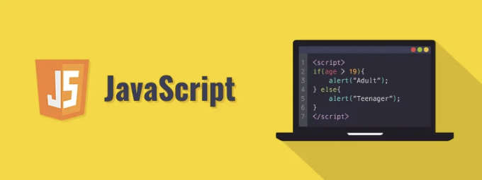

자바스크립트의 세계에 오신 것을 환영합니다! 개발자 입문자이거나 프로그래밍 기술을 확장하려는 분이든, 자바스크립트를 배우는 것은 멋진 선택입니다. 세계에서 가장 인기 있는 프로그래밍 언어 중 하나인 자바스크립트는 웹 사이트, 웹 애플리케이션, 심지어 모바일 앱의 인터랙티브 요소를 구동합니다. 이 단계별 안내서에서는 자바스크립트의 기본 개념을 이해하는 것부터 코드를 작성하는 방법까지 안내해 드립니다.

# 단계 1: 기초 이해하기

코딩에 들어가기 전에, 자바스크립트가 무엇인지 이해해 봅시다. 자바스크립트는 웹 페이지에 상호 작용성과 동적 행동을 추가하는 고수준의 해석형 프로그래밍 언어입니다. HTML과 CSS가 각각 마크업 및 스타일링 언어인 반면, 자바스크립트는 완전한 프로그래밍 언어입니다.

<!-- ui-log 수평형 -->
<ins class="adsbygoogle"
  style="display:block"
  data-ad-client="ca-pub-4877378276818686"
  data-ad-slot="9743150776"
  data-ad-format="auto"
  data-full-width-responsive="true"></ins>
<component is="script">
(adsbygoogle = window.adsbygoogle || []).push({});
</component>

# 단계 2: 환경 설정하기

자바스크립트 코드를 작성하려면 텍스트 편집기와 웹 브라우저가 필요합니다. 인기 있는 텍스트 편집기로는 Visual Studio Code, Sublime Text, Atom 등이 있습니다. 텍스트 편집기를 설치한 후에는 “.js” 확장자로 새 파일을 만듭니다. 예를 들어 “script.js”와 같이 만들 수 있습니다. 이 파일에 자바스크립트 코드를 작성하게 됩니다. 그런 다음 HTML 파일을 생성하고 자바스크립트 파일을 `script` 태그를 사용하여 연결합니다:

```js
<!DOCTYPE html>
<html lang="en">
<head>
    <meta charset="UTF-8">
    <meta name="viewport" content="width=device-width, initial-scale=1.0">
    <title>나의 첫 번째 자바스크립트 페이지</title>
</head>
<body>

    <h1>Hello, World!</h1>

    <script src="script.js"></script>

</body>
</html>
```

# 단계 3: 구문 기본하기

<!-- ui-log 수평형 -->
<ins class="adsbygoogle"
  style="display:block"
  data-ad-client="ca-pub-4877378276818686"
  data-ad-slot="9743150776"
  data-ad-format="auto"
  data-full-width-responsive="true"></ins>
<component is="script">
(adsbygoogle = window.adsbygoogle || []).push({});
</component>

자바스크립트 구문은 Java나 C++과 비슷하지만 덜 엄격하고 좀 더 관용적입니다. 여기 몇 가지 기본 구문 규칙이 있어요:

- 문장은 세미콜론 ; 으로 끝납니다.
- 변수는 var, let 또는 const를 사용하여 선언됩니다.
- 주석은 한 줄 (//)이거나 여러 줄 (/* */)일 수 있습니다.

# 단계 4: 변수와 데이터 유형

자바스크립트에서 변수는 데이터 값을 저장하는 컨테이너입니다. 자바스크립트에는 몇 가지 데이터 유형이 있습니다.

<!-- ui-log 수평형 -->
<ins class="adsbygoogle"
  style="display:block"
  data-ad-client="ca-pub-4877378276818686"
  data-ad-slot="9743150776"
  data-ad-format="auto"
  data-full-width-responsive="true"></ins>
<component is="script">
(adsbygoogle = window.adsbygoogle || []).push({});
</component>

- String: 따옴표(홑 따옴표 또는 쌍 따옴표)로 둘러싸인 텍스트 데이터입니다.
- Number: 정수 및 부동 소수점 숫자를 포함하는 숫자 데이터입니다.
- Boolean: 참 또는 거짓을 나타내는 논리 데이터입니다.
- Array: 값들의 순서가 있는 컬렉션입니다.
- Object: 키-값 쌍의 컬렉션입니다.

다음은 변수를 선언하고 초기화하는 예시입니다:

```js
var greeting = "Hello, World!";
var age = 25;
var isRaining = true;
var fruits = ["apple", "banana", "orange"];
var person = { name: "John", age: 30 };
```

# 단계 5: 제어 흐름

<!-- ui-log 수평형 -->
<ins class="adsbygoogle"
  style="display:block"
  data-ad-client="ca-pub-4877378276818686"
  data-ad-slot="9743150776"
  data-ad-format="auto"
  data-full-width-responsive="true"></ins>
<component is="script">
(adsbygoogle = window.adsbygoogle || []).push({});
</component>

제어 흐름문을 사용하면 코드 실행을 제어할 수 있어요. 주요 제어 흐름문은 다음과 같아요:

- if...else: 지정된 조건이 참인 경우 코드 블록을 실행하고, 그렇지 않은 경우 다른 코드 블록을 실행해요.
- for: 지정된 횟수만큼 코드 블록을 반복해요.
- while: 지정된 조건이 참인 동안 코드 블록을 반복해요.
- switch: 실행할 많은 코드 블록 중 하나를 선택해요.

여기 if...else 문의 예시가 있어요:

```js
var hour = new Date().getHours();
var greeting;

if (hour < 12) {
    greeting = "좋은 아침이에요!";
} else {
    greeting = "좋은 오후예요!";
}

console.log(greeting);
```

<!-- ui-log 수평형 -->
<ins class="adsbygoogle"
  style="display:block"
  data-ad-client="ca-pub-4877378276818686"
  data-ad-slot="9743150776"
  data-ad-format="auto"
  data-full-width-responsive="true"></ins>
<component is="script">
(adsbygoogle = window.adsbygoogle || []).push({});
</component>

# Step 6: 함수

함수는 특정 작업을 수행하는 재사용 가능한 코드 블록입니다. 코드를 구성하고 재사용성을 높이는 데 도움이 됩니다. 함수를 정의하는 방법은 다음과 같습니다:

```js
function greet(name) {
    return "Hello, " + name + "!";
}

var message = greet("John");
console.log(message); // 출력: Hello, John!
```

# Step 7: DOM 조작

<!-- ui-log 수평형 -->
<ins class="adsbygoogle"
  style="display:block"
  data-ad-client="ca-pub-4877378276818686"
  data-ad-slot="9743150776"
  data-ad-format="auto"
  data-full-width-responsive="true"></ins>
<component is="script">
(adsbygoogle = window.adsbygoogle || []).push({});
</component>

문서 객체 모델(DOM)은 웹 문서를 위한 프로그래밍 인터페이스입니다. JavaScript를 사용하여 DOM을 조작하여 웹 페이지의 내용, 구조 및 스타일을 동적으로 변경할 수 있습니다. 간단한 예시를 살펴보겠습니다:

```js
document.getElementById("myElement").innerHTML = "새로운 내용";
```

# 단계 8: 이벤트 처리

JavaScript를 사용하면 사용자의 클릭 및 키 입력과 같은 상호 작용에 응답할 수 있습니다. 다음은 클릭 이벤트를 처리하는 방법입니다:

<!-- ui-log 수평형 -->
<ins class="adsbygoogle"
  style="display:block"
  data-ad-client="ca-pub-4877378276818686"
  data-ad-slot="9743150776"
  data-ad-format="auto"
  data-full-width-responsive="true"></ins>
<component is="script">
(adsbygoogle = window.adsbygoogle || []).push({});
</component>

```js
document.getElementById("myButton").addEventListener("click", function() {
    alert("Button clicked!");
});
```

# 단계 9: 연습, 연습, 연습!

자바스크립트(또는 어떤 프로그래밍 언어든)을 숙달하는 핵심은 연습입니다. 코드를 실험하고 작은 프로젝트를 만들며 코딩 도전에 도전하세요. 어려움을 겪을 때 문서, 튜토리얼 및 온라인 자원을 참고하는 것을 주저하지 마세요.

결론

<!-- ui-log 수평형 -->
<ins class="adsbygoogle"
  style="display:block"
  data-ad-client="ca-pub-4877378276818686"
  data-ad-slot="9743150776"
  data-ad-format="auto"
  data-full-width-responsive="true"></ins>
<component is="script">
(adsbygoogle = window.adsbygoogle || []).push({});
</component>

자바스크립트 기초 단계별 안내서를 완료한 것을 축하드립니다! 문법, 변수, 제어 흐름, 함수, DOM 조작 및 이벤트 처리를 포함한 자바스크립트의 기본 개념을 배웠어요. 계속해서 탐험하고 연습하여 깊은 이해를 갖고 능숙한 자바스크립트 개발자가 되실 수 있도록 노력하세요. 코딩을 재밌게 해봐요!