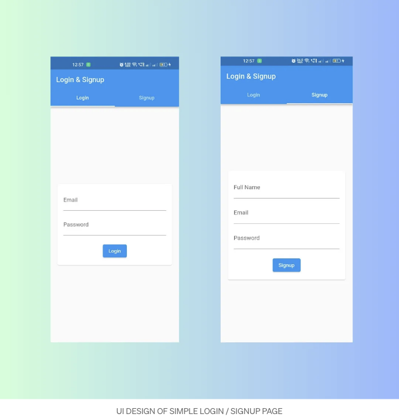
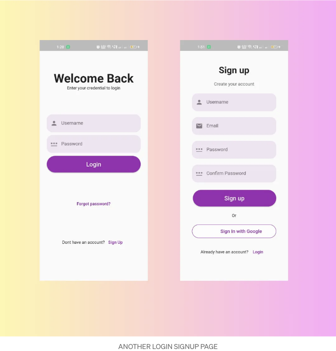

플러터(Flutter)에서 로그인/가입 페이지를 만들 때는 앱 요구 사항에 따라 디자인과 복잡성이 다양할 수 있어요. 플러터(Flutter)에서 세 가지 다른 로그인 페이지 UI 예제를 소개할게요:



```dart
import 'package:flutter/material.dart';

void main() {
  runApp(const MyApp());
}

class MyApp extends StatelessWidget {
  const MyApp({Key? key});

  @override
  Widget build(BuildContext context) {
    return MaterialApp(
      debugShowCheckedModeBanner: false,
      home: DefaultTabController(
        length: 2,
        child: Scaffold(
          appBar: AppBar(
            title: Text('Login & Signup'),
            bottom: TabBar(
              tabs: [
                Tab(text: 'Login'),
                Tab(text: 'Signup'),
              ],
            ),
          ),
          body: TabBarView(
            children: [
              LoginCard(),
              SignupCard(),
            ],
          ),
        ),
      ),
    );
  }
}

class LoginCard extends StatelessWidget {
  @override
  Widget build(BuildContext context) {
    return Center(
      child: Card(
        margin: EdgeInsets.all(20.0),
        child: Padding(
          padding: EdgeInsets.all(16.0),
          child: Column(
            mainAxisSize: MainAxisSize.min,
            children: <Widget>[
              TextField(
                decoration: InputDecoration(labelText: 'Email'),
              ),
              SizedBox(height: 10),
              TextField(
                decoration: InputDecoration(labelText: 'Password'),
                obscureText: true,
              ),
              SizedBox(height: 20),
              ElevatedButton(
                onPressed: () {
                  // 로그인 로직을 처리하세요
                },
                child: Text('Login'),
              ),
            ],
          ),
        ),
      ),
    );
  }
}

class SignupCard extends StatelessWidget {
  @override
  Widget build(BuildContext context) {
    return Center(
      child: Card(
        margin: EdgeInsets.all(20.0),
        child: Padding(
          padding: EdgeInsets.all(16.0),
          child: Column(
            mainAxisSize: MainAxisSize.min,
            children: <Widget>[
              TextField(
                decoration: InputDecoration(labelText: 'Full Name'),
              ),
              SizedBox(height: 10),
              TextField(
                decoration: InputDecoration(labelText: 'Email'),
              ),
              SizedBox(height: 10),
              TextField(
                decoration: InputDecoration(labelText: 'Password'),
                obscureText: true,
              ),
              SizedBox(height: 20),
              ElevatedButton(
                onPressed: () {
                  // 회원가입 로직을 처리하세요
                },
                child: Text('Signup'),
              ),
            ],
          ),
        ),
      ),
    );
  }
}
```



<!-- ui-log 수평형 -->
<ins class="adsbygoogle"
  style="display:block"
  data-ad-client="ca-pub-4877378276818686"
  data-ad-slot="9743150776"
  data-ad-format="auto"
  data-full-width-responsive="true"></ins>
<component is="script">
(adsbygoogle = window.adsbygoogle || []).push({});
</component>

```js
import 'package:flutter/material';

class LoginPage extends StatelessWidget {
  const LoginPage({key});

  @override
  Widget build(BuildContext context) {
    return MaterialApp(
      debugShowCheckedModeBanner: false,
      home: Scaffold(
        body: Container(
          margin: const EdgeInsets.all(24),
          child: Column(
            mainAxisAlignment: MainAxisAlignment.spaceEvenly,
            children: [
              _header(context),
              _inputField(context),
              _forgotPassword(context),
              _signup(context),
            ],
          ),
        ),
      ),
    );
  }

  _header(context) {
    return const Column(
      children: [
        Text(
          "돌아오신 것을 환영합니다",
          style: TextStyle(fontSize: 40, fontWeight: FontWeight.bold),
        ),
        Text("로그인하기 위해 자격 증명을 입력하세요"),
      ],
    );
  }

  _inputField(context) {
    return Column(
      crossAxisAlignment: CrossAxisAlignment.stretch,
      children: [
        TextField(
          decoration: InputDecoration(
              hintText: "사용자명",
              border: OutlineInputBorder(
                  borderRadius: BorderRadius.circular(18),
                  borderSide: BorderSide.none
              ),
              fillColor: Colors.purple.withOpacity(0.1),
              filled: true,
              prefixIcon: const Icon(Icons.person)),
        ),
        const SizedBox(height: 10),
        TextField(
          decoration: InputDecoration(
            hintText: "비밀번호",
            border: OutlineInputBorder(
                borderRadius: BorderRadius.circular(18),
                borderSide: BorderSide.none),
            fillColor: Colors.purple.withOpacity(0.1),
            filled: true,
            prefixIcon: const Icon(Icons.password),
          ),
          obscureText: true,
        ),
        const SizedBox(height: 10),
        ElevatedButton(
          onPressed: () {
          },
          style: ElevatedButton.styleFrom(
            shape: const StadiumBorder(),
            padding: const EdgeInsets.symmetric(vertical: 16),
            backgroundColor: Colors.purple,
          ),
          child: const Text(
            "로그인",
            style: TextStyle(fontSize: 20),
          ),
        )
      ],
    );
  }

  _forgotPassword(context) {
    return TextButton(
      onPressed: () {},
      child: const Text("비밀번호를 잊으셨나요?",
        style: TextStyle(color: Colors.purple),
      ),
    );
  }

  _signup(context) {
    return Row(
      mainAxisAlignment: MainAxisAlignment.center,
      children: [
        const Text("계정이 없으신가요? "),
        TextButton(
            onPressed: () {
            },
            child: const Text("가입하기", style: TextStyle(color: Colors.purple),)
        )
      ],
    );
  }
}
```

```js
import 'package:flutter/material';

class SignupPage extends StatelessWidget {
  const SignupPage({key});

  @override
  Widget build(BuildContext context) {
    return MaterialApp(
      debugShowCheckedModeBanner: false,
      home: Scaffold(
        body: SingleChildScrollView(
          child: Container(
            padding: const EdgeInsets.symmetric(horizontal: 40),
            height: MediaQuery.of(context).size.height - 50,
            width: double.infinity,
            child: Column(
              mainAxisAlignment: MainAxisAlignment.spaceEvenly,
              crossAxisAlignment: CrossAxisAlignment.stretch,
              children: <Widget>[
                Column(
                  children: <Widget>[
                    const SizedBox(height: 60.0),

                    const Text(
                      "가입",
                      style: TextStyle(
                        fontSize: 30,
                        fontWeight: FontWeight.bold,
                      ),
                    ),
                    const SizedBox(
                      height: 20,
                    ),
                    Text(
                      "계정을 만드세요",
                      style: TextStyle(fontSize: 15, color: Colors.grey[700]),
                    )
                  ],
                ),
                Column(
                  children: <Widget>[
                    TextField(
                      decoration: InputDecoration(
                          hintText: "사용자명",
                          border: OutlineInputBorder(
                              borderRadius: BorderRadius.circular(18),
                              borderSide: BorderSide.none),
                          fillColor: Colors.purple.withOpacity(0.1),
                          filled: true,
                          prefixIcon: const Icon(Icons.person)),
                    ),

                    const SizedBox(height: 20),

                    TextField(
                      decoration: InputDecoration(
                          hintText: "이메일",
                          border: OutlineInputBorder(
                              borderRadius: BorderRadius.circular(18),
                              borderSide: BorderSide.none),
                          fillColor: Colors.purple.withOpacity(0.1),
                          filled: true,
                          prefixIcon: const Icon(Icons.email)),
                    ),

                    const SizedBox(height: 20),

                    TextField(
                      decoration: InputDecoration(
                        hintText: "비밀번호",
                        border: OutlineInputBorder(
                            borderRadius: BorderRadius.circular(18),
                            borderSide: BorderSide.none),
                        fillColor: Colors.purple.withOpacity(0.1),
                        filled: true,
                        prefixIcon: const Icon(Icons.password),
                      ),
                      obscureText: true,
                    ),

                    const SizedBox(height: 20),

                    TextField(
                      decoration: InputDecoration(
                        hintText: "비밀번호 확인",
                        border: OutlineInputBorder(
                            borderRadius: BorderRadius.circular(18),
                            borderSide: BorderSide.none),
                        fillColor: Colors.purple.withOpacity(0.1),
                        filled: true,
                        prefixIcon: const Icon(Icons.password),
                      ),
                      obscureText: true,
                    ),
                  ],
                ),
                Container(
                    padding: const EdgeInsets.only(top: 3, left: 3),

                    child: ElevatedButton(
                      onPressed: () {
                      },
                      child: const Text(
                        "가입",
                        style: TextStyle(fontSize: 20),
                      ),
                      style: ElevatedButton.styleFrom(
                        shape: const StadiumBorder(),
                        padding: const EdgeInsets.symmetric(vertical: 16),
                        backgroundColor: Colors.purple,
                      ),
                    )
                ),

                const Center(child: Text("또는")),

                Container(
                  height: 45,
                  decoration: BoxDecoration(
                    borderRadius: BorderRadius.circular(25),
                    border: Border.all(
                      color: Colors.purple,
                    ),
                    boxShadow: [
                      BoxShadow(
                        color: Colors.white.withOpacity(0.5),
                        spreadRadius: 1,
                        blurRadius: 1,
                        offset: const Offset(0, 1), // 그림자 위치 변경
                      ),
                    ],
                  ),
                  child: TextButton(
                    onPressed: () {},
                    child: Row(
                      mainAxisAlignment: MainAxisAlignment.center,
                      children: [
                        Container(
                          height: 30.0,
                          width: 30.0,
                          decoration: const BoxDecoration(
                            image: DecorationImage(
                                image: AssetImage('assets/images/login_signup/google.png'),
                                fit: BoxFit.cover),
                            shape: BoxShape.circle,
                          ),
                        ),

                        const SizedBox(width: 18),

                        const Text("Google로 로그인하기",
                          style: TextStyle(
                            fontSize: 16,
                            color: Colors.purple,
                          ),
                        ),
                      ],
                    ),
                  ),
                ),

                Row(
                  mainAxisAlignment: MainAxisAlignment.center,
                  children: <Widget>[
                    const Text("이미 계정이 있으신가요?"),
                    TextButton(
                        onPressed: () {
                        },
                        child: const Text("로그인", style: TextStyle(color: Colors.purple),)
                    )
                  ],
                )
              ],
            ),
          ),
        ),
      ),
    );
  }
}
```

