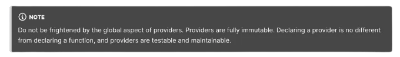
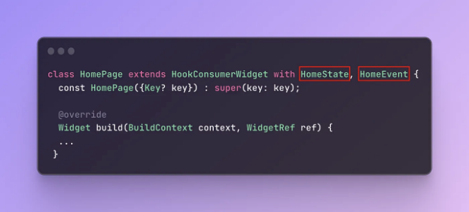
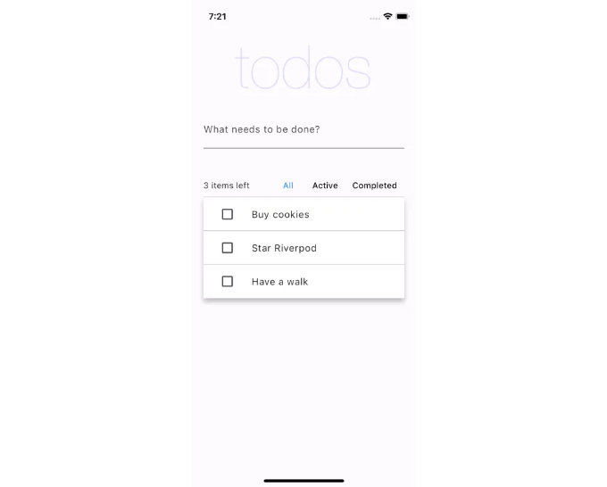
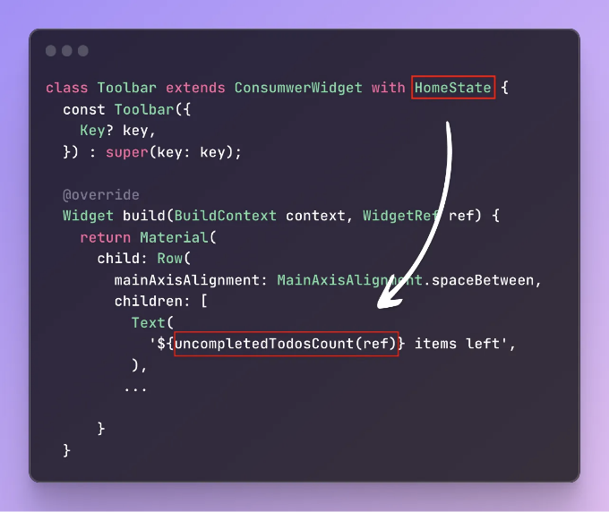
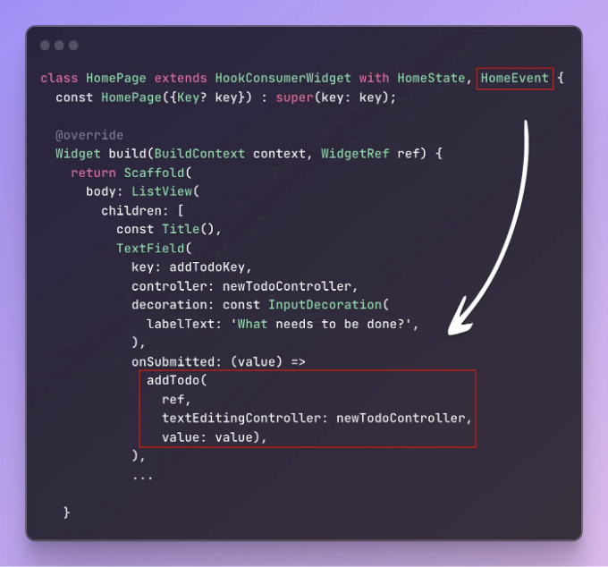
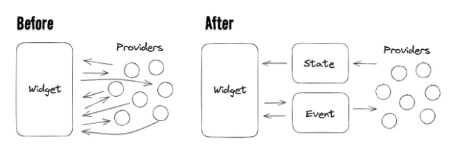
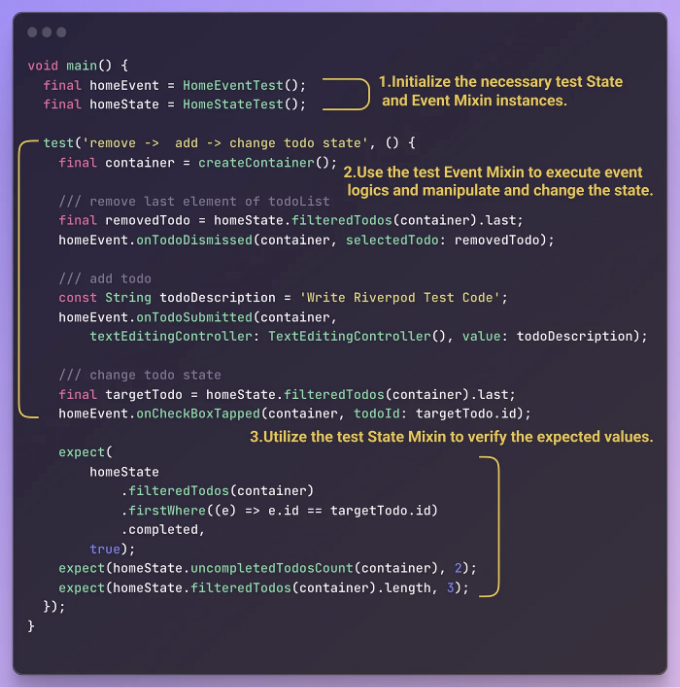

리버포드 좋아하세요?

최근에 시작한 새로운 플러터 프로젝트에서 상태 관리를 위해 리버포드 패키지를 사용해 왔어요. 이전에는 주로 Provider나 GetX와 같은 패키지를 사용했기 때문에 리버포드에 익숙하지 않았죠. 그런데 최근 플러터 사용자들이 왜 리버포드에 열광하는지 궁금했어요. 그래서 프로젝트에 대담하게 리버포드를 선택했어요.

하지만 그 후로, 나도 리버포드의 매력에 깊이 빠졌어요.

<!-- ui-log 수평형 -->
<ins class="adsbygoogle"
  style="display:block"
  data-ad-client="ca-pub-4877378276818686"
  data-ad-slot="9743150776"
  data-ad-format="auto"
  data-full-width-responsive="true"></ins>
<component is="script">
(adsbygoogle = window.adsbygoogle || []).push({});
</component>


리버포드를 사용하여 프로젝트를 구현하는 동안, 패키지의 반응적 메커니즘과 다양한 기능들로 대체로 만족했어요. 그러나 하나의 측면에서는 만족스럽지 못한 경험이 있었습니다.

전역 변수로 선언된 제공자(provider)가 항상 나쁜 것을 의미하는 것은 아니에요. (게다가 제공자의 상태는 ProviderContainer 내에서 관리되므로 실제로 전역이라고 할 수 없어요)



<!-- ui-log 수평형 -->
<ins class="adsbygoogle"
  style="display:block"
  data-ad-client="ca-pub-4877378276818686"
  data-ad-slot="9743150776"
  data-ad-format="auto"
  data-full-width-responsive="true"></ins>
<component is="script">
(adsbygoogle = window.adsbygoogle || []).push({});
</component>

리버포드 공식 문서에서 언급했듯이 전역으로 선언된 프로바이더들은 불변의 특성을 가지고 있어 앱 라이프사이클에 간섭하지 않거나 테스트 코드 작성 시 문제를 일으키지 않습니다. 그러나, 어디서든지 임포트만으로 프로바이더에 액세스할 수 있는 이점은 특정 페이지에서 어떤 프로바이더들이 사용되고 있는지 파악하기 어렵게 만듭니다.

# 전역으로 선언된 리버포드로 인한 문제점

이러한 단점은 다양한 도전을 수반합니다.

예를 들어, 리버포드를 활용하는 플러터 프로젝트에 합류하게 되고, 상사가 다음과 같은 작업을 할당한다고 상상해 봅시다.

<!-- ui-log 수평형 -->
<ins class="adsbygoogle"
  style="display:block"
  data-ad-client="ca-pub-4877378276818686"
  data-ad-slot="9743150776"
  data-ad-format="auto"
  data-full-width-responsive="true"></ins>
<component is="script">
(adsbygoogle = window.adsbygoogle || []).push({});
</component>

프로젝트에 막 참여하셨다니, 홈페이지에서 사용된 프로바이더 상태 값 및 이벤트 메서드를 파악하는 것이 조금 어려울 것 같네요. 그러면 테스트 코드를 이해하고 작성하는 데 더 많은 시간이 걸릴 수 있어요.

게다가, 여러 팀원이 참여하는 협업 프로젝트에서 특정 페이지에 사용된 프로바이더를 이해하는 것이 중요해요. 프로바이더 사용 범위를 명확히 이해하지 못하면 이미 생성된 프로바이더를 재사용할 수 있는 기회를 놓칠 수도 있고, 불필요한 추가 프로바이더를 소개하여 잠재적인 부작용을 불러올 수도 있어요.

이 문제들에 더해, 특히 더 크고 복잡한 앱에서 프로바이더 사용 범위를 이해하는 것이 어려워지면 프로젝트 유지 보수가 어려워질 수 있어요.

# Rivepod "Global" 미신

<!-- ui-log 수평형 -->
<ins class="adsbygoogle"
  style="display:block"
  data-ad-client="ca-pub-4877378276818686"
  data-ad-slot="9743150776"
  data-ad-format="auto"
  data-full-width-responsive="true"></ins>
<component is="script">
(adsbygoogle = window.adsbygoogle || []).push({});
</component>

상기 문제를 완화하기 위해서는 공급 업체 사용 범위를 구조화하는 것이 중요합니다. 다시 말해, 특정 섹션에서 어떤 공급 업체를 사용하는지 쉽게 구별할 수 있어야 합니다. 공급 업체 사용 범위를 어떻게 구조화해야 하는지 고민하던 중 Randal L. Schwartz의 `The Riverpod "Global" Myth`라는 YouTube 비디오를 발견했습니다.

이 비디오에서는 Riverpod이 전역 변수만 사용하는 것은 오해임을 해소하는 방법 뿐만 아니라 공급 업체 사용 범위를 구조화하는 다양한 방법이 자세히 설명되어 있습니다.

본 포스트에서는 비디오에서 설명된 두 가지 방법을 간단히 소개하겠습니다:

- 로컬 변수 (밑줄로 시작)
- 클래스 정적 로컬 변수

<!-- ui-log 수평형 -->
<ins class="adsbygoogle"
  style="display:block"
  data-ad-client="ca-pub-4877378276818686"
  data-ad-slot="9743150776"
  data-ad-format="auto"
  data-full-width-responsive="true"></ins>
<component is="script">
(adsbygoogle = window.adsbygoogle || []).push({});
</component>



더불어, provider 사용 범위를 구조화하는 측면에서, 이전에 Randal이 소개한 것과 다소 유사한 방법을 설명하겠습니다. 다만, Dart 3.0에서 소개된 mixin 클래스를 활용합니다. 이 기술은 provider 사용 범위에 대해 명확하고 테스트 가능한 구조를 제공합니다. 자유롭게 살펴보세요.



# 로컬 변수

<!-- ui-log 수평형 -->
<ins class="adsbygoogle"
  style="display:block"
  data-ad-client="ca-pub-4877378276818686"
  data-ad-slot="9743150776"
  data-ad-format="auto"
  data-full-width-responsive="true"></ins>
<component is="script">
(adsbygoogle = window.adsbygoogle || []).push({});
</component>

먼저 페이지 섹션 내에서 개별로 제공자를 선언하여 로컬라이징하는 방법을 살펴보겠습니다.

```js
final _uncompletedTodosCount = Provider<int>((ref) {  
  return ref.watch(todoListProvider).where((todo) => !todo.completed).length;  
});

class Toolbar extends HookConsumerWidget {  
  const Toolbar({  
    Key? key,  
  }) : super(key: key);  
  
  @override  
  Widget build(BuildContext context, WidgetRef ref) {  
    return Material(  
      child: Row(  
        mainAxisAlignment: MainAxisAlignment.spaceBetween,  
        children: [  
          Text(  
            '${ref.watch(_uncompletedTodosCount)}', // <- 로컬로 제공자에 접근
          ),
         ...
         
      }
  }
```

특정 소스 파일 내에서 제공자의 액세스 범위를 비공개로 제한함으로써 해당 파일 내에서만 해당 제공자에 액세스할 수 있습니다. 이는 제공자의 사용 범위를 명시적으로 관리할 수 있도록 합니다.

하지만 이 제공자를 서로 다른 클래스로 분리된 여러 하위 위젯에서 액세스해야 할 경우 코드가 다소 복잡해질 수 있습니다.

<!-- ui-log 수평형 -->
<ins class="adsbygoogle"
  style="display:block"
  data-ad-client="ca-pub-4877378276818686"
  data-ad-slot="9743150776"
  data-ad-format="auto"
  data-full-width-responsive="true"></ins>
<component is="script">
(adsbygoogle = window.adsbygoogle || []).push({});
</component>

```dart
final _uncompletedTodosCount = Provider<int>((ref) {  
  return ref.watch(todoListProvider).where((todo) => !todo.completed).length;  
});

part 'tool_bar3.dart'; // <- 파트 파일로 분리되었습니다

class HomePage extends HookConsumerWidget with HomeEvent, HomeState {  
  const HomePage({Key? key}) : super(key: key);  
  
  @override  
  Widget build(BuildContext context, WidgetRef ref) {  
  
    return Scaffold(  
      body: ListView(  
        children: [  
          Toolbar1(ref.watch(_uncompletedTodosCount)),
          Toolbar2(ref.watch(_uncompletedTodosCount)),
          const _Toolbar3(), 
          ...
          
      } 
  }
```

예를 들어, HomePage에 Toolbar1, Toolbar2 및 Toolbar3와 같은 자식 위젯이 있다고 가정하고, 모두 _uncompletedTodosCount 프로바이더에 액세스해야 하는 경우에는 매번 로컬화된 프로바이더의 상태 값을 인수로 전달하거나 자식 위젯을 파트 파일로 분리하는 것이 불편할 수 있습니다.

# 클래스 정적 로컬

이전에 언급한 문제를 해결하는 또 다른 방법은 클래스 내의 정적 변수에 프로바이더를 할당하는 것입니다.```

<!-- ui-log 수평형 -->
<ins class="adsbygoogle"
  style="display:block"
  data-ad-client="ca-pub-4877378276818686"
  data-ad-slot="9743150776"
  data-ad-format="auto"
  data-full-width-responsive="true"></ins>
<component is="script">
(adsbygoogle = window.adsbygoogle || []).push({});
</component>

```js
abstract class HomeProviders {  
  HomeProviders._();  
  
  static final todoListFilter = StateProvider((_) => TodoListFilter.all);  
  
  static final uncompletedTodosCount = Provider<int>((ref) {  
    return ref.watch(todoListProvider).where((todo) => !todo.completed).length;  
  });

  ...
}
```

위 코드에서 홈 섹션에서 사용되는 모든 프로바이더들은 해당 클래스 내의 static 변수로 할당됩니다.

```js
class Toolbar extends ConsumwerWidget {  
  const Toolbar({  
    Key? key,  
  }) : super(key: key);  
  
  @override  
  Widget build(BuildContext context, WidgetRef ref) {  
    return Material(  
      child: Row(  
        mainAxisAlignment: MainAxisAlignment.spaceBetween,  
        children: [  
          Text(  
            '${ref.watch(HomeProviders.uncompletedTodosCount)}', 
            // static 변수를 통해 프로바이더에 액세스
          ), 
         ...
         
      }
  }
```

다음으로 위젯에서 필요한 프로바이더들을 이 클래스를 통해 참조할 수 있습니다. 프로바이더가 클래스 내의 static 변수로 할당되어 있기 때문에, 불필요한 인스턴스를 생성하지 않거나 프로바이더의 라이프사이클에 간섭하지 않고 프로바이더 사용의 범위를 구조화할 수 있습니다.```

<!-- ui-log 수평형 -->
<ins class="adsbygoogle"
  style="display:block"
  data-ad-client="ca-pub-4877378276818686"
  data-ad-slot="9743150776"
  data-ad-format="auto"
  data-full-width-responsive="true"></ins>
<component is="script">
(adsbygoogle = window.adsbygoogle || []).push({});
</component>

# 믹신 클래스를 사용하여 프로바이더 사용 범위 구조화하기

이미 소개된 두 가지 방법으로 프로바이더 사용 범위를 명시적으로 정의할 수 있지만, 믹신 클래스를 사용하여 좀 더 명시적이고 테스트하기 쉬운 방법을 살펴보겠습니다.


이 접근 방식은 두 가지 형식의 믹신 클래스를 활용합니다.

<!-- ui-log 수평형 -->
<ins class="adsbygoogle"
  style="display:block"
  data-ad-client="ca-pub-4877378276818686"
  data-ad-slot="9743150776"
  data-ad-format="auto"
  data-full-width-responsive="true"></ins>
<component is="script">
(adsbygoogle = window.adsbygoogle || []).push({});
</component>

# 상태 믹신 클래스

먼저, 상태 믹신 클래스에 대해 알아봅시다. 이 클래스는 특정 페이지에서 사용되는 모든 프로바이더의 상태 값을 반환하는 메서드들로 구성되어 있습니다.

```js
mixin class HomeState {  
  int uncompletedTodosCount(WidgetRef ref) => ref.watch(uncompletedTodosCountProvider);  
  
  List<Todo> filteredTodos(WidgetRef ref) => ref.watch(filteredTodosProvider);  
  
  ...
}
```

위의 HomeState 믹신 클래스는 홈페이지 섹션에서 사용되는 프로바이더들의 상태 값을 관리합니다. 각 메서드는 WidgetRef를 인자로 받고, WidgetRef의 watch 확장 메서드를 사용하여 상태를 전달합니다.

<!-- ui-log 수평형 -->
<ins class="adsbygoogle"
  style="display:block"
  data-ad-client="ca-pub-4877378276818686"
  data-ad-slot="9743150776"
  data-ad-format="auto"
  data-full-width-responsive="true"></ins>
<component is="script">
(adsbygoogle = window.adsbygoogle || []).push({});
</component>

WidgetRef ref를 전달받아 AsyncValue`<Todo>` todoAsync(WidgetRef ref) 함수를 실행합니다. 이는 값을 AsyncValue 타입으로 감싸는 방법입니다.



위와 같이 구성된 State Mixin Class는 위젯 클래스에 섞여지며, 이를 통해 위젯이 프로바이더의 상태 값을 액세스할 수 있습니다.

<!-- ui-log 수평형 -->
<ins class="adsbygoogle"
  style="display:block"
  data-ad-client="ca-pub-4877378276818686"
  data-ad-slot="9743150776"
  data-ad-format="auto"
  data-full-width-responsive="true"></ins>
<component is="script">
(adsbygoogle = window.adsbygoogle || []).push({});
</component>

# 이벤트 믹신 클래스

다음으로, 이벤트 믹신 클래스를 살펴봅시다. 이벤트 믹신 클래스는 특정 섹션에서 사용되는 모든 이벤트 로직을 효율적으로 관리합니다. State 믹신 클래스와 마찬가지로 WidgetRef를 인자로 받아서 제공자 메서드에 쉽게 액세스할 수 있습니다.

```js
mixin class HomeEvent {
  void addTodo(
    WidgetRef ref, {
    required TextEditingController textEditingController,
    required String value,
  }) {
    ref.read(todoListProvider.notifier).add(value);
    textEditingController.clear();
  }

  void requestTextFieldsFocus(
    {required FocusNode textFieldFocusNode,
    required FocusNode itemFocusNode}) {
    itemFocusNode.requestFocus();
    textFieldFocusNode.requestFocus();
  }
...
}
```

예를 들어, 위의 addTodo 메서드는 WidgetRef 객체를 통해 todoListProvider라는 이름의 Notifier 제공자에 액세스하여 현재 목록에 새 항목을 추가하는 메서드를 실행합니다.

<!-- ui-log 수평형 -->
<ins class="adsbygoogle"
  style="display:block"
  data-ad-client="ca-pub-4877378276818686"
  data-ad-slot="9743150776"
  data-ad-format="auto"
  data-full-width-responsive="true"></ins>
<component is="script">
(adsbygoogle = window.adsbygoogle || []).push({});
</component>

위의 표를 아래와 같이 변경해주세요.



마찬가지로, 위에서 보듯이 Event Mixin Class는 이벤트 메서드가 필요한 위젯에 혼합되어 이벤트 메서드를 전달하기 쉽게 만듭니다.

# 핵심 개념

조금 복잡해 보일 수 있지만, 개념은 간단합니다.

<!-- ui-log 수평형 -->
<ins class="adsbygoogle"
  style="display:block"
  data-ad-client="ca-pub-4877378276818686"
  data-ad-slot="9743150776"
  data-ad-format="auto"
  data-full-width-responsive="true"></ins>
<component is="script">
(adsbygoogle = window.adsbygoogle || []).push({});
</component>



위젯에서 프로바이더에 직접 액세스하지 않고 상태 및 이벤트 믹신 클래스를 통한 프로바이더에 액세스할 새로운 채널을 제공하는 것이 중요합니다.

# 장점

지금, Riverpod 프로바이더 상태 값 및 이벤트 메서드를 믹신 클래스에서 관리하는 장점은 무엇인가요? 다섯 가지 주요 이점을 살펴보겠습니다.

<!-- ui-log 수평형 -->
<ins class="adsbygoogle"
  style="display:block"
  data-ad-client="ca-pub-4877378276818686"
  data-ad-slot="9743150776"
  data-ad-format="auto"
  data-full-width-responsive="true"></ins>
<component is="script">
(adsbygoogle = window.adsbygoogle || []).push({});
</component>

# 1. 쉬운 유지보수

특정 페이지 섹션에서 사용된 제공자들의 로직은 단일 Mixin Class에서 중앙으로 관리되어 유지보수가 용이합니다.

```js
mixin class HomeState {  
  List<Todo> todos(WidgetRef ref) => ref.watch(todoListFromRemoteProvider).value; 
}
```

예를 들어, 위의 코드에서는 todoListFromRemoteProvider 제공자를 통해 원격 데이터를 검색하고, 특정 페이지의 여러 위젯이 이 값을 참조하도록 설정될 수 있다고 가정해 봅시다.

<!-- ui-log 수평형 -->
<ins class="adsbygoogle"
  style="display:block"
  data-ad-client="ca-pub-4877378276818686"
  data-ad-slot="9743150776"
  data-ad-format="auto"
  data-full-width-responsive="true"></ins>
<component is="script">
(adsbygoogle = window.adsbygoogle || []).push({});
</component>

```js
mixin class HomeState {
  List<Todo> todos(WidgetRef ref) => ref.watch(todoListFromLocal);
}
```

만약 기존 프로바이더에서 원격 데이터 호출을 로컬 데이터 로딩으로 변경해야 한다면 HomeState 클래스에서 프로바이더를 todoListFromLocal로 교체하는 것으로 간단하게 변경할 수 있습니다.

하지만 Mixin State Class를 사용하지 않고 각 위젯이 직접 프로바이더를 사용하는 구조라면, 각 위젯의 기존 프로바이더를 새 프로바이더로 수동으로 변경해야 하는 불편함이 있을 수 있습니다.

# 2. 가독성 향상

<!-- ui-log 수평형 -->
<ins class="adsbygoogle"
  style="display:block"
  data-ad-client="ca-pub-4877378276818686"
  data-ad-slot="9743150776"
  data-ad-format="auto"
  data-full-width-responsive="true"></ins>
<component is="script">
(adsbygoogle = window.adsbygoogle || []).push({});
</component>

Mixin 클래스를 사용하여 제공자 리소스를 관리할 때 특정 페이지에서 사용되는 제공자 상태 값 및 이벤트 로직을 한눈에 쉽게 이해할 수 있습니다. 이는 Mixin 클래스가 부모 페이지 위젯이나 자식 위젯에 섞이며 명확한 종속성을 설정하기 때문입니다.

게다가 이벤트 믹스인 클래스에서 이벤트 로직을 관리함으로써 UI 코드와 이벤트 메서드를 완벽하게 분리하여 가독성을 향상시킬 수 있습니다.

# 3. 단위 테스트 코드 작성의 장점

State 및 Event 믹스인 클래스를 사용하면 단위 테스트 코드 작성이 더 편리해집니다.

<!-- ui-log 수평형 -->
<ins class="adsbygoogle"
  style="display:block"
  data-ad-client="ca-pub-4877378276818686"
  data-ad-slot="9743150776"
  data-ad-format="auto"
  data-full-width-responsive="true"></ins>
<component is="script">
(adsbygoogle = window.adsbygoogle || []).push({});
</component>

## 테스트 범위 이해하기

테스트 범위를 설정하는 것은 어렵기도 하며, 특히 앱이 커질수록 단위 테스트 코드를 작성하기 전에 어디까지 테스트해야 하는지 항상 고민이 됩니다.

```js
mixin class HomeEvent {
  void addTodo(
    WidgetRef ref, {
    required TextEditingController textEditingController,
    required String value,
  }) { ... }
  
  void removeTodo(WidgetRef ref, {required Todo selectedTodo}) { ... }
  
  void changeFilterCategory(WidgetRef ref, {required TodoListFilter filter}) { ... }
  
  void toggleTodoState(WidgetRef ref, {required String todoId}) { ... }
  
  void editTodoDesc(WidgetRef ref,
      {required bool isFocused,
      required TextEditingController textEditingController,
      required Todo selectedTodo}) { ... }
}
```

그러나 특정 페이지에서 사용된 이벤트 로직을 Event Mixin Class에서 한눈에 이해할 수 있다면 테스트 범위를 설정하고 테스트 시나리오를 구성하는 데 매우 도움이 될 수 있습니다.

<!-- ui-log 수평형 -->
<ins class="adsbygoogle"
  style="display:block"
  data-ad-client="ca-pub-4877378276818686"
  data-ad-slot="9743150776"
  data-ad-format="auto"
  data-full-width-responsive="true"></ins>
<component is="script">
(adsbygoogle = window.adsbygoogle || []).push({});
</component>

## 간결한 단위 테스트 코드

기존 State 및 Event Mixin 모듈을 활용하면 단위 테스트 코드를 훨씬 간결하게 작성할 수 있습니다.

```js
mixin class HomeEventTest {  
  void addTodo(  
    ProviderContainer container, {  
    required TextEditingController textEditingController,  
    required String value,  
  }) {  
    container.read(todoListProvider.notifier).add(value);  
    textEditingController.clear();  
  }  
  
  void removeTodo(ProviderContainer container, {required Todo selectedTodo}) {  
    container.read(todoListProvider.notifier).remove(selectedTodo);  
  }
  ...
}

mixin class HomeStateTest {  
  List<Todo> filteredTodos(ProviderContainer container) =>  
      container.read(filteredTodosProvider);  
  
  int uncompletedTodosCount(ProviderContainer container) =>  
      container.read(uncompletedTodosCountProvider);
  ...
}
```

먼저 기존 State 및 Event Mixin 모듈의 코드를 복사하여 새로운 Test Mixin Class를 생성합니다. 이 경우에는 WidgetRef에서 ProviderContainer 타입으로 인자를 변경하고 기존의 .watch 메서드를 .read로 대체하여 테스트 코드를 실행합니다.

<!-- ui-log 수평형 -->
<ins class="adsbygoogle"
  style="display:block"
  data-ad-client="ca-pub-4877378276818686"
  data-ad-slot="9743150776"
  data-ad-format="auto"
  data-full-width-responsive="true"></ins>
<component is="script">
(adsbygoogle = window.adsbygoogle || []).push({});
</component>

```js
void main() {  
  final homeEvent = HomeEventTest();  
  final homeState = HomeStateTest();  
  
  test('할 일 추가하기', () {  
    final container = createContainer();  
    const String todoDescription = 'Riverpod 테스트 코드 작성';  
    homeEvent.onTodoSubmitted(container,  
        textEditingController: TextEditingController(), value: todoDescription);  
    expect(  
        homeState.filteredTodos(container).last.description, todoDescription);  
  });
}
```

그런 다음, 테스트 main 메서드 내에서 각 State 및 Event Mixin 클래스의 인스턴스를 초기화하고, 이러한 인스턴스를 사용하여 테스트 코드를 작성하세요.



단계별로 설명:

<!-- ui-log 수평형 -->
<ins class="adsbygoogle"
  style="display:block"
  data-ad-client="ca-pub-4877378276818686"
  data-ad-slot="9743150776"
  data-ad-format="auto"
  data-full-width-responsive="true"></ins>
<component is="script">
(adsbygoogle = window.adsbygoogle || []).push({});
</component>

- 초기화: 필요한 테스트 상태 및 이벤트 Mixin 인스턴스를 초기화합니다.
- 조작: 테스트 이벤트 Mixin을 사용하여 이벤트 로직을 실행하고 상태를 조작하고 변경합니다.
- 확인: 예상된 값 확인을 위해 테스트 상태 Mixin을 활용합니다.

이벤트 Mixin 클래스에는 테스트할 이벤트 메서드가 포함되어 있고 상태 Mixin 클래스에는 예상된 테스트 결과 값이 정의되어 있어, 이를 활용하면 복잡한 시나리오를 포함한 유닛 테스트 코드 작성이 간편해집니다.

# 4. 업무 효율성 향상

실제 프로젝트 진행 중, 개발자들은 종종 디자인이 완료되지 않은 상황에서 기능 명세 및 API 사양을 받을 수 있습니다. 이런 상황에서는 디자인이 완료될 때까지 기다리지 않고 미리 상태 및 이벤트 Mixin 클래스 모듈을 준비하는 작업을 수행할 수 있습니다. 미리 만들어진 Mixin 클래스를 활용하여 개발자들은 완료된 디자인을 받은 후에 UI 위젯을 구현하고 이미 생성된 Mixin 클래스를 통합함으로써 프로젝트를 원활하게 진행할 수 있습니다. 이를 통해 프로세스에서 발생하는 빈틈을 없애고 프로젝트를 순조롭게 진행할 수 있습니다.

<!-- ui-log 수평형 -->
<ins class="adsbygoogle"
  style="display:block"
  data-ad-client="ca-pub-4877378276818686"
  data-ad-slot="9743150776"
  data-ad-format="auto"
  data-full-width-responsive="true"></ins>
<component is="script">
(adsbygoogle = window.adsbygoogle || []).push({});
</component>

# 5. 협업 프로세스에서의 오류 최소화

이전에 언급했듯이, 특정 페이지에서 사용된 공급자를 이해하는 것은 특히 여러 팀 멤버가 참여하는 협업 프로젝트에서 중요해집니다. 이 측면을 무시하면 같은 기능을 가진 다른 이름의 공급자가 부주의하게 생성되어 예기치 않은 부작용이 발생할 수 있습니다(개인 경험에 기초함). 따라서 협업 프로젝트에서 여러 기여자가 참여할 때 이러한 실수를 최소화하는 것이 중요합니다.

# 결론

이 게시물에서는 Mixin 클래스를 사용하여 Riverpod에서 공급자 범위를 구조화하는 방법을 탐구했습니다. 이 접근 방식은 작은 애플리케이션에는 너무 무리한 것으로 볼 수 있지만, 앱이 확장되고 관리하는 공급자 수가 늘어날수록 더 유리해지는 것으로 입증되었습니다. 개인적으로는 이 접근 방식으로 유닛 테스트 코드를 작성하기가 특별히 매력적으로 느껴집니다.

<!-- ui-log 수평형 -->
<ins class="adsbygoogle"
  style="display:block"
  data-ad-client="ca-pub-4877378276818686"
  data-ad-slot="9743150776"
  data-ad-format="auto"
  data-full-width-responsive="true"></ins>
<component is="script">
(adsbygoogle = window.adsbygoogle || []).push({});
</component>

또한, 이전 게시물인 "플러터에서 UI 코드 정리하기"에서 소개한 방법과 조합되었을 때, Mixin 클래스를 사용하여 공급 업체의 범위를 구조화하는 기술은 더욱 빛을 발합니다.

해당 게시물에서는 각 섹션별로 클래스 위젯으로 Flutter UI 코드를 구성하는 방법과 구조화된 UI 위젯에 믹신 클래스를 쉽게 적용할 수 있는 유연성에 대해 논의하였습니다. 이 두 가지 기법을 함께 사용하면 시너지 효과가 발생합니다.

이 게시물에서 소개한 Todo 앱 예제 프로젝트에 관심이 있는 분들은 

내 GitHub 저장소를 참조하실 수 있습니다. Riverpod 공식 문서의 기존 예제 코드에 상태(State) 및 이벤트(Event) Mixin 클래스를 적용하는 로직 및 일부 간단한 테스트 코드를 추가했습니다.

<!-- ui-log 수평형 -->
<ins class="adsbygoogle"
  style="display:block"
  data-ad-client="ca-pub-4877378276818686"
  data-ad-slot="9743150776"
  data-ad-format="auto"
  data-full-width-responsive="true"></ins>
<component is="script">
(adsbygoogle = window.adsbygoogle || []).push({});
</component>


읽어 주셔서 감사합니다!