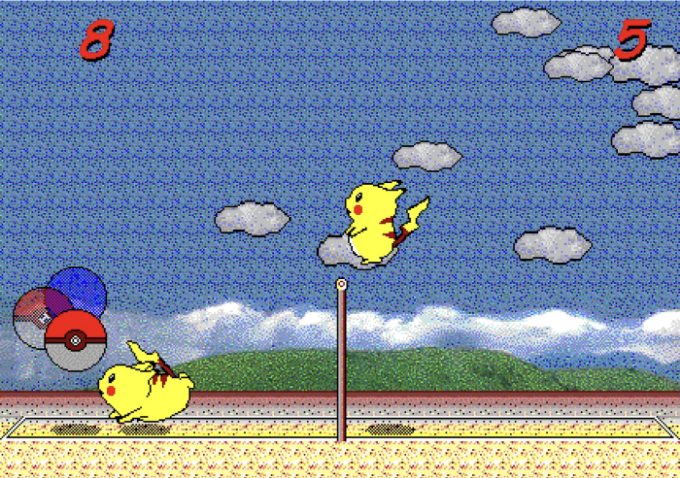

소개

피카츄 배구는 1997년에 "© SACHI SOFT / SAWAYAKAN Programmers" 및 "© Satoshi Takenouchi"가 공동 개발한 사랑받는 클래식 윈도우 캐주얼 게임입니다. 이 게임은 피카츄를 주인공으로 하여 플레이어가 사랑스러운 포켓몬을 조종하여 흥미진진한 해변 배구 경기에 참여할 수 있는 내용을 담고 있습니다.

게임플레이

<!-- ui-log 수평형 -->
<ins class="adsbygoogle"
  style="display:block"
  data-ad-client="ca-pub-4877378276818686"
  data-ad-slot="9743150776"
  data-ad-format="auto"
  data-full-width-responsive="true"></ins>
<component is="script">
(adsbygoogle = window.adsbygoogle || []).push({});
</component>

게임플레이는 간단하고 이해하기 쉽습니다. 플레이어는 피카츄를 조종하여 공을 차거나 점프하는 데에 키보드 또는 마우스 컨트롤을 사용합니다. 이 게임은 다음의 두 모드를 제공합니다:

- 싱글 플레이어 모드: 플레이어는 컴퓨터 상대와 경기를 펼쳐 실력을 테스트할 수 있습니다.
- 두 플레이어 모드: 두 명의 플레이어가 즐거우면서 경쟁적인 경험을 할 수 있습니다.

특징

- 사랑스러운 피카츄 스프라이트로 만들어진 매력적인 시각 효과는 게임 세계를 생동시켜 주어 즐거운 분위기를 연출합니다.
- 직관적인 컨트롤은 모든 연령의 플레이어가 참여하기 쉽게 만들어 주어 모두에게 편안하고 즐거운 경험을 제공합니다.
- 싱글 플레이어, 두 플레이어 모드, 여러 난이도 설정과 같은 다양한 콘텐츠는 각종 플레이어들의 취향을 충족합니다.
- 온라인 멀티플레이를 지원하여 플레이어들이 친구나 가족과 연결되어 함께 게임을 즐길 수 있도록 합니다.

<!-- ui-log 수평형 -->
<ins class="adsbygoogle"
  style="display:block"
  data-ad-client="ca-pub-4877378276818686"
  data-ad-slot="9743150776"
  data-ad-format="auto"
  data-full-width-responsive="true"></ins>
<component is="script">
(adsbygoogle = window.adsbygoogle || []).push({});
</component>

프로젝트 개요

gorisanson이 개발한이 프로젝트는 Pikachu Volleyball의 JavaScript 버전을 제공합니다. 역공학 기술을 활용하여 원본 게임의 게임 플레이 및 시각 효과를 완벽하게 재현하여 플레이어들에게 진정한 경험을 제공합니다.

프로젝트 특징

- 진정한 경험: 원본 게임의 충실한 재현으로 플레이어가 향수로운 추억을 간직할 수 있습니다.
- 현대 브라우저 호환성: 플러그인을 설치할 필요없이 게임을 즐길 수 있어 편리하고 접근성을 제공합니다.
- 로컬 및 온라인 멀티플레이어 지원: 친구나 가족과의 경쟁적인 매치를 즐기며 게임의 사회적 측면을 강화할 수 있습니다.

<!-- ui-log 수평형 -->
<ins class="adsbygoogle"
  style="display:block"
  data-ad-client="ca-pub-4877378276818686"
  data-ad-slot="9743150776"
  data-ad-format="auto"
  data-full-width-responsive="true"></ins>
<component is="script">
(adsbygoogle = window.adsbygoogle || []).push({});
</component>

결론

Pikachu Volleyball은 수많은 게이머들의 마음 속에서 그들의 어린 시절을 사랑받던 클래식으로 특별한 자리를 차지하고 있습니다. 이 프로젝트는 플레이어들에게 이 소중한 기억을 되돌아볼 수 있는 기회를 제공하는데 그치지 않고, JavaScript 개발자들에게는 역공학 기술을 배우고자 하는 데 유용한 자원으로 기능합니다.