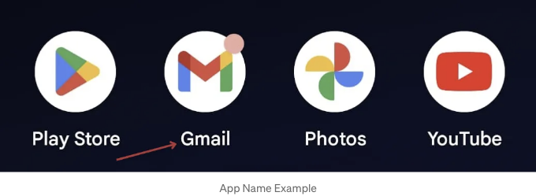
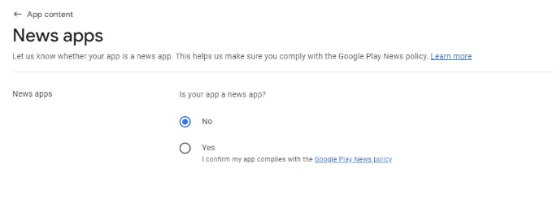

축하드려요!! 🥳 플러터 앱을 완성하셨군요! 이제 구글 플레이 스토어에 앱을 게시하여 세계와 나눠보세요.


이 안내서에서는 앱을 게시 준비하는 단계별 과정과 Google Play 콘솔을 탐색하여 수백만 사용자에게 앱을 제공하는 방법을 안내해 드릴 거예요.

# 앱을 게시할 준비하기

<!-- ui-log 수평형 -->
<ins class="adsbygoogle"
  style="display:block"
  data-ad-client="ca-pub-4877378276818686"
  data-ad-slot="9743150776"
  data-ad-format="auto"
  data-full-width-responsive="true"></ins>
<component is="script">
(adsbygoogle = window.adsbygoogle || []).push({});
</component>

Google Play Store에 앱을 게시하기 전에 출시 준비가 되어 있는지 확인해야 합니다. 여기에는 Flutter 앱을 준비하는 중요한 단계들이 있습니다:

## 단계 01: 앱 런처 아이콘 설정

Google Play Store에 게시하기 전에 앱에 고유 식별을 위한 아이콘이 있어야 합니다. 런처 아이콘은 다음과 같습니다:


<!-- ui-log 수평형 -->
<ins class="adsbygoogle"
  style="display:block"
  data-ad-client="ca-pub-4877378276818686"
  data-ad-slot="9743150776"
  data-ad-format="auto"
  data-full-width-responsive="true"></ins>
<component is="script">
(adsbygoogle = window.adsbygoogle || []).push({});
</component>

Gmail 앱 아이콘이 어떤 모습인지 본 적 있나요? 플러터 앱에도 아이콘이 있어야 한다구요. 그런데 어떻게 만들 수 있을까요? 🤔 만약 앱 로고가 있고 그 로고를 앱 아이콘으로 사용하고 싶다면 이런 단계를 따라해보세요:

우선, 여기 이 웹사이트로 가서 안드로이드 및 iOS 기기에 로고가 어떻게 보일지 확인해볼 수 있어요.

https://icon.kitchen/i/H4sIAAAAAAAAA6tWKkvMKU0tVrKqVkpJLMoOyUjNTVWySkvMKU6t1VHKzU8pzQHJRisl5qUU5WemKOkoZeYXA8ny1CSl2FoApT8%2BHkAAAAA%3D


<!-- ui-log 수평형 -->
<ins class="adsbygoogle"
  style="display:block"
  data-ad-client="ca-pub-4877378276818686"
  data-ad-slot="9743150776"
  data-ad-format="auto"
  data-full-width-responsive="true"></ins>
<component is="script">
(adsbygoogle = window.adsbygoogle || []).push({});
</component>

만약 앱 로고를 가지고 계시다면, 이미지를 선택하고 앱 로고를 업로드해서 어떻게 보이는지 확인할 수 있어요.


이후 다운로드할 수 있어요. Zip 파일을 다운로드하게 될 거예요. 그냥 zip 파일을 열어서 android 폴더로 이동한 후 아래와 같이 폴더를 복사하세요:


<!-- ui-log 수평형 -->
<ins class="adsbygoogle"
  style="display:block"
  data-ad-client="ca-pub-4877378276818686"
  data-ad-slot="9743150776"
  data-ad-format="auto"
  data-full-width-responsive="true"></ins>
<component is="script">
(adsbygoogle = window.adsbygoogle || []).push({});
</component>

이제 이 폴더를 플러터 프로젝트에 붙여넣어야 해요. 플러터 프로젝트를 열고 android 폴더로 이동해서 res 폴더 안에 붙여넣으세요:


이제 앱 아이콘이 변경되었어요. 플러터 프로젝트를 실행하여 테스트할 수 있어요.

## 단계 02: 앱 이름 설정

<!-- ui-log 수평형 -->
<ins class="adsbygoogle"
  style="display:block"
  data-ad-client="ca-pub-4877378276818686"
  data-ad-slot="9743150776"
  data-ad-format="auto"
  data-full-width-responsive="true"></ins>
<component is="script">
(adsbygoogle = window.adsbygoogle || []).push({});
</component>

당신의 앱 이름은 사용자가 쉽게 식별할 수 있는 것이 좋아요. 이 앱의 이름은 다음과 같이 보일 거에요:



Gmail처럼 이 앱을 위한 이름을 바꾸고 싶다면 어떻게 하면 될까요? 🤔 Flutter 프로젝트로 이동해 AndroidManifest.xml 파일을 다음과 같이 변경해보세요:


<!-- ui-log 수평형 -->
<ins class="adsbygoogle"
  style="display:block"
  data-ad-client="ca-pub-4877378276818686"
  data-ad-slot="9743150776"
  data-ad-format="auto"
  data-full-width-responsive="true"></ins>
<component is="script">
(adsbygoogle = window.adsbygoogle || []).push({});
</component>

앱 이름이 변경되었습니다. 앱을 재시작하여 테스트할 수 있어요.

## 단계 03: 앱 빌드 & 릴리스

이제 앱을 릴리스하기 위해 서명해야 합니다. 플레이 스토어에 릴리스하기 위해 다음 단계를 따라주세요:


<!-- ui-log 수평형 -->
<ins class="adsbygoogle"
  style="display:block"
  data-ad-client="ca-pub-4877378276818686"
  data-ad-slot="9743150776"
  data-ad-format="auto"
  data-full-width-responsive="true"></ins>
<component is="script">
(adsbygoogle = window.adsbygoogle || []).push({});
</component>

이제 이 코드를 key.properties 파일 안에 붙여넣으세요.

```js
storePassword=<이전 단계에서 얻은 비밀번호>
keyPassword=<이전 단계에서 얻은 비밀번호>
keyAlias=upload
storeFile=<키스토어 파일의 위치>
```

이제 원하는 비밀번호를 정의할 수 있지만 다른 사람과 공유하지 않도록 주의하세요. 이제 이렇게 보일 것입니다:

```js
storePassword=MyFlutterApp
keyPassword=MyFlutterApp
keyAlias=upload
storeFile=<키스토어 파일의 위치>
```

<!-- ui-log 수평형 -->
<ins class="adsbygoogle"
  style="display:block"
  data-ad-client="ca-pub-4877378276818686"
  data-ad-slot="9743150776"
  data-ad-format="auto"
  data-full-width-responsive="true"></ins>
<component is="script">
(adsbygoogle = window.adsbygoogle || []).push({});
</component>

다음 단계는 업로드 키스토어를 생성하는 것입니다.

만약 Mac이나 Linux를 사용 중이라면 아래 명령어를 복사해주세요:

```js
keytool -genkey -v -keystore ~/upload-keystore.jks -keyalg RSA -keysize 2048 -validity 10000 -alias upload
```

만약 Windows를 사용 중이라면 아래 명령어를 복사해주세요:

<!-- ui-log 수평형 -->
<ins class="adsbygoogle"
  style="display:block"
  data-ad-client="ca-pub-4877378276818686"
  data-ad-slot="9743150776"
  data-ad-format="auto"
  data-full-width-responsive="true"></ins>
<component is="script">
(adsbygoogle = window.adsbygoogle || []).push({});
</component>

```js
keytool -genkey -v -keystore %userprofile%\upload-keystore.jks -storetype JKS -keyalg RSA -keysize 2048 -validity 10000 -alias upload
```

%userprofile%에는 이 파일을 저장할 경로를 제공해야 합니다. 제 경우에는 C:\Users\AFFAN MINHAS를 제공했고, 따옴표로 감싸야 합니다.

Windows용 업데이트된 명령어는 다음과 같습니다:

```js
keytool -genkey -v -keystore "C:\Users\AFFAN MINHAS\upload-keystore.jks" -storetype JKS -keyalg RSA -keysize 2048 -validity 10000 -alias upload
```

<!-- ui-log 수평형 -->
<ins class="adsbygoogle"
  style="display:block"
  data-ad-client="ca-pub-4877378276818686"
  data-ad-slot="9743150776"
  data-ad-format="auto"
  data-full-width-responsive="true"></ins>
<component is="script">
(adsbygoogle = window.adsbygoogle || []).push({});
</component>

적절한 명령어를 붙여넣어 에러가 발생하지 않도록 주의하세요. 그런 다음 keystore 비밀번호를 입력하라는 메시지가 표시될 것입니다. 이때 key.properties 파일에서 설정한 동일한 비밀번호를 입력해주세요. 이후에는 이 과정을 완료하기 위해 몇 가지 기본 정보가 필요합니다. 아래에 참고용으로 이미 작성해놓은 것이 있습니다.


여기 제공된 정보는 임시적이므로 귀하의 정보에 맞는 올바른 정보를 제공해주시기 바랍니다. 모두 괜찮게 진행했다면 upload-keystore.jks가 지정된 위치에 다운로드될 것입니다.

이제 upload-keystore.jks 파일을 android/app 폴더로 복사하여 넣고, 또한 아래의 key.properties 파일에 올바른 경로를 업데이트해주세요:

<!-- ui-log 수평형 -->
<ins class="adsbygoogle"
  style="display:block"
  data-ad-client="ca-pub-4877378276818686"
  data-ad-slot="9743150776"
  data-ad-format="auto"
  data-full-width-responsive="true"></ins>
<component is="script">
(adsbygoogle = window.adsbygoogle || []).push({});
</component>


이제 플러터 프로젝트의 Gradle에서 서명 구성해야 합니다.

프로젝트의 [project]/android/app/build.gradle 파일로 이동하신 후 다음 코드를 android 태그 위에 붙여넣어주세요:

```js
 def keystoreProperties = new Properties()
   def keystorePropertiesFile = rootProject.file('key.properties')
   if (keystorePropertiesFile.exists()) {
       keystoreProperties.load(new FileInputStream(keystorePropertiesFile))
   }
```

<!-- ui-log 수평형 -->
<ins class="adsbygoogle"
  style="display:block"
  data-ad-client="ca-pub-4877378276818686"
  data-ad-slot="9743150776"
  data-ad-format="auto"
  data-full-width-responsive="true"></ins>
<component is="script">
(adsbygoogle = window.adsbygoogle || []).push({});
</component>

아래 코드를 추가한 후에 gradle 파일이 이렇게 보여야 합니다:


그런 다음 이 코드를 복사하고 다시 가장 아래로 이동하여 gradle 파일에 붙여넣기하세요:

```js
   signingConfigs {
       release {
           keyAlias keystoreProperties['keyAlias']
           keyPassword keystoreProperties['keyPassword']
           storeFile keystoreProperties['storeFile'] ? file(keystoreProperties['storeFile']) : null
           storePassword keystoreProperties['storePassword']
       }
   }
   buildTypes {
       release {
           signingConfig signingConfigs.release
       }
   }
```

<!-- ui-log 수평형 -->
<ins class="adsbygoogle"
  style="display:block"
  data-ad-client="ca-pub-4877378276818686"
  data-ad-slot="9743150776"
  data-ad-format="auto"
  data-full-width-responsive="true"></ins>
<component is="script">
(adsbygoogle = window.adsbygoogle || []).push({});
</component>

이전에 작성된 buildTypes 태그를 찾으시고 완전히 덮어쓰기하고 아래 코드를 붙여넣어주세요.


이제 설정이 완료되었으니 다음 명령을 실행하여 앱 번들을 빌드할 시간입니다. 먼저 터미널을 열고 다음과 같이 루트 프로젝트로 이동하세요:


<!-- ui-log 수평형 -->
<ins class="adsbygoogle"
  style="display:block"
  data-ad-client="ca-pub-4877378276818686"
  data-ad-slot="9743150776"
  data-ad-format="auto"
  data-full-width-responsive="true"></ins>
<component is="script">
(adsbygoogle = window.adsbygoogle || []).push({});
</component>

위 작업을 완료한 후 다음 명령어를 한 줄씩 실행해주세요:

- flutter clean
- flutter pub get
- flutter build appbundle

성공적으로 실행되면 프로젝트의 build\app\outputs\bundle\release\ 디렉토리에 .aab 파일이 생성됩니다.

이제 보안을 위해 key.properties와 upload-keystore.jks 파일은 깃허브에 업로드하지 않습니다. 이를 위해서는 .gitignore 파일에 추가하여 업로드하지 않도록 설정해주세요.

<!-- ui-log 수평형 -->
<ins class="adsbygoogle"
  style="display:block"
  data-ad-client="ca-pub-4877378276818686"
  data-ad-slot="9743150776"
  data-ad-format="auto"
  data-full-width-responsive="true"></ins>
<component is="script">
(adsbygoogle = window.adsbygoogle || []).push({});
</component>


이 단계는 매우 중요합니다. 키 또는 키스토어에 접근할 수 있는 사람이 있다면 새 앱 버전을 Play 스토어에 업로드하고 업로드한 앱 버전을 덮어쓸 수 있습니다.

## 단계 04: Play 스토어에 게시

이제 앱 번들이 준비되었으므로 Play 스토어에 게시하는 마지막 단계입니다. 이를 위해서는 Google Play 콘솔의 개발자 계정이 있어야 합니다. 우선 여기에서 개발자 계정을 만들어주세요:

<!-- ui-log 수평형 -->
<ins class="adsbygoogle"
  style="display:block"
  data-ad-client="ca-pub-4877378276818686"
  data-ad-slot="9743150776"
  data-ad-format="auto"
  data-full-width-responsive="true"></ins>
<component is="script">
(adsbygoogle = window.adsbygoogle || []).push({});
</component>

이후에는 일회성 수수료를 지불해야 합니다:


성공적인 등록 후에는 앱을 업로드할 수 있는 개발자 계정이 생깁니다.

콘솔로 이동: [https://play.google.com/console](https://play.google.com/console)

<!-- ui-log 수평형 -->
<ins class="adsbygoogle"
  style="display:block"
  data-ad-client="ca-pub-4877378276818686"
  data-ad-slot="9743150776"
  data-ad-format="auto"
  data-full-width-responsive="true"></ins>
<component is="script">
(adsbygoogle = window.adsbygoogle || []).push({});
</component>

이제 앱을 발행해봅시다. 먼저 아래와 같이 앱을 생성하세요:


이후 앱 정보를 제공하세요. 데이터를 입력하는 예시를 제공하겠습니다.

- 앱 이름은 마음대로 지으세요.
- 앱의 기본 언어를 선택하세요.
- 앱인지 게임 앱인지 선택하세요.

<!-- ui-log 수평형 -->
<ins class="adsbygoogle"
  style="display:block"
  data-ad-client="ca-pub-4877378276818686"
  data-ad-slot="9743150776"
  data-ad-format="auto"
  data-full-width-responsive="true"></ins>
<component is="script">
(adsbygoogle = window.adsbygoogle || []).push({});
</component>


- 이번에 앱을 무료로 제작하신다면, 앞으로 가격을 변경하지 않을 거라고 확신하셨을 때에 그에 맞추어 선택하세요.
- 또한, 당연히 선언사항을 확인해야 합니다.


위 작업으로 앱이 성공적으로 생성되었습니다. 이제 앱 세부정보를 제공하여 구성 작업을 시작해야 합니다.

<!-- ui-log 수평형 -->
<ins class="adsbygoogle"
  style="display:block"
  data-ad-client="ca-pub-4877378276818686"
  data-ad-slot="9743150776"
  data-ad-format="auto"
  data-full-width-responsive="true"></ins>
<component is="script">
(adsbygoogle = window.adsbygoogle || []).push({});
</component>

- 상점 설정 탭으로 이동하세요.
- 앱인지 게임인지 제공하세요.
- 앱의 올바른 카테고리를 선택하세요.
- 그런 다음 해당하는 태그를 선택하세요. 최대 5개의 태그를 선택할 수 있습니다.


- 그런 다음 앱과 관련된 모든 알림을 수신할 연락처 세부 정보를 제공하세요. 앱 발표 세부사항 또는 기타 사항이 포함됩니다.


<!-- ui-log 수평형 -->
<ins class="adsbygoogle"
  style="display:block"
  data-ad-client="ca-pub-4877378276818686"
  data-ad-slot="9743150776"
  data-ad-format="auto"
  data-full-width-responsive="true"></ins>
<component is="script">
(adsbygoogle = window.adsbygoogle || []).push({});
</component>

- 그 후에 필요한 앱 세부 정보를 제공하세요


- 이제 아래로 스크롤하고 앱 아이콘을 제공하고 여기 나열된 차원과 크기와 일치하는지 확인하세요:


<!-- ui-log 수평형 -->
<ins class="adsbygoogle"
  style="display:block"
  data-ad-client="ca-pub-4877378276818686"
  data-ad-slot="9743150776"
  data-ad-format="auto"
  data-full-width-responsive="true"></ins>
<component is="script">
(adsbygoogle = window.adsbygoogle || []).push({});
</component>

- 이제 앱의 특징 그래픽을 제공해야 합니다. 이 그래픽은 상점 목록의 커버 사진으로 나타납니다.


- 이제 핸드폰 화면의 스크린샷을 제공해야 합니다. 최소 2장, 최대 8장까지 가능합니다.
- 앱을 소개하는 비디오 링크도 제공할 수 있습니다.


<!-- ui-log 수평형 -->
<ins class="adsbygoogle"
  style="display:block"
  data-ad-client="ca-pub-4877378276818686"
  data-ad-slot="9743150776"
  data-ad-format="auto"
  data-full-width-responsive="true"></ins>
<component is="script">
(adsbygoogle = window.adsbygoogle || []).push({});
</component>

- 7인치 태블릿과 10인치 태블릿의 스크린샷을 제공해야합니다. 특별히 가지고 있지 않다면 동일한 스크린샷을 제공할 수 있습니다.


이제 앱을 업로드할 수 있는 트랙 목록이 있습니다. 다음과 같습니다:


<!-- ui-log 수평형 -->
<ins class="adsbygoogle"
  style="display:block"
  data-ad-client="ca-pub-4877378276818686"
  data-ad-slot="9743150776"
  data-ad-format="auto"
  data-full-width-responsive="true"></ins>
<component is="script">
(adsbygoogle = window.adsbygoogle || []).push({});
</component>

우리가 공개 평가용으로 업로드하는 것으로 가정해봅시다. 그래서 우리는 제품 트랙을 선택합니다.

- 제품 탭으로 이동한 다음 새 릴리스를 생성하십시오.


- 이제 서명 키를 선택해야 합니다.

<!-- ui-log 수평형 -->
<ins class="adsbygoogle"
  style="display:block"
  data-ad-client="ca-pub-4877378276818686"
  data-ad-slot="9743150776"
  data-ad-format="auto"
  data-full-width-responsive="true"></ins>
<component is="script">
(adsbygoogle = window.adsbygoogle || []).push({});
</component>


- 그런 다음 Google이 생성한 키를 선택하십시오.


- 이제 시작할 때 만들었던 앱 번들을 업로드해야 합니다. 프로젝트 위치에서 번들을 찾을 수 있습니다.
- 저의 경우 경로는 다음과 같습니다:
- D:\FlutterProjects\[프로젝트_이름]\build\app\outputs\bundle

<!-- ui-log 수평형 -->
<ins class="adsbygoogle"
  style="display:block"
  data-ad-client="ca-pub-4877378276818686"
  data-ad-slot="9743150776"
  data-ad-format="auto"
  data-full-width-responsive="true"></ins>
<component is="script">
(adsbygoogle = window.adsbygoogle || []).push({});
</component>


- 이후에는 새로운 업데이트나 기능이 있을 경우 메시지를 입력할 수 있습니다.


- 이제 표시된 것처럼 오류가 발생할 것입니다.

<!-- ui-log 수평형 -->
<ins class="adsbygoogle"
  style="display:block"
  data-ad-client="ca-pub-4877378276818686"
  data-ad-slot="9743150776"
  data-ad-format="auto"
  data-full-width-responsive="true"></ins>
<component is="script">
(adsbygoogle = window.adsbygoogle || []).push({});
</component>


- 이 앱을 마침내 롤아웃하도록 해보죠.
- 프로덕션 탭으로 돌아가서 앱을 제공할 국가 및 지역을 선택하세요. 원하는 국가를 선택하거나 선택 제왌할 수 있습니다.


- 이제 국가를 선택해야 합니다. 모든 것을 선택하려면 그냥 모두 선택하고 저장하세요.

<!-- ui-log 수평형 -->
<ins class="adsbygoogle"
  style="display:block"
  data-ad-client="ca-pub-4877378276818686"
  data-ad-slot="9743150776"
  data-ad-format="auto"
  data-full-width-responsive="true"></ins>
<component is="script">
(adsbygoogle = window.adsbygoogle || []).push({});
</component>


- 그 다음으로 내려가서 작업 탭을 클릭하고 앱 콘텐츠 탭을 찾아서 이 앱에 대한 추가 선언을 제공해야 합니다.


- 여기에는 앱의 개인정보 보호 정책을 표시하는 경우 어디에서 호스트된 URL을 제공해야 합니다.

<!-- ui-log 수평형 -->
<ins class="adsbygoogle"
  style="display:block"
  data-ad-client="ca-pub-4877378276818686"
  data-ad-slot="9743150776"
  data-ad-format="auto"
  data-full-width-responsive="true"></ins>
<component is="script">
(adsbygoogle = window.adsbygoogle || []).push({});
</component>


- 간단히 말해서, 우리는 GitHub 저장소를 만들고 여기에 간단한 파일을 만들어 URL을 제공할 수 있습니다. 그 방법을 보겠습니다.
- 다음 URL을 따라가서 개인정보 보호 정책의 더미 템플릿을 찾아 복사하세요:

- 여기서 템플릿을 복사하세요:


<!-- ui-log 수평형 -->
<ins class="adsbygoogle"
  style="display:block"
  data-ad-client="ca-pub-4877378276818686"
  data-ad-slot="9743150776"
  data-ad-format="auto"
  data-full-width-responsive="true"></ins>
<component is="script">
(adsbygoogle = window.adsbygoogle || []).push({});
</component>

- 다음으로 GitHub 계정에 저장소를 만들어야 합니다. 이를 위해 https://github.com 으로 이동하여 저장소를 만들어주세요.


- 저장소에 이름을 지정하고 반드시 해당 저장소를 공개로 설정하여 누구나 볼 수 있도록 하세요.


<!-- ui-log 수평형 -->
<ins class="adsbygoogle"
  style="display:block"
  data-ad-client="ca-pub-4877378276818686"
  data-ad-slot="9743150776"
  data-ad-format="auto"
  data-full-width-responsive="true"></ins>
<component is="script">
(adsbygoogle = window.adsbygoogle || []).push({});
</component>

이후에는 그냥 거기서 새 파일을 만드세요:


- 그런 다음 내용을 붙여 넣고 편집한 후에 저장하세요.


<!-- ui-log 수평형 -->
<ins class="adsbygoogle"
  style="display:block"
  data-ad-client="ca-pub-4877378276818686"
  data-ad-slot="9743150776"
  data-ad-format="auto"
  data-full-width-responsive="true"></ins>
<component is="script">
(adsbygoogle = window.adsbygoogle || []).push({});
</component>

- 이후에는 리포지토리 경로를 복사하고 개인정보 보호 정책 URL이 필요한 곳에 붙여 넣으세요.


이제 이 단계를 완료하고 화살표를 클릭하여 돌아가세요.

- 앱에 광고가 포함되어 있는지 여부를 알려야 합니다. 광고 선언으로 이동하여 시작 버튼을 눌러주세요. 시작 선언:

<!-- ui-log 수평형 -->
<ins class="adsbygoogle"
  style="display:block"
  data-ad-client="ca-pub-4877378276818686"
  data-ad-slot="9743150776"
  data-ad-format="auto"
  data-full-width-responsive="true"></ins>
<component is="script">
(adsbygoogle = window.adsbygoogle || []).push({});
</component>

```


그 다음으로 앱에 광고가 포함되어 있는지 여부에 따라 선택하세요.


이제 이 단계를 완료하고 위쪽에 있는 화살표로 되돌아갑니다.
```

<!-- ui-log 수평형 -->
<ins class="adsbygoogle"
  style="display:block"
  data-ad-client="ca-pub-4877378276818686"
  data-ad-slot="9743150776"
  data-ad-format="auto"
  data-full-width-responsive="true"></ins>
<component is="script">
(adsbygoogle = window.adsbygoogle || []).push({});
</component>

- 이제 앱이 완전히 접근 가능한지 또는 일부 부분에 특별한 접근 권한이 필요한지 알아야 합니다.


앱에 따라 모든 기능이 제한 없이 접근 가능한지 여부를 확인하십시오.


<!-- ui-log 수평형 -->
<ins class="adsbygoogle"
  style="display:block"
  data-ad-client="ca-pub-4877378276818686"
  data-ad-slot="9743150776"
  data-ad-format="auto"
  data-full-width-responsive="true"></ins>
<component is="script">
(adsbygoogle = window.adsbygoogle || []).push({});
</component>

이제 이 단계를 마무리하고 위쪽의 화살표로 돌아가세요.

- 이제 콘텐츠 등급을 알려주고 설문조사를 시작해야 합니다


이메일 주소와 카테고리를 입력해야 합니다:

<!-- ui-log 수평형 -->
<ins class="adsbygoogle"
  style="display:block"
  data-ad-client="ca-pub-4877378276818686"
  data-ad-slot="9743150776"
  data-ad-format="auto"
  data-full-width-responsive="true"></ins>
<component is="script">
(adsbygoogle = window.adsbygoogle || []).push({});
</component>


그러고 난 후에 앱에 따라 이 질문에 답하고 다음 단계로 넘어가주세요:


이후에 선택한 내용을 요약한 정보가 나오며, 확인 후 저장해주세요.

<!-- ui-log 수평형 -->
<ins class="adsbygoogle"
  style="display:block"
  data-ad-client="ca-pub-4877378276818686"
  data-ad-slot="9743150776"
  data-ad-format="auto"
  data-full-width-responsive="true"></ins>
<component is="script">
(adsbygoogle = window.adsbygoogle || []).push({});
</component>

아래는 타깃 대상에게 전달해야 할 내용입니다:


<!-- ui-log 수평형 -->
<ins class="adsbygoogle"
  style="display:block"
  data-ad-client="ca-pub-4877378276818686"
  data-ad-slot="9743150776"
  data-ad-format="auto"
  data-full-width-responsive="true"></ins>
<component is="script">
(adsbygoogle = window.adsbygoogle || []).push({});
</component>

당신의 앱에 따라 선택한 후 저장하세요.


그런 다음 앱에 개인 데이터가 있는지 없는지 알려주셔야 합니다. 저장하세요.


<!-- ui-log 수평형 -->
<ins class="adsbygoogle"
  style="display:block"
  data-ad-client="ca-pub-4877378276818686"
  data-ad-slot="9743150776"
  data-ad-format="auto"
  data-full-width-responsive="true"></ins>
<component is="script">
(adsbygoogle = window.adsbygoogle || []).push({});
</component>

당신의 앱을 선생님들에 의해 테스트를 받아 신청할 수 있도록 하려면 저장 버튼을 눌러주세요.


그런 다음 마지막으로 저장하고이 단계를 지워서 위의 화살표로 돌아갈 수 있습니다.

- 이제 당신의 앱이 뉴스 앱인지 여부를 알려야 합니다.

<!-- ui-log 수평형 -->
<ins class="adsbygoogle"
  style="display:block"
  data-ad-client="ca-pub-4877378276818686"
  data-ad-slot="9743150776"
  data-ad-format="auto"
  data-full-width-responsive="true"></ins>
<component is="script">
(adsbygoogle = window.adsbygoogle || []).push({});
</component>


앱 목적에 맞게 선택하세요.



이제 이 단계를 완료하고 위쪽 화살표로 돌아가세요.

<!-- ui-log 수평형 -->
<ins class="adsbygoogle"
  style="display:block"
  data-ad-client="ca-pub-4877378276818686"
  data-ad-slot="9743150776"
  data-ad-format="auto"
  data-full-width-responsive="true"></ins>
<component is="script">
(adsbygoogle = window.adsbygoogle || []).push({});
</component>

- 그 후에 앱이 COVID-19 접촉 추적이거나 상태 앱인지 또는 다른 앱인지 알려주어야 합니다.


당신의 앱에 따라 선택하십시오.


<!-- ui-log 수평형 -->
<ins class="adsbygoogle"
  style="display:block"
  data-ad-client="ca-pub-4877378276818686"
  data-ad-slot="9743150776"
  data-ad-format="auto"
  data-full-width-responsive="true"></ins>
<component is="script">
(adsbygoogle = window.adsbygoogle || []).push({});
</component>

지금 저장을 해서이 단계를 완료하고 위쪽의 화살표로 돌아갈 수 있습니다.

- 그 후 앱의 개인 정보 처리 방침 및 보안 관행에 대해 설명해야합니다.


이러한 세부 정보를 제공하고 다음을 클릭하세요.

<!-- ui-log 수평형 -->
<ins class="adsbygoogle"
  style="display:block"
  data-ad-client="ca-pub-4877378276818686"
  data-ad-slot="9743150776"
  data-ad-format="auto"
  data-full-width-responsive="true"></ins>
<component is="script">
(adsbygoogle = window.adsbygoogle || []).push({});
</component>


그런 다음 마침내 저장하고이 단계를 지우고 위의 화살표로 돌아갑니다.

- 그 후에 앱이 광고 ID를 사용하는지 여부를 알려야합니다.


<!-- ui-log 수평형 -->
<ins class="adsbygoogle"
  style="display:block"
  data-ad-client="ca-pub-4877378276818686"
  data-ad-slot="9743150776"
  data-ad-format="auto"
  data-full-width-responsive="true"></ins>
<component is="script">
(adsbygoogle = window.adsbygoogle || []).push({});
</component>

당신의 앱에 따라 선택하십시오.


이제 이 단계를 완료하고 위쪽 화살표로 돌아가세요.

- 그 후에는 앱이 정부 소유인지 여부를 알려주어야 합니다.

<!-- ui-log 수평형 -->
<ins class="adsbygoogle"
  style="display:block"
  data-ad-client="ca-pub-4877378276818686"
  data-ad-slot="9743150776"
  data-ad-format="auto"
  data-full-width-responsive="true"></ins>
<component is="script">
(adsbygoogle = window.adsbygoogle || []).push({});
</component>

아래 표를 참고하여 앱을 선택해주세요.

이제 이 단계를 완료하고 위쪽 화살표로 되돌아갈 수 있습니다.

<!-- ui-log 수평형 -->
<ins class="adsbygoogle"
  style="display:block"
  data-ad-client="ca-pub-4877378276818686"
  data-ad-slot="9743150776"
  data-ad-format="auto"
  data-full-width-responsive="true"></ins>
<component is="script">
(adsbygoogle = window.adsbygoogle || []).push({});
</component>

- 그 다음에는 앱의 금융 기능을 알려주어야 해요


당신의 앱에 따라 선택하세요.


<!-- ui-log 수평형 -->
<ins class="adsbygoogle"
  style="display:block"
  data-ad-client="ca-pub-4877378276818686"
  data-ad-slot="9743150776"
  data-ad-format="auto"
  data-full-width-responsive="true"></ins>
<component is="script">
(adsbygoogle = window.adsbygoogle || []).push({});
</component>

이제 저장하여이 단계를 완료하고 위의 화살표로 돌아가세요.
 
이 모든 선언을 완료한 후 프로덕션 탭으로 돌아가서 릴리스 편집으로 이동하세요.


그런 다음 모든 세부 정보를 확인하고 다음을 클릭하세요.

<!-- ui-log 수평형 -->
<ins class="adsbygoogle"
  style="display:block"
  data-ad-client="ca-pub-4877378276818686"
  data-ad-slot="9743150776"
  data-ad-format="auto"
  data-full-width-responsive="true"></ins>
<component is="script">
(adsbygoogle = window.adsbygoogle || []).push({});
</component>


이후에 저장하고 개요로 이동하세요.


그리고 이제 이 변경 사항을 Google에 검토 요청하세요.

<!-- ui-log 수평형 -->
<ins class="adsbygoogle"
  style="display:block"
  data-ad-client="ca-pub-4877378276818686"
  data-ad-slot="9743150776"
  data-ad-format="auto"
  data-full-width-responsive="true"></ins>
<component is="script">
(adsbygoogle = window.adsbygoogle || []).push({});
</component>


이제 모든 앱 섹션으로 이동하시면 리뷰를 위해 보낸 앱을 볼 수 있어요 😍


드디어 성공했네요! 🥴 앱이 리뷰를 위해 보내졌고, 약 48시간이 걸려 답변을 받게 될 거에요. 앱이 사용자의 현재 위치나 이와 유사한 기능을 사용한다면 구글에서 액세스할 유효한 세부 정보를 제공하라고 요청할 수 있으니 주의하세요.

<!-- ui-log 수평형 -->
<ins class="adsbygoogle"
  style="display:block"
  data-ad-client="ca-pub-4877378276818686"
  data-ad-slot="9743150776"
  data-ad-format="auto"
  data-full-width-responsive="true"></ins>
<component is="script">
(adsbygoogle = window.adsbygoogle || []).push({});
</component>
