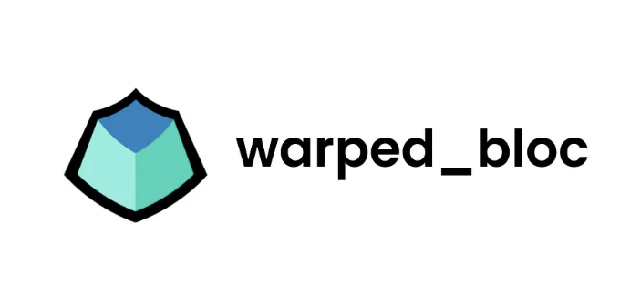

# 소개

[warped_bloc]은 저의 플러터(Flutter)에서 BLoC 패턴을 사용할 때 보일러플레이트 코드를 제거하기 위해 만든 패키지입니다. Felix Angelov가 만든 [flutter_bloc] 위에 구축되었습니다. [warped_bloc]은 특히 API 호출의 보일러플레이트 코드를 줄이기 위한 것입니다.

# 아이디어

<!-- ui-log 수평형 -->
<ins class="adsbygoogle"
  style="display:block"
  data-ad-client="ca-pub-4877378276818686"
  data-ad-slot="9743150776"
  data-ad-format="auto"
  data-full-width-responsive="true"></ins>
<component is="script">
(adsbygoogle = window.adsbygoogle || []).push({});
</component>

보일러플레이트 감소 아이디어는 BLoC와 같은 상태 관리 솔루션을 사용할 때 매번 API 호출을 처리할 때 세 가지 특정 상태가 연관되어 있다는 것입니다:

- 로딩 상태 (요청 처리 중 일 때)
- 데이터 상태 (요청이 성공하고 일부 데이터를 반환할 때)
- 오류 상태 (오류가 발생한 경우)

이러한 상태를 매번 작성하고, 이러한 상태를 if 문을 사용하거나 sealed 클래스를 사용할 때 .when()을 사용하여 처리하게 됩니다.

이는 모든 API 호출에 대해 일반화할 수 있어야 합니다.

<!-- ui-log 수평형 -->
<ins class="adsbygoogle"
  style="display:block"
  data-ad-client="ca-pub-4877378276818686"
  data-ad-slot="9743150776"
  data-ad-format="auto"
  data-full-width-responsive="true"></ins>
<component is="script">
(adsbygoogle = window.adsbygoogle || []).push({});
</component>

그래서 [warped_bloc]이 탄생되었어요.

# 사용 방법은?

[warped_bloc]은 미리 작성된 상태와 함께 제공됩니다:

- InitialState 클래스
- LoadingState 클래스
- ErrorState`T` 클래스
- DataState`T` 클래스

<!-- ui-log 수평형 -->
<ins class="adsbygoogle"
  style="display:block"
  data-ad-client="ca-pub-4877378276818686"
  data-ad-slot="9743150776"
  data-ad-format="auto"
  data-full-width-responsive="true"></ins>
<component is="script">
(adsbygoogle = window.adsbygoogle || []).push({});
</component>

아래는 BlocListener와 BlocBuilder를 사용하는 데 도움이 되는 유틸리티가 함께 제공됩니다:

- defaultBuilder 함수
- defaultListener 함수

확장할 수 있는 기본 클래스도 제공됩니다:

- AsyncCubit 클래스
- PaginatedAsyncCubit 클래스

<!-- ui-log 수평형 -->
<ins class="adsbygoogle"
  style="display:block"
  data-ad-client="ca-pub-4877378276818686"
  data-ad-slot="9743150776"
  data-ad-format="auto"
  data-full-width-responsive="true"></ins>
<component is="script">
(adsbygoogle = window.adsbygoogle || []).push({});
</component>

다음은 API 호출 시나리오에 대한 코드입니다 :

## Get Request

```js
import 'package:example/repo/home_repo.dart';
import 'package:warped_bloc/warped_bloc.dart';

class HomeLoaded extends DataState<List<String>> {
  const HomeLoaded(List<String> data) : super(data: data);
}

class HomeCubit extends AsyncCubit {
  final HomeRepo repo;

  HomeCubit({
    required this.repo,
  });

  fetch() {
    // 이 함수는 로딩 및 오류 상태를 처리합니다.
    handleDefaultStates(() async {
      final data = await repo.fetch();
      emit(HomeLoaded(data));
    });
  }
}
```

```js
class HomeRepo {
  final Dio dio;

  Future<List<String>> fetch() async {
    final res = await dio.get('/data');
    return List<String>.from(res.data);
  }
}
```

<!-- ui-log 수평형 -->
<ins class="adsbygoogle"
  style="display:block"
  data-ad-client="ca-pub-4877378276818686"
  data-ad-slot="9743150776"
  data-ad-format="auto"
  data-full-width-responsive="true"></ins>
<component is="script">
(adsbygoogle = window.adsbygoogle || []).push({});
</component>

이제 UI를 다음과 같이 간단하게 처리할 수 있습니다:

```js
BlocBuilder<HomeCubit, BlocState>(
  bloc: cubit,
  
  // defaultBuilder()가 로딩 및 오류 상태를 처리합니다
  builder: defaultBuilder<HomeLoaded, void>(
    onData: (context, state) {
      final data = state.data;
      return ListView.builder(
        itemCount: data.length,
        itemBuilder: (c, i) {
          var e = data[i];
          return Text(e);
        },
      );
    },
  ),
);
```

[warped_bloc] 패키지에서 제공하는 defaultBuilder를 사용했음을 알 수 있습니다. 이는 두 개의 제네릭 인자 defaultBuilder`T, E`를 사용합니다. T는 cubit에서 방출되는 데이터 상태의 유형을 나타내고, E는 ErrorState에서 데이터 변수의 유형입니다. E를 무시하고 항상 void를 데이터 유형으로 사용할 수 있습니다.

## 포스트 요청

<!-- ui-log 수평형 -->
<ins class="adsbygoogle"
  style="display:block"
  data-ad-client="ca-pub-4877378276818686"
  data-ad-slot="9743150776"
  data-ad-format="auto"
  data-full-width-responsive="true"></ins>
<component is="script">
(adsbygoogle = window.adsbygoogle || []).push({});
</component>

```dart
import 'package:warped_bloc/warped_bloc.dart';

class HomeActionSuccess extends DataState<void> {
  const HomeActionSuccess() : super(data: null);
}

class HomeActionCubit extends AsyncCubit {
  final HomeRepo repo;

  HomeActionCubit({required this.repo});

  updateProfile(ProfileRequest request) {
    handleDefaultStates(() async {
      await repo.updateProfile(profile);
      emit(const HomeActionSuccess());
    });
  }
}
```

```dart
class HomeRepo {
  final Dio dio;

  Future<List<String>> updateProfile(ProfileRequest request) async {
    final res = await dio.post('/profile', data: request.toMap());
    return List<String>.from(res.data);
  }
}
```

이제 UI를 다음과 같이 간단하게 처리할 수 있습니다:

```dart
final actionCubit = HomeActionCubit(repo: HomeRepo(dio: Dio()));
...
BlocListener<HomeActionCubit, BlocState>(
  listener: defaultListener<HomeActionSuccess, void>(),
  child: FloatingActionButton(
    onPressed: () {
      // actionCubit.someAction();
      actionCubit.someFailedAction();
    },
    child: const Icon(Icons.add),
  ),
);
...
```

<!-- ui-log 수평형 -->
<ins class="adsbygoogle"
  style="display:block"
  data-ad-client="ca-pub-4877378276818686"
  data-ad-slot="9743150776"
  data-ad-format="auto"
  data-full-width-responsive="true"></ins>
<component is="script">
(adsbygoogle = window.adsbygoogle || []).push({});
</component>

표 태그를 Markdown 형식으로 변경하세요.

<!-- ui-log 수평형 -->
<ins class="adsbygoogle"
  style="display:block"
  data-ad-client="ca-pub-4877378276818686"
  data-ad-slot="9743150776"
  data-ad-format="auto"
  data-full-width-responsive="true"></ins>
<component is="script">
(adsbygoogle = window.adsbygoogle || []).push({});
</component>

```js
class PaginationParam {
  final int page;
  final int perPage;

  PaginationParam({
    required this.page,
    required this.perPage,
  });

  Map<String, dynamic> toMap() {
    return {
      "page": page,
      "per_page": perPage,
    };
  }
}
```

그런 다음 UI에서 처리할 수 있습니다:

```js
...
BlocBuilder<PaginatedHomeCubit, BlocState>(
  builder: defaultBuilder<PaginatedHomeLoaded, void>(
    onData: (context, state) {
      final data = state.data;
      return PaginatedBuilder(
        builder: (c, controller) {
          return ListView.builder(
            controller: controller,
            itemCount: data.length,
            itemBuilder: (c, i) {
              var e = data[i];
              return ListTile(
                title: Text("${i + 1}$e"),
              );
            },
          );
        },
        onFetchMore: context.read<PaginatedHomeCubit>().onFetchMore,
      );
    },
  ),
)
...
```

이것은 [warped_bloc] 패키지로 할 수있는 일 중 막연한 한 부분에 불과합니다.