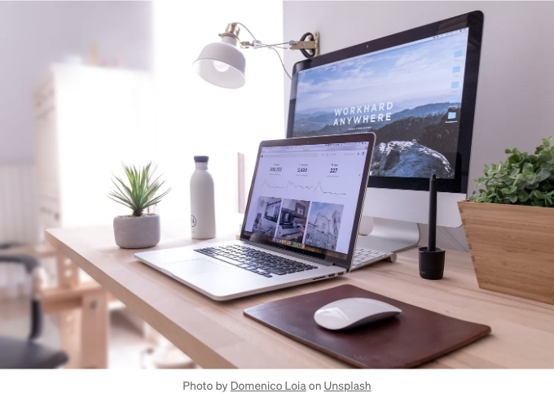

웹사이트를 디자인했다고 상상해보세요. 컴퓨터 화면에서 멋진 모습을 띠는데, 그것이 스마트폰에서는 축소되거나 붕괴되어 버리는 상황이라면 어떨까요? 짜증나시죠? 여기서 반응형 디자인이 등장합니다. 웹사이트에 마법을 부리는 것처럼, 모든 기기에 맞게 자동으로 조정되어 화면에 표시됩니다. 그것이 바로 반응형 디자인이랍니다.

반응형 디자인이 왜 중요한가요? 웹을 어떻게 둘러보는지 생각해보세요. 요즘은 아마 대부분의 사람이 스마트폰으로 인터넷을 이용할 것입니다. 사실, 대부분의 사람들이 인터넷에 접속할 때는 스마트폰을 사용합니다. 만약 여러분의 웹사이트가 모바일 친화적이지 않다면, 여러분의 대상 독자들 중 상당 부분을 놓치고 있다고 볼 수 있습니다. 반응형 디자인은 어느 기기를 사용하더라도 모두가 원활한 경험을 할 수 있도록 해 줍니다.

그럼, 이것은 어떻게 작동할까요? 기본 아이디어는 다음과 같습니다. 웹사이트는 텍스트, 이미지, 메뉴와 같은 요소들을 표시하는 방법을 브라우저에 알려주는 코드를 사용하여 구축됩니다. 반응형 디자인은 이 코드에서 특별한 도구를 활용하여 화면 크기에 따라 레이아웃을 조정합니다. 주변 환경에 맞게 축소 혹은 늘어날 수 있는 웹사이트를 상상해보세요.

<!-- ui-log 수평형 -->

<ins class="adsbygoogle"
			style="display:block"
			data-ad-client="ca-pub-4877378276818686"
			data-ad-slot="9743150776"
			data-ad-format="auto"
			data-full-width-responsive="true"></ins>
<component is="script">
(adsbygoogle = window.adsbygoogle || []).push({});
</component>

반응형 디자인의 주요 기능 몇 가지를 소개해 드리겠습니다:

- 유연한 그리드: 체커판과 같이 그리드 구조로 구성된 웹사이트 레이아웃을 상상해 보세요. 반응형 디자인은 화면에 맞게 확장하거나 축소할 수 있는 유연한 그리드를 사용합니다.
- 유연한 이미지: 누구나 핸드폰에서 흐릿한 사진을 원하지 않죠. 반응형 디자인은 이미지를 자동으로 크기 조정하여 어떤 기기에서든 잘 보이도록 합니다.
- 미디어 쿼리: 이것들은 웹사이트가 기기에 묻는 질문과 같습니다. 예를 들어, "화면이 넓은가 좁은가?" 기기가 대답하면 웹사이트는 레이아웃을 그에 맞게 조정합니다.

반응형 디자인의 이점:

- 만족한 사용자: 모든 기기에서 잘 작동하는 웹사이트는 방문자에게 만족감을 줘서 머물러 있고 탐험할 가능성이 높아집니다.
- 더 좋은 검색 엔진 최적화(SEO): Google과 같은 검색 엔진은 모바일 친화적인 웹사이트를 선호합니다. 반응형 디자인은 웹사이트의 순위를 높일 수 있습니다.
- 비용 절감: 서로 다른 기기용 별도 웹사이트를 만드는 대신, 반응형 디자인을 통해 모두에게 동작하는 하나의 웹사이트를 관리할 수 있습니다.

<!-- ui-log 수평형 -->

<ins class="adsbygoogle"
			style="display:block"
			data-ad-client="ca-pub-4877378276818686"
			data-ad-slot="9743150776"
			data-ad-format="auto"
			data-full-width-responsive="true"></ins>
<component is="script">
(adsbygoogle = window.adsbygoogle || []).push({});
</component>

반응형 웹사이트를 만드는 것은 코딩 지식이 필요하지만, 반응형 디자인 기능을 제공하는 웹사이트 빌더도 있어요.

여기 몇 가지 주요 개념이 있어요

- 유연한 그리드: 신축성 있는 웹 레이아웃이 그리드 시스템으로 구축된 것을 상상해봐요, 마치 늘어지는 체크무늬판 같은 거죠. 이 그리드는 화면 크기에 따라 페이지 요소를 조정하고 크기를 변경해요.
- 유연한 미디어: 텍스트, 이미지 및 비디오는 다양한 화면 크기에 맞게 적응해야 해요. 반응형 디자인은 이 요소들이 자동으로 크기를 조정하여 다양한 디바이스에서 가독성과 사용성을 유지할 수 있도록 해요.
- 미디어 쿼리: 이것을 웹사이트가 디바이스에 묻는 질문으로 생각해보세요. 화면이 넓은 건지 좁은 건지? 세로 모드인지 가로 모드인지? 이 답변을 기반으로 (코드의 미디어 쿼리를 사용하여), 웹사이트는 특정 디바이스에 맞게 레이아웃을 조정해요.
- 브레이크포인트: 이것은 웹사이트 레이아웃이 크게 변경되는 특정 화면 너비들이에요. 예를 들어, 웹사이트는 1024px(데스크탑)보다 넓은 화면 또는 768px부터 1024px 사이인 화면(태블릿)에 대해 서로 다른 레이아웃을 가질 수 있어요.
- 모바일 우선 접근 방식: 가장 좋은 방법은 먼저 모바일 화면용으로 웹사이트를 디자인한 후, 그것을 큰 디바이스용으로 개선하는 것이에요. 이렇게 하면 핵심 콘텐츠와 기능이 작은 화면에서 완벽하게 동작함을 보장할 수 있어요.

간단한 반응형 디자인을 가진 웹페이지를 HTML과 CSS를 사용하여 만들어봐요. 아래는 설명과 함께 코드예요:

<!-- ui-log 수평형 -->

<ins class="adsbygoogle"
			style="display:block"
			data-ad-client="ca-pub-4877378276818686"
			data-ad-slot="9743150776"
			data-ad-format="auto"
			data-full-width-responsive="true"></ins>
<component is="script">
(adsbygoogle = window.adsbygoogle || []).push({});
</component>

마크다운 (index.md):

```md
# 반응형 웹사이트 데모

- HTML 구조 기본으로 헤더, 내비게이션, 메인 콘텐츠 섹션 및 푸터가 포함됩니다.
- `meta name="viewport" content="width=device-width, initial-scale=1.0"` 태그는 반응형 디자인에 중요합니다. 이는 브라우저에게 디바이스에 따라 웹사이트 너비를 조정하도록 하고 초기 확대 수준을 100%로 설정합니다.
```

<!-- ui-log 수평형 -->

<ins class="adsbygoogle"
			style="display:block"
			data-ad-client="ca-pub-4877378276818686"
			data-ad-slot="9743150776"
			data-ad-format="auto"
			data-full-width-responsive="true"></ins>
<component is="script">
(adsbygoogle = window.adsbygoogle || []).push({});
</component>

CSS (style.css):

```js
body {
  font-family: sans-serif;
  margin: 0;
  padding: 0;
}
header {
  background-color: #f1f1f1;
  padding: 20px;
}
h1 {
  text-align: center;
}
nav {
  display: flex;
  justify-content: space-around;
}
a {
  text-decoration: none;
  color: black;
  padding: 10px;
}
main {
  padding: 20px;
}
section {
  margin-bottom: 20px;
}
img {
  width: 100%; /* 이미지 크기를 자동 조정합니다. */
}
/* 다양한 화면 크기에 대한 미디어 쿼리 */
@media screen and (max-width: 768px) {
  /* 768px 미만 화면에 대한 스타일 지정 */
  h1 {
    font-size: 1.5rem;
  }
  p {
    font-size: 1rem;
  }
  nav {
    flex-direction: column; /* 네비게이션 링크들을 수직으로 배치합니다. */
  }
}
```

설명:

- 이 CSS는 기본적인 레이아웃을 위한 HTML 요소들을 스타일링합니다.
- img { width: 100%; } 규칙은 이미지가 사용 가능한 공간에 맞게 자동으로 크기를 조정합니다.
- @media screen and (max-width: 768px) 블록이 중요합니다. 이 미디어 쿼리는 최대 폭이 768px인 화면 (태블릿 및 스마트폰에 일반적인 크기)에 특정한 스타일을 적용합니다.
- 미디어 쿼리 내에서는 글꼴 크기를 조정하고 작은 화면에서 가독성을 높이기 위해 네비게이션 레이아웃을 수직으로 변경합니다.

<!-- ui-log 수평형 -->

<ins class="adsbygoogle"
			style="display:block"
			data-ad-client="ca-pub-4877378276818686"
			data-ad-slot="9743150776"
			data-ad-format="auto"
			data-full-width-responsive="true"></ins>
<component is="script">
(adsbygoogle = window.adsbygoogle || []).push({});
</component>

테스트 중입니다:

index.html과 style.css 파일을 동일한 폴더에 저장하고 웹 브라우저에서 index.html 파일을 열어보세요. 화면 크기를 조절하여 웹사이트가 다양한 화면 크기에 적응하는 모습을 확인해보세요. 레이아웃이 조정되고 폰트 크기가 변경되며 네비게이션이 작은 화면에는 스택 구조로 표시됩니다.

또한 CSS를 사용하여 반응형 디자인 개념을 보여주는 일부 코드 스니펫을 아래에 제공합니다:

1. 유동 그리드:

<!-- ui-log 수평형 -->

<ins class="adsbygoogle"
			style="display:block"
			data-ad-client="ca-pub-4877378276818686"
			data-ad-slot="9743150776"
			data-ad-format="auto"
			data-full-width-responsive="true"></ins>
<component is="script">
(adsbygoogle = window.adsbygoogle || []).push({});
</component>

```js
.container {
  display: grid;
  grid-template-columns: repeat(auto-fit, minmax(300px, 1fr));
  gap: 20px; /* 그리드 아이템 간의 간격 */
  padding: 20px;
}
.item {
  background-color: #f1f1f1;
  padding: 10px;
  text-align: center;
}
```

설명:

- 이 코드는 .container 클래스로 그리드 컨테이너를 정의합니다.
- grid-template-columns: repeat(auto-fit, minmax(300px, 1fr));는 유연한 그리드를 생성합니다.
- repeat(auto-fit, ...): 사용 가능한 공간에 맞게 자동으로 열을 만듭니다.
- minmax(300px, 1fr): 각 그리드 아이템의 최소 너비를 300px로 설정하고 남은 공간을 비례적으로 채우도록 허용합니다.
- .item 클래스는 배경색, 패딩 및 텍스트 정렬로 각 그리드 아이템을 스타일링합니다.

2. Flexbox:

<!-- ui-log 수평형 -->

<ins class="adsbygoogle"
			style="display:block"
			data-ad-client="ca-pub-4877378276818686"
			data-ad-slot="9743150776"
			data-ad-format="auto"
			data-full-width-responsive="true"></ins>
<component is="script">
(adsbygoogle = window.adsbygoogle || []).push({});
</component>

```js
.flex-container {
  display: flex;
  justify-content: space-between; /* 아이템을 균등하게 배치합니다 */
  align-items: center; /* 아이템을 수직으로 중앙 정렬합니다 */
  gap: 20px; /* 아이템 간의 간격을 설정합니다 */
}
.flex-item {
  flex: 1; /* 아이템을 유연하게 만들어 사용 가능한 공간을 공유합니다 */
  background-color: #f1f1f1;
  padding: 10px;
}
```

설명:

- 이 코드는 .flex-container 클래스로 유연한 박스 컨테이너를 정의합니다.
- display: flex;는 컨테이너에 대해 유연한 박스 레이아웃을 활성화합니다.
- justify-content: space-between;는 각 아이템을 균등하게 배치하고 사이에 공간을 둡니다.
- align-items: center;는 컨테이너의 수직으로 아이템을 중앙 정렬합니다.
- .flex-item 클래스는 각 유연한 아이템에 배경색과 패딩을 추가하고 flex: 1;로 아이템이 유연하게 만들어 컨테이너 내에서 사용 가능한 공간을 공유합니다.

3. 미디어 쿼리:

<!-- ui-log 수평형 -->

<ins class="adsbygoogle"
			style="display:block"
			data-ad-client="ca-pub-4877378276818686"
			data-ad-slot="9743150776"
			data-ad-format="auto"
			data-full-width-responsive="true"></ins>
<component is="script">
(adsbygoogle = window.adsbygoogle || []).push({});
</component>

```js
/* 기본 스타일 */
body {
  font-size: 16px;
}
.image {
  width: 80%; /* 기본 이미지 너비 */
}
/* 768px 미만의 화면에 대한 스타일 */
@media screen and (max-width: 768px) {
  body {
    font-size: 14px;
  }
  .image {
    width: 100%; /* 작은 화면에 이미지 너비를 100%로 조정합니다 */
  }
}
```

설명:

- 이 코드는 폰트 크기와 이미지 너비에 대한 기본 스타일을 설정합니다.
- 미디어 쿼리는 최대 너비가 768px인 화면을 대상으로 합니다.
- 미디어 쿼리 내에서 폰트 크기를 조정하여 가독성을 높이고 작은 화면에 맞게 이미지 너비를 100%로 변경합니다.

이것은 몇 가지 예시에 불과하며, 반응형 디자인은 훨씬 더 복잡해질 수 있습니다. 그러나 이러한 코드는 유동적인 그리드, 플렉스박스 및 미디어 쿼리의 핵심 개념을 보여줌으로써 반응형 레이아웃을 구현하는데 도움이 됩니다.```

<!-- ui-log 수평형 -->

<ins class="adsbygoogle"
			style="display:block"
			data-ad-client="ca-pub-4877378276818686"
			data-ad-slot="9743150776"
			data-ad-format="auto"
			data-full-width-responsive="true"></ins>
<component is="script">
(adsbygoogle = window.adsbygoogle || []).push({});
</component>

결론적으로, 반응형 디자인은 여러분의 웹사이트가 거대한 데스크톱 화면부터 작은 스마트폰까지 어떤 기기에서도 원활하게 작동되도록 하는 마법과 같은 기술입니다. 똑똑한 코딩 기술을 사용하여 웹사이트는 레이아웃과 콘텐츠를 사용자의 화면 크기에 맞게 조정할 수 있습니다. 이는 누구나 웹을 탐색하는 방식에 관계없이 모두에게 원활한 경험을 제공합니다. 반응형 디자인은 더 이상 선택의 문제가 아닌, 오늘날의 모바일 최우선 세계에서 여러분의 웹사이트를 사용자 친화적이고 접근성있게 유지하기 위한 필수불가결한 요소입니다.

