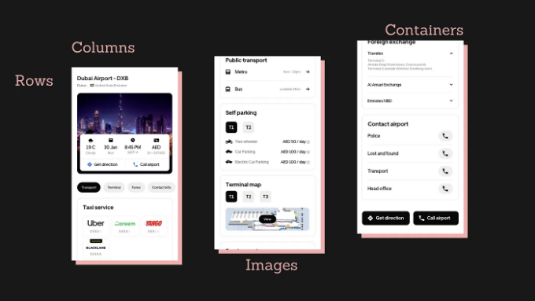
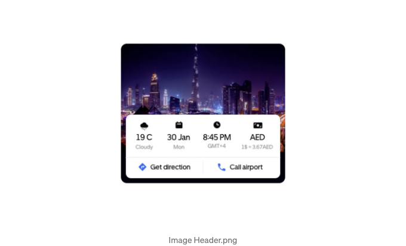
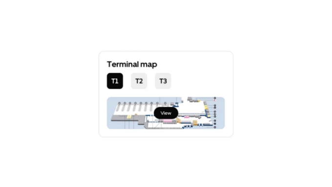

# 소개

가끔씩 사랑하는 프레임워크에 대한 업데이트가 나오고 그것이 동일한 기본을 변경하려고 할 때가 있습니다. 제가 알아채지 못한 무언가가 있는지도 모르지만, 저는 플러터의 불규칙성을 프레임워크 업데이트 그 자체에 돌리는 것을 선호합니다. 이 블로그를 쓰는 시점에서 플러터에서 무슨 일이 벌어지고 있는지 일부 점들을 기록하는 데 도움을 드리겠습니다.



# 열, 행 및 이상한 차원들

<!-- ui-log 수평형 -->
<ins class="adsbygoogle"
  style="display:block"
  data-ad-client="ca-pub-4877378276818686"
  data-ad-slot="9743150776"
  data-ad-format="auto"
  data-full-width-responsive="true"></ins>
<component is="script">
(adsbygoogle = window.adsbygoogle || []).push({});
</component>

이 두 위젯은 자식 위젯의 높이와 너비를 차지합니다. 이제, 내 코딩 역사 중 어딘가에서 그들이 부모 위젯에 의해 제공된 전체 높이와 너비를 차지했을 때가 있었던 것 같아요. 그러나 현재는 이렇게 되었어요. 그러니까 이 특정 요소를 생성해야 한다면:



여기 위젯 트리를 이해해야 해요. 각 요소를 가능한 한 작게 분해하고, 어디에 column, row, container를 넣을지 파악해야 해요. 똑똑한 사람이면 stack을 사용했을 거예요. 우리 둘 모두에게 불행하게도, 저는 가끔 그렇게 똑똑하지 않아요.

이미지를 설정된 높이 컨테이너에 배경으로 넣었어요. 이 높이는 디자인에서 제공되었지만, 기억할 것이 있어요:

<!-- ui-log 수평형 -->
<ins class="adsbygoogle"
  style="display:block"
  data-ad-client="ca-pub-4877378276818686"
  data-ad-slot="9743150776"
  data-ad-format="auto"
  data-full-width-responsive="true"></ins>
<component is="script">
(adsbygoogle = window.adsbygoogle || []).push({});
</component>

화면 크기에 따라 다양하게 변하는 위젯을 만들어보세요. 가능한 곳에서는 정적 제약을 피하세요.

```js
Container(
        height: 285,  // 문제 생성자
        width: double.infinity,
        decoration: BoxDecoration(
            image: const DecorationImage(
              image: AssetImage("lib/assets/images/dubai.jpeg"),
              fit: BoxFit.cover,
            ),
            borderRadius: BorderRadius.circular(12)),
)
```

이 실수로 배울테니 걱정하지 마세요. 이미지 사용 방법 섹션에서 이 문제를 고치는 방법을 알려줄 테니 기다려 주세요. 그러니까, 이미지를 확인한 뒤에 다음 기능인 통계 막대를 확인해 보세요. 요소 위의 공간 높이가 카드 높이와 같다는 걸 알 수 있습니다. 여기서 컨테이너에 정적 높이를 지정했기 때문에, stats 카드의 높이를 제공된 높이의 절반으로 쉽게 지정하고 다음과 같이 하단에 맞춥니다:

```js
Container(
          height: 285,
          width: double.infinity,
          decoration: BoxDecoration(
              image: const DecorationImage(
                image: AssetImage("lib/assets/images/dubai.jpeg"),
                fit: BoxFit.cover,
              ),
              borderRadius: BorderRadius.circular(12)),
          padding: const EdgeInsets.only(left: 10, right: 10, bottom: 10),
          child: Align(
            alignment: Alignment.bottomCenter,
            child: Container(height: 142, child: HeroCard(theme: theme)),
          )
)
```

<!-- ui-log 수평형 -->
<ins class="adsbygoogle"
  style="display:block"
  data-ad-client="ca-pub-4877378276818686"
  data-ad-slot="9743150776"
  data-ad-format="auto"
  data-full-width-responsive="true"></ins>
<component is="script">
(adsbygoogle = window.adsbygoogle || []).push({});
</component>

하지만 이미지 크기에 맞게 부모 컨테이너를 동적으로 만들었다면, 컬럼을 사용하여 높이를 동적으로 관리하는 방법이 있습니다. 이제 컬럼 위젯이 자식 위젯에 맞게 맞추어지기 때문에 정말 유용합니다.

```js
child: Column(
          children: [
            Spacer(),
            Expanded(child: HeroCard(theme: theme)),
          ],
        ),
)
```

Expanded 위젯은 Column이 부모인 Container의 최대 높이를 가져가고, HeroCard 위젯도 동일하게 처리합니다. Spacer 위젯은 가능한 많은 빈 공간을 만듭니다. 함께 사용하면 카드와 빈 공간이 항상 같아지도록 보장합니다.

그럼 여기서 말하는 위젯의 동적 높이란 무엇을 의미할까요?

<!-- ui-log 수평형 -->
<ins class="adsbygoogle"
  style="display:block"
  data-ad-client="ca-pub-4877378276818686"
  data-ad-slot="9743150776"
  data-ad-format="auto"
  data-full-width-responsive="true"></ins>
<component is="script">
(adsbygoogle = window.adsbygoogle || []).push({});
</component>

```dart
class HeroCard extends StatelessWidget {
  HeroCard({super.key, required this.theme});

  LightTheme theme;

  @override
  Widget build(BuildContext context) {
    return Container(
      decoration: BoxDecoration(color: theme.primaryColor, borderRadius: BorderRadius.circular(10)),
      child: Column(
        children: [
          Padding(
            padding: EdgeInsets.only(left: 20, right: 14, top: 14, bottom: 10),
            child: Row(mainAxisAlignment: MainAxisAlignment.spaceBetween, children: [
              ImageHeaderTag(theme: theme, icon: weather, mainLabel: "19℃", secondaryLabel: "흐림"),
              ImageHeaderTag(theme: theme, icon: calender, mainLabel: "1월 30일", secondaryLabel: "월"),
              ImageHeaderTag(theme: theme, icon: time, mainLabel: "오후 8:45", secondaryLabel: "GMT+4"),
              ImageHeaderTag(theme: theme, icon: currency, mainLabel: "AED", secondaryLabel: "1\$ = 3.67 AD"),
            ]),
          ),
          Container(height: 1, color: theme.accentColor1),
          Expanded(
            child: SizedBox(
              width: double.infinity,
              child: Row(
                mainAxisAlignment: MainAxisAlignment.spaceEvenly,
                children: [
                  HeaderButtons(
                      theme: theme,
                      icon: direction,
                      label: "길 찾기",
                      onTap: () => ScaffoldMessenger.of(context).showSnackBar(SnackBar(
                            duration: Duration(seconds: 1),
                            content: Text('길 찾는 중'),
                          ))),
                  Padding(
                    padding: EdgeInsets.only(top: 10, bottom: 10),
                    child: Container(
                      width: 1,
                      color: theme.accentColor1,
                    ),
                  ),
                  HeaderButtons(
                      theme: theme,
                      icon: call,
                      label: "공항 전화",
                      onTap: () => ScaffoldMessenger.of(context).showSnackBar(SnackBar(
                            duration: Duration(seconds: 1),
                            content: Text('공항에 전화 걸기 중'),
                          ))),
                ],
              ),
            ),
          )
        ],
      ),
    );
  }
}
```

이 코드에서 위젯의 높이를 지정한 곳은 없고(너비가 1인 수평선을 가진 컨테이너를 제외하고) 모두 패딩 및 텍스트, 아이콘 등의 자연스러운 높이를 사용하고 있습니다. 이렇게 하면 애플리케이션에서 RenderBox Overflow 오류를 방지할 수 있습니다(대부분).

# Column 위젯 가운데 정렬하기

Column 위젯 및 따라서 일련의 위젯을 화면에 가운데 정렬하려면 여러 가지 방법이 있지만 가장 간단한 답을 제공해 드리겠습니다. Column의 폭을 double.infinity를 사용하여 너비의 100%로 설정하거나 너비가 100%인 자식 위젯을 가져야 합니다.

<!-- ui-log 수평형 -->
<ins class="adsbygoogle"
  style="display:block"
  data-ad-client="ca-pub-4877378276818686"
  data-ad-slot="9743150776"
  data-ad-format="auto"
  data-full-width-responsive="true"></ins>
<component is="script">
(adsbygoogle = window.adsbygoogle || []).push({});
</component>

```dart
Scaffold(
        backgroundColor: theme.backgroundColor,
        body: Column(
          mainAxisAlignment: MainAxisAlignment.center,
          crossAxisAlignment: CrossAxisAlignment.center,
          children: [
            // 여기에 있는 children은
            // 부모 위젯에서 가운데 정렬됩니다
            // 여기에 Scaffold
          ]
        )
);
```

# 이미지 작업

이미지를 다루는 더 나은 방법부터 시작해봅시다. 이 위젯에 대해 무엇을 보시나요?



<!-- ui-log 수평형 -->
<ins class="adsbygoogle"
  style="display:block"
  data-ad-client="ca-pub-4877378276818686"
  data-ad-slot="9743150776"
  data-ad-format="auto"
  data-full-width-responsive="true"></ins>
<component is="script">
(adsbygoogle = window.adsbygoogle || []).push({});
</component>

| 폴더 | 이름 | 크기 |
|------|------|------|
| 폴더1 | 파일1 | 2KB  |
| 폴더2 | 파일2 | 3KB  |


<!-- ui-log 수평형 -->
<ins class="adsbygoogle"
  style="display:block"
  data-ad-client="ca-pub-4877378276818686"
  data-ad-slot="9743150776"
  data-ad-format="auto"
  data-full-width-responsive="true"></ins>
<component is="script">
(adsbygoogle = window.adsbygoogle || []).push({});
</component>

"double.infinity"은 이미지의 최대 너비로 설정하고 이미지를 BoxFit.fitWidth로 설정합니다. 이렇게 하면 이미지가 너비에 맞게 늘어나며 스택 위젯을 포함하는 컨테이너는 이미지의 너비와 높이를 얻습니다(Stack이 없어도 작동하지만, 다른 위젯을 겹쳐 놓으려면 Stack이 필요합니다).

배경으로 이미지를 넣는 것과 어떻게 다른가요? 이미지를 배경으로 넣을 때, 컨테이너는 이미지의 치수를 얻지 않고 반대로 작동합니다. 그래서 사용 사례에 따라 다를 수 있지만, 디자인에 표시된 대로 원한다면 가능한 최상의 방법입니다.

이제 스택의 치수가 이미지와 일치하므로, 엘리베이트된 버튼에 중앙 위젯을 사용하고 하루를 마무리할 수 있습니다.

# 결론

<!-- ui-log 수평형 -->
<ins class="adsbygoogle"
  style="display:block"
  data-ad-client="ca-pub-4877378276818686"
  data-ad-slot="9743150776"
  data-ad-format="auto"
  data-full-width-responsive="true"></ins>
<component is="script">
(adsbygoogle = window.adsbygoogle || []).push({});
</component>

플러터에서 혼란스러운 시간을 함께 해결해 드리고 싶어요. 글을 쓰는 걸 좋아하고 배우는 걸 즐겨 하니까 새로 알게 된 것, 발생한 오류, 플러터 커뮤니티에서 다루지 않은 내용 중 내가 해결하고 이해한 것들을 계속 추적하려고 노력할 거예요. 여러분을 도와드리기 위해요. 여러분의 신이 되어드리기 위해요. 마치 column 위젯이 부모 높이를 사용하는 방법, 컨테이너가 모든 공간을 채우는 방법, 강력한 AI 플러터 애플리케이션을 만드는 방법 같은 질문들의 바다를 넘어 가도록 도와드리겠어요. 아마 마지막 건 아니겠지만요.