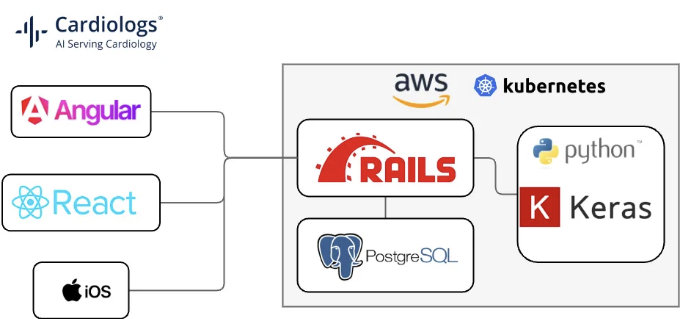
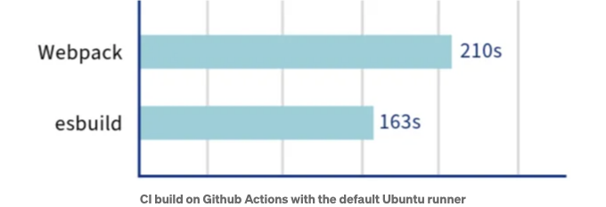
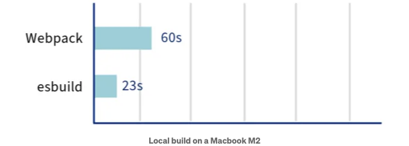
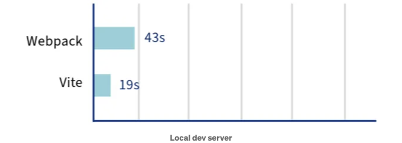
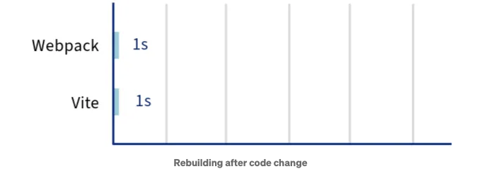

카디올로그스(Cardiologs)에서는 인공지능(AI)을 활용하여 의료 전문가들이 심전도(Electrocardiogram, ECG) 분석 시간을 단축할 수 있는 애플리케이션을 개발하고 있습니다.

우리는 다음 기술 스택으로 구축된 SaaS 오퍼링을 개발하고 있습니다:



<!-- ui-log 수평형 -->
<ins class="adsbygoogle"
  style="display:block"
  data-ad-client="ca-pub-4877378276818686"
  data-ad-slot="9743150776"
  data-ad-format="auto"
  data-full-width-responsive="true"></ins>
<component is="script">
(adsbygoogle = window.adsbygoogle || []).push({});
</component>

최근에 React와 Vite를 사용하여 새 제품을 만들었고, Vite가 개발자 경험을 더 빠르게 만들어 준다는 사실에 깜짝 놀랐습니다.

저희 Angular 앱은 259개의 컴포넌트, 47개의 모듈, 800,000줄의 코드로 꽤 큽니다. React 스택에 비해 시작 속도가 느린 것 같아서 이를 개선하고자 했어요.

v17부터 Angular 팀이 esbuild 지원을 추가했습니다: https://angular.io/guide/esbuild

Webpack에서 esbuild로 전환해보고, 성능 면에서 어떤 변화가 있는지 확인해 봅시다.

<!-- ui-log 수평형 -->
<ins class="adsbygoogle"
  style="display:block"
  data-ad-client="ca-pub-4877378276818686"
  data-ad-slot="9743150776"
  data-ad-format="auto"
  data-full-width-responsive="true"></ins>
<component is="script">
(adsbygoogle = window.adsbygoogle || []).push({});
</component>

# 변경해야 했던 내용

우리는 Nx를 사용하고 프로젝트.json에서 빌드 실행기를 변경하여 esbuild를 활성화했습니다:

```js
    "build": {
-      "executor": "@angular-builders/custom-webpack:browser",
+      "executor": "@angular-devkit/build-angular:browser-esbuild",
    }
```

이 변경으로 몇 가지가 문제가 발생할 것입니다. 다음은 변경해야 했던 사항입니다:

<!-- ui-log 수평형 -->
<ins class="adsbygoogle"
  style="display:block"
  data-ad-client="ca-pub-4877378276818686"
  data-ad-slot="9743150776"
  data-ad-format="auto"
  data-full-width-responsive="true"></ins>
<component is="script">
(adsbygoogle = window.adsbygoogle || []).push({});
</component>

# ESM 기본 가져오기

우리는 ES6 모듈 구문을 지원하지 않는 몇 가지 CommonJS 모듈을 가져옵니다, 예를 들어 momentjs:

```js
▲ [경고] "moment"를 호출하면 실행 시 충돌이 발생할 수 있습니다. 이는 호출하는 것이 함수가 아닌 가져오기 네임스페이스 객체임을 나타냅니다 [call-import-namespace]

  대신 기본 가져오기로 "moment"를 변경하는 것을 고려해 보세요:

    libs/help/src/lib/help/manual/manual.component.ts:5:7:
      5 │ import * as moment from 'moment';
        │        ~~~~~~~~~~~
        ╵        moment
```

이 오류는 tsconfig.json 파일에 이 플래그를 추가하여 수정할 수 있습니다:

<!-- ui-log 수평형 -->
<ins class="adsbygoogle"
  style="display:block"
  data-ad-client="ca-pub-4877378276818686"
  data-ad-slot="9743150776"
  data-ad-format="auto"
  data-full-width-responsive="true"></ins>
<component is="script">
(adsbygoogle = window.adsbygoogle || []).push({});
</component>

```js
  {
    "compilerOptions": {
+     "esModuleInterop": true,
    }
  }
```

이후에 모든 기본 import를 다음과 같이 변경하십시오:

```js
-  import * as moment from 'moment';
+  import moment from 'moment';
```

또한 우리는 번들 크기 문제에 대비하여 코드베이스에서 moment를 date-fns로 대체하고 있습니다.

<!-- ui-log 수평형 -->
<ins class="adsbygoogle"
  style="display:block"
  data-ad-client="ca-pub-4877378276818686"
  data-ad-slot="9743150776"
  data-ad-format="auto"
  data-full-width-responsive="true"></ins>
<component is="script">
(adsbygoogle = window.adsbygoogle || []).push({});
</component>

https://angular.io/guide/esbuild#esm-default-imports-vs-namespace-imports을(를) 참조하세요.

# 웹팩과 함께 사용하는 Node 환경 변수

저희의 웹팩 빌드는 @angular-builders/custom-webpack 빌더를 사용하여 빌드 시점에 환경 변수를 가져와 브라우저로 전달했습니다:

```js
function getClientEnvironment() {
  // NX_* 환경 변수를 가져와 응용 프로그램에 주입되도록 웹팩 구성의 DefinePlugin을 통해 준비합니다.
  return {
    'process.env': Object.keys(process.env)
     .reduce((env, key) => {
       if (/^NX_/i.test(key)) {
         env[key] = JSON.stringify(process.env[key]);
       }
       return env;
    }, {});
  };
}
```

<!-- ui-log 수평형 -->
<ins class="adsbygoogle"
  style="display:block"
  data-ad-client="ca-pub-4877378276818686"
  data-ad-slot="9743150776"
  data-ad-format="auto"
  data-full-width-responsive="true"></ins>
<component is="script">
(adsbygoogle = window.adsbygoogle || []).push({});
</component>

그럼 빌드 중에는 변수를 전달해야 합니다: NX_TAG=pr-123 npx nx build. 위의 사용자 정의 웹팩 구성은 브라우저에서 node 애플리케이션과 같은 방식으로 process.env로 환경 변수를 사용할 수 있도록 합니다.

esbuild에서는 더 이상 이러한 환경 변수를 간단하게 가져올 수 있는 방법이 없습니다. 결과적으로 브라우저에 process.env를 삽입하려고 노력하는 대신에 Github Actions 워크플로우에서 빌드 시간에 간단히 JSON 파일을 작성하는 방법으로 대체합니다:

```js
- name: Pass the build tag into the app without using process.env
  run: printf '{"tag":"%s"}\n' "${ inputs.tag }" > env.json
```

```js
+  import env from './env.json';
   export default {
     APP_ENV: getEnv(),
-    APP_VERSION: process.env.NX_TAG ?? 'dev',
+    APP_VERSION: env.tag,
   };
```

<!-- ui-log 수평형 -->
<ins class="adsbygoogle"
  style="display:block"
  data-ad-client="ca-pub-4877378276818686"
  data-ad-slot="9743150776"
  data-ad-format="auto"
  data-full-width-responsive="true"></ins>
<component is="script">
(adsbygoogle = window.adsbygoogle || []).push({});
</component>

# 상대적 SCSS 가져오기

일부 SCSS @import가 작동하지 않았습니다:

```js
✘ [에러] 가져올 스타일시트를 찾을 수 없습니다.
  ╷
1 │ @import 'libs/heartbeat/src/lib/assets/scss/hb-foundations';
  │         ^^^^^^^^^^^^^^^^^^^^^^^^^^^^^^^^^^^^^^^^^^^^^^^^^^^
  ╵
```

이것들은 한 Nx 라이브러리에서 다른 라이브러리로의 상대적 가져오기이며, libs 폴더는 저장소의 루트에 있습니다.

<!-- ui-log 수평형 -->
<ins class="adsbygoogle"
  style="display:block"
  data-ad-client="ca-pub-4877378276818686"
  data-ad-slot="9743150776"
  data-ad-format="auto"
  data-full-width-responsive="true"></ins>
<component is="script">
(adsbygoogle = window.adsbygoogle || []).push({});
</component>

하나의 해결책은 올바른 상대 경로를 사용하는 것이지만, 이는 많은 파일을 업데이트해야 하며 코드를 더럽힐 수 있다고 생각됩니다.

```js
+ @import '../../../../heartbeat/src/lib/assets/scss/hb-foundations';
- @import 'libs/heartbeat/src/lib/assets/scss/hb-foundations';
```

또 다른 해결책은 프로젝트.json을 사용하여 저장소의 루트를 경로로 추가하는 것입니다. 이는 SCSS 임포트에 사용할 수 있는 경로를 정의합니다:

```js
      "build": {
        "executor": "@angular-devkit/build-angular:browser-esbuild",
        "options": {        
          "stylePreprocessorOptions": {
            "includePaths": [
               "node_modules",
+              ""
            ]
          }
```

<!-- ui-log 수평형 -->
<ins class="adsbygoogle"
  style="display:block"
  data-ad-client="ca-pub-4877378276818686"
  data-ad-slot="9743150776"
  data-ad-format="auto"
  data-full-width-responsive="true"></ins>
<component is="script">
(adsbygoogle = window.adsbygoogle || []).push({});
</component>

# 성능 벤치마크

이제 우리가 실행 중이니까, 빌드 성능이 어떻게 영향을 받는지 확인해보겠습니다:



깃허브 액션에서 빌드에 꽤 많은 시간이 걸리는데요, 여기서 47초를 절약하는 것도 좋지만 크게 변화를 가져다주지는 않을 것 같아요. 대부분의 시간은 결국 CI에서 E2E 테스트에 소요되어요 😅

<!-- ui-log 수평형 -->
<ins class="adsbygoogle"
  style="display:block"
  data-ad-client="ca-pub-4877378276818686"
  data-ad-slot="9743150776"
  data-ad-format="auto"
  data-full-width-responsive="true"></ins>
<component is="script">
(adsbygoogle = window.adsbygoogle || []).push({});
</component>



여기서 우리는 정말 좋은 향상을 보기 시작했습니다. nx build가 완료될 때까지 컴퓨터 앞에서 1분을 기다리는 것은 매우 고통스럽습니다.

대부분의 사람들은 실제로 빌드하지 않고 서비스를 하려고 하지만 개발 서버가 어떻게 향상되는지 알아볼까요?



<!-- ui-log 수평형 -->
<ins class="adsbygoogle"
  style="display:block"
  data-ad-client="ca-pub-4877378276818686"
  data-ad-slot="9743150776"
  data-ad-format="auto"
  data-full-width-responsive="true"></ins>
<component is="script">
(adsbygoogle = window.adsbygoogle || []).push({});
</component>

여기서 사용하는 개발 서버는 Vite를 내부적으로 사용하고 있어요. 하지만 설정이나 내부 동작을 외부에 노출하지는 않는군요.

이곳에서 얻는 이점은 정말 뚜렷해요. nx serve의 시작 시간을 20초 이상 절약하면 프로젝트의 모든 개발자들에게 삶의 질이 향상될 거에요.



개발 중에는 한 번 서버를 시작한 후 소스 코드를 여러 번 편집하게 되는데, 이로 인해 개발 서버가 우리 코드를 다시 빌드하게 될 거에요.

<!-- ui-log 수평형 -->
<ins class="adsbygoogle"
  style="display:block"
  data-ad-client="ca-pub-4877378276818686"
  data-ad-slot="9743150776"
  data-ad-format="auto"
  data-full-width-responsive="true"></ins>
<component is="script">
(adsbygoogle = window.adsbygoogle || []).push({});
</component>

여기서 Vite으로는 아무 변화가 없어요:

- 코드 조각이 변경될 때 대략 1초 정도 코드를 다시 빌드합니다.
- 그런 다음 개발 서버가 브라우저에 전체 페이지를 다시 로드합니다. 앱에 따라 다시로드하는 데 시간이 걸릴 수 있습니다. 대부분의 시간이 여기에 사용됩니다.

# 결론

새로운 빌더를 사용하는 앱을 업데이트하는 것은 매우 쉬웠고, nx serve의 빌드 시간 및 초기 시작 시간에 빠른 개선을 볼 수 있었어요.

<!-- ui-log 수평형 -->
<ins class="adsbygoogle"
  style="display:block"
  data-ad-client="ca-pub-4877378276818686"
  data-ad-slot="9743150776"
  data-ad-format="auto"
  data-full-width-responsive="true"></ins>
<component is="script">
(adsbygoogle = window.adsbygoogle || []).push({});
</component>

만약 Angular 응용 프로그램을 사용 중이고 아직 esbuild로 전환하지 않았다면, 뭔가 소홀한 부분이 있을 수 있어요. Angular에 이런 개선 사항이 도입된 것을 보는 것은 정말 대단해요! 🚀

하지만 Vite가 제공하는 것과 비교할 때 어떤 부분이 아직 부족한 것 같아요: React+Vite 개발 서버에서 코드를 변경하면 전체 페이지가 새로고침되지 않고 즉시 브라우저에서 반영된다는 것을 보면요. Angular은 아직 전체 페이지를 다시로드해야 해요.

앞으로 Angular+Vite에서 Hot Module Replacement (HMR)과 같은 새로운 추가 기능을 볼 수 있기를 기대해 봅니다. 🤔


<!-- ui-log 수평형 -->
<ins class="adsbygoogle"
  style="display:block"
  data-ad-client="ca-pub-4877378276818686"
  data-ad-slot="9743150776"
  data-ad-format="auto"
  data-full-width-responsive="true"></ins>
<component is="script">
(adsbygoogle = window.adsbygoogle || []).push({});
</component>