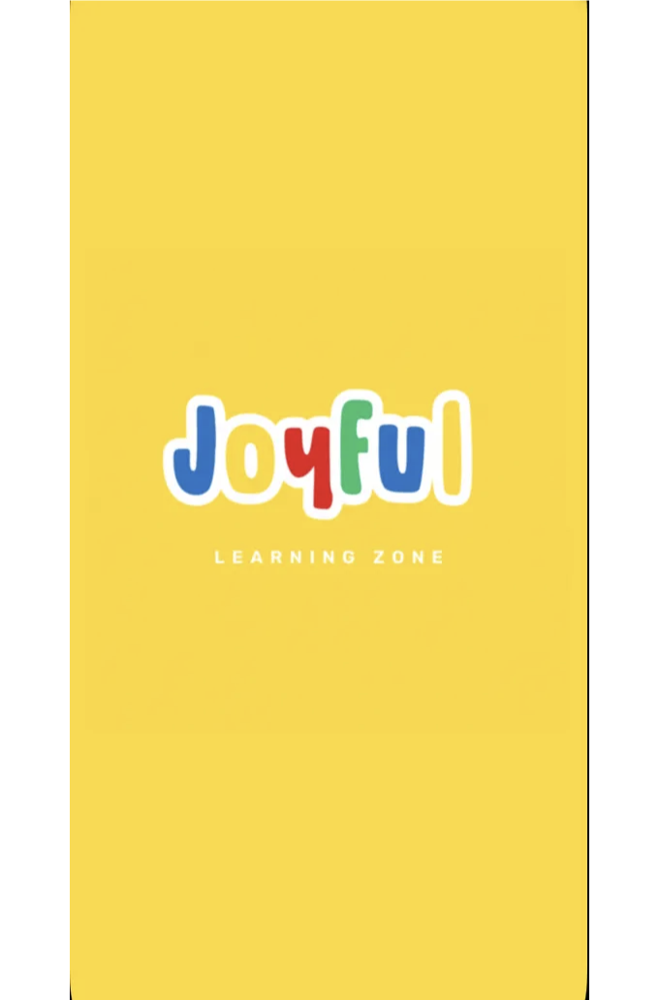
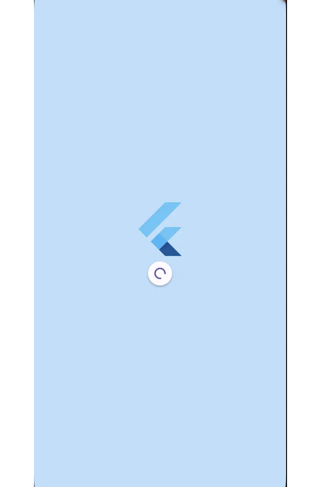

스플래시 화면은 모바일 애플리케이션 실행 시 사용자에게 표시되는 첫 화면이에요. 플러터(Flutter) 작업을 시작할 때, 샘플 애플리케이션을 검토하거나 내가 사용하는 모바일 애플리케이션을 생각해볼 때 떠오르는 첫 번째가 바로 스플래시 화면이었어요. 그래서 제가 관심을 가지고 이것에 대해 글을 쓰고 싶었던 거죠.

사용자에 대한 첫 인상을 만들 때 매우 중요하다고 생각해요. 왜냐하면 이 화면이 애플리케이션을 실행할 때 사용자가 가장 먼저 보게 되는 화면이기 때문이죠. 여기에는 브랜드 로고, 그림, 영감을 주는 문구, 화면이 표시될 때 음악이 시작될 수도 있어요. 또한 앱을 실행할 때 사용자에게 이 화면을 보여주면 앱이 로딩 중이거나 준비 중임을 알려주는 피드백을 제공해요. 이는 사용자가 앱이 작동하고 응답하는 것을 볼 수 있도록 도와주어 사용자 경험을 향상시킬 수 있어요. 이제 이를 생성하는 방법으로 넘어가 볼게요.

플러터(Flutter)에서 기본적인 스플래시 화면을 만드는 것은 매우 간단해요. Scaffold와 Center와 같은 기본 위젯을 사용하여 간단한 스플래시 화면을 디자인할 수 있어요.

```dart
class SplashScreen extends StatelessWidget {
  const SplashScreen({Key key});

  @override
  Widget build(BuildContext context) {
    return Scaffold(
      backgroundColor: Colors.cyan[200], // 스플래시 화면 배경 색상
      body: Center(
        child: Column(
          mainAxisAlignment: MainAxisAlignment.center,
          children: <Widget>[
            Image.asset(
              'assets/english.png', // 스플래시 화면 이미지
              width: 400,
              height: 600,
            ),
            const SizedBox(height: 20),
            Text(
              '나의 스플래시 화면 앱', // 제목 텍스트
              style: TextStyle(
                fontSize: 24,
                color: Colors.blueGrey[700],
              ),
            ),
          ],
        ),
      ),
    );
  }
}
```

<!-- ui-log 수평형 -->
<ins class="adsbygoogle"
  style="display:block"
  data-ad-client="ca-pub-4877378276818686"
  data-ad-slot="9743150776"
  data-ad-format="auto"
  data-full-width-responsive="true"></ins>
<component is="script">
(adsbygoogle = window.adsbygoogle || []).push({});
</component>

위의 코드는 Scaffold 위젯을 사용하여 배경색 및 중앙에 이미지와 텍스트가 있는 스플래시 화면을 만드는 데 사용됩니다.


아래에 링크된 내가 개발한 애플리케이션에서 간단한 스플래시 화면 예제가 있습니다:

```js
class SplashScreen extends StatelessWidget {
  const SplashScreen({Key key});

  @override
  Widget build(BuildContext context) {
    return Scaffold(
      backgroundColor: const Color(0XFFFFD72D),
      body: Center(
        child: Image.asset('assets/icons/animated_logo.gif'),
      ),
    );
  }
}
```

<!-- ui-log 수평형 -->
<ins class="adsbygoogle"
  style="display:block"
  data-ad-client="ca-pub-4877378276818686"
  data-ad-slot="9743150776"
  data-ad-format="auto"
  data-full-width-responsive="true"></ins>
<component is="script">
(adsbygoogle = window.adsbygoogle || []).push({});
</component>

이 결과는 다음과 같습니다:



FlashCards 애플리케이션 링크:

[Google Play Store](https://play.google.com/store/apps/details?id=com.cemnamak.flash_cards)

<!-- ui-log 수평형 -->
<ins class="adsbygoogle"
  style="display:block"
  data-ad-client="ca-pub-4877378276818686"
  data-ad-slot="9743150776"
  data-ad-format="auto"
  data-full-width-responsive="true"></ins>
<component is="script">
(adsbygoogle = window.adsbygoogle || []).push({});
</component>

지금까지 제시한 예시들은 플러터의 기본 위젯을 사용하여 간단한 스플래시 화면을 만드는 방법에 관한 것이었습니다. pub.dev에서 패키지를 사용하려면 보통 인기도를 확인하고 누가 개발했는지(플러터 팀이 개발한 패키지들은 업데이트에 신경 쓸 때 신뢰성이 높음) 그리고 최신 Dart 버전과 호환 여부를 살펴봅니다.
이 시점에서, 90%의 인기도를 자랑하는 splash_view 패키지를 사용해 쉽게 스플래시 화면을 만들어볼 수 있습니다. 이제 그 방법을 살펴보겠습니다.

먼저 터미널에 다음 명령어를 입력하여 패키지를 프로젝트에 설치합니다.

```js
flutter pub add splash_view
```

프로젝트 초반에 해당 패키지를 프로젝트 파일에 다음과 같이 임포트하여 소개합니다.

<!-- ui-log 수평형 -->
<ins class="adsbygoogle"
  style="display:block"
  data-ad-client="ca-pub-4877378276818686"
  data-ad-slot="9743150776"
  data-ad-format="auto"
  data-full-width-responsive="true"></ins>
<component is="script">
(adsbygoogle = window.adsbygoogle || []).push({});
</component>

```dart
import 'package:splash_view/splash_view.dart';
```

그런 다음 우리는 패키지 내용에 따라 코드를 작성합니다.

```dart
class MyApp extends StatelessWidget {
  const MyApp({Key key}) : super(key: key);
  
  @override
  Widget build(BuildContext context) {
    return MaterialApp(
      home: SplashView(
        backgroundColor: Colors.blue[100],
        loadingIndicator: const RefreshProgressIndicator(),
        logo: const FlutterLogo(
          size: 102.0,
        ),
      ),
    );
  }
}
```

결과는 다음과 같습니다:

<!-- ui-log 수평형 -->
<ins class="adsbygoogle"
  style="display:block"
  data-ad-client="ca-pub-4877378276818686"
  data-ad-slot="9743150776"
  data-ad-format="auto"
  data-full-width-responsive="true"></ins>
<component is="script">
(adsbygoogle = window.adsbygoogle || []).push({});
</component>



마침내 저의 기사를 Splash Screen을 만들 때 주의해야 하는 포인트에 대해 이야기하며 마무리하겠습니다.

우리가 주의해야 할 첫 번째 점은 시각적 디자인과 브랜드 조화입니다. 이 화면은 우리 애플리케이션의 첫 인상을 만들기 때문에, 애플리케이션의 테마와 일치하고 브랜드 정체성을 반영하는 색상, 글꼴 및 이미지를 선택하는 것이 매우 중요합니다.

Splash Screen의 지속 시간은 사용자를 지루하게 만들 정도로 너무 길지 않아야 하며, 화면 상의 항목을 보기에는 너무 짧지 않아야 합니다. 이는 사용자 경험에 직접적으로 영향을 미칩니다. 불필요한 부하는 포함되지 않아야 합니다.

<!-- ui-log 수평형 -->
<ins class="adsbygoogle"
  style="display:block"
  data-ad-client="ca-pub-4877378276818686"
  data-ad-slot="9743150776"
  data-ad-format="auto"
  data-full-width-responsive="true"></ins>
<component is="script">
(adsbygoogle = window.adsbygoogle || []).push({});
</component>

전확한 경험을 제공할 수 있습니다. 특히 응용프로그램이 로딩되거나 준비되는 동안 이러한 효과는 사용자에게 피드백을 제공하고 기다리는 시간을 더 즐겁게 만들 수 있습니다.

스플래시 화면이 다양한 화면 크기와 해상도에서 올바르게 표시되도록 하려면 반응형 디자인 원칙에 따라 만들어야 합니다. 이렇게 함으로써 다른 기기 및 화면 비율에서 뜝사지 않는 예상치 못한 이미지가 발생할 수 있습니다. 따라서 다양한 기기에서 테스트하는 것을 잊지 말아야 합니다.

요약하면, 스플래시 화면은 우리 앱의 사용자 경험을 향상시키고 브랜드 식별을 촉진하는 중요한 요소입니다. 사용자가 우리 앱을 열 때 처음 보는 화면인 이 화면은 대개 앱 전체 경험의 첫인상이므로 주의 깊게 디자인해야 합니다. 도움이 되었으면 좋겠네요.

좋은 하루 되세요.

<!-- ui-log 수평형 -->
<ins class="adsbygoogle"
  style="display:block"
  data-ad-client="ca-pub-4877378276818686"
  data-ad-slot="9743150776"
  data-ad-format="auto"
  data-full-width-responsive="true"></ins>
<component is="script">
(adsbygoogle = window.adsbygoogle || []).push({});
</component>
