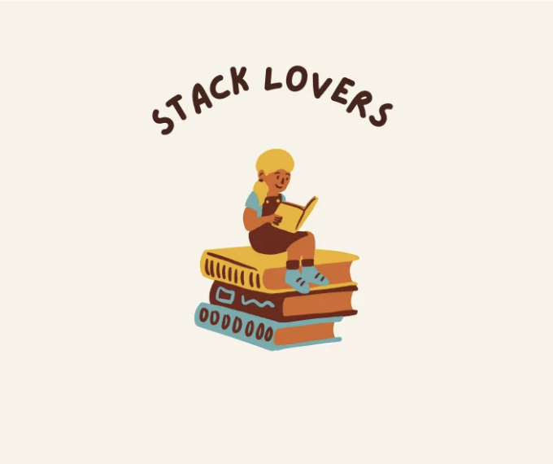

안녕하세요 여러분. 저는 Flutter 학습 과정에서 복잡하게 느껴졌지만 현격한 인터페이스를 만드는 데 거의 필수적인 위젯에 대해 글을 쓰고 싶었어요: Stack.

복잡한 사용자 인터페이스를 만들 때, 서로 다른 위젯을 결합하여 유연하고 아름다운 디자인을 만드는 것이 정말 중요해요. 이 맥락에서 Stack 위젯은 중요한 도구입니다. Stack 위젯은 서로 위에 위젯을 놓을 수 있어서 풍부하고 견고한 UI를 만드는 데 이상적인 도구입니다.

Stack 위젯이란 무엇인가요?

<!-- ui-log 수평형 -->
<ins class="adsbygoogle"
  style="display:block"
  data-ad-client="ca-pub-4877378276818686"
  data-ad-slot="9743150776"
  data-ad-format="auto"
  data-full-width-responsive="true"></ins>
<component is="script">
(adsbygoogle = window.adsbygoogle || []).push({});
</component>

Stack은 서로 다른 위젯을 포함하는 위젯 컬렉션입니다. 이 위젯들은 화면 상단에 나열되며 서로 관련이 있을 수 있습니다. 예를 들어 Stack 위젯은 이미지, 텍스트 및 버튼을 포함할 수 있으며, 이러한 위젯은 화면 상단에 서로 겹쳐져 배치될 수 있습니다.

Stack 위젯의 기본적인 사용

Stack 위젯은 서로 다른 위젯을 위로 쌓아 올리는 데 사용됩니다. 기본 사용 방법은 Stack 위젯에 추가된 위젯들이 추가된 순서대로 겹쳐진다는 것입니다.

예를 들어, 이미지와 텍스트 위젯을 Stack에 추가하고 화면 상단에 서로 겹쳐서 배치할 수 있습니다. 먼저 추가된 위젯은 하단에 나타나고 가장 나중에 추가된 위젯은 상단에 나타납니다.

<!-- ui-log 수평형 -->
<ins class="adsbygoogle"
  style="display:block"
  data-ad-client="ca-pub-4877378276818686"
  data-ad-slot="9743150776"
  data-ad-format="auto"
  data-full-width-responsive="true"></ins>
<component is="script">
(adsbygoogle = window.adsbygoogle || []).push({});
</component>

```js
Stack(
  children: <위젯>[
    // 하단에 표시할 위젯
    Container(
      color: Colors.blue,
      width: 200,
      height: 200,
    ),
    // 상단에 표시할 위젯
    Positioned(
      top: 50,
      left: 50,
      child: Text(
        '안녕, 플러터',
        style: TextStyle(fontSize: 20),
      ),
    ),
  ],
)
```

Positioned 위젯 사용하기

Flutter에서 Positioned 위젯은 Stack 내 위젯의 위치를 결정하는 데 사용됩니다. 이 위젯은 다른 위젯을 Stack 내에서 특정 위치에 배치하는 데 사용됩니다. Positioned 위젯을 사용하면 Stack 내 위젯을 배치할 때 특정 위치와 크기를 지정할 수 있습니다.
예를 들어, Positioned 위젯을 사용하여 Stack의 우측 상단에 Container 위젯을 배치할 수 있습니다:

```js
Stack(
  children: <위젯>[
    Positioned(
      top: 0,
      right: 0,
      child: Container(
        width: 100,
        height: 100,
        color: Colors.red,
      ),
    ),
    // 다른 위젯을 여기에 추가할 수 있습니다
  ],
)
```

<!-- ui-log 수평형 -->
<ins class="adsbygoogle"
  style="display:block"
  data-ad-client="ca-pub-4877378276818686"
  data-ad-slot="9743150776"
  data-ad-format="auto"
  data-full-width-responsive="true"></ins>
<component is="script">
(adsbygoogle = window.adsbygoogle || []).push({});
</component>

Positioned 위젯을 사용할 때 중요한 점은 위치와 크기 값이 Stack 위젯의 경계 내에 있어야 한다는 것입니다. 그렇지 않으면 위젯이 화면을 벗어나거나 원하지 않는 결과가 발생할 수 있습니다.

스택(Stack) 및 Z-인덱스 관리

Z-인덱스는 위젯이 다른 위젯 위에 올라가도록 허용합니다. Z-인덱스 값이 클수록 위젯이 더 높게 나타납니다. Stack 위젯 내부의 Positioned 위젯을 사용하여 Z-인덱스 값을 지정할 수 있습니다.

예를 들어, 아래 코드 스니펫에서는 Stack 내부에 이미지와 일부 텍스트가 있습니다. 그러나 텍스트가 이미지 위에 나타나길 원합니다. 이를 위해 Positioned 위젯의 z-index 속성을 사용할 수 있습니다:

<!-- ui-log 수평형 -->
<ins class="adsbygoogle"
  style="display:block"
  data-ad-client="ca-pub-4877378276818686"
  data-ad-slot="9743150776"
  data-ad-format="auto"
  data-full-width-responsive="true"></ins>
<component is="script">
(adsbygoogle = window.adsbygoogle || []).push({});
</component>

```dart
Stack(
  children: <Widget>[
    // 배경 이미지
    Image.network(
      'https://example.com/background-image.jpg',
      width: 300,
      height: 300,
      fit: BoxFit.cover,
    ),
    // 텍스트 위에
    Positioned(
      top: 50,
      left: 50,
      child: Text(
        '텍스트 위에',
        style: TextStyle(fontSize: 20),
      ),
      // Z-Index 지정
      zIndex: 1,
    ),
  ],
)
```

Stack 위젯을 사용할 때 고려해야 할 사항 및 일반적인 오류

- 위치 계산 오류: Stack 내 위젯의 위치를 결정할 때 주의해야 합니다. 잘못된 위치 값을 설정하면 원치 않는 위치에 위젯이 나타나거나 서로 겹칠 수 있습니다.
- Z-Index 충돌: Stack 내 위젯의 Z-Index 값은 어떤 위젯이 다른 위젯 위에 올라갈지 결정하기 때문에 Z-Index 값을 신중하게 결정해야 합니다. 그렇지 않으면 위젯이 원치 않는 방식으로 겹칠 수 있습니다.
- Stack 오버플로우 이슈: 이 주제는 우리가 모두 도와주는 사이트와 관련이 없습니다 :) Stack 내에서 Stack을 사용하는 것은 의미가 없습니다. 또한, 너무 많은 위젯을 추가하면 위젯이 화면을 벗어나거나 오류가 발생할 수 있습니다.
- 성능 문제: Stack 위젯 내에 너무 많은 위젯을 사용하면 성능 문제가 발생할 수 있습니다. 특히 애니메이션 및 복잡한 위젯과 함께 사용할 때 성능 손실이 발생할 수 있습니다.
- 누락 또는 지나치게 위치 지정된 위젯: Stack 내에서 위젯의 위치를 결정하기 위해 Positioned 위젯을 사용하지만 누락되거나 지나치게 많은 Positioned 위젯을 추가하면 원하지 않는 결과를 가져올 수 있습니다. 각 위젯에 적절한 개수와 위치 지정된 Positioned 위젯이 있는지 확인해야 합니다.
- 크기 문제: Stack 내의 위젯 크기에 주의해야 합니다. 특히 Stack 내의 위젯 크기가 서로 다른 경우 화면을 벗어나거나 예기치 않은 오류가 발생할 수 있습니다.
- 위젯 계층구조: Stack 내 위젯의 계층 구조도 매우 중요합니다. 경우에 따라 Stack 내 다수의 위젯 간 관계가 명확하지 않으면 예기치 않은 결과로 이어질 수 있습니다. 따라서 위젯의 계층 구조를 신중하게 계획해야 합니다.

이러한 사항을 주의하며 생성하는 Stack 위젯은 더 견고하고 안정적인 사용자 인터페이스를 만드는 데 매우 중요한 도구입니다.```

<!-- ui-log 수평형 -->
<ins class="adsbygoogle"
  style="display:block"
  data-ad-client="ca-pub-4877378276818686"
  data-ad-slot="9743150776"
  data-ad-format="auto"
  data-full-width-responsive="true"></ins>
<component is="script">
(adsbygoogle = window.adsbygoogle || []).push({});
</component>

제 기사가 여러분에게 도움이 되었기를 바랍니다.

좋은 하루 보내세요.

Selin.