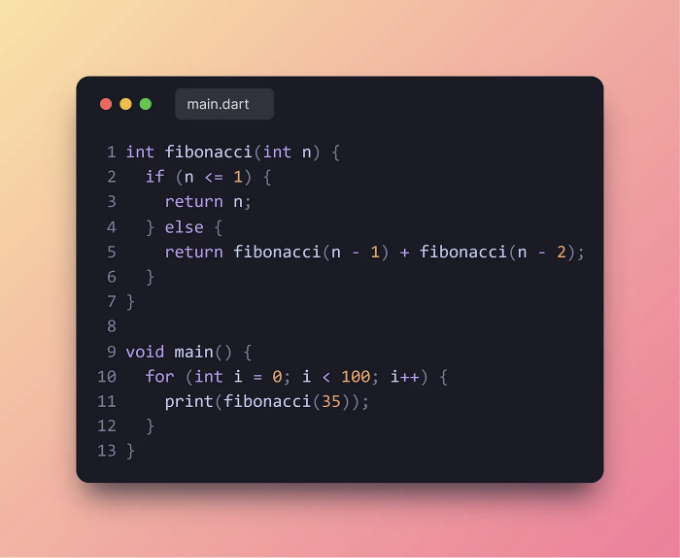
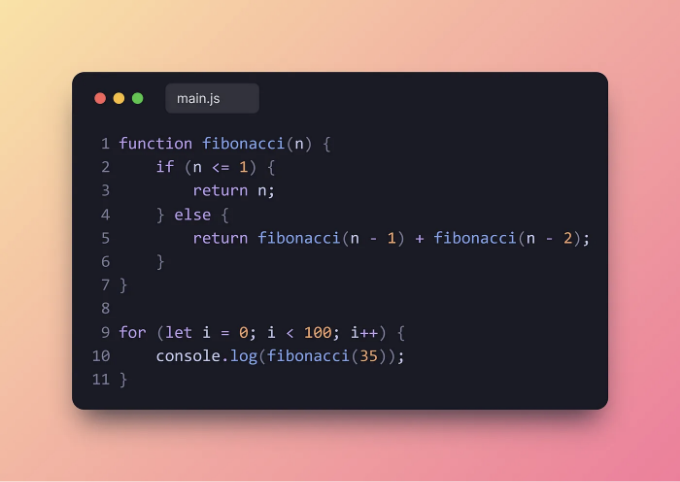
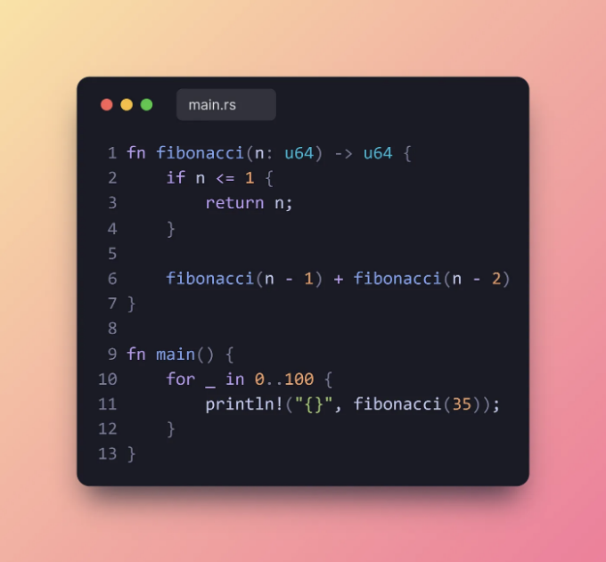
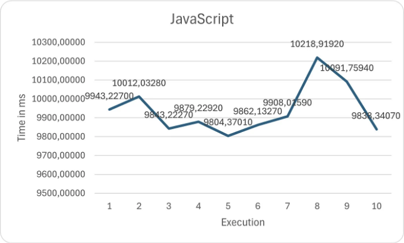
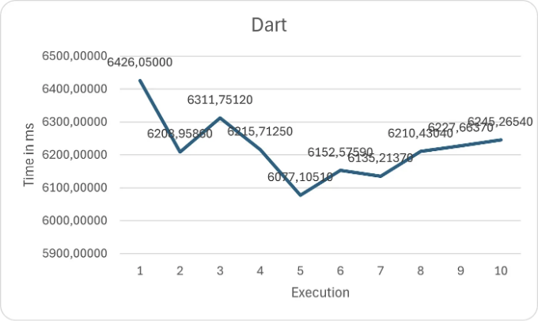
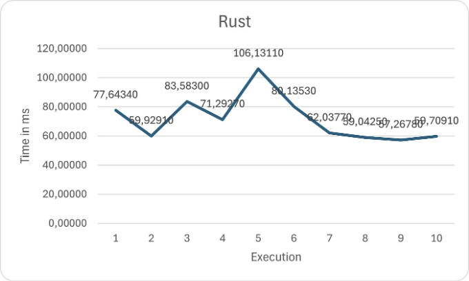

프로그래밍 언어의 속도는 중요합니다, 비록 그것이 드물게 필요하더라도 말이죠. 사용하는 언어가 빠르면 기뻐요. Dart가 시장에서 가장 빠른 언어는 아니지만, 멋지고 깔끔한 문법에 감사합니다. 그래서 Dart, JavaScript, Rust의 속도를 비교해보았어요.


Rust가 가장 빠를 거라는 것은 모두가 알고 있죠. 하지만 제 속도 테스트 결과는 정말 놀라웠어요. 그래서 이 기사는 Dart 개발자뿐만 아니라 Rust와 JavaScript 개발자들을 위한 것이에요.

# 성능 평가

<!-- ui-log 수평형 -->
<ins class="adsbygoogle"
  style="display:block"
  data-ad-client="ca-pub-4877378276818686"
  data-ad-slot="9743150776"
  data-ad-format="auto"
  data-full-width-responsive="true"></ins>
<component is="script">
(adsbygoogle = window.adsbygoogle || []).push({});
</component>

벤치마크는 피보나치 함수의 성능을 평가합니다. 각 스크립트에서 입력값으로 35를 사용하여 함수를 100번 실행합니다. 제 노트북의 하드웨어 제한으로 더 높은 입력값을 테스트할 수는 없습니다. JavaScript 코드는 Deno로 실행되었습니다. 이제 Dart, JavaScript 및 Rust 구현을 보여드리도록 하겠습니다.

## 벤치마크 실행 방법:

각 프로그램을 10번 실행하고 각 실행에 걸린 시간과 평균 실행 시간을 알려주는 작은 PowerShell 스크립트를 작성했습니다. 각 벤치마크에서 환경을 비슷하게 유지하고 수치가 유사하며 큰 차이가 없는지 확인하기 위해 벤치마크를 3번 실행했습니다.

시스템 하드웨어:
프로세서: AMD Ryzen 7 4800H with Radeon Graphics 2.90 GHz
설치된 RAM: 16.0 GB (사용 가능 RAM: 15.4 GB)
시스템: 64비트 운영 체제, x64 기반 프로세서
Windows: Windows 11 Home, 버전 23H2

<!-- ui-log 수평형 -->
<ins class="adsbygoogle"
  style="display:block"
  data-ad-client="ca-pub-4877378276818686"
  data-ad-slot="9743150776"
  data-ad-format="auto"
  data-full-width-responsive="true"></ins>
<component is="script">
(adsbygoogle = window.adsbygoogle || []).push({});
</component>

아래는 PowerShell 스크립트입니다:

```js
# 사용자로부터 실행할 명령어를 입력 요청
$command = Read-Host "실행할 명령어를 입력하세요 (예: 'py main.py')"

# 총 시간 변수 초기화
$totalTime = 0

# 명령어를 10번 실행하고 총 시간 계산
for ($i = 1; $i -lt 11; $i++) {
    $executionTime = Measure-Command { Invoke-Expression "& $command" }
    $totalTime += $executionTime.TotalMilliseconds
    Write-Host "실행 $i 시간: $($executionTime.TotalMilliseconds) 밀리초"
}

# 평균 시간 계산
$averageTime = $totalTime / 10
Write-Host "평균 실행 시간: $averageTime 밀리초"
```

## Dart



<!-- ui-log 수평형 -->
<ins class="adsbygoogle"
  style="display:block"
  data-ad-client="ca-pub-4877378276818686"
  data-ad-slot="9743150776"
  data-ad-format="auto"
  data-full-width-responsive="true"></ins>
<component is="script">
(adsbygoogle = window.adsbygoogle || []).push({});
</component>

## JavaScript



## Rust



<!-- ui-log 수평형 -->
<ins class="adsbygoogle"
  style="display:block"
  data-ad-client="ca-pub-4877378276818686"
  data-ad-slot="9743150776"
  data-ad-format="auto"
  data-full-width-responsive="true"></ins>
<component is="script">
(adsbygoogle = window.adsbygoogle || []).push({});
</component>

알 수 있듯이, 같은 코드를 사용하여 언어 간에 번역을 한 것입니다.

# 결과



평균: 9940.12497 ms
Dart 대비 1.59% 늦음
Rust 대비 138.67% 더 늦음

<!-- ui-log 수평형 -->
<ins class="adsbygoogle"
  style="display:block"
  data-ad-client="ca-pub-4877378276818686"
  data-ad-slot="9743150776"
  data-ad-format="auto"
  data-full-width-responsive="true"></ins>
<component is="script">
(adsbygoogle = window.adsbygoogle || []).push({});
</component>



평균: 6221.07265 ms
JavaScript 대비: 1.59 % 빠름
Rust 대비: 86.79 % 느림



평균: 71.67717 ms
JavaScript 대비: 138.67 % 빠름
Dart 대비: 86.79 % 빠름

<!-- ui-log 수평형 -->
<ins class="adsbygoogle"
  style="display:block"
  data-ad-client="ca-pub-4877378276818686"
  data-ad-slot="9743150776"
  data-ad-format="auto"
  data-full-width-responsive="true"></ins>
<component is="script">
(adsbygoogle = window.adsbygoogle || []).push({});
</component>

# 결론

JavaScript와 Dart만 보면 Dart가 빠른 언어처럼 보입니다. Rust를 추가하면 얼마나 빠른지 알 수 있습니다. JavaScript 개발자들에게 작은 동기부여로, 이 벤치마크에 Python을 포함하지 못했습니다. 실행이 끝나지 않았습니다.

따라서 Dart의 속도가 실제 앱 개발에서 얼마나 중요한지 알고 싶다면, 곧 생기는 기회에 관한 기사를 작성하겠습니다. 궁금한 점이나 개선할 사항이 있으면 언제든지 알려주세요 😊.