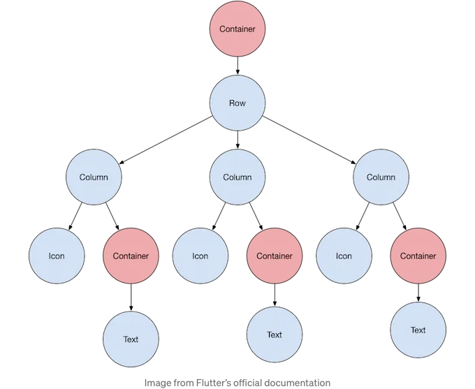
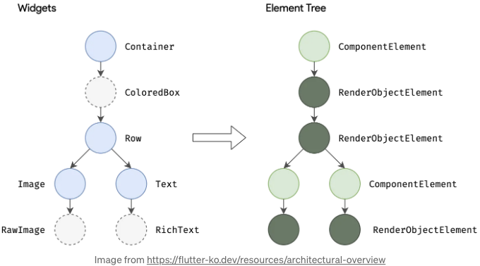
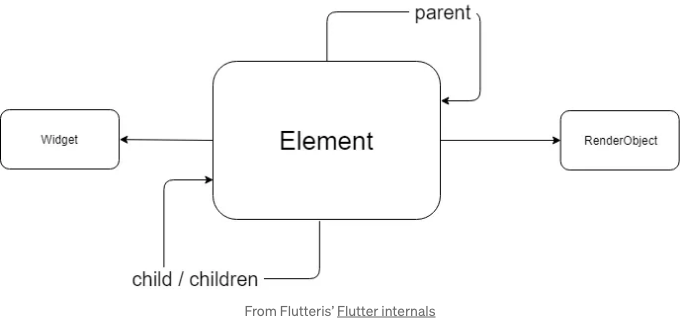
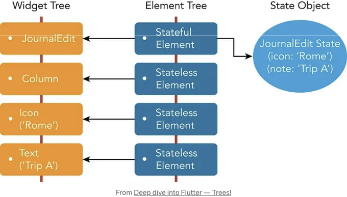
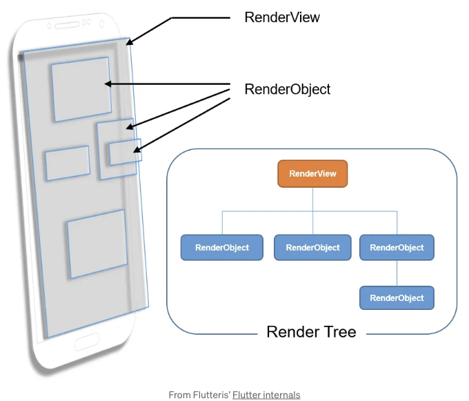
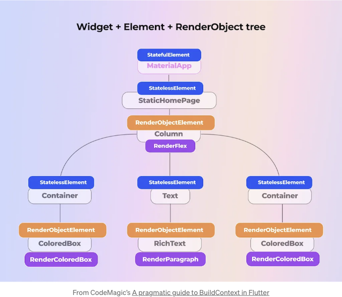
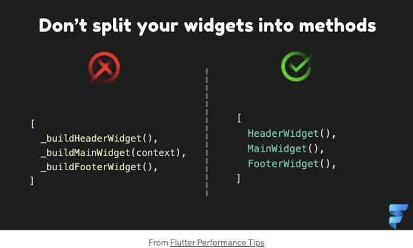

# 계속하기 전에!

이 튜토리얼은 PC 또는 맥에 실행 중인 플러터 설치 및 플러터 프레임워크의 기본 이해가 있다고 가정합니다. 그렇지 않은 경우, 먼저 이 기사를 확인하도록 권장합니다: 플러터에 오신 것을 환영합니다! — 위젯

# 만약 이것이 숲이라면, 뿌리로 돌아가 보겠습니다!

<!-- ui-log 수평형 -->
<ins class="adsbygoogle"
  style="display:block"
  data-ad-client="ca-pub-4877378276818686"
  data-ad-slot="9743150776"
  data-ad-format="auto"
  data-full-width-responsive="true"></ins>
<component is="script">
(adsbygoogle = window.adsbygoogle || []).push({});
</component>

모든 플러터 개발자는 위젯에 익숙하지만, 진정한 플러터 개발자는 그 아래에서 무슨 일이 벌어지는지 알고 있어요. 위젯은 복잡한 화면을 구축하기 위해 다른 위젯 위에 또는 주위에 배치되어 트리 형태로 만들어집니다.

그러나 명세적 프레임워크와 마찬가지로 화면에 표시하길 원하는 것을 나타내는 UI 코드를 작성할 뿐이며, 그 내부 동작에 대해서는 고려하지 않습니다. 그렇다면, 어떻게 위젯 트리가 기기 화면에 렌더링되는 걸까요?

플러터 프레임워크 안에서는 앱 렌더링을 담당하는 세 가지 다른 트리와 여러 흥미로운 요소들이 있습니다:

- 위젯 트리
- 엘리먼트 트리
- 렌더 오브젝트 트리

<!-- ui-log 수평형 -->
<ins class="adsbygoogle"
  style="display:block"
  data-ad-client="ca-pub-4877378276818686"
  data-ad-slot="9743150776"
  data-ad-format="auto"
  data-full-width-responsive="true"></ins>
<component is="script">
(adsbygoogle = window.adsbygoogle || []).push({});
</component>

이 나무들은 아래 다이어그램에서 볼 수 있는 것처럼 밀접한 관련이 있습니다. 이 기사에서는 각각이 무엇을 하는지 그리고 나머지와 어떻게 관련이 있는지 심도있게 다룰 것입니다.

대부분의 경우 위젯 트리만 다루게 될 것이지만, 플러터의 뛰어난 성능과 더 효율적인 코드를 작성하는 방법을 이해하기 위해서는 나머지에 대해 알아두는 것이 중요합니다.

예를 들어, Stateful 위젯의 상태 변경이 그 아래의 위젯 트리 전체를 완전히 다시 빌드하도록 유발한다는 것을 알고 있지만, 모든 위젯이 다시 빌드될까요? 그것이 플러터의 작동 방식이 아니라면... 내부적으로 어떻게 관리되는 걸까요?

# 위젯 트리

<!-- ui-log 수평형 -->
<ins class="adsbygoogle"
  style="display:block"
  data-ad-client="ca-pub-4877378276818686"
  data-ad-slot="9743150776"
  data-ad-format="auto"
  data-full-width-responsive="true"></ins>
<component is="script">
(adsbygoogle = window.adsbygoogle || []).push({});
</component>

이것은 당신이 작성한 나무입니다. 더 큰 위젯을 형성하기 위해 작은 위젯을 중첩하여 코드화합니다. 예를 들어 Container() 위젯과 Text() 위젯을 자식으로 가진 경우, 당신의 위젯 트리는 Container가 루트이고 Text가 잎(자식)으로 있을 것입니다. 더 큰 구조를 생각해보면, 훨씬 더 큰 위젯 트리를 만나게 될 수 있습니다.



## 엘리먼트 트리

당신의 위젯 트리에 있는 각 위젯은 엘리먼트 트리에 해당하는 요소를 가지고 있습니다. 사실, Flutter 프레임워크는 createElement() 메서드를 사용하여 각 위젯에 대한 엘리먼트를 생성합니다.

<!-- ui-log 수평형 -->
<ins class="adsbygoogle"
  style="display:block"
  data-ad-client="ca-pub-4877378276818686"
  data-ad-slot="9743150776"
  data-ad-format="auto"
  data-full-width-responsive="true"></ins>
<component is="script">
(adsbygoogle = window.adsbygoogle || []).push({});
</component>

요소는 트리의 특정 위치를 구성하기 위해 위젯을 사용하는 것을 나타냅니다:



각 요소에는 부모가 있을 수 있고, 때로는 자식이 있어서 사실상 요소 트리를 만듭니다.



<!-- ui-log 수평형 -->
<ins class="adsbygoogle"
  style="display:block"
  data-ad-client="ca-pub-4877378276818686"
  data-ad-slot="9743150776"
  data-ad-format="auto"
  data-full-width-responsive="true"></ins>
<component is="script">
(adsbygoogle = window.adsbygoogle || []).push({});
</component>

위젯과 마찬가지로 요소들도 상태 요소 및 무상태 요소 두 가지 유형으로 나눌 수 있어요. 무상태 요소는 StatelessWidget을 참조하며, 상태 요소는 StatefulWidget과 해당 상태를 보유해요.



만약 상위 위젯이 다시 빌드되어 이 위치에 새 위젯을 만든다면 해당 요소가 변경될 수 있어요. 하지만 새 위젯이 이전과 같은 유형이라면 해당 요소를 재사용할 수 있어요. 이것이 플러터 성능의 핵심 아이디어에요!

새 데이터로 UI를 업데이트하려면 setState() 메소드를 호출하여 상태 객체를 업데이트해요. 내부적으로 해당 객체는 해당 요소를 더러운 상태로 표시하고, 연결된 위젯의 build() 메서드를 호출하여 UI를 업데이트하게 됩니다.

<!-- ui-log 수평형 -->
<ins class="adsbygoogle"
  style="display:block"
  data-ad-client="ca-pub-4877378276818686"
  data-ad-slot="9743150776"
  data-ad-format="auto"
  data-full-width-responsive="true"></ins>
<component is="script">
(adsbygoogle = window.adsbygoogle || []).push({});
</component>

이전 이미지를 예로 들어보면, 부모 위젯이 Text 위젯의 내용을 "여행 B"로 변경하지만 다른 위젯들의 내용은 그대로 남아 있으면 Element Tree는 Text 위젯에 해당하는 요소만 변경할 것이다. 그 이유는 그게 유일하게 변경되는 위젯이기 때문이다. 새 위젯이 이전 것과 동일한 유형이기 때문에 참조를 유지하기 위해 기존 Element는 재사용될 것이다. 더 많은 정보는 여기에서 확인할 수 있습니다.

그럼에도 불구하고 왜 Flutter는 Text의 새 인스턴스를 만들까요? 각 위젯은 변경할 수 없기 때문입니다:

```js
@immutable
abstract class Widget extends DiagnosticableTree {
  const Widget({this.key});
  final Key? key;
  ...
}
```

# 렌더 트리

<!-- ui-log 수평형 -->
<ins class="adsbygoogle"
  style="display:block"
  data-ad-client="ca-pub-4877378276818686"
  data-ad-slot="9743150776"
  data-ad-format="auto"
  data-full-width-responsive="true"></ins>
<component is="script">
(adsbygoogle = window.adsbygoogle || []).push({});
</component>

이 중요한 트리는 화면에 표시되는 트리입니다.

Flutter의 공식 문서에 따르면 "렌더 트리는 사용자 인터페이스의 기하를 저장하는 데이터 구조입니다." ElementTree의 각 요소에 대해 Flutter는 createRenderObject() 메서드를 사용하여 RenderObject를 만듭니다.



RenderObjects는 위치, 기본 레이아웃 및 페인트 프로토콜과 같은 위젯의 기본 세부 정보를 저장합니다. 그러나 부모가 얼마나 많은 자식을 가질지 또는 그들이 어디에 위치할지를 정의하지는 않습니다. 따라서 Flutter 프레임워크가 UI를 그릴 때 각 위젯의 렌더링 프로퍼티를 제어하는 Render Object Tree를 참조합니다. 이 트리를 다시 인스턴스화하는 것은 비용이 많이 듭니다.

<!-- ui-log 수평형 -->
<ins class="adsbygoogle"
  style="display:block"
  data-ad-client="ca-pub-4877378276818686"
  data-ad-slot="9743150776"
  data-ad-format="auto"
  data-full-width-responsive="true"></ins>
<component is="script">
(adsbygoogle = window.adsbygoogle || []).push({});
</component>

당황하지 마세요! 대부분의 Flutter 개발자들은 객체를 직접 렌더링하지 않고 위젯을 사용하여 간접적으로 렌더 트리를 조작합니다.

하지만 RenderObjects가 기기의 화면에 어떻게 그려지는 걸까요? 크로스 플랫폼 프레임워크는 일반적으로 기본 네이티브 Android 및 iOS UI 렌더링 라이브러리 위에 추상화 계층을 생성하여 네이티브 UI 구성 요소를 제공합니다. 그러나 이러한 추상화는 상당한 오버헤드를 추가할 수 있어 앱의 전반적인 성능이 순수한 네이티브 코드보다 낮을 수 있습니다. 이 문제를 극복하기 위해 Flutter의 렌더링 파이프라인은 Skia(또는 Impeller)의 자체 복사본을 엔진의 일부로 포함시키고 UI 렌더링을 픽셀 단위로 제어하여 다른 크로스 플랫폼 프레임워크보다 높은 드로잉 성능을 달성합니다. 렌더링 프로세스에 대해 더 알아보려면 공식 Flutter 문서에서 확인하거나 이 기사의 끝 부분에서 더 많은 리소스를 찾아볼 수 있습니다.

# 나무 사이를 흔들리며

전체 위젯 렌더링 프로세스는 다음 단계로 요약할 수 있습니다:

<!-- ui-log 수평형 -->
<ins class="adsbygoogle"
  style="display:block"
  data-ad-client="ca-pub-4877378276818686"
  data-ad-slot="9743150776"
  data-ad-format="auto"
  data-full-width-responsive="true"></ins>
<component is="script">
(adsbygoogle = window.adsbygoogle || []).push({});
</component>

- 플러터 앱을 실행하면 main 함수가 runApp() 함수를 호출합니다.
- 이 함수는 주어진 위젯을 가져와 위젯 트리의 루트로 만듭니다.
- 플러터는 모든 위젯을 처리하고 각 해당 Element가 마운트됩니다.
- 트리의 각 Element에 대해 플러터는 RenderObject를 생성하여 Render Object Tree를 만듭니다.
- 각 RenderObject는 연결된 위젯을 크기 조정하고 그리는 방법을 알고 있으며 입력 및 히트 테스팅을 수신합니다.



매일 개발할 때 95%의 경우에는 위젯 트리만 다룰 것이므로 중요한 것입니다. 아마도 물어볼 것입니다: "이 모든 것에 대해 왜 신경 써야 하지?" 실제로 두 가지 주요 이유 때문입니다:

- 앱의 전반적인 성능을 향상시키기 위해.
- 이를 알지 못해 발생하는 일반적인 버그를 피하기 위해 (경우의 4%).

<!-- ui-log 수평형 -->
<ins class="adsbygoogle"
  style="display:block"
  data-ad-client="ca-pub-4877378276818686"
  data-ad-slot="9743150776"
  data-ad-format="auto"
  data-full-width-responsive="true"></ins>
<component is="script">
(adsbygoogle = window.adsbygoogle || []).push({});
</component>

누락된 1%는 "저수준" 라이브러리를 사용하는 것과 관련이 있습니다. 코드를 직접 터치하여 화면에 보기를 그려내는 작업을 수행해야 합니다.

# 플러터 앱 성능 향상하기.

이 모든 내용을 읽은 후에는 이 지식을 최대한 활용해 보세요. 이 섹션은 큰 비밀 룰 #2이니 메모해 두세요!

## 함수보다 위젯을 선호하세요

<!-- ui-log 수평형 -->
<ins class="adsbygoogle"
  style="display:block"
  data-ad-client="ca-pub-4877378276818686"
  data-ad-slot="9743150776"
  data-ad-format="auto"
  data-full-width-responsive="true"></ins>
<component is="script">
(adsbygoogle = window.adsbygoogle || []).push({});
</component>



처음에는 긴 빌드 메서드를 작은 함수로 분할하는 것이 완벽하게 이해됩니다. 그러나 이렇게 하면 두 가지 문제가 발생할 수 있습니다:

- 루트 위젯이 다시 빌드될 때마다 모든 내부 함수가 호출됩니다.
- 일부 내부 위젯이 업데이트되어야 하는 경우 전체 위젯이 더러운 상태로 표시됩니다.

이로 인해 Flutter의 위젯 트리 구조로부터의 선택적 빌드() 호출의 장점을 활용하지 못할 수 있습니다. 또한 이 문서의 이전 부분에서 언급한 대로 const 키워드를 사용하여 Element Tree 관리를 개선하는 큰 이점도 언급할 수 없습니다.

<!-- ui-log 수평형 -->
<ins class="adsbygoogle"
  style="display:block"
  data-ad-client="ca-pub-4877378276818686"
  data-ad-slot="9743150776"
  data-ad-format="auto"
  data-full-width-responsive="true"></ins>
<component is="script">
(adsbygoogle = window.adsbygoogle || []).push({});
</component>

## StatefulWidget에서 많은 상태를 보관하는 것을 피하세요.

Flutter의 데모 카운터 앱을 생각해보세요. 홈페이지 위젯에는 전체 기능이 갖춰진 Scaffold와 화면 중앙에 카운터가 있습니다. setState() 메소드를 호출할 때마다 전체 Scaffold를 새로고침하게 됩니다!

flutter_bloc, riverpod, mobx 또는 원하시는 상태 관리 패키지를 사용하여 이 문제를 피할 수 있습니다. 하지만 이 경우에 정말 유용한 내장 클래스도 있습니다: ValueNotifier:

```js
class _MyHomePageState extends State<MyHomePage> {
  final _counterNotifier = ValueNotifier<int>(0);
```

<!-- ui-log 수평형 -->
<ins class="adsbygoogle"
  style="display:block"
  data-ad-client="ca-pub-4877378276818686"
  data-ad-slot="9743150776"
  data-ad-format="auto"
  data-full-width-responsive="true"></ins>
<component is="script">
(adsbygoogle = window.adsbygoogle || []).push({});
</component>

```js
  void _onPressed() {
    _counterNotifier.value += 1;
  }
  @override
  void dispose() {
    _counterNotifier.dispose();
    super.dispose();
  }
  @override
  Widget build(BuildContext context) {
 return Scaffold(
  ...,
  body: Center(
   child: ValueListenableBuilder(
    valueListenable: _colorNotifier,
    builder: (_, value, __) => Text(value)
    ),
   ),
  );
 }
}
```

이렇게 하면 _counterNotifier를 업데이트할 때 Flutter는 ValueListenableBuilder 내부의 위젯만 다시 생성합니다.

## 리스트에 대한 “builder” 메서드를 선호하세요

이제 Flutter의 트리에 대해 전문가가 되었으니 이 개념을 쉽게 이해할 수 있을 것입니다. 이 주제는 반드시 필요한 것만 만들어서 효율적인 목록을 생성하는 방법에 관한 것입니다.

<!-- ui-log 수평형 -->
<ins class="adsbygoogle"
  style="display:block"
  data-ad-client="ca-pub-4877378276818686"
  data-ad-slot="9743150776"
  data-ad-format="auto"
  data-full-width-responsive="true"></ins>
<component is="script">
(adsbygoogle = window.adsbygoogle || []).push({});
</component>

가게 목록이 100개 있고 화면에는 한 번에 4개 또는 5개만 표시될 때가 있습니다. 왜 화면에 실제로 나타나는 아이템만을 위한 요소가 생성 및 마운트되는 ListView.builder 메서드를 사용하지 않을까요? 특히 무거운 Render Object 트리까지 전부 만들 필요가 없으니까요! 이것이 ListView 위젯이 가시적인 아이템에 대해서만 Elements를 만들고 마운트하는 ListView.builder 메서드를 갖는 이유입니다.

이 조언은 Flutter의 공식 Best Practice에서도 확인할 수 있습니다.

## Key 사용에 대해 겁내지 마세요

대부분의 경우에는 위젯에 키를 지정할 필요가 없을 것입니다. 그러나 위젯 트리 내에서 이동될 때 위젯 상태를 보존하고 싶다면 키가 필요합니다.

<!-- ui-log 수평형 -->
<ins class="adsbygoogle"
  style="display:block"
  data-ad-client="ca-pub-4877378276818686"
  data-ad-slot="9743150776"
  data-ad-format="auto"
  data-full-width-responsive="true"></ins>
<component is="script">
(adsbygoogle = window.adsbygoogle || []).push({});
</component>

위젯 트리의 위젯과 엘리먼트 트리의 엘리먼트 간의 관계는 키에 의해 설정됩니다. 키가 지정되지 않은 경우 위젯의 유형을 사용하여 키를 결정합니다. 이는 변경 가능한 목록에서 매우 유명한 문제로 이어질 수 있습니다. 위젯을 제거, 추가, 재정렬 또는 드래그할 때 해당 상태를 보존하고 싶지만 키가 지정되지 않은 경우 한 개 이상의 항목의 상태가 일관성 없게 될 수 있습니다.


<!-- ui-log 수평형 -->
<ins class="adsbygoogle"
  style="display:block"
  data-ad-client="ca-pub-4877378276818686"
  data-ad-slot="9743150776"
  data-ad-format="auto"
  data-full-width-responsive="true"></ins>
<component is="script">
(adsbygoogle = window.adsbygoogle || []).push({});
</component>

더 많은 정보를 원하시면 이 미디움 기사를 참고하거나 예시를 보려면 이 기사를 확인해보세요.

# 요약하면!

Flutter는 강력한 프레임워크이지만 복잡하기도 합니다. 이 프레임워크가 어떻게 작동하는지 이해하면 그 온전한 잠재력을 헤치지 않고 더 나은 코드를 작성할 수 있습니다.

위젯 트리가 어떻게 작동하고 다른 트리들과 상호작용하는지를 이해하면 더 효율적이고 에러를 줄일 수 있는 코드를 작성할 수 있을 것입니다.

<!-- ui-log 수평형 -->
<ins class="adsbygoogle"
  style="display:block"
  data-ad-client="ca-pub-4877378276818686"
  data-ad-slot="9743150776"
  data-ad-format="auto"
  data-full-width-responsive="true"></ins>
<component is="script">
(adsbygoogle = window.adsbygoogle || []).push({});
</component>

## 그러면 다음에는 무엇을 해볼까요?

아래에서 이러한 주제에 대한 몇 가지 흥미로운 기사를 찾을 수 있습니다. 또한 새로운 기사를 기다리며 기다려주세요!

## 자료

- Inside Flutter
- Flutter 위젯의 심층 분석
- Flutter 내부 동작
- Flutter가 UI를 렌더링하는 방식
- Flutter 렌더링 메커니즘 탐색
- Flutter에서 BuildContext에 대한 실용적 가이드
- Flutter 깊게 파헤치기 - 트리!
- 플러터 앱 성능 향상하기
- 성능이 우수한 Flutter 위젯 구축하기
- 키! 그것들은 무엇을 위해 좋을까요?
- 요소, 키 그리고 Flutter의 성능
- 위젯에서의 키 개념