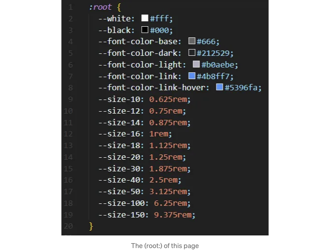
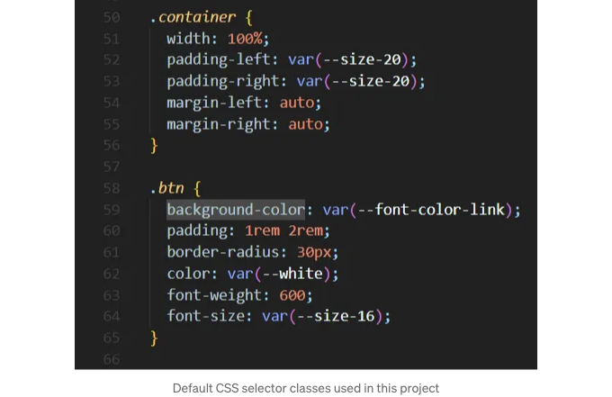

어떤 도전에 들어갈 때, 팀 노력이든 혼자하든, 계획없이, 전략 없이, 혹은 성공을 위한 게임 계획 없이 들어가는 사람이 얼마나 있을까요? 물론 불가능한 것은 아니지만, 대다수의 사람에겐 실패를 불러일으키기 위해 그저 기다리는 레시피일 뿐입니다! 가장 재능 있는 사람들도 최고로 열심히 일하는 사람들도 성공을 위한 계획을 세우는데, 개발자가 될 때도 예외는 아닙니다. 이미 존재하는 사이트를 조정하거나 업데이트하거나, 혹은 처음부터 사이트를 제작하는 업무에 투입될 때, 시작하기 전에 계획이나 시스템을 마련하는 것이 성공을 결정짓는 차이를 만들어낼 수 있습니다. 최근에 HTML 및 CSS를 조금 이해한 저는 웹사이트를 만들며 도움이 되었던 몇 가지 아이디어를 활용해 코드를 정리하고 읽기 쉽게 유지하는 데 큰 도움이 되었어요.

기존 프로젝트에서는 CSS에 root: 요소가 추가될 가능성이 높습니다. 그러나 새로운 사이트를 만들고 그것을 어떻게 만들 것인지, 어떻게 보여야 하는지 계획하는 중이라고 가정해 봅시다. 좋은 페이지는 스타일, 색상, 모양에서 일관성이 있어야 하지 않을까요? 단지 색상만 5가지 이상이 되어도, 색상 코드를 기억하거나 이전 코드로 돌아가서 색상 코드를 복사해야 할 수 있습니다. 이럴 때 CSS에 root: 요소를 설정하면 프로젝트가 훨씬 더 조직적이고 사용하기 쉬워집니다. root에 특정 이름의 변수를 설정하면 그 변수의 내용에 접근할 수 있어 특정 값을 사용할 필요가 없어집니다. 이 값들은 색상이나 특정 길이일 수 있고, 해당 값을 사용자(또는 독자)가 그 값을 사용하거나 사용 용도를 쉽게 이해할 수 있도록 이름을 붙여 놓는 것이 좋습니다. 예를 들어, 위의 { -- font-color-base } 와 { -- font-color-link }는 폰트에 사용되는 두 가지 다른 색상이고, 명확한 이름을 사용하면 독자가 쉽게 색상이 어떻게 되는지 알 수 있습니다. 변수에 rem 길이를 사용하고 이름은 pixel 크기를 사용하면 프로젝트 전체에 사용되는 일반 길이와 간격을 쉽게 기억하고, 편리하게 편집할 수 있는 픽셀 값 사용에 즐길 수 있습니다. 프로젝트에서 사용되는 색상과 크기를 결정하고, 프로젝트를 진행하면서 root 변수를 추가하고 편집할 수 있습니다. 또한 여러 프로젝트에 걸쳐 사용되는 기본 root를 가지고 있으면, 수정하는 데 걸리는 시간을 줄이고 모든 것을 깔끔하게 정리하고 다른 사람들이 쉽게 읽을 수 있게 할 수 있습니다.

<!-- ui-log 수평형 -->
<ins class="adsbygoogle"
  style="display:block"
  data-ad-client="ca-pub-4877378276818686"
  data-ad-slot="9743150776"
  data-ad-format="auto"
  data-full-width-responsive="true"></ins>
<component is="script">
(adsbygoogle = window.adsbygoogle || []).push({});
</component>

루트: 요소를 사용하면 특정 값을 쉽게 액세스할 수 있지만 여러 요소에 복사하고 싶은 특정 스타일이나 룩이 있는 경우는 어떨까요? 기본 CSS 페이지를 만들면 이러한 작업이 매우 쉬워집니다. 예를 들어, 그리드 디자인으로 그룹화하고 싶은 콘텐츠가 있거나 특정 섹션에 다른 글꼴 크기, 색상, 모양 또는 배경색을 원하는 경우는 어떨까요? 특정 색상이나 길이 값을 기억해야한다면, 두 개 이상의 요소가 동일한 방식으로 보이도록 만들기 위해 한 지점에 모든 편집 변경 사항을 기억해야 하는 것은 불필요한 작업일 것이며, 두 개 이상의 CSS 선택기에 정확히 동일한 내용이 있는 것은 읽기 어려울 뿐만 아니라 훨씬 더 많은 코드가 필요합니다. 요소에 추가할 수 있는 기본 클래스 또는 선택기를 사용하면 추가 코드를 작성할 필요 없이 해당 요소에 원하는 스타일에 직접 액세스할 수 있습니다. 위의 내용에서 {.container}를 사용하여 페이지에 추가된 클래스로 그리드 디자인처럼 보이는 섹션의 크기를 제어하는 부모 요소를 만들 수 있습니다. 특히 화면 크기에 따라 특정 동작을 원하는 경우 유용합니다. 또한 {.btn}을 사용하여 버튼으로 사용되는 요소에 기본 스타일을 만들 수 있으며 더 적은 코드로 작업할 수 있습니다.

위는 무작위 코드 일부이므로 콘텐츠 자체보다는 사용된 클래스 및 이름이 중요합니다. 선택기 이름이 어떻게 지정되었는지에 대한 명확한 시스템이 코드 및 목적을 이해하기 쉽게 만들 수 있습니다. 이전 섹션과 마찬가지로 여러 섹션에서 기본 클래스 선택기 (.container)가 사용되며, 이를 통해 크기를 조절하고 균일한 크기를 설정하여 페이지가 깔끔하게 보이게 할 수 있습니다. 이 구문에서는 가격 섹션이 표시되고 있음을 명백히 알 수 있으며, 이름을 기반으로 하기 때문에 두 `div` 요소 클래스 선택기에서 "pricing"이라는 용어가 여러 번 사용되어도 각 클래스가 무엇을 위해 사용되는지 명확하게 이해할 수 있습니다. "pricing" 섹션에는 "header"가 있고 "wrapper" 섹션이 있으며, 이는 해당 컨테이너에 다른 부모 요소가 있는 것을 의미하므로 부모 요소의 배치 및 편집을 쉽게 제어할 수 있습니다. 그런 다음 "wrapper" 내에는 실제 가격 "card" 자체가 있는 부모 요소가 있습니다. 이와 같은 방법을 사용하면 변경 가능한 콘텐츠를 가진 여러 섹션을 만들 때 편리하며, 비슷한 클래스 선택기에 유지하고 더 적은 코드를 사용할 수 있습니다. 또한 CSS 스타일을 읽을 때 이해하기 쉬워집니다. 코드를 작성할 때 간단한 논리를 유지하면 누군가가 이해해야 할 것으로 예상되는 엄청난 양의 코드를 쉽게 탐색할 수 있으며 코드를 깔끔하고 균일하게 유지할 수 있습니다.

이런 팁들은 제가 값진 지식으로 여겨지는 것으로 발견한 코드 작성 경험을 더 효율적으로 만들 수 있는 몇 가지 방법일 뿐입니다. "더 똑똑하게 일하라"는 말에 절대적으로 동의합니다. 디벨로퍼 경험을 더 쉽게 만들고 제작성을 높이는 모든 팁이나 조언은 제 책에서 승리입니다. 누군가가 개발자 경험을 쉽게 만들 방법을 찾고 있는 분들에게도 이것이 도움이 되기를 바랍니다.