## 인기 있는 플러터 앱 탐험: 플레이스토어에서 상태 관리에 대한 심층 탐구

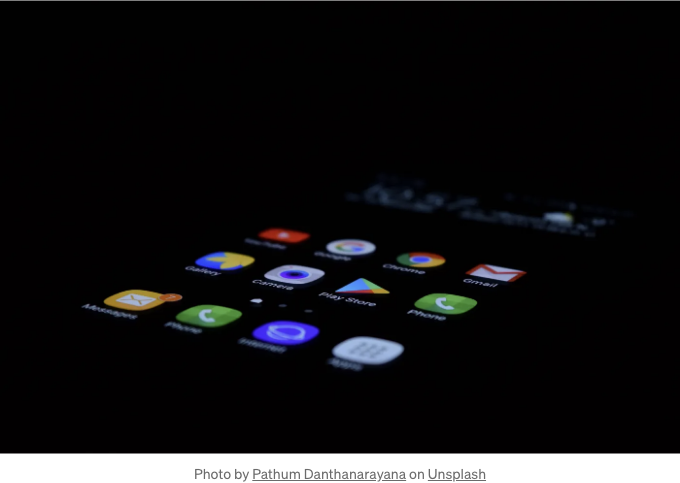

요즘, 몇 사람들이 플레이스토어에 출시된 플러터 앱의 구성을 보여주는 차트를 공유했더라구요. 그래서 저는 플레이스토어에서 다운로드 수가 가장 많은 앱이 무엇인지 궁금해졌어요. 많은 기사에서 플러터를 앱에 사용하는 대기업이 어떤 것인지 알 수 있어요. 예를 들어: 알리바바, BMW, 텐센트, 해밀턴, 등이 있습니다.

이 글에서는 이 앱들을 5가지 카테고리로 나눠볼게요:

<!-- ui-log 수평형 -->
<ins class="adsbygoogle"
  style="display:block"
  data-ad-client="ca-pub-4877378276818686"
  data-ad-slot="9743150776"
  data-ad-format="auto"
  data-full-width-responsive="true"></ins>
<component is="script">
(adsbygoogle = window.adsbygoogle || []).push({});
</component>

- Tier S: 5억 회 이상 다운로드된 매우 인기 있는 앱들
- Tier A: 1억 회 이상 다운로드된 매우 인기 있는 앱들
- Tier B: 5천만 회 이상 다운로드되었지만 1억 회 미만의 인기 있는 앱들
- Tier C: 1천만 회에서 5천만 회 사이 다운로드된 중간 인기 앱들
- Tier D: 1백만 회 이상 1천만 회 미만 다운로드 달성한 앱들

## 방법론

Flutter Shark를 듣거나 사용해 본 적이 있나요? Play Store에서 다운로드할 수 있는 멋진 모바일 앱 입니다. 이 앱을 사용하면 Flutter를 사용하는 모든 앱을 볼 수 있으며 해당 앱에 포함된 패키지 목록을 확인할 수 있습니다. 본문에서는 Flutter Shark를 사용하여 개발 중에 Flutter를 사용하는 인기 있는 앱 목록을 확인했습니다. 아래는 예시 화면입니다:

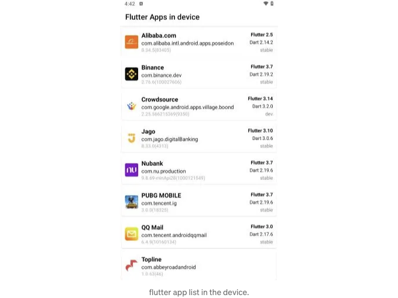

<!-- ui-log 수평형 -->
<ins class="adsbygoogle"
  style="display:block"
  data-ad-client="ca-pub-4877378276818686"
  data-ad-slot="9743150776"
  data-ad-format="auto"
  data-full-width-responsive="true"></ins>
<component is="script">
(adsbygoogle = window.adsbygoogle || []).push({});
</component>

앱에서 사용된 패키지 목록이 제공됩니다. 대부분 pub.dev에서 찾을 수 있는 패키지들입니다. 또한 대기업 앱들 중 일부는 내부 패키지로 개발되어 있습니다. 그것은 더 많은 엔지니어들이 자신만의 패키지를 만들기 때문에 이해할 만합니다. 다음은 패키지 목록의 예시 화면입니다.

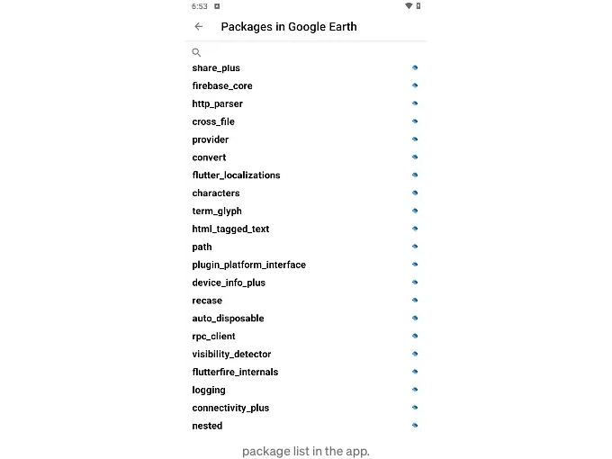

## 제약 사항

데이터는 제가 수동으로 작성했어요 😃. 더 많은 다운로드를 받은 다른 앱들이 있을 수도 있고, 제가 모르는 앱들일 수 있습니다. 목록에 없는 경우 죄송합니다 🙏. 제가 그것을 및 다른 독자들을 위한 참고로 댓글에 남겨주시면 감사하겠습니다.

<!-- ui-log 수평형 -->
<ins class="adsbygoogle"
  style="display:block"
  data-ad-client="ca-pub-4877378276818686"
  data-ad-slot="9743150776"
  data-ad-format="auto"
  data-full-width-responsive="true"></ins>
<component is="script">
(adsbygoogle = window.adsbygoogle || []).push({});
</component>

또 다른 제한 사항은 지역입니다. 특정 국가에서만 제공되는 앱이기 때문에 다운로드할 수 없는 경우가 있습니다. 예를 들어, Nubank나 중국에서 만든 다른 플러터 앱 등이 있습니다.

자, 시작해봅시다...

## 구글 어스

버전: 10.41.0.7(233536593)
Flutter 버전: 3.17
Dart 버전: 3.3.0
앱 내 패키지: 59
상태 관리: Provider
다운로드 횟수: 5억 번 이상

<!-- ui-log 수평형 -->
<ins class="adsbygoogle"
  style="display:block"
  data-ad-client="ca-pub-4877378276818686"
  data-ad-slot="9743150776"
  data-ad-format="auto"
  data-full-width-responsive="true"></ins>
<component is="script">
(adsbygoogle = window.adsbygoogle || []).push({});
</component>

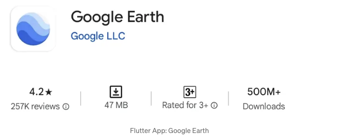

## PUBG MOBILE

버전: 2.8.0(17925)
플러터 버전: 3.7
다트: 2.19.6
앱 내 패키지 수: 4 (모두 내부)
상태 관리: -
다운로드 횟수: 500M+

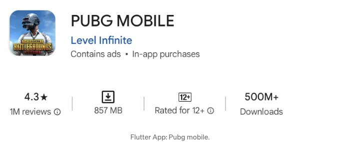

<!-- ui-log 수평형 -->
<ins class="adsbygoogle"
  style="display:block"
  data-ad-client="ca-pub-4877378276818686"
  data-ad-slot="9743150776"
  data-ad-format="auto"
  data-full-width-responsive="true"></ins>
<component is="script">
(adsbygoogle = window.adsbygoogle || []).push({});
</component>

## 누뱅크

버전: 9.5.32-minApi28(1000121212)
Flutter 버전: 3.7
Dart: 2.19.6
앱 내 패키지: 11
상태 관리: -
다운로드 횟수: 1억 회 이상

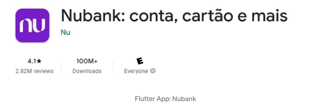

## 그랩

<!-- ui-log 수평형 -->
<ins class="adsbygoogle"
  style="display:block"
  data-ad-client="ca-pub-4877378276818686"
  data-ad-slot="9743150776"
  data-ad-format="auto"
  data-full-width-responsive="true"></ins>
<component is="script">
(adsbygoogle = window.adsbygoogle || []).push({});
</component>

- 버전: 5.272.0(52720000)
- Flutter 버전: 2.8
- Dart: 2.15.0
- 앱 내 패키지: 15
- 상태 관리: -
- 다운로드 횟수: 1억 이상

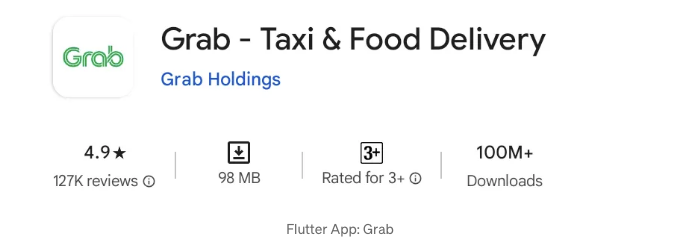

## Alibaba.com

- 버전: 8.26.1(82601)
- Flutter 버전: 2.5
- Dart: 2.14.2
- 앱 내 패키지: 0
- 상태 관리: -
- 다운로드 횟수: 1억 이상

<!-- ui-log 수평형 -->
<ins class="adsbygoogle"
  style="display:block"
  data-ad-client="ca-pub-4877378276818686"
  data-ad-slot="9743150776"
  data-ad-format="auto"
  data-full-width-responsive="true"></ins>
<component is="script">
(adsbygoogle = window.adsbygoogle || []).push({});
</component>

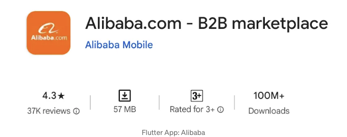

## 바이넨스

버전: 2.70.3 (100027003)
Flutter 버전: 3.7
Dart: 2.192
앱에 포함된 패키지: 159
상태 관리: fluter_hooks, provider, flutter_bloc, bloc.
다운로드 수: 1억 이상

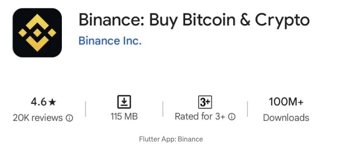

<!-- ui-log 수평형 -->
<ins class="adsbygoogle"
  style="display:block"
  data-ad-client="ca-pub-4877378276818686"
  data-ad-slot="9743150776"
  data-ad-format="auto"
  data-full-width-responsive="true"></ins>
<component is="script">
(adsbygoogle = window.adsbygoogle || []).push({});
</component>

## 4 Pics 1 Word

버전: 62.1.1(61184)
Flutter 버전: 3.13
Dart: 3.1.4
앱 내 패키지: 106
상태 관리: mobx, provider, flutter_mobx
다운로드 횟수: 50백만 회 이상

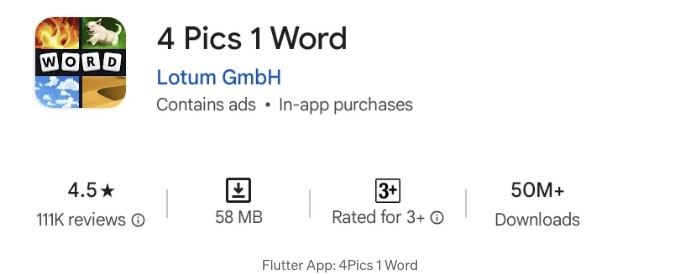

## SATUSEHAT

<!-- ui-log 수평형 -->
<ins class="adsbygoogle"
  style="display:block"
  data-ad-client="ca-pub-4877378276818686"
  data-ad-slot="9743150776"
  data-ad-format="auto"
  data-full-width-responsive="true"></ins>
<component is="script">
(adsbygoogle = window.adsbygoogle || []).push({});
</component>

버전: 5.9.1(235)
Flutter 버전: 3.10
Dart: 3.0.1
앱에 포함된 패키지: 139
상태 관리: bloc, provider, flutter_bloc
다운로드 횟수: 50백만 이상

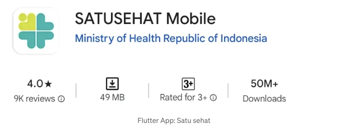

## Grab Driver

버전: 5.298.0(52980000)
Flutter 버전: 2.8
Dart: 2.15.0
앱에 포함된 패키지: 15
상태 관리: -
다운로드 횟수: 10백만 이상

<!-- ui-log 수평형 -->
<ins class="adsbygoogle"
  style="display:block"
  data-ad-client="ca-pub-4877378276818686"
  data-ad-slot="9743150776"
  data-ad-format="auto"
  data-full-width-responsive="true"></ins>
<component is="script">
(adsbygoogle = window.adsbygoogle || []).push({});
</component>

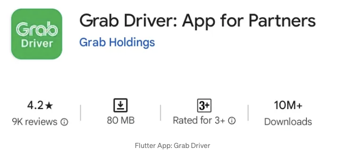

## 수아 뮤직

버전: 5.3.3 (500)
Flutter 버전: 3.1.3
Dart: 3.1.5
앱 내 패키지: 199
상태 관리: bloc, provider
다운로드 횟수: 10백만 회

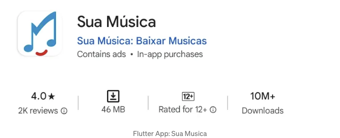

<!-- ui-log 수평형 -->
<ins class="adsbygoogle"
  style="display:block"
  data-ad-client="ca-pub-4877378276818686"
  data-ad-slot="9743150776"
  data-ad-format="auto"
  data-full-width-responsive="true"></ins>
<component is="script">
(adsbygoogle = window.adsbygoogle || []).push({});
</component>

## 은행 자고

버전: 8.26.0 (3461)
Flutter 버전: 3.7
Dart: 2.19.6
앱 내 패키지: 183
상태 관리: flutter_bloc, bloc, provider.
다운로드 횟수: 10백만 이상

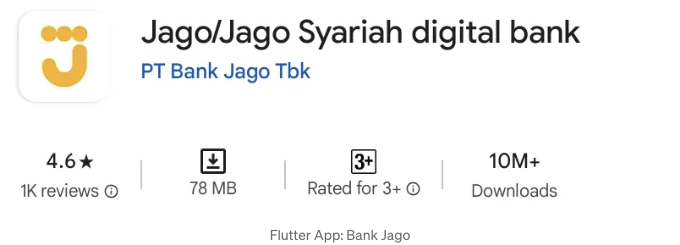

## 내 BMW

<!-- ui-log 수평형 -->
<ins class="adsbygoogle"
  style="display:block"
  data-ad-client="ca-pub-4877378276818686"
  data-ad-slot="9743150776"
  data-ad-format="auto"
  data-full-width-responsive="true"></ins>
<component is="script">
(adsbygoogle = window.adsbygoogle || []).push({});
</component>

버전: 3.11.3(29541)
Flutter 버전: 3.10
Dart: 3.0.6
앱 내 패키지: 441
상태 관리: bloc, provider, flutter_bloc
다운로드 횟수: 1백만 이상

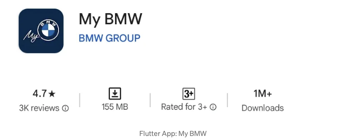

## Crowdsource

버전: 2.25.566215369(9350)
Flutter 버전: 3.2 (개발 중)
Dart: 3.14
앱 내 패키지: 69
상태 관리: -
다운로드 횟수: 1백만 이상

<!-- ui-log 수평형 -->
<ins class="adsbygoogle"
  style="display:block"
  data-ad-client="ca-pub-4877378276818686"
  data-ad-slot="9743150776"
  data-ad-format="auto"
  data-full-width-responsive="true"></ins>
<component is="script">
(adsbygoogle = window.adsbygoogle || []).push({});
</component>

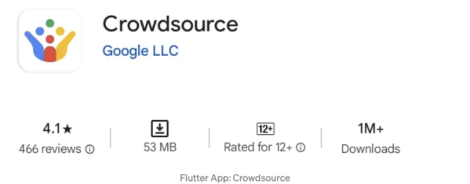

## QQ 메일

버전: 6.4.9 (10160134)
Flutter 버전: 3.0
Dart: 2.17.6
앱 내 패키지: 54
상태 관리: -
다운로드 수: 1백만 이상

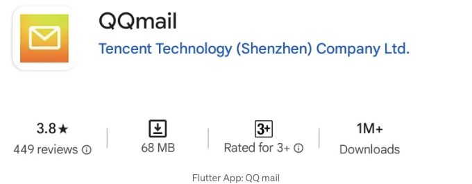

<!-- ui-log 수평형 -->
<ins class="adsbygoogle"
  style="display:block"
  data-ad-client="ca-pub-4877378276818686"
  data-ad-slot="9743150776"
  data-ad-format="auto"
  data-full-width-responsive="true"></ins>
<component is="script">
(adsbygoogle = window.adsbygoogle || []).push({});
</component>

## 해밀턴

버전: 5.3.3 (500)
플러터 버전: 3.10.0
다트: 3.0
앱 내 패키지 수: 172
상태 관리: bloc, flutter_bloc, provider.
다운로드 수: 1백만 이상

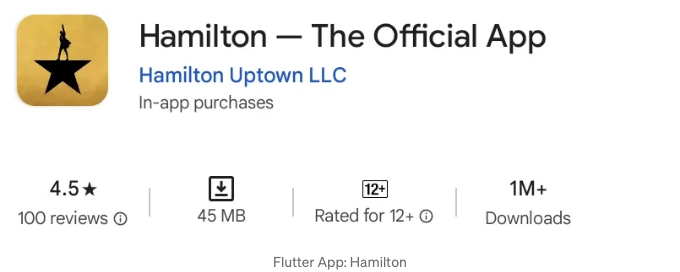

1백만 이상의 다운로드:

<!-- ui-log 수평형 -->
<ins class="adsbygoogle"
  style="display:block"
  data-ad-client="ca-pub-4877378276818686"
  data-ad-slot="9743150776"
  data-ad-format="auto"
  data-full-width-responsive="true"></ins>
<component is="script">
(adsbygoogle = window.adsbygoogle || []).push({});
</component>

- CA24 Mobile: 1M+
- QuintoAndar: 1M+
- Reflectly: 1M+
- Travelstart: 1M+
- 기타

저는 안드로이드 기기만 있어서 플레이 스토어에서만 시도해볼 수 있어요. 앱 스토어나 후아웨이 스토어를 위한 참고 자료가 있다면 댓글란에 남겨주시면 좋겠네요. 😅

인기 앱에서 가장 많이 사용되는 상태 관리자가 Provider임을 알아채셨나요? 그러나 flutter_bloc을 사용하는 케이스 앱은 자동으로 Provider 목록에 포함됩니다. flutter_bloc이 Provider에 의존하기 때문이죠.

또 다른 흥미로운 사실은 My BMW가 애플리케이션에서 441개의 패키지를 사용한다는 것입니다. 제 개인적인 플러터 앱과 비교해보면, 제 앱은 여전히 평균 이하라고 말하고 싶네요. ㅎㅎ 😆

<!-- ui-log 수평형 -->
<ins class="adsbygoogle"
  style="display:block"
  data-ad-client="ca-pub-4877378276818686"
  data-ad-slot="9743150776"
  data-ad-format="auto"
  data-full-width-responsive="true"></ins>
<component is="script">
(adsbygoogle = window.adsbygoogle || []).push({});
</component>

