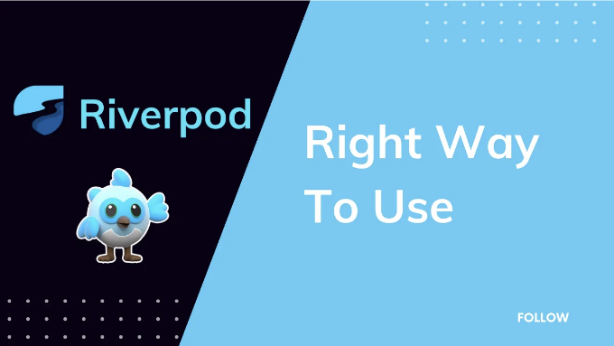

안녕하세요 여러분. 오늘은 Riverpod를 올바르게 사용하는 방법에 대해 이야기해보려고 해요. 많은 구현체를 보았는데 그들은 더 나은 방법으로 결과를 얻기 위해 고민하는 것 같아요. 저는 어떻게 Riverpod를 사용하는지 보여드릴 테니, 다른 관점에서 바라봄에 도움이 되기를 바랍니다.

기초를 가르쳐드릴 건 아니에요. 공식 문서에서 배우세요. 저는 도구들을 더 잘 사용하는 방법만 보여드릴게요.

# Riverpod를 Presenter로 사용하기

<!-- ui-log 수평형 -->
<ins class="adsbygoogle"
  style="display:block"
  data-ad-client="ca-pub-4877378276818686"
  data-ad-slot="9743150776"
  data-ad-format="auto"
  data-full-width-responsive="true"></ins>
<component is="script">
(adsbygoogle = window.adsbygoogle || []).push({});
</component>

가끔 상태가 변경될 때 위젯을 반환하고 싶지 않을 때가 있습니다. 가끔은 Riverpod가 단지 프리젠터 역할만 하는 경우가 있습니다. 사용자 정보 카드를 그리지 않아도 되는 경우도 있죠. 또는 리버포드를 사용하여 로그인 네트워크 호출에 액세스하기 위해 상태로 빈 문자열을 유지할 필요가 없는 경우도 있습니다. 걱정 마세요. 제가 무슨 말인지 이해하실 거예요.

로그인 화면이 있고 인증 플로우가 필요한 상황을 상상해보세요. 첫 번째 선택은 Riverpod를 사용하는 것입니다. 얜! 그러나 초기 상태로 무엇을 넣어야 할지 모르겠죠. 당신이 인증되었으므로 홈 화면으로 이동할 수 있다는 것만 확신할 필요가 있습니다. 그러면 Riverpod의 상태가 무엇을 하는 걸까요? 가짜 UserModel을 넣고 나중에 실제 UserModel로 바꿀 수 있게 할 수도 있습니다. 이렇게 하면 홈 화면으로 이동할 수도 있습니다.

맞는 것 같지만 여기에는 두 가지 오류가 있습니다.

- Riverpod를 사용하여 네트워크 계층에 액세스하기 위해 사용하는 것뿐이죠. 이 것은 UI에서 직접 사용하여 수행할 수 있습니다(이것도 올바른 방법은 아닙니다).
- Riverpod 내에서 네비게이션(예: 글로벌 네비게이터 키 사용)합니다.

<!-- ui-log 수평형 -->
<ins class="adsbygoogle"
  style="display:block"
  data-ad-client="ca-pub-4877378276818686"
  data-ad-slot="9743150776"
  data-ad-format="auto"
  data-full-width-responsive="true"></ins>
<component is="script">
(adsbygoogle = window.adsbygoogle || []).push({});
</component>

그럼, 무엇을 할 수 있을까요?

- 현재 인증 상태를 추적하기 위한 enum을 생성하세요.
- UI 측에서 상태 변경을 듣고 성공한 경우에만 이동하세요.

아래 예시를 살펴봅시다.

보셨나요? 저는 Riverpod에 그 일을 맡기고 있어요. Riverpod에게 이동을 맡기지 않아요. 저는 성공 상태를 듣기만 하면 돼요. 이는 Riverpod, Bloc 또는 다른 상태 관리 도구에서 발생할 수 있어요.

<!-- ui-log 수평형 -->
<ins class="adsbygoogle"
  style="display:block"
  data-ad-client="ca-pub-4877378276818686"
  data-ad-slot="9743150776"
  data-ad-format="auto"
  data-full-width-responsive="true"></ins>
<component is="script">
(adsbygoogle = window.adsbygoogle || []).push({});
</component>

# 앱을 통해 너무 많은 데이터를 전달한다고 느끼세요?

누가 안 그럴까요? 그겠지요? 이것이 왜 상태 관리 도구를 사용하는 이유인데요. 우리는 상태/데이터를 수동으로 전달하고 싶지 않아요. 그런데 Riverpod를 사용해도 여전히 그럴 수 있어요. 제가 여러분에게 올바르지 않은 방법과 올바른 방법을 보여줄게요. 그리고 그것이 왜 올바르거나 틀린지 설명할게요.

## 잘못된 방법

제가 GetProductsProvider를 사용할 때마다 현재 값인 ProductFilter를 전달해야 합니다. 그리고 제가 제품 페이지에 있고 필터를 변경하면 filter 매개변수와 함께 getProducts를 호출해야 합니다. 업데이트를 수동으로 트리거하는 다른 방법을 사용할 수 있습니다. 필터 변경에 대해 즉각적인 효과가 나타나지 않을 수 있고 사용자가 언제 적용될지를 결정할 수 있습니다. 그렇지만, 여전히 매번 필터 값을 전달할 필요가 없어요. 이렇게 계속하고 있다고 느낄 때, ProductFilter에 액세스하기 위해 다른 공급자에 의존해야 해요.

<!-- ui-log 수평형 -->
<ins class="adsbygoogle"
  style="display:block"
  data-ad-client="ca-pub-4877378276818686"
  data-ad-slot="9743150776"
  data-ad-format="auto"
  data-full-width-responsive="true"></ins>
<component is="script">
(adsbygoogle = window.adsbygoogle || []).push({});
</component>

## 올바른 방법

보세요? 수동으로 아무 것도 전달하지 않습니다. filter가 변경될 때 getProductsProvider가 제품을 가져옵니다. 이 버전에서는 언제 가져와야 하는지 제어할 수 없습니다. 단순히, 다음을 통해 할 수 있습니다.

filter를 읽고 제품을 가져옵니다. ProductFilterProvider의 상태 변경은 GetProductsProvider에 영향을 주지 않습니다. 가져오기를 원한다면 GetProductsProvider를 무효화하면 됩니다. 그러면 빌드가 다시 실행됩니다.

보세요? 어렵게 하려고 노력하지 않습니다. 데이터를 전달하는 것보다 훨씬 쉽습니다. 그러나 반복적인 경우가 없다면 인수를 사용할 수 있습니다. 예를 들어 제품 ID로 제품 세부 정보를 가져오기와 같은 경우입니다. 이렇게요.

<!-- ui-log 수평형 -->
<ins class="adsbygoogle"
  style="display:block"
  data-ad-client="ca-pub-4877378276818686"
  data-ad-slot="9743150776"
  data-ad-format="auto"
  data-full-width-responsive="true"></ins>
<component is="script">
(adsbygoogle = window.adsbygoogle || []).push({});
</component>

# 마무리

지금까지 읽어주셔서 감사합니다. 오늘 새로운 시각에서 생각할 수 있도록 도와드린 것이 좋았길 바랍니다.

만약 이 글이 도움이 되었다면, 저를 팔로우하고 박수를 보내주시고 글을 공유해주세요.

읽어주셔서 감사합니다.

<!-- ui-log 수평형 -->
<ins class="adsbygoogle"
  style="display:block"
  data-ad-client="ca-pub-4877378276818686"
  data-ad-slot="9743150776"
  data-ad-format="auto"
  data-full-width-responsive="true"></ins>
<component is="script">
(adsbygoogle = window.adsbygoogle || []).push({});
</component>

<!-- ui-log 수평형 -->
<ins class="adsbygoogle"
  style="display:block"
  data-ad-client="ca-pub-4877378276818686"
  data-ad-slot="9743150776"
  data-ad-format="auto"
  data-full-width-responsive="true"></ins>
<component is="script">
(adsbygoogle = window.adsbygoogle || []).push({});
</component>
