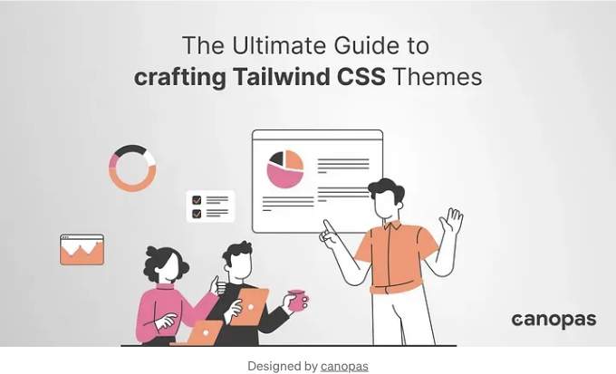

# 배경

Tailwind CSS는 유틸리티를 먼저 고려하는 스타일링 방식으로 웹 개발을 혁신했습니다. 이를 통해 반응형 웹사이트를 빠르게 구축할 수 있게 해줍니다.

하지만... 기본 스타일 이상을 원한다면 어떨까요? 특정 섹션, 관객 또는 마케팅 캠페인에 맞게 웹사이트에 독특한 개성을 불어넣고 싶다면 어떨까요? 답은 애플리케이션을 위한 CSS 테마를 만드는 마법에 있습니다.

<!-- ui-log 수평형 -->
<ins class="adsbygoogle"
  style="display:block"
  data-ad-client="ca-pub-4877378276818686"
  data-ad-slot="9743150776"
  data-ad-format="auto"
  data-full-width-responsive="true"></ins>
<component is="script">
(adsbygoogle = window.adsbygoogle || []).push({});
</component>

개발자로서 프로젝트를 더욱 높은 수준으로 발전시키고 싶거나 창의적인 가능성을 탐색하고 싶은 경우, 이 포스트는 여러분이 단계별로 쉽게 Tailwind 테마를 마스터하는 데 도움이 될 것입니다.

그러니 Tailwind의 파워로 구축된 디자인 유연성, 브랜드 일관성 및 향상된 사용자 경험에 대해 배우기 위해 준비하세요!

# 후원

혁신은 종종 역량을 확장함으로써 얻어집니다. 일관성을 유지하는 데 도움을 받아 이를 달성할 수 있습니다. 건강한 습관을 형성하고 일관성 있게 유지하기 위해 Justly를 시도해보세요.

<!-- ui-log 수평형 -->
<ins class="adsbygoogle"
  style="display:block"
  data-ad-client="ca-pub-4877378276818686"
  data-ad-slot="9743150776"
  data-ad-format="auto"
  data-full-width-responsive="true"></ins>
<component is="script">
(adsbygoogle = window.adsbygoogle || []).push({});
</component>

# 테마의 장점

테마 디자인은 브랜딩부터 SEO 향상에 이르기까지 여러 이점을 가질 수 있습니다. 코딩에 골몰하기 전에 웹사이트나 애플리케이션에 테마를 적용하는 이점을 빠르게 살펴보겠습니다.

- 브랜딩과 일관성: 테마를 작성하면 브랜드 아이덴티티와 일치하는 일관된 룩 앤 필을 만들 수 있습니다. 이는 사용자에게 전문적이고 기억에 남는 경험을 제공하는 데 도움이 됩니다.
- 사용자 선호도: 사용자가 테마(예: 밝은/어두운 모드)를 선택할 수 있도록 하는 것은 접근성을 촉진하고 경험을 개인화하는 데 도움이 됩니다.
- 접근성: 훌륭하게 디자인된 테마는 장애를 가진 사용자에게도 접근 가능할 것입니다. 즉, 화면 판독기를 사용하는 사람들, 시력이 낮은 사람들 또는 다른 장애를 가진 사람들이 사용할 수 있는 웹사이트나 애플리케이션이 될 것입니다.
- 콘텐츠 중심: 콘텐츠의 성격을 가장 잘 보여줄 수 있는 테마를 선택할 수 있습니다. 예를 들어, 어두운 테마는 감각적인 사진을 전시하는 포트폴리오에 적합하고, 밝은 테마는 교육 콘텐츠에 더 적합할 수 있습니다.
- A/B 테스트 및 최적화: 다양한 테마로 실험하여 누구와 잘 맞는지 확인하고 전홥률을 개선할 수 있습니다.
- 검색 엔진 최적화(SEO): 잘 구조화되고 일관된 테마는 웹사이트의 SEO를 향상시킬 수 있습니다. Google과 같은 검색 엔진은 명확하고 일관된 테마의 웹사이트의 콘텐츠를 더 쉽게 이해할 수 있습니다.

# Tailwind.css를 사용하여 다양한 테마 생성하기

<!-- ui-log 수평형 -->
<ins class="adsbygoogle"
  style="display:block"
  data-ad-client="ca-pub-4877378276818686"
  data-ad-slot="9743150776"
  data-ad-format="auto"
  data-full-width-responsive="true"></ins>
<component is="script">
(adsbygoogle = window.adsbygoogle || []).push({});
</component>

이 섹션에서는 Tailwind CSS를 사용하여 웹 애플리케이션의 테마를 쉽게 만드는 방법에 대한 단계별 안내를 살펴보겠습니다.


## 전제 조건

테마를 만들려면 다음 사항이 준비되어 있어야 합니다.

<!-- ui-log 수평형 -->
<ins class="adsbygoogle"
  style="display:block"
  data-ad-client="ca-pub-4877378276818686"
  data-ad-slot="9743150776"
  data-ad-format="auto"
  data-full-width-responsive="true"></ins>
<component is="script">
(adsbygoogle = window.adsbygoogle || []).push({});
</component>

- 웹 프레임워크를 사용하는 경우 해당 프론트엔드 프레임워크에는 tailwind.css의 최신 버전이 설치되어 있습니다.
- 프로젝트 루트에 tailwind.config 파일이 있습니다.
- 다음 내용이 포함 된 tailwind.css를위한 style.css 파일

```js
/* style.css */
@tailwind base;
@tailwind components;
@tailwind utilities;
```

# 색상 및 크기 결정

적절한 색상을 선택하는 것은 시각적으로 매력적이고 일관된 테마를 만드는 데 중요합니다. 브랜드 아이덴티티, 타겟 오디언스 및 만들고자하는 전반적인 분위기를 고려하십시오. Adobe Color 또는 Coolors와 같은 온라인 도구를 사용하여 조화로운 색상 팔레트를 만드는 데 도움을 받을 수 있습니다.

<!-- ui-log 수평형 -->
<ins class="adsbygoogle"
  style="display:block"
  data-ad-client="ca-pub-4877378276818686"
  data-ad-slot="9743150776"
  data-ad-format="auto"
  data-full-width-responsive="true"></ins>
<component is="script">
(adsbygoogle = window.adsbygoogle || []).push({});
</component>

다양한 테마를 작업하기 위해 가장 먼저 해야 할 것은 전체 응용 프로그램의 기본 색상 및 크기를 결정하는 것입니다.

배경, 테두리 및 글꼴을 위한 기본 테마 색상 및 크기를 나열하십시오. 이는 모든 인간 상호 작용 이벤트에 대한 것이며 마우스를 올렸을 때, 초점을 맞췄을 때 및 클릭했을 때도 포함됩니다.

이 블로그 포스트는 원래 canopas.com에서 발행되었습니다.

# 보여주시는 관심에 감사드립니다!

<!-- ui-log 수평형 -->
<ins class="adsbygoogle"
  style="display:block"
  data-ad-client="ca-pub-4877378276818686"
  data-ad-slot="9743150776"
  data-ad-format="auto"
  data-full-width-responsive="true"></ins>
<component is="script">
(adsbygoogle = window.adsbygoogle || []).push({});
</component>

위의 글이 마음에 드신다면, 아래에 👏 👏👏 를 주시는 기회를 놓치지 마세요 — 작가로서 그것은 세상을 의미합니다!

피드백과 제안은 언제든지 환영이니, 아래 댓글란에 남겨주세요.

Canopas를 팔로우하여 흥미로운 기사 업데이트를 받아보세요!