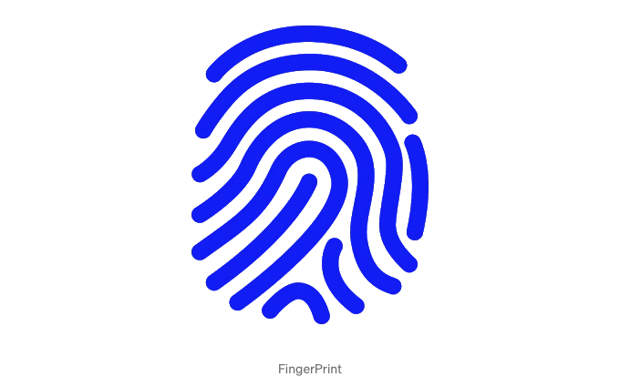

요즘의 디지턈 세계에서는 보안이 매우 중요합니다, 특히 민감한 정보를 다루는 모바일 애플리케이션에서는 더욱 그렇습니다. 지문 인식과 같은 생체 인증은 사용자를 인증하는 편리하고 안전한 방법을 제공합니다. 이 기사에서는 Flutter 앱에 생체 인증(지문)을 통합하는 방법을 알아보겠습니다.



소개

생체 인증은 사용 편의성과 높은 수준의 보안 때문에 점점 인기가 높아지고 있습니다. Flutter는 Google의 UI 툴킷으로, 단일 코드베이스에서 모바일, 웹, 데스크톱용으로 네이티브로 컴파일된 애플리케이션을 개발하기 위한 훌륭한 지원을 제공합니다. 앱에 생체 인증을 통합하는 데 탁월한 지원을 제공합니다.

<!-- ui-log 수평형 -->
<ins class="adsbygoogle"
  style="display:block"
  data-ad-client="ca-pub-4877378276818686"
  data-ad-slot="9743150776"
  data-ad-format="auto"
  data-full-width-responsive="true"></ins>
<component is="script">
(adsbygoogle = window.adsbygoogle || []).push({});
</component>

전제 조건

시작하기 전에 다음 사항을 준비하세요:

- 플러터 SDK가 기기에 설치되어 있어야 합니다.
- 플러터와 다트 프로그래밍 언어에 대한 기본적인 이해가 필요합니다.
- 지문 센서가 탑재된 기기(테스트용)가 필요합니다.

플러터 프로젝트 설정하기

<!-- ui-log 수평형 -->
<ins class="adsbygoogle"
  style="display:block"
  data-ad-client="ca-pub-4877378276818686"
  data-ad-slot="9743150776"
  data-ad-format="auto"
  data-full-width-responsive="true"></ins>
<component is="script">
(adsbygoogle = window.adsbygoogle || []).push({});
</component>

먼저 새로운 Flutter 프로젝트를 생성하세요:

```js
flutter create biometric_authentication
cd biometric_authentication          
```

다음으로, pubspec.yaml 파일에 local_auth 패키지를 추가해주세요:

```js
dependencies:
  flutter:
    sdk: flutter
  local_auth: ^2.0.1
```

<!-- ui-log 수평형 -->
<ins class="adsbygoogle"
  style="display:block"
  data-ad-client="ca-pub-4877378276818686"
  data-ad-slot="9743150776"
  data-ad-format="auto"
  data-full-width-responsive="true"></ins>
<component is="script">
(adsbygoogle = window.adsbygoogle || []).push({});
</component>

그럼, flutter pub get을 실행하여 패키지를 설치하십시오.

바이오메트릭 인증 구현하기

main.dart 파일을 열고 필요한 라이브러리를 import하십시오:

```js
import 'package:flutter/material.dart';
import 'package:local_auth/local_auth.dart';
```

<!-- ui-log 수평형 -->
<ins class="adsbygoogle"
  style="display:block"
  data-ad-client="ca-pub-4877378276818686"
  data-ad-slot="9743150776"
  data-ad-format="auto"
  data-full-width-responsive="true"></ins>
<component is="script">
(adsbygoogle = window.adsbygoogle || []).push({});
</component>

생체 인증을 처리하는 새로운 클래스를 만들어 보세요:

```js
class BiometricAuth {
  final LocalAuthentication _localAuthentication = LocalAuthentication();

  Future<bool> authenticate() async {
    try {
      return await _localAuthentication.authenticate(
        localizedReason: '계정에 액세스하려면 인증하세요',
        biometricOnly: true,
        useErrorDialogs: true,
        stickyAuth: true,
      );
    } catch (e) {
      print('에러: $e');
      return false;
    }
  }

  Future<void> cancelAuthentication() async {
    await _localAuthentication.stopAuthentication();
  }
}
```

생체 인증 사용하기

앱의 UI에서 authenticate() 메소드를 호출하여 사용자를 인증할 수 있습니다.

<!-- ui-log 수평형 -->
<ins class="adsbygoogle"
  style="display:block"
  data-ad-client="ca-pub-4877378276818686"
  data-ad-slot="9743150776"
  data-ad-format="auto"
  data-full-width-responsive="true"></ins>
<component is="script">
(adsbygoogle = window.adsbygoogle || []).push({});
</component>

```js
class MyApp extends StatelessWidget {
  final BiometricAuth _biometricAuth = BiometricAuth();

  @override
  Widget build(BuildContext context) {
    return MaterialApp(
      home: Scaffold(
        appBar: AppBar(
          title: Text('생체 인증'),
        ),
        body: Center(
          child: ElevatedButton(
            onPressed: () async {
              bool isAuthenticated = await _biometricAuth.authenticate();
              if (isAuthenticated) {
                // 인증 성공
                print('인증 성공');
              } else {
                // 인증 실패
                print('인증 실패');
              }
            },
            child: Text('인증하기'),
          ),
        ),
      ),
    );
  }
}
```

결론

이번 튜토리얼에서는 local_auth 패키지를 사용하여 Flutter 앱에 생체 인증(지문)을 통합하는 방법을 배웠습니다. 생체 인증은 사용자를 안전하고 편리하게 인증하는 방법을 제공하여 Flutter 애플리케이션의 전체 보안성을 향상시킵니다.

Github 링크: https://github.com/SalimZ04/bio_auth_local.git