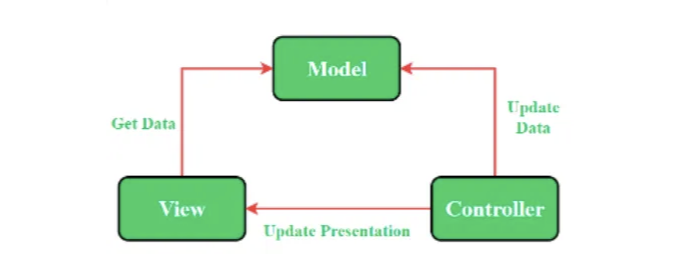
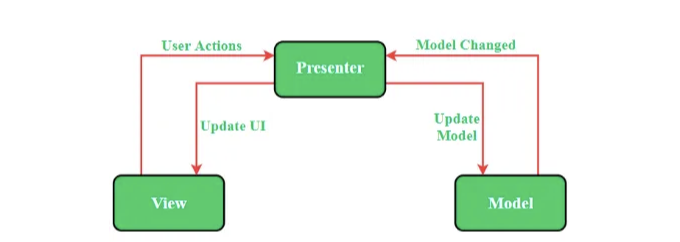
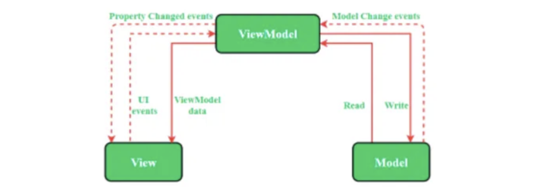
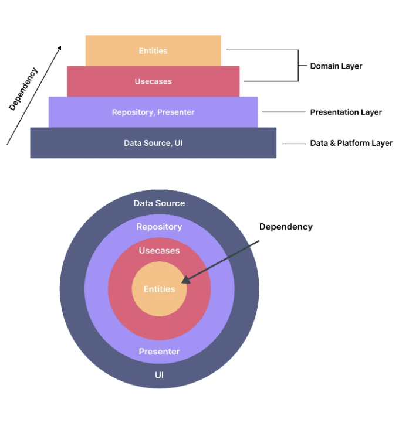

## 플러터/다트 인터뷰에서 주로 묻는 모든 측면에 관한 질문을 논의합니다


이 글에서는 대부분의 Flutter와 Dart 인터뷰 질문에 대해 논의할 것입니다. 이는 인터뷰어가 질문할 가능성이 있는 질문들입니다.

플러터는 구글이 개발한 훌륭한 오픈 소스 소프트웨어 개발 키트입니다. 아래는 이 프레임워크를 더 잘 이해하는 데 도움이 되는 몇 가지 플러터 개발자 인터뷰 질문입니다. 플러터 인터뷰 질문의 아이디어를 제공하는 것뿐만 아니라 플러터 인터뷰에서 성공하기 위한 팁도 제공해 드리겠습니다.

<!-- ui-log 수평형 -->
<ins class="adsbygoogle"
  style="display:block"
  data-ad-client="ca-pub-4877378276818686"
  data-ad-slot="9743150776"
  data-ad-format="auto"
  data-full-width-responsive="true"></ins>
<component is="script">
(adsbygoogle = window.adsbygoogle || []).push({});
</component>

만약 빠르고 쉬운 설명을 원하시면, 이 비디오를 시청해보세요:

플러터 면접 질문과 답변은 질문을 찾고 있는 지원자이든 플러터 개발자를 찾고 있는 채용 담당자이든 모두에게 큰 도움이 될 것입니다.

그러니 간단한 질문부터 시작해서 세부 사항들을 논의해봅시다.

1) 플러터란 무엇인가요?
플러터는 구글이 만든 오픈 소스 프레임워크로, 단일 코드베이스에서 아름다운 네이티브 컴파일된 멀티 플랫폼 애플리케이션을 구축하는 데 사용됩니다.
플러터는 언어가 아니라 SDK입니다. 플러터 앱은 앱을 만들 때 Dart 프로그래밍 언어를 사용합니다. 플러터의 첫 알파 버전은 2017년 5월에 출시되었습니다.

<!-- ui-log 수평형 -->
<ins class="adsbygoogle"
  style="display:block"
  data-ad-client="ca-pub-4877378276818686"
  data-ad-slot="9743150776"
  data-ad-format="auto"
  data-full-width-responsive="true"></ins>
<component is="script">
(adsbygoogle = window.adsbygoogle || []).push({});
</component>

2) Dart는 무엇인가요?
Dart는 2011년 Google에서 오픈 소스로 개발된 것입니다. Dart 프로그래밍의 목적은 웹 및 모바일 앱을위한 프론트엔드 사용자 인터페이스를 만드는 것입니다.
Dart는 모든 플랫폼에서 빠른 앱 개발을 위해 최적화된 클라이언트용 언어입니다. 그 목표는 다중 플랫폼 개발을 위한 가장 생산적인 프로그래밍 언어를 제공하는 것입니다.

3) Flutter 위젯은 무엇인가요?
Flutter 위젯은 React에서 영감을 받은 현대적인 프레임워크를 사용하여 구축됩니다. 중심 아이디어는 UI를 위젯으로 구축하는 것입니다. 위젯은 현재의 구성 및 상태에 따라 뷰가 어떻게 보여야 하는지 설명합니다. 위젯의 상태가 변경될 때, 위젯은 설명을 다시 빌드하며, 프레임워크는 이전 설명과 비교하여 상태를 이동하기 위해 기본 렌더 트리에서 필요한 최소한의 변경을 결정합니다.

4) Flutter에서 Stateful 위젯과 Stateless 위젯의 차이는 무엇인가요?

Stateless 위젯은 사용자 인터페이스의 일부가 구성 정보와 BuildContext를 제외하고 아무 것에도 의존하지 않을 때 유용합니다. 반면에 Stateful 위젯은 사용자 인터페이스의 일부가 동적으로 변경될 때 유용합니다.

<!-- ui-log 수평형 -->
<ins class="adsbygoogle"
  style="display:block"
  data-ad-client="ca-pub-4877378276818686"
  data-ad-slot="9743150776"
  data-ad-format="auto"
  data-full-width-responsive="true"></ins>
<component is="script">
(adsbygoogle = window.adsbygoogle || []).push({});
</component>

Stateful 위젯은 가변적인 위젯입니다. 그래서 수명 주기 내에 여러 번 그려질 수 있습니다. 내부 데이터가 위젯의 수명 주기 동안 변경될 수 있기 때문에 이를 동적이라고 합니다. 화면을 새로고침할 수 있게 하는 위젯을 Stateful 위젯이라고 합니다. 이 위젯은 createState() 메서드를 가지고 있어서 Flutter State Class를 확장한 클래스를 반환합니다. Stateful 위젯의 예시로는 Checkbox, Radio, Slider, InkWell, Form, TextField 등이 있습니다.

Stateless 위젯은 스스로 다시 빌드하지 않지만 외부 이벤트로부터 그렇게 할 수 있습니다. Stateless 위젯은 상태 정보가 없습니다. 수명 주기 동안 항상 정적인 상태를 유지합니다. Stateless 위젯의 예시로는 Text, Row, Column, Container 등이 있습니다. 화면이나 위젯에 정적 콘텐츠가 포함되어 있다면 Stateless 위젯이어야 합니다. 그러나 콘텐츠를 변경하고 싶다면 Stateful 위젯이어야 합니다.

<!-- ui-log 수평형 -->
<ins class="adsbygoogle"
  style="display:block"
  data-ad-client="ca-pub-4877378276818686"
  data-ad-slot="9743150776"
  data-ad-format="auto"
  data-full-width-responsive="true"></ins>
<component is="script">
(adsbygoogle = window.adsbygoogle || []).push({});
</component>

- createState(): 새 StatefulWidget을 빌드할 때 바로 이 메소드가 호출되며, 이 오버라이드 메소드는 반드시 존재해야 합니다.
- initState(): 위젯이 생성된 후에 호출되는 첫 번째 메소드입니다. 우리는 이것을 onCreate() 또는 viewDidLoad()에 상응하는 것으로 생각할 수 있습니다.
- didChangeDependencies(): 이 메소드는 위젯이 처음으로 빌드될 때 initState() 바로 다음에 호출됩니다.
- build(): didChangeDependencies() 다음에 호출됩니다. 여기서 모든 GUI가 렌더링되며 UI를 렌더링해야 할 때마다 호출됩니다.
- didUpdateWidget(): 부모 위젯이 변경되어 UI를 다시 그려야 할 때 호출됩니다.
- deactivate(): 프레임워크는 이 상태 객체를 트리에서 제거할 때마다 이 메소드를 호출합니다.
- dispose(): 이 객체와 해당 상태가 트리에서 영구적으로 제거되고 다시 빌드되지 않을 때 호출됩니다.

더 자세한 내용은 여기를 클릭해주세요.

6) AppLifecycleState란 무엇인가요?

AppLifecycleState는 다음과 같습니다:

<!-- ui-log 수평형 -->
<ins class="adsbygoogle"
  style="display:block"
  data-ad-client="ca-pub-4877378276818686"
  data-ad-slot="9743150776"
  data-ad-format="auto"
  data-full-width-responsive="true"></ins>
<component is="script">
(adsbygoogle = window.adsbygoogle || []).push({});
</component>

- 비활성화 — 응용프로그램이 활성화되어 있지 않으며 사용자 입력을 받고 있지 않습니다. (iOS 전용).
- 일시정지 — 응용프로그램이 현재 사용자에게 보이지 않고 사용자 입력에 응답하지 않고 백그라운드에서 실행 중입니다.
- 다시 시작 — 응용프로그램이 사용자에게 보이고 사용자 입력에 응답하고 있습니다.
- 일시중지 — 응용프로그램이 잠시 후에 일시정지됩니다. (Android 전용).

자세한 내용을 보려면 여기를 클릭하세요.

7) pubspec.yaml 파일은 무엇입니까?
프로젝트에 포함하려는 이미지/글꼴/삼자간 패키지를 가져오고 제어하는 책임이 있습니다.
pubspec.yaml 파일은 플러터 프로젝트의 종속성을 정의하는 데 사용됩니다. 이 메타데이터 정보는 YAML 언어로 작성됩니다. 이 파일에는 이름, 버전, 설명, 홈페이지, 저장소, 문서, 종속성, 환경 등 다음과 같은 필드가 포함될 수 있습니다.

8) 플러터 패키지와 플러터 플러그인의 차이점은 무엇입니까?
"패키지"는 Dart 코드만 포함합니다.
"플러그인"은 Dart와 Native 코드(kotlin/js/swift/…)를 모두 포함합니다.

<!-- ui-log 수평형 -->
<ins class="adsbygoogle"
  style="display:block"
  data-ad-client="ca-pub-4877378276818686"
  data-ad-slot="9743150776"
  data-ad-format="auto"
  data-full-width-responsive="true"></ins>
<component is="script">
(adsbygoogle = window.adsbygoogle || []).push({});
</component>

플러터 플러그인: (네이티브 관련 개발).
플러터 플러그인은 안드로이드(Kotlin 또는 Java) 및 iOS(Swift 또는 Objective-C)와 같은 네이티브 코드를 감싸는 것입니다.
플러터는 플랫폼 채널과 메시지 전달을 통해 네이티브 응용 프로그램이 수행할 수 있는 모든 작업을 수행할 수 있습니다. 플러터는 네이티브 iOS/Android 코드에 작업명령을 내려 결과를 Dart로 반환합니다.

플러터 패키지 또는 모듈: (유틸 라이브러리에서 코드를 사용하여 개발 속도 향상).
플러터는 다른 개발자가 기여한 공유 패키지를 사용할 수 있습니다. 이렇게 하면 모든 것을 처음부터 개발할 필요 없이 앱을 빠르게 구축할 수 있습니다.

패키지가 필요하면 플러그인을 사용할 수 있습니다. 그래도 패키지로 취급됩니다.

9) WidgetsApp과 MaterialApp의 차이점은 무엇입니까?

<!-- ui-log 수평형 -->
<ins class="adsbygoogle"
  style="display:block"
  data-ad-client="ca-pub-4877378276818686"
  data-ad-slot="9743150776"
  data-ad-format="auto"
  data-full-width-responsive="true"></ins>
<component is="script">
(adsbygoogle = window.adsbygoogle || []).push({});
</component>

위젯 앱:- 애플리케이션에서 일반적으로 요구되는 여러 위젯을 감싸는 편리한 클래스입니다.
위젯 앱이 제공하는 주요 역할 중 하나는 시스템 백 버튼을 바인딩하여 네비게이터를 팝하거나 애플리케이션을 종료하는 것입니다.

매터리얼 앱:- 매터리얼 디자인 애플리케이션에서 일반적으로 요구되는 여러 위젯을 감싸는 편리한 위젯입니다.
매터리얼 앱은 애니메이티드 테마와 그리드 페이퍼와 같은 매터리얼 디자인 특정 기능을 추가하여 위젯 앱을 확장합니다.

10) 핫 리로드와 핫 리스타트의 차이는 무엇인가요?

간단히 말해,
핫 리로드는 프로그램의 변경 사항을 업데이트하는 것입니다.
하지만 핫 리스타트는 이전 상태를 다시 제거하고 전체 프로그램을 실행하는 것입니다.

<!-- ui-log 수평형 -->
<ins class="adsbygoogle"
  style="display:block"
  data-ad-client="ca-pub-4877378276818686"
  data-ad-slot="9743150776"
  data-ad-format="auto"
  data-full-width-responsive="true"></ins>
<component is="script">
(adsbygoogle = window.adsbygoogle || []).push({});
</component>

핫 리로드

- 플러터 핫 리로드 기능은 명령 프롬프트나 터미널에서 Small r 키를 조합하여 작동합니다.
- 핫 리로드 기능은 파일에 추가한 코드를 빠르게 컴파일하고 해당 코드를 Dart 가상 머신으로 전송합니다. 코드 업데이트가 완료되면 Dart 가상 머신이 위젯으로 앱 UI를 업데이트합니다.
- 핫 리로드는 핫 리스타트보다 적은 시간이 소요됩니다.
- 핫 리로드의 단점도 있습니다. 애플리케이션에서 상태를 사용 중이라면 핫 리로드가 상태를 유지해 기본값으로 업데이트되지 않습니다.

핫 리스타트

- 핫 리스타트는 핫 리로드와 매우 다릅니다.
- 핫 리스타트에서는 유지된 상태 값을 소멸시키고 기본값으로 설정합니다. 따라서 애플리케이션에서 상태 값을 사용 중이라면 매번 핫 리스타트 후에 개발자는 완전히 컴파일된 애플리케이션을 받고 모든 상태가 기본값으로 설정됩니다.
- 앱 위젯 트리는 새로운 유형의 코드로 완전히 다시 빌드됩니다.
- 핫 리스타트는 핫 리로드보다 훨씬 많은 시간이 소요됩니다.

<!-- ui-log 수평형 -->
<ins class="adsbygoogle"
  style="display:block"
  data-ad-client="ca-pub-4877378276818686"
  data-ad-slot="9743150776"
  data-ad-format="auto"
  data-full-width-responsive="true"></ins>
<component is="script">
(adsbygoogle = window.adsbygoogle || []).push({});
</component>

11) 스캐폴드를 중첩할 수 있나요? 그 이유는 무엇인가요?

네, 스캐폴드를 중첩할 수 있어요. 이것이 플러터의 매력이에요. 전체 UI를 제어할 수 있어요.
스캐폴드는 그냥 위젯일 뿐이기 때문에 어디에든지 넣을 수 있어요. 중첩하면 드로어, 스낵바 및 바텀 시트를 겹쳐 놓을 수 있어요.

12) 플러터의 주요 기능 중 일부를 설명해주세요.

플러터를 사용하는 주요 기능 중 일부는,

<!-- ui-log 수평형 -->
<ins class="adsbygoogle"
  style="display:block"
  data-ad-client="ca-pub-4877378276818686"
  data-ad-slot="9743150776"
  data-ad-format="auto"
  data-full-width-responsive="true"></ins>
<component is="script">
(adsbygoogle = window.adsbygoogle || []).push({});
</component>

빠른 개발 - 풍부한 커스터마이즈가 가능한 위젯 세트를 사용하여 플러터로 몇 분만에 네이티브 인터페이스를 구축할 수 있습니다.

표현력과 유연성 있는 UI - 플러터의 계층 구조를 통해 UI를 완전히 사용자 정의할 수 있습니다. 이로 인해 빠른 렌더링 및 표현력 있는 디자인이 가능합니다.

네이티브 성능 - 플러터에 포함된 위젯은 스크롤, 탐색, 아이콘 등과 같은 모든 중요한 플랫폼 차이를 통합합니다. 이렇게 함으로써 모든 플랫폼에서 완전한 네이티브 성능을 제공합니다.

13) 위젯 재구성을 줄이는 방법은 무엇인가요?
상태가 변경될 때 위젯을 다시 구성합니다. 이는 정상적이고 바람직한 동작입니다. 사용자가 UI에 반영된 상태 변경을 볼 수 있게 해줍니다. 그러나 변경할 필요가 없는 UI의 일부를 다시 구성하는 것은 낭비입니다.

<!-- ui-log 수평형 -->
<ins class="adsbygoogle"
  style="display:block"
  data-ad-client="ca-pub-4877378276818686"
  data-ad-slot="9743150776"
  data-ad-format="auto"
  data-full-width-responsive="true"></ins>
<component is="script">
(adsbygoogle = window.adsbygoogle || []).push({});
</component>

불필요한 위젯 재구성을 줄이기 위해 할 수 있는 몇 가지 방법이 있어요.

- 첫 번째 방법은 큰 위젯 트리를 작은 개별 위젯으로 리팩터링하는 것입니다. 각 위젯은 자체 build 메서드를 가지게 되어요.
- 가능한 경우 const 생성자를 사용하세요. 이렇게 하면 Flutter에게 위젯을 다시 빌드할 필요가 없다는 것을 알려줍니다.
- Stateful 위젯의 서브트리를 가능한 한 작게 유지하세요. Stateful 위젯이 그 아래에 위젯 서브트리를 가져야 하는 경우 Stateful 위젯을 위한 사용자 정의 위젯을 만들고 하위 매개변수를 지정하세요.

14) BuildContext란 무엇이고 어떻게 유용한가요?
BuildContext는 엘리먼트 트리에서 위젯의 요소입니다 — 그래서 각 위젯은 자체 BuildContext를 가지고 있어요.

보통 BuildContext를 사용하여 테마나 다른 위젯에 대한 참조를 얻습니다. 예를 들어, 재질 다이얼로그를 표시하려면 스캐폴드에 대한 참조가 필요합니다. context가 BuildContext인 경우 Scaffold.of(context)로 참조를 얻을 수 있어요. of()는 가장 가까운 스캐폴드를 찾을 때까지 트리를 올라갑니다.

<!-- ui-log 수평형 -->
<ins class="adsbygoogle"
  style="display:block"
  data-ad-client="ca-pub-4877378276818686"
  data-ad-slot="9743150776"
  data-ad-format="auto"
  data-full-width-responsive="true"></ins>
<component is="script">
(adsbygoogle = window.adsbygoogle || []).push({});
</component>

더 많은 정보를 보시려면 여기를 클릭해 주세요.

15) 플러터 앱 내에서 네이티브 코드와 어떻게 대화하나요?
보통 플러터 프레임워크나 서드파티 플러그인이 처리하기 때문에 네이티브 코드와 대화할 필요가 없습니다. 그러나 특정 플랫폼에 특별한 액세스가 필요한 경우 플랫폼 채널을 사용할 수 있습니다.

플랫폼 채널 중 하나는 메소드 채널입니다. 데이터는 Dart 측에서 직렬화되어 네이티브 측으로 전송됩니다. 직렬화된 메시지를 되돌려 보내기 전에 플랫폼과 상호 작용하는 네이티브 코드를 작성할 수 있습니다. 이 메시지는 Android의 Java나 Kotlin 또는 iOS의 Objective-C나 Swift로 작성될 수 있습니다.

웹에서는 플랫폼 채널을 사용하지 않습니다. 필요 없는 단계이기 때문입니다.

<!-- ui-log 수평형 -->
<ins class="adsbygoogle"
  style="display:block"
  data-ad-client="ca-pub-4877378276818686"
  data-ad-slot="9743150776"
  data-ad-format="auto"
  data-full-width-responsive="true"></ins>
<component is="script">
(adsbygoogle = window.adsbygoogle || []).push({});
</component>

두 번째 유형의 플랫폼 채널은 이벤트 채널입니다. 네이티브 플랫폼에서 플러터로 데이터 스트림을 보내는 데 사용됩니다. 센서 데이터를 모니터링하는 데 유용합니다.

16) 어떤 종류의 테스트를 수행할 수 있나요?
세 가지 주요 종류의 테스트가 있습니다. 유닛 테스트, 위젯 테스트 및 통합 테스트입니다. 유당 테스트는 비즈니스 로직의 유효성을 확인하는 데 관련되어 있습니다. 위젯 테스트는 UI 위젯이 원하는 구성 요소를 가지고 있는지 확인하는 데 사용됩니다. 통합 테스트는 앱 전체가 제대로 작동하는지 확인합니다.

자세한 내용은 여기를 클릭하세요.

17) 서로 다른 상태 관리 솔루션의 장단점은 무엇인가요?
무수히 많은 종류가 있지만, 인기 있는 상태 관리 솔루션으로 BLoC, ChangeNotifier with Provider, Redux, MobX, RxDart 등이 있습니다. 이들은 모두 중소형에서 대규모 앱에 적합합니다. 빠른 데모 앱을 만드는 경우 상태를 가진 위젯만으로 충분합니다.

<!-- ui-log 수평형 -->
<ins class="adsbygoogle"
  style="display:block"
  data-ad-client="ca-pub-4877378276818686"
  data-ad-slot="9743150776"
  data-ad-format="auto"
  data-full-width-responsive="true"></ins>
<component is="script">
(adsbygoogle = window.adsbygoogle || []).push({});
</component>

각 상태 관리 옵션의 장단점을 나열하는 대신, 특정 클래스의 해결책이 더 잘 맞는 상황을 살펴보는 것이 더 유용합니다. 예를 들어, 옵션의 숫자에 압도당한 경우, 이해하기 쉬운 해결책을 선택하는 것이 중요합니다. ChangeNotifier와 Provider 또는 MobX는 상태 클래스에 직접 메서드를 호출하는 것이 응답 이벤트에 대한 좋은 선택일 수 있습니다.

Firebase API와 같은 스트림에 매우 의존하는 경우 BLoC 또는 RxDart와 같은 스트림 기반 해결책을 선택하는 것이 자연스럽습니다.

그리고 되돌리기/다시 실행 기능이 필요한 경우, 불변 상태를 제대로 처리하는 BLoC 또는 Redux와 같은 해결책을 원할 것입니다.

18) 플러터에서의 스트림이란 무엇인가요?
스트림은 비동기 이벤트의 시퀀스입니다. 비동기 데이터의 시퀀스를 제공합니다. 한쪽 끝에 값을 넣고, 다른 쪽 끝에 청취자가 있다면 해당 값이 전달됩니다. 스트림에 여러 청취자를 유지할 수 있으며, 모두가 파이프라인에 넣었을 때 동일한 값이 전달됩니다.

<!-- ui-log 수평형 -->
<ins class="adsbygoogle"
  style="display:block"
  data-ad-client="ca-pub-4877378276818686"
  data-ad-slot="9743150776"
  data-ad-format="auto"
  data-full-width-responsive="true"></ins>
<component is="script">
(adsbygoogle = window.adsbygoogle || []).push({});
</component>

19) Dart에서는 private 변수를 어떻게 만드나요?
Dart에서 private 변수를 만들려면 변수 이름 앞에 `_`를 사용합니다. 다른 프로그래밍 언어와는 달리 여기서 private은 해당 클래스만 사용 가능하다는 것을 의미하는 게 아니라, 파일 안에서만 접근 가능하고 다른 파일에서는 접근할 수 없다는 뜻입니다.

20) 이벤트 루프란 무엇이며, 격리체(isolate)와의 관련은 무엇인가요?
Flutter에서 이벤트 루프는 앱 내에서 제어 흐름을 관리하는 중요한 개념입니다. 이벤트 루프는 이벤트를 처리하고 그에 따라 앱의 상태를 업데이트하는 역할을 맡고 있습니다.

격리체(isolate)는 앱의 메인 스레드와 격리된 별도의 실행 스레드입니다. 격리체는 코드의 동시 실행을 가능하게 해주기 때문에 네트워크 요청이나 계산 집약적인 작업과 같이 오랜 시간이 걸리는 작업에 유용합니다.

이벤트 루프는 여러 격리체에서 코드 실행을 조정하는 역할을 하므로, 격리체를 사용하는 앱에서 사용됩니다. 이벤트 루프는 격리체 간에 메시지를 주고받고 적절한 격리체에서 코드 실행을 스케줄링함으로써 이를 가능케 합니다.

<!-- ui-log 수평형 -->
<ins class="adsbygoogle"
  style="display:block"
  data-ad-client="ca-pub-4877378276818686"
  data-ad-slot="9743150776"
  data-ad-format="auto"
  data-full-width-responsive="true"></ins>
<component is="script">
(adsbygoogle = window.adsbygoogle || []).push({});
</component>

총적으로, 이벤트 루프는 Flutter 앱의 작동에 중요한 역할을 합니다. 다중 분리들을 통해 코드의 실행을 조정하고 흐름을 관리하는 데 도움이 됩니다.

21) 플러터의 트리 쉐이킹(Tree shaking)이란 무엇인가요?
트리 쉐이킹은 빌드 프로세스 중에 번들에서 사용하지 않는 모듈을 제거하는 최적화 기술입니다. 이는 코드 최적화를 위해 사용되는 미사용 코드 제거 기술입니다.

22) 플러터의 DevTools는 무엇인가요?
플러터의 DevTools는 성능 관리와 디버깅에 사용되는 일련의 도구입니다. 이 도구를 사용하면 UI 레이아웃을 검사하고 UI 성능 문제를 진단하며 소스 수준 디버깅을 수행하고 일반 로그 및 진단 정보를 볼 수 있습니다. 이 도구는 아직 미리 보기 릴리스 상태입니다만, 상단 오른쪽 모서리에 있는 "시험관" 아이콘을 클릭하여 이 도구의 알파 버전을 테스트할 수 있습니다.

23) 플러터의 Flex 위젯은 무엇인가요?
Flex 위젯을 사용하면 자식들이 배치되는 축(가로 또는 세로)을 제어할 수 있습니다. 이것이 주 축(main axis)이라고 불립니다. 주 축을 미리 알고 있다면, 가로 방향이라면 Row를 사용하고, 세로 방향이라면 Column을 사용하는 것이 더 간단할 것입니다.

<!-- ui-log 수평형 -->
<ins class="adsbygoogle"
  style="display:block"
  data-ad-client="ca-pub-4877378276818686"
  data-ad-slot="9743150776"
  data-ad-format="auto"
  data-full-width-responsive="true"></ins>
<component is="script">
(adsbygoogle = window.adsbygoogle || []).push({});
</component>

24) 확장(Expanded)과 유연한(flexible) 위젯의 차이점은 무엇인가요?
유연한 위젯은 행과 열에서 위젯의 크기를 조정하는 데 사용됩니다. 주로 서로 다른 자식 위젯들 간의 공간을 조정하면서 그들의 부모 위젯과의 관계를 유지하는 데 사용됩니다.

한편, 확장 위젯은 행과 열의 자식들에게 보내는 제약을 변경하여 해당 공간을 채우는 데 도움을 줍니다. 따라서 자식 위젯을 확장 위젯으로 감싸면 빈 공간을 채웁니다.

25) Material 대 Cupertino 위젯?
Cupertino 위젯은 iOS와 유사한 앱을 만들 때 사용되며 MaterialApp은 Android(Material) 앱을 만들 때 사용됩니다.
Material 위젯은 iOS, Android, 웹 및 데스크톱을 위한 Material 디자인 언어를 구현합니다.
Cupertino 위젯은 Apple의 인터페이스 가이드라인을 기반으로 한 현재 iOS 디자인 언어를 구현합니다.
Material 디자인 언어는 Android 뿐만 아니라 모든 플랫폼을 위해 만들어졌습니다. Flutter에서 Material 앱을 작성하면 모든 장치에서 Material의 모양과 느낌을 가집니다. 만일 당신의 앱을 표준 iOS 스타일 앱처럼 보이게 하려면 Cupertino 라이브러리를 사용합니다. 기술적으로 Cupertino 앱을 Android나 iOS에서 실행할 수 있지만(라이선스 문제로 인해) Android에서 올바른 글꼴이 아닌 경우가 있습니다. 그래서 Cupertino 앱을 작성할 때 iOS 전용 장치를 사용하세요.

26) 널(Null) 인식 연산자란 무엇인가요?
다트의 널 인식 연산자는 값이 널인지 아닌지에 따라 계산할 수 있도록 합니다. 긴 표현식을 줄여주는 역할을 합니다. 널 인식 연산자는 오류를 내지 않고 Dart에서 null 가능한 유형을 사용할 수 있게 하는 좋은 도구입니다.
널 인식 연산자의 가장 일반적인 사용은 개발자가 서버에서 JSON 데이터를 구문 분석하고, JSON을 구문 분석한 후 사용자가 IF-Else 조건을 사용하여 JSON이 비어 있는지를 확인하고 싶을 때입니다.

<!-- ui-log 수평형 -->
<ins class="adsbygoogle"
  style="display:block"
  data-ad-client="ca-pub-4877378276818686"
  data-ad-slot="9743150776"
  data-ad-format="auto"
  data-full-width-responsive="true"></ins>
<component is="script">
(adsbygoogle = window.adsbygoogle || []).push({});
</component>

27) Form, textfield, 그리고 textFormField은 무엇인가요?
Form을 만들 때 저장, 초기화 또는 유효성 검사 작업이 필요한 경우 TextFormField를 사용하세요. 사용자 입력을 간단하게 받아야 하는 경우에는 TextField가 적당합니다. TextFormField는 Form 위젯과 통합되어 있는 편리한 위젯입니다. Form의 부모가 되는 것은 필요하지 않습니다. Form은 여러 필드를 한꺼번에 저장, 초기화 또는 유효성 검사하기 쉽게 만들어줍니다. Form 없이 사용하려면 생성자에 GlobalKey를 전달하고 GlobalKey.currentState를 사용하여 폼 필드를 저장하거나 초기화하세요.

28) StreamBuilder와 FutureBuilder의 차이점은 무엇인가요?
FutureBuilder는 카메라에서 이미지를 캡처하거나, 기기 배터리를 가져오는 것과 같이 네이티브 플랫폼에서 한 번 데이터를 가져오는 경우에 사용됩니다.

반면에 StreamBuilder는 위치 업데이트를 수신하거나 음악 재생, 스탑워치를 사용하는 등 데이터를 여러 번 가져와야 하는 경우에 사용됩니다.

StreamBuilder와 FutureBuilder는 각자 객체의 변화를 듣고, 새 값을 통보받으면 새로운 빌드를 일으킵니다. Future는 JS의 Promise나 c#에서의 Task와 유사합니다. 이들은 비동기 요청의 표현입니다. Futures는 하나의 응답만을 갖습니다. Future의 일반적인 사용법은 HTTP 호출을 처리하는 것입니다. Future로 감지할 수 있는 것은 상태입니다. 완료됐는지, 성공적으로 완료됐는지, 또는 오류가 발생했는지 등입니다. 그 이상의 것은 없습니다.
반면 Stream은 JS의 async Iterator와 유사합니다. 이는 시간이 지남에 따라 값이 변경될 수 있는 것으로 해석될 수 있습니다. 보통 웹 소켓 또는 이벤트(클릭과 같은)의 표현입니다. Stream을 감지하면 각 새 값을 받을 뿐만 아니라 Stream에 오류가 있는지 또는 완료되었는지도 알 수 있습니다. Future는 변수 변경을 감지할 수 없습니다. 이는 한 번의 응답입니다. 대신에 Stream을 사용해야 합니다.

<!-- ui-log 수평형 -->
<ins class="adsbygoogle"
  style="display:block"
  data-ad-client="ca-pub-4877378276818686"
  data-ad-slot="9743150776"
  data-ad-format="auto"
  data-full-width-responsive="true"></ins>
<component is="script">
(adsbygoogle = window.adsbygoogle || []).push({});
</component>

29) 미래는 무엇인가요?
미래는 잠재적 인 값 또는 오류를 나타내며 미래에 어떤 시점에 사용할 수 있습니다. 미래에 대한 수신자(receiver)는 값을 또는 오류를 처리하는 콜백을 등록할 수 있습니다. 
Dart에서 비동기 작업을 수행하려면 Future 클래스와 async 및 await 키워드를 사용할 수 있습니다. 미래 (소문자 "f")는 Future (대문자 "F") 클래스의 인스턴스입니다.
미래는 비동기 작업의 결과를 나타내며 미완료 상태 또는 완료 상태 두 가지를 가질 수 있습니다.

30) 동기 작업과 동기 함수 그리고 비동기 작업과 비동기 함수의 차이점은 무엇인가요?

동기 작업: 동기 작업은 완료될 때까지 다른 작업이 실행되는 것을 막습니다.
동기 함수: 동기 함수는 동기 작업만 수행합니다.
비동기 작업: 비동기 작업은 한 번 시작되면 완료되기 전에 다른 작업을 실행할 수 있습니다.
비동기 함수: 비동기 함수는 하나 이상의 비동기 작업을 수행하고 동기 작업도 수행할 수 있습니다.

31) 메소드와 함수의 차이점은 무엇인가요?

<!-- ui-log 수평형 -->
<ins class="adsbygoogle"
  style="display:block"
  data-ad-client="ca-pub-4877378276818686"
  data-ad-slot="9743150776"
  data-ad-format="auto"
  data-full-width-responsive="true"></ins>
<component is="script">
(adsbygoogle = window.adsbygoogle || []).push({});
</component>

간단히 기억하는 방법:

- Function → Free (Free는 어디든지 있을 수 있다는 뜻으로, 객체나 클래스에 속해 있을 필요가 없음)
- Method → Member (객체나 클래스의 일부로 속함)

함수는 이름으로 호출되는 코드 조각입니다. 실행에 필요한 데이터(즉, 매개변수)를 전달할 수 있으며, 필요에 따라 데이터를 반환할 수도 있습니다(반환 값). 함수에 전달되는 모든 데이터는 명시적으로 전달됩니다.

메소드는 객체와 관련된 이름으로 호출되는 코드 조각입니다. 대부분의 측면에서 함수와 동일하지만 두 가지 주요한 차이점이 있습니다:

<!-- ui-log 수평형 -->
<ins class="adsbygoogle"
  style="display:block"
  data-ad-client="ca-pub-4877378276818686"
  data-ad-slot="9743150776"
  data-ad-format="auto"
  data-full-width-responsive="true"></ins>
<component is="script">
(adsbygoogle = window.adsbygoogle || []).push({});
</component>

- 메서드는 호출된 객체를 암시적으로 전달받습니다.
- 메서드는 클래스 내부에 포함된 데이터에서 작동할 수 있습니다 (객체는 클래스의 인스턴스임을 기억해야 합니다 - 클래스는 정의이며, 객체는 해당 데이터의 인스턴스입니다).

32) 반응형 및 적응형 앱이란 무엇을 의미합니까?
반응형:- 반응형 앱은 사용 가능한 화면 크기에 맞게 레이아웃이 조정되어 있습니다. 종종 이는 (예를 들어) 사용자가 창 크기를 조정하거나 기기의 방향을 변경할 경우 UI를 다시 배치하는 것을 의미합니다. 같은 앱이 시계, 전화 또는 태블릿부터 노트북 또는 데스크톱 컴퓨터까지 다양한 장치에서 실행될 수 있는 경우 특히 필요합니다.

적응형:- 모바일 및 데스크톱과 같은 다른 장치 유형에서 앱을 실행하도록 적응하는 것은 마우스 및 키보드 입력 및 터치 입력을 처리해야 함을 의미합니다. 이는 앱의 시각적 밀도에 대한 다른 기대가 있음을 의미하며, 구성 요소 선택 방식에 대한 차이 (예: 캐스케이딩 메뉴 대 끝부분 시트), 플랫폼별 기능 사용(최상위 창과 같은) 및 기타 사항을 의미합니다.

더 자세한 내용을 보려면 [여기]를 클릭하세요.

<!-- ui-log 수평형 -->
<ins class="adsbygoogle"
  style="display:block"
  data-ad-client="ca-pub-4877378276818686"
  data-ad-slot="9743150776"
  data-ad-format="auto"
  data-full-width-responsive="true"></ins>
<component is="script">
(adsbygoogle = window.adsbygoogle || []).push({});
</component>

33) 레이아웃 빌더(LayoutBuilder)란 무엇인가요?
레이아웃 빌더 위젯은 빌더(Builder) 위젯과 유사하지만, 프레임워크가 레이아웃 시간에 빌더 함수를 호출하고 부모 위젯의 제약 조건을 제공한다는 점에서 다릅니다. 이는 부모가 자식의 크기에 제약을 두며 자식의 본질적인 크기에 의존하지 않을 때 유용합니다.

34) MediaQuery와 LayoutBuilder의 차이는 무엇인가요?
MediaQuery는 현재 앱의 화면 크기에 대한 상위 수준 뷰를 제공하며, 기기 및 레이아웃 선호도에 대한 더 자세한 정보를 제공할 수도 있습니다.
LayoutBuilder는 원본 위젯의 크기에 의존하는 위젯 플러터(widget flutter) 내에서 위젯 트리를 만드는 데 도움을 줍니다.

간단히 말해, MediaQuery는 기기의 실제 크기를 제공하고 LayoutBuilder는 감싸는 부모 위젯의 크기를 제공합니다.

<!-- ui-log 수평형 -->
<ins class="adsbygoogle"
  style="display:block"
  data-ad-client="ca-pub-4877378276818686"
  data-ad-slot="9743150776"
  data-ad-format="auto"
  data-full-width-responsive="true"></ins>
<component is="script">
(adsbygoogle = window.adsbygoogle || []).push({});
</component>

35) Double.infinity vs MediaQuery의 차이점은 무엇인가요?
차이점을 간략하게 설명하면 다음과 같습니다:

- 부모가 허용하는 한 최대한 크기가 되고 싶어요 (double.infinity)
- 화면 크기만큼 크기가 되길 원해요 (MediaQuery).

일반적으로 double.infinity를 사용하고 싶지만 항상 가능한 것은 아닙니다. 일부 위젯은 자식 요소가 원하는만큼 크게 만들 수 있습니다 (Column, ListView, OverflowBox...).

이러한 상황에서 double.infinity를 사용하면 모순이 발생할 수 있습니다.

<!-- ui-log 수평형 -->
<ins class="adsbygoogle"
  style="display:block"
  data-ad-client="ca-pub-4877378276818686"
  data-ad-slot="9743150776"
  data-ad-format="auto"
  data-full-width-responsive="true"></ins>
<component is="script">
(adsbygoogle = window.adsbygoogle || []).push({});
</component>

- 부모는 모든 크기를 허용합니다
- 자식은 부모가 허용하는 가장 큰 크기를 원합니다

그런데 이러한 상황에서 MediaQuery를 사용하는 것은 좋지 않습니다. 거의 Scaffold와 유사한 위젯을 생성하는 경우를 제외하고는 그렇게 하고 싶어하지 않을 것입니다.

36) AspectRatio의 사용 목적은 무엇인가요?
이 위젯을 사용하여 자식을 특정한 종횡비로 크기 조정할 수 있습니다. 이 위젯은 먼저 레이아웃 제약 조건에 의해 허용되는 가장 큰 너비를 시도한 후 주어진 종횡비를 적용하여 높이를 결정합니다.

37) 동적(dynamic), var, 그리고 final은 무엇인가요?
동적(dynamic): 변수의 유형(TYPE)을 변경할 수 있으며 나중에 코드에서 변수의 값(VALUE)을 변경할 수 있습니다.
var: 변수의 유형(TYPE)을 변경할 수 없지만 나중에 코드에서 변수의 값(VALUE)을 변경할 수 있습니다.
final: 변수의 유형(TYPE)을 변경할 수 없으며 나중에 코드에서 변수의 값(VALUE)을 변경할 수 없습니다.

<!-- ui-log 수평형 -->
<ins class="adsbygoogle"
  style="display:block"
  data-ad-client="ca-pub-4877378276818686"
  data-ad-slot="9743150776"
  data-ad-format="auto"
  data-full-width-responsive="true"></ins>
<component is="script">
(adsbygoogle = window.adsbygoogle || []).push({});
</component>

38) Final vs const vs Static의 차이점은 무엇입니까?
“static”은 클래스의 인스턴스가 아닌 클래스 자체에 사용 가능한 멤버를 의미합니다. 그게 다입니다. 그리고 다른 용도로 사용되지 않습니다. static은 *멤버*를 수정합니다. 정적 변수는 프로그램이 실행을 마칠 때까지 값을 유지합니다. 정적 멤버는 클래스 이름으로 참조됩니다.

“final”은 단일 할당을 의미합니다. final 변수나 필드는 반드시 초기화 값을 가져야하며 final은 변경 불가합니다. 한번 값이 지정되면 final 변수의 값은 변경할 수 없습니다. final은 *변수*를 수정합니다.

Dart의 const 키워드는 final 키워드와 완전히 일치합니다. final과 const의 유일한 차이점은 const는 변수를 컴파일 시간에만 상수로 만든다는 것입니다. 객체에 const를 사용하면 객체의 전체 깊은 상태가 엄격히 컴파일 시간에 고정되며 이 상태를 갖는 객체는 동결되어 완전히 변경할 수 없는 것으로 간주됩니다.

39) Getter 및 Setter 메서드란 무엇인가요?
Getter와 Setter 메서드는 클래스 필드의 데이터를 조작하는 데 사용되는 클래스 메서드입니다. Getter는 클래스 필드의 데이터를 읽거나 가져오는 데 사용되고, Setter는 클래스 필드의 데이터를 어떤 변수로 설정하는 데 사용됩니다.

<!-- ui-log 수평형 -->
<ins class="adsbygoogle"
  style="display:block"
  data-ad-client="ca-pub-4877378276818686"
  data-ad-slot="9743150776"
  data-ad-format="auto"
  data-full-width-responsive="true"></ins>
<component is="script">
(adsbygoogle = window.adsbygoogle || []).push({});
</component>

40) Factory 생성자란 무엇인가요?
Factory 생성자는 클래스의 새로운 인스턴스를 생성하는 것이 아니라 원하는 대로 생성자를 사용할 수 있는 생성자입니다.

이것은 클래스의 인스턴스를 메모리에 보관하고 매번 새로 만들고 싶지 않을 때 유용할 수 있습니다(또는 인스턴스를 만드는 작업이 비용이 많이 드는 경우).
또 다른 사용 사례는 초기화자 목록에서 수행할 수 없는 최종 필드를 초기화하는 생성자에 특정 로직이 있는 경우입니다.

```js
class Car {
  String make;
  String model;
  String yearMade;
  bool hasABS;
  
  factory Car.ford(String model, String yearMade, bool hasABS) {
    return FordCar(model, yearMade, hasABS);
  }
}

class FordCar extends Car {
  FordCar(String model, String yearMade, bool hasABS): 
    super("Ford", model, yearMade, hasABS);
}
```

41) 상태(State)란 무엇인가요?
위젯의 "상태"는 시간이 지남에 따라 유지하는 정보나 데이터를 의미합니다. 이것은 위젯이 화면에 어떻게 표시되어야 하는지를 결정합니다. 위젯의 상태가 변경되면 업데이트된 상태를 반영하기 위해 다시 빌드됩니다. 결과적으로 동적이고 반응성 있는 사용자 인터페이스가 만들어집니다. 간단히 말해, 상태는 앱의 UI에 있는 위젯을 변경하고 업데이트하는 데이터입니다.

<!-- ui-log 수평형 -->
<ins class="adsbygoogle"
  style="display:block"
  data-ad-client="ca-pub-4877378276818686"
  data-ad-slot="9743150776"
  data-ad-format="auto"
  data-full-width-responsive="true"></ins>
<component is="script">
(adsbygoogle = window.adsbygoogle || []).push({});
</component>

42) 이페멀 상태 vs 앱 상태의 차이는 무엇인가요?
이페멀 상태 - 상태 변수가 Stateful 위젯 내부에 있을 때, 이를 이페멀 상태라고 합니다.

앱 상태 - 상태 변수가 Stateful 위젯 외부에 있을 때, 앱 상태라고 합니다. (해당 상태는 많은 위젯에서 사용됨)
앱 상태를 관리하려면 상태 관리 솔루션을 사용해야 합니다 (상속 위젯 또는 서드파티 라이브러리).

43) dependencies vs dev_dependencies 패키지의 차이는 무엇인가요?
dependencies: 여기에는 개발이 완료된 후 앱을 배포할 때 포함해야 하는 플러그인 목록을 추가합니다.

dev_dependencies: 여기에는 개발 단계에서 앱을 테스트하기 위해 시도하고 싶은 플러그인 목록을 추가합니다.
예를 들어: 개발 단계에서는 Mockito 및 테스트 플러그인과 SDK를 사용하여 테스트 케이스를 작성하고 앱의 전체 동작을 테스트합니다. 이러한 유형의 플러그인과 SDK를 포함합니다. 이러한 플러그인이나 SDK 지원을 배포된 앱에 추가할 필요가 없습니다.

<!-- ui-log 수평형 -->
<ins class="adsbygoogle"
  style="display:block"
  data-ad-client="ca-pub-4877378276818686"
  data-ad-slot="9743150776"
  data-ad-format="auto"
  data-full-width-responsive="true"></ins>
<component is="script">
(adsbygoogle = window.adsbygoogle || []).push({});
</component>

44) 플러터는 C, C ++, Dart 및 Skia(2D 렌더링 엔진)로 구축되었습니다. 메인 구성 요소를 더 잘 이해하기 위해 이 아키텍처 다이어그램을 참조하십시오. 플러터의 계층화된 아키텍처에 대한 자세한 설명은 아키텍처 개요를 읽어보세요.

45) deactivate와 dispose의 차이점은 무엇인가요?
Deactivate: 객체가 트리에서 제거될 때 호출됩니다. deactivate는 위젯이 dispose될 수도 있지만 보장되지는 않습니다.
Dispose: 객체가 트리에서 영구적으로 제거될 때 호출됩니다. 두 문장을 이해하면 deactivate는 일시적이든 영구적이든 트리에서 제거된 위젯에 대해 호출되며, dispose는 영구적으로 제거되는 위젯에만 호출됨을 알 수 있습니다.

46) MVC, MVP, MVVM 아키텍처 패턴의 차이점은 무엇인가요?

모델-뷰-컨트롤러(MVC) 패턴
MVC 패턴은 코드를 3가지 구성 요소로 분리하는 것을 제안합니다. 응용 프로그램의 클래스/파일을 작성할 때 개발자는 다음 세 계층 중 하나로 분류해야 합니다:

<!-- ui-log 수평형 -->
<ins class="adsbygoogle"
  style="display:block"
  data-ad-client="ca-pub-4877378276818686"
  data-ad-slot="9743150776"
  data-ad-format="auto"
  data-full-width-responsive="true"></ins>
<component is="script">
(adsbygoogle = window.adsbygoogle || []).push({});
</component>

- 모델: 이 구성 요소는 애플리케이션 데이터를 저장합니다. 인터페이스를 알지 못합니다. 모델은 도메인 로직(실제 비즈니스 규칙) 및 데이터베이스 및 네트워크 레이어와의 통신을 처리하는 데 책임이 있습니다.
- 뷰: 화면에 보이는 구성 요소를 보유하는 UI(사용자 인터페이스) 레이어입니다. 또한 모델에 저장된 데이터를 시각화하고 사용자에게 상호 작용을 제공합니다.
- 컨트롤러: 이 구성 요소는 뷰와 모델 간의 관계를 설정합니다. 핵심 응용프로그램 로직을 포함하며 사용자의 응답을 알리고 필요에 따라 모델을 업데이트합니다.



모델-뷰-프레젠터(MVP) 패턴
MVP 패턴은 MVC의 문제점을 극복하고 프로젝트 코드를 구조화하는 쉬운 방법을 제공합니다. MVP가 널리 받아들여지는 이유는 모듈성, 테스트 용이성 및 더 깨끗하고 유지보수가 쉬운 코드 기반이기 때문입니다. 다음 세 가지 구성 요소로 구성되어 있습니다:

- 모델: 데이터 저장을 담당하는 계층입니다. 실제 비즈니스 규칙 및 데이터베이스 및 네트워크 레이어와의 통신을 처리하는 책임이 있습니다.
- 뷰: UI(사용자 인터페이스) 레이어입니다. 데이터 시각화를 제공하고 사용자의 작업을 추적하여 프레젠터에 알립니다.
- 프레젠터: 모델에서 데이터를 가져와 UI 로직을 적용하여 표시할 내용을 결정합니다. 뷰의 상태를 관리하고 뷰로부터 사용자 입력 알림에 따라 조치를 취합니다.

<!-- ui-log 수평형 -->
<ins class="adsbygoogle"
  style="display:block"
  data-ad-client="ca-pub-4877378276818686"
  data-ad-slot="9743150776"
  data-ad-format="auto"
  data-full-width-responsive="true"></ins>
<component is="script">
(adsbygoogle = window.adsbygoogle || []).push({});
</component>



MVVM 패턴 - Model — View — ViewModel
MVVM 패턴은 MVP(Model — View — Presenter) 디자인 패턴과 유사한 점이 있습니다. Presenter 역할을 ViewModel이 수행한다는 점이 유사합니다. 그러나 MVP 패턴의 단점은 MVVM으로 해결되었습니다. MVVM은 응용 프로그램의 핵심 비즈니스 로직을 데이터 프레젠테이션 로직(뷰 또는 UI)에서 분리하는 것을 제안합니다. MVVM의 별도의 코드 계층은 다음과 같습니다:

- Model: 이 계층은 데이터 소스의 추상화를 담당합니다. Model과 ViewModel은 데이터를 가져오고 저장하는데 함께 작동합니다.
- View: 이 계층의 목적은 ViewModel에 사용자의 작업을 알리는 것입니다. 이 계층은 ViewModel을 관찰하며 응용 프로그램 로직을 포함하지 않습니다.
- ViewModel: 이것은 뷰에 관련된 데이터 스트림을 노출합니다. 더불어, 이것은 Model과 View 사이의 링크 역할을 합니다.



<!-- ui-log 수평형 -->
<ins class="adsbygoogle"
  style="display:block"
  data-ad-client="ca-pub-4877378276818686"
  data-ad-slot="9743150776"
  data-ad-format="auto"
  data-full-width-responsive="true"></ins>
<component is="script">
(adsbygoogle = window.adsbygoogle || []).push({});
</component>

47) 디버그 모드와 프로파일 모드의 차이점은 무엇인가요?
간단히 말해, 개발 중일 때는 디버그 모드를 사용하여 핫 리로드를 사용하고, 성능을 분석하고 싶을 때는 프로파일 모드를 사용합니다.
디버그 모드에는 컴파일된 파일에 디버깅 정보가 포함되어 있어(디버깅이 쉽게 가능한) 개발할 때 유용하며, 릴리스 모드에는 보통 최적화가 활성화되어 있습니다. 조건부 컴파일에 대해서는, 각각 다른 심볼을 정의하여 프로그램에서 확인할 수 있지만, 이는 언어별 매크로입니다.

48) ??와 ?. 연산자의 차이는 무엇인가요?
??와 ?. 연산자는 널 값을 처리하고 널 참조 오류를 방지하는 데 사용됩니다.

?? 연산자는 널 병합 연산자로 알려져 있습니다. 표현식이 널로 평가될 때 기본 값을 제공하는 데 사용됩니다.

<!-- ui-log 수평형 -->
<ins class="adsbygoogle"
  style="display:block"
  data-ad-client="ca-pub-4877378276818686"
  data-ad-slot="9743150776"
  data-ad-format="auto"
  data-full-width-responsive="true"></ins>
<component is="script">
(adsbygoogle = window.adsbygoogle || []).push({});
</component>

이 예시에서 ?? 연산자는 값 name이 null인지 확인합니다. name이 null이면 "Admin"이 userName에 할당됩니다. name이 null이 아니면 그 값이 userName에 할당됩니다.

?. 연산자는 널 안전 액세스 연산자로 알려져 있습니다. 널 참조 오류를 발생시키지 않고 null인 객체의 속성이나 메서드에 접근하는 데 사용됩니다. 예를 들어:

이 예시에서 ?. 연산자는 student 객체가 null인지 확인합니다. null이 아닌 경우 student 객체에서 sayHello() 메서드가 호출됩니다. student가 null이면 아무 일도 발생하지 않습니다.

전반적으로, ?? 연산자는 변수가 null 일 때 기본 값을 제공하는 데 사용되고, ?. 연산자는 null일 수 있는 객체의 속성이나 메서드에 안전하게 액세스하는 데 사용됩니다.

<!-- ui-log 수평형 -->
<ins class="adsbygoogle"
  style="display:block"
  data-ad-client="ca-pub-4877378276818686"
  data-ad-slot="9743150776"
  data-ad-format="auto"
  data-full-width-responsive="true"></ins>
<component is="script">
(adsbygoogle = window.adsbygoogle || []).push({});
</component>

Dart에서 필수 매개변수와 선택적 매개변수, 명명된 매개변수의 차이를 설명해보겠습니다.

필수 매개변수

필수 매개변수는 우리가 익숙한 옛 스타일의 매개변수입니다.
예시:

```dart
findVolume(int length, int breath, int height) {
 print('length = $length, breath = $breath, height = $height');
}
findVolume(10, 20, 30);
```

<!-- ui-log 수평형 -->
<ins class="adsbygoogle"
  style="display:block"
  data-ad-client="ca-pub-4877378276818686"
  data-ad-slot="9743150776"
  data-ad-format="auto"
  data-full-width-responsive="true"></ins>
<component is="script">
(adsbygoogle = window.adsbygoogle || []).push({});
</component>

출력:

```js
길이 = 10, 너비 = 20, 높이 = 30
```

선택적 위치 매개변수

매개변수는 대괄호 [ ]로 공개되며 대괄호로 묶인 매개변수는 선택 사항입니다.

<!-- ui-log 수평형 -->
<ins class="adsbygoogle"
  style="display:block"
  data-ad-client="ca-pub-4877378276818686"
  data-ad-slot="9743150776"
  data-ad-format="auto"
  data-full-width-responsive="true"></ins>
<component is="script">
(adsbygoogle = window.adsbygoogle || []).push({});
</component>

예시:

```js
findVolume(int length, int breath, [int height]) {
 print('length = $length, breath = $breath, height = $height');
}
findVolume(10,20,30);//유효함
findVolume(10,20);//또한 유효함
```

결과:

```js
length = 10, breath = 20, height = 30
length = 10, breath = 20, height = null //값이 전달되지 않았으므로 height는 null입니다
```

<!-- ui-log 수평형 -->
<ins class="adsbygoogle"
  style="display:block"
  data-ad-client="ca-pub-4877378276818686"
  data-ad-slot="9743150776"
  data-ad-format="auto"
  data-full-width-responsive="true"></ins>
<component is="script">
(adsbygoogle = window.adsbygoogle || []).push({});
</component>

Named Parameters:

이는 매개변수로 매개변수의 이름 뒤에 전달된 값이 오는 방식으로 어떤 순서로든 전달할 수 있는 매개변수입니다. 예를 들어:

```js
void sum({int num1, int num2});
```

이 함수를 다음과 같이 호출할 수 있습니다:

<!-- ui-log 수평형 -->
<ins class="adsbygoogle"
  style="display:block"
  data-ad-client="ca-pub-4877378276818686"
  data-ad-slot="9743150776"
  data-ad-format="auto"
  data-full-width-responsive="true"></ins>
<component is="script">
(adsbygoogle = window.adsbygoogle || []).push({});
</component>

```javascript
sum(num1: 12, num2: 24);
```

또한, 이름이 지정된 매개변수에는 기본값을 설정할 수도 있습니다.

스트림의 다양한 유형에 대해 설명해주세요.
두 종류의 스트림이 있습니다.

1. Single subscription streams:-
가장 일반적인 종류의 스트림입니다. - 더 큰 전체의 일부인 이벤트 시퀀스를 포함합니다. - 이벤트는 올바른 순서로 전달되어야 하며 누락되지 않고 있어야 합니다. - 파일을 읽거나 웹 요청을 받을 때 얻는 스트림의 종류입니다. - 이러한 스트림은 한 번만 청취할 수 있습니다. 나중에 다시 청취하면 초기 이벤트를 놓칠 수 있고 나머지 스트림은 의미가 없어집니다. - 청취를 시작하면 데이터가 검색되어 청크 단위로 제공됩니다.```

<!-- ui-log 수평형 -->
<ins class="adsbygoogle"
  style="display:block"
  data-ad-client="ca-pub-4877378276818686"
  data-ad-slot="9743150776"
  data-ad-format="auto"
  data-full-width-responsive="true"></ins>
<component is="script">
(adsbygoogle = window.adsbygoogle || []).push({});
</component>

### 2. 방송 스트림:

- 이는 한 번에 하나씩 처리할 수 있는 개별 메시지를 위한 것입니다. 이 유형의 스트림은 브라우저의 마우스 이벤트 등에 사용될 수 있습니다.
- 이러한 스트림을 언제든지 청취를 시작할 수 있으며, 청취하는 동안 발생하는 이벤트를 받습니다.
- 둘 이상의 청취자가 동시에 청취할 수 있으며, 이전 구독을 취소한 후 나중에 다시 청취할 수도 있습니다.

51) 플러터(Flutter)에서 키(keys)란 무엇이며 언제 사용해야 하나요?
플러터(Flutter)에서 Key는 위젯을 식별할 수 있도록 해주는 고유한 식별자입니다. Key는 위젯 트리가 변경될 때 위젯을 식별하기 위해 사용되어, 플러터가 해당 위젯의 상태를 보존할 수 있습니다.

플러터(Flutter)에서는 몇 가지 종류의 키가 있습니다.

<!-- ui-log 수평형 -->
<ins class="adsbygoogle"
  style="display:block"
  data-ad-client="ca-pub-4877378276818686"
  data-ad-slot="9743150776"
  data-ad-format="auto"
  data-full-width-responsive="true"></ins>
<component is="script">
(adsbygoogle = window.adsbygoogle || []).push({});
</component>

- GlobalKey: 전역 키(Global key)는 앱 전체에서 고유하며, 앱의 다른 부분에서 위젯을 식별해야 할 때 유용합니다.
- UniqueKey: 고유 키(Unique key)는 위젯의 부모 위젯 내에서만 고유하며, 위젯 목록에서 위젯을 식별해야 할 때 유용합니다.
- ValueKey: 값 키(Value key)는 문자열이나 정수와 같은 값에 기반하며, 값에 따라 위젯을 식별해야 할 때 유용합니다.

플러터(Flutter)에서 위젯을 식별하고 상태를 유지해야 할 때 키를 사용해야 합니다. 대개 위젯 목록을 다룰 때나 사용자 상호작용에 따라 상태를 업데이트해야 할 때 필요합니다.

예를 들어, 사용자가 재정렬할 수 있는 항목 목록이 있다면 각 항목을 식별하고 재정렬될 때 상태를 유지하기 위해 키를 사용할 수 있습니다. 마찬가지로, 여러 입력 필드가 있는 양식이 있다면 각 필드를 식별하고 사용자가 양식을 작성하는 동안 상태를 유지하기 위해 키를 사용할 수 있습니다.

키는 필요할 때만 사용해야 하며, 앱의 성능에 영향을 줄 수 있으므로 주의해야 합니다. 위젯을 식별하고 상태를 유지해야 할 때에만 키를 사용하고, 필요에 따라 적절한 종류의 키를 선택해야 합니다.

<!-- ui-log 수평형 -->
<ins class="adsbygoogle"
  style="display:block"
  data-ad-client="ca-pub-4877378276818686"
  data-ad-slot="9743150776"
  data-ad-format="auto"
  data-full-width-responsive="true"></ins>
<component is="script">
(adsbygoogle = window.adsbygoogle || []).push({});
</component>

더 많은 정보를 보려면 여기를 클릭하세요.

52) 플러터에서 async, await를 설명해주세요.
async 함수는 첫 번째 await 키워드까지 동기적으로 실행됩니다. 이는 async 함수 내에서 첫 번째 await 키워드 이전의 모든 동기 코드가 즉시 실행된다는 것을 의미합니다.

예시: 
```dart
Future<void> test2() async {
  var a = await fetchData();
}
```

53) Dart AOT는 어떻게 작동하나요?
AOT-컴파일된 코드는 효율적인 Dart 런타임 내에서 실행되며, 소리 나는 Dart 타입 시스템을 강제하고 빠른 객체 할당과 세대별 가비지 수집기를 사용하여 메모리를 관리합니다.

<!-- ui-log 수평형 -->
<ins class="adsbygoogle"
  style="display:block"
  data-ad-client="ca-pub-4877378276818686"
  data-ad-slot="9743150776"
  data-ad-format="auto"
  data-full-width-responsive="true"></ins>
<component is="script">
(adsbygoogle = window.adsbygoogle || []).push({});
</component>

54) 플러터에서 Future와 Stream의 유사점과 차이점은 무엇인가요?
Future와 Stream은 둘 다 Dart의 요소입니다. 그들 사이의 주요 유사점은 둘 다 비동기 프로그래밍에 사용된다는 점입니다.

또한 주요 유사점 중 하나는 둘 다 미래에 값을 반환한다는 것입니다(비동기). 하나의 차이점은 Future는 한 번만 반환하는 반면에 Stream은 다시 그 값을 반환합니다.

그들 사이의 주요 차이점은 다음과 같습니다:

- Future는 현재 사용할 수 없는 값 또는 나중에 사용 가능해지고 그 후에 변하지 않을 수 있는 값을 위해 사용됩니다. 이 값이 사용 가능해지면 반응하려고 합니다(예: 값 표시)
- Stream은 일정 시간에 걸쳐 값이 변경되고 이 변경에 반응하려고 할 때 사용됩니다(예: 현재 값을 표시)

<!-- ui-log 수평형 -->
<ins class="adsbygoogle"
  style="display:block"
  data-ad-client="ca-pub-4877378276818686"
  data-ad-slot="9743150776"
  data-ad-format="auto"
  data-full-width-responsive="true"></ins>
<component is="script">
(adsbygoogle = window.adsbygoogle || []).push({});
</component>

55) Dart에서 async와 async*의 차이점은 무엇인가요?

Dart에서 async 키워드는 함수를 비동기 함수로 표시하는 데 사용됩니다. 이는 해당 함수가 Future 객체를 반환하고 await할 수 있다는 것을 의미합니다. async* 키워드는 함수를 비동기 생성기로 표시하는 데 사용됩니다. 이는 Stream 인터페이스를 구현하는 객체를 반환하고 비동기적으로 값 시퀀스를 생성할 수 있다는 것을 의미합니다.

다음은 비동기 함수의 예시입니다:

```dart
Future<int> addAsyncData(int a, int b) async {
  await Future.delayed(Duration(seconds: 1));
  return a + b;
}
```

<!-- ui-log 수평형 -->
<ins class="adsbygoogle"
  style="display:block"
  data-ad-client="ca-pub-4877378276818686"
  data-ad-slot="9743150776"
  data-ad-format="auto"
  data-full-width-responsive="true"></ins>
<component is="script">
(adsbygoogle = window.adsbygoogle || []).push({});
</component>

그리고 비동기 생성기 함수의 예시입니다

```js
Stream<int> countAsyncData(int item) async* {
  for (int i = 1; i <= item; i++) {
    await Future.delayed(Duration(seconds: 1));
    yield i;
  }
}
```

비동기 함수는 네트워크 요청을 하거나 디스크에서 파일을 읽는 등 완료에 시간이 걸릴 수 있는 작업을 수행하는 데 유용합니다. 비동기 생성기는 비동기로 소비할 수 있는 데이터 스트림을 생성하는 데 유용합니다.

비동기 함수의 결과를 기다릴 수 있지만, 비동기 생성기의 결과를 기다릴 수는 없습니다. 대신, 보통 생성기에서 생성된 값들을 소비하기 위해 for 루프나 await for 구문을 사용합니다.

<!-- ui-log 수평형 -->
<ins class="adsbygoogle"
  style="display:block"
  data-ad-client="ca-pub-4877378276818686"
  data-ad-slot="9743150776"
  data-ad-format="auto"
  data-full-width-responsive="true"></ins>
<component is="script">
(adsbygoogle = window.adsbygoogle || []).push({});
</component>

56) 플러터 앱을 처음으로 빌드하는 데 시간이 오래 걸리는 이유는 무엇인가요?

플러터 앱을 처음으로 빌드할 때는 시간이 오래 걸립니다. 이는 플러터가 특정 장치용 APK 또는 IPA 파일을 빌드하기 때문입니다. 따라서 Gradle 및 Xcode가 파일을 빌드하는 데 많은 시간이 소요됩니다.

간단히 말하면, 플러터 앱을 처음 빌드할 때는 Flutter 프레임워크가 타겟팅한 특정 플랫폼 (예: Android 또는 iOS)을 위해 컴파일되어야 하기 때문에 시간이 걸립니다. 이 과정에는 의존성 다운로드 및 설치, 해당 플랫폼을 위해 필요한 네이티브 코드 빌드가 포함됩니다. 또한, 앱을 실행할 때 실제 기기를 사용하는 경우 앱이 기기로 전송되어야 하므로 이 작업도 시간이 걸릴 수 있습니다.

57) 플러터에서 “main()”과 “runApp()” 함수의 차이점은 무엇인가요?

<!-- ui-log 수평형 -->
<ins class="adsbygoogle"
  style="display:block"
  data-ad-client="ca-pub-4877378276818686"
  data-ad-slot="9743150776"
  data-ad-format="auto"
  data-full-width-responsive="true"></ins>
<component is="script">
(adsbygoogle = window.adsbygoogle || []).push({});
</component>

플러터에서 main() 및 runApp() 함수를 다음과 같이 구분할 수 있습니다:

- main() 함수는 프로그램을 시작하는 역할을 합니다. main() 함수가 없으면 플러터에서 어떤 프로그램도 작성할 수 없습니다.
- runApp() 함수는 화면에 추가된 위젯들을 위젯 트리의 루트로 반환하고 화면에 렌더링될 책임이 있습니다.

58) mainAxisAlignment와 crossAxisAlignment를 언제 사용해야 하는가요?

crossAxisAlignment와 mainAxisAlignment를 사용하여 행과 열 위젯이 선택에 따라 자식 위젯을 어떻게 정렬할지 제어할 수 있습니다.

<!-- ui-log 수평형 -->
<ins class="adsbygoogle"
  style="display:block"
  data-ad-client="ca-pub-4877378276818686"
  data-ad-slot="9743150776"
  data-ad-format="auto"
  data-full-width-responsive="true"></ins>
<component is="script">
(adsbygoogle = window.adsbygoogle || []).push({});
</component>

행의 교차 축은 수직으로, 주 축은 수평으로 진행됩니다. 더 명확히 이해하기 위해 아래 시각적 표현을 참조해주세요.


열의 교차 축은 수평으로, 주 축은 수직으로 진행됩니다. 아래 시각적 표현을 통해 더 명확히 설명하고 있습니다.


<!-- ui-log 수평형 -->
<ins class="adsbygoogle"
  style="display:block"
  data-ad-client="ca-pub-4877378276818686"
  data-ad-slot="9743150776"
  data-ad-format="auto"
  data-full-width-responsive="true"></ins>
<component is="script">
(adsbygoogle = window.adsbygoogle || []).push({});
</component>

더 자세한 내용은 여기를 클릭해주세요.

59) SizedBox VS Container의 차이점은 무엇인가요?

`SizeBox`는 자체적인 시각적 표현 없이 자식 위젯에 고정 크기 제약을 부여하는 플러터 유틸리티 위젯입니다. 자식 위젯의 너비와 높이를 지정할 수 있습니다.

한편, `Container`는 다양한 시각적 및 레이아웃 속성을 결합한 위젯입니다. 자식 위젯의 크기, 정렬, 안쪽 여백, 바깥쪽 여백, 배경 색 및 기타 스타일링 옵션을 지정할 수 있습니다. 자식의 외관과 레이아웃을 제어하는 데 더 유연성을 제공합니다.

<!-- ui-log 수평형 -->
<ins class="adsbygoogle"
  style="display:block"
  data-ad-client="ca-pub-4877378276818686"
  data-ad-slot="9743150776"
  data-ad-format="auto"
  data-full-width-responsive="true"></ins>
<component is="script">
(adsbygoogle = window.adsbygoogle || []).push({});
</component>

SizedBox:

- SizedBox는 자식 위젯에 구체적인 크기(너비 및 높이)를 부여하는 데 사용되는 위젯입니다.
- width 및 height와 같은 속성을 사용하여 직접 크기를 설정할 수 있습니다.
- SizedBox의 주요 목적은 특정 크기의 상자를 만들거나 자식에 크기 제약 조건을 부여하는 것입니다.
- 위젯이 특정 크기를 갖도록 보장하거나 특정 크기의 빈 공간을 만들고 싶을 때 유용합니다.

Container:

- Container는 자식 위젯의 크기를 제어하는 기능에 추가로 여러 레이아웃 및 스타일 옵션을 제공하는 다재다능한 위젯입니다.
- 자식 위젯을 기반으로 자동으로 크기를 조절하지만 width와 height와 같은 속성을 사용하여 수동으로 크기를 설정할 수도 있습니다.
- 크기 제어에 추가로 Container는 패딩, 마진, 정렬 및 장식과 같은 옵션을 제공합니다.
- 더 복잡한 UI 레이아웃을 작성할 때 자식 위젯의 위치 및 모양에 대한 세부 제어가 필요한 경우에 자주 사용됩니다.

<!-- ui-log 수평형 -->
<ins class="adsbygoogle"
  style="display:block"
  data-ad-client="ca-pub-4877378276818686"
  data-ad-slot="9743150776"
  data-ad-format="auto"
  data-full-width-responsive="true"></ins>
<component is="script">
(adsbygoogle = window.adsbygoogle || []).push({});
</component>

요약하자면, SizedBox는 주로 자식 요소에 명시적인 크기를 설정하는 데 사용되는 반면 Container는 더 고급 레이아웃 및 스타일링 기능을 제공하여 복잡한 UI 디자인에 적합합니다.

60) StatefulWidgets에서 build() 메서드가 State에 있고 StatelessWidgets에 없는 이유는 무엇인가요?
이것의 주요 이유는 StatefulWidget이 별도의 State 클래스를 사용하며 본문 내부에 메서드를 구축하지 않는다는 것입니다. 이는 위젯 내 모든 필드가 변경할 수 없고 모든 하위 클래스를 포함한다는 의미입니다.

반면 StatelessWidget은 본문 내에 빌드와 관련된 메서드를 갖습니다. 이는 제공된 정보를 사용하여 화면에 완전히 렌더링되는 StatelessWidget의 성질 때문입니다. 또한 상태 정보에 대한 미래 변경을 허용하지 않습니다.

StatefulWidget은 앱 실행 중에 상태 정보를 변경할 수 있도록 합니다. 그러므로 위젯 클래스 조건을 충족시키기 위한 빌드 메서드에 상태 정보를 저장하는 것은 적합하지 않습니다. 이것이 State 클래스를 소개하는 주요 이유입니다. 여기서 우리는 단지 createState() 함수를 재정의하여 StatefulWidget에 정의된 State를 연결하면 됩니다. 그런 다음 모든 예상 변경 사항이 별도의 클래스에서 발생합니다.

<!-- ui-log 수평형 -->
<ins class="adsbygoogle"
  style="display:block"
  data-ad-client="ca-pub-4877378276818686"
  data-ad-slot="9743150776"
  data-ad-format="auto"
  data-full-width-responsive="true"></ins>
<component is="script">
(adsbygoogle = window.adsbygoogle || []).push({});
</component>

61) 플러터에서 mixin이 필요한 이유는 무엇인가요?
Dart는 다중 상속을 지원하지 않습니다. 따라서 플러터/Dart에서 다중 상속을 구현하기 위해서는 mixins가 필요합니다. Mixins는 여러 클래스 계층 구조에서 재사용 가능한 클래스 코드를 작성하는 방법을 제공합니다.

62) 플러터에서 Ticker를 왜 사용하나요?
플러터의 Ticker는 애니메이션의 새로 고침 속도를 나타냅니다. 이것은 일정한 간격으로 신호를 보내는 클래스로, 즉 초당 약 60회 정도입니다. 이를 시계로 이해할 수 있는데, 일정한 간격으로 체크하는 것과 비슷합니다. 각 tick마다 Ticker는 시작된 후 초당 각 tick마다 경과된 시간을 가진 콜백 메서드를 제공합니다. Tick이 서로 다른 시간에 시작되더라도 항상 자동으로 동기화됩니다.

63) Dart에서 mixins와 인터페이스를 언제 사용해야 하나요?
차이점은 개념에 있습니다. 이를 이해한다면 올바른 방법으로 사용할 수 있습니다.

객체 지향 프로그래밍(OOP)에서 인터페이스는 파생 클래스에 일련의 공개 필드와 메서드를 구현하도록 강제하는 것입니다.

<!-- ui-log 수평형 -->
<ins class="adsbygoogle"
  style="display:block"
  data-ad-client="ca-pub-4877378276818686"
  data-ad-slot="9743150776"
  data-ad-format="auto"
  data-full-width-responsive="true"></ins>
<component is="script">
(adsbygoogle = window.adsbygoogle || []).push({});
</component>

그러나 C#이나 JAVA와 같은 기존의 프로그래밍 언어와는 달리 Dart는 명시적 인터페이스 타입을 갖고 있지 않습니다. 각 클래스는 기본적으로 공개 필드와 메소드로 구성된 인터페이스를 정의합니다. 따라서 모든 클래스가 Dart에서 인터페이스 역할을 할 수 있습니다.

implements 키워드는 인터페이스를 구현하는 데 사용됩니다. 또한, 클래스는 여러 인터페이스를 구현할 수 있습니다.

- 객체지향 프로그래밍(OOP)에서 상속은 클래스 간의 행동 공유를 의미합니다. 인터페이스로는 특징을 공유할 수 없습니다. 따라서 클래스를 구현할 때, 해당 행동을 공유할 수 없습니다.

두 클래스 간에 행동을 공유하려면 extends 키워드를 사용해야 합니다.

<!-- ui-log 수평형 -->
<ins class="adsbygoogle"
  style="display:block"
  data-ad-client="ca-pub-4877378276818686"
  data-ad-slot="9743150776"
  data-ad-format="auto"
  data-full-width-responsive="true"></ins>
<component is="script">
(adsbygoogle = window.adsbygoogle || []).push({});
</component>

- OOP에서 mixin은 다른 클래스에서 사용할 메서드를 포함하는 클래스입니다. 인터페이스 및 상속 방식과는 달리, mixin은 다른 클래스들의 부모 클래스일 필요가 없습니다.

자세한 내용을 보려면 여기를 클릭하세요.

따라서 mixin은 사용 제한을 강요하지 않으며 유형 제한을 강요하지 않습니다.

일반적으로 공통 함수를 mixin 내에 넣습니다. "with" 키워드를 사용하여 mixin을 활용할 수 있습니다.

<!-- ui-log 수평형 -->
<ins class="adsbygoogle"
  style="display:block"
  data-ad-client="ca-pub-4877378276818686"
  data-ad-slot="9743150776"
  data-ad-format="auto"
  data-full-width-responsive="true"></ins>
<component is="script">
(adsbygoogle = window.adsbygoogle || []).push({});
</component>

64) 플러터에서 Container 클래스란 무엇인가요?
Container 클래스는 다른 위젯을 포함하는 플러터의 위젯입니다. Container 위젯은 자식 위젯을 꾸미는 데 사용됩니다. 테두리, 안쪽 여백, 정렬, 높이, 너비 등과 같은 속성을 설정할 수 있습니다. Container 클래스는 하나의 자식 위젯만 포함할 수 있습니다.

65) 플러터에서 적응형 디자인과 반응형 디자인의 차이는 무엇인가요?
플러터에서 적응형 디자인은 특정 화면 크기나 장치 유형에 최적화된 여러 레이아웃과 스타일을 생성하는 것을 의미합니다. 이는 앱이 사용 중인 장치에 따라 다른 레이아웃이 표시된다는 것을 의미합니다.

플러터에서 반응형 디자인은 다양한 화면 크기와 방향에 자동으로 적응하는 UI를 디자인하는 것을 의미합니다. 이는 UI 요소가 사용 가능한 화면 공간에 맞게 크기를 조절하고 위치를 변경한다는 것을 의미합니다.

<!-- ui-log 수평형 -->
<ins class="adsbygoogle"
  style="display:block"
  data-ad-client="ca-pub-4877378276818686"
  data-ad-slot="9743150776"
  data-ad-format="auto"
  data-full-width-responsive="true"></ins>
<component is="script">
(adsbygoogle = window.adsbygoogle || []).push({});
</component>

더 자세한 내용을 보려면 여기를 클릭하세요.

66) Dart에서 확장 메서드(extension methods)란 무엇인가요? 왜 사용하나요?
Dart 2.7에서 소개된 확장 메서드는 기존 라이브러리에 기능을 추가하는 방법입니다. 심지어 모르고 확장 메서드를 사용할 수도 있습니다. 예를 들어 IDE에서 코드 완성을 사용할 때 일반 메서드와 함께 확장 메서드를 제안합니다.

자세한 정보는 여기를 클릭하세요.

67) Dart에서 매개변수를 전달하는 방법은 몇 가지인가요?
주로 세 가지 방법으로 매개변수를 전달할 수 있습니다: 기본(default), 선택적(optional), 그리고 명명된(named). 또한 Dart 함수는 위치 매개변수, 이름 매개변수, 선택적 위치 매개변수, 그리고 선택적 이름 매개변수 또는 그 조합을 허용합니다. 위치 매개변수는 기본 매개변수이며 필수입니다.

<!-- ui-log 수평형 -->
<ins class="adsbygoogle"
  style="display:block"
  data-ad-client="ca-pub-4877378276818686"
  data-ad-slot="9743150776"
  data-ad-format="auto"
  data-full-width-responsive="true"></ins>
<component is="script">
(adsbygoogle = window.adsbygoogle || []).push({});
</component>

68) 다트(Dart)에서 속성이나 메서드에 조건부로 액세스하는 방법은 무엇인가요?
?.는 널(null)일 수 있는 객체의 속성이나 메서드에 대한 액세스를 보호하기 위해 사용되는 조건부 속성 액세스 연산자로, 점 (.) 앞에 물음표(?)를 넣습니다. 이 연산자는 널(Null) 객체에 대한 액세스를 방지하는 데 널리 사용됩니다.

69) Spread 연산자를 설명해 주세요.
Dart에서 Spread 연산자(…)와 널 안전 Spread 연산자(…?)는 리스트, 맵 등과 같은 컬렉션에 여러 요소를 삽입하는 데 사용됩니다.

구문:

- Spread 연산자

<!-- ui-log 수평형 -->
<ins class="adsbygoogle"
  style="display:block"
  data-ad-client="ca-pub-4877378276818686"
  data-ad-slot="9743150776"
  data-ad-format="auto"
  data-full-width-responsive="true"></ins>
<component is="script">
(adsbygoogle = window.adsbygoogle || []).push({});
</component>

```js
...데이터 구조
예시:-
var a = [0,1,2,3,4];
var b = [6,7,8,9];
var c = [...a,5,...b];

print(c);  // 출력: [0, 1, 2, 3, 4, 5, 6, 7, 8, 9]
```

- 널-연산자 확산 연산자

```js
...?데이터 구조
예시:-
List<int> l1 = [1, 2, 3];
List<int> nullList = null;
List<int> result = [...l1, ...?nullList];
print(result); // 출력: [1, 2, 3]
```

70) 플러터에서 프로바이더 패키지/라이브러리를 설명하세요.
프로바이더는 InheritedWidget을 감싸기 위한 래퍼로, 그들을 쉽게 사용하고 재사용성을 높일 수 있게 해줍니다. 아마 처음으로 시작하는 데 좋은 접근 방식입니다. 프로바이더 패키지는 이해하기 쉽고 많은 양의 코드를 사용하지 않습니다. 또한 모든 다른 접근 방식에서도 적용 가능한 개념을 사용합니다. InheritedWidget을 수동으로 작성하는 대신 프로바이더를 사용하면 다음을 얻을 수 있습니다: — 상태 관리 패턴 및 UI에서 비즈니스 로직 분리 — 자원 할당/해제 간소화 — 지연 로딩 — 새로운 클래스를 만들 때의 장황함이 크게 줄어듭니다. — 개발 도구 친화적 — 이러한 InheritedWidgets를 소비하는 일반적인 방법으로 복잡성이 증가한 클래스에 대한 확장 가능성이 증가합니다 (ChangeNotifier와 같이 알림을 전달할 때 O(N²)입니다).

<!-- ui-log 수평형 -->
<ins class="adsbygoogle"
  style="display:block"
  data-ad-client="ca-pub-4877378276818686"
  data-ad-slot="9743150776"
  data-ad-format="auto"
  data-full-width-responsive="true"></ins>
<component is="script">
(adsbygoogle = window.adsbygoogle || []).push({});
</component>

71) Solid 원칙 설명

SOLID 원칙은 개발자들이 유지 보수, 확장 및 확장이 쉬운 소프트웨어를 설계하는 데 도움이 되는 지침의 세트입니다. 이러한 원칙은 처음에 로버트 C. 마틴에 의해 'Agile Software Development, Principles, Patterns, and Practices'라는 책에서 처음 소개되었으며 그 후 소프트웨어 개발 커뮤니티의 중요한 부분이 되었습니다.

SOLID 원칙은 다음과 같습니다:

- 단일 책임 원칙 (SRP): 클래스는 변경되어야 하는 이유가 하나뿐이어야 합니다.
- 개방-폐쇄 원칙 (OCP): 소프트웨어 엔티티(클래스, 모듈 등)는 확장을 위해 개방되어 있어야 하지만 수정에 대해 폐쇄되어 있어야 합니다.
- 리스코프 치환 원칙 (LSP): 하위 유형은 기본 유형으로 대체될 수 있어야 합니다.
- 인터페이스 분리 원칙 (ISP): 클라이언트는 사용하지 않는 인터페이스에 의존하지 않아야 합니다.
- 의존성 역전 원칙 (DIP): 상위 수준 모듈은 하위 수준 모듈에 의존해서는 안 됩니다. 양쪽 모두 추상화에 의존해야 합니다.

<!-- ui-log 수평형 -->
<ins class="adsbygoogle"
  style="display:block"
  data-ad-client="ca-pub-4877378276818686"
  data-ad-slot="9743150776"
  data-ad-format="auto"
  data-full-width-responsive="true"></ins>
<component is="script">
(adsbygoogle = window.adsbygoogle || []).push({});
</component>

플러터는 크로스 플랫폼 모바일 애플리케이션을 만들기 위한 프레임워크이며, 이러한 원칙들은 플러터로 앱을 디자인하고 구축할 때 적용될 수 있습니다. 이러한 원칙을 준수하면 유지보수하기 쉽고 확장 가능하며 유연한 앱을 만들 수 있습니다.

자세한 내용은 여기를 확인하세요

72) Flutter에서 싱글톤 클래스를 설명하세요.

플러터에서 싱글톤 클래스는 자신의 인스턴스를 하나만 생성할 수 있도록 허용하고 해당 인스턴스에 대한 전역 접근 지점을 제공하는 클래스입니다. 싱글톤 클래스는 애플리케이션의 여러 부분에서 공유되는 전역 상태나 리소스를 나타내는 데 사용됩니다.

<!-- ui-log 수평형 -->
<ins class="adsbygoogle"
  style="display:block"
  data-ad-client="ca-pub-4877378276818686"
  data-ad-slot="9743150776"
  data-ad-format="auto"
  data-full-width-responsive="true"></ins>
<component is="script">
(adsbygoogle = window.adsbygoogle || []).push({});
</component>

플러터에서 싱글톤 클래스를 만들려면 싱글톤 패턴을 사용할 수 있습니다. 이는 비공개 생성자와 클래스의 단일 인스턴스를 반환하는 정적 메서드를 생성하는 것을 포함합니다. 아래는 플러터에서 싱글톤 클래스의 예시입니다:

```js
class MySingletonClass {
  static final MySingletonClass _instance = MySingletonClass._internal();
```

```js
  factory MySingletonClass() {
    return _instance;
  }
```

자세한 정보는 [여기](https://example.com)를 클릭하세요.

<!-- ui-log 수평형 -->
<ins class="adsbygoogle"
  style="display:block"
  data-ad-client="ca-pub-4877378276818686"
  data-ad-slot="9743150776"
  data-ad-format="auto"
  data-full-width-responsive="true"></ins>
<component is="script">
(adsbygoogle = window.adsbygoogle || []).push({});
</component>

```js
  // 다른 메서드와 속성이 여기에 있습니다
}
```

싱글톤 클래스를 사용하려면 정적 팩토리 메서드를 호출하면 됩니다:

```js
MySingletonClass().doSomething();
```

Flutter에서는 주로 의존성 주입을 사용하여 공유 상태와 리소스를 관리하는 것이 싱글톤에 의존하는 것보다 일반적으로 더 나은 방법입니다. 이렇게 하면 코드의 테스트 가능성과 유지 관리성을 향상할 수 있습니다.```

<!-- ui-log 수평형 -->
<ins class="adsbygoogle"
  style="display:block"
  data-ad-client="ca-pub-4877378276818686"
  data-ad-slot="9743150776"
  data-ad-format="auto"
  data-full-width-responsive="true"></ins>
<component is="script">
(adsbygoogle = window.adsbygoogle || []).push({});
</component>

73) 플러터 애플리케이션을 안전하게 보호하는 방법
플러터 애플리케이션을 안전하게 보호하려면 다음 단계를 따를 수 있습니다.

- 코드 난독화
- 백그라운드 스냅샷 관리
- 플러터 버전을 최신으로 유지
- 메모리 캐시 플러싱 사용
- 로컬 인증 사용
- 안전한 저장소 사용
- 네트워크 트래픽 제한
- 탈옥 방지 기능 사용

더 많은 정보를 보려면 여기를 클릭하세요.

74) Provider vs. InheritedWidget의 차이점은 무엇인가요?
네. Provider는 실제로 대부분 InheritedWidget을 기반으로 한 기능입니다.

<!-- ui-log 수평형 -->
<ins class="adsbygoogle"
  style="display:block"
  data-ad-client="ca-pub-4877378276818686"
  data-ad-slot="9743150776"
  data-ad-format="auto"
  data-full-width-responsive="true"></ins>
<component is="script">
(adsbygoogle = window.adsbygoogle || []).push({});
</component>

만약 당신이 직접 만들고 싶다면, 그건 좋아요. 그러나 공급자(provider) 없이는 수백 개의 쓸모 없는 반복 라인들이 생긴다는 것을 빨리 깨달을 거예요.

공급자(provider)는 InheritedWidgets의 로직을 채택하지만 보일러플레이트를 엄격하게 최소한으로 줄입니다.

공급자(provider)가 필수는 아니지만 권장되어요.

무엇보다도, Flutter 팀에서 홍보하고 있으며 대부분의 상태 관리 솔루션을 다루기에 충분히 유연합니다.

<!-- ui-log 수평형 -->
<ins class="adsbygoogle"
  style="display:block"
  data-ad-client="ca-pub-4877378276818686"
  data-ad-slot="9743150776"
  data-ad-format="auto"
  data-full-width-responsive="true"></ins>
<component is="script">
(adsbygoogle = window.adsbygoogle || []).push({});
</component>

상속 된 위젯을 dispose하는 것은 InheritedWidget에 공평하지 않을 수도 있습니다. 왜냐하면 Provider에는 다양한 사용 사례가 많고 다른 곳에서 찾기 어려운 최적화 기능을 상속 받기 때문입니다.

InheritedWidget를 사용하면 대형 응용 프로그램에서 build 메서드가 항상 전체 빌드 방법을 다시 빌드합니다. 그러나 Provider를 통해 특정 블록을 제어할 수 있는 Consumer 위젯이 있기 때문에 보다 효율적일 수 있습니다. 또한 청취자는 InheritedWidgets`(O(N) 대 O(N²))보다 복잡하지 않습니다.

문제는 Flutter가 처음에는 UI 프레임워크로 의도되었기 때문에 기본 상태 관리 솔루션이 UI 중심이기도하다는 것입니다.

마지막으로 서로 다른 프로젝트에 대해 다른 상태 관리 패턴이 필요하기 때문에 모두에 대해 하나의 패키지를 제공하는 시나리오는 내견으로 귀중합니다.

<!-- ui-log 수평형 -->
<ins class="adsbygoogle"
  style="display:block"
  data-ad-client="ca-pub-4877378276818686"
  data-ad-slot="9743150776"
  data-ad-format="auto"
  data-full-width-responsive="true"></ins>
<component is="script">
(adsbygoogle = window.adsbygoogle || []).push({});
</component>

75) 클린 아키텍처에 대해 설명해 보겠어요.

클린 아키텍처는 소프트웨어 디자인 철학으로, 디자인 요소를 고리 수준으로 분리합니다. 클린 아키텍처의 중요한 목표 중 하나는 개발자에게 코드를 구성하는 방법을 제공함으로써 비즈니스 로직을 캡슐화하되 이를 전달 메커니즘과 분리하는 방법을 제공하는 것입니다.



76) 플러터를 사용하는 몇 가지 유명한 회사를 정의하세요.

<!-- ui-log 수평형 -->
<ins class="adsbygoogle"
  style="display:block"
  data-ad-client="ca-pub-4877378276818686"
  data-ad-slot="9743150776"
  data-ad-format="auto"
  data-full-width-responsive="true"></ins>
<component is="script">
(adsbygoogle = window.adsbygoogle || []).push({});
</component>

플러터를 사용하는 일부 회사는 다음과 같습니다.

- 리얼터닷컴,
- 텐센트,
- 뉴욕 타임스,
- 스퀘어,
- 구글,
- 이베이,
- 소노스,
- BMW,
- 에마르

자세한 내용은 여기를 클릭하세요.

77) 디버그 모드에서만 코드를 실행하는 방법은 무엇인가요?

<!-- ui-log 수평형 -->
<ins class="adsbygoogle"
  style="display:block"
  data-ad-client="ca-pub-4877378276818686"
  data-ad-slot="9743150776"
  data-ad-format="auto"
  data-full-width-responsive="true"></ins>
<component is="script">
(adsbygoogle = window.adsbygoogle || []).push({});
</component>

우선 다음을 가져와야 해요,

```js
import 'package:flutter/foundation.dart' as Foundation;
```

그런 다음 `kReleaseMode`을 사용할 수 있어요

```js
if(Foundation.kReleaseMode){ // 릴리스 모드 인가요??
 print('릴리스 모드');
} else {
 print('디버그 모드');
}
```

<!-- ui-log 수평형 -->
<ins class="adsbygoogle"
  style="display:block"
  data-ad-client="ca-pub-4877378276818686"
  data-ad-slot="9743150776"
  data-ad-format="auto"
  data-full-width-responsive="true"></ins>
<component is="script">
(adsbygoogle = window.adsbygoogle || []).push({});
</component>

그래서 이 조건에 따라서 코드를 디버그 모드에서만 실행할 수 있어요.

78) Dart에서 Iterable 컬렉션이란 무엇인가요?
Iterable은 순차적으로 액세스할 수 있는 요소의 모음입니다. Dart에서 Iterable은 추상 클래스이며 직접 인스턴스화할 수 없습니다. 그러나 새로운 List나 Set을 만들어 새 Iterable을 생성할 수 있습니다.

79) Dart에서 Concurrency란 무엇인가요?
Concurrency는 동시에 여러 명령 시퀀스를 실행하는 것을 말합니다. 둘 이상의 작업을 동시에 수행하는 것을 포함합니다. Dart는 작업을 병렬로 수행하는 도구로 Isolates를 사용합니다.

80) Dart에서 Typedef란 무엇인가요?
typedef 또는 함수 유형 별칭은 메모리 내에서 실행 가능한 코드에 대한 포인터를 정의하는 데 도움이 됩니다. 간단히 말해서 typedef는 함수를 참조하는 포인터로 사용할 수 있습니다.

<!-- ui-log 수평형 -->
<ins class="adsbygoogle"
  style="display:block"
  data-ad-client="ca-pub-4877378276818686"
  data-ad-slot="9743150776"
  data-ad-format="auto"
  data-full-width-responsive="true"></ins>
<component is="script">
(adsbygoogle = window.adsbygoogle || []).push({});
</component>

```dart
typedef ManyOperation(int firstNo, int secondNo); 
// 함수 시그니처  

Add(int firstNo, int second){ 
   print("더하기 결과는 ${firstNo + second}"); 
} 
Subtract(int firstNo, int second){ 
   print("빼기 결과는 ${firstNo - second}"); 
}
Divide(int firstNo, int second){ 
   print("나누기 결과는 ${firstNo / second}"); 
}  
Calculator(int a, int b, ManyOperation oper){ 
   print("계산기 안에 있어요"); 
   oper(a, b); 
}  
void main(){ 
   ManyOperation oper = Add; 
   oper(10, 20); 
   oper = Subtract; 
   oper(30, 20); 
   oper = Divide; 
   oper(50, 5); 
}
```

81) 다트에서 제네릭이란 무엇인가요?
다트 제네릭은 다트 콜렉션과 같이 동일하게 사용되며 동종 데이터를 저장하는 데 사용됩니다. 다트 특징에서 이야기했듯이 선택적으로 형식이 지정된 언어입니다. 기본적으로 다트 콜렉션은 이질 유형입니다. 즉, 하나의 다트 콜렉션은 여러 데이터 유형의 값을 보유할 수 있습니다.

```dart
void main() { 
   List<String> logTypes = List<String>(); 
   logTypes.add("경고"); 
   logTypes.add("오류"); 
   logTypes.add("정보");  
   
   // 목록을 반복함 
   for (String type in logTypes) { 
      print(type); 
   } 
}
```

82) 다트에서 Runes란 무엇인가요?
룬은 유니코드 코드 포인트를 나타내는 데 사용되는 정수입니다. 다트 문자열은 UTF-16 코드 단위의 간단한 시퀀스이므로 문자열에서 32비트 유니코드 값을 나타내는 데 특별한 구문을 사용합니다. 다트의 dart:core 라이브러리의 String 클래스는 룬에 액세스하는 방법을 제공합니다.
예시:-```  

<!-- ui-log 수평형 -->
<ins class="adsbygoogle"
  style="display:block"
  data-ad-client="ca-pub-4877378276818686"
  data-ad-slot="9743150776"
  data-ad-format="auto"
  data-full-width-responsive="true"></ins>
<component is="script">
(adsbygoogle = window.adsbygoogle || []).push({});
</component>

```js
import 'dart:core';  
void main(){ 
   f1(); 
}  
f1() { 
   String x = 'Runes'; 
   print(x.codeUnits); // [82, 117, 110, 101, 115]
}
```

83) 다트에서 HTML DOM은 무엇인가요?
각 웹 페이지는 개체로 간주될 수 있으며 웹 브라우저 내에서 존재합니다. 인터넷에 연결되어 있어야 웹 페이지에 액세스할 수 있습니다. DOM은 문서 객체 모델의 약자입니다. 문서 객체는 해당 창에 표시된 HTML 문서를 나타냅니다.

84) 다트에서 어떤 데이터 유형을 지원하나요?
이것들은 프로그래밍 언어에서 표현하고 조작할 수 있는 값의 유형입니다.

Dart 언어는 다음 유형을 지원합니다−

<!-- ui-log 수평형 -->
<ins class="adsbygoogle"
  style="display:block"
  data-ad-client="ca-pub-4877378276818686"
  data-ad-slot="9743150776"
  data-ad-format="auto"
  data-full-width-responsive="true"></ins>
<component is="script">
(adsbygoogle = window.adsbygoogle || []).push({});
</component>

- 숫자
- 문자열
- 부울
- 목록
- 맵

85) Dart에서의 Symbol이란 무엇인가요?
Dart의 Symbol은 라이브러리에서 메타데이터를 반사하여 사용하는 불투명하고 동적인 문자열 이름들입니다. 간단히 말해, 심볼은 사람이 읽기 쉬운 문자열과 컴퓨터에서 사용하기에 최적화된 문자열 간의 관계를 저장하는 방법입니다.

Reflection은 런타임에서 타입의 메타데이터를 가져오는 메커니즘으로, 클래스의 메서드 수, 생성자 수 또는 함수의 매개변수 수와 같은 정보를 얻을 수 있습니다. 런타임에 로드된 타입의 메서드도 호출할 수 있습니다.

Dart의 Reflection에서는 특정 클래스가 dart:mirrors 패키지에서 사용할 수 있습니다. 이 라이브러리는 웹 애플리케이션과 명령행 애플리케이션에서 모두 작동합니다.

<!-- ui-log 수평형 -->
<ins class="adsbygoogle"
  style="display:block"
  data-ad-client="ca-pub-4877378276818686"
  data-ad-slot="9743150776"
  data-ad-format="auto"
  data-full-width-responsive="true"></ins>
<component is="script">
(adsbygoogle = window.adsbygoogle || []).push({});
</component>

```js
import 'dart:mirrors'; 
void main(){ 
   Symbol lib = new Symbol("foo_lib"); 
   String name_of_lib = MirrorSystem.getName(lib); 
   
   print(lib);           //Symbol("foo_lib")
   print(name_of_lib);   //foo_lib
}
```

86) 다트 상수란 무엇인가요?

다트 상수는 프로그램 실행 중에 변경되거나 수정할 수 없는 불변 객체로 정의됩니다. 한번 상수 변수에 값을 초기화하면 나중에 다시 할당할 수 없습니다.

다트에서 상수 정의/초기화하기

<!-- ui-log 수평형 -->
<ins class="adsbygoogle"
  style="display:block"
  data-ad-client="ca-pub-4877378276818686"
  data-ad-slot="9743150776"
  data-ad-format="auto"
  data-full-width-responsive="true"></ins>
<component is="script">
(adsbygoogle = window.adsbygoogle || []).push({});
</component>

The Dart constant can be defined in two ways:

- Using the final keyword
- Using the const keyword

What are Dart Callable Classes?
Dart provides the ability to call class instances like a function. To create a callable class, we need to implement a call() method in it. Let's take a look at the following example -

```js
class Addition {
  int call(int a, int b) => a + b;
}
void main() {
  Addition addition = Addition();
  var result = addition(1, 5);
  print(result); // 6
}
```

<!-- ui-log 수평형 -->
<ins class="adsbygoogle"
  style="display:block"
  data-ad-client="ca-pub-4877378276818686"
  data-ad-slot="9743150776"
  data-ad-format="auto"
  data-full-width-responsive="true"></ins>
<component is="script">
(adsbygoogle = window.adsbygoogle || []).push({});
</component>

88) 다트(Dart)에서 슈퍼 생성자(Super Constructor)란 무엇인가요?
다트(Dart)에서 서브클래스는 extends 키워드를 사용하여 부모 클래스의 모든 변수와 메소드를 상속 받을 수 있지만, 부모 클래스의 생성자는 상속 받을 수 없습니다. 이를 위해 다트(Dart)에서는 슈퍼 생성자(super constructor)를 사용합니다. 슈퍼 생성자를 호출하는 두 가지 방법이 있습니다:

- 암시적으로(Implicitly)
- 명시적으로(Explicitly)

암시적 슈퍼 생성자: 이 경우, 자식 클래스 객체가 생성될 때 자동으로 부모 클래스가 호출됩니다. 이때 슈퍼 생성자를 사용하지는 않지만, 자식 클래스 생성자가 호출될 때 기본 부모 클래스 생성자가 호출됩니다.

명시적 슈퍼 생성자: 부모 생성자가 기본(default)이면, 암시적 슈퍼와 같이 호출합니다. 그러나 매개변수를 가져야하는 경우 위에서 언급한 구문대로 슈퍼클래스가 호출됩니다.

<!-- ui-log 수평형 -->
<ins class="adsbygoogle"
  style="display:block"
  data-ad-client="ca-pub-4877378276818686"
  data-ad-slot="9743150776"
  data-ad-format="auto"
  data-full-width-responsive="true"></ins>
<component is="script">
(adsbygoogle = window.adsbygoogle || []).push({});
</component>

89) 다트에서 익명 함수란 무엇인가요?
다트에서 익명 함수란 명명된 함수와 유사하지만 이름이 없는 함수를 가리킵니다. 익명 함수는 선택적으로 타입 어노테이션이 지정된 매개변수를 포함할 수 있는데, 코드의 독립된 블록으로 구성되어 다른 곳에서 함수 매개변수로 전달될 수 있습니다.

- 다트에서 대부분의 함수는 명명된 함수지만, 익명 함수, 람다 또는 클로저라고 불리는 이름 없는 함수를 생성할 수도 있습니다.
- 다트에서 익명 함수를 상수나 변수에 할당할 수 있으며, 나중에 필요에 따라 클로저의 값을 액세스하거나 검색할 수 있습니다.

90) 다트에서 FFI가 무엇인가요?
다트의 FFI(외부 함수 인터페이스)는 기존 C API를 노출하는 네이티브 라이브러리를 활용할 수 있게 해주는 것입니다. 다트는 안드로이드, iOS, Windows, macOS 및 Linux에서 FFI를 지원하며, 웹에서는 JavaScript 상호 운용성을 지원합니다.

91) 다트에서 스레딩을 설명해주세요.
다트/플러터는 싱글 스레드이며 전역 변수를 공유할 수 없습니다. 각 아이솔레이트는 자체 메모리와 공간을 가지고 있기 때문입니다.
멀티 스레드처럼 동작하려면 아이솔레이트를 사용해야하며, 통신은 상호 메시지를 보내는 포트를 통해 이루어집니다. Future를 사용하지 않고 싶다면 아이솔레이트를 사용할 수 있습니다. 플러터는 다트를 사용하여 작성되었고, 다트는 싱글 스레드 언어이기 때문에 플러터 앱은 싱글 스레드입니다. 이는 플러터 앱이 한 번에 한 가지 작업만 수행할 수 있다는 것을 의미합니다.

<!-- ui-log 수평형 -->
<ins class="adsbygoogle"
  style="display:block"
  data-ad-client="ca-pub-4877378276818686"
  data-ad-slot="9743150776"
  data-ad-format="auto"
  data-full-width-responsive="true"></ins>
<component is="script">
(adsbygoogle = window.adsbygoogle || []).push({});
</component>

91) Equatable와 Freezed의 차이점은 무엇인가요?
사용 목적은 전혀 같다고 할 수 없어요. Equatable은 "==와 hashCode를 명시적으로 override하지 않고도 동등성을 구현하는 데 도움을 주는 추상 클래스"에요. 반면, Freezed는 "특징을 저해하지 않으면서 간단한 구문/인터페이스를 가진 불변 클래스에 대한 코드 생성"을 제공해요.

둘 다 ==와 hashCode를 override하지만, 그 이후로는 매우 다르답니다. Equatable은 일관성 있고 쉬운 ==와 hashCode를 제공하는 mixin이지만 가장 효율적이라고는 할 수 없어요. Freezed는 불변 클래스를 생성하기 위해 주석을 사용하는 빌드 시스템이에요. 분명히 다른 개념이죠.

92) FittedBox 위젯을 설명해주세요.
FittedBox는 부모 상자 내에서 자식을 스케일링하고 배치하는 위젯으로, 지정된 적합 유형과 정렬에 따라 자식을 이동시킵니다.

93) 레이지 로딩이란 무엇인가요?
레이지 로딩은 컴퓨터 프로그래밍에서 일반적으로 사용되는 디자인 패턴으로, 대부분 웹 디자인 및 개발에서 객체의 초기화를 필요한 시점으로 미루는 것을 말해요. 적절하고 올바르게 사용된다면 프로그램의 효율성에 기여할 수 있어요.

<!-- ui-log 수평형 -->
<ins class="adsbygoogle"
  style="display:block"
  data-ad-client="ca-pub-4877378276818686"
  data-ad-slot="9743150776"
  data-ad-format="auto"
  data-full-width-responsive="true"></ins>
<component is="script">
(adsbygoogle = window.adsbygoogle || []).push({});
</component>

94) Dart에서 타입을 확인하는 방법이 있나요? 또는 Dart에서 사운드 타이핑이란 무엇인가요?

타입을 얻으려면 .runtimeType을 사용하세요:

```dart
void main() {
  var data_types = ["string", 123, 12.031, [], {} ];
    
  for(var i=0; i<data_types.length; i++) {
    print(data_types[i].runtimeType);
    if (data_types[i].runtimeType == String) {
      print("- String이에요");
    } else if (data_types[i].runtimeType == int) {
      print("- Int에요");
    } else if (data_types[i].runtimeType == [].runtimeType) {
      print("- List/Array에요");
    } else if (data_types[i].runtimeType == {}.runtimeType) {
      print("- Map/Object/Dict에요");
    } else {
      print("\n>> 이 타입은 아니에요.\n");
    }
  }
}
```

사운드란 프로그램이 특정 무효한 상태에 빠지지 않게 하는 것을 말합니다. 사운드 타입 시스템은 표현식이 정적 타입과 일치하지 않는 값으로 평가되는 상태에 도달할 수 없음을 의미합니다. 예를 들어, 표현식의 정적 타입이 String인 경우, 런타임에서 해당 표현식을 평가할 때 반드시 문자열만 얻게 됩니다.

<!-- ui-log 수평형 -->
<ins class="adsbygoogle"
  style="display:block"
  data-ad-client="ca-pub-4877378276818686"
  data-ad-slot="9743150776"
  data-ad-format="auto"
  data-full-width-responsive="true"></ins>
<component is="script">
(adsbygoogle = window.adsbygoogle || []).push({});
</component>

95) BLOC 패턴이란 무엇인가요?
BLOC 패턴은 구글 개발자들이 권장하는 플러터용 상태 관리 시스템입니다. 이는 상태를 관리하고 프로젝트 내에서 데이터에 중앙에서 액세스하는 데 도움을 줍니다. MVP 및 MVVM이 좋은 예시입니다. 변경되는 것은 BLOC를 MVVM 내의 ViewModel로 대체할 것입니다.

이 패턴의 가장 좋은 점은 플러그인을 가져올 필요가 없고 사용자 정의 구문을 배울 필요가 없다는 것입니다. 플러터는 이미 필요한 모든 것을 갖추고 있습니다.

96) 코드에서 성능을 향상시키는 몇 가지 모범 사례를 설명해주세요.
- 부모 위젯이 다시 빌드될 때 build()가 자주 호출될 수 있기 때문에 build() 메서드에서 반복적이고 비용이 많이 드는 작업을 피하세요. — 큰 빌드() 함수를 가진 하나의 위젯을 피하세요.
캡슐화를 기반으로 다른 위젯으로 분할하되 변경 사항에 따라 분할해주세요: — State에서 setState()를 호출하면 모든 하위 위젯이 다시 빌드됩니다. 따라서 UI를 변경해야 하는 서브트리 부분에 setState() 호출을 지역화해주세요.
트리의 상위 부분에서 setState()를 호출하지 마세요. 변경 사항이 트리의 작은 부분에만 해당하는 경우에만 사용해주세요.
투명도 위젯을 사용하지 마세요, 특히 애니메이션에 사용하지 마세요. 대신 AnimatedOpacity나 FadeInImage를 사용해주세요. 투명도 애니메이션에 대한 성능 고려 사항을 보려면 추가 정보를 참조하세요. AnimatedBuilder를 사용할 때 애니메이션의 각 틱마다 다시 빌드되는 위젯을 생성하지 말아주세요. 대신, 서브트리의 일부를 한 번 빌드하고 해당 부분을 한 번 생성하여 AnimatedBuilder의 자식으로 전달해주세요. 성능 최적화에 대한 자세한 내용은 추가 정보를 참조하세요.
애니메이션에서 클리핑을 피하세요. 가능하면 애니메이션하기 전에 이미지를 미리 클리핑해주세요.
대부분의 자식들이 화면에 표시되지 않는 경우(예: Column() 또는 ListView()와 같은 구체적인 자식 목록을 가진 생성자) 생성 비용을 피하기 위해 자식 목록에서 itemExtent를 사용해주세요.
위젯을 메서드로 분할하지 마세요 가능한 경우 const 위젯을 사용해주세요 반복적으로 모든 위젯을 다시 빌드하는 것을 피하세요(변경 알림기를 통해) 긴 리스트를 위한 ListView에서 itemExtent를 사용합니다. https://blog.codemagic.io/how-to-improve-the-performance-of-your-flutter-app./ https://flutter.dev/docs/perf/rendering/best-practices

97) 플러터에서 안드로이드 상태 표시줄을 숨기는 방법은 무엇인가요?
SystemChrome.setEnabledSystemUIOverlays([])를 사용하여 숨기고 SystemChrome.setEnabledSystemUIOverlays(SystemUiOverlay.values)를 사용하여 다시 표시할 수 있습니다.

<!-- ui-log 수평형 -->
<ins class="adsbygoogle"
  style="display:block"
  data-ad-client="ca-pub-4877378276818686"
  data-ad-slot="9743150776"
  data-ad-format="auto"
  data-full-width-responsive="true"></ins>
<component is="script">
(adsbygoogle = window.adsbygoogle || []).push({});
</component>

98) 다트 코드로 호스트 플랫폼을 어떻게 감지하나요?

웹과 앱 양쪽에서 호스트 플랫폼을 감지할 수 있는 간단한 방법입니다.

```js
import 'dart:io' show Platform;
import 'package:flutter/foundation.dart' show kIsWeb;
var platformName = '';
if (kIsWeb) {
  platformName = "Web";
} else {
  if (Platform.isAndroid) {
    platformName = "Android";
  } else if (Platform.isIOS) {
    platformName = "IOS";
  } else if (Platform.isFuchsia) {
    platformName = "Fuchsia";
  } else if (Platform.isLinux) {
    platformName = "Linux";
  } else if (Platform.isMacOS) {
    platformName = "MacOS";
  } else if (Platform.isWindows) {
    platformName = "Windows";
  }
}
print("platformName :- "+platformName.toString());
```

99) 플러터에서 .apk 및 .ipa 파일을 어떻게 얻을 수 있나요?
apk 파일(안드로이드)을 얻으려면 다음 명령어를 실행해 주세요:

<!-- ui-log 수평형 -->
<ins class="adsbygoogle"
  style="display:block"
  data-ad-client="ca-pub-4877378276818686"
  data-ad-slot="9743150776"
  data-ad-format="auto"
  data-full-width-responsive="true"></ins>
<component is="script">
(adsbygoogle = window.adsbygoogle || []).push({});
</component>

```js
flutter build apk --release
```

만약 abi 별로 apks를 분할하려면(Split Apk) 다음을 실행하세요.

```js
flutter build apk --target-platform android-arm,android-arm64,android-x64 --split-per-abi
```

ipa(iOS)를 만들려면 다음 명령어를 실행해야 합니다:

<!-- ui-log 수평형 -->
<ins class="adsbygoogle"
  style="display:block"
  data-ad-client="ca-pub-4877378276818686"
  data-ad-slot="9743150776"
  data-ad-format="auto"
  data-full-width-responsive="true"></ins>
<component is="script">
(adsbygoogle = window.adsbygoogle || []).push({});
</component>

```js
flutter build ios --release
```

콘솔에서 사용하세요.

참고로, --release는 선택 사항이에요. 기본적으로 설정돼 있습니다. 디버그 빌드가 필요하다면 --release를 --debug로 바꿔주세요.

릴리스된 APK 또는 IPA 파일은 여기에서 찾을 수 있어요.

<!-- ui-log 수평형 -->
<ins class="adsbygoogle"
  style="display:block"
  data-ad-client="ca-pub-4877378276818686"
  data-ad-slot="9743150776"
  data-ad-format="auto"
  data-full-width-responsive="true"></ins>
<component is="script">
(adsbygoogle = window.adsbygoogle || []).push({});
</component>

```js
build/app/outputs/flutter-apk/app-release.apk
```

100) 플러터에서 'yield' 키워드는 무엇을 하는가요?
yield는 주변의 async* 함수의 출력 스트림에 값을 추가합니다. 반환과 비슷하지만 함수를 종료시키지는 않습니다.

자세한 정보는 https://dart.dev/guides/language/language-tour#generators에서 확인할 수 있습니다.

```js
Stream asynchronousNaturalsTo(n) async* {
  int k = 0;
  while (k < n) yield k++;
}
```

<!-- ui-log 수평형 -->
<ins class="adsbygoogle"
  style="display:block"
  data-ad-client="ca-pub-4877378276818686"
  data-ad-slot="9743150776"
  data-ad-format="auto"
  data-full-width-responsive="true"></ins>
<component is="script">
(adsbygoogle = window.adsbygoogle || []).push({});
</component>

내가 생각하는 팔레트 지식을 이해하는 데 충분한 질문들이 여기까지입니다. 핵심 개념을 이해하면 비슷한 유형의 질문에도 대답할 수 있을 거예요.