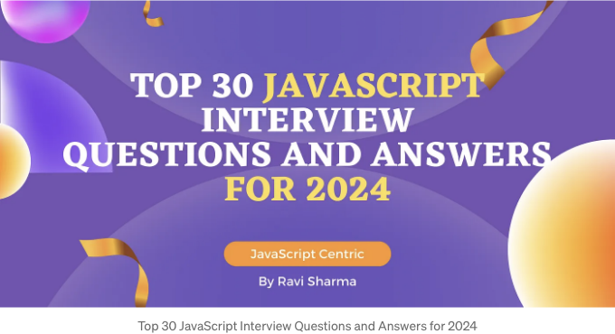
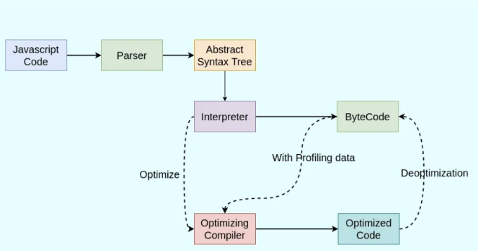
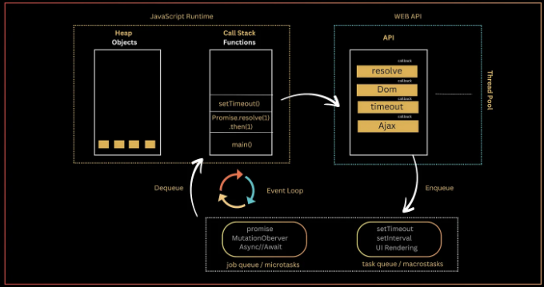
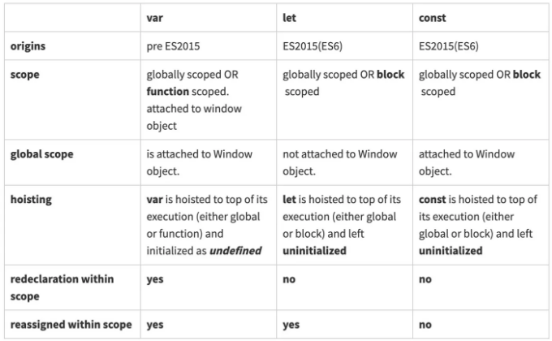
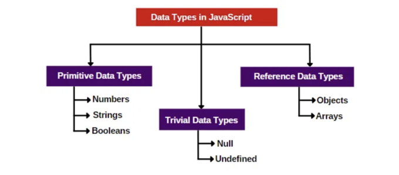
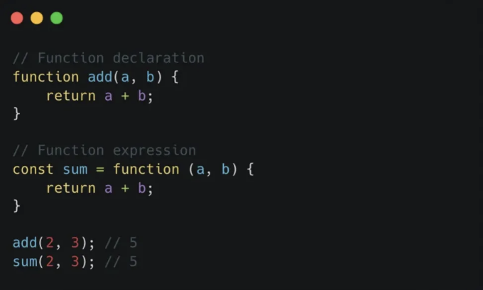
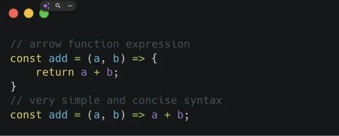

다음 JavaScript 인터뷰를 자신있게 준비하세요!

경험 많은 개발자이든 기술 분야에서 경력을 쌓기 시작한 개발자이든 2024년을 위한 이 필수 자료는 기본 언어 기능부터 고급 주제에 이르기까지 핵심 개념을 상기시키는 데 도움이 될 것입니다.

본 기사에서는 30가지 이상의 가장 중요한 JavaScript 인터뷰 질문과 함께 자세한 답변과 코드 예제를 모았습니다.

<!-- ui-log 수평형 -->
<ins class="adsbygoogle"
  style="display:block"
  data-ad-client="ca-pub-4877378276818686"
  data-ad-slot="9743150776"
  data-ad-format="auto"
  data-full-width-responsive="true"></ins>
<component is="script">
(adsbygoogle = window.adsbygoogle || []).push({});
</component>

이 유용한 컬렉션에 몰입하여 JavaScript 면접에서 성공을 거둬 오늘날 경쟁이 치열한 기술 산업에서 앞서 나가세요.

## 레벨-1: 기본

1. 자바스크립트는 싱글 스레드입니까?

2. 자바스크립트 엔진의 주요 구성 요소를 설명하고 작동 방식을 설명해주세요.

<!-- ui-log 수평형 -->
<ins class="adsbygoogle"
  style="display:block"
  data-ad-client="ca-pub-4877378276818686"
  data-ad-slot="9743150776"
  data-ad-format="auto"
  data-full-width-responsive="true"></ins>
<component is="script">
(adsbygoogle = window.adsbygoogle || []).push({});
</component>

3. 자바스크립트의 이벤트 루프(event loop)와 비동기 프로그래밍에서 어떻게 도움이 되는지 설명해주세요.

4. var, let, const의 차이는 무엇인가요?

5. 자바스크립트의 다양한 데이터 유형은 무엇이 있나요?

6. 콜백 함수(callback function)와 콜백 지옥(callback hell)은 무엇인가요?

<!-- ui-log 수평형 -->
<ins class="adsbygoogle"
  style="display:block"
  data-ad-client="ca-pub-4877378276818686"
  data-ad-slot="9743150776"
  data-ad-format="auto"
  data-full-width-responsive="true"></ins>
<component is="script">
(adsbygoogle = window.adsbygoogle || []).push({});
</component>

7. Promise와 Promise chaining은 무엇인가요?

8. async/await은 무엇인가요?

9. ==와 === 연산자의 차이는 무엇인가요?

10. JavaScript에서 Object를 만드는 다양한 방법은 무엇이 있나요?

<!-- ui-log 수평형 -->
<ins class="adsbygoogle"
  style="display:block"
  data-ad-client="ca-pub-4877378276818686"
  data-ad-slot="9743150776"
  data-ad-format="auto"
  data-full-width-responsive="true"></ins>
<component is="script">
(adsbygoogle = window.adsbygoogle || []).push({});
</component>

11. rest와 spread 연산자란 무엇인가요?

12. 고차 함수란 무엇인가요?

## 레벨-2 : 중급

13. 클로저란 무엇이며, 클로저의 사용 사례는 무엇인가요?

<!-- ui-log 수평형 -->
<ins class="adsbygoogle"
  style="display:block"
  data-ad-client="ca-pub-4877378276818686"
  data-ad-slot="9743150776"
  data-ad-format="auto"
  data-full-width-responsive="true"></ins>
<component is="script">
(adsbygoogle = window.adsbygoogle || []).push({});
</component>

14. 자바스크립트에서 호이스팅 개념을 설명해주세요.

15. 임시 사각 지대(Temporal dead zone)란 무엇인가요?

16. 프로토타입 체인과 Object.create() 메소드에 대해 설명해주세요.

17. Call, Apply 및 Bind 메소드의 차이점은 무엇인가요?

<!-- ui-log 수평형 -->
<ins class="adsbygoogle"
  style="display:block"
  data-ad-client="ca-pub-4877378276818686"
  data-ad-slot="9743150776"
  data-ad-format="auto"
  data-full-width-responsive="true"></ins>
<component is="script">
(adsbygoogle = window.adsbygoogle || []).push({});
</component>

18. 람다 또는 화살표 함수란 무엇인가요?

19. 커링 함수는 무엇인가요?

20. ES6의 주요 기능은 무엇인가요?

## 레벨-3: 전문가

<!-- ui-log 수평형 -->
<ins class="adsbygoogle"
  style="display:block"
  data-ad-client="ca-pub-4877378276818686"
  data-ad-slot="9743150776"
  data-ad-format="auto"
  data-full-width-responsive="true"></ins>
<component is="script">
(adsbygoogle = window.adsbygoogle || []).push({});
</component>

21. 실행 컨텍스트, 실행 스택, 변수 객체, 스코프 체인이 무엇인가요?

22. 콜백, 프라미스, setTimeout, process.nextTick()의 실행 우선 순위는 무엇인가요?

23. 팩토리 함수와 제너레이터 함수가 무엇인가요?

24. 객체를 복제하는 다양한 방법(객체의 얕은 복사와 깊은 복사)은 무엇이 있나요?

<!-- ui-log 수평형 -->
<ins class="adsbygoogle"
  style="display:block"
  data-ad-client="ca-pub-4877378276818686"
  data-ad-slot="9743150776"
  data-ad-format="auto"
  data-full-width-responsive="true"></ins>
<component is="script">
(adsbygoogle = window.adsbygoogle || []).push({});
</component>

25. 객체를 불변하게 만드는 방법은 무엇인가요? (seal 및 freeze 메서드)?

26. 이벤트와 이벤트 흐름, 이벤트 버블링 및 이벤트 캡처는 무엇인가요?

27. 이벤트 위임은 무엇인가요?

28. 서버 전송 이벤트(Server-Sent Events)란 무엇인가요?

<!-- ui-log 수평형 -->
<ins class="adsbygoogle"
  style="display:block"
  data-ad-client="ca-pub-4877378276818686"
  data-ad-slot="9743150776"
  data-ad-format="auto"
  data-full-width-responsive="true"></ins>
<component is="script">
(adsbygoogle = window.adsbygoogle || []).push({});
</component>

29. 자바스크립트에서 웹 워커 또는 서비스 워커란 무엇인가요?

30. 자바스크립트에서 두 개의 JSON 객체를 어떻게 비교할 수 있나요?

# =============================================

## 1. 자바스크립트는 단일 스레드입니까?

<!-- ui-log 수평형 -->
<ins class="adsbygoogle"
  style="display:block"
  data-ad-client="ca-pub-4877378276818686"
  data-ad-slot="9743150776"
  data-ad-format="auto"
  data-full-width-responsive="true"></ins>
<component is="script">
(adsbygoogle = window.adsbygoogle || []).push({});
</component>

네, JavaScript는 단일 스레드 언어입니다. 이는 하나의 호출 스택과 하나의 메모리 힙만을 가지고 있음을 의미합니다. 한 번에 한 세트의 명령만 실행됩니다.

또한 JavaScript는 동기적이고 블로킹인 특성을 가지고 있습니다. 즉, 코드가 한 줄씩 실행되며 한 작업이 완료되어야 다음 작업이 시작됩니다.

그러나 JavaScript는 비동기 기능도 가지고 있어서 특정 작업을 주 실행 스레드와 독립적으로 실행할 수 있습니다. 이는 보통 콜백, 프로미스, async/await, 이벤트 리스너와 같은 메커니즘을 통해 구현됩니다. 이러한 비동기 기능은 JavaScript가 데이터 가져오기, 사용자 입력 처리, I/O 작업을 차단하지 않고 주 스레드를 유지하면서 반응적이고 대화형 웹 애플리케이션을 구축하는 데 적합하도록 해줍니다.

## 2. JavaScript 엔진의 주요 구성요소를 설명하고 작동 방식을 설명해주세요.

<!-- ui-log 수평형 -->
<ins class="adsbygoogle"
  style="display:block"
  data-ad-client="ca-pub-4877378276818686"
  data-ad-slot="9743150776"
  data-ad-format="auto"
  data-full-width-responsive="true"></ins>
<component is="script">
(adsbygoogle = window.adsbygoogle || []).push({});
</component>

모든 브라우저에는 JavaScript 코드를 실행하고 기계 코드로 변환하는 JavaScript 엔진이 있습니다.



JavaScript 코드가 실행되면 구문 분석기는 먼저 코드를 읽고 AST(Abstract Syntax Tree)를 생성하여 메모리에 저장합니다. 그런 다음 인터프리터가 이 AST를 처리하고 바이트 코드 또는 기계 코드를 생성한 후 컴퓨터에서 실행됩니다.

프로파일러는 JavaScript 엔진의 구성 요소로 코드 실행을 모니터링합니다.

<!-- ui-log 수평형 -->
<ins class="adsbygoogle"
  style="display:block"
  data-ad-client="ca-pub-4877378276818686"
  data-ad-slot="9743150776"
  data-ad-format="auto"
  data-full-width-responsive="true"></ins>
<component is="script">
(adsbygoogle = window.adsbygoogle || []).push({});
</component>

바이트코드는 최적화 컴파일러와 프로파일링 데이터를 사용합니다. "최적화 컴파일러" 또는 Just-in-time (JIT) 컴파일러는 프로파일링 데이터를 기반으로 특정 가정을 하고 매우 최적화된 기계 코드를 생성합니다.

가끔 '최적화' 가정이 틀린 경우가 발생하여 "비최적화 (Deoptimize)" 단계를 거쳐 이전 버전으로 되돌아가는 경우가 있습니다 (우리에게 오버헤드가 되는 상황이 됩니다).

JS 엔진은 보통 "핫 함수"를 최적화하고 인라인 캐싱 기술을 사용해 코드를 최적화합니다.

이 과정에서 콜 스택은 현재 실행 중인 함수를 추적하고, 메모리 힙은 메모리 할당에 사용됩니다.

<!-- ui-log 수평형 -->
<ins class="adsbygoogle"
  style="display:block"
  data-ad-client="ca-pub-4877378276818686"
  data-ad-slot="9743150776"
  data-ad-format="auto"
  data-full-width-responsive="true"></ins>
<component is="script">
(adsbygoogle = window.adsbygoogle || []).push({});
</component>

마침내, 사용되지 않는 객체로부터 메모리를 회수하여 메모리를 관리하는 가비지 수집기가 작동합니다.

Google Chrome V8 엔진:

- 해석기는 "Ignition"이라고 불립니다.
- 최적화 컴파일러는 "TurboFan"이라고 불립니다.
- 파서 외에도 구문 및 토큰을 확인하는 "pre-parser"가 있습니다.
- "Ignition"과 "TurboFan" 사이에 위치한 "Sparkplug"가 있습니다. 이것은 빠른 컴파일러로도 불립니다.

## 3. 자바스크립트의 이벤트 루프를 설명해보세요.

<!-- ui-log 수평형 -->
<ins class="adsbygoogle"
  style="display:block"
  data-ad-client="ca-pub-4877378276818686"
  data-ad-slot="9743150776"
  data-ad-format="auto"
  data-full-width-responsive="true"></ins>
<component is="script">
(adsbygoogle = window.adsbygoogle || []).push({});
</component>



이벤트 루프는 JavaScript 런타임 환경의 핵심 구성 요소입니다. 비동기 작업을 예약하고 실행하는 역할을 담당합니다. 이벤트 루프는 호출 스택과 이벤트 큐 두 가지 큐를 지속적으로 모니터링해 작동합니다.

호출 스택은 현재 실행 중인 함수를 저장하는 스택(LIFO) 데이터 구조로서 코드 실행 중에 만들어진 실행 컨텍스트를 저장합니다.

Web API는 비동기 작업(setTimeout, fetch 요청, 프로미스 등)과 해당 콜백이 완료될 때까지 대기하는 곳입니다. 메인 스레드를 차단하지 않고 백그라운드에서 작업을 완료하기 위해 스레드 풀에서 스레드를 빌려옵니다.

<!-- ui-log 수평형 -->
<ins class="adsbygoogle"
  style="display:block"
  data-ad-client="ca-pub-4877378276818686"
  data-ad-slot="9743150776"
  data-ad-format="auto"
  data-full-width-responsive="true"></ins>
<component is="script">
(adsbygoogle = window.adsbygoogle || []).push({});
</component>

잡 큐(또는 마이크로태스크)는 async/await, 프로미스, process.nextTick()의 콜백을 보관하는 선입선출(FIFO) 구조입니다. 이들은 실행 준비가 된 상태입니다. 예를 들어, 이행된 프로미스의 resolve 또는 reject 콜백은 잡 큐에 인큐됩니다.

태스크 큐(또는 매크로태스크)는 async 작업의 콜백을 보관하는 선입선출(FIFO) 구조입니다. 예를 들어, 타임아웃된 setTimeout()의 콜백(실행 준비가 된 상태)은 태스크 큐에 인큐됩니다.

이벤트 루프는 계속해서 호출 스택이 비어 있는지 모니터링합니다. 호출 스택이 비어 있다면, 이벤트 루프는 잡 큐나 태스크 큐로 이동하고 실행 준비가 된 모든 콜백을 호출 스택으로 빼내 실행합니다.

## 4. var, let, const의 차이점은 무엇인가요?

<!-- ui-log 수평형 -->
<ins class="adsbygoogle"
  style="display:block"
  data-ad-client="ca-pub-4877378276818686"
  data-ad-slot="9743150776"
  data-ad-format="auto"
  data-full-width-responsive="true"></ins>
<component is="script">
(adsbygoogle = window.adsbygoogle || []).push({});
</component>



브라우저에서 윈도우 객체는 브라우저의 창이며 HTML 트리에서 가장 위에 있는 구조입니다. 전역으로 선언된 변수는 var 키워드를 사용해 윈도우 객체에 연결됩니다. 브라우저 콘솔에 var dog = ‘bowser’를 입력한 다음 window.dog를 입력해보세요. ‘bowser’라는 값이 나타납니다! 이로 인해 변수의 범위를 제어하는 것이 더 어려워집니다. 대조적으로, let과 const는 윈도우 객체에 연결되지 않습니다.

## 5. 자바스크립트에서 다른 데이터 유형은?

자바스크립트는 동적이고 느슨하게 형식이 지정된 또는 덕 타이핑 언어입니다. 이것은 변수의 유형을 명시적으로 지정할 필요가 없다는 것을 의미합니다. 자바스크립트 엔진은 변수의 데이터 유형을 동적으로 값에 기반하여 결정합니다.

<!-- ui-log 수평형 -->
<ins class="adsbygoogle"
  style="display:block"
  data-ad-client="ca-pub-4877378276818686"
  data-ad-slot="9743150776"
  data-ad-format="auto"
  data-full-width-responsive="true"></ins>
<component is="script">
(adsbygoogle = window.adsbygoogle || []).push({});
</component>



자바스크립트에서 기본 데이터 유형은 단일 값을 나타내는 가장 기본적인 데이터 유형입니다. 이러한 데이터 유형은 변경할 수 없으며 특정 값을 직접 보유합니다.

자바스크립트에서 심볼(Symbol)은 ECMAScript 6(ES6)에서 소개된 원시 데이터 유형으로 고유하고 변경할 수 없는 값을 나타냅니다. 객체 속성의 식별자로 자주 사용되어 이름 충돌을 피합니다.

```js
const mySymbol = Symbol('key');
const obj = {
    [mySymbol]: 'value'
};
```  

<!-- ui-log 수평형 -->
<ins class="adsbygoogle"
  style="display:block"
  data-ad-client="ca-pub-4877378276818686"
  data-ad-slot="9743150776"
  data-ad-format="auto"
  data-full-width-responsive="true"></ins>
<component is="script">
(adsbygoogle = window.adsbygoogle || []).push({});
</component>

심볼이 속성 키로 사용될 때, 이는 다른 속성 키와 충돌하지 않습니다. 이는 문자열 키를 포함한 다른 속성 키와 충돌하지 않는다는 것을 의미합니다.

## 6. 콜백 함수와 콜백 지옥이란?

JavaScript에서는 비동기 작업을 처리하기 위해 콜백이 일반적으로 사용됩니다.

콜백 함수는 다른 함수에 인수로 전달되어 특정 작업이 완료된 후 또는 주어진 시간에 실행될 것으로 의도된 함수입니다.

<!-- ui-log 수평형 -->
<ins class="adsbygoogle"
  style="display:block"
  data-ad-client="ca-pub-4877378276818686"
  data-ad-slot="9743150776"
  data-ad-format="auto"
  data-full-width-responsive="true"></ins>
<component is="script">
(adsbygoogle = window.adsbygoogle || []).push({});
</component>

```js
function fetchData(url, callback) {
  // 서버에서 데이터를 가져오는 것을 시뮬레이션합니다
  setTimeout(() => {
    const data = '서버에서 가져온 일부 데이터';
    callback(data);
  }, 1000);
}

function processData(data) {
  console.log('데이터 처리 중:', data);
}

fetchData('https://example.com/data', processData);
```

이 예제에서 fetchData 함수는 URL과 콜백 함수를 인수로 사용합니다. 서버에서 데이터를 가져온 후 (setTimeout을 사용하여 시뮬레이션), 콜백 함수를 호출하고 가져온 데이터를 전달합니다.

콜백 지옥, 또는 "둥근 지옥"은 JavaScript 프로그래밍에서 여러 개의 중첩된 콜백이 비동기 함수 내에서 사용되는 상황을 설명하는 용어입니다.

"이는 비동기 작업이 이전 비동기 작업의 결과에 의존할 때 발생하며, 깊게 중첩된 코드로 인해 종종 읽기 어려운 코드가 됩니다."

<!-- ui-log 수평형 -->
<ins class="adsbygoogle"
  style="display:block"
  data-ad-client="ca-pub-4877378276818686"
  data-ad-slot="9743150776"
  data-ad-format="auto"
  data-full-width-responsive="true"></ins>
<component is="script">
(adsbygoogle = window.adsbygoogle || []).push({});
</component>

콜백 지옥은 비동기 논리를 처리할 때 코드를 읽고 디버깅하기 어렵게 만드는 다중 중첩된 콜백을 가진 안티 패턴입니다.

```js
fs.readFile('file1.txt', 'utf8', function (err, data) {
  if (err) {
    console.error(err);
  } else {
    fs.readFile('file2.txt', 'utf8', function (err, data) {
      if (err) {
        console.error(err);
      } else {
        fs.readFile('file3.txt', 'utf8', function (err, data) {
          if (err) {
            console.error(err);
          } else {
            // 추가 중첩된 콜백 처리...
          }
        });
      }
    });
  }
});
```

이 예제에서는 fs.readFile 함수를 사용하여 세 개의 파일을 순차적으로 읽고 각 파일 읽기 작업이 비동기적으로 이루어집니다. 결과적으로 우리는 서로 중첩된 콜백을 생성하여 콜백의 피라미드 구조를 만들게 됩니다.

콜백 지옥을 피하기 위해, 현대적인 JavaScript에서는 Promises 및 async/await과 같은 대안을 제공합니다. 다음은 Promises를 사용한 동일한 코드입니다:

<!-- ui-log 수평형 -->
<ins class="adsbygoogle"
  style="display:block"
  data-ad-client="ca-pub-4877378276818686"
  data-ad-slot="9743150776"
  data-ad-format="auto"
  data-full-width-responsive="true"></ins>
<component is="script">
(adsbygoogle = window.adsbygoogle || []).push({});
</component>

```js
const readFile = (file) => {
  return new Promise((resolve, reject) => {
    fs.readFile(file, 'utf8', (err, data) => {
      if (err) {
        reject(err);
      } else {
        resolve(data);
      }
    });
  });
};
```

```js
readFile('file1.txt')
  .then((data1) => {
    return readFile('file2.txt');
  })
  .then((data2) => {
    return readFile('file3.txt');
  })
  .then((data3) => {
    // Promise chaining continues here...
  })
  .catch((err) => {
    console.error(err);
  });
```

## 7. Promise와 Promise 체이닝이란?

Promise: Promise는 JavaScript에서 사용되는 비동기 계산에 사용되는 객체입니다. 비동기 작업의 결과를 나타내며, 결과는 해결(resolve)되거나 거부(reject)될 수 있습니다.```

<!-- ui-log 수평형 -->
<ins class="adsbygoogle"
  style="display:block"
  data-ad-client="ca-pub-4877378276818686"
  data-ad-slot="9743150776"
  data-ad-format="auto"
  data-full-width-responsive="true"></ins>
<component is="script">
(adsbygoogle = window.adsbygoogle || []).push({});
</component>

약속은 세 가지 상태를 가집니다:

- 대기 중 (Pending): 초기 상태입니다. 이 상태는 약속의 최종 값이 아직 사용 가능하지 않은 상태입니다.
- 이행됨 (Fulfilled): 약속이 성공적으로 해결되었고 최종 값이 이제 사용 가능한 상태입니다.
- 거부됨 (Rejected): 약속이 오류를 만났거나 거부되어 최종 값이 제공되지 않는 상태입니다.

Promise 생성자는 두 개의 매개변수(resolve, reject)를 가지며 이들은 함수입니다. 비동기 작업이 오류 없이 완료되었다면, 해결 함수를 호출하고 메시지나 가져온 데이터로 약속을 해결합니다.

만약 오류가 발생했다면 거부 함수를 호출하고 그에 해당하는 오류를 전달해야 합니다.

<!-- ui-log 수평형 -->
<ins class="adsbygoogle"
  style="display:block"
  data-ad-client="ca-pub-4877378276818686"
  data-ad-slot="9743150776"
  data-ad-format="auto"
  data-full-width-responsive="true"></ins>
<component is="script">
(adsbygoogle = window.adsbygoogle || []).push({});
</component>

약속의 결과는 .then() 핸들러를 사용하여 액세스할 수 있어요.

오류는 .catch() 핸들러에서 잡을 수 있어요.

```js
// Promise 생성
const fetchData = new Promise((resolve, reject) => {
  // 서버에서 데이터 가져오기를 시뮬레이션
  setTimeout(() => {
    const data = '서버에서 가져온 일부 데이터';
    // Promise에 검색한 데이터로 Resolve
    resolve(data);
    // 오류와 함께 Promise 거부
    // reject(new Error('데이터를 가져오는 데 실패했습니다'));
  }, 1000);
});

// Promise 사용
fetchData
  .then((data) => {
    console.log('데이터 가져옴:', data);
  })
  .catch((error) => {
    console.error('데이터를 가져오는 중 오류 발생:', error);
  });
```

Promise 체이닝: Promise를 사용하여 비동기 작업을 순서대로 실행하는 프로세스를 의미해요.

<!-- ui-log 수평형 -->
<ins class="adsbygoogle"
  style="display:block"
  data-ad-client="ca-pub-4877378276818686"
  data-ad-slot="9743150776"
  data-ad-format="auto"
  data-full-width-responsive="true"></ins>
<component is="script">
(adsbygoogle = window.adsbygoogle || []).push({});
</component>

다음의 코드는 특정한 순서로 일련의 작업을 수행하기 위해 Promise에 여러 .then() 메소드를 연결하는 것을 포함합니다.

```js
new Promise(function (resolve, reject) {
  setTimeout(() => resolve(1), 1000);
})
  .then(function (result) {
    console.log(result); // 1
    return result * 2;
  })
  .then(function (result) {
    console.log(result); // 2
    return result * 3;
  })
  .then(function (result) {
    console.log(result); // 6
    return result * 4;
});
```

## 8. async/await이란?

async/await은 JavaScript에서 비동기 코드를 처리하는 현대적인 방법입니다. 이는 Promise와 비동기 작업을 보다 간결하고 가독성 있게 처리할 수 있도록 제공하여, "Callback Hell"을 피하고 비동기 코드의 구조를 개선하는 데 효과적입니다.

<!-- ui-log 수평형 -->
<ins class="adsbygoogle"
  style="display:block"
  data-ad-client="ca-pub-4877378276818686"
  data-ad-slot="9743150776"
  data-ad-format="auto"
  data-full-width-responsive="true"></ins>
<component is="script">
(adsbygoogle = window.adsbygoogle || []).push({});
</component>

자바스크립트에서 async 키워드는 비동기 함수를 정의하는 데 사용되며 Promise를 반환합니다.

async 함수 내에서 await 키워드는 함수의 실행을 일시 중지하고 Promise가 해결될 때까지 기다리는 데 사용됩니다. 이를 통해 비동기 작업을 처리하면서 동기적으로 보이는 코드를 작성할 수 있습니다.

```js
async function fetchData() {
  try {
    const data = await fetch('https://example.com/data');
    const jsonData = await data.json();
    return jsonData;
  } catch (error) {
    throw error;
  }
}

// async 함수 사용하기
fetchData()
  .then((jsonData) => {
    // 가져온 데이터 처리
  })
  .catch((error) => {
    // 에러 처리
  });
```

이 예시에서 fetchData 함수는 async 함수로 정의되었으며 await 키워드를 사용하여 실행을 일시 중지하고 fetch 및 json 작업을 대기하는데, 이를 통해 Promise를 다루는 방식이 동기 코드와 유사하게 작동합니다.

<!-- ui-log 수평형 -->
<ins class="adsbygoogle"
  style="display:block"
  data-ad-client="ca-pub-4877378276818686"
  data-ad-slot="9743150776"
  data-ad-format="auto"
  data-full-width-responsive="true"></ins>
<component is="script">
(adsbygoogle = window.adsbygoogle || []).push({});
</component>

## 9. ==과 === 연산자의 차이점은 무엇인가요?

== (느슨한 동등 연산자): 이 연산자는 형 변환을 수행하여 비교 전에 피연산자를 동일한 유형으로 변환합니다. 데이터 유형을 고려하지 않고 값이 동일한지 확인합니다. 예를 들어, 1 == `1`은 JavaScript가 비교 전에 문자열 `1`을 숫자로 변환하기 때문에 true를 반환합니다.

=== (엄격한 동등 연산자): 이 연산자는 형 변황을 수행하지 않는 엄격한 비교를 수행합니다. 값과 데이터 유형이 모두 동일한지 확인합니다. 예를 들어, 1 === `1`은 데이터 유형이 다르기 때문에 false를 반환합니다 (숫자와 문자열).

요약하면, ==는 형 변환 후 동등 여부를 확인하고, ===은 값과 데이터 유형을 모두 고려하여 엄격한 동등 여부를 확인합니다.

<!-- ui-log 수평형 -->
<ins class="adsbygoogle"
  style="display:block"
  data-ad-client="ca-pub-4877378276818686"
  data-ad-slot="9743150776"
  data-ad-format="auto"
  data-full-width-responsive="true"></ins>
<component is="script">
(adsbygoogle = window.adsbygoogle || []).push({});
</component>

== 연산자를 사용하면 === 문장보다 실행 속도가 빠릅니다.

위 경우를 다루는 예제 몇 가지:

```js
0 == false   // true
0 === false  // false
1 == "1"     // true
1 === "1"    // false
null == undefined // true
null === undefined // false
'0' == false // true
'0' === false // false
[]==[] 또는 []===[] // false, 메모리에서 서로 다른 객체를 참조합니다
{}=={} 또는 {}==={} // false, 메모리에서 서로 다른 객체를 참조합니다
```

## 10. 자바스크립트에서 객체를 만드는 다양한 방법?

<!-- ui-log 수평형 -->
<ins class="adsbygoogle"
  style="display:block"
  data-ad-client="ca-pub-4877378276818686"
  data-ad-slot="9743150776"
  data-ad-format="auto"
  data-full-width-responsive="true"></ins>
<component is="script">
(adsbygoogle = window.adsbygoogle || []).push({});
</component>

자바스크립트에서는 여러 가지 방법으로 객체를 만들 수 있어요. 객체를 만들기 위한 일반적인 방법 중 몇 가지는 다음과 같아요:

a) 객체 리터럴: 객체 리터럴을 사용하는 것이 객체를 만드는 가장 직접적인 방법이에요. 객체 리터럴은 중괄호로 둘러싸인 쉼표로 구분된 목록 안에 객체의 속성과 메서드를 정의해요.

```js
   let person = {
       firstName: 'John',
       lastName: 'Doe',
       greet: function() {
           return 'Hello, ' + this.firstName + ' ' + this.lastName;
       }
   };
```

b) 생성자 함수: 생성자 함수는 new 키워드를 사용하여 객체의 여러 인스턴스를 만드는 데 사용될 수 있어요. 생성자 함수 내부에서는 속성과 메서드를 this 키워드에 할당할 수 있어요.

<!-- ui-log 수평형 -->
<ins class="adsbygoogle"
  style="display:block"
  data-ad-client="ca-pub-4877378276818686"
  data-ad-slot="9743150776"
  data-ad-format="auto"
  data-full-width-responsive="true"></ins>
<component is="script">
(adsbygoogle = window.adsbygoogle || []).push({});
</component>

```js
   function Person(firstName, lastName) {
       this.firstName = firstName;
       this.lastName = lastName;
       this.greet = function() {
           return 'Hello, ' + this.firstName + ' ' + this.lastName;
       };
   }

   let person1 = new Person('John', 'Doe');
   let person2 = new Person('Jane', 'Smith');
```

c) Object.create(): Object.create() 메소드는 지정된 프로토타입 객체를 가진 새로운 객체를 만들 수 있게 해줍니다. 이 방법은 새로 생성된 객체의 프로토타입을 보다 세밀하게 제어할 수 있습니다.

```js
   let personProto = {
       greet: function() {
           return 'Hello, ' + this.firstName + ' ' + this.lastName;
       }
   };

   let person = Object.create(personProto);
   person.firstName = 'John';
   person.lastName = 'Doe';
```

d) 클래스 구문 (ES6): ES6의 도입으로 JavaScript는 클래스 키워드를 사용하여 객체를 정의하는 클래스 구문을 지원합니다. 이를 통해 객체를 만들고 속성 및 메소드를 정의하는 더 익숙하고 구조화된 방법을 제공합니다.

<!-- ui-log 수평형 -->
<ins class="adsbygoogle"
  style="display:block"
  data-ad-client="ca-pub-4877378276818686"
  data-ad-slot="9743150776"
  data-ad-format="auto"
  data-full-width-responsive="true"></ins>
<component is="script">
(adsbygoogle = window.adsbygoogle || []).push({});
</component>

```js
   class Person {
       constructor(firstName, lastName) {
           this.firstName = firstName;
           this.lastName = lastName;
       }
       greet() {
           return 'Hello, ' + this.firstName + ' ' + this.lastName;
       }
   }

   let person = new Person('John', 'Doe');
```

e)Factory Functions: Factory functions는 객체를 반환하는 함수입니다. 이 방식을 사용하면 객체 생성 프로세스를 캡슐화하고 사용자 지정 속성을 가진 여러 인스턴스를 쉽게 생성할 수 있습니다.

```js
   function createPerson(firstName, lastName) {
       return {
           firstName: firstName,
           lastName: lastName,
           greet: function() {
               return 'Hello, ' + this.firstName + ' ' + this.lastName;
           }
       };
   }

   let person1 = createPerson('John', 'Doe');
   let person2 = createPerson('Jane', 'Smith');
```

f)Object.setPrototypeOf(): Object.setPrototypeOf() 메서드는 지정된 객체의 프로토타입을 설정하는 데 사용할 수 있습니다. 이것은 객체가 생성된 후에 프로토타입을 설정하는 대체 접근 방식을 제공합니다.

<!-- ui-log 수평형 -->
<ins class="adsbygoogle"
  style="display:block"
  data-ad-client="ca-pub-4877378276818686"
  data-ad-slot="9743150776"
  data-ad-format="auto"
  data-full-width-responsive="true"></ins>
<component is="script">
(adsbygoogle = window.adsbygoogle || []).push({});
</component>

```js
   let personProto = {
       greet: function() {
           return '안녕하세요, ' + this.firstName + ' ' + this.lastName;
       }
   };

   let person = {};
   person.firstName = 'John';
   person.lastName = 'Doe';
   Object.setPrototypeOf(person, personProto);
```

g)Object.assign(): Object.assign() 메소드를 사용하면 하나 이상의 소스 객체에서 모든 열거 가능한 소유 속성의 값을 대상 객체로 복사하여 새 객체를 만들 수 있습니다. 객체를 병합하거나 얕은 복사를 만드는 데 특히 유용합니다.

```js
   let target = { a: 1, b: 2 };
   let source = { b: 3, c: 4 };
   let mergedObject = Object.assign({}, target, source);
```

h)Prototype Inheritance: JavaScript는 프로토타입 상속을 사용하여 객체가 다른 객체로부터 속성과 메소드를 상속할 수 있게 합니다. 프로토타입 상속을 활용하여 객체를 생성하고 생성자 함수나 클래스의 prototype 속성을 사용하여 공유 동작을 정의할 수 있습니다.

<!-- ui-log 수평형 -->
<ins class="adsbygoogle"
  style="display:block"
  data-ad-client="ca-pub-4877378276818686"
  data-ad-slot="9743150776"
  data-ad-format="auto"
  data-full-width-responsive="true"></ins>
<component is="script">
(adsbygoogle = window.adsbygoogle || []).push({});
</component>

```js
function Animal(name) {
    this.name = name;
}

Animal.prototype.greet = function() {
    return '안녕, 나는 ' + this.name + '야';
};

function Dog(name, breed) {
    Animal.call(this, name);
    this.breed = breed;
}

Dog.prototype = Object.create(Animal.prototype);
Dog.prototype.constructor = Dog;

let myDog = new Dog('맥스', '푸들');
```

i) 싱글톤 패턴: 싱글톤 패턴은 객체를 단일 인스턴스로 제한하는 데 사용됩니다. JavaScript에서는 클로저와 즉시 호출되는 함수 표현(IIFE)의 조합을 사용하여 구현할 수 있습니다. 이를 통해 객체의 인스턴스가 하나만 생성되도록 보장합니다.

```js
let singleton = (() => {
    let instance;

    function createInstance() {
        return {
            // 속성과 메서드
        };
    }

    return {
        getInstance: () => {
            if (!instance) {
                instance = createInstance();
            }
            return instance;
        }
    };
})();
```

## 11. rest와 spread 연산자란 무엇인가요?

<!-- ui-log 수평형 -->
<ins class="adsbygoogle"
  style="display:block"
  data-ad-client="ca-pub-4877378276818686"
  data-ad-slot="9743150776"
  data-ad-format="auto"
  data-full-width-responsive="true"></ins>
<component is="script">
(adsbygoogle = window.adsbygoogle || []).push({});
</component>

나머지 연산자는 세 개의 점(...)으로 표시되며, 함수 매개변수에서 가변 개수의 인수를 배열로 수집하는 데 사용됩니다. 이를 통해 특정한 매개변수로 명시적으로 정의하지 않고도 함수에 임의의 수의 인수를 전달할 수 있습니다.

```js
function sum(...numbers) {
    return numbers.reduce((total, num) => total + num, 0);
}
console.log(sum(1, 2, 3, 4)); // 결과는 10
```

스프레드 연산자는 세 개의 점(...)으로 표시되며, 배열이나 객체의 요소를 다른 배열이나 객체로 퍼뜨리는 데 사용됩니다. 이를 통해 배열을 쉽게 복제하거나 연결하거나 객체를 병합할 수 있습니다.

```js
const array1 = [1, 2, 3];
const array2 = [4, 5, 6];
const mergedArray = [...array1, ...array2];
// mergedArray는 [1, 2, 3, 4, 5, 6]입니다.
```

<!-- ui-log 수평형 -->
<ins class="adsbygoogle"
  style="display:block"
  data-ad-client="ca-pub-4877378276818686"
  data-ad-slot="9743150776"
  data-ad-format="auto"
  data-full-width-responsive="true"></ins>
<component is="script">
(adsbygoogle = window.adsbygoogle || []).push({});
</component>

```js
const obj1 = { a: 1, b: 2 };
const obj2 = { b: 3, c: 4 };
const mergedObject = { ...obj1, ...obj2 };
// mergedObject은 { a: 1, b: 3, c: 4 } 입니다.
```

## 12. 고차 함수란 무엇인가요?

자바스크립트에서 고차 함수란 하나 이상의 함수를 인수로써 받거나 함수를 반환하는 함수를 말합니다. 다시 말해, 고차 함수는 함수에 대해 동작을 수행하며, 함수를 인수로 받거나 반환하거나 둘 다를 할 수 있습니다.

```js
function operationOnArray(arr, operation) {
  let result = [];
  for (let element of arr) {
    result.push(operation(element));
  }
  return result;
}

function double(x) {
  return x * 2;
}

let numbers = [1, 2, 3, 4];
let doubledNumbers = operationOnArray(numbers, double);
console.log(doubledNumbers); // 출력: [2, 4, 6, 8]
```

<!-- ui-log 수평형 -->
<ins class="adsbygoogle"
  style="display:block"
  data-ad-client="ca-pub-4877378276818686"
  data-ad-slot="9743150776"
  data-ad-format="auto"
  data-full-width-responsive="true"></ins>
<component is="script">
(adsbygoogle = window.adsbygoogle || []).push({});
</component>

각각 함수 합성, 커링, 그리고 콜백 기반 비동기 작업과 같은 강력한 기법을 활용할 수 있습니다. 고차 함수를 이해하는 것은 표현력이 풍부하고 기능적인 스타일의 JavaScript 코드를 작성하는 데 필수적입니다.

단항 함수 (즉, 모나드적 함수)는 정확히 하나의 인수를 받는 함수를 의미합니다. 함수가 받는 단일 인수를 나타냅니다.

## 13. 클로저(Closure)란 무엇인가요? 클로저의 사용 사례는 무엇인가요?

클로저는 함수가 정의된 환경(또는 그 범위에서 변수에 대한 액세스를 유지)를 캡처하도록 하는 기능입니다. 이는 그 범위가 이미 닫혔더라도 계속 이용할 수 있게 합니다.

<!-- ui-log 수평형 -->
<ins class="adsbygoogle"
  style="display:block"
  data-ad-client="ca-pub-4877378276818686"
  data-ad-slot="9743150776"
  data-ad-format="auto"
  data-full-width-responsive="true"></ins>
<component is="script">
(adsbygoogle = window.adsbygoogle || []).push({});
</component>

클로저는 함수와 함수가 정의된 렉시컬 환경의 조합이라고 할 수 있어요.

다시 말해, 클로저는 함수에게 자신의 스코프, 외부 함수의 스코프 및 전역 스코프에 액세스할 수 있도록 해줍니다. 이를 통해 클로저는 이러한 스코프에서 변수 및 매개변수에 계속 액세스할 수 있도록 하고 "기억"할 수 있게 됩니다.

```js
function outerFunction() {
  let outerVariable = '외부 함수에서 온 변수입니다';
  
  return function innerFunction() {
    console.log(outerVariable); // 외부 함수 스코프에서 outerVariable에 액세스
  }
  
}

let myFunction = outerFunction();
myFunction(); // 출력: 외부 함수에서 온 변수입니다
```

클로저는 함수가 생성될 때 함수를 생성하는 시점 및 다른 함수 내부에 함수를 정의할 때마다 생성됩니다.

<!-- ui-log 수평형 -->
<ins class="adsbygoogle"
  style="display:block"
  data-ad-client="ca-pub-4877378276818686"
  data-ad-slot="9743150776"
  data-ad-format="auto"
  data-full-width-responsive="true"></ins>
<component is="script">
(adsbygoogle = window.adsbygoogle || []).push({});
</component>

실행 컨텍스트는 JavaScript 코드가 실행되는 환경입니다. 각 함수 호출마다 별도의 실행 컨텍스트가 생성되어 실행 스택에 밀어 넣습니다. 함수 실행이 완료되면 실행 스택에서 빠져나옵니다.

각 실행 컨텍스트는 변수와 함수가 저장되는 메모리 공간을 보유하고 있으며, 함수가 실행 스택에서 빠져나오면 JavaScript 가비지 수집기가 이러한 것들을 모두 정리합니다.

JavaScript에서는 어떤 것이 가비지 수집되는지는 해당 것에 대한 참조가 없어질 때에만 해당됩니다.

위 예시에서 익명 실행 컨텍스트는 여전히 외부 환경의 변수에 대한 메모리 공간에 대한 참조를 가지고 있습니다. outerFunction()이 종료되더라도 그렇습니다. (outerVariable 변수에 액세스하고 console.log(outerVariable) 내에서 사용할 수 있습니다.)

<!-- ui-log 수평형 -->
<ins class="adsbygoogle"
  style="display:block"
  data-ad-client="ca-pub-4877378276818686"
  data-ad-slot="9743150776"
  data-ad-format="auto"
  data-full-width-responsive="true"></ins>
<component is="script">
(adsbygoogle = window.adsbygoogle || []).push({});
</component>

자바스크립트에서 클로저는 여러 중요한 용도가 있어요:

- 데이터 프라이버시와 캡슐화: 클로저는 프라이빗 데이터를 생성하고 한정된 범위 내에서 기능을 캡슐화하는 데 사용될 수 있어요. 다른 함수 내에서 함수를 정의함으로써, 내부 함수는 외부 함수의 변수에 접근할 수 있지만, 이러한 변수들은 외부 함수 외부에서 접근할 수 없어요. 이를 통해 외부에서 직접 접근할 수 없는 프라이빗 데이터와 메소드를 생성할 수 있어서 데이터 프라이버시와 캡슐화를 향상시킬 수 있어요.
- 상태 유지: 클로저는 비동기 작업과 이벤트 처리에서 상태를 유지하는 데 자주 사용돼요. 예를 들어, 비동기 작업을 처리할 때 클로저는 여러 비동기 작업에서 변수 상태를 캡처하고 유지함으로써, 비동기 작업이 완료될 때 올바른 변수에 액세스할 수 있도록 보장해줘요.
- 커링과 부분 적용: 클로저는 커링과 부분 적용과 같은 함수형 프로그래밍 기술을 용이하게 해줘요. 특정 매개변수를 캡처하고 기억하여 이를 사용하는 새로운 함수를 반환함으로써, 커링과 부분 적용을 실현할 수 있어요. 이를 통해 사전 설정된 인수를 갖는 특수화된 함수를 생성함으로써 유연성과 재사용성을 제공할 수 있어요.
- 모듈 패턴: 클로저는 자바스크립트에서 모듈 패턴을 구현하는 데 필수적이에요. 클로저를 사용하여 프라이빗 변수를 생성하고 필요한 공용 메서드만 노출시킴으로써, 개발자는 모듈화되고 조직적인 코드를 만들어내어 내부 모듈 데이터의 불필요한 액세스와 수정을 방지할 수 있어요.
- 콜백 함수: 콜백 함수 작업시 클로저가 자주 사용돼요. 클로저를 사용하여 비동기 작업의 컨텍스트 내에서 변수의 상태를 캡처하고 유지해줌으로써, 콜백 함수가 호출될 때 올바른 변수에 액세스할 수 있도록 보장해줘요.

## 14. 자바스크립트에서 호이스팅 개념을 설명해주세요.

자바스크립트에서 호이스팅은 변수 및 함수 선언이 코드 실행 전 컴파일 단계에서 해당 범위의 맨 위로 이동되는 기본 동작입니다. 이는 변수를 사용하거나 함수를 호출할 때 실제 코드에서 선언되기 전에 사용할 수 있다는 것을 의미해요.

<!-- ui-log 수평형 -->
<ins class="adsbygoogle"
  style="display:block"
  data-ad-client="ca-pub-4877378276818686"
  data-ad-slot="9743150776"
  data-ad-format="auto"
  data-full-width-responsive="true"></ins>
<component is="script">
(adsbygoogle = window.adsbygoogle || []).push({});
</component>

변수를 var을 사용하여 선언할 때, 선언문은 해당 함수 또는 블록의 맨 위로 끌어올려지고 “undefined”라는 기본값으로 초기화됩니다.

```js
console.log(x); // 결과: undefined
var x = 5;
```

let과 const로 선언된 변수도 끌어올려지지만, 선언되기 전에는 접근할 수 없는 “임시 사각지대(temporal dead zone)”가 있습니다.

```js
console.log(x); // 에러 발생 (ReferenceError)
let x = 5;
```

<!-- ui-log 수평형 -->
<ins class="adsbygoogle"
  style="display:block"
  data-ad-client="ca-pub-4877378276818686"
  data-ad-slot="9743150776"
  data-ad-format="auto"
  data-full-width-responsive="true"></ins>
<component is="script">
(adsbygoogle = window.adsbygoogle || []).push({});
</component>

함수 선언들도 그들이 포함된 스코프의 맨 위로 끌어올려집니다. 코드에서 함수를 선언하기 전에 호출할 수 있어요.

```js
sayHello(); // 출력: "Hello, world!"
function sayHello() {
    console.log("Hello, world!");
}
```

화살표 함수, 함수 표현식 또는 변수 초기화에서 호이스팅이 일어나지 않습니다.

## 15. Temporal dead zone이란 무엇인가요?

<!-- ui-log 수평형 -->
<ins class="adsbygoogle"
  style="display:block"
  data-ad-client="ca-pub-4877378276818686"
  data-ad-slot="9743150776"
  data-ad-format="auto"
  data-full-width-responsive="true"></ins>
<component is="script">
(adsbygoogle = window.adsbygoogle || []).push({});
</component>

JavaScript의 Temporal Dead Zone (TDZ)은 let과 const를 사용하여 변수를 선언하는 것과 관련된 개념입니다.

let 또는 const로 변수를 선언하면 해당 변수는 해당 범위의 맨 위로 끌어올려집니다. 그러나 var와 달리, let과 const로 선언된 변수는 TDZ에서 초기화되지 않은 채로 남아 있습니다.

범위 내에서 실제 선언되기 전 변수에 액세스하거나 사용하려고 하면 ReferenceError가 발생합니다. 이는 변수가 제대로 정의되기 전에 변수를 사용하는 것을 방지하기 위한 것입니다.

Temporal Dead Zone을 이해하는 것은 변수가 초기화되기 전에 변수 사용과 관련된 버그를 방지하는 데 중요합니다. 또한 사용 전에 적절한 변수 선언을 장려하여 JavaScript 코딩에서 최상의 실천 방법을 촉구합니다.

<!-- ui-log 수평형 -->
<ins class="adsbygoogle"
  style="display:block"
  data-ad-client="ca-pub-4877378276818686"
  data-ad-slot="9743150776"
  data-ad-format="auto"
  data-full-width-responsive="true"></ins>
<component is="script">
(adsbygoogle = window.adsbygoogle || []).push({});
</component>

## 16. 프로토타입 체인이란 무엇인가요? 그리고 Object.create() 메소드는 무엇인가요?

자바스크립트에서 모든 함수와 객체는 기본적으로 prototype이라는 속성을 가지고 있습니다.

자바스크립트의 모든 객체는 프로토타입을 가지고 있습니다. 프로토타입은 현재 객체가 속성과 메소드를 상속받는 다른 객체입니다. 프로토타입을 템플릿이나 부모 객체로 생각할 수 있습니다.

프로토타입 체인은 다른 객체로부터 속성과 메소드를 상속받을 수 있게 해주는 메커니즘입니다.

<!-- ui-log 수평형 -->
<ins class="adsbygoogle"
  style="display:block"
  data-ad-client="ca-pub-4877378276818686"
  data-ad-slot="9743150776"
  data-ad-format="auto"
  data-full-width-responsive="true"></ins>
<component is="script">
(adsbygoogle = window.adsbygoogle || []).push({});
</component>

객체의 속성 또는 메서드에 액세스할 때 JavaScript는 먼저 해당 객체에서 해당 항목을 찾습니다. 항목을 찾지 못하면 프로토 타입 체인을 따라 해당 속성 또는 메서드를 찾습니다. 이 프로세스는 체인의 맨 위인 Object.prototype에 도달할 때까지 계속됩니다.

## 17. Call, Apply 및 Bind 메서드의 차이점은 무엇인가요?

Call: call() 메서드는 지정된 this 값 및 쉼표로 구분된 개별 인수로 전달된 값을 사용하여 함수를 호출합니다.

```js
   const person1 = { name: 'John' };
   const person2 = { name: 'Jane' };

   function greet(greeting) {
       console.log(greeting + ' ' + this.name);
   }

   greet.call(person1, 'Hello'); // 출력: Hello John
   greet.call(person2, 'Hi'); // 출력: Hi Jane
```

<!-- ui-log 수평형 -->
<ins class="adsbygoogle"
  style="display:block"
  data-ad-client="ca-pub-4877378276818686"
  data-ad-slot="9743150776"
  data-ad-format="auto"
  data-full-width-responsive="true"></ins>
<component is="script">
(adsbygoogle = window.adsbygoogle || []).push({});
</component>

call() 메서드는 객체가 다른 객체에 속한 메서드를 사용할 수 있게 합니다.

```js
const o1 = {
  name: 'ravi',
  getName: function(){
    console.log(`Hello, ${this.name}`)
  }
}

const o2 = {
  name: 'JavaScript Centric'
}

o1.getName.call(o2) // Hello, JavaScript Centric
```

Apply: 지정된 this 값으로 함수를 호출하지만 인수를 배열로 전달합니다. 넘겨야 할 인수의 개수를 미리 알 수 없거나 이미 배열로 인수가 있는 경우 유용합니다.

```js
const numbers = [1, 2, 3, 4, 5];

const max = Math.max.apply(null, numbers);
console.log(max); // 출력: 5
```

<!-- ui-log 수평형 -->
<ins class="adsbygoogle"
  style="display:block"
  data-ad-client="ca-pub-4877378276818686"
  data-ad-slot="9743150776"
  data-ad-format="auto"
  data-full-width-responsive="true"></ins>
<component is="script">
(adsbygoogle = window.adsbygoogle || []).push({});
</component>

테이블 태그를 마크다운 형식으로 변경해주세요.

<!-- ui-log 수평형 -->
<ins class="adsbygoogle"
  style="display:block"
  data-ad-client="ca-pub-4877378276818686"
  data-ad-slot="9743150776"
  data-ad-format="auto"
  data-full-width-responsive="true"></ins>
<component is="script">
(adsbygoogle = window.adsbygoogle || []).push({});
</component>

- 일반 함수
- 화살표 함수 (ES6에서 도입됨)

일반 함수: 일반 함수는 두 가지 방법으로 작성할 수 있습니다. 즉, 함수 선언과 함수 표현식입니다.



화살표 또는 두꺼운 화살표 함수: 람다 함수로도 알려진 화살표 함수는 JavaScript (ES6)에서 도입된 기능으로, 함수 표현식을 작성하는 더 간결한 구문입니다. 전통적인 함수 표현식보다 더 짧은 구문을 가지며, 익명 함수를 생성하고 함수형 프로그래밍 개념을 처리하는 데 특히 유용합니다.

<!-- ui-log 수평형 -->
<ins class="adsbygoogle"
  style="display:block"
  data-ad-client="ca-pub-4877378276818686"
  data-ad-slot="9743150776"
  data-ad-format="auto"
  data-full-width-responsive="true"></ins>
<component is="script">
(adsbygoogle = window.adsbygoogle || []).push({});
</component>

여기에는 선언 접근 방식이 없습니다. 함수 표현식만을 사용하여 작성할 수 있습니다.



화살표 함수와 일반 함수 사이에는 다음과 같은 차이점이 있습니다.

- 구문(Syntax)
- 매개변수 없음 (매개변수는 배열 유사 객체)
- 화살표 함수에 대한 프로토타입 객체가 없음
- new 키워드로 호출할 수 없음 (생성자 함수가 아님)
- 고유의 this가 없음 (call, apply 및 bind는 예상대로 작동하지 않음)
- 제너레이터 함수로 사용할 수 없음
- 중복된 매개변수 이름을 허용하지 않음

<!-- ui-log 수평형 -->
<ins class="adsbygoogle"
  style="display:block"
  data-ad-client="ca-pub-4877378276818686"
  data-ad-slot="9743150776"
  data-ad-format="auto"
  data-full-width-responsive="true"></ins>
<component is="script">
(adsbygoogle = window.adsbygoogle || []).push({});
</component>

## 19. 커링 함수란 무엇인가요?

커링은 함수형 프로그래밍에서 사용되는 기법으로, 여러 개의 인수를 받는 함수를 각각 하나의 인수를 받는 일련의 함수로 변환합니다. 이러한 커리된 함수들은 함께 조합하여 더 복잡한 함수를 구성할 수 있습니다.

자바스크립트에서는 클로저와 함수를 반환함으로써 커링을 구현할 수 있습니다.

```js
// 두 개의 인수를 받는 일반 함수
function add(x, y) {
    return x + y;
}
```

<!-- ui-log 수평형 -->
<ins class="adsbygoogle"
  style="display:block"
  data-ad-client="ca-pub-4877378276818686"
  data-ad-slot="9743150776"
  data-ad-format="auto"
  data-full-width-responsive="true"></ins>
<component is="script">
(adsbygoogle = window.adsbygoogle || []).push({});
</component>

```js
// 함수의 커링화된 버전
function curryAdd(x) {
    return function(y) {
        return x + y;
    };
}
const add5 = curryAdd(5); // 부분 적용, 새로운 함수 생성
console.log(add5(3)); // 결과: 8
```

커링은 함수형 프로그래밍에서 유익하며, 코드를 더 모듈식이고 재사용 가능하게 만들 수 있습니다. 특히 인수의 개수가 다양하게 변하는 함수를 만들거나 데이터 변환 파이프라인을 구축하는 경우에 유용합니다.

## 20. ES6의 주요 기능은 무엇인가요?

ES6, 또는 ECMAScript 2015로도 알려진 ES6는 JavaScript의 능력을 크게 확장하는 여러 가지 새로운 기능과 개선사항을 도입했습니다. ES6의 주요 기능 중 일부는 다음과 같습니다:```

<!-- ui-log 수평형 -->
<ins class="adsbygoogle"
  style="display:block"
  data-ad-client="ca-pub-4877378276818686"
  data-ad-slot="9743150776"
  data-ad-format="auto"
  data-full-width-responsive="true"></ins>
<component is="script">
(adsbygoogle = window.adsbygoogle || []).push({});
</component>

- 화살표 함수
- 블록 스코프 변수
- 클래스
- 모듈
- 템플릿 리터럴: 템플릿 리터럴은 백틱을 사용하여 표현식과 여러 줄의 문자열을 포함할 수 있어 JavaScript에서 복잡한 문자열을 만드는 더 편리한 방법을 제공합니다.
- 기본 매개변수
- 나머지 및 전개 연산자
- 구조 분해 할당
- 프로미스
- Map, Set, WeakMap, WeakSet: ES6에서는 Map 및 Set과 같은 새로운 내장 데이터 구조를 소개하여 컬렉션 및 키-값 쌍을 더 효율적이고 전문화된 방식으로 다룰 수 있게 했습니다.
- 이터레이터 및 제너레이터
- 개선된 객체 리터럴

## 21. 실행 컨텍스트, 실행 스택, 변수 객체 및 스코프 체인이 무엇인가요?

실행 컨텍스트: 실행 컨텍스트는 코드 조각이 실행되는 환경을 가리킵니다. 스코프, 변수 객체 및 "this" 키워드의 값으로 구성됩니다.

함수가 실행될 때마다 실행 컨텍스트가 생성되며 해당 함수의 모든 변수나 속성을 포함합니다.

<!-- ui-log 수평형 -->
<ins class="adsbygoogle"
  style="display:block"
  data-ad-client="ca-pub-4877378276818686"
  data-ad-slot="9743150776"
  data-ad-format="auto"
  data-full-width-responsive="true"></ins>
<component is="script">
(adsbygoogle = window.adsbygoogle || []).push({});
</component>

JavaScript에는 세 가지 유형의 실행 컨텍스트가 있어요:

- Global Execution Context
- Functional Execution Context
- Eval Function Execution Context

<!-- ui-log 수평형 -->
<ins class="adsbygoogle"
  style="display:block"
  data-ad-client="ca-pub-4877378276818686"
  data-ad-slot="9743150776"
  data-ad-format="auto"
  data-full-width-responsive="true"></ins>
<component is="script">
(adsbygoogle = window.adsbygoogle || []).push({});
</component>

실행 스택: 실행 스택은 “호출 스택”으로도 알려져 있으며, 현재 진행 중인 함수 호출의 모든 실행 컨텍스트를 저장하는 후입선출(LIFO) 데이터 구조입니다. 함수가 호출될 때마다 새로운 실행 컨텍스트가 생성되어 스택에 푸시됩니다. 함수가 완료되면 해당 컨텍스트가 스택에서 팝됩니다.

엔진은 스택의 맨 위에 있는 실행 컨텍스트를 가진 함수를 실행합니다. 이 함수가 완료되면 해당 실행 스택은 스택에서 팝되고, 제어는 현재 스택에서 그 아래에 있는 컨텍스트로 이동합니다.

실행 컨텍스트는 생성 단계에서 생성됩니다. 생성 단계에서 다음과 같은 일이 발생합니다:

- 렉시컬 환경 컴포넌트가 생성됩니다.
- 변수 환경 컴포넌트가 생성됩니다.

<!-- ui-log 수평형 -->
<ins class="adsbygoogle"
  style="display:block"
  data-ad-client="ca-pub-4877378276818686"
  data-ad-slot="9743150776"
  data-ad-format="auto"
  data-full-width-responsive="true"></ins>
<component is="script">
(adsbygoogle = window.adsbygoogle || []).push({});
</component>

변수 객체: 실행 컨텍스트의 일부로, 해당 컨텍스트에서 정의된 모든 변수, 함수 선언 및 인수를 포함하는 객체입니다.

스코프 체인: 스코프 체인은 JavaScript에서 변수의 값을 해결하기 위한 메커니즘입니다. 변수가 참조될 때, JavaScript 엔진은 먼저 현재 실행 컨텍스트의 변수 객체에서 변수를 찾습니다. 그곳에서 찾지 못하면 범위 체인을 따라 다음 외부 실행 컨텍스트로 진행하여 변수를 찾거나 전역 실행 컨텍스트에 도달할 때까지 계속합니다.

## 22. 콜백, promise, setTimeout, process.nextTick()의 실행 우선순위는 무엇인가요?

실행 우선순위는 이벤트 루프와 서로 다른 비동기 작업이 처리되는 순서에 기반하여 이해할 수 있습니다:

<!-- ui-log 수평형 -->
<ins class="adsbygoogle"
  style="display:block"
  data-ad-client="ca-pub-4877378276818686"
  data-ad-slot="9743150776"
  data-ad-format="auto"
  data-full-width-responsive="true"></ins>
<component is="script">
(adsbygoogle = window.adsbygoogle || []).push({});
</component>

- process.nextTick(): process.nextTick()으로 예약된 콜백은 가장 높은 우선순위를 갖습니다. process.nextTick()을 사용하면 현재 작업이 완료된 후에 즉시 콜백이 실행되지만 이벤트 루프가 다음 단계로 이동하기 전에 실행됩니다. 이를 통해 함수가 이벤트 루프에서 가능한 빨리 실행되도록 할 수 있습니다.
- Promise: Promise는 일반적으로 process.nextTick() 이후에 실행됩니다. 그러나 setTimeout()을 사용하여 예약된 콜백보다 우선시됩니다.
- setTimeout(): setTimeout()을 사용하여 예약된 콜백은 이벤트 루프의 타이머 단계에 배치됩니다. 현재 작업, 프로미스 및 이전에 예약된 setTimeout() 콜백이 완료된 후에 실행됩니다.
- 콜백: process.nextTick()을 사용하지 않고 예약된 일반적인 콜백은 가장 낮은 우선순위를 갖습니다. 이 콜백은 이벤트 루프가 process.nextTick(), Promise 및 setTimeout() 콜백을 처리한 후에 실행됩니다.

## 23. 팩토리 함수와 제너레이터 함수란?

JavaScript에서 팩토리 함수는 객체를 반환하는 함수입니다. 이는 객체를 간편하고 체계적으로 생성하는 데 사용되는 패턴입니다. 새 객체를 생성하기 위해 생성자 함수와 new 키워드를 사용하는 대신, 팩토리 함수는 객체 생성 과정을 캡슐화하고 새 객체를 반환합니다.

```js
function createPerson(name, age) {
  return {
    name: name,
    age: age,
    greet: function() {
      return `Hello, my name is ${this.name} and I am ${this.age} years old.`;
    }
  };
}

const person1 = createPerson('Alice', 25);
const person2 = createPerson('Bob', 30);

console.log(person1.greet()); // 출력: Hello, my name is Alice and I am 25 years old.
console.log(person2.greet()); // 출력: Hello, my name is Bob and I am 30 years old.
```

<!-- ui-log 수평형 -->
<ins class="adsbygoogle"
  style="display:block"
  data-ad-client="ca-pub-4877378276818686"
  data-ad-slot="9743150776"
  data-ad-format="auto"
  data-full-width-responsive="true"></ins>
<component is="script">
(adsbygoogle = window.adsbygoogle || []).push({});
</component>

JavaScript의 Generator 함수는 실행 중에 일시 중단하고 다시 시작할 수 있는 특별한 유형의 함수입니다.

Generator 함수는 단일 값 대신 결과 시퀀스를 생성합니다.

Generator 함수가 호출되면 next() 메서드를 호출하여 함수의 실행을 제어할 수 있는 제너레이터 객체가 반환됩니다.

함수의 코드는 yield 키워드를 사용하여 본문 내에서 일시 중단될 수 있으며, 일시 중단된 곳에서 정확히 다시 시작할 수 있습니다.

<!-- ui-log 수평형 -->
<ins class="adsbygoogle"
  style="display:block"
  data-ad-client="ca-pub-4877378276818686"
  data-ad-slot="9743150776"
  data-ad-format="auto"
  data-full-width-responsive="true"></ins>
<component is="script">
(adsbygoogle = window.adsbygoogle || []).push({});
</component>

```js
function* numberGenerator() {
  let i = 0;
  while (true) {
    yield i++;
  }
}

const gen = numberGenerator();
console.log(gen.next().value); // 출력: 0
console.log(gen.next().value); // 출력: 1
console.log(gen.next().value); // 출력: 2
```

이것은 반복자를 만들고 비동기 코드를 처리하는 강력한 메커니즘을 제공합니다.

## 24. 객체를 복제하는 다양한 방법 (객체의 얕은 복사와 깊은 복사)?

얕은 복사는 참조가 원본 객체와 같은 객체의 복사본입니다. 이는 얕은 복사본에서 속성의 값을 변경하면 원본 객체의 속성 값도 변경됩니다.

<!-- ui-log 수평형 -->
<ins class="adsbygoogle"
  style="display:block"
  data-ad-client="ca-pub-4877378276818686"
  data-ad-slot="9743150776"
  data-ad-format="auto"
  data-full-width-responsive="true"></ins>
<component is="script">
(adsbygoogle = window.adsbygoogle || []).push({});
</component>

```js
const user = {
    name: "Kingsley",
    age: 28,
    job: "Web Developer"
}
const clone = user
```

깊은 복사란 참조가 원본 객체와 다른 객체의 복사본을 의미합니다. 이는 깊은 복사본에서 속성의 값을 변경해도 원본 객체의 속성 값이 변경되지 않는다는 것을 의미합니다.

객체의 깊은 복사를 만드는 다양한 방법이 있습니다.

a) JSON.parse 및 JSON.stringify: 중첩 객체에도 유용합니다.```

<!-- ui-log 수평형 -->
<ins class="adsbygoogle"
  style="display:block"
  data-ad-client="ca-pub-4877378276818686"
  data-ad-slot="9743150776"
  data-ad-format="auto"
  data-full-width-responsive="true"></ins>
<component is="script">
(adsbygoogle = window.adsbygoogle || []).push({});
</component>

```js
const originalObject = { name: "Alice", age: 25 };
const deepCopy = JSON.parse(JSON.stringify(originalObject));
```

b) structuredClone:

```js
const myDeepCopy = structuredClone(myOriginal);
```

c) Spread Operator(…): 중첩된 객체가 있는 경우 어떤 객체도 깊은 복사되지 않습니다.

<!-- ui-log 수평형 -->
<ins class="adsbygoogle"
  style="display:block"
  data-ad-client="ca-pub-4877378276818686"
  data-ad-slot="9743150776"
  data-ad-format="auto"
  data-full-width-responsive="true"></ins>
<component is="script">
(adsbygoogle = window.adsbygoogle || []).push({});
</component>

```js
const originalObject = { name: "Alice", age: 25 };
const deepCopy =  {...originalObject};

deepCopy.name = "ravi"
console.log("originalObject", originalObject.name) // Alice
```

d)Object.assign(): 원시 객체를 깊은 복사할 때는 Object.assign() 메서드를 사용해야 합니다.

```js
const originalObject = { name: "Alice", age: 25 };
const shallowCopy = Object.assign({}, originalObject);
```

e)재귀(recursion):

<!-- ui-log 수평형 -->
<ins class="adsbygoogle"
  style="display:block"
  data-ad-client="ca-pub-4877378276818686"
  data-ad-slot="9743150776"
  data-ad-format="auto"
  data-full-width-responsive="true"></ins>
<component is="script">
(adsbygoogle = window.adsbygoogle || []).push({});
</component>

```js
function deepCopy(obj) {
    if (typeof obj !== 'object' || obj === null) {
        return obj;
    }
    const newObj = Array.isArray(obj) ? [] : {};
    for (let key in obj) {
        if (Object.hasOwnProperty.call(obj, key)) {
            newObj[key] = deepCopy(obj[key]);
        }
    }
    return newObj;
}
const originalObject = { name: "Alice", nested: { age: 25 } };
const deepCopy = deepCopy(originalObject);
```

## 25. 객체를 불변 객체로 만드는 방법은 무엇인가요? (seal 및 freeze 메서드)

JavaScript에서는 Object.seal() 및 Object.freeze() 메서드를 사용하여 객체를 불변 객체로 만들 수 있습니다.

Object.freeze(): (완전히 불변) 이 메서드는 객체를 동결하여 봉인하고 그 속성을 읽기 전용으로 설정합니다. 객체를 동결한 후에는 해당 속성을 수정, 추가 또는 삭제할 수 없습니다.
```

<!-- ui-log 수평형 -->
<ins class="adsbygoogle"
  style="display:block"
  data-ad-client="ca-pub-4877378276818686"
  data-ad-slot="9743150776"
  data-ad-format="auto"
  data-full-width-responsive="true"></ins>
<component is="script">
(adsbygoogle = window.adsbygoogle || []).push({});
</component>

```js
 const obj = { name: 'Alice', age: 25 };
 Object.freeze(obj);
 obj.name = 'Bob'; // 허용되지 않음
 obj.address = '123 Street'; // 허용되지 않음
 delete obj.age; // 허용되지 않음
```

Object.seal(): (부분적 불변) 이 메서드는 개체를 봉인하여 새 속성이 추가되는 것을 방지하고 모든 기존 속성을 구성할 수 없게 표시합니다. 그러나 쓰기 가능한 기존 속성의 값을 수정할 수는 있습니다.

```js
 const obj = { name: 'Alice', age: 25 };
 Object.seal(obj);
 obj.name = 'Bob'; // 허용됨
 obj.address = '123 Street'; // 허용되지 않음 (새 속성은 추가할 수 없음)
 delete obj.age; // 허용되지 않음 (기존 속성을 삭제할 수 없음)
```

## 26. 이벤트와 이벤트 흐름, 이벤트 버블링과 이벤트 캡처란 무엇인가요?

<!-- ui-log 수평형 -->
<ins class="adsbygoogle"
  style="display:block"
  data-ad-client="ca-pub-4877378276818686"
  data-ad-slot="9743150776"
  data-ad-format="auto"
  data-full-width-responsive="true"></ins>
<component is="script">
(adsbygoogle = window.adsbygoogle || []).push({});
</component>

JavaScript에서 이벤트 흐름은 웹 페이지에서 클릭 또는 키 입력과 같은 이벤트를 받거나 웹 브라우저에서 처리하는 순서를 의미합니다. 이벤트 흐름에는 이벤트 캡처링과 이벤트 버블링 두 단계가 있습니다.

여러 다른 요소에 중첩된 요소를 클릭할 때 실제로 해당 대상 요소에 클릭 이벤트가 도달하기 전에 각 부모 요소에 대해 클릭 이벤트를 트리거해야 하며, 이는 전역 window 객체부터 시작됩니다.

```js
<div id="parent">
  <button id="child">Click me!</button>
</div>
```

이제 이 예제를 사용하여 이벤트 흐름을 설명해보겠습니다:

<!-- ui-log 수평형 -->
<ins class="adsbygoogle"
  style="display:block"
  data-ad-client="ca-pub-4877378276818686"
  data-ad-slot="9743150776"
  data-ad-format="auto"
  data-full-width-responsive="true"></ins>
<component is="script">
(adsbygoogle = window.adsbygoogle || []).push({});
</component>

- 이벤트 캡처링 단계: 버튼을 클릭하면 이벤트가 문서의 맨 위(문서의 루트)에서 시작해서 대상 요소까지 아래로 이동합니다. 이 경우, 이벤트는 문서의 루트에서 `div`(상위 요소)로 이동한 다음 `button`(하위 요소)로 이동합니다. 이것을 캡처링 단계라고 합니다.
- 이벤트 대상 단계: 이벤트는 대상 요소인 이 경우 `button`에 도달합니다.
- 이벤트 버블링 단계: 대상에 도달한 이벤트가 다시 상위로 버블링을 시작합니다. `button`에서 `div`로 올라가 마지막으로 문서의 루트로 이동합니다. 이것을 버블링 단계라고 합니다.

다음은 이를 보여주는 간단한 JavaScript 코드 스니펫입니다:

```js
document.getElementById('parent').addEventListener('click', function() {
  console.log('Div clicked (캡처링 단계)');
}, true); // 여기서의 'true'는 캡처링 단계를 나타냅니다.
```

```js
document.getElementById('child').addEventListener('click', function() {
  console.log('Button clicked (대상 단계)');
});
document.getElementById('parent').addEventListener('click', function() {
  console.log('Div clicked (버블링 단계)');
});
```

<!-- ui-log 수평형 -->
<ins class="adsbygoogle"
  style="display:block"
  data-ad-client="ca-pub-4877378276818686"
  data-ad-slot="9743150776"
  data-ad-format="auto"
  data-full-width-responsive="true"></ins>
<component is="script">
(adsbygoogle = window.adsbygoogle || []).push({});
</component>

버튼을 클릭하면 다음과 같은 순서로 콘솔에 이 메시지들이 나타납니다:

- “Div clicked (capturing phase)”
- “Button clicked (target phase)”
- “Div clicked (bubbling phase)”

## 27. 이벤트 위임이란 무엇인가요?

이벤트 위임은 여러 요소에 대한 이벤트 처리를 최적화하는 JavaScript 프로그래밍 기술입니다.

<!-- ui-log 수평형 -->
<ins class="adsbygoogle"
  style="display:block"
  data-ad-client="ca-pub-4877378276818686"
  data-ad-slot="9743150776"
  data-ad-format="auto"
  data-full-width-responsive="true"></ins>
<component is="script">
(adsbygoogle = window.adsbygoogle || []).push({});
</component>

개별 요소에 이벤트 리스너를 붙이는 대신에 이벤트 위임은 DOM(Document Object Model) 계층구조에서 더 상위에 있는 공통 조상 요소에 단일 이벤트 리스너를 붙이는 것을 의미합니다.

하위 요소 중 하나에서 이벤트가 발생하면 해당 이벤트는 공통 조상으로 "버블링(bubbles up)"되어 이벤트 리스너가 대기하고 있는 곳으로 전달됩니다.

이벤트 위임은 부모 요소를 모든 내부 이벤트에 대한 리스너로 위임하는 기술입니다.

```js
var form = document.querySelector("#registration-form");
```

<!-- ui-log 수평형 -->
<ins class="adsbygoogle"
  style="display:block"
  data-ad-client="ca-pub-4877378276818686"
  data-ad-slot="9743150776"
  data-ad-format="auto"
  data-full-width-responsive="true"></ins>
<component is="script">
(adsbygoogle = window.adsbygoogle || []).push({});
</component>

```js
// 폼 내 필드에 대한 변경 사항을 감지합니다
form.addEventListener(
  "input",
  function (event) {
    // 변경된 필드를 로그에 기록합니다
    console.log(event.target);
  },
  false
);
```

## 28. 서버 전송 이벤트란 무엇인가요?

서버 전송 이벤트(Server-sent events, SSE)는 서버에서 클라이언트로 실시간 업데이트를 단일 HTTP 연결을 통해 효율적으로 제공하기 위한 간단한 기술입니다.

SSE는 새로운 정보가 사용 가능해지자마자 서버가 데이터를 웹 클라이언트(일반적으로 브라우저)로 푸시할 수 있게 해줍니다. 이는 복잡한 프로토콜이나 외부 라이브러리에 의존하지 않고 실시간 업데이트가 필요한 시나리오에 뛰어난 선택지입니다.

<!-- ui-log 수평형 -->
<ins class="adsbygoogle"
  style="display:block"
  data-ad-client="ca-pub-4877378276818686"
  data-ad-slot="9743150776"
  data-ad-format="auto"
  data-full-width-responsive="true"></ins>
<component is="script">
(adsbygoogle = window.adsbygoogle || []).push({});
</component>

a) SSE는 서버에서 클라이언트로의 데이터 단방향 흐름을 제공합니다. 서버가 통신을 시작하고, 업데이트를 클라이언트에게 보냅니다.

b) SSE는 텍스트 기반 프로토콜을 사용하며, 즉 서버에서 클라이언트로 보내는 데이터는 일반적으로 텍스트 형식 (일반적으로 JSON 또는 일반 텍스트)입니다.

c) SSE는 자동으로 재연결을 처리합니다.

d) SSE는 클라이언트와 서버 간 지속적인 연결을 설정하며, 서버가 클라이언트로 이벤트 스트림을 보낼 수 있습니다. 각 이벤트에는 고유한 유형 및 연결된 데이터가 있을 수 있습니다.

<!-- ui-log 수평형 -->
<ins class="adsbygoogle"
  style="display:block"
  data-ad-client="ca-pub-4877378276818686"
  data-ad-slot="9743150776"
  data-ad-format="auto"
  data-full-width-responsive="true"></ins>
<component is="script">
(adsbygoogle = window.adsbygoogle || []).push({});
</component>

e) EventSource 객체는 서버로부터 보낸 이벤트 알림을 받는 데 사용됩니다. 예를 들어, 아래와 같이 서버로부터 메시지를 받을 수 있습니다.

```js
if (typeof EventSource !== "undefined") {
    var source = new EventSource("sse_generator.js");
    source.onmessage = function (event) {
        document.getElementById("output").innerHTML += event.data + "<br>";
    };
}
```

f) 아래는 서버로부터 보낸 이벤트에 사용할 수있는 이벤트 (onopen, onmessage, onerror)의 목록입니다.

## 29. 자바스크립트에서 웹 워커 또는 서비스 워커란 무엇인가요?

<!-- ui-log 수평형 -->
<ins class="adsbygoogle"
  style="display:block"
  data-ad-client="ca-pub-4877378276818686"
  data-ad-slot="9743150776"
  data-ad-format="auto"
  data-full-width-responsive="true"></ins>
<component is="script">
(adsbygoogle = window.adsbygoogle || []).push({});
</component>

웹 워커(Web Workers)와 서비스 워커(Service Workers)는 JavaScript에서 두 가지 다른 개념입니다.

웹 워커는 백그라운드에서 동시에 JavaScript 코드를 실행하는 데 사용되는 것이며, 서비스 워커는 오프라인 기능과 고급 기능을 갖춘 프로그레시브 웹 앱(Progressive Web Apps)을 만들기 위해 사용됩니다. 두 가지 모두 웹 애플리케이션의 성능과 기능성을 향상시키는 데 필수적인 도구입니다.

각각은 웹 개발에서 구별된 목적을 가지고 있습니다:

## 웹 워커(Web Workers):

<!-- ui-log 수평형 -->
<ins class="adsbygoogle"
  style="display:block"
  data-ad-client="ca-pub-4877378276818686"
  data-ad-slot="9743150776"
  data-ad-format="auto"
  data-full-width-responsive="true"></ins>
<component is="script">
(adsbygoogle = window.adsbygoogle || []).push({});
</component>

- 동시성: 웹 워커는 브라우저 기능으로, 주 브라우저 스레드와 별도로 JavaScript 코드를 백그라운드에서 실행할 수 있게 합니다. 이를 통해 작업을 동시에 실행하여 사용자 인터페이스를 차단하지 않고 처리할 수 있습니다.
- 사용 사례: 웹 워커는 계산이 많이 필요하거나 시간이 오래 걸리는 작업에 주로 사용됩니다. 데이터 처리, 이미지 조작 또는 복잡한 계산과 같은 작업이 여기에 속합니다. 별도의 스레드에서 이러한 작업을 실행함으로써 웹 페이지의 응답성에 영향을 주지 않습니다.
- 통신: 웹 워커는 메시징 시스템을 사용하여 주 스레드와 통신할 수 있습니다. 메시지를 보내고 받아들일 수 있어, 주 스레드와 워커 간의 조정이 가능합니다.
- 브라우저 지원: 웹 워커는 대부분의 최신 브라우저에서 지원됩니다.

## 서비스 워커:

- 오프라인 기능: 서비스 워커는 PWA(Progressive Web Apps)를 만들기 위해 사용되는 고급 기능으로, 백그라운드에서 실행되는 프록시 서버 역할을 합니다. 네트워크 요청을 가로채고 캐시할 수 있어 오프라인 기능을 가능케 하며, 사용자가 오프라인 상태일 때 캐시된 콘텐츠를 제공할 수 있습니다.
- 사용 사례: 서비스 워커는 주로 오프라인 액세스, 푸시 알림 및 백그라운드 동기화와 같은 기능을 구현하는 데 사용됩니다. 인터넷 연결이 없는 경우에도 웹 앱이 작동할 수 있습니다.
- 라이프사이클: 서비스 워커는 install, activate, fetch와 같은 이벤트가 있는 별도의 라이프사이클을 갖고 있습니다. 일반적으로 웹 앱이 시작할 때 등록됩니다.
- 브라우저 지원: 서비스 워커는 현대적인 브라우저에서 지원되며, 신뢰할 수 있고 매력적인 웹 애플리케이션을 만드는 데 중요한 기술입니다.

## 30. 자바스크립트에서 2개의 JSON 객체를 비교하는 방법은 무엇인가요?

<!-- ui-log 수평형 -->
<ins class="adsbygoogle"
  style="display:block"
  data-ad-client="ca-pub-4877378276818686"
  data-ad-slot="9743150776"
  data-ad-format="auto"
  data-full-width-responsive="true"></ins>
<component is="script">
(adsbygoogle = window.adsbygoogle || []).push({});
</component>

a) 두 개의 JSON 객체를 비교하는 간단한 방법은 JSON.stringify를 사용하여 문자열로 변환한 다음 문자열을 비교하는 것입니다.

```js
function areEqual(obj1, obj2) {
  return JSON.stringify(obj1) === JSON.stringify(obj2);
}

const obj1 = { a: 1, b: { c: 2 } };
const obj2 = { a: 1, b: { c: 2 } };
console.log(areEqual(obj1, obj2)); // 결과: true
```

b) Ramda 라이브러리를 사용하여 두 개의 JSON 객체를 비교할 수도 있습니다. Ramda는 이를 위한 equals라는 함수를 제공합니다.

```js
const R = require('ramda');

const obj1 = { a: 1, b: { c: 2 } };
const obj2 = { a: 1, b: { c: 2 } };

console.log(R.equals(obj1, obj2)); // 결과: true
```

<!-- ui-log 수평형 -->
<ins class="adsbygoogle"
  style="display:block"
  data-ad-client="ca-pub-4877378276818686"
  data-ad-slot="9743150776"
  data-ad-format="auto"
  data-full-width-responsive="true"></ins>
<component is="script">
(adsbygoogle = window.adsbygoogle || []).push({});
</component>

c) 다른 옵션은 Lodash와 같은 라이브러리를 사용하는 것입니다. Lodash는 객체의 깊은 비교를 제공하는 메서드를 제공합니다.

```js
const _ = require('lodash');

const obj1 = { a: 1, b: { c: 2 } };
const obj2 = { a: 1, b: { c: 2 } };
console.log(_.isEqual(obj1, obj2)); // 출력: true
```

이 기사가 마음에 들었으면 좋겠어요. 읽어 주셔서 정말 감사합니다.

<!-- ui-log 수평형 -->
<ins class="adsbygoogle"
  style="display:block"
  data-ad-client="ca-pub-4877378276818686"
  data-ad-slot="9743150776"
  data-ad-format="auto"
  data-full-width-responsive="true"></ins>
<component is="script">
(adsbygoogle = window.adsbygoogle || []).push({});
</component>