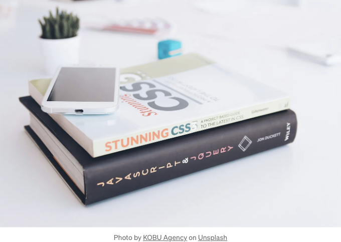

CSS(Cascading Style Sheets)는 웹 개발의 핵심 요소로, 개발자들이 웹 페이지의 표현과 레이아웃을 제어할 수 있게 합니다. CSS의 강력한 기능 중 하나는 조합자(combinators)를 사용하는 것인데, 이는 HTML 구조 내 다른 요소들과의 관계에 기반하여 특정 요소를 타겟팅할 수 있게 해줍니다.

이 글에서는 다양한 CSS 조합자를 탐구하고, 그 종류를 알아보며 사용 예시를 통해 자세히 설명하겠습니다.

# CSS 조합자란 무엇인가요?

<!-- ui-log 수평형 -->
<ins class="adsbygoogle"
  style="display:block"
  data-ad-client="ca-pub-4877378276818686"
  data-ad-slot="9743150776"
  data-ad-format="auto"
  data-full-width-responsive="true"></ins>
<component is="script">
(adsbygoogle = window.adsbygoogle || []).push({});
</component>

CSS Combinators는 두 개 이상의 선택자 간의 관계를 정의하는 데 사용되는 기호로, 개발자가 HTML 문서 내의 다른 요소에 대한 위치에 따라 스타일을 지정할 수 있도록 합니다.



## CSS Combinators에는 네 가지 주요 유형이 있습니다:

- 하위 항목 결합자 (space)
- 자식 항목 결합자 (>)
- 인접 형제 결합자 (+)
- 일반 형제 결합자 (~)

<!-- ui-log 수평형 -->
<ins class="adsbygoogle"
  style="display:block"
  data-ad-client="ca-pub-4877378276818686"
  data-ad-slot="9743150776"
  data-ad-format="auto"
  data-full-width-responsive="true"></ins>
<component is="script">
(adsbygoogle = window.adsbygoogle || []).push({});
</component>

## 1- 후손 결합자 (공백)

Cascading Style Sheets (CSS)에서 후손 결합자는 공백으로 표시되며 HTML 문서 내의 특정 부모 요소의 자손인 요소를 대상으로하는 기본 선택기입니다.

이 결합자는 중첩된 요소 또는 계층 구조 내의 요소에 스타일을 적용하는 데 특히 유용합니다.

---

<!-- ui-log 수평형 -->
<ins class="adsbygoogle"
  style="display:block"
  data-ad-client="ca-pub-4877378276818686"
  data-ad-slot="9743150776"
  data-ad-format="auto"
  data-full-width-responsive="true"></ins>
<component is="script">
(adsbygoogle = window.adsbygoogle || []).push({});
</component>

다음과 같은 HTML 구조를 고려해보세요:

```js
<div class="container">
  <h2>Title</h2>
  <p>This is a paragraph inside the container.</p>
  <div>
    <p>This is a nested paragraph.</p>
    <span>This is a span element.</span>
  </div>
</div>
```

이제 .container 내의 특정 하위 요소를 스타일링하기 위해 하위 선택자를 사용한 CSS를 적용해봅시다:

```js
.container p {
  color: blue;
}

.container span {
  font-weight: bold;
}
```

<!-- ui-log 수평형 -->
<ins class="adsbygoogle"
  style="display:block"
  data-ad-client="ca-pub-4877378276818686"
  data-ad-slot="9743150776"
  data-ad-format="auto"
  data-full-width-responsive="true"></ins>
<component is="script">
(adsbygoogle = window.adsbygoogle || []).push({});
</component>

이 예시에서는 ul 요소의 자손인 모든 li 요소가 파란색 글자 색상을 갖게 됩니다.

## 2- 자식 결합자 (>)

CSS에서 자식 결합자(`>`)는 특정 부모 요소의 직접적인 자식 요소들을 대상으로 하는 강력한 선택자입니다. 이는 부모 요소의 즉시 자식 요소들만 선택되며 손자나 더 깊은 자손들은 무시됩니다.

자식 결합자를 효과적으로 사용하는 방법을 이해하면 더 정확하고 효율적인 CSS 스타일링을 할 수 있습니다. 이 글에서는 자식 결합자의 세부 내용, 구문, 그리고 사용 예시를 명확히 설명하여 보여줄 것입니다.

<!-- ui-log 수평형 -->
<ins class="adsbygoogle"
  style="display:block"
  data-ad-client="ca-pub-4877378276818686"
  data-ad-slot="9743150776"
  data-ad-format="auto"
  data-full-width-responsive="true"></ins>
<component is="script">
(adsbygoogle = window.adsbygoogle || []).push({});
</component>

--- 

우리가 정렬되지 않은 목록(ul)의 직계 자식(li 요소)을 스타일링하고 싶을 때를 고려해보겠습니다.

```js
ul > li {
  color: blue;
}
```

<!-- ui-log 수평형 -->
<ins class="adsbygoogle"
  style="display:block"
  data-ad-client="ca-pub-4877378276818686"
  data-ad-slot="9743150776"
  data-ad-format="auto"
  data-full-width-responsive="true"></ins>
<component is="script">
(adsbygoogle = window.adsbygoogle || []).push({});
</component>

이 예시에서는 ul 요소 직접적으로 중첩된 li 요소만 파란 텍스트 색상을 가지게 됩니다. 계층 구조에서 더 깊이 중첩된 li 요소는 영향을 받지 않습니다.

---

다음 시나리오를 고려해보세요. 여러 자식 요소를 가진 div 컨테이너가 있고, 이 컨테이너의 직속 자식만 강조 표시하고 싶을 때,

```js
<div class="container">
  <p>Paragraph 1</p>
  <div>
    <p>Paragraph 2</p>
  </div>
  <span>Span 1</span>
</div>
```

<!-- ui-log 수평형 -->
<ins class="adsbygoogle"
  style="display:block"
  data-ad-client="ca-pub-4877378276818686"
  data-ad-slot="9743150776"
  data-ad-format="auto"
  data-full-width-responsive="true"></ins>
<component is="script">
(adsbygoogle = window.adsbygoogle || []).push({});
</component>

```js
.container > * {
  background-color: lightgray;
}
```

이 예에서는 클래스가 container인 div 요소의 직계 자식 요소들만이 배경색이 연회색인 것을 확인해봅시다. 내부 div 안에 중첩된 p 요소는 영향을 받지 않습니다.

— — —

문자열 목록으로 구성된 내비게이션 메뉴를 가정해 봅시다. 우리는 내비게이션 메뉴의 직계 자식들에만 스타일을 적용하고 싶습니다.```

<!-- ui-log 수평형 -->
<ins class="adsbygoogle"
  style="display:block"
  data-ad-client="ca-pub-4877378276818686"
  data-ad-slot="9743150776"
  data-ad-format="auto"
  data-full-width-responsive="true"></ins>
<component is="script">
(adsbygoogle = window.adsbygoogle || []).push({});
</component>

```md
<nav>
  <ul>
    <li>홈</li>
    <li>소개
      <ul>
        <li>역사</li>
        <li>미션</li>
      </ul>
    </li>
    <li>연락</li>
  </ul>
</nav>
```

```md
nav > ul > li {
  font-weight: bold;
}
```

이 예시에서 내비게이션 메뉴(ul) 내의 최상위 li 요소만 굵은 글ꔉ체로 설정됩니다. "소개" 메뉴 항목 아래에 위치한 중첩된 리스트 항목은 영향을 받지 않습니다.

## 3- 인접 형제 결합자 (+)

<!-- ui-log 수평형 -->
<ins class="adsbygoogle"
  style="display:block"
  data-ad-client="ca-pub-4877378276818686"
  data-ad-slot="9743150776"
  data-ad-format="auto"
  data-full-width-responsive="true"></ins>
<component is="script">
(adsbygoogle = window.adsbygoogle || []).push({});
</component>

CSS에서 인접 형제 결합자(+)는 개발자가 지정된 요소 바로 앞에 오는 요소를 대상으로 하는 강력한 도구입니다. 이는 HTML 구조 내에서 다른 특정 요소를 직접 뒤따르는 요소에 스타일을 적용할 수 있다는 것을 의미합니다.

— — —

간단한 시나리오를 고려해보겠습니다. 제목 바로 뒤에 따라오는 단락 요소에 스타일을 적용하고 싶을 때가 있습니다. 제목과 단락을 시각적으로 구분하기 위해 일정한 여백을 추가하고 싶을 것입니다. 다음은 인접 형제 결합자를 사용하여 이를 어떻게 달성할 수 있는지 보여줍니다:

```js
<h2>Heading</h2>
<p>This is the first paragraph.</p>
<p>This is the second paragraph.</p>
```  

<!-- ui-log 수평형 -->
<ins class="adsbygoogle"
  style="display:block"
  data-ad-client="ca-pub-4877378276818686"
  data-ad-slot="9743150776"
  data-ad-format="auto"
  data-full-width-responsive="true"></ins>
<component is="script">
(adsbygoogle = window.adsbygoogle || []).push({});
</component>

```js
h2 + p {
  margin-top: 20px;
}
```

이 예에서 CSS 규칙인 `h2 + p`는 `h2` 요소 바로 뒤에 있는 문단(`p`) 요소를 선택하고 상단 여백을 20픽셀 추가합니다. 결과적으로 두 번째 문단은 상단에 여백이 생겨 제목과 시각적으로 구분됩니다.

— — —

네비게이션 메뉴를 고려해보세요. 다른 링크가 앞선 경우에 스타일을 다르게 적용하고 싶을 때 이웃 형제 조합자를 사용할 수 있습니다. 다음은 예시입니다.```

<!-- ui-log 수평형 -->
<ins class="adsbygoogle"
  style="display:block"
  data-ad-client="ca-pub-4877378276818686"
  data-ad-slot="9743150776"
  data-ad-format="auto"
  data-full-width-responsive="true"></ins>
<component is="script">
(adsbygoogle = window.adsbygoogle || []).push({});
</component>

```js
<ul class="navigation">
  <li><a href="#">홈</a></li>
  <li><a href="#">소개</a></li>
  <li><a href="#">서비스</a></li>
  <li><a href="#">연락처</a></li>
</ul>
```

```js
.navigation li + li a {
  color: #555;
}
```

이 예에서 CSS 규칙 .navigation li + li a는 탐색 메뉴 내에서 다른 리스트 항목을 바로 뒤따르는 목록 항목 내의 앵커(`a`) 요소를 선택합니다. 이 규칙은 이러한 링크에 #555 색상을 적용합니다. 결과적으로 탐색 메뉴에서 첫 번째를 제외한 모든 링크가 다른 색상을 가지게 됩니다.

## 4- 일반 형제 선택자(~)

<!-- ui-log 수평형 -->
<ins class="adsbygoogle"
  style="display:block"
  data-ad-client="ca-pub-4877378276818686"
  data-ad-slot="9743150776"
  data-ad-format="auto"
  data-full-width-responsive="true"></ins>
<component is="script">
(adsbygoogle = window.adsbygoogle || []).push({});
</component>

CSS에서 일반 형제 결합자(~)는 지정된 요소의 형제인 요소를 선택하는 강력한 도구입니다. 이 결합자를 사용하면 개발자들은 동일한 부모 컨테이너 내에서 요소들 간의 관계에 기반하여 스타일을 적용할 수 있습니다.

---

간단한 항목 목록으로 구성된 HTML 구조를 고려해 봅시다:

```js
- Item 1
- Item 2
- Item 3
- Item 4
- Item 5
```

<!-- ui-log 수평형 -->
<ins class="adsbygoogle"
  style="display:block"
  data-ad-client="ca-pub-4877378276818686"
  data-ad-slot="9743150776"
  data-ad-format="auto"
  data-full-width-responsive="true"></ins>
<component is="script">
(adsbygoogle = window.adsbygoogle || []).push({});
</component>

이제, 세 번째 목록 항목 뒤에 오는 모든 목록 항목을 강조 표시하려면 CSS에서 일반 형제 선택자를 사용하여 이를 달성할 수 있습니다:

```js
.highlight ~ li {
  color: blue;
}
```

이 예제에서 CSS 규칙은 "highlight" 클래스를 가진 요소 (`li class="highlight"`항목 3`/li`)의 형제인 모든 li 요소를 대상으로 하며 해당 요소 뒤에 옵니다. 결과적으로, 세 번째 목록 항목 뒤의 모든 목록 항목(`li`항목 4`/li` 및 `li`항목 5`/li`)이 파란색 텍스트 색상으로 스타일이 지정됩니다.

# 결론

<!-- ui-log 수평형 -->
<ins class="adsbygoogle"
  style="display:block"
  data-ad-client="ca-pub-4877378276818686"
  data-ad-slot="9743150776"
  data-ad-format="auto"
  data-full-width-responsive="true"></ins>
<component is="script">
(adsbygoogle = window.adsbygoogle || []).push({});
</component>

CSS 조합자는 다른 요소들과의 관계에 기초하여 HTML 문서 내의 특정 요소들을 대상으로 하는 강력한 도구를 제공합니다. 이러한 조합자를 효과적으로 이해하고 활용함으로써, 개발자들은 웹 페이지의 스타일링과 레이아웃에 대해 세밀한 제어를 가할 수 있게 되며, 그 결과로 더 세련되고 시각적으로 매력적인 사용자 인터페이스를 구축할 수 있습니다. 조합자를 실험하고 CSS 작업 흐름에 통합함으로써, 동적이고 반응형 웹 디자인을 생성하는 능력을 크게 향상시킬 수 있습니다.