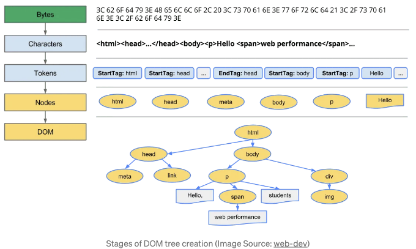

문서 객체 모델(DOM)은 HTML 및 XML 문서를 위한 프로그래밍 인터페이스입니다. DOM은 W3C 표준입니다. 이것은 각 노드가 요소, 속성 및 텍스트와 같은 문서의 일부를 나타내는 객체인 트리 구조로 웹 문서를 논리적으로 표현합니다.
DOM은 프로그램이 웹 페이지의 콘텐츠, 구조 및 스타일을 동적으로 액세스, 수정 및 조작할 수 있는 방법을 제공합니다. 이를 통해 개발자는 DOM과 상호작용하는 스크립트를 작성하여 콘텐츠를 업데이트하고 이벤트를 처리하며 사용자 조작에 응답하는 방식으로 인터랙티브하고 동적인 웹 페이지를 생성할 수 있습니다.

```js
<!DOCTYPE html>
<html lang="en">
<head>
  <meta charset="UTF-8">
  <meta name="viewport" content="width=device-width, initial-scale=1.0">
  <title>Document</title>
</head>
<body>
  <h1>Header</h1>
  <div>
    <p>Hello</p>
    <a href="">Link</a>
  </div>
</body>
</html>
```

위의 HTML 문서를 DOM은 이렇게 나타냅니다:

<!-- ui-log 수평형 -->
<ins class="adsbygoogle"
  style="display:block"
  data-ad-client="ca-pub-4877378276818686"
  data-ad-slot="9743150776"
  data-ad-format="auto"
  data-full-width-responsive="true"></ins>
<component is="script">
(adsbygoogle = window.adsbygoogle || []).push({});
</component>


# DOM이 어떻게 구성되나요?

DOM 트리의 구성은 웹 페이지가 웹 브라우저에 로드될 때 발생합니다. DOM 트리가 구성되는 일반적인 개요는 다음과 같습니다:



<!-- ui-log 수평형 -->
<ins class="adsbygoogle"
  style="display:block"
  data-ad-client="ca-pub-4877378276818686"
  data-ad-slot="9743150776"
  data-ad-format="auto"
  data-full-width-responsive="true"></ins>
<component is="script">
(adsbygoogle = window.adsbygoogle || []).push({});
</component>

- HTML 구문 분석:
서버에서 브라우저가 HTML 문서를 받으면 HTML 코드를 분석하기 시작합니다. 이 과정은 다음 단계로 진행됩니다.
1. 변환: 브라우저는 디스크나 네트워크에서 HTML의 원시 바이트를 읽어와 파일의 지정된 인코딩 (예: UTF-8)에 따라 개별 문자로 변환합니다.
2. 토큰화: 브라우저는 문자열을 W3C HTML5 표준에 따라 구체적인 토큰으로 변환합니다. 예를 들어 “`html`”, “`body`”와 같은 꺽쇠 괄호 안의 다른 문자열 등이 있습니다. 각 토큰은 특별한 의미와 규칙을 가지고 있습니다.
3. 렉싱: 발행된 토큰들은 “노드”로 변환되며, 각 노드는 속성과 규칙을 정의하는 객체를 포함하고 있습니다. 웹 페이지를 조작하고 만들기 위해 사용할 수 있는 모든 속성, 메서드 및 이벤트는 객체로 구성되어 있습니다. 예를 들어, 문서 자체를 나타내는 document 객체, HTML 테이블에 액세스하기 위한 HTMLTableElement DOM 인터페이스를 구현하는 테이블 객체 등이 모두 객체입니다.
- DOM 트리 구성:
브라우저가 HTML을 구문 분석하는 동안 DOM 트리라고 알려진 트리 구조를 구성합니다. 각 HTML 요소는 이 트리 내에서 노드가 되며, 부모-자식 관계는 HTML의 중첩 구조를 반영합니다. 이러한 노드는 문서 내의 요소, 속성 및 텍스트 내용을 나타냅니다. DOM 트리를 생성하는 동안 “document” 노드가 먼저 만들어집니다. Document는 전체 HTML 문서를 나타내는 노드입니다.
- 노드 연결:
브라우저는 HTML 구조에 기반하여 노드 간의 관계를 설정합니다. 부모 노드는 자식 노드에 연결되며, 형제 노드는 서로 연결됩니다.
- 속성 및 메서드 할당:
각 DOM 노드에는 문서를 조작하고 상호 작용할 수 있는 속성 및 메서드가 함께 제공됩니다. 이러한 속성에는 innerHTML, textContent, id, class 등과 appendChild(), removeChild(), querySelector() 등의 메서드가 포함됩니다.
- DOM 렌더링:
DOM 트리가 생성되면 브라우저는 이를 사용하여 웹 페이지를 화면에 렌더링합니다. 브라우저는 DOM 구조를 해석하고 CSS로 정의된 스타일을 적용하여 각 요소의 시각적 표현을 결정합니다.

# DOM은 어디에 저장되어 있나요?

DOM은 파일이나 데이터베이스처럼 단일 위치에 저장되지 않습니다. 대신, 웹 브라우저가 HTML이나 XML 문서를 로드할 때 동적으로 생성되고 유지됩니다. 따라서 DOM은 웹 페이지를 렌더링하고 브라우저에서 상호 작용하는 동안 브라우저의 메모리에 저장됩니다. 이 메모리 상의 표현은 브라우저가 웹 페이지의 콘텐츠를 효율적으로 조작하고 렌더링할 수 있게 합니다. 페이지를 닫거나 새로 고칠 때 DOM이 파괴되고, 다른 페이지를 로드할 경우 새 DOM이 생성됩니다. 브라우저는 DOM을 RAM에 저장합니다.

요약하면, DOM은 디스크의 파일처럼 영구적으로 저장되지 않고, 대신 브라우저가 웹 페이지를 처리하고 상호 작용할 때 메모리(RAM)에 일시적으로 존재합니다.

<!-- ui-log 수평형 -->
<ins class="adsbygoogle"
  style="display:block"
  data-ad-client="ca-pub-4877378276818686"
  data-ad-slot="9743150776"
  data-ad-format="auto"
  data-full-width-responsive="true"></ins>
<component is="script">
(adsbygoogle = window.adsbygoogle || []).push({});
</component>

참고 자료
- https://web.dev/articles/critical-rendering-path/constructing-the-object-model
- https://developer.mozilla.org/ko/docs/Web/API/Document_Object_Model
- https://developer.mozilla.org/ko/docs/Web/Performance/How_browsers_work