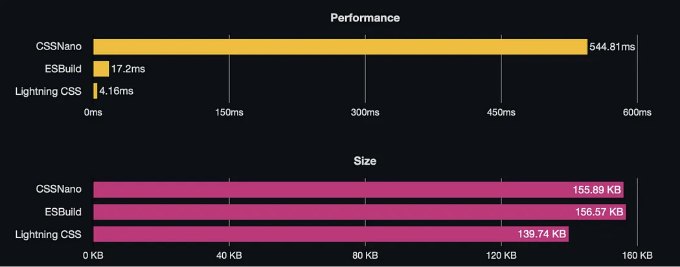
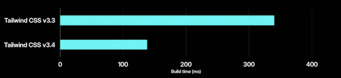

알려진 Tailwind CSS는 스타일링에 대한 신속한 유틸리티 우선 접근 방식으로 널리 알려져 있으며, Shopify, Netflix, Nike와 같은 주요 브랜드에서 널리 사용되어 웹 개발에서 게임 체인저 역할을 해왔습니다. 이제 Adam Wathan과 Tailwind Labs는 Tailwind Oxide Engine을 소개하며, 이는 도구 체인을 간소화하고, 성능을 향상시키고, 구성을 간소화하는 방대한 진화를 나타냅니다.

# Oxide가 내 앱을 망가뜨릴까요?

간단하게 대답하면: 아니요, 망가뜨리지 않을 것입니다. Tailwind 팀은 기존 프로젝트와 하위 호환성을 유지하면서 내부적으로 업그레이드를 도입하는 것을 목표로 하고 있습니다.

<!-- ui-log 수평형 -->
<ins class="adsbygoogle"
  style="display:block"
  data-ad-client="ca-pub-4877378276818686"
  data-ad-slot="9743150776"
  data-ad-format="auto"
  data-full-width-responsive="true"></ins>
<component is="script">
(adsbygoogle = window.adsbygoogle || []).push({});
</component>

# Tailwind Oxide Engine란 무엇인가요?

Tailwind Oxide Engine은 세 가지 주요 목표를 달성하도록 설계되었습니다:

## 1) 통합된 도구 체인

일반적으로 개발자는 Tailwind CSS와 함께 PostCSS, AutoPrefixer, 그리고 PostCSS Preset Env와 같은 여러 종속성을 관리해야 했습니다. Oxide는 이러한 기능을 통합하여 별도의 종속성이 필요하지 않게 하고, 쉽게 사용할 수 있는 경험을 제공합니다.

<!-- ui-log 수평형 -->
<ins class="adsbygoogle"
  style="display:block"
  data-ad-client="ca-pub-4877378276818686"
  data-ad-slot="9743150776"
  data-ad-format="auto"
  data-full-width-responsive="true"></ins>
<component is="script">
(adsbygoogle = window.adsbygoogle || []).push({});
</component>

## 2) 라이트닝 CSS로 성능 향상



Oxide는 Parcel 팀이 개발한 Rust 기반 CSS 변환 도구인 라이트닝 CSS를 활용합니다. 이 도구는 자바스크립트 기반 대안보다 100배 이상 빠른 성능을 제공합니다. 라이트닝 CSS는 또한 CSS 모듈을 지원하여 파일 크기를 최소화하고 CSS 파일 간의 이름 충돌을 방지합니다.

## 3) 간소화된 구성

<!-- ui-log 수평형 -->
<ins class="adsbygoogle"
  style="display:block"
  data-ad-client="ca-pub-4877378276818686"
  data-ad-slot="9743150776"
  data-ad-format="auto"
  data-full-width-responsive="true"></ins>
<component is="script">
(adsbygoogle = window.adsbygoogle || []).push({});
</component>

Oxide는 자동 콘텐츠 감지를 소개하여, 개발자가 Tailwind 클래스를 포함하는 파일 경로를 수동으로 지정할 필요가 없습니다. 이는 구성 오버헤드를 줄이고 개발 프로세스를 간소화합니다. 게다가, Oxide는 CSS 기반 구성을 탐색하여 Tailwind를 더 자연스럽고 직관적으로 느끼도록 노력합니다.

```js
/* 접근 방법 1: 사용자 정의 CSS */
.bold-class {
  font-weight: bold;
}
/* HTML에서 클래스 사용 */
<p class="bold-class">나는 텍스트입니다.</p>
/* 접근 방법 2: Tailwind CSS 사용 */
/* Tailwind CSS를 설정한 후, 유틸리티 클래스 사용 */
<p class="font-bold">나는 텍스트입니다.</p>
```

# 자동 콘텐츠 감지 및 구성 단순화:



<!-- ui-log 수평형 -->
<ins class="adsbygoogle"
  style="display:block"
  data-ad-client="ca-pub-4877378276818686"
  data-ad-slot="9743150776"
  data-ad-format="auto"
  data-full-width-responsive="true"></ins>
<component is="script">
(adsbygoogle = window.adsbygoogle || []).push({});
</component>

단일 스레드에서 초당 2.7백만 줄의 코드를 처리하고 압축 할 수 있으며, Rust의 다중 스레딩 및 병렬 처리 능력을 활용하여 우수한 속도를 달성합니다. Oxide는 Tailwind의 빌드 시간을 크게 개선하여 현재 버전과 비교했을 때 2배 이상 빠르게 만들어줍니다.

## tailwind.config.js 자세히 살펴보기:

이제 tailwind.config.js를 자세히 살펴봅시다. Tailwind Oxide로 자동 콘텐츠 감지를 사용하면 Oxide 엔진이 자동으로 Tailwind 클래스가 포함 된 파일을 찾아 ```content``` 배열이 불필요해집니다:

```js
// Tailwind Oxide로 content 배열을 생략할 수 있습니다
module.exports = {
  content: [
    "./src/app/**/*.{js,ts,jsx,tsx}",
    "./src/pages/**/*.{js,ts,jsx,tsx}",
  ],
  theme: {
    extend: {
      fontFamily: {
        sans: ["Inter", "sans-serif"],
      },
      colors: {
        primary: "#FC9D0D",
        secondary: "#95D927",
        "purple": "9a6ae7",
        "red": "oklch(40.1% 0.123 21.57)"
      },
    },
  },
  plugins: [],
}
```

<!-- ui-log 수평형 -->
<ins class="adsbygoogle"
  style="display:block"
  data-ad-client="ca-pub-4877378276818686"
  data-ad-slot="9743150776"
  data-ad-format="auto"
  data-full-width-responsive="true"></ins>
<component is="script">
(adsbygoogle = window.adsbygoogle || []).push({});
</component>

더불어, Tailwind Oxide에서 Tailwind import가 위치한 app.css 파일에서는 모든 import를 단일 라인으로 통합하여 프로세스를 간소화합니다:

```js
/* app.css WITH Tailwind Oxide */
@import "tailwindcss";
```

마지막으로, postcss.config.js 파일을 관리하는 작업 역시 Tailwind Oxide로 간소화되어 불필요한 부담을 줄이고 오류 가능성을 최소화합니다. Oxide를 사용하면 PostCSS 플러그인을 구성하는 작업이 단일 라인으로 요약됩니다:

```js
// postcss.config.js with Tailwind Oxide
module.exports = {
  plugins: {
    tailwindcss: {},
  },
}
```

<!-- ui-log 수평형 -->
<ins class="adsbygoogle"
  style="display:block"
  data-ad-client="ca-pub-4877378276818686"
  data-ad-slot="9743150776"
  data-ad-format="auto"
  data-full-width-responsive="true"></ins>
<component is="script">
(adsbygoogle = window.adsbygoogle || []).push({});
</component>

# 결론:

전체적으로, Tailwind Oxide Engine은 성능을 향상시키고 구성을 단순화하며 복잡성을 줄이는 등의 기능을 통해 Tailwind CSS 경험을 혁신하며 개발자들이 용이하게 우아하고 맞춤화된 인터페이스를 만들도록 돕습니다.