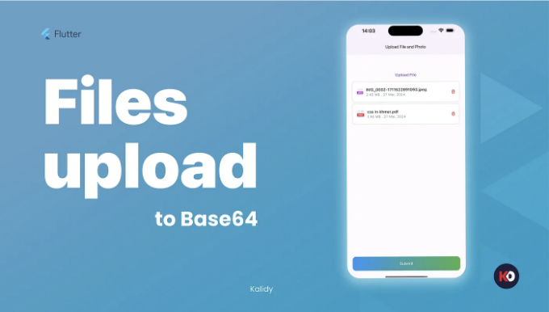
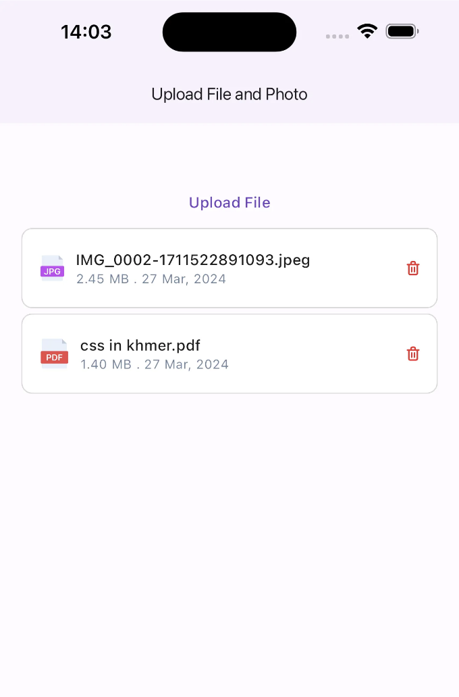

# 소개:

플러터(Flutter)에서 파일 및 사진을 업로드하고 해당 파일들의 base64 표현을 얻는 방법에 대한 가이드에 오신 것을 환영합니다. 이 문서에서는 프로세스를 단계별로 안내해 드립니다.

# 개요:

<!-- ui-log 수평형 -->
<ins class="adsbygoogle"
  style="display:block"
  data-ad-client="ca-pub-4877378276818686"
  data-ad-slot="9743150776"
  data-ad-format="auto"
  data-full-width-responsive="true"></ins>
<component is="script">
(adsbygoogle = window.adsbygoogle || []).push({});
</component>

파일을 업로드하고 사진을 base64 문자열로 변환하는 것은 모바일 앱 개발에서 흔한 작업입니다. 이미지, 문서 또는 다른 파일 유형을 다룰 때 Flutter는 파일 작업을 효율적으로 처리하기 위한 편리한 라이브러리를 제공합니다.

# 사전 준비 사항:

시작하기 전에 개발 컴퓨터에 Flutter가 설치되어 있는지 확인하세요. Flutter 개발에 대한 기본 지식과 Getx State management에 대한 이해가 있는 것도 좋습니다.

# 단계별 안내:

<!-- ui-log 수평형 -->
<ins class="adsbygoogle"
  style="display:block"
  data-ad-client="ca-pub-4877378276818686"
  data-ad-slot="9743150776"
  data-ad-format="auto"
  data-full-width-responsive="true"></ins>
<component is="script">
(adsbygoogle = window.adsbygoogle || []).push({});
</component>

## 단계 1: 종속 항목 추가

먼저, pubspec.yaml 파일에 필요한 종속 항목을 추가하세요:

```js
dependencies:
  cupertino_icons: ^1.0.6
  get: ^4.6.6
  gap: ^3.0.1
  flutter_svg: ^2.0.10+1
  text_scroll: ^0.2.0
  intl: ^0.19.0
  file_picker: ^8.0.0+1
  permission_handler: ^11.3.0
  mime: ^1.0.5
```

## 단계 2: 파일 선택

<!-- ui-log 수평형 -->
<ins class="adsbygoogle"
  style="display:block"
  data-ad-client="ca-pub-4877378276818686"
  data-ad-slot="9743150776"
  data-ad-format="auto"
  data-full-width-responsive="true"></ins>
<component is="script">
(adsbygoogle = window.adsbygoogle || []).push({});
</component>

당신을 위해 테이블 태그를 마크다운 형식으로 변경해 드릴게요.

| Key  | Description |
| ------------- | ------------- |
| NSPhotoLibraryUsageDescription  | We need access to your photo library to allow you to select photos for upload.  |
| NSCameraUsageDescription  | This app requires access to the camera and this lets you do things like scan QR code.  |

<!-- ui-log 수평형 -->
<ins class="adsbygoogle"
  style="display:block"
  data-ad-client="ca-pub-4877378276818686"
  data-ad-slot="9743150776"
  data-ad-format="auto"
  data-full-width-responsive="true"></ins>
<component is="script">
(adsbygoogle = window.adsbygoogle || []).push({});
</component>

```js
# 프로젝트에 전역 플랫폼을 정의하려면 이 줄의 주석을 해제하세요
# platform :ios, '12.0'

# CocoaPods 분석은 Flutter 빌드 대기 시간에 동기적으로 네트워크 통계를 보냅니다.
ENV['COCOAPODS_DISABLE_STATS'] = 'true'

project 'Runner', {
  'Debug' => :debug,
  'Profile' => :release,
  'Release' => :release,
}

def flutter_root
  generated_xcode_build_settings_path = File.expand_path(File.join('..', 'Flutter', 'Generated.xcconfig'), __FILE__)
  unless File.exist?(generated_xcode_build_settings_path)
    raise "#{generated_xcode_build_settings_path} must exist. If you're running pod install manually, make sure flutter pub get is executed first"
  end

  File.foreach(generated_xcode_build_settings_path) do |line|
    matches = line.match(/FLUTTER_ROOT\=(.*)/)
    return matches[1].strip if matches
  end
  raise "FLUTTER_ROOT not found in #{generated_xcode_build_settings_path}. Try deleting Generated.xcconfig, then run flutter pub get"
end

require File.expand_path(File.join('packages', 'flutter_tools', 'bin', 'podhelper'), flutter_root)

flutter_ios_podfile_setup

target 'Runner' do
  use_frameworks!
  use_modular_headers!

  flutter_install_all_ios_pods File.dirname(File.realpath(__FILE__))
  target 'RunnerTests' do
    inherit! :search_paths
  end
end

post_install do |installer|
  installer.pods_project.targets.each do |target|
    flutter_additional_ios_build_settings(target)
      target.build_configurations.each do |config|
        config.build_settings['ENABLE_BITCODE'] = 'NO'
          config.build_settings['IPHONEOS_DEPLOYMENT_TARGET'] = '13.0'
            config.build_settings['GCC_PREPROCESSOR_DEFINITIONS'] ||= [
            '$(inherited)',

            ## dart: PermissionGroup.photos
            'PERMISSION_PHOTOS=1',
          ]

    end  
  end
end
```

- GetXController 생성: 파일 선택 로직을 처리할 GetXController 클래스를 만드세요.
- FilePicker 사용: GetXController 내에서 사용자가 파일을 선택할 수 있도록 FilePicker 패키지를 사용하세요.

home_controller.dart

```js
class HomeController extends GetxController{
 List<File> filesList = [];
 FilePickerResult? result;

  // 파일 업로드
  Future<void> uploadFile() async {
      if (filesList.length >= 5) {
        return debugPrint("최대 파일 제한에 도달했습니다");
      }
      result = await FilePicker.platform.pickFiles(
        allowMultiple: true,
        type: FileType.custom,
        allowCompression: true,
        allowedExtensions: [
          'pdf',
          'xls',
        ],
      );
  
      if (result != null) {
        var listTemp = result!.paths.map((path) => File(path!)).toList();
        filesList.addAll(
            listTemp.take(5 - filesList.length)); // 남은 슬롯만 가져옴
        update(['home']);
        debugPrint("-----List $filesList");
      } else {
        debugPrint("파일을 선택하지 않았습니다");
        update(['home']);
      }
      update(['home']);
    }

  // 사진 업로드
  Future<void> uploadPhoto() async {
      if (filesList.length >= 5) {
        return debugPrint("최대 파일 제한에 도달했습니다");
      }
      var status = await Permission.photos.status;
      if (!status.isGranted) {
        await Permission.photos.request();
        status = await Permission.photos.status;
        if (!status.isGranted) {
          return debugPrint('사진 액세스 권한이 거부되었습니다');
        }
      }
      result = await FilePicker.platform.pickFiles(
        allowMultiple: false,
        type: FileType.image,
        allowCompression: true,
      );
      if (result != null && result!.files.isNotEmpty) {
        final List<File> listTemp =
            result!.paths.map((path) => File(path!)).toList();
        filesList.addAll(listTemp.take(5 - filesList.length));
        update(['home']);
        debugPrint("-----Photo List $filesList");
      } else {
        debugPrint("사진을 선택하지 않았습니다");
        update(['home']);
      }
    }

}
```

<!-- ui-log 수평형 -->
<ins class="adsbygoogle"
  style="display:block"
  data-ad-client="ca-pub-4877378276818686"
  data-ad-slot="9743150776"
  data-ad-format="auto"
  data-full-width-responsive="true"></ins>
<component is="script">
(adsbygoogle = window.adsbygoogle || []).push({});
</component>

## 단계 3: 화면에서 파일 내용 읽기

선택한 파일의 내용을 File 클래스의 메소드를 사용하여 읽습니다:
home_screen.dart

```js
ListView.separated(
                  physics: const NeverScrollableScrollPhysics(),
                  shrinkWrap: true,
                  itemCount: homeController.filesList.length,
                  itemBuilder: (context, idx) {
                    return CustomCardUploadFile(
                      onTap: () => homeController.removeItem(idx),
                      index: idx,
                      name: homeController.getFileName(
                        homeController.filesList[idx],
                      ),
                      icon: homeController.checkTypeFile(
                        homeController.filesList[idx],
                      ),
                      size: homeController.getFileSize(
                        homeController.filesList[idx],
                      ),
                    );
                  },
                  separatorBuilder: (BuildContext context, int index) {
                    return const SizedBox(
                      height: 5,
                    );
                  },
                ),
```

## 단계 4: Base64로 변환

<!-- ui-log 수평형 -->
<ins class="adsbygoogle"
  style="display:block"
  data-ad-client="ca-pub-4877378276818686"
  data-ad-slot="9743150776"
  data-ad-format="auto"
  data-full-width-responsive="true"></ins>
<component is="script">
(adsbygoogle = window.adsbygoogle || []).push({});
</component>

Dart의 내장 라이브러리를 사용하여 파일 내용을 base64 문자열로 변환하십시오:

home_controller.dart

```dart
  Future<String> getBase64(File file) async {
    String? base64;
    String? contentType = getContentType(file.path);
    if (contentType != null) {
      if (contentType.contains("image")) {
        final uInt8List = file.readAsBytesSync();
        base64 = base64Encode(uInt8List);
      } else {
        final uInt8List = await file.readAsBytes();
        base64 = base64Encode(uInt8List);
      }
      print("contentType: $contentType");
    }
    return base64 ?? "";
  }
```

## 단계 5: 도우미 함수 처리

<!-- ui-log 수평형 -->
<ins class="adsbygoogle"
  style="display:block"
  data-ad-client="ca-pub-4877378276818686"
  data-ad-slot="9743150776"
  data-ad-format="auto"
  data-full-width-responsive="true"></ins>
<component is="script">
(adsbygoogle = window.adsbygoogle || []).push({});
</component>

Handling helper function은 파일 선택이나 base64 변환 과정 중에 발생할 수 있는 함수를 처리하기 위해 구현되었습니다:

getContentType

```js
String? getContentType(String filePath) {
    // 파일 확장자 결정
    String extension = filePath.split('.').last;
    // 파일 확장자를 기반으로 MIME 유형 조회
    String? mimeType = lookupMimeType(filePath);
    return mimeType;
}
```

getFileName

<!-- ui-log 수평형 -->
<ins class="adsbygoogle"
  style="display:block"
  data-ad-client="ca-pub-4877378276818686"
  data-ad-slot="9743150776"
  data-ad-format="auto"
  data-full-width-responsive="true"></ins>
<component is="script">
(adsbygoogle = window.adsbygoogle || []).push({});
</component>

```js
  String getFileName(File file) {
    var filename = file.path.split("/");
    return filename[filename.length - 1];
  }
```

getFileSize

```js
  String getFileSize(File file) {
    var fileSizeInBytes = file.lengthSync();

    // Convert bytes to kilobytes
    var fileSizeInKB = fileSizeInBytes / 1024;

    if (fileSizeInKB > 1000) {
      // Convert kilobytes to megabytes and return as a string
      var fileSizeInMB = fileSizeInKB / 1024;
      return '${fileSizeInMB.toStringAsFixed(2)} MB';
    } else {
      return '${fileSizeInKB.toStringAsFixed(2)} KB';
    }
  }
```

checkTypeFile

<!-- ui-log 수평형 -->
<ins class="adsbygoogle"
  style="display:block"
  data-ad-client="ca-pub-4877378276818686"
  data-ad-slot="9743150776"
  data-ad-format="auto"
  data-full-width-responsive="true"></ins>
<component is="script">
(adsbygoogle = window.adsbygoogle || []).push({});
</component>

```js
checkTypeFile(File file) {
    var filename = file.path.split(".");
    if (filename[filename.length - 1] == 'pdf') {
      return "assets/svg/pdf.svg";
    } else if (filename[filename.length - 1] == 'png') {
      return "assets/svg/png.svg";
    } else if (filename[filename.length - 1] == 'jpg') {
      return "assets/svg/jpg.svg";
    } else if (filename[filename.length - 1] == 'xls') {
      return "assets/svg/xls.svg";
    } else if (filename[filename.length - 1] == 'jpeg') {
      return "assets/svg/jpg.svg";
    } else {
      return '';
    }
  }
```

removeItems

```js
  void removeItem(int index) {
    filesList.removeAt(index);
    update(['home']);
  }
```

# 전체 코드 예시:

<!-- ui-log 수평형 -->
<ins class="adsbygoogle"
  style="display:block"
  data-ad-client="ca-pub-4877378276818686"
  data-ad-slot="9743150776"
  data-ad-format="auto"
  data-full-width-responsive="true"></ins>
<component is="script">
(adsbygoogle = window.adsbygoogle || []).push({});
</component>

home_controller.dart

```dart
import 'dart:convert';
import 'dart:io';
import 'dart:math';

import 'package:file_picker/file_picker.dart';
import 'package:flutter/cupertino.dart';
import 'package:flutter/material.dart';
import 'package:get/get_state_manager/get_state_manager.dart';
import 'package:mime/mime.dart';
import 'package:permission_handler/permission_handler.dart';

import '../model/file_model/file_model.dart';

class HomeController extends GetxController {
  List<File> filesList = [];
  FilePickerResult? result;

  handleSubmit() async {
    var fileList = <FilesModel>[];
    debugPrint("--------File Before Convert $filesList");
    await Future.wait(filesList.asMap().entries.map((element) async {
      var base64String = await getBase64(element.value);
      fileList.add(
        FilesModel(
          filename: getFileName(element.value),
          fileContent: base64String,
        ),
      );
    }).toList());
    // Here is FileList base64
    debugPrint("--------After  Convert ${fileList.map((e) => e.fileContent)}");

    //Now you can submit list of base64 to api
  }

  handleUpload(BuildContext context) {
    showCupertinoModalPopup(
      context: context,
      builder: (BuildContext context) {
        return CupertinoActionSheet(
          title: const Text("Option"),
          actions: <Widget>[
            CupertinoActionSheetAction(
              child: const Text("Upload File"),
              onPressed: () {
                uploadFile();
                Navigator.pop(context);
              },
            ),
            CupertinoActionSheetAction(
              child: const Text("Gallery"),
              onPressed: () {
                uploadPhoto();
                Navigator.pop(context);
              },
            ),
          ],
          cancelButton: CupertinoActionSheetAction(
            child: const Text("Cancel"),
            onPressed: () {
              Navigator.pop(context);
            },
          ),
        );
      },
    );
  }

  void removeItem(int index) {
    filesList.removeAt(index);
    update(['home']);
  }

  String getFileName(File file) {
    var filename = file.path.split("/");
    return filename[filename.length - 1];
  }

  String getFileSize(File file) {
    var fileSizeInBytes = file.lengthSync();

    // Convert bytes to kilobytes
    var fileSizeInKB = fileSizeInBytes / 1024;

    if (fileSizeInKB > 1000) {
      // Convert kilobytes to megabytes and return as a string
      var fileSizeInMB = fileSizeInKB / 1024;
      return '${fileSizeInMB.toStringAsFixed(2)} MB';
    } else {
      return '${fileSizeInKB.toStringAsFixed(2)} KB';
    }
  }

  String? getContentType(String filePath) {
    // Determine file extension
    String extension = filePath.split('.').last;
    // Lookup MIME type based on file extension
    String? mimeType = lookupMimeType(filePath);
    return mimeType;
  }

  Future<String> getBase64(File file) async {
    String? base64;
    String? contentType = getContentType(file.path);
    if (contentType != null) {
      if (contentType.contains("image")) {
        final uInt8List = file.readAsBytesSync();
        base64 = base64Encode(uInt8List);
      } else {
        final uInt8List = await file.readAsBytes();
        base64 = base64Encode(uInt8List);
      }
      print("contentType: $contentType");
    }
    return base64 ?? "";
  }

  checkTypeFile(File file) {
    var filename = file.path.split(".");
    if (filename[filename.length - 1] == 'pdf') {
      return "assets/svg/pdf.svg";
    } else if (filename[filename.length - 1] == 'png') {
      return "assets/svg/png.svg";
    } else if (filename[filename.length - 1] == 'jpg') {
      return "assets/svg/jpg.svg";
    } else if (filename[filename.length - 1] == 'xls') {
      return "assets/svg/xls.svg";
    } else if (filename[filename.length - 1] == 'jpeg') {
      return "assets/svg/jpg.svg";
    } else {
      return '';
    }
  }

  Future<void> uploadFile() async {
    if (filesList.length >= 5) {
      return debugPrint("Maximum file limit reached");
    }
    result = await FilePicker.platform.pickFiles(
      allowMultiple: true,
      type: FileType.custom,
      allowCompression: true,
      allowedExtensions: [
        'pdf',
        'xls',
      ],
    );

    if (result != null) {
      var listTemp = result!.paths.map((path) => File(path!)).toList();
      filesList.addAll(
          listTemp.take(5 - filesList.length)); // Take only remaining slots
      update(['home']);
      debugPrint("-----List $filesList");
    } else {
      debugPrint("No file selected");
      update(['home']);
    }
    update(['home']);
  }

  Future<void> uploadPhoto() async {
    if (filesList.length >= 5) {
      return debugPrint("Maximum file limit reached");
    }
    var status = await Permission.photos.status;
    if (!status.isGranted) {
      await Permission.photos.request();
      status = await Permission.photos.status;
      if (!status.isGranted) {
        return debugPrint('Permission denied for accessing photos');
      }
    }
    result = await FilePicker.platform.pickFiles(
      allowMultiple: false,
      type: FileType.image,
      allowCompression: true,
    );
    if (result != null && result!.files.isNotEmpty) {
      final List<File> listTemp =
          result!.paths.map((path) => File(path!)).toList();
      filesList.addAll(listTemp.take(5 - filesList.length));
      update(['home']);
      debugPrint("-----Photo List $filesList");
    } else {
      debugPrint("No photo selected");
      update(['home']);
    }
  }
}
```

home_screen.dart

```dart
import 'package:flutter/material.dart';
import 'package:get/get.dart';
import 'package:uploadfile_base64_fltter/controller/home_controller.dart';

import '../widgets/custom_upload_card.dart';

class HomeScreen extends StatelessWidget {
  const HomeScreen({super.key});

  @override
  Widget build(BuildContext context) {
    final homeController = Get.put(HomeController());
    return Scaffold(
      appBar: AppBar(
        elevation: 1,
        title: const Text(
          'Upload File and Photo',
          style: TextStyle(fontSize: 16),
        ),
      ),
      body: GetBuilder(
        init: homeController,
        id: "home",
        builder: (context) {
          return Padding(
            padding: const EdgeInsets.symmetric(horizontal: 20),
            child: Column(
              children: [
                const SizedBox(
                  height: 50,
                ),
                TextButton(
                  onPressed: () => homeController.handleUpload(context),
                  child: const Text("Upload File"),
                ),
                ListView.separated(
                  physics: const NeverScrollableScrollPhysics(),
                  shrinkWrap: true,
                  itemCount: homeController.filesList.length,
                  itemBuilder: (context, idx) {
                    return CustomCardUploadFile(
                      onTap: () => homeController.removeItem(idx),
                      index: idx,
                      name: homeController.getFileName(
                        homeController.filesList[idx],
                      ),
                      icon: homeController.checkTypeFile(
                        homeController.filesList[idx],
                      ),
                      size: homeController.getFileSize(
                        homeController.filesList[idx],
                      ),
                    );
                  },
                  separatorBuilder: (context, index) {
                    return const SizedBox(
                      height: 5,
                    );
                  },
                ),
              ],
            ),
          );
        },
      ),
      bottomNavigationBar: SafeArea(
        child: Padding(
          padding: const EdgeInsets.symmetric(horizontal: 20),
          child: ElevatedButton(
            onPressed: () => homeController.handleSubmit(),
            style: ButtonStyle(
              shape: MaterialStateProperty.all<RoundedRectangleBorder>(
                RoundedRectangleBorder(
                  borderRadius: BorderRadius.circular(12),
                ),
              ),
              backgroundColor:
                  MaterialStateProperty.all<Color>(Colors.transparent),
              padding: MaterialStateProperty.all<EdgeInsetsGeometry>(
                const EdgeInsets.all(0),
              ),
            ),
            child: Ink(
              decoration: BoxDecoration(
                gradient: const LinearGradient(
                  colors: [Colors.blue, Colors.green],
                  begin: Alignment.centerLeft,
                  end: Alignment.centerRight,
                ),
                borderRadius: BorderRadius.circular(12),
              ),
              child: Container(
                height: 50,
                constraints:
                    const BoxConstraints(minWidth: 88.0, minHeight: 36.0),
                alignment: Alignment.center,
                child: const Text(
                  "Submit",
                  textAlign: TextAlign.center,
                  style: TextStyle(color: Colors.white),
                ),
              ),
            ),
          ),
        ),
      ),
    );
  }
}
```

<!-- ui-log 수평형 -->
<ins class="adsbygoogle"
  style="display:block"
  data-ad-client="ca-pub-4877378276818686"
  data-ad-slot="9743150776"
  data-ad-format="auto"
  data-full-width-responsive="true"></ins>
<component is="script">
(adsbygoogle = window.adsbygoogle || []).push({});
</component>

# UI 데모:




# 결론:

<!-- ui-log 수평형 -->
<ins class="adsbygoogle"
  style="display:block"
  data-ad-client="ca-pub-4877378276818686"
  data-ad-slot="9743150776"
  data-ad-format="auto"
  data-full-width-responsive="true"></ins>
<component is="script">
(adsbygoogle = window.adsbygoogle || []).push({});
</component>

축하합니다! 플러터에서 파일을 업로드하고 해당 파일의 base64 표현을 얻는 방법을 배웠어요. 제공된 코드 조각들로 자유롭게 실험해보고 자신의 플러터 프로젝트에 통합해보세요 🚀
