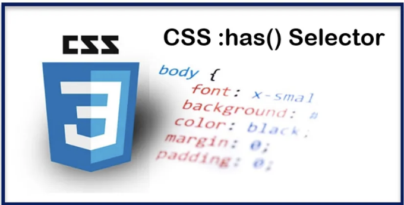
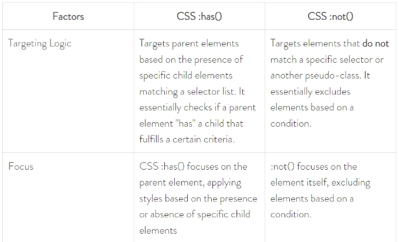
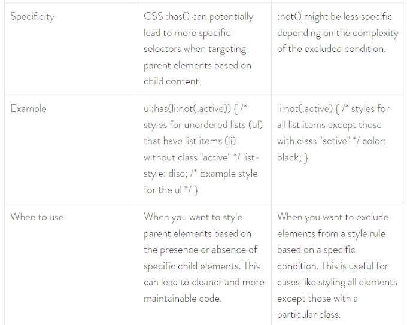

CSS는 지속적으로 발전하며, 개발자들이 더 효율적이고 시각적으로 놀라운 웹 경험을 만들 수 있도록 새로운 기능이 등장합니다. 그 중 하나인 최근에 추가된 CSS :has() 선택자는 자식 콘텐츠를 기반으로 요소를 대상으로 하는 데 큰 도움이 되는 혁신적인 기능입니다.



이 글에서는 CSS :has() 선택자의 기능, 장점 및 실용적인 응용에 대해 탐구합니다. 이 선택자가 스타일을 단순화하고 코드 유지 보수성을 향상시키며 동적 스타일의 가능성을 열어준다는 것을 배워보겠습니다.

# CSS :has() 선택자란 무엇인가요?

<!-- ui-log 수평형 -->
<ins class="adsbygoogle"
  style="display:block"
  data-ad-client="ca-pub-4877378276818686"
  data-ad-slot="9743150776"
  data-ad-format="auto"
  data-full-width-responsive="true"></ins>
<component is="script">
(adsbygoogle = window.adsbygoogle || []).push({});
</component>

CSS :has() 선택자는 CSS 선택자 레벨 4에 도입된 상대적으로 새로운 가상 클래스로, 특정 선택기와 일치하는 자식 요소의 존재에 따라 요소를 대상으로합니다.

2024년 3월 현재 브라우저 지원:

- 잘 지원됨: Chrome 및 Safari는 CSS :has()를 완전히 지원합니다.
- 진화 중인 지원: Firefox와 같은 다른 브라우저도 실험적인 플래그 지원을 통해 따라잡고 있습니다.

고려할 사항:

<!-- ui-log 수평형 -->
<ins class="adsbygoogle"
  style="display:block"
  data-ad-client="ca-pub-4877378276818686"
  data-ad-slot="9743150776"
  data-ad-format="auto"
  data-full-width-responsive="true"></ins>
<component is="script">
(adsbygoogle = window.adsbygoogle || []).push({});
</component>

- 새로운 기능: 확산되는 동안, :has()는 오래된 브라우저에서 폴리필이나 해결책이 필요할 수 있습니다.
- 성능: 복잡한 선택자를 사용한 CSS :has()의 강도가 높은 사용은 성능에 약간 영향을 미칠 수 있습니다.
- 가독성: 복잡한 :has() 문은 읽고 이해하기 어려울 수 있습니다.

# 구문

CSS :has() 선택자의 구문은 다음과 같습니다:

```js
.parent:has( .child-selector ) {
  /* 부모 요소에 대한 스타일 */
}
```

<!-- ui-log 수평형 -->
<ins class="adsbygoogle"
  style="display:block"
  data-ad-client="ca-pub-4877378276818686"
  data-ad-slot="9743150776"
  data-ad-format="auto"
  data-full-width-responsive="true"></ins>
<component is="script">
(adsbygoogle = window.adsbygoogle || []).push({});
</component>

이 코드에서:

- .parent: 이는 스타일을 적용하려는 부모 요소를 대상으로 하는 선택자입니다. 여기에는 ID나 클래스 이름과 같은 유효한 CSS 선택자를 사용할 수 있습니다.
- :has(.child-selector): 이는 .child-selector와 일치하는 자식 요소가 있는지 확인하는 가상 클래스입니다. 콜론 (:) 다음에 "has" 키워드가 옵니다. 그 뒤에는 자식 요소의 선택자를 포함하는 괄호가 나옵니다.

중괄호({ }) 안에 있는 스타일은 부모 요소가 .child-selector에 의해 지정된 조건을 충족하는 자식 요소를 가지고 있는 경우에만 적용됩니다.

참고:

<!-- ui-log 수평형 -->
<ins class="adsbygoogle"
  style="display:block"
  data-ad-client="ca-pub-4877378276818686"
  data-ad-slot="9743150776"
  data-ad-format="auto"
  data-full-width-responsive="true"></ins>
<component is="script">
(adsbygoogle = window.adsbygoogle || []).push({});
</component>

CSS :has()에서 여러 자식 요소를 대상으로하려면 쉼표로 구분하여 지정할 수 있습니다. CSS :has() 선택자의 가상 클래스는 태그 이름, 속성 선택자 또는 기타 유효한 선택자를 사용하여 요소를 대상으로할 수도 있습니다.

# 혜택 및 사용 사례

- 개선된 명시성: CSS :has()는 내용에 기반하여 요소를 대상으로 함으로써 더 깨끗하고 구체적인 CSS를 촉진합니다. 중첩된 선택자나 스타일링 목적으로 부모 요소에 불필요한 클래스를 부여하는 필요성을 줄입니다.
- 동적 스타일링: 동적 스타일의 가능성을 개방합니다. 적용된 스타일은 HTML의 실제 내용 구조에 따라 적응하고 변경할 수 있습니다.
- 결합 감소: 자식 콘텐츠를 기반으로 부모 스타일을 적용함으로써 스타일을 구체적인 HTML 구조에서 분리합니다. 재사용 가능한 구성 요소나 HTML 구조가 향후 변경될 수있는 상황에서 유용할 수 있습니다.

# 기능성:

<!-- ui-log 수평형 -->
<ins class="adsbygoogle"
  style="display:block"
  data-ad-client="ca-pub-4877378276818686"
  data-ad-slot="9743150776"
  data-ad-format="auto"
  data-full-width-responsive="true"></ins>
<component is="script">
(adsbygoogle = window.adsbygoogle || []).push({});
</component>

# 1. CSS의 자식 콘텐츠를 기반으로 하는 대상 선택 :has()

과거에는 CSS가 자식 콘텐츠를 기반으로 한 요소를 선택하는 방법이 제한적이었습니다. 여기서 새로운 CSS :has() 선택자가 게임을 바꾸는 방법을 소개합니다:

기존 방법:

중첩 선택자: 부모 요소 내에서 자식 요소를 선택하기 위해 선택자를 중첩하는 것이었습니다. 기능적이지만 복잡하고 유지보수가 어려울 수 있으며, 특히 깊게 중첩된 구조에 대해서는 더욱 어려워질 수 있습니다.

<!-- ui-log 수평형 -->
<ins class="adsbygoogle"
  style="display:block"
  data-ad-client="ca-pub-4877378276818686"
  data-ad-slot="9743150776"
  data-ad-format="auto"
  data-full-width-responsive="true"></ins>
<component is="script">
(adsbygoogle = window.adsbygoogle || []).push({});
</component>

```js
/* 클래스가 "content"인 섹션 내의 제목(h2) 선택 */ 
.content h2 
{ 
 /* 해당 섹션 내의 h2 제목에 대한 스타일 */ 
}
```

인접 형제 선택자 (~): 이는 특정 시나리오에서 사용할 수 있습니다. 즉, 즉시 형제의 콘텐츠를 기반으로 요소를 스타일링하려는 경우입니다. 그러나 이는 직접적인 형제만을 대상으로 하며 더 깊게 중첩된 요소는 대상으로 하지 않습니다.

```js
/* 이미지(img) 뒤에 따르는 단락(p) 선택 */ 
img ~ p 
{ 
 /* 이미지 뒤에 따르는 단락에 대한 스타일 */ 
}
```

CSS :has() 선택자가 등장하는 곳입니다. 이를 사용하면 특정 자식 요소들의 선택기 목록과 일치하는 부모 요소들을 대상으로 할 수 있습니다.

<!-- ui-log 수평형 -->
<ins class="adsbygoogle"
  style="display:block"
  data-ad-client="ca-pub-4877378276818686"
  data-ad-slot="9743150776"
  data-ad-format="auto"
  data-full-width-responsive="true"></ins>
<component is="script">
(adsbygoogle = window.adsbygoogle || []).push({});
</component>

Markdown 형식의 테이블(href 모드) 예제 :

```css
figure:has(figcaption) {
  /* 캡션(figcaption 자식 요소)이 있는 figure에 대한 스타일 */
  border: 1px solid #ddd;
  padding: 10px;
}

figure:not(:has(figcaption)) {
  /* 캡션이 없는 figure에 대한 스타일 */
  border: none;
}
```

이 예제에서 첫 번째 rule은 figcaption 선택자와 일치하는 자식 요소를 가진 모든 figure 요소를 대상으로 합니다. 이는 figure가 자식으로 `figcaption` 요소를 가지고 있을 때만 테두리와 여백으로 스타일이 지정됨을 의미합니다.

두 번째 rule은 CSS `:not(:has(figcaption))`를 사용하여 figcaption과 일치하는 자식 요소가 없는 figure를 대상으로 합니다. 이를 통해 캡션이 없는 figure를 다른 방식으로 스타일링할 수 있으며, 아마도 테두리를 완전히 제거할 수도 있습니다.

<!-- ui-log 수평형 -->
<ins class="adsbygoogle"
  style="display:block"
  data-ad-client="ca-pub-4877378276818686"
  data-ad-slot="9743150776"
  data-ad-format="auto"
  data-full-width-responsive="true"></ins>
<component is="script">
(adsbygoogle = window.adsbygoogle || []).push({});
</component>

자녀 콘텐츠를 대상으로 하는 장점:

- 향상된 명확성: CSS의 :has()를 사용하면 콘텐츠를 기반으로 한 요소를 대상으로하여 더 구체적인 CSS를 작성할 수 있습니다. 이는 복잡한 중첩 선택기(예: figure 안에 있는 figcaption 요소를 대상으로 하는 것)를 줄이고 스타일링 목적으로 부모 요소에 불필요한 클래스를 추가하는 것을 피할 수 있습니다.
- 깔끔한 코드: 자녀 콘텐츠를 기반으로 한 스타일 규칙을 분리함으로써 CSS가 유지하기 쉽고 이해하기 쉬운 코드가 됩니다.

## 2. 매개변수를 사용하는 기능 의사 클래스

CSS의 :has()는 가상 클래스의 성격을 가지고 있습니다. 일반 선택자가 직접 요소를 대상으로 하는 것과 달리, :has()는 기능적인 의사 클래스입니다. 이는 CSS 코드 내에서 함수처럼 작동하며 괄호 안의 선택자 목록을 취합니다. 이 목록은 부모가 가져야 할 자녀 요소를 지정합니다.

<!-- ui-log 수평형 -->
<ins class="adsbygoogle"
  style="display:block"
  data-ad-client="ca-pub-4877378276818686"
  data-ad-slot="9743150776"
  data-ad-format="auto"
  data-full-width-responsive="true"></ins>
<component is="script">
(adsbygoogle = window.adsbygoogle || []).push({});
</component>

구문:

```js
/* (.child-selector)과 일치하는 자식 요소를 가지고 있는 (.parent)을 대상으로 함 */
.parent:has(.child-selector) {
  /* 부모 요소에 대한 스타일 */
}
```

- .parent: 스타일을 적용하려는 부모 요소를 대상으로하는 선택기입니다. 클래스 이름이나 요소 태그와 같은 유효한 CSS 선택기가 될 수 있습니다.
- :has(.child-selector): 이것은 .child-selector과 일치하는 자식 요소를 확인하는 가상 클래스입니다. 콜론 (:)은 "has"라는 키워드 앞에 온 다음, 괄호 안에 자식 요소를 위한 선택기가 따릅니다.

다양한 자식 선택기를 사용한 예시:

<!-- ui-log 수평형 -->
<ins class="adsbygoogle"
  style="display:block"
  data-ad-client="ca-pub-4877378276818686"
  data-ad-slot="9743150776"
  data-ad-format="auto"
  data-full-width-responsive="true"></ins>
<component is="script">
(adsbygoogle = window.adsbygoogle || []).push({});
</component>

```js
/* "ul" 자식(순서 없는 목록)을 가진 네비게이션 타겟 */
nav:has(ul) {
  background-color: #eee;
}

/* "h2" 제목 자식을 가진 아티클 타겟 */
article:has(h2) {
  border-bottom: 1px solid #ccc;
}
```

이 예시에서, :has()는 괄호 안에 다른 자식 선택자를 받습니다. 클래스 이름, 엘리먼트 태그뿐만 아니라 쉼표를 사용하여 둘을 결합하는 것도 가능합니다.

기능 가상 클래스의 장점:

- 유연성: CSS :has() 내에서 선택자 목록을 지정하는 기능으로, 다양한 자식 콘텐츠 조건에 따라 부모 요소를 타겟팅하는 데 매우 유연성을 부여합니다.
- 동적 스타일링: 이는 HTML의 실제 콘텐츠 구조에 따라 적응하는 동적 스타일을 만들 수 있게 합니다.

<!-- ui-log 수평형 -->
<ins class="adsbygoogle"
  style="display:block"
  data-ad-client="ca-pub-4877378276818686"
  data-ad-slot="9743150776"
  data-ad-format="auto"
  data-full-width-responsive="true"></ins>
<component is="script">
(adsbygoogle = window.adsbygoogle || []).push({});
</component>

# CSS 의사 클래스 비교: CSS :has() vs :not()

CSS의 :has()와 :not()은 각각 고유한 기능을 제공하는 CSS의 기능적 가상 클래스입니다. 이들의 차이점과 비교 방법을 살펴보겠습니다:





<!-- ui-log 수평형 -->
<ins class="adsbygoogle"
  style="display:block"
  data-ad-client="ca-pub-4877378276818686"
  data-ad-slot="9743150776"
  data-ad-format="auto"
  data-full-width-responsive="true"></ins>
<component is="script">
(adsbygoogle = window.adsbygoogle || []).push({});
</component>

# CSS :has()을 사용할 때 주의할 점:

- 브라우저 지원: 앞서 언급했듯이 CSS :has()는 지속적으로 지원이 발전 중인 상대적으로 새로운 기능입니다. Chrome 및 Safari와 같은 주요 브라우저에서 지원하고 있지만, 다른 브라우저들은 오래된 버전에 대해 폴리필(polyfill)이나 우회 방법이 필요할 수 있습니다.
- 성능: CSS :has()는 일부 경우에 성능에 영향을 줄 수 있습니다. 특히 네스트된 선택자와 일반적으로 사용될 때 브라우저가 자식 요소를 확인해야 하므로 전통적인 선택자보다 약간 느릴 수 있습니다.
- 가독성: CSS :has()는 명확할 수 있지만, 네스트된 선택자가 복잡한 :has() 문이 다른 개발자들에게 이해하기 어려울 수 있습니다.

<!-- ui-log 수평형 -->
<ins class="adsbygoogle"
  style="display:block"
  data-ad-client="ca-pub-4877378276818686"
  data-ad-slot="9743150776"
  data-ad-format="auto"
  data-full-width-responsive="true"></ins>
<component is="script">
(adsbygoogle = window.adsbygoogle || []).push({});
</component>

## 여기 몇 가지 추가적으로 고려해야 할 사항이 있습니다:

- 대안: 구체적인 상황에 따라 기존 선택기나 전처리 도구(예: SASS)를 사용하여 CSS :has() 선택기에 의존하지 않고 비슷한 결과를 얻을 수 있는 대안 솔루션이 있을 수 있습니다.
- 점진적 향상: 모던 브라우저에서 CSS :has()를 전략적으로 활용할 수 있으며, 이전 브라우저를 위해 대체 스타일을 포함하여 플랫폼 간의 좋은 사용자 경험을 보장할 수 있습니다.

# 결론

CSS :has() 선택기를 통해 콘텐츠에 따라 요소를 스타일링할 수 있습니다. 마치 더 깨끗하고 유연한 스타일을 위한 슈퍼파워를 가진 것처럼! 따라서 내부에 있는 내용에 따라 부모 요소를 대상으로 지정할 수 있으며, 복잡한 중첩된 선택기를 버릴 수 있습니다.