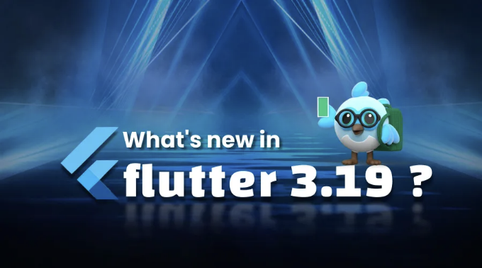
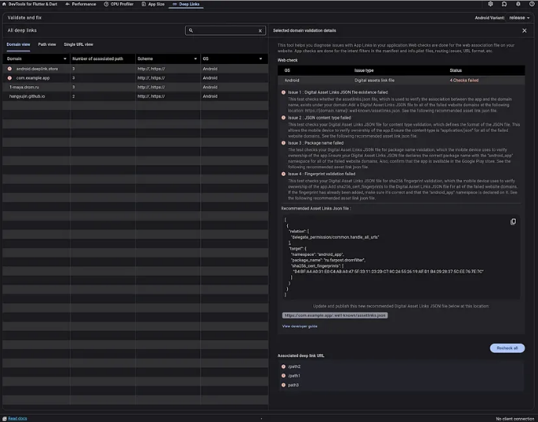
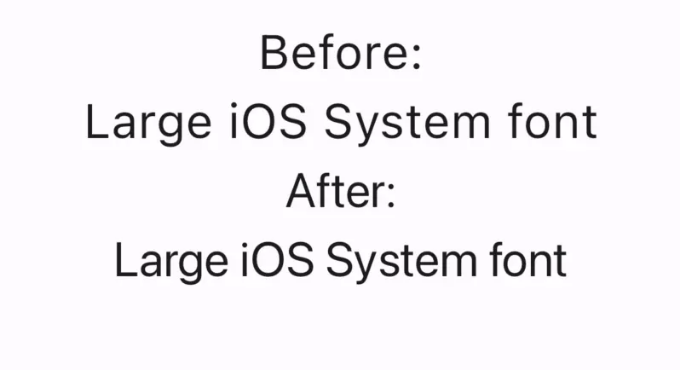
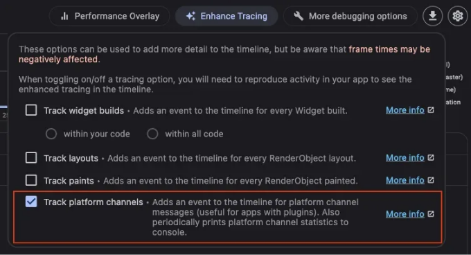

# 플러터 3.19의 흥미로운 기능 탐색: AI 통합부터 향상된 DevTools까지

방대한 개선 및 기능을 제공하는 Google의 다목적 UI 툴킷인 플러터 3.19이 출시되었습니다. 앱 개발 경험을 높이기 위해 설계된 기능들을 살펴보세요. 

Gemini Google AI Dart SDK를 통한 AI 통합

<!-- ui-log 수평형 -->
<ins class="adsbygoogle"
  style="display:block"
  data-ad-client="ca-pub-4877378276818686"
  data-ad-slot="9743150776"
  data-ad-format="auto"
  data-full-width-responsive="true"></ins>
<component is="script">
(adsbygoogle = window.adsbygoogle || []).push({});
</component>

Flutter 3.19의 가장 혁신적인 기능 중 하나는 Gemini Google AI Dart SDK를 통해 고급 생성 AI 기능을 통합한 것입니다. 이 베타 릴리스를 통해 개발자들은 Dart 및 Flutter 애플리케이션에 최첨단 AI 기능을 직접 통합할 수 있습니다. 텍스트 생성 및 요약부터 챗봇, 번역 및 질문 응답까지 많은 가능성이 열립니다.

그러나 이 베타 릴리스의 현재 제한 사항을 주의해야 합니다:

1. SDK는 현재 베타 버전이며 Google AI Studio 또는 Vertex AI를 통해 액세스해야 합니다.

2. 일부 기능은 아직 개발 중이며 향후 변경되거나 제거될 수 있습니다.

<!-- ui-log 수평형 -->
<ins class="adsbygoogle"
  style="display:block"
  data-ad-client="ca-pub-4877378276818686"
  data-ad-slot="9743150776"
  data-ad-format="auto"
  data-full-width-responsive="true"></ins>
<component is="script">
(adsbygoogle = window.adsbygoogle || []).push({});
</component>

3. SDK는 사용량 할당량 및 사용 가능한 기능에 제한이 있을 수 있습니다.

프레임워크:

스크롤링 향상:

많은 Flutter 애플리케이션에서 스크롤링이 핵심 요소입니다. Flutter 3.19에서는 이 영역에서 중요한 개선 사항이 소개되었습니다. 개발자들은 이제 MultiTouchDragStrategy.latestPointer로 ScrollBehavior를 구성할 수 있어, 사용된 손가락의 개수에 관계없이 매끈하고 일관된 스크롤 경험을 제공할 수 있습니다. 게다가 SingleChildScrollView와 ReorderableList에 대한 버그 수정이 상호작용을 더 매끈하게 만들고 안정성을 향상시킵니다. two_dimensional_scrollables 패키지의 TableView 위젯도 세련되고 업그레이드되어 스크롤링 경험을 더욱 향상시킵니다.

<!-- ui-log 수평형 -->
<ins class="adsbygoogle"
  style="display:block"
  data-ad-client="ca-pub-4877378276818686"
  data-ad-slot="9743150776"
  data-ad-format="auto"
  data-full-width-responsive="true"></ins>
<component is="script">
(adsbygoogle = window.adsbygoogle || []).push({});
</component>

애니메이션 개선사항:

애니메이션은 Flutter 앱의 시각적 매력과 사용자 경험을 향상시키는 데 중요한 역할을 합니다. 새 AnimationStyle 위젯의 도입으로, 개발자들은 MaterialApp, ExpansionTile 및 PopupMenuButton과 같은 위젯에서 애니메이션 동작에 대한 더 큰 제어를 얻을 수 있습니다. 이를 통해 애니메이션 곡선 및 지속 시간을 재정의하여 더 매력적이고 세련된 앱 경험을 만들 수 있게 되었습니다.

세그먼트 버튼:

SegmentedButton 위젯의 추가로 스타일 공유 및 테마 구성이 간단해져서 일관된 모양과 느낌을 앱 전체에 유지하기 쉬워졌습니다. styleFrom 메서드를 사용하면, 개발자들은 여러 SegmentedButton 위젯 간에 공유할 수 있는 ButtonStyle을 쉽게 만들거나 전체 앱의 SegmentedButtonTheme을 구성하는 데 사용할 수 있습니다.

<!-- ui-log 수평형 -->
<ins class="adsbygoogle"
  style="display:block"
  data-ad-client="ca-pub-4877378276818686"
  data-ad-slot="9743150776"
  data-ad-format="auto"
  data-full-width-responsive="true"></ins>
<component is="script">
(adsbygoogle = window.adsbygoogle || []).push({});
</component>

적응형 스위치:

적응형 스위치는 macOS와 iOS 플랫폼에서 자연스럽고 익숙한 사용자 경험을 제공하며, 다른 플랫폼에서는 Material Design의 미학으로 우아하게 전환됩니다. 이를 통해 다른 기기에서도 익숙하고 직관적인 경험을 제공하면서 플랫폼에 독립적인 API로 개발을 간소화합니다.

텍스트 위젯 상태에 대한 엑세스 증대:

Flutter 3.19에서는 TextField와 TextFormField에서 MaterialStatesController를 지원하여 개발자가 MaterialState 변경을 감지할 수 있습니다. 이 향상된 기능은 텍스트 위젯의 상태에 대한 더 큰 유연성과 제어를 제공하여 개발자가 반응형이고 동적인 사용자 인터페이스를 작성할 수 있도록 도와줍니다.

<!-- ui-log 수평형 -->
<ins class="adsbygoogle"
  style="display:block"
  data-ad-client="ca-pub-4877378276818686"
  data-ad-slot="9743150776"
  data-ad-format="auto"
  data-full-width-responsive="true"></ins>
<component is="script">
(adsbygoogle = window.adsbygoogle || []).push({});
</component>

# 되돌림 기록 스택:

Flutter 3.19은 UndoHistory 위젯에서 경험한 불편을 해결하여 더욱 신뢰할 수 있고 유연하게 만들었습니다. 이러한 개선 사항으로 인해 개발자들은 일본어 키보드로 전환하는 등의 시나리오에서도 되돌리기/다시 실행 기록이 유지됨을 확신할 수 있습니다.

# 엔진:

프로펠러 진행 상황:

<!-- ui-log 수평형 -->
<ins class="adsbygoogle"
  style="display:block"
  data-ad-client="ca-pub-4877378276818686"
  data-ad-slot="9743150776"
  data-ad-format="auto"
  data-full-width-responsive="true"></ins>
<component is="script">
(adsbygoogle = window.adsbygoogle || []).push({});
</component>

플러터 3.19는 인펠러의 고성능 렌더링 엔진을 안드로이드 기기 전체에 통합하여 놀라운 새로운 이정표를 알리고 있습니다. 이는 다양한 폰과 태블릿에서 플러터 앱의 시각적 경험이 더욱 부드러워지고 성능이 향상될 수 있음을 의미합니다. 게다가 인펠러가 Vulkan 및 OpenGL 양쪽에서 MSAA 및 기타 기능을 지원함으로써 OpenGL 백엔드를 Vulkan과 동등하게 만들어 다양한 기기 설정에 걸쳐 보다 넓은 호환성을 보장합니다. 지속적인 개선을 위해 개발자들에게는 인펠러를 더 발전시킬 수 있도록 피드백을 제공하고 만난 문제 등을 보고해 주실 것을 권장합니다. 그때까지 디바이스 세부 정보, 안드로이드 버전 및 성능 비교 등을 포함하여 문제를 보고해 주십시오.

API 개선 사항:

플러터 3.19에서 텍스트 정밀도가 크게 향상되어 개발자들이 텍스트 조작 및 분석에 더 깊이 파고들 수 있는 새로운 도구를 얻게 되었습니다. getClosestGlyphInfoForOffset 및 getGlyphInfoAt과 GlyphInfo 유형의 도입을 통해 문단 내 특정 지점에 가장 가까운 글리프 정보를 확인하거나 특정 인덱스의 글리프에 대한 자세한 정보를 얻는 등 텍스트에 대한 통제력과 이해력을 전례 없이 제공합니다. 문단 내 특정 지점에 가장 가까운 글리프 정보를 확인하거나 특정 인덱스의 글리프에 대한 자세한 정보를 얻는 등 텍스트에 대한 통제력과 이해력을 전례 없이 제공합니다. 개발자들이 더 정제되고 몰입적인 텍스트 경험을 만들 수 있도록 필요한 도구를 제공하는 것에 있어 이러한 증가 사항은 매우 중요합니다.

안드로이드:

<!-- ui-log 수평형 -->
<ins class="adsbygoogle"
  style="display:block"
  data-ad-client="ca-pub-4877378276818686"
  data-ad-slot="9743150776"
  data-ad-format="auto"
  data-full-width-responsive="true"></ins>
<component is="script">
(adsbygoogle = window.adsbygoogle || []).push({});
</component>

Flutter 3.19를 사용하여 딥 링크 복잡성을 간단하게 해보세요!

딥 링크의 복잡성에 시달리기 지친 적이 있나요? Flutter 3.19로 이러한 머리 아픔을 이제 고민하지 마세요! 이 최신 업데이트에서는 Flutter deeplink validator를 소개하면서 딥 링크 관련 도전 과제에 대한 간소화된 솔루션을 제공합니다. 여기에는 무엇을 기대할 수 있는지 알아보세요:

Deeplinking Web Validator:

Flutter 3.19에서는 Flutter deeplink validator의 초기 버전이 소개되었습니다. 이 기능은 딥 링크 구현을 간단하게 할 수 있도록 설계되었으며, 이 기능을 사용하여 DevTools 내에서 assetlinks.json 파일 설정을 직접 검증할 수 있어 사용자들에게 원활한 통합 및 쉬운 탐색을 제공할 수 있습니다.

<!-- ui-log 수평형 -->
<ins class="adsbygoogle"
  style="display:block"
  data-ad-client="ca-pub-4877378276818686"
  data-ad-slot="9743150776"
  data-ad-format="auto"
  data-full-width-responsive="true"></ins>
<component is="script">
(adsbygoogle = window.adsbygoogle || []).push({});
</component>

명확한 안내:

추측 작업을 이제 그만두세요! 딥링크 유효성 검사 도구가 잠재적인 문제에 대한 명확한 안내와 즉각적인 피드백을 제공하며 유용한 구현 팁도 제공합니다. 이를 통해 더욱 원활하고 효율적인 딥링킹 프로세스를 보장하여 사용자 경험에 집중할 수 있게 해줍니다.

향후 지원:

<!-- ui-log 수평형 -->
<ins class="adsbygoogle"
  style="display:block"
  data-ad-client="ca-pub-4877378276818686"
  data-ad-slot="9743150776"
  data-ad-format="auto"
  data-full-width-responsive="true"></ins>
<component is="script">
(adsbygoogle = window.adsbygoogle || []).push({});
</component>

현재 웹 확인은 안드로이드에서 가능하지만, 향후 iOS 지원 및 추가 기능을 기대해 주세요. 이로써 모든 플랫폼에서 딥 링킹이 더욱 접근성이 높고 사용자 친화적으로 만들어질 것입니다.

오늘 Flutter 3.19로 업그레이드하여, 이전보다 쉽게 딥 링킹을 구현해 보세요!

share.invoke를 통한 향상된 공유 기능

딥 링킹을 단순화하는 것뿐만 아니라, Flutter 3.19는 공유 버튼에 기다렸던 패러티를 제공하며, 안드로이드 텍스트 필드 및 뷰 전반에서 공유 기능을 향상시켰습니다. 이제 사용자는 앱에서 콘텐츠를 누르기만 하면 쉽게 공유할 수 있어 더 많은 상호작용과 참여를 유발할 수 있습니다.

<!-- ui-log 수평형 -->
<ins class="adsbygoogle"
  style="display:block"
  data-ad-client="ca-pub-4877378276818686"
  data-ad-slot="9743150776"
  data-ad-format="auto"
  data-full-width-responsive="true"></ins>
<component is="script">
(adsbygoogle = window.adsbygoogle || []).push({});
</component>

네이티브 에셋 기능 소개

Flutter 3.19에서 안드로이드에 네이티브 에셋 지원이 추가되었습니다. 개발자들에게 무한한 가능성을 제공합니다. 이 기능을 사용하면 플러터 코드 내에서 다른 언어에서 함수를 직접 호출할 수 있어 혁신과 최적화를 위한 새로운 길이 열립니다.

기존 네이티브 라이브러리 활용:

기존의 C/C++ 라이브러리를 손쉽게 플러터 앱에 통합하여 기능과 능력을 활용할 수 있으며 성능이나 효율성을 희생하지 않습니다.

<!-- ui-log 수평형 -->
<ins class="adsbygoogle"
  style="display:block"
  data-ad-client="ca-pub-4877378276818686"
  data-ad-slot="9743150776"
  data-ad-format="auto"
  data-full-width-responsive="true"></ins>
<component is="script">
(adsbygoogle = window.adsbygoogle || []).push({});
</component>

성능 최적화:

네이티브 코드를 사용하여 계산 집중적 작업에 활용하면 상당한 성능 향상을 이뤄낼 수 있어 앱의 전체 사용자 경험을 향상시킬 수 있습니다.

플랫폼별 기능:

Flutter에서 직접적으로 사용할 수 없는 기기별 기능과 기능을 활용하여 기본 플랫폼의 전체 잠재력에 접근하여 사용자에게 맞춤형 경험을 제공할 수 있습니다.

<!-- ui-log 수평형 -->
<ins class="adsbygoogle"
  style="display:block"
  data-ad-client="ca-pub-4877378276818686"
  data-ad-slot="9743150776"
  data-ad-format="auto"
  data-full-width-responsive="true"></ins>
<component is="script">
(adsbygoogle = window.adsbygoogle || []).push({});
</component>

IOS:

플러터 iOS 네이티브 글꼴:

플러터 3.19에서 텍스트가 이제 iOS에서 더 네이티브하게 나타나며, 원활하고 일관된 사용자 경험을 제공합니다. 이 업데이트에는 다음과 같은 개선 사항이 포함되어 있습니다:

더 작은 글꼴: 약간 더 조밀한 간격을 누리며, 휴대전화 화면의 가독성을 향상시키고 텍스트가 명확하고 가독성이 뛰어남을 보장합니다.

<!-- ui-log 수평형 -->
<ins class="adsbygoogle"
  style="display:block"
  data-ad-client="ca-pub-4877378276818686"
  data-ad-slot="9743150776"
  data-ad-format="auto"
  data-full-width-responsive="true"></ins>
<component is="script">
(adsbygoogle = window.adsbygoogle || []).push({});
</component>

더 큰 글꼴 : 더 조밀한 디자인을 경험하고 소중한 공간을 절약하며 앱 인터페이스의 전체적인 시각적 흐름을 향상시킬 수 있습니다.

DevTools : 강력한 새로운 기능들을 발표합니다.

<!-- ui-log 수평형 -->
<ins class="adsbygoogle"
  style="display:block"
  data-ad-client="ca-pub-4877378276818686"
  data-ad-slot="9743150776"
  data-ad-format="auto"
  data-full-width-responsive="true"></ins>
<component is="script">
(adsbygoogle = window.adsbygoogle || []).push({});
</component>

플러터 DevTools 3.19은 개발 프로세스를 간소화하고 앱 성능을 향상시키는 강력한 기능을 소개합니다:

Deep-link 유효성 검사: 새로운 유효성 검사 도구를 사용하여 Android에서 심층 링킹을 원활하게 확인할 수 있습니다. 이 도구를 통해 assetlinks.json 파일 설정을 DevTools 내에서 직접 확인할 수 있습니다.

플러그인 추적: 플랫폼 채널 활동 추적을 통해 앱 성능을 보다 깊이 파악하여 플러그인 사용과 앱 성능에 미치는 영향에 대한 중요한 통찰을 얻을 수 있습니다.

오프라인 분석: 연결된 앱이 없어도 저장된 성능 데이터와 CPU 프로필을 분석하여 병목 현상을 식별하고 편안한 환경에서 앱 성능을 최적화할 수 있습니다.

<!-- ui-log 수평형 -->
<ins class="adsbygoogle"
  style="display:block"
  data-ad-client="ca-pub-4877378276818686"
  data-ad-slot="9743150776"
  data-ad-format="auto"
  data-full-width-responsive="true"></ins>
<component is="script">
(adsbygoogle = window.adsbygoogle || []).push({});
</component>

VS Code 향상: VS Code를 통해 향상된 개발 경험을 누려보세요. 새로운 플랫폼을 활용하고 VS Code 환경에서 개발 도구를 외부 브라우저 창에서 직접 열 수 있습니다.

각 Flutter 릴리스마다 혁신을 추구하는 동안, 우리는 여러분의 비전을 현실로 만들기 위해 약속합니다. 여러분의 앱의 잠재력이 무시되지 않게 하고, 여러분의 꿈이 모아 있는 앱을 만들어보세요! 시작하고 싶으시다면 지금 저희에게 연락하세요!