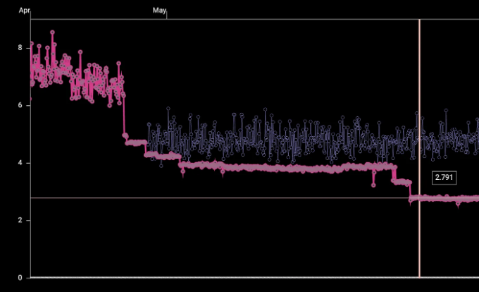
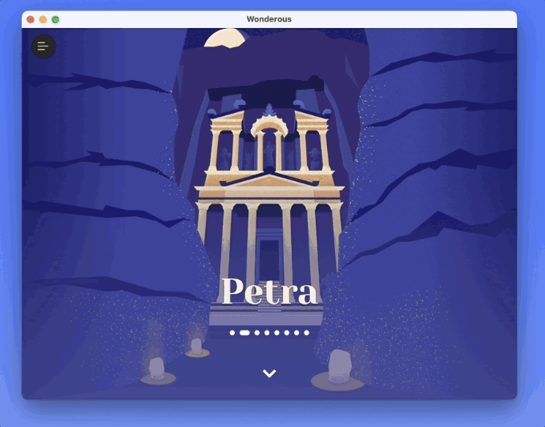
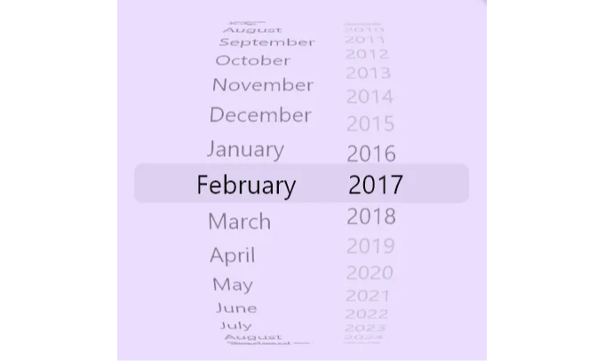
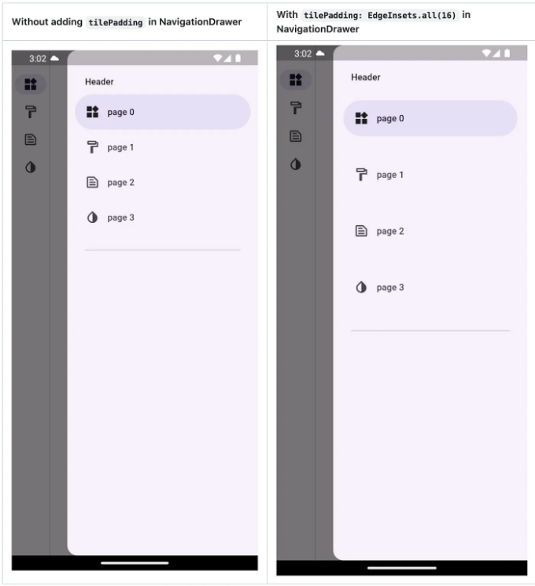
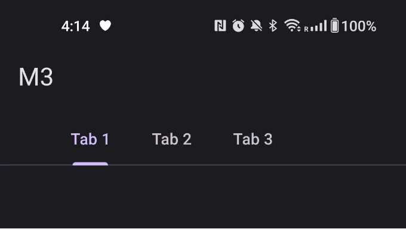
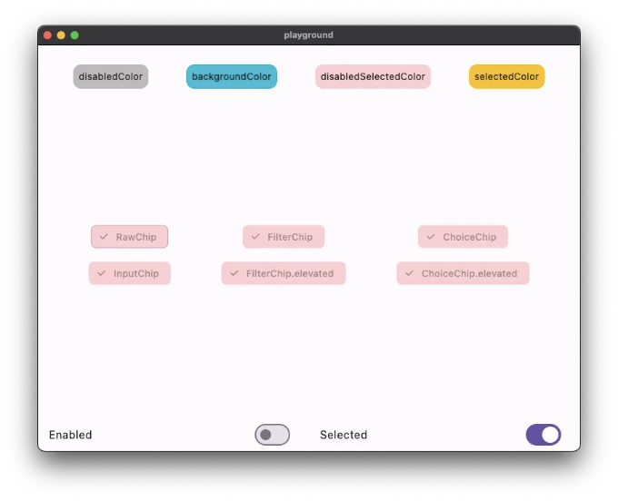
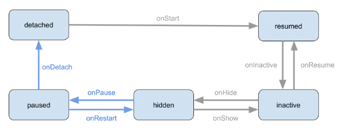
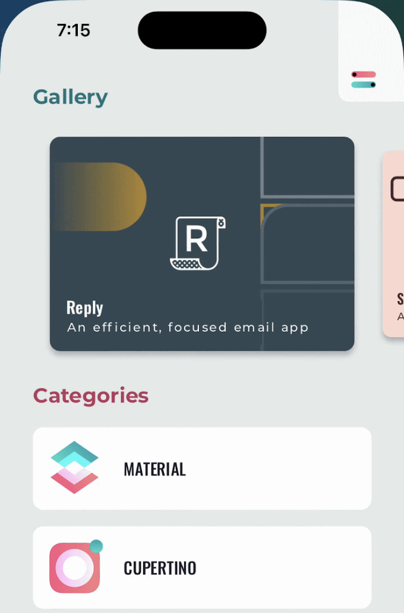
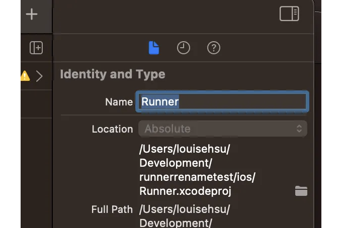

안녕하세요! 우리의 분기별 플러터 안정 버전에 다시 오신 것을 환영합니다. 이번에는 플러터 3.13을 소개합니다! 지난 릴리스 이후 단 3개월 동안 724개의 풀 리퀘스트가 병합되었고, 55명의 커뮤니티 회원이 플러터에 대한 첫 번째 커밋을 작성했습니다!

이번 최신 릴리스에 기여한 플러터 커뮤니티의 새로운 추가 및 개선 사항을 알아보려면 계속 읽어주세요!

# 엔진

우리는 새로운 그래픽 렌더러 인 Impeller에 여러 가지 개선 사항을 적용했으며, 접이식 기기용 새로운 엔진 API도 추가했습니다.

<!-- ui-log 수평형 -->
<ins class="adsbygoogle"
  style="display:block"
  data-ad-client="ca-pub-4877378276818686"
  data-ad-slot="9743150776"
  data-ad-format="auto"
  data-full-width-responsive="true"></ins>
<component is="script">
(adsbygoogle = window.adsbygoogle || []).push({});
</component>

# 이뎀퍼

## iOS 성능 개선 사항

플러터 사용자들의 높은 품질 피드백 덕분에, 이번 릴리스에서는 iOS에서 이뎀퍼의 성능을 계속해서 개선하였습니다. 다양한 최적화 작업들을 거친 결과로, iOS의 이뎀퍼 렌더러는 이제 셰이더 컴파일레이션 문제를 완전히 제거함으로써 레이턴시를 줄이는 것 뿐만 아니라, 일부 벤치마크에서는 평균 처리량도 더 높아졌습니다. 특히, flutter/gallery 전환 성능 벤치마크에서, 평균 프레임 레스터화 시간이 Skia 시대보다 절반 정도로 단축되었습니다.

<!-- ui-log 수평형 -->
<ins class="adsbygoogle"
  style="display:block"
  data-ad-client="ca-pub-4877378276818686"
  data-ad-slot="9743150776"
  data-ad-format="auto"
  data-full-width-responsive="true"></ins>
<component is="script">
(adsbygoogle = window.adsbygoogle || []).push({});
</component>

플러터 갤러리 전환 성능 벤치마크에서 아이폰 11의 평균 프레임 레스터화 시간을 개선했습니다. 이 기간은 대략 3.10 브랜치 절단부터 3.13 브랜치 절단까지의 시간을 다룹니다.

이 발전은 이와 다른 최적화 노력들 덕분에 이루어졌는데요:

- 더러운 영역 관리 및 부분 재그리기 기능을 활성화했습니다 (flutter/engine#40959)
- 병행 렌더 패스 인코딩을 구현했습니다 (flutter/engine#42028)
- 텍스트 렌더링에 대한 다수의 개선사항을 적용했습니다 (flutter/engine#41290, flutter/engine#41780, flutter/engine#42417)
- 비용이 많이 드는 테셀레이션 작업을 피하기 위해 볼록 형태의 빠른 경로를 추가했습니다 (flutter/engine#41834)
- 일부 작업에 compute 쉐이더를 사용하기 시작했습니다 (flutter/engine#42192)
- 범위를 벗어난 그리기 작업들의 적극적인 가시화를 시작했습니다 (flutter/engine#41606)

## 충실도 개선사항

<!-- ui-log 수평형 -->
<ins class="adsbygoogle"
  style="display:block"
  data-ad-client="ca-pub-4877378276818686"
  data-ad-slot="9743150776"
  data-ad-format="auto"
  data-full-width-responsive="true"></ins>
<component is="script">
(adsbygoogle = window.adsbygoogle || []).push({});
</component>

3.10 버전에서는 Impeller를 사용할 때 wide gamut colors을 사용할 수 있는 flag가 있음을 알렸습니다. 사용자들의 의견을 듣고 반영한 후, iOS에서 Impeller를 사용할 때 wide gamut colors가 이제 기본값으로 설정되었습니다.

## Android에서 Impeller의 진행 상황 업데이트

저희는 Impeller의 Vulkan 백엔드에 대한 진전을 계속하고 있지만, 아직 공식 미리보기 기간을 유용하게 활용할 수 있는 품질 수준에 도달하지는 못했습니다. Android에서 Impeller의 첫 사용 경험이 높은 품질을 갖추도록 하기를 원하며, 아직 그 수준에 도달하지 못했습니다. 올해 나중에 안정된 릴리스에서 Android에서 Impeller의 미리보기 기간에 들어갈 것을 희망합니다. Android에서 Impeller는 아직 미리보기에 준비가 되지 않았지만, 지난 일년 동안 Impeller의 HAL에 만든 백엔드에 대한 타겟팅되지 않은 최적화로 OpenGL 및 Vulkan 백엔드가 flutter/gallery 전환 성능 벤치마킹에서 Android의 평균 프레임 래스터화 시간도 크게 개선되었습니다. Android의 미리보기가 높은 품질로 이뤄지도록 현재 추가적으로 개선 작업이 진행 중에 있습니다.

<!-- ui-log 수평형 -->
<ins class="adsbygoogle"
  style="display:block"
  data-ad-client="ca-pub-4877378276818686"
  data-ad-slot="9743150776"
  data-ad-format="auto"
  data-full-width-responsive="true"></ins>
<component is="script">
(adsbygoogle = window.adsbygoogle || []).push({});
</component>

다시 한 번, 커뮤니티에서의 기여로 우리의 진전이 크게 가속화되었습니다. 특히 GitHub 사용자 ColdPaleLight가 여러 Impeller 관련 패치를 생성하여 정밀도와 성능을 향상시키고 원뿔 그라데이션 지원을 추가하는 데 큰 도움을 주었습니다.

계속해서 GitHub의 Impeller 프로젝트 대시보드를 통해 우리의 진전을 따라주시기 바랍니다. 모든 피드백을 감사히 받고 사용자들이 정밀도와 성능 문제를 계속해서 이슈 트래커에 제기하도록 장려합니다.

## macOS에서 Impeller (및 Wonderous)

지난 안정적인 릴리스에서 우리는 렌더링 엔진의 재작성인 Impeller를 iOS에 기본으로 활성화할 것이라고 발표했습니다. 그 이후로, 고객들로부터 훌륭한 피드백을 받았습니다. 이제 우리는 macOS용 Impeller를 미리보기로 제공하게 되어 기쁩니다. Impeller 페이지의 안내에 따라 앱에서 Impeller를 테스트하고 활성화할 수 있습니다.

<!-- ui-log 수평형 -->
<ins class="adsbygoogle"
  style="display:block"
  data-ad-client="ca-pub-4877378276818686"
  data-ad-slot="9743150776"
  data-ad-format="auto"
  data-full-width-responsive="true"></ins>
<component is="script">
(adsbygoogle = window.adsbygoogle || []).push({});
</component>

위의 내용을 친근한 톤으로 한국어로 번역해드리겠습니다.

우리는 여러분이 이를 테스트하고 피드백을 제공하는 것을 간절히 기다리고 있습니다. macOS용 Impeller를 개선하는 가장 좋은 방법은 SkSL 워링업 없이 여러분의 macOS 앱을 실행하여 jank(지연 현상) 인스턴스를 찾기 위해 DevTools를 사용하여 베이스라인 메트릭을 수립하는 것입니다. 다음으로 Impeller를 사용하여 앱을 테스트해보세요 — 버그, 성능 개선 또는 성능 저하를 확인하기 위해 클릭해보고 확인해보세요. 문제가 발견된 경우 GitHub에 보고하는 것을 권장합니다. 실행 중인 디바이스 정보, 비디오 녹화 및 성능 추적 내보내기를 포함시키는 것이 중요합니다.

macOS에서 Impeller를 시도해 보고 싶으신가요? Mac App Store에서 Wonderous를 설치해보세요!

# 새 엔진 API

<!-- ui-log 수평형 -->
<ins class="adsbygoogle"
  style="display:block"
  data-ad-client="ca-pub-4877378276818686"
  data-ad-slot="9743150776"
  data-ad-format="auto"
  data-full-width-responsive="true"></ins>
<component is="script">
(adsbygoogle = window.adsbygoogle || []).push({});
</component>

## 향상된 접힐 수 있는 기기 지원

더 나은 접힐 수 있는 기기 지원을 위해, 디스플레이의 다양한 속성을 검색하기 위한 새로운 API가 추가되었습니다. 새로운 getter인 FlutterView.display는 Display 객체를 반환합니다. Display 객체는 디스플레이의 실제 크기, 장치의 픽셀 비율 및 화면 주사율을 보고합니다. 이 새로운 API를 사용하는 예시인 setPreferredOrientations를 확인해보세요.

# 프레임워크

# 머티리얼

<!-- ui-log 수평형 -->
<ins class="adsbygoogle"
  style="display:block"
  data-ad-client="ca-pub-4877378276818686"
  data-ad-slot="9743150776"
  data-ad-format="auto"
  data-full-width-responsive="true"></ins>
<component is="script">
(adsbygoogle = window.adsbygoogle || []).push({});
</component>

Material Framework를 개선하여 1) 더 많은 플랫폼 호환성을 제공하고, 2) 더 많은 사용자 정의가 가능하도록 하며, 3) 새로운 기능을 추가했습니다.

## TextField에서 문자 인식

iOS에서 TextField를 사용할 때 사용자는 기기 카메라를 사용하여 문자를 인식하고 필드에 삽입할 수 있는 옵션을 자동으로 볼 수 있습니다.

<!-- ui-log 수평형 -->
<ins class="adsbygoogle"
  style="display:block"
  data-ad-client="ca-pub-4877378276818686"
  data-ad-slot="9743150776"
  data-ad-format="auto"
  data-full-width-responsive="true"></ins>
<component is="script">
(adsbygoogle = window.adsbygoogle || []).push({});
</component>

커뮤니티 멤버 luckysmg(작성자)와 tgucio(검토자)의 기여 없이는 이 기능이 가능하지 않았을 것입니다. 엔진과 프레임워크를 연결하는 데 1000줄과 70개의 커밋이 투입된 이 기능에 감사드립니다! 감사합니다!

## 플랫폼 적응형 대화 상자

AlertDialog에 적응형 생성자가 추가되었으며 현재 플랫폼에 따라 Material 또는 Cupertino 대화 상자를 표시하기 위한 adaptive 함수 showAdaptiveDialog도 추가되었습니다.

이제 AlertDialog.adaptive()를 사용하면 iOS에서는 CupertinoAlertDialog 위젯을 사용합니다:

<!-- ui-log 수평형 -->
<ins class="adsbygoogle"
  style="display:block"
  data-ad-client="ca-pub-4877378276818686"
  data-ad-slot="9743150776"
  data-ad-format="auto"
  data-full-width-responsive="true"></ins>
<component is="script">
(adsbygoogle = window.adsbygoogle || []).push({});
</component>

안녕하세요! 안드로이드에서 Material AlertDialog을 소개합니다.

## 월과 년을 함께 보여주는 CupertinoDatePicker

<!-- ui-log 수평형 -->
<ins class="adsbygoogle"
  style="display:block"
  data-ad-client="ca-pub-4877378276818686"
  data-ad-slot="9743150776"
  data-ad-format="auto"
  data-full-width-responsive="true"></ins>
<component is="script">
(adsbygoogle = window.adsbygoogle || []).push({});
</component>

쿠퍼티노 데이트피커에 monthYear 모드를 추가했습니다.

## Cupertino (iOS 스타일) 체크 스타일 라디오

CupertinoRadio에 useCheckmarkStyle 속성이 추가되었습니다. 이는 Radio.adaptive 및 RadioListTile.adaptive 위젯이 iOS에서 체크마크 스타일을 사용하는지를 제어할 수 있도록 합니다.

<!-- ui-log 수평형 -->
<ins class="adsbygoogle"
  style="display:block"
  data-ad-client="ca-pub-4877378276818686"
  data-ad-slot="9743150776"
  data-ad-format="auto"
  data-full-width-responsive="true"></ins>
<component is="script">
(adsbygoogle = window.adsbygoogle || []).push({});
</component>

## Material 위젯을 더 많이 사용자 정의할 수 있는 옵션

Material 위젯의 디자인을 쉽게 사용자 정의할 수 있도록 여러 개의 개선 사항이 있습니다:

- 이제 입력란을 위한 오류 위젯을 사용자 지정하기 위해 문자열 대신 error 속성을 사용할 수 있습니다:

<!-- ui-log 수평형 -->
<ins class="adsbygoogle"
  style="display:block"
  data-ad-client="ca-pub-4877378276818686"
  data-ad-slot="9743150776"
  data-ad-format="auto"
  data-full-width-responsive="true"></ins>
<component is="script">
(adsbygoogle = window.adsbygoogle || []).push({});
</component>

- 이제 ButtonSegment에 툴팁을 추가할 수 있습니다:

- materialGapSize 속성을 사용하여 ExpansionPanelList의 간격을 사용자 정의할 수 있습니다.

<!-- ui-log 수평형 -->
<ins class="adsbygoogle"
  style="display:block"
  data-ad-client="ca-pub-4877378276818686"
  data-ad-slot="9743150776"
  data-ad-format="auto"
  data-full-width-responsive="true"></ins>
<component is="script">
(adsbygoogle = window.adsbygoogle || []).push({});
</component>

- 이제 Switch의 trackOutlineWidth를 사용자 정의할 수 있습니다.

- NavigationDrawer에서 tilePadding 속성을 사용하여 패딩을 사용자 정의할 수 있습니다.

<!-- ui-log 수평형 -->
<ins class="adsbygoogle"
  style="display:block"
  data-ad-client="ca-pub-4877378276818686"
  data-ad-slot="9743150776"
  data-ad-format="auto"
  data-full-width-responsive="true"></ins>
<component is="script">
(adsbygoogle = window.adsbygoogle || []).push({});
</component>

- TabBar에 대한 정렬을 선택하는 데 alignment 속성을 사용할 수 있습니다.

## MaterialState chips의 색

<!-- ui-log 수평형 -->
<ins class="adsbygoogle"
  style="display:block"
  data-ad-client="ca-pub-4877378276818686"
  data-ad-slot="9743150776"
  data-ad-format="auto"
  data-full-width-responsive="true"></ins>
<component is="script">
(adsbygoogle = window.adsbygoogle || []).push({});
</component>

다양한 상태의 칩의 색상을 사용자 정의할 수 있게 해줍니다.

## 돋보이는 칩

FilterChip.elevated, ChoiceChip.elevated, 그리고 ActionChip.elevated 변형이 추가되어 Material 3 사양에 따라 새롭게 추가되었습니다.

<!-- ui-log 수평형 -->
<ins class="adsbygoogle"
  style="display:block"
  data-ad-client="ca-pub-4877378276818686"
  data-ad-slot="9743150776"
  data-ad-format="auto"
  data-full-width-responsive="true"></ins>
<component is="script">
(adsbygoogle = window.adsbygoogle || []).push({});
</component>

## SearchBar의 onSubmitted

사용자가 텍스트 입력을 완료하고 키보드의 Done 버튼을 누를 때 다른 동작을 시작하도록 허용합니다.

## BaseTapAndDragGestureRecognizer

<!-- ui-log 수평형 -->
<ins class="adsbygoogle"
  style="display:block"
  data-ad-client="ca-pub-4877378276818686"
  data-ad-slot="9743150776"
  data-ad-format="auto"
  data-full-width-responsive="true"></ins>
<component is="script">
(adsbygoogle = window.adsbygoogle || []).push({});
</component>

한 가족의 클래스를 위한 기본 클래스가 추가되었습니다. 이 클래스에는 탭 + 팬(TapAndPanGestureRecognizer) 및 탭 + 수평 드래그(TapAndHorizontalDragGestureRecognizer)를 지원하는 기능이 포함되어 있습니다. 이미 이러한 클래스들이 기본 텍스트 필드 제스처를 구현하는 데 사용되었습니다. 그러나 이러한 클래스들은 더블 탭 + 수직 드래그 제스처를 사용하여 위젯의 크기를 조정하는 등 다른 용도로도 훌륭하게 사용할 수 있습니다.

# 앱 라이프사이클 변경 사항

## AppLifeCycleListener

앱 라이프사이클의 변경 사항을 청취하고 애플리케이션을 종료하는 요청에 응답하기 위해 AppLifecycleListener 클래스가 추가되었습니다.

<!-- ui-log 수평형 -->
<ins class="adsbygoogle"
  style="display:block"
  data-ad-client="ca-pub-4877378276818686"
  data-ad-slot="9743150776"
  data-ad-format="auto"
  data-full-width-responsive="true"></ins>
<component is="script">
(adsbygoogle = window.adsbygoogle || []).push({});
</component>

# 스크롤링

## 이차원 스크롤링 기반

Flutter의 이번 릴리스에는 두 차원으로 스크롤되는 위젯을 구축하는 기반이 포함되어 있습니다. 이것은 새로운 클래스들을 활용하여 빌드할 수 있음을 의미합니다.

<!-- ui-log 수평형 -->
<ins class="adsbygoogle"
  style="display:block"
  data-ad-client="ca-pub-4877378276818686"
  data-ad-slot="9743150776"
  data-ad-format="auto"
  data-full-width-responsive="true"></ins>
<component is="script">
(adsbygoogle = window.adsbygoogle || []).push({});
</component>

- ChildVicinity는 1차원 스크롤뷰에서 인덱스와 유사한 표현으로, 두 차원에서 아이템들의 상대적인 위치를 나타냅니다.
- TwoDimensionalChildDelegate는 SliverChildDelegate와 유사하지만, TwoDimensionalChildBuilderDelegate 및 TwoDimensionalChildListDelegate와 같은 하위 클래스를 가지고 있습니다.
- TwoDimensionalScrollView는 1차원 스크롤뷰와 동일한 모델을 일치시키기 위해 TwoDimensionalScrollable 및 TwoDimensionalViewport을 생성하는 추상 기본 클래스입니다.
- RenderTwoDimensionalViewport은 마지막으로, 두 차원에서 상자 아이템들을 배치하는 핵심 역할을 합니다.

두 차원으로 스크롤을 하는 것은 대각선 스크롤을 포함한 일부 새로운 상호작용을 동반합니다. 새로운 상호작용 유형을 보려면 DiagonalDragBehavior를 참조하고, TwoDimensionalScrollView나 TwoDimensionalScrollable에서 구성해 보세요.

우리는 이 기반을 개발하기 위해 사용자 조사를 실시했습니다. 이를 통해 개발자가 모든 방향으로 스크롤하는 동안 상상할 수 있는 모든 것을 구축할 수 있는 토대를 마련하였습니다. 이 DartPad에서 구현된 간단한 두 차원 그리드의 예제를 약 200줄의 코드로 확인해 보세요!

Flutter 팀은 이미 이 프레임워크 위에 두 차원 스크롤 위젯을 구축하는 작업을 진행 중이며, 곧 릴리스될 예정인 two_dimensional_scrollables 패키지에서 확인하실 수 있습니다.

<!-- ui-log 수평형 -->
<ins class="adsbygoogle"
  style="display:block"
  data-ad-client="ca-pub-4877378276818686"
  data-ad-slot="9743150776"
  data-ad-format="auto"
  data-full-width-responsive="true"></ins>
<component is="script">
(adsbygoogle = window.adsbygoogle || []).push({});
</component>

## 새로운 슬리버

플러터 3.13 버전은 독특한 스크롤 효과를 구성하는 새로운 슬리버 세트를 제공합니다.

SliverMainAxisGroup 및 SliverCrossAxisGroup은 여러 슬리버를 함께 배열하는 데 지원됩니다. 주축에서 이를 사용하면 고정 헤더를 스크롤마다 한 그룹의 슬리버가 지나갈 때 화면 밖으로 밀어낼 수 있는 스티키 헤더 효과를 만들 수 있습니다.

교차 축 그룹화를 통해 슬리버를 뷰포트에 나란히 배치할 수 있으며, 교차 축에서 각 그룹화된 슬리버에 대한 공간 할당을 결정할 수 있는 (또한 새로운) 위젯인 SliverCrossAxisExpanded 및 SliverConstrainedCrossAxis가 있습니다.

<!-- ui-log 수평형 -->
<ins class="adsbygoogle"
  style="display:block"
  data-ad-client="ca-pub-4877378276818686"
  data-ad-slot="9743150776"
  data-ad-format="auto"
  data-full-width-responsive="true"></ins>
<component is="script">
(adsbygoogle = window.adsbygoogle || []).push({});
</component>

sliver 라이브러리에 새롭게 추가된 DecoratedSliver는 DecoratedBox와 비슷합니다. 이를 통해 사용자는 장식을 추가할 수 있는 슬리버, 심지어는 슬리버 그룹까지도 꾸밀 수 있습니다.

이 DartPad 예시에서 이러한 새로운 슬리버들을 모두 확인해보세요.

# 접근성

<!-- ui-log 수평형 -->
<ins class="adsbygoogle"
  style="display:block"
  data-ad-client="ca-pub-4877378276818686"
  data-ad-slot="9743150776"
  data-ad-format="auto"
  data-full-width-responsive="true"></ins>
<component is="script">
(adsbygoogle = window.adsbygoogle || []).push({});
</component>

## 접근성 업데이트

- CupertinoSwitch에 onOffSwitchLabels 접근성 속성이 추가되어 I/O 라벨을 표시합니다.

- FocusSemanticEvent가 추가되었습니다. 그러나 이것은 조심해서 사용해야 합니다. 사용자들의 a11y 포커스 작동에 대한 기대치를 깨뜨릴 수 있습니다.
- IconButton의 isSelected가 이제 스크린 리더에서 사용할 수 있습니다.

<!-- ui-log 수평형 -->
<ins class="adsbygoogle"
  style="display:block"
  data-ad-client="ca-pub-4877378276818686"
  data-ad-slot="9743150776"
  data-ad-format="auto"
  data-full-width-responsive="true"></ins>
<component is="script">
(adsbygoogle = window.adsbygoogle || []).push({});
</component>

# 플랫폼

## 안드로이드

### 새로운 지원 대상

이번 릴리즈에서 Flutter는 이제 Android 14/API 34를 타겟팅할 수 있습니다. Android 14에서 몇 가지 새로운 기능을 아직 개발 중이지만 (예: 예측적인 백 내비게이션), 이번 릴리즈에 대해 새로운 Android SDK와의 충분한 테스트를 진행했으며 발견하신 관련 문제를 해결하는 데 우선순위를 두었습니다.

<!-- ui-log 수평형 -->
<ins class="adsbygoogle"
  style="display:block"
  data-ad-client="ca-pub-4877378276818686"
  data-ad-slot="9743150776"
  data-ad-format="auto"
  data-full-width-responsive="true"></ins>
<component is="script">
(adsbygoogle = window.adsbygoogle || []).push({});
</component>

# iOS

## iOS에서 회전 왜곡 저감

iOS 화면이 회전할 때, Flutter 앱은 이전에 일부 왜곡을 경험했는데, 이는 네이티브 iOS 애플리케이션과 다르게 보였습니다. 이제 왜곡을 줄이기 위한 일부 수정을 했습니다:

<!-- ui-log 수평형 -->
<ins class="adsbygoogle"
  style="display:block"
  data-ad-client="ca-pub-4877378276818686"
  data-ad-slot="9743150776"
  data-ad-format="auto"
  data-full-width-responsive="true"></ins>
<component is="script">
(adsbygoogle = window.adsbygoogle || []).push({});
</component>

## Runner 이름 바꾸기

Flutter iOS 앱을 생성하면 /ios 폴더에 Runner Xcode 프로젝트와 Xcode 워크스페이스가 생성됩니다. 이제 워크스페이스 또는 프로젝트의 이름을 바꿀 수 있으므로 Runner들의 목록이 만들어지지 않게 할 수 있습니다.

## iOS 17 및 Xcode 15 준비하기

<!-- ui-log 수평형 -->
<ins class="adsbygoogle"
  style="display:block"
  data-ad-client="ca-pub-4877378276818686"
  data-ad-slot="9743150776"
  data-ad-format="auto"
  data-full-width-responsive="true"></ins>
<component is="script">
(adsbygoogle = window.adsbygoogle || []).push({});
</component>

iOS 17 및 Xcode 15의 예정된 릴리스로 인해, 이 도구 체인을 사용하여 개발을 원하는 사용자는 Flutter 3.13을 사용해야 합니다. 또한 Xcode 15을 다운로드할 때 iOS 17 시뮬레이터도 함께 다운로드해야 합니다.

# 게임

## Flutter 게임 업데이트

2022년에 Flutter 캐주얼 게임 툴킷을 출시했는데, 게임 템플릿, 자습서, 문서, 커뮤니티 공간, 그리고 Flutter 개발자를 위한 GCP/Firebase/Ad 크레딧을 제공했습니다. 그 이후로 Flutter를 사용하여 수만 개의 게임이 출시되었습니다! 출시 이후로 우리는 활발히 Flutter 게임 개발자들과 소통하여 게임 툴킷을 개선할 방법을 찾았습니다. 거의 모든 이들이 게임을 더 잘 디자인하고 개발하며 수익을 창출할 수 있도록 도와주는 더 많은 리소스와 샘플 코드를 원한다고 언급했습니다.

<!-- ui-log 수평형 -->
<ins class="adsbygoogle"
  style="display:block"
  data-ad-client="ca-pub-4877378276818686"
  data-ad-slot="9743150776"
  data-ad-format="auto"
  data-full-width-responsive="true"></ins>
<component is="script">
(adsbygoogle = window.adsbygoogle || []).push({});
</component>

오늘은 Flutter Games 웹 페이지에 비디오 자료의 캐러셀과 Flutter에서 빌드하면서 학습할 수 있는 새로운 게임들이 포함된 새 업데이트를 발표합니다. 이번 몇 달 동안 도구 세트에 대한 새로운 업데이트가 많이 예정되어 있으며 게임 개발 여정을 시작하기 위한 추가 자료와 샘플이 계속 추가될 예정입니다.

첫 번째로, 2023년 7월 AdMob와 협업하여 Flutter 게임 개발자를 위한 UX 디자인 및 수익화 워크샵을 독점적으로 공동 주최했습니다. 약 100명의 개발자가 라이브 대화형 웨비나를 통해 참여하고 세션에 대해 만족도 점수 4.6/5.0을 부여했습니다. 이 워크샵 콘텐츠를 요약하고 이러한 통찰을 곧 여러분과 보다 넓은 범위로 공유할 예정입니다.

더 많은 업데이트 작업을 진행 중이니 많은 관심 부탁드립니다! 이미 게임 툴킷을 사용 중이고 향후 개선 아이디어를 제안하고 싶다면 flutter-games@google.com으로 언제든지 이메일 보내주시기 바랍니다.

# 도구들

<!-- ui-log 수평형 -->
<ins class="adsbygoogle"
  style="display:block"
  data-ad-client="ca-pub-4877378276818686"
  data-ad-slot="9743150776"
  data-ad-format="auto"
  data-full-width-responsive="true"></ins>
<component is="script">
(adsbygoogle = window.adsbygoogle || []).push({});
</component>

# DevTools

## 새로운 DevTools 기능

DevTools의 성능 및 사용성을 개선했습니다. 이에는 다음이 포함됩니다:

원하는 탭 목록을 한 번에 표시할 수 없는 경우를 다루기 위해 네비게이션 바에 새로운 오버플로 메뉴를 추가했습니다.

<!-- ui-log 수평형 -->
<ins class="adsbygoogle"
  style="display:block"
  data-ad-client="ca-pub-4877378276818686"
  data-ad-slot="9743150776"
  data-ad-format="auto"
  data-full-width-responsive="true"></ins>
<component is="script">
(adsbygoogle = window.adsbygoogle || []).push({});
</component>

Memory 탭에 클래스 유형에 대한 범례를 추가했습니다.

<!-- ui-log 수평형 -->
<ins class="adsbygoogle"
  style="display:block"
  data-ad-client="ca-pub-4877378276818686"
  data-ad-slot="9743150776"
  data-ad-format="auto"
  data-full-width-responsive="true"></ins>
<component is="script">
(adsbygoogle = window.adsbygoogle || []).push({});
</component>

또한 CPU 프로파일러에서 트리 테이블 스크롤링을 더 빠르고 부드럽게 만들었습니다. 디버거에서 파일 내 검색이나 파일 검색을 최대 5배 빠르게 만들었습니다.

더 자세한 내용을 알고 싶다면, DevTools 2.25.0 및 DevTools 2.24.0의 릴리스 노트를 확인해보세요.

# 주요 변경 사항 및 지원 중단 사항

# 주요 변경 사항

<!-- ui-log 수평형 -->
<ins class="adsbygoogle"
  style="display:block"
  data-ad-client="ca-pub-4877378276818686"
  data-ad-slot="9743150776"
  data-ad-format="auto"
  data-full-width-responsive="true"></ins>
<component is="script">
(adsbygoogle = window.adsbygoogle || []).push({});
</component>

## 다음 릴리즈에서 기본으로 Material 3

안녕하세요! 다음 Flutter 안정 릴리스에서는 ThemeData의 useMaterial3 기본값을 false에서 true로 변경할 계획입니다. 다시 말해, 애플리케이션은 기본적으로 Material 3 색상, 텍스트 스타일 및 기타 시각적인 요소를 얻을 것입니다.

Material 3 데모는 M2와 M3 간의 차이를 미리 볼 수 있을 것입니다.

## Android 지원 플랫폼

<!-- ui-log 수평형 -->
<ins class="adsbygoogle"
  style="display:block"
  data-ad-client="ca-pub-4877378276818686"
  data-ad-slot="9743150776"
  data-ad-format="auto"
  data-full-width-responsive="true"></ins>
<component is="script">
(adsbygoogle = window.adsbygoogle || []).push({});
</component>

Flutter은 더 이상 Android Jelly Bean API 레벨(16, 17, 18)을 지원하지 않습니다. 좋은 소식은 대부분의 앱이 이 새로운 minSdkVersion으로 자동으로 이전되어야 한다는 것입니다.

그러나 자동으로 이전되지 않은 경우에는 module 레벨의 build.gradle을 변경하여 minSdkVersion을 수동으로 증가해야 할 수 있습니다. 업데이트하려면 Flutter 프로젝트의 루트에서 module 레벨의 build.gradle을 찾으십시오. 일반적으로 `YOUR PROJECT`/android/app/build.gradle에서 찾을 수 있습니다. minSdkVersion 버전을 19로 높이세요. flutter.minSdkVersion이 적어도 19인 경우에는 최소값이 올바르게 설정된 것입니다.

Flutter 플러그인은 기본적으로 이전되지 않기 때문에 플러그인 작성자는 `YOUR PLUGIN`/android/build.gradle에서 찾을 수 있는 최상위 build.gradle 파일에서 minSdkVersion을 업데이트해야 합니다.

## 변경 사항 및 이전 가이드 목록

<!-- ui-log 수평형 -->
<ins class="adsbygoogle"
  style="display:block"
  data-ad-client="ca-pub-4877378276818686"
  data-ad-slot="9743150776"
  data-ad-format="auto"
  data-full-width-responsive="true"></ins>
<component is="script">
(adsbygoogle = window.adsbygoogle || []).push({});
</component>

이 릴리스의 주요 변경 사항은 v3.10 릴리스 이후 만료된 API들을 포함합니다. 영향을 받는 모든 API와 추가 문맥 및 이전 가이드를 보려면 해당 릴리스의 폐기 안내서를 참조하세요. 이 중 많은 것들은 Flutter Fix에 의해 지원되며 IDE에서 빠른 수정 및 dart fix 명령을 통한 대량 적용이 가능합니다.

항상 커뮤니티에게 테스트를 기여해준 많은 분들께 감사드립니다. 자세한 내용은 Flutter의 주요 변경 사항 정책을 확인해보세요.

# 기여

# Flutter 저장소 우선 순위 및 질의응답

<!-- ui-log 수평형 -->
<ins class="adsbygoogle"
  style="display:block"
  data-ad-client="ca-pub-4877378276818686"
  data-ad-slot="9743150776"
  data-ad-format="auto"
  data-full-width-responsive="true"></ins>
<component is="script">
(adsbygoogle = window.adsbygoogle || []).push({});
</component>

## Triage 업데이트

지난 몇 달 동안 우리는 우선순위(P0-P3)에 대한 새로운 정의를 채택했습니다. 이를 통해 대부분의 다른 오픈 소스 프로젝트에서 사용하는 정의에 더 가까워지고 중요한 버그에 대한 의사 결정을 단순화할 수 있게 되었습니다. 7가지 범주 대신 4가지만 남았습니다. 이를 통해 버그를 제출한 후 문제가 언제 해결될지 궁금해하는 여러분과 더 효과적으로 소통할 수 있기를 바랍니다!

또한 팀에 대한 새로운 triage 방식을 도입했습니다. 문제 데이터베이스에 활발하게 참여하시는 경우 새로운 봇이 댓글을 달거나 레이블을 추가 또는 제거하는 것을 볼 수 있을 것입니다:

<!-- ui-log 수평형 -->
<ins class="adsbygoogle"
  style="display:block"
  data-ad-client="ca-pub-4877378276818686"
  data-ad-slot="9743150776"
  data-ad-format="auto"
  data-full-width-responsive="true"></ins>
<component is="script">
(adsbygoogle = window.adsbygoogle || []).push({});
</component>

이 봇은 GitHub에서 발생하는 일들을 알려주는 Discord와 통합되어 있어요. 우리는 이를 통해 장기적으로 더 생산적일 수 있기를 희망하지만, 새로운 시스템에 적응하는 동안 기다려 주세요!

# 결론

이 공지의 끝에 다다를 때, 저희는 훌륭한 커뮤니티의 노력 없이 오늘 여기까지 올 수 없었음을 알려드리고 싶어요!

이 릴리스에 포함된 모든 PR 목록을 보시려면 해당 릴리스의 릴리스 노트와 변경 로그 섹션을 확인해주세요.

<!-- ui-log 수평형 -->
<ins class="adsbygoogle"
  style="display:block"
  data-ad-client="ca-pub-4877378276818686"
  data-ad-slot="9743150776"
  data-ad-format="auto"
  data-full-width-responsive="true"></ins>
<component is="script">
(adsbygoogle = window.adsbygoogle || []).push({});
</component>

플러터 3.13이 안정 버전으로 출시되었습니다. 이번 업데이트에는 Dart 3.1도 포함되어 있어요. 이 두 가지 최신 업데이트를 시작하려면 flutter upgrade 명령어만 입력하면 돼요.

곧 다시 만나요!