분기별 플러터 안정 버전 업데이트인 플러터 3.16을 소개합니다. 이번 릴리스에서는 새로운 기본 테마로 Material 3를 설정하고, 안드로이드용 Impeller 미리보기를 제공하며, DevTools의 확장 기능 추가 등이 가능해졌습니다! 또한, 플러터 캐주얼 게임 툴킷에도 중요한 업데이트가 동시에 이루어졌습니다!

지난 릴리스 이후 단 3개월 동안에 928개의 풀 리퀘스트가 145명의 커뮤니티 멤버에 의해 병합되었으며, 40명의 커뮤니티 멤버가 플러터에 첫 번째 커밋을 수행했습니다!

이번 최신 릴리스에 기여한 플러터 커뮤니티의 새로운 추가 기능과 개선 사항에 대해 알아보려면 계속 읽어보세요!

# 프레임워크

<!-- ui-log 수평형 -->
<ins class="adsbygoogle"
  style="display:block"
  data-ad-client="ca-pub-4877378276818686"
  data-ad-slot="9743150776"
  data-ad-format="auto"
  data-full-width-responsive="true"></ins>
<component is="script">
(adsbygoogle = window.adsbygoogle || []).push({});
</component>

## Material 3는 새로운 기본 설정입니다

2023년 5월 릴리스인 3.10부터 Material 라이브러리가 최신 Material Design 사양에 맞게 업데이트되었습니다. 변경 사항에는 새로운 구성요소 및 구성요소 테마, 그리고 업데이트된 구성요소 시각이 포함되어 있습니다. 3.16 릴리스 이전에는 변경 사항이 "Opt-in"으로 useMaterial3 테마 플래그로 설정해야만 했습니다. 이번 릴리스부터는 useMaterial3가 기본적으로 true로 설정되어 있습니다. (#130764)

Material 라이브러리의 M3 버전을 사용하지 않고 싶다면 MaterialApp 테마에서 useMaterial3: false를 지정함으로써 선택할 수 있지만, Material 2는 결국 폐기될 예정이며 제거될 것입니다. 또한, 일부 위젯은 단순히 업데이트하는 것만으로는 충분하지 않았지만 완전히 새로운 구현이 필요했습니다. 이러한 이유로 Material 3로 실행될 때 UI가 약간 이상하게 보일 수 있습니다. 이를 해결하기 위해 새로운 위젯으로 수동으로 마이그레이션하는 것이 좋습니다. NavigationBar와 같은 새로운 위젯으로 마이그레이션하려면 GitHub의 Material 3 umbrella 이슈를 확인하십시오.

데모 애플리케이션을 통해 모든 구성요소를 시도해볼 수 있습니다. 데모는 useMaterial3을 토글하여 변경 사항을 비교할 수 있도록 지원합니다.

<!-- ui-log 수평형 -->
<ins class="adsbygoogle"
  style="display:block"
  data-ad-client="ca-pub-4877378276818686"
  data-ad-slot="9743150776"
  data-ad-format="auto"
  data-full-width-responsive="true"></ins>
<component is="script">
(adsbygoogle = window.adsbygoogle || []).push({});
</component>

Material 3 컴포넌트의 외관은 주로 [ThemeData.colorScheme] 및 [ThemeData.textTheme] 값에 의해 결정됩니다. Material 3 색상 구성표를 만드는 선호하는 방법은 ColorScheme.fromSeed()를 사용하는 것입니다. 이 방법은 시각적으로 매력적이며 접근성을 준수하는 어두운 및 밝은 테마를 생성합니다. 또한 ColorScheme.fromImageProvider를 사용하여 이미지의 주요 색상에서 색상 구성표를 만들 수도 있습니다. Material 3 컴포넌트의 외관을 더욱 사용자 정의하려면 ThemeData에 ThemeData.segmentedButtonTheme 또는 ThemeData.snackBarTheme과 같은 컴포넌트 테마를 추가하세요. null이 아닌 컴포넌트 테마 속성은 컴포넌트의 API 설명에서 지정된 기본값을 무시합니다.

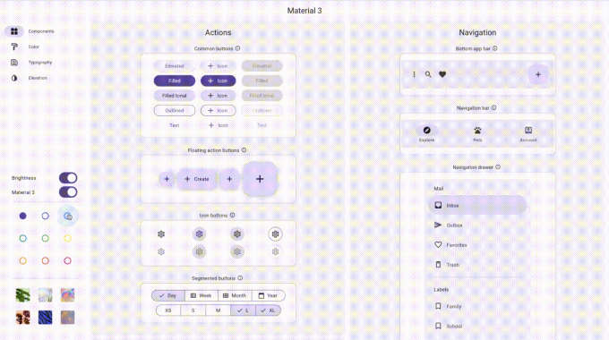

## Material 3 모션 지원

Material 3 모션 개선 사항에는 Easing 및 Durations 클래스가 추가되었습니다. Material 2 곡선은 "legacy"라는 단어가 포함된 이름으로 변경되었으며 결국 폐기되고 제거될 예정입니다. (#129942)

<!-- ui-log 수평형 -->
<ins class="adsbygoogle"
  style="display:block"
  data-ad-client="ca-pub-4877378276818686"
  data-ad-slot="9743150776"
  data-ad-format="auto"
  data-full-width-responsive="true"></ins>
<component is="script">
(adsbygoogle = window.adsbygoogle || []).push({});
</component>

## 편집 메뉴에 추가 옵션 추가하기

iOS의 기본 기능을 사용하면 사용자가 텍스트를 선택하고 여러 표준 서비스를 제공하는 공유 메뉴를 시작할 수 있습니다. 이 릴리스에서는 look up, search, 및 share 옵션을 추가했습니다.

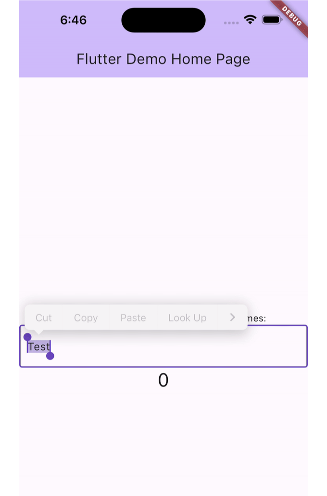

## 전역 텍스트 스케일 계수를 지정하는 TextScaler

<!-- ui-log 수평형 -->
<ins class="adsbygoogle"
  style="display:block"
  data-ad-client="ca-pub-4877378276818686"
  data-ad-slot="9743150776"
  data-ad-format="auto"
  data-full-width-responsive="true"></ins>
<component is="script">
(adsbygoogle = window.adsbygoogle || []).push({});
</component>

안녕하세요! 안드로이드 14의 비선형 글꼴 확대 기능을 지원하기 위해 새로운 TextScaler 클래스가 등장했어요. 이 기능은 시각 장애인을 돕는 데 도움이 됩니다. Text.textScaleFactor 속성은 이제 TextScaler 클래스로 대체됩니다. (#128522)

## SelectionArea 업데이트

Flutter의 SelectionArea가 업데이트되어 마우스를 사용한 단일 또는 이중 클릭과 터치 장치에서의 길게 누름 동작과 관련된 네이티브 제스처를 지원합니다. 이러한 새로운 제스처는 SelectionArea와 SelectableRegion에서 기본적으로 사용할 수 있어요.

- 단일 클릭: 클릭한 위치에서 선택 영역을 설정합니다.
- 이중 클릭: 클릭한 위치의 단어를 선택합니다.
- 이중 클릭 + 드래그: 단어 블록에서 선택 영역을 확장합니다.

<!-- ui-log 수평형 -->
<ins class="adsbygoogle"
  style="display:block"
  data-ad-client="ca-pub-4877378276818686"
  data-ad-slot="9743150776"
  data-ad-format="auto"
  data-full-width-responsive="true"></ins>
<component is="script">
(adsbygoogle = window.adsbygoogle || []).push({});
</component>

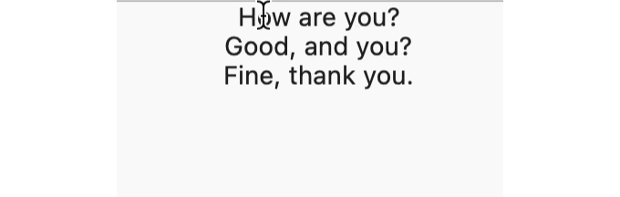

- 길게 누르고 드래그: 단어 블록에서 선택 영역을 확장합니다.

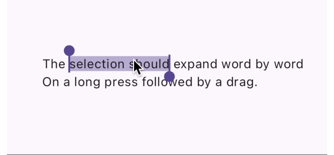

## 포커스된 위젯에서 작동하는 메뉴 항목

<!-- ui-log 수평형 -->
<ins class="adsbygoogle"
  style="display:block"
  data-ad-client="ca-pub-4877378276818686"
  data-ad-slot="9743150776"
  data-ad-format="auto"
  data-full-width-responsive="true"></ins>
<component is="script">
(adsbygoogle = window.adsbygoogle || []).push({});
</component>

이 릴리스에는 메뉴 항목을 사용할 때 포커스 변경을 정리한 내용이 포함되어 있어요. 이제 FocusManager의 applyFocusChangesIfNeeded 함수가 메뉴 포커스를 복원합니다. 사용자가 메뉴 항목을 클릭하면 포커스는 이미 메뉴가 열리기 전에 포커스가 있던 항목으로 돌아갑니다. (#130536)

## iOS, macOS에서 메뉴 항목 바로 가기의 자동 재정렬

Mac 플랫폼에서 실행되는 Flutter 앱들은 이제 메뉴에서 바로 가기 수정자를 Apple Human Interface Guidelines를 따라 순서대로 정렬합니다. (#129309)


<!-- ui-log 수평형 -->
<ins class="adsbygoogle"
  style="display:block"
  data-ad-client="ca-pub-4877378276818686"
  data-ad-slot="9743150776"
  data-ad-format="auto"
  data-full-width-responsive="true"></ins>
<component is="script">
(adsbygoogle = window.adsbygoogle || []).push({});
</component>


## MatrixTransition 애니메이션

새로운 MatrixTransition 위젯을 사용하면 애니메이션 전환 시 변환을 적용할 수 있습니다. 현재의 애니메이션 값에 따라 자식 위젯에 적용되는 행렬 변환을 제공하여 다음 GIF에 있는 것과 같은 효과를 만들 수 있습니다. (DartPad 예시) (#131084)

## flutter_test에 PaintPattern 추가

<!-- ui-log 수평형 -->
<ins class="adsbygoogle"
  style="display:block"
  data-ad-client="ca-pub-4877378276818686"
  data-ad-slot="9743150776"
  data-ad-format="auto"
  data-full-width-responsive="true"></ins>
<component is="script">
(adsbygoogle = window.adsbygoogle || []).push({});
</component>

flutter_test 패키지에서 새로운 PaintPattern 클래스를 통해 CustomPainters 및 Decorations과 같은 위젯에서 캔버스로 호출된 페인트 작업을 유효성 검사할 수 있습니다 (유닛 테스트에서 사용).

이전에는 올바른 색상 및 직사각형이 그려졌는지 확인하기 위해 골든 파일이 필요했지만 이제 PaintPattern을 사용할 수 있습니다. 다음 예제는 MyWidget이 캔버스에 원을 그렸는지 확인합니다:

```js
expect(
  find.byType(MyWidget),
  paints
    ..circle(
      x: 10,
      y: 10,
      radius: 20,
      color: const Color(0xFFF44336),
    ),
);
// 여러 페인트 호출을 연결할 수도 있습니다.
expect(
  find.byType(MyWidget),
  paints
    ..circle(
      x: 10,
      y: 10,
      radius: 20,
      color: const Color(0xFFF44336),
    ),
    ..image(
      image: MyImage,
      x: 20,
      y: 20,
    ),
);
```

이 API는 이전에 프레임워크 테스트 파일까지 깊숙이 존재했었는데, 일부 개발자들이 매우 유용하다고 느껴 자신의 프로젝트로 복사했다는 것을 알 수 있었습니다. 이 적용 사항이 해당된다면, Flutter 3.16로 업그레이드한 후 프로젝트에서 복사본을 삭제할 수 있습니다.

<!-- ui-log 수평형 -->
<ins class="adsbygoogle"
  style="display:block"
  data-ad-client="ca-pub-4877378276818686"
  data-ad-slot="9743150776"
  data-ad-format="auto"
  data-full-width-responsive="true"></ins>
<component is="script">
(adsbygoogle = window.adsbygoogle || []).push({});
</component>

## 스크롤 업데이트

플러터 3.13에서 이차원 스크롤 기반을 처음으로 출시한 이후, 이번 릴리스는 더 많은 기능과 완성을 제공합니다. 플러터 3.16에서 2D 기반은 이제 KeepAlive 위젯을 지원하며 기본 포커스 탐색 및 암묵적 스크롤링을 지원합니다. 2D 스크롤 위젯들은 이 기반 위에 구축되어 이 지원을 자동으로 채택할 것입니다. 2D 기반으로 개발하는 포괄적인 가이드에 대해서는 Flutter Build Show의 최신 에피소드를 참조하세요.

3.13 릴리스 직후, two_dimensional_scrollables 패키지가 출시되었습니다. 이 패키지는 플러터 팀에 의해 유지보수되며, 이 프레임워크의 기반 위에 구축된 처음 몇 가지 2D 스크롤 위젯 중 하나인 TableView이 포함되어 있습니다. 처음 출시 이후, 추가적인 버그 수정으로 더 많은 장식 및 스타일 지원이 추가되었습니다.

# 엔진

<!-- ui-log 수평형 -->
<ins class="adsbygoogle"
  style="display:block"
  data-ad-client="ca-pub-4877378276818686"
  data-ad-slot="9743150776"
  data-ad-format="auto"
  data-full-width-responsive="true"></ins>
<component is="script">
(adsbygoogle = window.adsbygoogle || []).push({});
</component>

## 임펠러

## 안드로이드

이번 릴리스에서는 안정 채널에서 미리보기 피드백을 위해 임펠러 안드로이드 버전이 준비되었다는 기쁜 소식을 전합니다. 올해 초부터 팀은 임펠러를 위한 Vulkan 백엔드에 열심히 작업해 왔으며, 이번 미리보기에는 Vulkan 호환 기기에서 임펠러의 특성에 대한 피드백을 수집하는 것이 포함되어 있습니다.

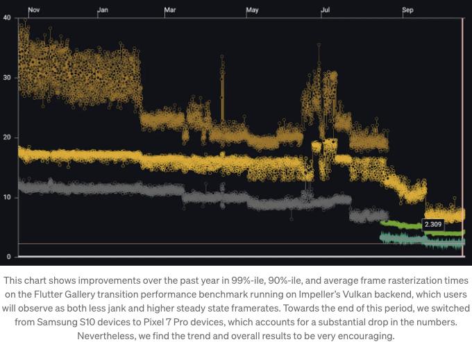

<!-- ui-log 수평형 -->
<ins class="adsbygoogle"
  style="display:block"
  data-ad-client="ca-pub-4877378276818686"
  data-ad-slot="9743150776"
  data-ad-format="auto"
  data-full-width-responsive="true"></ins>
<component is="script">
(adsbygoogle = window.adsbygoogle || []).push({});
</component>

임펠러는 아직 Vulkan을 지원하지 않는 장치에서 잘 동작하지 않을 것으로 예상됩니다. 임펠러의 OpenGL 백엔드를 다음 몇 달 동안 기능 완전성을 갖추게 하면서, 미래 안정 버전에서 이러한 장치에서의 임펠러의 특성에 대한 피드백도 받을 계획입니다.

Flutter 개발자들은 flutter run에 --enable-impeller 플래그를 전달하거나, 아래 설정을 프로젝트의 AndroidManifest.xml 파일의 `application` 태그 아래에 추가함으로써 Vulkan을 지원하는 안드로이드 장치에서 임펠러를 시도해 볼 수 있습니다:

```js
<meta-data
  android:name="io.flutter.embedding.android.EnableImpeller"
  android:value="true" />
```

임펠러가 장치가 Vulkan을 지원하는지 판단하기 위해, 임펠러는 임펠러 리포지토리 문서에서 논의된 테스트를 사용합니다. 일반적으로, 임펠러는 Android API 레벨 29 이상을 실행하는 64비트 OS에서 Vulkan 백엔드를 사용합니다. 사용자는 또한 Vulkan을 지원하는지 확인하는 조언을 따라 장치가 Vulkan을 지원하는지 확인할 수도 있습니다.

<!-- ui-log 수평형 -->
<ins class="adsbygoogle"
  style="display:block"
  data-ad-client="ca-pub-4877378276818686"
  data-ad-slot="9743150776"
  data-ad-format="auto"
  data-full-width-responsive="true"></ins>
<component is="script">
(adsbygoogle = window.adsbygoogle || []).push({});
</component>

저희가 Impeller의 Vulkan 백엔드에 대한 진척 상황에 자신감을 가지고 있지만, 미리보기 기간 동안 알려진 몇 가지 문제가 있습니다:

- 플랫폼 뷰가 아직 구현되지 않았고, 플랫폼 뷰를 포함해야 하는 프레임이 다소 성능이 좋지 않습니다.
- 사용자 정의 쉐이더가 아직 구현되지 않았습니다.
- 알려진 버그와 누락된 기능의 전체 목록은 GitHub의 Impeller 프로젝트 보드에 가장 최신 정보가 있습니다. 많은 문제는 이미 3.17 베타에서 곧 해결될 예정이니, 꼭 한 번 시도해보세요.

저희는 시도해본 Vulkan 호환 Android 기기에서 Impeller의 성능과 안정성에 대해 일반적으로 만족하고 있습니다. 그러나 iOS와 비교할 때, Android 하드웨어 생태계는 훨씬 다양하며, iOS보다 Android에 대한 안정 채널의 기본 백엔드로 만들기 전에 iOS보다 Android에 대한 미리보기 기간이 더 길 것으로 예상됩니다. 그렇기 때문에 Impeller에 대한 가장 유용한 피드백은 발생한 문제가 발생한 특정 기기와 Android 버전에 대한 자세한 정보를 포함해야 합니다.

또한, Impeller의 Vulkan 백엔드는 Skia와 사용하는 것 이상의 "디버그" 빌드에서 추가 디버깅 기능을 활성화하며, 이러한 기능은 추가 실행시간 부하가 있습니다. 따라서 Impeller의 성능에 대한 피드백은 프로필 또는 릴리스 빌드에서 와야 하며, 동일한 기기에서 Skia 백엔드와 비교한 DevTools의 타임라인을 포함해야 합니다. 마지막으로, 항상 작은 문제를 재현할 수 있는 테스트 케이스를 포함하는 피드백에 대해 매우 감사드립니다.

<!-- ui-log 수평형 -->
<ins class="adsbygoogle"
  style="display:block"
  data-ad-client="ca-pub-4877378276818686"
  data-ad-slot="9743150776"
  data-ad-format="auto"
  data-full-width-responsive="true"></ins>
<component is="script">
(adsbygoogle = window.adsbygoogle || []).push({});
</component>

## 임펠러 성능, 충실도 및 안정성

올해 초부터 Vulkan 백엔드에 초점을 맞추는 것 외에도, 팀은 안드로이드와 iOS 모두에 이점을 가져다주는 임펠러의 텍스트 성능을 개선했습니다. 특히, 임펠러의 글리프 아틀라스 관리 및 텍스트 워크로드가 엔진의 UI 및 래스터 스레드 전체로 분할되는 방식에 개선 사항이 있습니다. 결과적으로 사용자들은 텍스트 집중적인 작업에서 덜 지체를 느낄 것입니다.

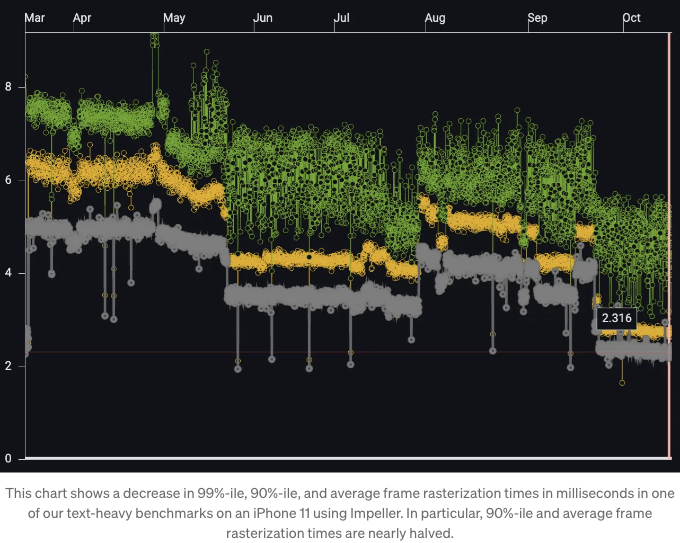

팀은 사용자들이 신고한 안드로이드 및 iOS에 대한 충실도 및 안정성 개선에도 공들였습니다. 특히, 이 안정적인 릴리스 주기의 세 달 동안, 팀은 플러터/엔진 레포지토리로 209개의 임펠러 관련 커밋을 하여 217개의 이슈를 해결했으며, 그 중 42개는 사용자가 보고한 충실도, 안정성 또는 성능 문제에 관한 것입니다.

<!-- ui-log 수평형 -->
<ins class="adsbygoogle"
  style="display:block"
  data-ad-client="ca-pub-4877378276818686"
  data-ad-slot="9743150776"
  data-ad-format="auto"
  data-full-width-responsive="true"></ins>
<component is="script">
(adsbygoogle = window.adsbygoogle || []).push({});
</component>

## 엔진 성능

모바일 장치의 이질적인 다중 처리에 더 나은 성능을 지원하기 위해 엔진을 수정했습니다. UI 및 래스터 스레드와 같이 성능에 민감한 스레드가 장치의 더 강력한 코어를 선호하도록 설정했습니다. 이 변경 사항이 다양한 벤치마크 및 장치에서 긍정적인 영향을 미쳤다는 점을 확인했습니다. 일부 케이스에서는 개선이 두드러지게 나타났으며, 99% -ile 또는 90% -ile 프레임 시간이 절반 또는 그 이상 향상되었습니다. 이 변경으로 인해 Skia 및 Impeller 백엔드의 Android에서 더 적은 지연을 느낄 것으로 예상됩니다. iOS 장치에서는 더 강력한 코어와 덜 강력한 코어 간의 차이가 더 작기 때문에 효과가 덜 두드러집니다.

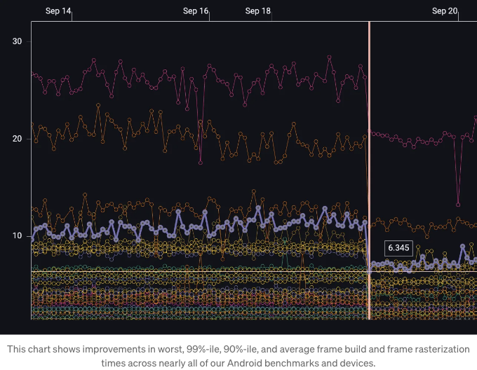

## API 및 신뢰도 개선

<!-- ui-log 수평형 -->
<ins class="adsbygoogle"
  style="display:block"
  data-ad-client="ca-pub-4877378276818686"
  data-ad-slot="9743150776"
  data-ad-format="auto"
  data-full-width-responsive="true"></ins>
<component is="script">
(adsbygoogle = window.adsbygoogle || []).push({});
</component>

## 임펠러 성능 오버레이

지난 릴리스에서는 임펠러와 함께 플러터의 성능 오버레이 기능이 표시되지 않았습니다. 이 릴리스에서는 이 문제가 해결되었습니다. 성능 오버레이가 이제 올바르게 표시되며 임펠러가 활성화되어 있습니다.

## 디더링이 이제 올바르게 표시됩니다

이 릴리스에서는 Paint.enableDithering 속성이 true로 설정되어 기본 설정으로 활성화되었으며, 플러터의 폐기 정책에 따라 폐기되었습니다. 이제 디더링이 기본적으로 활성화되며(개발자 구성 가능 디더링은 더 이상 지원되지 않음), 밴딩 문제가 더 이상 발생하지 않습니다. 이 변경 사항 및 이관 안내서의 전체 설명을 보려면 docs.flutter.dev의 파괴적 변경 페이지를 참조하십시오.

<!-- ui-log 수평형 -->
<ins class="adsbygoogle"
  style="display:block"
  data-ad-client="ca-pub-4877378276818686"
  data-ad-slot="9743150776"
  data-ad-format="auto"
  data-full-width-responsive="true"></ins>
<component is="script">
(adsbygoogle = window.adsbygoogle || []).push({});
</component>

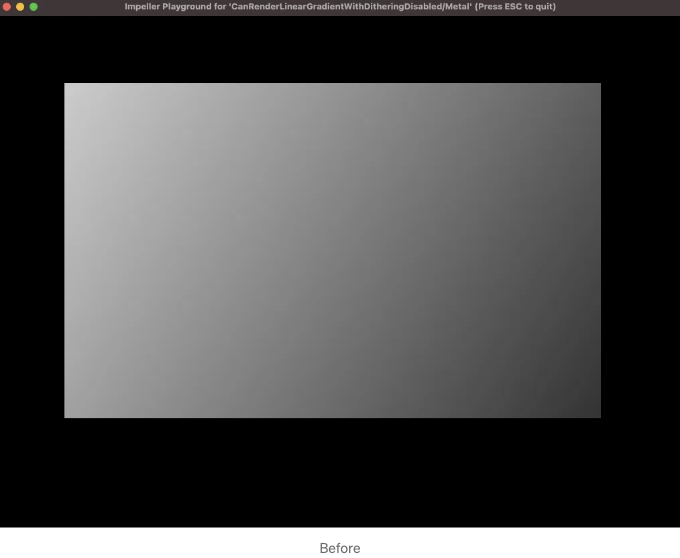

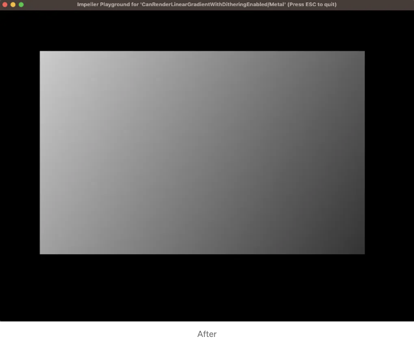

# 게임

## 플러터 게임 툴킷

<!-- ui-log 수평형 -->
<ins class="adsbygoogle"
  style="display:block"
  data-ad-client="ca-pub-4877378276818686"
  data-ad-slot="9743150776"
  data-ad-format="auto"
  data-full-width-responsive="true"></ins>
<component is="script">
(adsbygoogle = window.adsbygoogle || []).push({});
</component>

지난 몇 년 동안, 우리는 캐주얼 게임 개발을 둘러싼 커뮤니티가 성장하는 것을 목격해왔어요. Flutter를 사용하여 게시된 게임은 수만 개에 이릅니다. 단순하지만 재미있는 퍼즐부터 더 복잡한 아케이드 게임까지 가장 좋아하는 몇 가지를 살펴보자면, 이터맥스(Etermax)의 'Trivia Crack', 로툼(Lotum)의 '4 Pics 1 Word' (단어 추측 게임), 동 디지털(Dong Digital)의 'Brick Mania' (아케이드 게임), 온리즌(Onrizon)의 'StopotS' (카테고리 게임), 저희가 I/O를 위해 Flutter로 만든 레트로 핀볼 게임, 그리고 소셜 및 메뉴 화면에서 Flutter를 사용하는 PUBG mobile이 있어요.


게임 개발자들이 더 생산적이 되도록 돕기 위해, 플러터(Flutter)는 "카주얼 게임 툴킷"의 주요 업데이트를 발표했어요. 이는 카드 게임, 출구 없는 러너 게임과 같은 장르별 템플릿뿐만 아니라 Play Games Services, 앱 내 구매, 광고, 업적, 크래쉬리틱스 및 멀티플레이어 지원과 같은 서비스 통합과 같은 새로운 리소스 모음입니다. 더 자세한 내용은 Zoey Fan이 작성한 게임 툴킷 런칭 포스트를 확인해보세요.

# 웹

<!-- ui-log 수평형 -->
<ins class="adsbygoogle"
  style="display:block"
  data-ad-client="ca-pub-4877378276818686"
  data-ad-slot="9743150776"
  data-ad-format="auto"
  data-full-width-responsive="true"></ins>
<component is="script">
(adsbygoogle = window.adsbygoogle || []).push({});
</component>

## 크롬 개발 도구에서 플러터 타임라인 이벤트

플러터 타임라인 이벤트는 이제 크롬 개발 도구의 성능 패널에서 노출되었습니다. (#130132)

더 알아보려면, 웹 앱의 성능 디버깅을 확인해보세요.

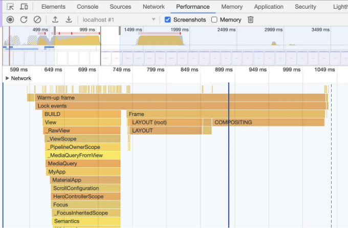

<!-- ui-log 수평형 -->
<ins class="adsbygoogle"
  style="display:block"
  data-ad-client="ca-pub-4877378276818686"
  data-ad-slot="9743150776"
  data-ad-format="auto"
  data-full-width-responsive="true"></ins>
<component is="script">
(adsbygoogle = window.adsbygoogle || []).push({});
</component>

# Android

## 마우스 스크롤 휠 지원

안드로이드의 대형 화면 지침을 충족하도록  Wonderous를 최적화하는 동안 한 가지 문제를 발견했습니다. 태블릿이나 폴더블 장치에서 마우스 스크롤 휠이 잘 작동하지 않았습니다. 사용자가 화면이 반응하도록 스크롤 휠을 상당히 많이 움직여야 하는 것이 널리 알려졌습니다.

이번 릴리스를 통해 플러터 뷰에서 마우스로 스크롤할 때 안드로이드 장치의 스크롤 속도에 맞게 일치하도록 설정되었습니다. (44724)

<!-- ui-log 수평형 -->
<ins class="adsbygoogle"
  style="display:block"
  data-ad-client="ca-pub-4877378276818686"
  data-ad-slot="9743150776"
  data-ad-format="auto"
  data-full-width-responsive="true"></ins>
<component is="script">
(adsbygoogle = window.adsbygoogle || []).push({});
</component>

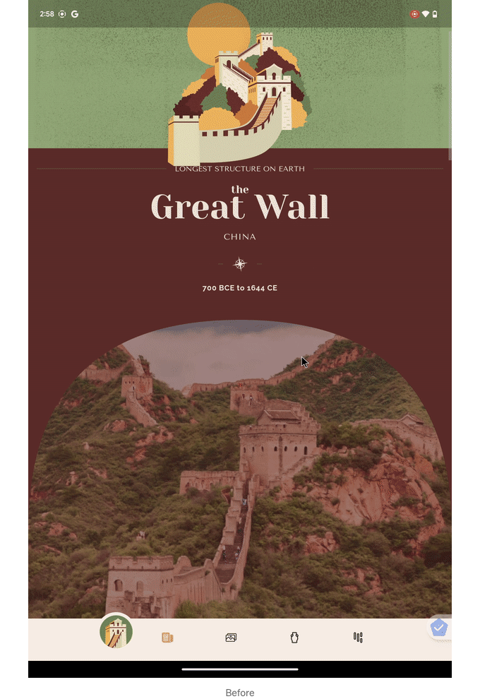

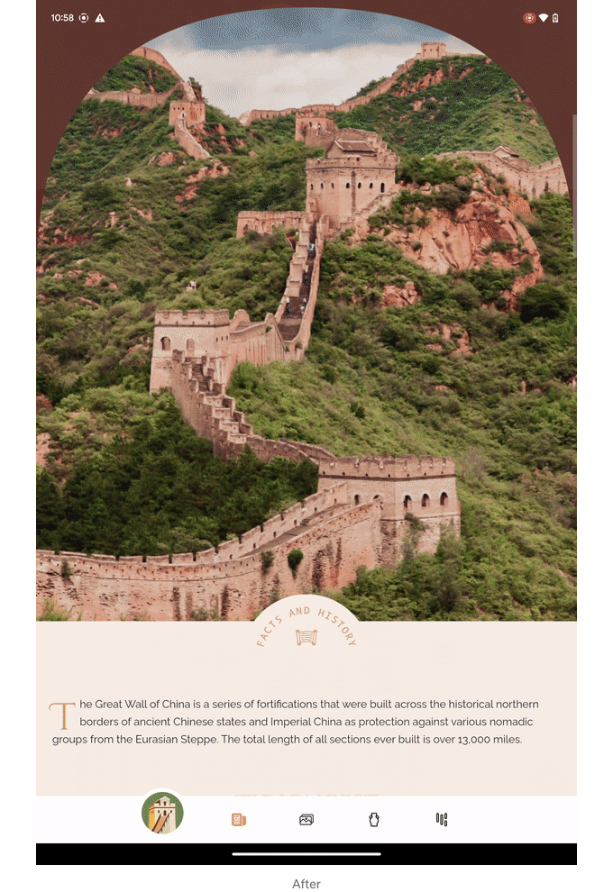

## 예측적인 뒤로 이동

Android 14 릴리스에는 디바이스의 뒤로 제스처를 사용하여 현재 화면 뒤의 홈 화면을 "살펴볼 수" 있는 예측적인 뒤로 제스처 기능이 포함되어 있습니다. 이 업데이트로 Flutter에 예측적인 뒤로 제스처를 가져왔습니다! 마이그레이션 가이드를 확인해보세요.

<!-- ui-log 수평형 -->
<ins class="adsbygoogle"
  style="display:block"
  data-ad-client="ca-pub-4877378276818686"
  data-ad-slot="9743150776"
  data-ad-format="auto"
  data-full-width-responsive="true"></ins>
<component is="script">
(adsbygoogle = window.adsbygoogle || []).push({});
</component>

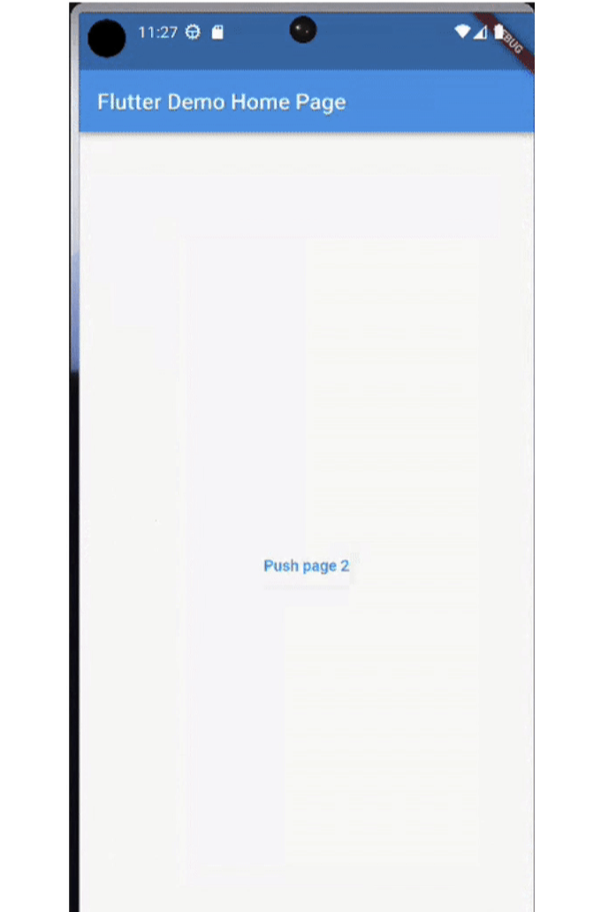

# iOS

## 앱 확장

플러터는 이제 일부 iOS 앱 확장에 대상으로 사용될 수 있습니다. 이는 Flutter 위젯을 사용하여 특정 유형의 iOS 앱 확장을 위한 UI를 그릴 수 있다는 것을 의미합니다. API에는 제한 사항(예: 홈 화면 위젯)이 있을 수 있기 때문에 모든 종류의 앱 확장에 대해 작동하지 않을 수 있습니다. 메모리 등을 고려해야 합니다.

<!-- ui-log 수평형 -->
<ins class="adsbygoogle"
  style="display:block"
  data-ad-client="ca-pub-4877378276818686"
  data-ad-slot="9743150776"
  data-ad-format="auto"
  data-full-width-responsive="true"></ins>
<component is="script">
(adsbygoogle = window.adsbygoogle || []).push({});
</component>

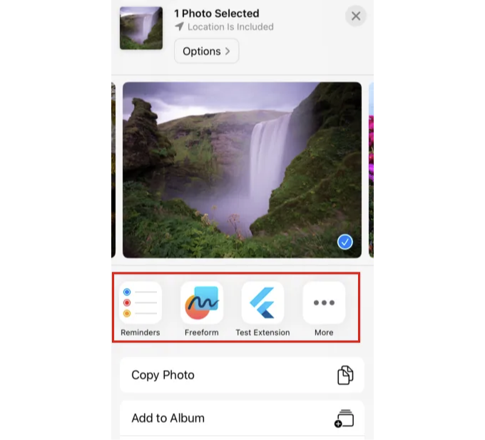

추가된 iOS 앱 확장 기능에 대한 Share 확장을 타깃팅하는 방법과 예제를 보려면 docs.flutter.dev의 Adding iOS app extensions를 참고하세요.

# 패키지 생태계

## 새로운 Flutter 인기 패키지

<!-- ui-log 수평형 -->
<ins class="adsbygoogle"
  style="display:block"
  data-ad-client="ca-pub-4877378276818686"
  data-ad-slot="9743150776"
  data-ad-format="auto"
  data-full-width-responsive="true"></ins>
<component is="script">
(adsbygoogle = window.adsbygoogle || []).push({});
</component>

플러터 즐겨찾기 프로그램이 다시 시작되었습니다! 이번 주기에는 플러터 생태계 위원회가 flame, flutter_animate, flutter_rust_bridge, riverpod, video_player, macos_ui 및 fpdart 패키지를 새로운 플러터 즐겨찾기로 지정했습니다. 축하합니다!

앞으로의 플러터 즐겨찾기도 기대해주세요. 잠재적인 플러터 즐겨찾기로 패키지 또는 플러그인을 지명하거나 위원회에 어떤 문제든 알리려면 flutter-committee@googlegroups.com으로 이메일을 보내세요.


## 첫 번째 패키지 생태계 가상 정상회의

<!-- ui-log 수평형 -->
<ins class="adsbygoogle"
  style="display:block"
  data-ad-client="ca-pub-4877378276818686"
  data-ad-slot="9743150776"
  data-ad-format="auto"
  data-full-width-responsive="true"></ins>
<component is="script">
(adsbygoogle = window.adsbygoogle || []).push({});
</component>

지난 8월에는 패키지 생태계를 위한 처음으로 가상 서밋을 진행했어요. 이 서밋에는 pub.dev에 참여하는 50명 이상의 구글 외부 및 내부 기여자가 참석했죠. 이 서밋의 목표는 커뮤니티 간 함께 토론하고 계획을 세우며 교육하고 배우는 공간을 제공하는 것이었어요. 참석자들의 만족도는 이후 조사 결과 100%였어요. 앞으로도 패키지 생태계를 위해 비슷한 이벤트를 커뮤니티와 함께 진행할 계획입니다. 패키지 생태계 업데이트 블로그 포스트에서 자세한 내용을 확인해주세요.

## 클라우드 기반 구글 지도 스타일링

Google Maps 플랫폼은 Google Cloud 콘솔의 Map Styles 페이지를 통해 지도 스타일을 사용자 정의할 수 있는 기능을 제공해요. 이를 통해 스타일을 변경할 때마다 앱 코드를 업데이트할 필요 없이 사용자 정의 경험을 만들 수 있어요.

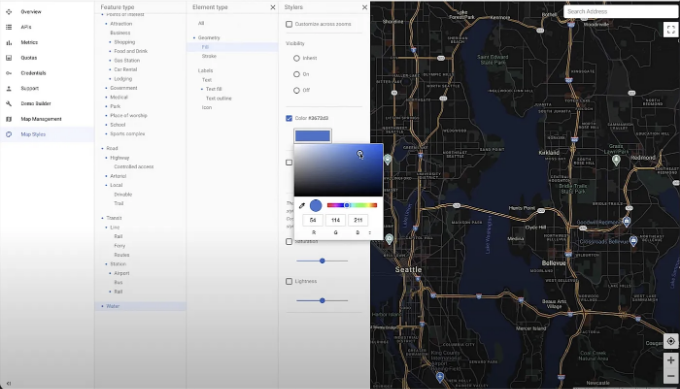

<!-- ui-log 수평형 -->
<ins class="adsbygoogle"
  style="display:block"
  data-ad-client="ca-pub-4877378276818686"
  data-ad-slot="9743150776"
  data-ad-format="auto"
  data-full-width-responsive="true"></ins>
<component is="script">
(adsbygoogle = window.adsbygoogle || []).push({});
</component>

플러터에서 이 기능을 사용하려면 콘솔에서 설정한 맵 ID를 사용하여 맵을 참조하면 됩니다:

```js
GoogleMap(
        onMapCreated: _onMapCreated,
        initialCameraPosition: const CameraPosition(
          target: _kMapCenter,
          zoom: 7.0,
        ),
        key: _key,
        cloudMapId: _mapId
);
```

## Camera X 개선 사항

3.10 안정 버전에서는 Flutter 카메라 플러그인에 Camera X 지원을 추가했습니다. Camera X는 Jetpack 라이브러리로 안드로이드 앱에 풍부한 카메라 기능을 간단하게 추가할 수 있습니다.

<!-- ui-log 수평형 -->
<ins class="adsbygoogle"
  style="display:block"
  data-ad-client="ca-pub-4877378276818686"
  data-ad-slot="9743150776"
  data-ad-format="auto"
  data-full-width-responsive="true"></ins>
<component is="script">
(adsbygoogle = window.adsbygoogle || []).push({});
</component>

이 릴리스에서는 카메라를 사용하는 앱에 필요한 대부분의 기능을 추가했습니다. CameraX는 플러그인의 Camera 2 구현에서 발생하는 많은 문제를 해결합니다.

CameraX 플러그인을 사용하도록 권장합니다. 참여하려면 다음 줄을 pubspec.yaml 파일에 추가하십시오.

```js
Dependencies:
 camera: ^0.10.4 # 또는 최신 카메라 버전을 시도하십시오
 camera_android_camerax: ^0.5.0
```

CameraX를 향후 릴리스에서 기본 구현으로 만들 계획이므로 피드백을 기다리고 있습니다.

<!-- ui-log 수평형 -->
<ins class="adsbygoogle"
  style="display:block"
  data-ad-client="ca-pub-4877378276818686"
  data-ad-slot="9743150776"
  data-ad-format="auto"
  data-full-width-responsive="true"></ins>
<component is="script">
(adsbygoogle = window.adsbygoogle || []).push({});
</component>

## macOS 비디오 플레이어

비디오 플레이어 플러그인에 macOS 지원이 추가되어, 개발자들이 위젯 화면에서 비디오를 재생할 수 있게 되었습니다.

더 자세한 내용은 pub.dev의 비디오 플레이어 플러그인을 확인해보세요.

# DevTools

<!-- ui-log 수평형 -->
<ins class="adsbygoogle"
  style="display:block"
  data-ad-client="ca-pub-4877378276818686"
  data-ad-slot="9743150776"
  data-ad-format="auto"
  data-full-width-responsive="true"></ins>
<component is="script">
(adsbygoogle = window.adsbygoogle || []).push({});
</component>

## DevTools 확장 기능

새로운 DevTools 확장 프레임워크를 통해 다음이 가능해집니다:

- 패키지 개발자들은 DevTools에서 직접적으로 사용할 수 있는 맞춤 도구를 자체 패키지에 구축할 수 있습니다.
- 패키지 개발자들은 DevTools의 기존 프레임워크와 유틸리티를 활용하는 강력한 도구를 작성할 수 있습니다.
- Dart 및 Flutter 개발자들은 DevTools로 앱을 디버깅할 때 앱의 종속성 및 해당 종속성이 제공하는 DevTools 확장 기능에 따라 특정한 유증을 얻을 수 있습니다.

Provider, Drift 및 Patrol의 패키지 개발자들 덕분에 이미 이러한 생태계가 구축되고 있으며, 지금 당장 해당 패키지용 DevTools 확장 기능을 사용할 수 있습니다!

<!-- ui-log 수평형 -->
<ins class="adsbygoogle"
  style="display:block"
  data-ad-client="ca-pub-4877378276818686"
  data-ad-slot="9743150776"
  data-ad-format="auto"
  data-full-width-responsive="true"></ins>
<component is="script">
(adsbygoogle = window.adsbygoogle || []).push({});
</component>

아래는 마크다운 형식으로 표시합니다.


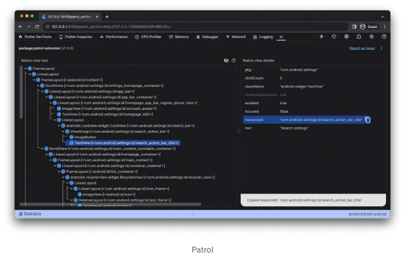

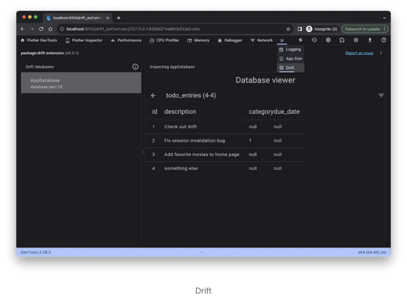

더 깊게 살펴보고 싶다면 켄지 데이비슨(Kenzie Davisson)이 업데이트한 Dart와 Flutter DevTools 확장 기능을 확인해보세요.

<!-- ui-log 수평형 -->
<ins class="adsbygoogle"
  style="display:block"
  data-ad-client="ca-pub-4877378276818686"
  data-ad-slot="9743150776"
  data-ad-format="auto"
  data-full-width-responsive="true"></ins>
<component is="script">
(adsbygoogle = window.adsbygoogle || []).push({});
</component>

## DevTools 업데이트

이번 릴리스에서 DevTools의 주요 업데이트 사항은 다음과 같습니다:

- DevTools 확장 기능 지원 추가
- 연결된 앱에 대한 요약을 보여주는 새로운 "홈" 화면 추가

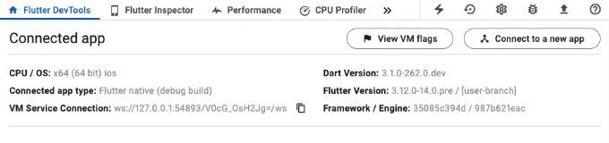

<!-- ui-log 수평형 -->
<ins class="adsbygoogle"
  style="display:block"
  data-ad-client="ca-pub-4877378276818686"
  data-ad-slot="9743150776"
  data-ad-format="auto"
  data-full-width-responsive="true"></ins>
<component is="script">
(adsbygoogle = window.adsbygoogle || []).push({});
</component>

기타 개선 사항은 다음과 같습니다:

- 전반적인 성능
- 핫 재시작 강도
- 텍스트 선택 및 복사 동작
- 네트워크 프로파일러 응답 뷰어 세련됨

더 자세한 내용은 DevTools 2.26.1, 2.27.0 및 2.28.1 릴리스 노트를 확인해보세요.

## VS Code UI 더 쉽게 찾아보기

<!-- ui-log 수평형 -->
<ins class="adsbygoogle"
  style="display:block"
  data-ad-client="ca-pub-4877378276818686"
  data-ad-slot="9743150776"
  data-ad-format="auto"
  data-full-width-responsive="true"></ins>
<component is="script">
(adsbygoogle = window.adsbygoogle || []).push({});
</component>

플러터 커뮤니티 멤버 DanTup의 놀라운 작업 덕분에 Flutter VS Code 확장 프로그램에 이제 Flutter 사이드바가 생겼어요. 이 사이드바를 통해 다음을 간편하게 이용할 수 있어요:

- Flutter DevTools 스크린 열기
- 활성 디버그 세션 보기
- 사용 가능한 기기 보기
- 새 프로젝트 생성
- 핫 리로드 및 재시작
- Flutter Doctor -v 실행
- 그 외 기능들

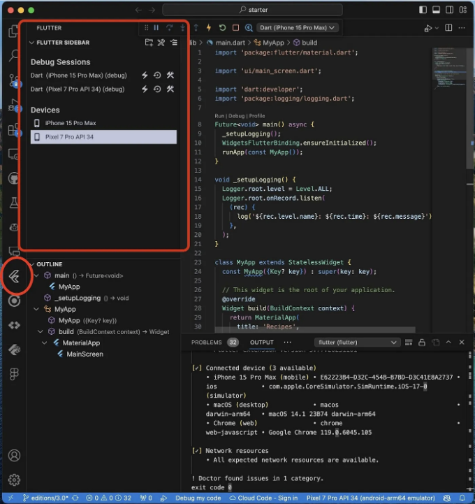

# 사용되지 않는 기능 및 중요 변경사항

<!-- ui-log 수평형 -->
<ins class="adsbygoogle"
  style="display:block"
  data-ad-client="ca-pub-4877378276818686"
  data-ad-slot="9743150776"
  data-ad-format="auto"
  data-full-width-responsive="true"></ins>
<component is="script">
(adsbygoogle = window.adsbygoogle || []).push({});
</component>

## 사용 중단 및 주요 변경 사항

이 릴리즈의 주요 변경 사항에는 v3.13 릴리스 이후 만료된 사용 중단된 API가 포함되어 있습니다. 영향을 받는 모든 API와 추가적인 컨텍스트 및 이주 안내를 보려면 이 릴리스의 사용 중단 가이드를 참조하세요. 이러한 많은 사항은 Flutter fix에서 지원되며 IDE에서 빠른 수정이 가능합니다. 대량 수정은 dart fix 명령을 사용하여 평가하고 적용할 수 있습니다.

언제나 커뮤니티에 테스트를 기여해주신 모든 분들께 많은 감사드립니다. 이들은 이러한 주요 변경 사항을 식별하는 데 도움이 됩니다. 더 알아보려면 Flutter의 주요 변경 정책을 확인하세요.

다음 릴리즈에서 우리는 이미 지원되는 flutter 및 flutter_test 패키지에 추가하여 flutter_driver 패키지의 사용 중단 정책을 확대할 계획입니다.

<!-- ui-log 수평형 -->
<ins class="adsbygoogle"
  style="display:block"
  data-ad-client="ca-pub-4877378276818686"
  data-ad-slot="9743150776"
  data-ad-format="auto"
  data-full-width-responsive="true"></ins>
<component is="script">
(adsbygoogle = window.adsbygoogle || []).push({});
</component>

# 결론

이 공지의 시작에서 수요자 수를 언급했습니다. 이는 의도적인 것입니다. 여러분, 우리 멋진 커뮤니티 없이 Flutter는 오늘날의 즐거움과 생산성 있는 도구가 되지 못했을 것입니다. 감사합니다.

이 릴리스에 포함된 모든 PR 목록을 확인하려면 릴리스 노트와 변경 로그를 참조하세요.

Flutter 3.16은 오늘부터 stable 채널에서 사용할 수 있으며, Dart 3.2를 포함하고 있습니다. 이 최신 업데이트로 시작하려면 flutter upgrade만 하면 됩니다.

<!-- ui-log 수평형 -->
<ins class="adsbygoogle"
  style="display:block"
  data-ad-client="ca-pub-4877378276818686"
  data-ad-slot="9743150776"
  data-ad-format="auto"
  data-full-width-responsive="true"></ins>
<component is="script">
(adsbygoogle = window.adsbygoogle || []).push({});
</component>

곧 다시 만나요!