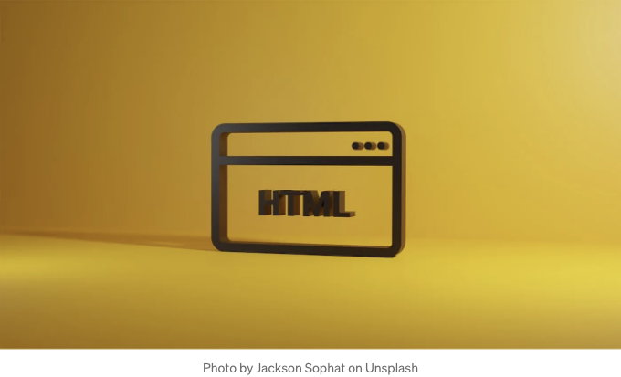
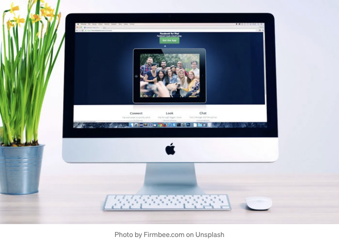
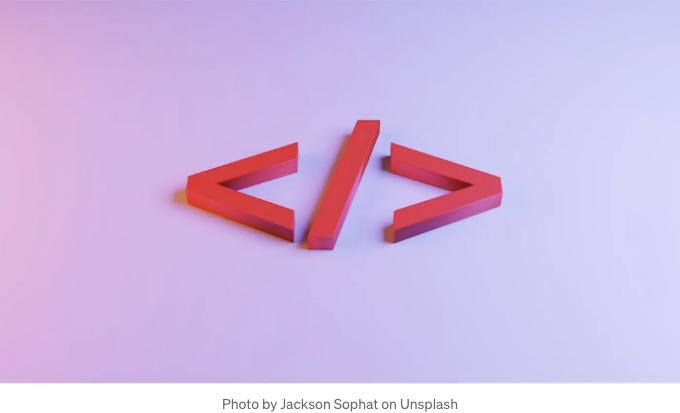

막 시작한 사람이거나 저와 같이 중간에 있는 사람이거나 숙련된 개발자이거나 블로그/사이트를 더욱 맞춤화하려는 누군가이던, 이 세 가지 요령은 여러분의 코딩 도구 상자에 가치를 더할 수 있습니다.

Flexbox를 활용한 쉬운 가운데 정렬



<!-- ui-log 수평형 -->

<ins class="adsbygoogle"
  style="display:block"
  data-ad-client="ca-pub-4877378276818686"
  data-ad-slot="9743150776"
  data-ad-format="auto"
  data-full-width-responsive="true"></ins>
<component is="script">
(adsbygoogle = window.adsbygoogle || []).push({});
</component>

요소를 가운데 정렬하는 것은 복잡할 수 있지만 매우 흔한 작업입니다. Flexbox는 몇 줄의 코드로 이 작업을 간단하게 만들어줍니다. 부모 요소 내에서 div를 가운데 정렬하려면 아래 스타일을 적용하세요:

```js
.centered-div {
  display: flex;
  justify-content: center;
  align-items: center;
  height: 100vh; /* 이는 전체 뷰포트 높이를 보장합니다 */
}
```

이렇게 하면 화면 크기에 관계없이 내용물이 완벽하게 가운데 정렬됩니다.

체크박스 및 라디오 버튼을 원하는 방식으로 스타일링하기

<!-- ui-log 수평형 -->

<ins class="adsbygoogle"
  style="display:block"
  data-ad-client="ca-pub-4877378276818686"
  data-ad-slot="9743150776"
  data-ad-format="auto"
  data-full-width-responsive="true"></ins>
<component is="script">
(adsbygoogle = window.adsbygoogle || []).push({});
</component>


모던 웹 디자인에 필요한 멋진 요소가 기본 폼 요소에는 부족할 수 있어요. 기본 입력란을 숨기고 가상 요소를 사용하여 돋보이는 사용자 지정 디자인을 만들 수 있어요.

```js
.custom-checkbox {
  opacity: 0;
  position: absolute;
}
.custom-checkbox + label:before {
  content: ' ';
  display: inline-block;
  width: 15px;
  height: 15px;
  background-color: #f0f0f0;
  /* 추가적인 사용자 정의 */
}
```

이 방법을 사용하면 폼 요소의 외관을 완전히 제어할 수 있어요.

<!-- ui-log 수평형 -->

<ins class="adsbygoogle"
  style="display:block"
  data-ad-client="ca-pub-4877378276818686"
  data-ad-slot="9743150776"
  data-ad-format="auto"
  data-full-width-responsive="true"></ins>
<component is="script">
(adsbygoogle = window.adsbygoogle || []).push({});
</component>

자바스크립트 없이 반응형 내비게이션



오늘날의 모바일 중심 세상에서는 반응형 내비게이션 메뉴가 필수입니다. 이를 숨겨진 체크박스를 사용하여 숨김/표시하면서 순수 CSS로 구현할 수 있습니다:

```css
#nav-toggle {
  display: none;
}

#nav-toggle:checked + .menu {
  display: block;
}
```

<!-- ui-log 수평형 -->

<ins class="adsbygoogle"
  style="display:block"
  data-ad-client="ca-pub-4877378276818686"
  data-ad-slot="9743150776"
  data-ad-format="auto"
  data-full-width-responsive="true"></ins>
<component is="script">
(adsbygoogle = window.adsbygoogle || []).push({});
</component>

이 기술을 활용하면 자바스크립트에 의존하지 않고 다양한 기기에 적응하는 내비게이션이 가능합니다.

공유하고 싶은 간단하지만 유용한 코딩 팁 있나요? 댓글로 공유해주세요!

면책 조항 및 출처:

이런 팁을 구현할 때 브라우저 호환성을 고려해야 합니다. 일관된 사용자 경험을 보장하려면 항상 다양한 브라우저와 기기로 테스트해야 합니다.

<!-- ui-log 수평형 -->

<ins class="adsbygoogle"
  style="display:block"
  data-ad-client="ca-pub-4877378276818686"
  data-ad-slot="9743150776"
  data-ad-format="auto"
  data-full-width-responsive="true"></ins>
<component is="script">
(adsbygoogle = window.adsbygoogle || []).push({});
</component>

