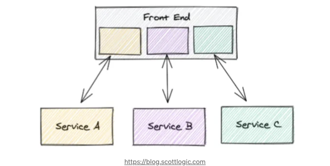
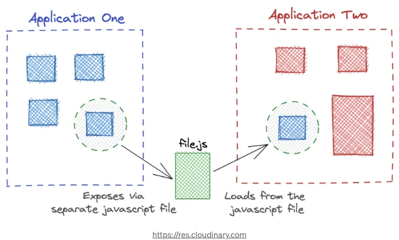
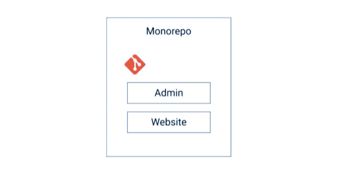

## 안녕하세요, 마이크로프론트엔드에서 사용되는 다양한 관행을 공유할게요. 출발!

# 마이크로프론트엔드 개념

마이크로프론트엔드는 웹 애플리케이션 UI (프론트 엔드)가 다양한 그룹이 다양한 기술을 사용하여 작업할 수 있는 반자율적 섹션으로 생성되는 패턴입니다. 마이크로프론트엔드 아키텍처는 백엔드 아키텍처와 유사하며 백엔드가 반자율적인 마이크로서비스로부터 생성됩니다. 각 마이크로프론트엔드에는 자체 리포지토리, 자체 package.json 문서 및 자체 버전 관리 도구 설정이 있습니다. 따라서 각 마이크로프론트엔드에는 독립적인 버전 프로세스와 독립적인 배포/CI가 있습니다.

<!-- ui-log 수평형 -->

<ins class="adsbygoogle"
  style="display:block"
  data-ad-client="ca-pub-4877378276818686"
  data-ad-slot="9743150776"
  data-ad-format="auto"
  data-full-width-responsive="true"></ins>
<component is="script">
(adsbygoogle = window.adsbygoogle || []).push({});
</component>

# Single-SPA

single-spa은 프론트엔드 응용 프로그램에서 다른 JavaScript 마이크로 프론트엔드를 통합하는 프레임워크입니다. single-spa를 활용하여 프론트엔드를 설계하면 여러 이점을 누릴 수 있습니다:

- 페이지 새로 고침 없이 전체 동의를 이룬 다중 구조 사용 가능(React, AngularJS, Angular, Ember 또는 사용 중인 어떤 것이라도)
- 마이크로 프론트엔드를 독립적으로 배포
- 기존 응용 프로그램 수정 없이 다른 구조를 사용하여 코드 작성
- 초기로드 시간을 개선하기 위해 코드를 지연 로드
- 예시: single-spa org

# Multi Page Application (MPA)

<!-- ui-log 수평형 -->

<ins class="adsbygoogle"
  style="display:block"
  data-ad-client="ca-pub-4877378276818686"
  data-ad-slot="9743150776"
  data-ad-format="auto"
  data-full-width-responsive="true"></ins>
<component is="script">
(adsbygoogle = window.adsbygoogle || []).push({});
</component>

멀티페이지 애플리케이션은 매우 많은 페이지로 구성된 웹 애플리케이션으로, 정보가 변경될 때마다 완전히 새로 고쳐집니다. 정보 변경이나 서버로의 정보 전송은 브라우저에서 새로운 페이지가 표시되도록 합니다.

멀티페이지 애플리케이션은 더 전통적인 아키텍처를 가지고 있습니다. 각 페이지는 서버로 요청을 보내고 모든 정보를 완전히 새로 고칩니다. 정보가 작더라도 그렇습니다. 따라서 동일한 요소를 표시하는 데 시간이 소요됩니다.

# 모듈 연맹

<!-- ui-log 수평형 -->

<ins class="adsbygoogle"
  style="display:block"
  data-ad-client="ca-pub-4877378276818686"
  data-ad-slot="9743150776"
  data-ad-format="auto"
  data-full-width-responsive="true"></ins>
<component is="script">
(adsbygoogle = window.adsbygoogle || []).push({});
</component>

Module Federation은 Webpack에 추가된 모듈입니다. 이를 통해 원하는 대로 프로젝트를 조립하고 적응시킬 수 있는 기회와 유연성을 제공합니다.

Module Federation은 JavaScript 애플리케이션이 다른 애플리케이션에서 코드를 동적으로로드하고 그 과정에서 환경을 공유할 수 있도록 합니다. 통합 모듈을 사용하는 애플리케이션이 통합된 코드에서 필요로 하는 종속성을 가지고 있지 않은 경우, Webpack은 그 통합된 버전에서 누락된 종속성을 다운로드합니다.

# 저장소 모노 레포지토리의 아키텍처

<!-- ui-log 수평형 -->

<ins class="adsbygoogle"
  style="display:block"
  data-ad-client="ca-pub-4877378276818686"
  data-ad-slot="9743150776"
  data-ad-format="auto"
  data-full-width-responsive="true"></ins>
<component is="script">
(adsbygoogle = window.adsbygoogle || []).push({});
</component>

모노 레포(모노레포)는 다양한 작업을 저장하는 아카이브입니다. 페이스북, 구글, 마이크로소프트, 트위터, 우버와 같은 거대 기술 기업들이 오랜 기간 동안 사용해왔습니다. 모노레포 내의 각 프로젝트는 미크로프론트엔드처럼 독립적이며 독립적으로 작동할 수 있습니다.

아직 이 주제를 잘 모르는 사람들 중 일부는 모노레포와 모노리스를 비교하는데, 이는 안타깝게도 잘못된 비교입니다. 그러나 모노레포는 코드 아카이브이며, 모노리스는 일반적으로 거대한 코드베이스입니다. 모노리스는 모노리스, 미크로프론트엔드 및 마이크로서비스에도 사용될 수 있습니다.

# Nx Workspace Tool + Monorepo (완벽한 조합)

<!-- ui-log 수평형 -->

<ins class="adsbygoogle"
  style="display:block"
  data-ad-client="ca-pub-4877378276818686"
  data-ad-slot="9743150776"
  data-ad-format="auto"
  data-full-width-responsive="true"></ins>
<component is="script">
(adsbygoogle = window.adsbygoogle || []).push({});
</component>

Nx 워크스페이스는 Angular DevKit을 기반으로 한 TypeScript 기반의 단일 저장소 도구로, 워크스페이스, CLI, 클라우드 기반의 계산 리소스 예약 및 탁월한 언어 수준의 IDE 지원을 제공합니다.

다음의 실용적인 기사를 추천합니다:

- Nx 워크스페이스로 Angular 앱 빌드하기
- Nx를 활용하여 개발 라이프사이클 단순화하기
- Nx 워크스페이스를 시작하는 방법에 대한 비디오:

# 결론:

<!-- ui-log 수평형 -->

<ins class="adsbygoogle"
  style="display:block"
  data-ad-client="ca-pub-4877378276818686"
  data-ad-slot="9743150776"
  data-ad-format="auto"
  data-full-width-responsive="true"></ins>
<component is="script">
(adsbygoogle = window.adsbygoogle || []).push({});
</component>

이러한 것들이 마이크로프론트엔드 사용 시 사용되는 몇 가지 관행들입니다. 어떤 것이 더 나은지 나쁜지 말하는 것이 아니라, 옵션에 대한 초기 접근 방식을 제공하는 것입니다.

어떤 것이든 100% 확장 가능하지는 않습니다. 항상 개발할 프로젝트의 맥락과 시나리오 내에서 최상을 찾으십시오.

제 LinkedIn에 원본이 게시되었습니다: linkedin.com/in/davifsroberto
