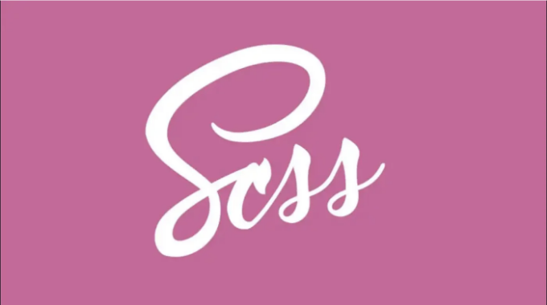

여기서 Sass를 사용한 고급 스타일링에 대해 이야기하고 있습니다. 이를 통해 사용자 정의 SCSS 클래스를 작성할 때 웹 디자인의 효율성을 향상시킬 수 있습니다.

# Sass 변수:

Sass를 사용하면 문자열, 숫자, 색상, 부울 값, 리스트 및 널과 같은 다양한 변수 유형을 활용할 수 있습니다. 예를 들어:

<!-- ui-log 수평형 -->
<ins class="adsbygoogle"
  style="display:block"
  data-ad-client="ca-pub-4877378276818686"
  data-ad-slot="9743150776"
  data-ad-format="auto"
  data-full-width-responsive="true"></ins>
<component is="script">
(adsbygoogle = window.adsbygoogle || []).push({});
</component>

```scss
$myColor: red;
$myWidth: 680px;

.sampleClass {
  color : $myColor;
  width: $myWidth;
}
```

위의 코드에서 .sampleClass는 Sass 변수를 사용하여 색상과 너비를 제공하여 스타일링을 유연하고 유지보수 가능하게 합니다.

# SCSS 중첩:

Sass는 SCSS에서 중첩을 소개하여 스타일을 보다 구조화되고 가독성있게 구성할 수 있습니다. 다음의 SCSS 코드:```  

<!-- ui-log 수평형 -->
<ins class="adsbygoogle"
  style="display:block"
  data-ad-client="ca-pub-4877378276818686"
  data-ad-slot="9743150776"
  data-ad-format="auto"
  data-full-width-responsive="true"></ins>
<component is="script">
(adsbygoogle = window.adsbygoogle || []).push({});
</component>

```js
.content {
  margin: 20px;

  a {
    color: #2ecc71;

    &:hover {
      text-decoration: underline;
    }
  }
}
```

위 코드는 다음과 같은 CSS 코드와 동일합니다:

```js
.content {
  margin: 20px;
}

.content a {
  color: #2ecc71;
}

.content a:hover {
  text-decoration: underline;
}
```

# Sass 파일 가져오기:

<!-- ui-log 수평형 -->
<ins class="adsbygoogle"
  style="display:block"
  data-ad-client="ca-pub-4877378276818686"
  data-ad-slot="9743150776"
  data-ad-format="auto"
  data-full-width-responsive="true"></ins>
<component is="script">
(adsbygoogle = window.adsbygoogle || []).push({});
</component>

CSS와 유사하게, Sass는 외부 파일을 포함하기 위한 @import 지시문을 지원합니다. 예를 들어:

```js
// _colors.scss 파일
$myColor: #EE82EE;
```

```js
@import "colors";
body {
  color: $myColor;
}
```

이를 통해 외부 파일에서 특정 스타일을 가져와 코드 조직화와 유지 보수성을 높일 수 있는 모듈식 접근이 가능합니다.

<!-- ui-log 수평형 -->
<ins class="adsbygoogle"
  style="display:block"
  data-ad-client="ca-pub-4877378276818686"
  data-ad-slot="9743150776"
  data-ad-format="auto"
  data-full-width-responsive="true"></ins>
<component is="script">
(adsbygoogle = window.adsbygoogle || []).push({});
</component>

# Sass 확장 클래스:

@extend은 Sass에서 스타일을 상속할 수 있게 해주어 스타일시트의 중복을 줄이는 기능입니다. 이를 통해 일관성을 유지하여 유지보수가 향상됩니다.

```js
.text {
  font-family: 'Arial', sans-serif;
  font-size: 16px;
  color: #333;
}

// @extend를 사용하여 스타일 적용
p {
  @extend .text;
  font-weight: 400; // <p>에 대한 특정 스타일 추가
}

span {
  @extend .text;
  font-weight: 600; // <span>에 대한 특정 스타일 추가
}
``` 

# Sass에서 함수 사용하기:

<!-- ui-log 수평형 -->
<ins class="adsbygoogle"
  style="display:block"
  data-ad-client="ca-pub-4877378276818686"
  data-ad-slot="9743150776"
  data-ad-format="auto"
  data-full-width-responsive="true"></ins>
<component is="script">
(adsbygoogle = window.adsbygoogle || []).push({});
</component>

Sass 함수를 사용하면 계산을 수행하여 동적 스타일링을 가능하게 하며, 더 다양하고 재사용 가능한 스타일을 만들 수 있습니다.

```js
@function calculateMarginLeft($n) {
  // 계산 수행 후 값을 반환
  @return $n * 10px;
}

.sample {
  float: left;
  margin-left: calculateMarginLeft(4);
}
```

# If Else 조건 사용:

Sass의 조건문(@if 및 @else if)을 사용하면 특정 조건에 기반하여 스타일을 적용할 수 있습니다.

<!-- ui-log 수평형 -->
<ins class="adsbygoogle"
  style="display:block"
  data-ad-client="ca-pub-4877378276818686"
  data-ad-slot="9743150776"
  data-ad-format="auto"
  data-full-width-responsive="true"></ins>
<component is="script">
(adsbygoogle = window.adsbygoogle || []).push({});
</component>

```js
@function get-text-color($input) {
  @if $input == "light" {
    @return #333;
  } @else if $input == "dark" {
    @return #fff;
  }
}

.text {
  font-size: 16px;
  color: get-text-color("light");
}
```

# SCSS에서 For 루프 사용하기:

Sass @each 루프는 여러 요소에 대한 스타일 생성을 간편화하여 효율성을 높입니다.

```js
// 초기값을 가진 테마 색상 맵 설정
$theme-colors: (
  "primary": #3498db,
  "secondary": #2ecc71,
  "success": #28a745,
  "info": #17a2b8,
  "warning": #ffc107,
  "danger": #dc3545,
  "light": #f8f9fa,
  "dark": #343a40
);

// 테마 색상 맵을 순회하며 스타일 생성
@each $state, $color in $theme-colors {
  .text-#{$state} {
    color: $color;
  }
}
```

<!-- ui-log 수평형 -->
<ins class="adsbygoogle"
  style="display:block"
  data-ad-client="ca-pub-4877378276818686"
  data-ad-slot="9743150776"
  data-ad-format="auto"
  data-full-width-responsive="true"></ins>
<component is="script">
(adsbygoogle = window.adsbygoogle || []).push({});
</component>

위의 코드는 다음과 같습니다:

```js
.text-primary {
  color: #3498db;
}

.text-secondary {
  color: #2ecc71;
}

.text-success {
  color: #28a745;
}

.text-info {
  color: #17a2b8;
}

.text-warning {
  color: #ffc107;
}

.text-danger {
  color: #dc3545;
}

.text-light {
  color: #f8f9fa;
}

.text-dark {
  color: #343a40;
}
```

# 색상 함수:

Sass 색상 함수인 lighten과 같은 것들을 사용하면 색상을 동적으로 조작할 수 있습니다. 이 예시는 이러한 함수가 어떻게 다양한 색상 조합을 만들어내는 것을 단순화해주는지를 보여줍니다. 이를 통해 스타일 시트에서 각 색상 값을 수동으로 지정하지 않고도 동적으로 조정할 수 있습니다.

<!-- ui-log 수평형 -->
<ins class="adsbygoogle"
  style="display:block"
  data-ad-client="ca-pub-4877378276818686"
  data-ad-slot="9743150776"
  data-ad-format="auto"
  data-full-width-responsive="true"></ins>
<component is="script">
(adsbygoogle = window.adsbygoogle || []).push({});
</component>

위의 내용을 한국어로 번역하면 다음과 같습니다:

```js
$myColor: #004776;
.sample {
  color: lighten($myColor, 20%);
}
```

결과는 아래와 같이 나타납니다:

```js
.sample {
  color: #0084dc;
}
```

함수, if-else 조건 및 루프를 SCSS 코드에서 사용하여 스타일을 생성하는 과정을 더 쉽고 조직적으로 만들 수 있다는 것을 이해하실 수 있습니다. 이러한 도구들을 사용하면 값 계산, 색상 구성 관리 및 스타일 일관성 적용에 도움이 되어 코드가 효율적이고 다양한 디자인 요구에 적응 가능하게 됩니다.

<!-- ui-log 수평형 -->
<ins class="adsbygoogle"
  style="display:block"
  data-ad-client="ca-pub-4877378276818686"
  data-ad-slot="9743150776"
  data-ad-format="auto"
  data-full-width-responsive="true"></ins>
<component is="script">
(adsbygoogle = window.adsbygoogle || []).push({});
</component>

# Sass 믹스인

Sass 믹스인에 대해 더 알아보려면 여기를 클릭하세요.