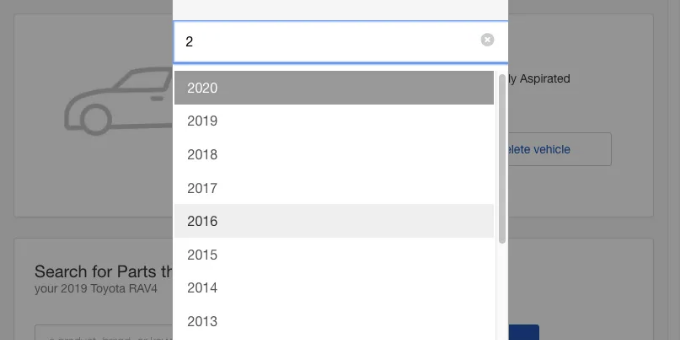
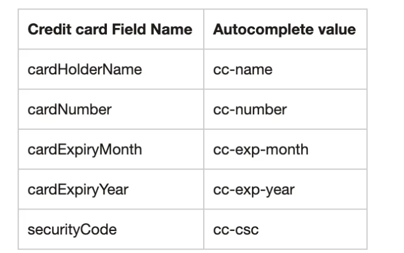
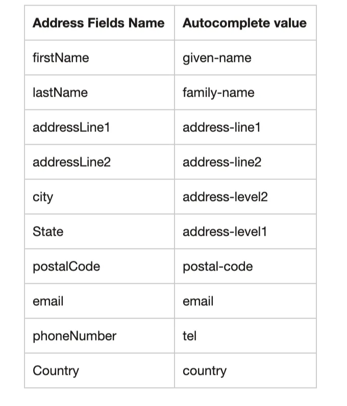

By Shanmuga Priya Pandiyan

사용자에게 요청하는 것이 적을수록 사용자는 양식을 작성하려는 경향이 높아지고, 빠른 양식 작성은 전환율을 높입니다. 브라우저는 이를 돕기 위해 자동완성 기능을 제공합니다. 이 기사에서는 웹 양식에서 자동완성 기능을 효과적으로 사용하는 방법에 대해 논의합니다.

전자 상거래에서 고객이 자주 작성하는 두 가지 주요 양식은 주소 양식과 신용카드 양식입니다. 이 두 양식은 거래를 완료하는 데 중요합니다. 사용자가 양식 작성 중에 결함을 경험하면 세션을 중단할 수 있습니다. 특히 게스트 사용자의 경우 그렇습니다. 고객들은 로그인하는 것이 더 많은 약속을 필요로하기 때문에 게스트 체크아웃을 선택합니다. 우리는 게스트 흐름을 가능한 한 빠르고 편리하게 만들기 위해 정말 열심히 노력해야 합니다. 말할 것도 없이, 더 적은 입력으로 원활한 프로세스는 고객이 계속해서 사이트로 돌아오거나 회원으로 전환되도록 도와줄 것입니다.

<!-- ui-log 수평형 -->

<ins class="adsbygoogle"
  style="display:block"
  data-ad-client="ca-pub-4877378276818686"
  data-ad-slot="9743150776"
  data-ad-format="auto"
  data-full-width-responsive="true"></ins>
<component is="script">
(adsbygoogle = window.adsbygoogle || []).push({});
</component>

# 자동입력이 작동하는 방식

폼에서 자동입력을 작동시키는 것은 비교적 쉽습니다. 자동완성 속성 표준을 따르기만 하면 됩니다. 각 브라우저에서 데이터 처리 및 자동입력은 기본적으로 처리되므로 추가 작업이 필요하지 않습니다. 모바일 폰의 카드 스캐닝 기능은 브라우저 자동입력 기능의 하위 집합입니다.

이제 각 폼을 따로 살펴보겠습니다.

# 신용카드 폼

<!-- ui-log 수평형 -->

<ins class="adsbygoogle"
  style="display:block"
  data-ad-client="ca-pub-4877378276818686"
  data-ad-slot="9743150776"
  data-ad-format="auto"
  data-full-width-responsive="true"></ins>
<component is="script">
(adsbygoogle = window.adsbygoogle || []).push({});
</component>

신용카드 필수 항목은 신용카드 번호, 만료일, 보안 코드, 그리고 카드 소유자 이름입니다.

안드로이드와 iOS에서는 신용카드 번호가 마법처럼 자동으로 입력되지만, 만료일과 카드 소유자 이름은 iOS에서 작동하려면 특정한 형식을 갖추어야 합니다. 저희가 폼 인터페이스를 설계할 당시에는 각 필드에 대해 별도의 표준이 수립되어 있다는 사실을 알지 못했습니다. 연구를 통해 가장 인기 있는 전자상거래 사이트들이 자동입력이 작동하도록 필드를 분할하거나 병합하는 것을 확인했습니다. 여기서 우리의 조사 결과를 필드별로 공유하겠습니다.

가) 만료일 필드 작동 방식

만료일 필드를 레이아웃하는 방법에는 월과 연도를 모두 받는 단일 필드로 또는 두 개의 별도 필드로 나누는 방법이 있습니다.

<!-- ui-log 수평형 -->

<ins class="adsbygoogle"
  style="display:block"
  data-ad-client="ca-pub-4877378276818686"
  data-ad-slot="9743150776"
  data-ad-format="auto"
  data-full-width-responsive="true"></ins>
<component is="script">
(adsbygoogle = window.adsbygoogle || []).push({});
</component>

웹 표준은 autocomplete 속성 값을 두 옵션 모두 지원하도록 규정하지만, Android/Chrome 자동완성만이 웹 표준을 따릅니다. iOS/Safari 자동완성은 만료 날짜 필드를 만료 월과 만료 연도로 나누어야만 만료 날짜를 자동완성합니다.

iOS/Safari의 동작은 고객들을 답답하게 만듭니다. 자동완성 제안으로 각 카드 세부 필드가 모두 채워질 것처럼 보이지만 실제로는 카드 번호만이 입력됩니다. 사용자가 저희를 계속 이용할 수 있도록 이러한 마찰을 피해야 합니다. 여러 플랫폼에서 자동완성이 작동하도록 하기 위해, 저희 신용카드 양식은 만료 월과 년도 필드를 분리했습니다.

b) 카드 소지자 이름 필드의 작동 방식

카드 소지자 이름 필드는 단일 필드로 또는 이름과 성을 따로 나누어서 배치하는 두 가지 방법이 있습니다.

<!-- ui-log 수평형 -->

<ins class="adsbygoogle"
  style="display:block"
  data-ad-client="ca-pub-4877378276818686"
  data-ad-slot="9743150776"
  data-ad-format="auto"
  data-full-width-responsive="true"></ins>
<component is="script">
(adsbygoogle = window.adsbygoogle || []).push({});
</component>

안드로이드는 두 가지 형식을 지원하지만, iOS에서는 하나의 필드만 있어야 합니다. 이름 필드와 성 필드를 사용하면 iOS에서 이름을 자동으로 채워주지 않습니다. 이는 흐름에 마찰을 일으키며 피해야 할 부분입니다. 사용자가 입력해야 하는 내용을 줄일수록, 사용자가 흐름에 집중할 수 있는 기회가 더 많아집니다. 결제 과정이 원활할수록, 사용자가 다음 구매를 위해 다시 사이트를 방문할 가능성이 커집니다. 손님 계정으로 결제하는 경우, 손님 사용자를 회원으로 전환하는 데 중요합니다.

여러 플랫폼에서 성공적인 자동완성을 위해 필요한 사항

1. 저희는 경험상 아래의 autocomplete 속성 값을 따르면 여러 플랫폼에서 성공적으로 자동완성할 수 있다는 것을 발견했습니다.

참고: 보안상의 이유로 보안 코드는 절대 자동으로 채워지지 않아야 합니다.

<!-- ui-log 수평형 -->

<ins class="adsbygoogle"
  style="display:block"
  data-ad-client="ca-pub-4877378276818686"
  data-ad-slot="9743150776"
  data-ad-format="auto"
  data-full-width-responsive="true"></ins>
<component is="script">
(adsbygoogle = window.adsbygoogle || []).push({});
</component>

2. 자동완성에 대한 한 가지 중요한 점은 웹 페이지가 HTTPS를 통해 제공되어야 하며 유효한 인증서가 필요하다는 것입니다.

## 주소 양식

신용 카드 양식과 달리, 주소 양식은 아주 잘 작동합니다. 아래 자동완성 속성 값을 따르면 양식 작성이 원활해집니다.

<!-- ui-log 수평형 -->

<ins class="adsbygoogle"
  style="display:block"
  data-ad-client="ca-pub-4877378276818686"
  data-ad-slot="9743150776"
  data-ad-format="auto"
  data-full-width-responsive="true"></ins>
<component is="script">
(adsbygoogle = window.adsbygoogle || []).push({});
</component>

전화번호 필드에 대해 보다 구체적인 수준으로 가려면 다음 속성 값을 사용하십시오:

- tel-country-code
- tel-national
- tel-area-code
- tel-local
- tel-local-prefix
- tel-local-suffix
- tel-extension

자세한 내용은 이 자동완성 표준을 참조하십시오.

<!-- ui-log 수평형 -->

<ins class="adsbygoogle"
  style="display:block"
  data-ad-client="ca-pub-4877378276818686"
  data-ad-slot="9743150776"
  data-ad-format="auto"
  data-full-width-responsive="true"></ins>
<component is="script">
(adsbygoogle = window.adsbygoogle || []).push({});
</component>

테스트, 테스트, 그리고 다시 테스트하세요.

마지막으로, 모든 대상 브라우저에서 폼이 작동함을 보장하기 위해 여러 브라우저에서 철저히 테스트해야 합니다.

# 사용자에게 최상의 사용자 경험을 제공합시다!

우리가 개선하고 반복해서 개선함으로써, 이제 사용자들이 더 적은 단계와 더 적은 타이핑으로 거래를 완료할 수 있는 웹 앱을 제공합니다. 이는 결제 과정이 원활해지고 체크아웃 변환율이 향상되는 결과를 가져왔습니다.

<!-- ui-log 수평형 -->

<ins class="adsbygoogle"
  style="display:block"
  data-ad-client="ca-pub-4877378276818686"
  data-ad-slot="9743150776"
  data-ad-format="auto"
  data-full-width-responsive="true"></ins>
<component is="script">
(adsbygoogle = window.adsbygoogle || []).push({});
</component>

