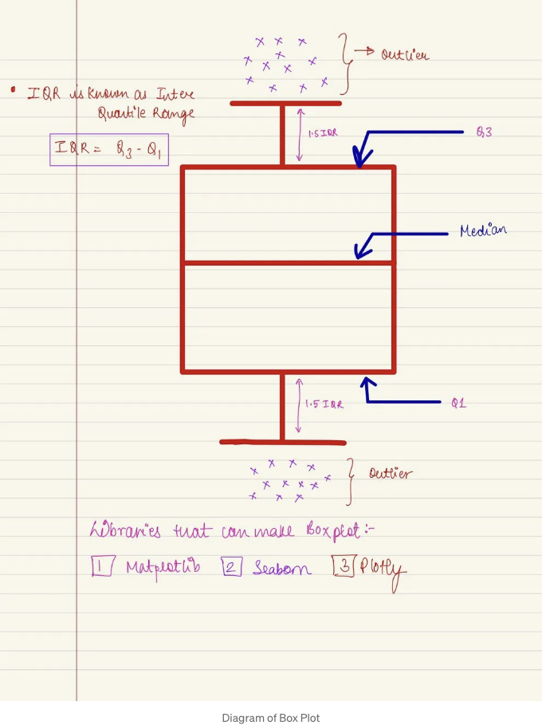
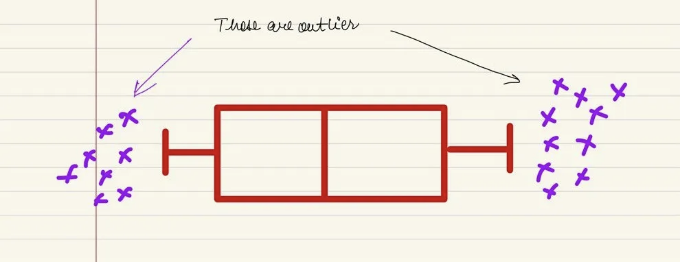

## 상자 그림: 탐색적 데이터 분석

상자 그림은 히스토그램과 마찬가지로 데이터 세트의 변동 패턴을 시각적으로 요약해줍니다. 상자 그림은 데이터 세트가 작을 때 또는 많은 서로 다른 분포를 비교할 때 특히 유용합니다.

더 나아가기 전에, 상자 그림의 다양한 요소에 대해 먼저 알아보겠습니다.

<!-- ui-log 수평형 -->
<ins class="adsbygoogle"
  style="display:block"
  data-ad-client="ca-pub-4877378276818686"
  data-ad-slot="9743150776"
  data-ad-format="auto"
  data-full-width-responsive="true"></ins>
<component is="script">
(adsbygoogle = window.adsbygoogle || []).push({});
</component>

IQR은 사분위 범위로 알려져 있으며, 수학적으로는 제3사분위와 제1사분위의 차이를 의미합니다.

상자 그림은 매우 다재다능한 기술이며, 데이터 과학에서 광범위하게 사용됩니다.

이것은 상자 그림의 다양한 사용 사례들입니다.

<!-- ui-log 수평형 -->
<ins class="adsbygoogle"
  style="display:block"
  data-ad-client="ca-pub-4877378276818686"
  data-ad-slot="9743150776"
  data-ad-format="auto"
  data-full-width-responsive="true"></ins>
<component is="script">
(adsbygoogle = window.adsbygoogle || []).push({});
</component>

[1] 데이터 세트에서 이상치를 감지하는 데 사용되며, 최고 값과 최저 값을 넘어 있는 데이터를 Outlier라고 합니다.

[2] 여러 데이터 세트가 있는 경우 상자 수염 그림을 사용하여 분포를 비교할 수 있습니다.

예: 회사에서 제공하는 제록스 복사기 서비스 및 유지보수를 제공하는 두 회사의 응답 시간을 비교하는 경우.

<!-- ui-log 수평형 -->
<ins class="adsbygoogle"
  style="display:block"
  data-ad-client="ca-pub-4877378276818686"
  data-ad-slot="9743150776"
  data-ad-format="auto"
  data-full-width-responsive="true"></ins>
<component is="script">
(adsbygoogle = window.adsbygoogle || []).push({});
</component>

[3] 상자 그림은 데이터를 시각적으로 요약해줍니다. 데이터의 평균값을 빠르게 파악할 수 있고, 데이터의 분산 정도와 데이터가 편향되어 있는지 여부도 파악할 수 있습니다.

이제 데이터 과학자로서 우리는 코드를 작성하는 것뿐만 아니라 데이터 기반의 결정에 관심이 있기 때문에 상자 그림을 사용하여 위 문제를 해결해 보겠습니다 ;).

내 교수님이 가르쳐주신 정확한 문제를 가져와서 문제를 해결하겠습니다. 그렇게 하면 더 쉬울 것 같아요, 하하 ;)

이제 상자 그림을 활용하여 이 문제를 해결해 봅시다.

<!-- ui-log 수평형 -->
<ins class="adsbygoogle"
  style="display:block"
  data-ad-client="ca-pub-4877378276818686"
  data-ad-slot="9743150776"
  data-ad-format="auto"
  data-full-width-responsive="true"></ins>
<component is="script">
(adsbygoogle = window.adsbygoogle || []).push({});
</component>

응답 시간 데이터를 가지고 있으며, 이제 Python을 사용하여 데이터를 분석할 DataFrame을 만들 것입니다.

다양한 라이브러리를 가져와봅시다.

이제 seaborn과 plotly를 사용하여 플롯(Plot)을 만들고 문제를 해결해봅시다.

<!-- ui-log 수평형 -->
<ins class="adsbygoogle"
  style="display:block"
  data-ad-client="ca-pub-4877378276818686"
  data-ad-slot="9743150776"
  data-ad-format="auto"
  data-full-width-responsive="true"></ins>
<component is="script">
(adsbygoogle = window.adsbygoogle || []).push({});
</component>

DataFrame를 확인한 후 X1_Corp가 가장 잘 수행되는 것 같지만, 상자 플롯을 그려본 후에 우리는 X1_Corp의 중앙 응답 시간이 247분인 반면 Z1_Corp의 중앙 응답 시간은 190분임을 발견했습니다.

결론:

[1] 명백하게 Z1_Corp가 X1_Corp와 비교하여 우수한 서비스를 제공하는 것을 볼 수 있습니다. 그들은 보다 일관적이고 더 빠릅니다.

[2] Z1_Corp의 중앙 응답 시간은 190분인 반면, X1_Corp의 중앙 응답 시간은 247분입니다.

<!-- ui-log 수평형 -->
<ins class="adsbygoogle"
  style="display:block"
  data-ad-client="ca-pub-4877378276818686"
  data-ad-slot="9743150776"
  data-ad-format="auto"
  data-full-width-responsive="true"></ins>
<component is="script">
(adsbygoogle = window.adsbygoogle || []).push({});
</component>

[3] X1_Corp의 응답 시간 변동성이 Z1_Corp의 응답 시간 변동성보다 큽니다.

그래서, 어떤 기업이 뛰어난 성과를 내고 있는 걸까요? (이 부분은 독자들을 위한 연습 문제로 남겨져 있습니다.)

안녕히 가세요!