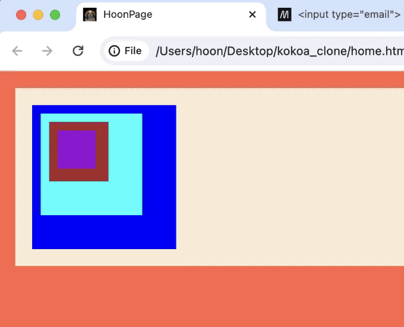

- 패딩: 상자의 테두리부터 내부까지의 공간입니다.

패딩 없이,


그리고 패딩을 적용하면: 위아래 및 좌우 각각 20px

<!-- ui-log 수평형 -->
<ins class="adsbygoogle"
  style="display:block"
  data-ad-client="ca-pub-4877378276818686"
  data-ad-slot="9743150776"
  data-ad-format="auto"
  data-full-width-responsive="true"></ins>
<component is="script">
(adsbygoogle = window.adsbygoogle || []).push({});
</component>

```js
body {
  background-color: antiquewhite;
  margin: 0px;
  padding: 20px 20px;
}
```


다른 활동을 해보겠습니다!

각기 다른 색으로 4개의 div 상자를 만들어보세요. 이 상자들은 div 상자 안에 div 상자가 있는 형태로 배치되어야 합니다. 어떻게? id 속성을 사용하세요!

<!-- ui-log 수평형 -->
<ins class="adsbygoogle"
  style="display:block"
  data-ad-client="ca-pub-4877378276818686"
  data-ad-slot="9743150776"
  data-ad-format="auto"
  data-full-width-responsive="true"></ins>
<component is="script">
(adsbygoogle = window.adsbygoogle || []).push({});
</component>

```js
<div id="firstDiv">
  <div id="secondDiv">
    <div id="thirdDiv">
      <div id="fourthDiv">
      </div>
    </div>
  </div>
</div>
```

그럼. 그들을 컬러하는 CSS 코드를 어떻게 적용할 수 있나요? 이렇게 해요:

```js
#firstDiv {
  background-color: aqua;
}
```

“#”는 id를 나타내요. #이 없으면 firstDiv는 html에 존재하지 않는 타그 요소일 뿐 이에요.

<!-- ui-log 수평형 -->
<ins class="adsbygoogle"
  style="display:block"
  data-ad-client="ca-pub-4877378276818686"
  data-ad-slot="9743150776"
  data-ad-format="auto"
  data-full-width-responsive="true"></ins>
<component is="script">
(adsbygoogle = window.adsbygoogle || []).push({});
</component>

하지만 위의 코드를 따라하면 두 개의 div 상자가 겹쳐서 하나만 보입니다. 그래서 전체 div 상자에 10px의 패딩을 주고 각 상자의 크기를 변경해봅시다:

